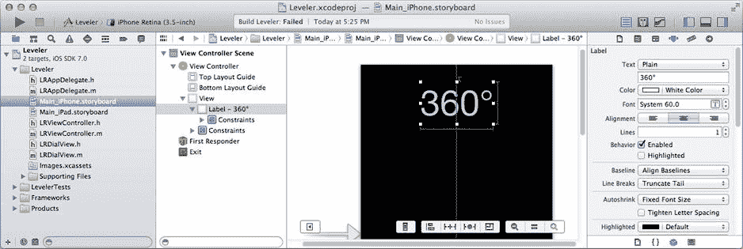
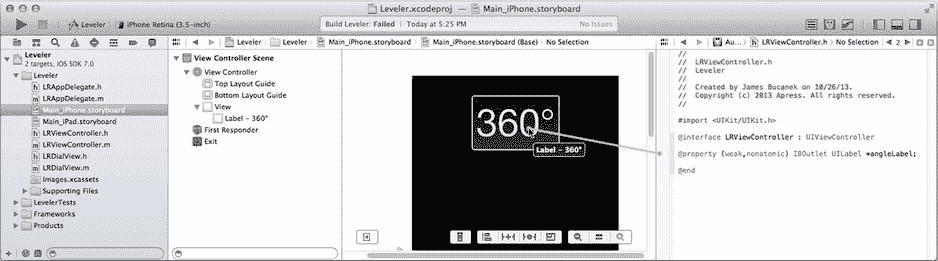

# 创建视图

你将在 Interface Builder 文件中添加一个标签对象，然后在 `LRViewController` 中编写代码，以编程方式创建 `LRDialView` 和用于显示刻度盘后方“指针”的图像视图。从 `Main_iPhone.storyboard`（或 `_iPad`）文件开始。

将一个标签对象拖入界面。使用属性检查器，进行以下更改：

- 文本：`360°`（按住 Option+Shift+8 输入度符号）
- 颜色：`白色`
- 字体：`System 60.0`（iPhone）或 `System 90.0`（iPad）
- 对齐方式：居中

选中标签对象，然后选择 Editor ➤ Size to Fit Content。将对象定位在界面顶部居中。选择根视图对象，将其背景颜色更改为 `黑色`。

选中标签，并添加以下约束：

固定其宽度（Editor ➤ Pin ➤ Width）  
固定其高度（Editor ➤ Pin ➤ Height）  
居中（Editor ➤ Align ➤ Horizontal Center in Container）  
按住 Control/右键拖拽到 `Top Layout Guide`，创建垂直间距约束  
使用属性检查器选中该约束，并勾选其 `Standard` 选项

完成后的界面应类似于图 16-3。



*图 16-3. 水平仪 Interface Builder 布局*

切换到助理编辑器。在右侧窗格中打开 `LRViewController.h` 文件，添加以下输出口属性：

```
@property (weak,nonatomic) IBOutlet UILabel *angleLabel;
```

将输出口连接到界面中的标签视图，如图 16-4 所示。



*图 16-4. 连接角度标签输出口*

你将通过编程方式创建并定位另外两个视图。切换回标准编辑器，选择 `LRViewController.m` 文件。你需要 `LRDialView` 类的定义以及图像资源文件的名称，因此在现有的 `#import` 指令之后立即添加以下 `#import` 和 `#define` 声明：

```
#import "LRDialView.h"
#define kHandImageName      @"hand"
```

你还需要一些实例变量来保留对刻度盘和图像视图对象的引用，以及一个定位它们的方法。将这些添加到私有的 `@interface` 部分（新代码以粗体显示）：

```
@interface LRViewController ()
{
    LRDialView      *dialView;
    UIImageView     *needleView;
}
- (void)positionDialViews;
@end
```

当视图控制器加载其视图时创建这两个视图。由于这是应用中唯一的视图控制器，因此这只会发生一次。找到 `-viewDidLoad` 方法，并添加以下粗体代码：

```
- (void)viewDidLoad
{
    [super viewDidLoad];
    dialView = [[LRDialView alloc] initWithFrame:CGRectMake(0,0,100,100)];
    [self.view addSubview:dialView];
    needleView = [[UIImageView alloc]
                    initWithImage:[UIImage imageNamed:kHandImageName]];
    needleView.contentMode = UIViewContentModeScaleAspectFit;
    [self.view insertSubview:needleView belowSubview:dialView];
}
```

加载视图时，附加代码会创建新的 `LRDialView` 和 `UIImageView` 对象，并将两者添加到视图中。请注意，`needleView` 被特意放置在 `dialView` 之后。刻度盘视图是部分透明的，可以让 `needleView` 透过它显示。

这些视图没有进行大小或位置的设定。这会在视图显示或旋转时发生。通过添加以下两个方法来捕获这些事件：

```
- (void)viewWillAppear:(BOOL)animated
{
    [self positionDialViews];
}

- (void)didRotateFromInterfaceOrientation:(UIInterfaceOrientation)fromOrientation
{
    [self positionDialViews];
}
```

在视图首次显示之前，以及每当视图旋转到新的方向时，重新定位 `dialView` 和 `needleView` 对象。你还需要为 iPhone 版本添加此方法：

```
- (NSUInteger)supportedInterfaceOrientations
{
    return UIInterfaceOrientationMaskAll;
}
```


