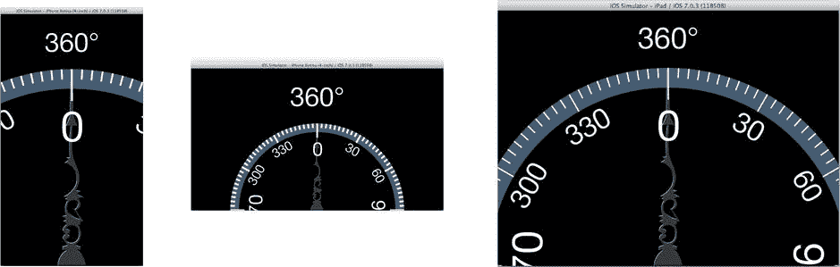

# 排版后内容

当你编辑了应用支持的屏幕方向时，请记住（从第 14 章中可知），每个视图控制器决定其支持哪些方向。默认情况下，iPhone 的`UIViewController`不支持倒置方向。这段代码覆盖了该默认设置，允许所有方向。

最后，你将需要`-positionDialView`的代码：

```
- (void)positionDialViews
{
    CGRect viewBounds = self.view.bounds;
    CGRect labelFrame = self.angleLabel.frame;
    CGFloat topEdge = CGRectGetMaxY(labelFrame)+labelFrame.size.height/3;
    CGFloat dialHeight = ceilf((CGRectGetMaxY(viewBounds)-topEdge)*2);
    dialView.transform = CGAffineTransformIdentity;
    dialView.frame = CGRectMake(0, 0, dialHeight, dialHeight);
    dialView.center = CGPointMake(CGRectGetMidX(viewBounds),
                                     CGRectGetMaxY(viewBounds));
    [dialView setNeedsDisplay];
    CGSize needleSize = needleView.image.size;
    CGFloat needleScale = (dialHeight/2)/needleSize.height;
    CGRect needleFrame = CGRectMake(0,0,
                         needleSize.width*needleScale,
                         needleSize.height*needleScale);
    needleFrame.origin.x = CGRectGetMidX(viewBounds)-needleFrame.size.width/2;
    needleFrame.origin.y = CGRectGetMaxY(viewBounds)-needleFrame.size.height;
    needleView.frame = CGRectIntegral(needleFrame);
}
```

这段代码看起来很多，但它所做的只是将`dialView`设置为正方形，将其中心定位在视图的底部中央，并将其放大，使其顶部边缘刚好位于标签视图底部边缘的下方。然后定位`needleView`，使其居中并锚定在底部边缘，并按比例缩放，使其高度等于刻度盘的可见高度。描述起来比实际看到要困难得多，所以直接运行应用，看看图 16-5 中的效果就明白了。



图 16-5.

刻度盘与指针视图定位

至此，视图设计和布局基本完成。现在你需要获取加速度计信息，让应用真正动起来。

## 获取运动数据

所有 iOS 设备（在撰写本文时）都配有加速度计硬件。加速度计感应沿三个轴（X、Y、Z）的加速力。如果你以竖屏方向手持 iPhone 或 iPad 屏幕，X 轴是水平方向，Y 轴是垂直方向，Z 轴是从你出发，穿过设备中心，垂直于屏幕表面的那条线。

你可以利用加速度计信息来判断设备何时改变速度以及改变的方向。假设设备没有（大幅度）加速，你也可以利用这些信息推断重力的方向，因为重力对静止物体施加恒定的力。iOS 正是利用这些信息来判断你何时将 iPad 翻转至侧边，或是否在摇晃 iPhone。

除了加速度计，最新的 iOS 设备还包含了陀螺仪和磁力计。前者检测绕三个轴（俯仰、横滚、偏航）的旋转变化，后者检测磁场的方位。在没有磁场干扰的情况下，它会告诉你设备相对于磁北的方向（通俗地说，就是它有一个指南针）。

你的应用通过一个单一的网关类`CMMotionManager`获取所有这些信息。`CMMotionManager`类负责收集、解释并向你的应用传递运动和姿态信息。你可以告诉它需要哪种信息（加速度计、陀螺仪、指南针）、希望以多高的频率接收更新，以及这些更新如何传递给应用。你的水平仪应用将只使用加速度计信息，但所有类型运动数据的通用模式是相同的：

- 创建一个`CMMotionManager`实例
- 设置更新频率
- 选择你想获取的信息以及应用获取方式（拉取或推送）
- 准备好后，开始信息传递
- 处理实时发生的运动数据
- 完成后，停止信息传递

没有比从第一步开始更好的地方了。

### 创建 CMMotionManager

在`LRViewController.m`中所有其他`#import`语句之前，引入 CoreMotion 框架定义：

```
#import <CoreMotion/CoreMotion.h>
```

你需要指定运动数据更新的速度。为整洁起见，在`#import`语句之后立即将其定义为一个常量：

```
#define kAccelerometerPollingInterval   (1.0/15.0)
```

你需要一个实例变量来存储`CMMotionManager`对象引用，以及处理运动数据和旋转刻度盘的方法。将这些添加到你的私有接口中（新代码以粗体显示）：

```
@interface LRViewController ()
{
    CMMotionManager *motionManager;
    LRDialView      *dialView;
    UIImageView     *needleView;
}

- (void)positionDialViews;
- (void)updateAccelerometerTime:(NSTimer*)timer;
- (void)rotateDialView:(double)rotation;
@end
```

找到`-viewDidLoad:`方法，并将这段代码添加到方法末尾：

```
motionManager = [CMMotionManager new];
motionManager.accelerometerUpdateInterval = kAccelerometerPollingInterval;
```

你已经完成了使用运动数据的前两个步骤。第一条语句创建了一个新的`CMMotionManager`对象，并将其保存在`motionManager`实例变量中。

**注意**

不要创建`CMMotionManager`的多个实例。如果你的应用有两个或更多需要运动数据的控制器，它们应共享同一个`CMMotionManager`实例。我建议在你的应用委托类中创建一个`readonly`属性，返回一个单例`CMMotionManager`对象。任何代码都可以通过`[UIApplication.sharedApplication.delegate motionManager]`来获取它。

下一条语句告诉管理器在两次测量之间等待多长时间。该属性以秒为单位表示。对于大多数应用来说，每秒 10 到 30 次就足够了，但对某些极端应用可能需要每秒 100 次更新。对于这个应用，你将通过将`accelerometerUpdateInterval`属性设置为 1/15 秒，从每秒 15 次更新开始。

### 启动和停止更新

为了执行获取运动数据的第三步和第四步，找到`-viewWillAppear:`方法并添加此语句（新代码以粗体显示）：

```
- (void)viewWillAppear:(BOOL)animated
{
    [self positionDialViews];
    [motionManager startAccelerometerUpdates];
}
```

就在视图即将显示之前，你请求运动管理器开始收集加速度计数据。在启动更新过程之前，`CMMotionManager`报告的加速度计信息不会准确，甚至不会改变。一旦启动，运动管理器代码会在后台不知疲倦地工作，监测加速度的任何变化，并向你的应用报告。

**提示**

为了节省电池电量，你的应用应仅在需要时才向运动管理器请求更新。对于这个应用，运动事件在整个应用生命周期中都使用，因此没有停止它们的代码。但是，如果你添加了第二个不使用加速度计的视图控制器，你需要在`-viewWillDisappear:`中添加代码来发送`-stopAccelerometerUpdates`。


