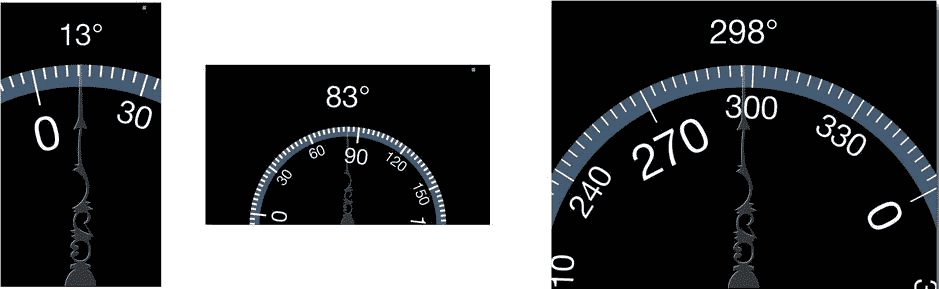

# 时机决定一切

现在你可能会好奇，你的应用是如何“定期”拉取它所关心的运动数据的呢？运动管理器不会发送任何通知，也不会向你的对象发送任何代理消息。你需要的是一个能够定期提醒你的应用执行某些操作的对象。这被称为定时器，而 iOS 恰好提供了这样的功能。在 `-viewWillAppear:` 方法的末尾，添加如下语句：

```
[NSTimer scheduledTimerWithTimeInterval:kAccelerometerPollingInterval
target:self
selector:@selector(updateAccelerometerTime:)
userInfo:nil
repeats:YES];
```

`NSTimer` 对象为你的应用提供了一个定时器。它是我在第 4 章中提到但一直没来得及细说的事件源之一。

**注意**  
创建一个可用的定时器需要两步：首先创建定时器对象，然后将其添加到运行循环中。`-scheduledTimerWithTimeInterval:target:selector:userInfo:repeats:` 方法可以同时完成这两步。如果你使用其他方法创建定时器，则必须在向运行循环对象发送 `-addTimer:forMode:` 消息后，定时器才会生效。

定时器分为两种：单次触发和重复触发。一个定时器具有 `timeInterval` 属性，以及一条它将发送给某个对象的消息。当 `timeInterval` 属性指定的时间过去后，定时器就会触发。在下一个机会到来时，事件循环会将定时器的消息发送给目标对象。如果是单次定时器，触发后即失效并停止。如果是重复定时器，它会持续运行，等待另一个 `timeInterval` 时间过去后再次触发。重复定时器会持续发送消息，直到你向其发送 `-invalidate` 消息。

**警告**  
不要使用定时器来轮询那些本可以通过事件消息、代理方法、通知或代码块来确定的事件（例如等待网页加载）。定时器应仅用于与时间相关的事件和周期性更新。

你在 `-viewWillAppear:` 中添加的代码创建并调度了一个定时器，该定时器会以大约每秒 15 次的频率向你的视图控制器对象发送 `-updateAccelerometerTime:` 消息。这与运动管理器更新其加速度计信息的频率相同。没有必要以比 `CMMotionManager` 对象收集数据更快或更慢的频率来检查更新。

现在万事俱备，只欠 `-updateAccelerometerTime:` 和 `-rotateDialView:` 这两个方法。仍在 `LRViewController.m` 文件中，添加第一个方法：

```
- (void)updateAccelerometerTime:(NSTimer *)timer
{
    CMAcceleration acceleration = motionManager.accelerometerData.acceleration;
    double rotation = atan2(-acceleration.x,-acceleration.y);
    [self rotateDialView:rotation];
}
```

第一条语句获取了运动管理器的 `accelerometerData` 属性。由于你只启动了加速度计信息的收集，因此这是唯一有效的运动数据属性。该属性是一个 `CMAccelerometerData` 对象，而这个对象只有一个属性：`acceleration`。`acceleration` 属性（它是一个结构体，而非对象）包含三个数值：`x`、`y` 和 `z`。每个值都是沿该轴瞬时施加的力，以 G 为单位。³ 假设设备没有被移动，这些测量值可以组合起来确定重力矢量；换句话说，你可以确定哪个方向是下方。

你的应用不需要全部三个值。你只需要确定 X-Y 平面中哪个方向是上方即可，因为转盘就存在于这个平面中。忽略沿 Z 轴的力，反正切函数可以计算出重力矢量在 X-Y 平面中的角度。计算结果用于将 `dialView` 旋转相同的角度。很简单，对吧？

**注意**  
你可能会质疑为什么反正切函数使用的是 x 和 y 的负值。这是因为转盘指向的是上方，而不是下方。将力的方向取反后，计算出的就是偏离重力的角度。

通过编写 `-rotateDialView:` 方法来完善这个应用：

```
- (void)rotateDialView:(double)rotation
{
    dialView.transform = CGAffineTransformMakeRotation(rotation);
    NSInteger degrees = round(-rotation*180.0/M_PI);
    if (degrees<0)
        degrees+=360;
    _angleLabel.text = [NSString stringWithFormat:@"%u\u00b0",(unsigned)degrees];
}
```

此方法将旋转参数转换为一个仿射变换，用于旋转 `dialView`。最后一段代码将 `rotation` 值从弧度转换为角度，确保其不为负数，并用该值更新标签视图。

现在，插入你已配置好的 iOS 设备，运行应用，然后摆弄一下看效果，如图 16-6 所示。注意当你旋转设备时，应用如何切换方向。如果你锁定了设备的方向，它就不会切换方向，但转盘仍然可以正常工作。



**图 16-6.** 运行中的水平仪应用


### 抖动问题

你的应用能运行，编写起来也很简单，但看起来实在费劲。如果它在我设备上的表现类似，那么表盘就会持续抖动。除非设备完全静止，否则几乎无法读取读数。

如果表盘能更平滑地移动——平滑得多——那就太好了。这听起来像是动画的任务。你需要的是一种让表盘看起来具有质量的动画，它会轻柔地飘向硬件报告的那一瞬间的倾斜角度。

那么有哪些选择呢？过去，你曾使用 Core Animation 来平滑地移动视图。但 Core Animation 就像一只信鸽；你把它带到起点，告诉它终点在哪里，然后放手让它飞。一旦开始，它就无法在终点改变时进行中途路线修正。而当新的加速计数据到达时，这正是会发生的情况。

你可以尝试通过限制视图旋转的速率来自行平滑更新。为了让它看起来非常美观，你甚至可能进一步创建一个简单的物理引擎，为表盘模拟质量、加速度、阻力等属性。但正如我在第 11 章中提到的，自行实现动画的方法充满了复杂性，通常需要大量工作，而且往往导致性能不佳。

幸运的是，iOS 7 引入了视图动力学（View Dynamics）。视图动力学是一项新的动画服务，它为你的视图赋予模拟的物理特性，模拟质量、重力、加速度、阻力、碰撞等效果。视图动力学采用了截然不同的动画方法。你不需要描述你希望动画做什么——移动这么多像素、旋转这么多度等等——而是描述作用于视图上的“力”，然后让动态动画器（Dynamic Animator）创建一个模拟视图对这些力作出反应的动画。

### 使用动态动画

动态动画涉及三个角色：

- 动态动画器对象
- 一个或多个行为对象
- 一个或多个视图对象

动态动画器是执行动画的对象。它包含一个非常智能的复杂物理引擎。你需要创建一个动态动画器的单一实例。

当你创建行为对象并将其添加到动态动画器中时，动画就会发生。一个行为描述了视图的单个驱动力或属性。iOS 包括用于重力、加速度、摩擦、碰撞、连接等效果的预定义行为，你也可以自由地创建自己的行为。一个行为与一个或多个视图（`UIView`）对象相关联，并将该特定行为赋予其所有视图。动态动画器负责为单个视图组合多个行为——例如加速度、重力加上摩擦——来构建该视图的动画。

因此，动态动画的基本公式是：

1. 创建一个 `UIDynamicAnimator` 的实例
2. 创建一个或多个 `UIDynamicBehavior` 对象，并将其附加到 `UIView` 对象上
3. 将 `UIDynamicBehavior` 对象添加到 `UIDynamicAnimator` 中
4. 坐享其成

现在你已经准备好将视图动力学添加到水平仪应用中。

### 创建动态动画器

你需要创建一个动态动画器对象，为此需要一个实例变量来保存它。找到 `LRViewController.m` 中私有的 `@interface LRViewController ()` 声明。为你的动画器添加一个实例变量（新代码以粗体显示）。同时，添加一些常量和一个用于包含附着行为的变量，这些内容稍后将解释：

```
#define kSpringAnchorDistance       4.0
#define kSpringDamping              0.7
#define kSpringFrequency            0.5

@interface LRViewController ()
{
    CMMotionManager         *motionManager;
    LRDialView              *dialView;
    UIImageView             *needleView;
    UIDynamicAnimator       *animator;
    UIAttachmentBehavior    *springBehavior;
}
```

你需要创建动态动画器，创建所需的行为对象，并将它们连接到你的视图。完成这三个步骤的理想位置是在 `-positionDialViews` 方法中。找到 `-positionDialViews` 方法，并在最开头添加以下代码（新代码以粗体显示）：

```
- (void)positionDialViews
{
    if (animator != nil)
        [animator removeAllBehaviors];
    else
        animator = [[UIDynamicAnimator alloc] initWithReferenceView:self.view];
```

这段代码简单地判断是否已经创建了 `UIDynamicAnimator` 对象。如果已创建，它会通过移除所有活动行为来重置它。如果尚未创建，则会创建一个新的动态动画器。

当你创建动态动画器时，必须指定一个视图，该视图将用于建立动态动画器将使用的坐标系。动态动画器使用自己的坐标系，称为参考坐标系，这样处于不同视图层次结构（每个都有自己的坐标系）中的视图对象可以在统一的坐标空间中相互交互。例如，使用参考坐标系，你可以让内容视图控制器中的某个视图与工具栏中的按钮发生碰撞，即使该按钮位于一个无关的父视图中。

对于你的应用，将参考坐标系设置为视图控制器根视图的坐标系。这使得所有动态动画器的坐标与你的本地视图坐标一致。这难道不很方便吗？（是的，确实很方便。）


