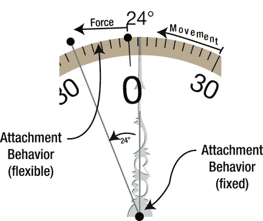

# 定义行为

那么，你认为拨号视图应该具备哪些行为？如果你浏览 iOS 提供的行为，你不会找到“旋转”行为。但如果作用在视图上的力会导致其旋转，动态动画器就会旋转该视图。因此，旋转拨号视图并不比旋转唱片转盘、旋转木马、餐台转盘或任何类似物体更难：只需固定物体中心，并对一个边缘施以斜向的力。

你将通过两个附着行为来实现这一点。附着行为可以将视图中的一个点与另一个视图中的某个点或空间中的固定点（称为锚点）连接起来。附着的长度可以是刚性的，从而创建一种“牵引杆”关系，使附着点保持固定距离；也可以是弹性的，从而创建一种“弹簧”关系，当附着的另一端移动时，会对视图产生拉力。要旋转拨号视图，你将分别使用这两种附着行为，如图 16-7 所示。



图 16-7. `dialView` 附着行为

通过将以下代码添加到 `-positionDialViews` 方法的末尾来创建第一个行为：

```
CGPoint dialCenter = dialView.center;

UIAttachmentBehavior *pinBehavior;

pinBehavior = [[UIAttachmentBehavior alloc] initWithItem:dialView
                                        attachedToAnchor:dialCenter];

[animator addBehavior:pinBehavior];
```

该附着行为定义了一个从拨号视图中心到同一位置固定锚点的刚性附着。当你创建附着行为时，两个附着点之间的距离定义了其初始长度，在本例中为 0。由于附着是刚性的且长度为 0，最终效果是将视图的中心固定在该坐标处。视图的中心无法从该位置移动。

**注意**

大多数动态行为可以与任意数量的视图对象关联。例如，重力可以均匀地作用于多个视图对象。然而，附着行为在两个附着点之间创建关系，因此仅与一个或两个视图对象关联。

剩下的工作就是将这个行为添加到动态动画器中。单独来看，这除了防止视图被移动到新位置外，并没有太多作用。当你使用以下代码添加第二个附着行为时，事情就变得有趣了：

```
CGRect dialRect = dialView.frame;

CGPoint topCenter = CGPointMake(CGRectGetMidX(dialRect),
                                CGRectGetMinY(dialRect));

springBehavior = [[UIAttachmentBehavior alloc]
                          initWithItem:dialView
                      offsetFromCenter:UIOffsetMake(0,topCenter.y-dialCenter.y)
                      attachedToAnchor:topCenter];

springBehavior.damping = kSpringDamping;
springBehavior.frequency = kSpringFrequency;

[animator addBehavior:springBehavior];
```

前两个语句计算视图顶部中心的点。然后创建了第二个附着行为。这一次附着点不再位于视图中心，而是其顶部中心（表示为相对于其中心的偏移量）。

同样，锚点与附着点位置相同，形成了一个零长度的附着。不同之处在于，`damping` 和 `frequency` 属性被设置为非默认值。这就在锚点和附着点之间创建了一个“弹性”连接。但由于锚点和附着点当前相同（尚未施加任何力），因此不会产生力。

