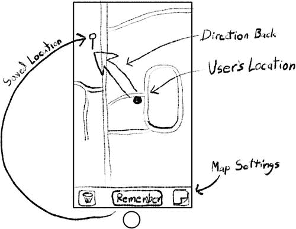
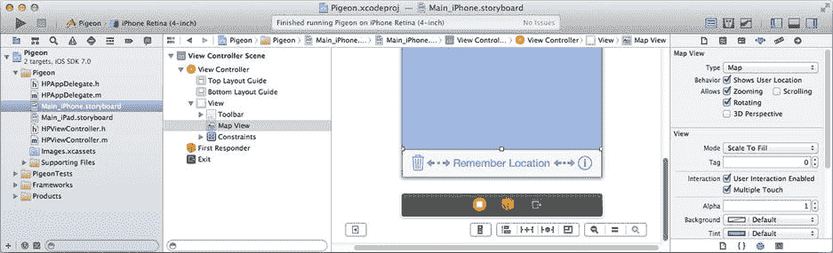
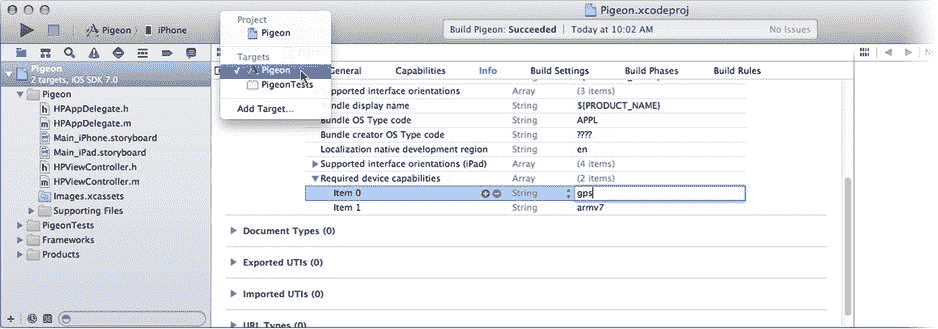
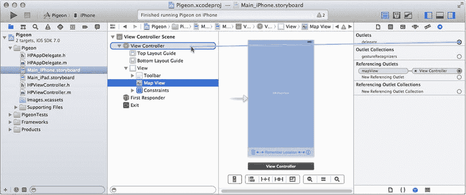
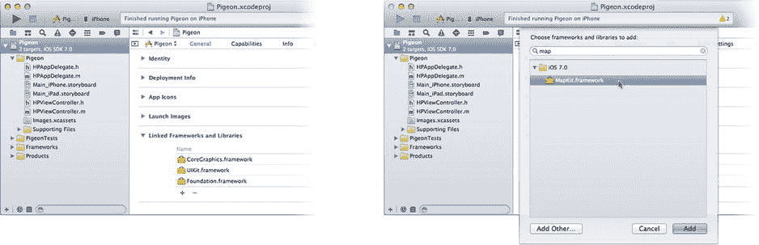
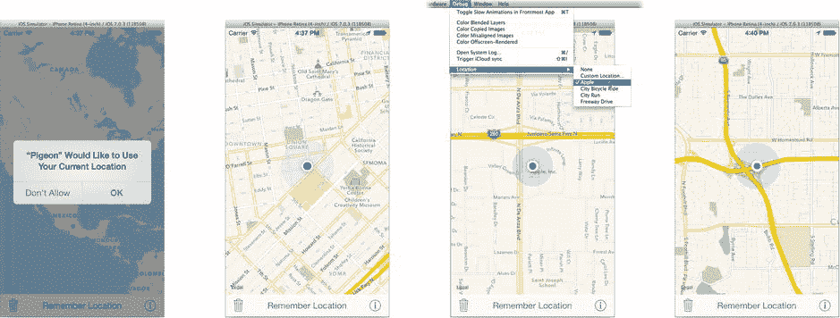

# 17. 你在哪？

## 摘要

如果你觉得加速度计、陀螺仪和磁力计很酷，那么你会喜欢这一章的。除了这些仪器，许多 iOS 设备还包含无线电接收器，使其能够通过计时从卫星网络接收到的无线电信号来三角定位自己的位置——这些卫星网络要么是全球定位系统（GPS），要么是俄罗斯的全球导航卫星系统（GLONASS）。这项技术统称为 GPS。

这对你意味着什么？作为用户，这意味着你的 iOS 设备知道它在地球上的位置。作为开发者，这意味着你的应用可以获取设备位置信息，并利用它向用户展示他们所在的位置、周围有什么、他们从哪里来，或者如何到达他们想去的地方。在本章中，你将：

- 收集位置信息
- 显示显示用户当前位置的地图
- 向地图添加自定义标注
- 监控用户的移动并提供方向指引
- 创建用于更改地图选项的界面

本章将使用两种 iOS 技术：Core Location 和 Map Kit。Core Location 提供了与 GPS 卫星接收器的接口，并向你的应用提供关于设备位置的各种形式的数据。Map Kit 提供了显示、标注和动画化地图的视图对象和工具。这两者可以分开使用，也可以结合使用。


## 创建 Pigeon 应用

本章的应用名为 Pigeon。它是一个实用工具，让你能在地图上记住当前位置。之后它会显示你当前所在位置以及标记位置，这样你就能轻松导航回去。Pigeon 的设计如图 17-1 所示。



图 17-1. Pigeon 设计图

该应用包含一个地图和三个按钮。中间的按钮用于记住当前位置，并在地图上放置一个图钉进行标记。当你离开该位置时，地图会同时显示你的当前位置、已保存的位置以及一个指向返回方向的箭头。垃圾桶按钮用于清除已保存的位置，信息按钮则允许用户更改地图显示选项。现在让我们开始吧。

首先创建项目并布局界面。在 Xcode 中，按如下方式创建一个新项目：

使用 `Single View Application` 模板。将项目命名为 `Pigeon`。使用类前缀 `HP`。将设备设置为 `Universal`。

选择 `Main_iPhone.storyboard` 文件（你可以选择开发 iPhone 界面、iPad 界面或两者都开发，操作步骤相同）。在界面底部添加一个工具栏。按如下方式添加并配置工具栏按钮项（从左到右）：

`Bar Button Item`：将其标识符设置为 `Trash`
`Flexible Space Bar Button Item`
`Bar Button Item`：将其标题设置为 `Remember Location`
`Flexible Space Bar Button Item`
`Button`（非 `Bar Button Item`）：将其类型设置为 `Info Light`

从对象库中，添加一个 `Map View` 对象来填充界面的其余部分。为地图视图对象设置以下属性：

*   勾选 `Shows User Location`
*   勾选 `Allows Zooming`
*   取消勾选 `Allows Scrolling`
*   取消勾选 `3D Perspective`

通过选择 `Add Missing Constraints to View Controller` 命令完成布局，该命令位于 `Editor ➤ Resolve Auto Layout Issues` 子菜单或编辑器窗格底部的 `Resolve Auto Layout Issues` 按钮中。完成后的界面应如图 17-2 所示。



图 17-2. Pigeon 界面

接下来你需要将这些视图连接到控制器。切换到辅助编辑器，并确保右窗格中显示的是 `HPViewController.h`。紧跟在 `#import <UIKit/UIKit.h>` 语句之后，添加一条 `#import` 语句以引入 Map Kit 声明：

```
#import <MapKit/MapKit.h>
```

在 `@interface` 部分添加以下连接：

```
@property (weak,nonatomic) IBOutlet MKMapView *mapView;

- (IBAction)dropPin:(id)sender;

- (IBAction)clearPin:(id)sender;
```

将 `mapView` 输出口连接到地图视图对象。将左侧和中间工具栏按钮的操作分别连接到 `-clearPin:` 和 `-dropPin:` 动作。现在你可以开始编写这些动作的代码了。

## 收集位置数据

获取位置数据的流程与第 16 章中获取陀螺仪和磁力计数据的模式相同，只需稍作修改。基本步骤如下：

*   创建 `CLLocationManager` 的实例。
*   如果你的应用需要精准（GPS）位置信息，请将 `gps` 值添加到应用的 `Required Device Capabilities` 属性中。
*   使用 `+locationServicesAvailable` 或 `+authorizationStatus` 方法检查定位服务是否可用。
*   指定一个对象作为 `CLLocationManager` 的委托。采用 `CLLocationManagerDelegate` 协议，并将该对象设为委托。
*   发送 `-startUpdatingLocation` 开始收集位置数据。
*   当设备位置发生变化时，委托对象将收到消息。
*   当你的应用不再需要位置数据时，发送 `-stopUpdatingLocation`。

使用 `CLLocationManager` 和 `CMMotionManager` 之间唯一显著的区别在于：你可以创建多个 `CLLocationManager` 对象，并且数据会被传递到其委托对象（而不是要求应用主动拉取数据或将其推送到操作队列）。

另一个区别是，即使设备具备 GPS 硬件，位置数据也可能不可用。这可能由多种原因导致。用户可能已关闭定位服务。他们可能处于无法接收卫星信号的区域。设备可能处于“飞行模式”，该模式不允许 GPS 接收器通电。或者你的应用被明确拒绝访问位置信息。具体原因并不重要。你需要检查位置数据的可用性，并处理无法获取数据的情况。

最后，根据数据的精度和交付速度，有多种获取位置数据的方法。知道用户向左移动了 20 英尺与知道他们何时到达工作地点是不同的问题。我将在本章末尾介绍不同类型的位置监控方式。

Pigeon 需要只有 GPS 硬件才能提供的精确定位信息。在项目导航器中选择 Pigeon 项目，选中 `Pigeon` 目标（左上角弹出菜单，如图 17-3 所示），切换到 `Info` 标签页，在 `Custom iOS Target Properties` 组中找到 `Required device capabilities`。点击 + 按钮并添加 `gps` 需求，如图 17-3 所示。



图 17-3. 添加 GPS 设备需求

现在你可能以为我会让你添加一些代码来：

*   让 `HPViewController` 采用 `CLLocationManagerDelegate` 协议
*   实现 `-locationManager:didUpdateLocations:` 委托方法来处理位置更新
*   创建 `CLLocationManager` 的实例
*   将 `HPViewController` 设为位置管理器的委托
*   发送 `-startUpdatingLocation` 开始收集位置数据

但你实际上不需要做这些工作。

现在你一定好奇为什么，让我解释一下。Pigeon 同时使用了定位服务和 Map Kit。Map Kit 包含了 `MKMapView` 对象，用于显示地图。在其众多功能中，它能够监控设备的当前位置并在地图上显示。当用户位置发生变化时，它甚至会通知其委托。

对于这个特定的应用，`MKMapView` 已经为你完成了所有工作。当你要求它显示用户位置时，它会创建自己的 `CLLocationManager` 实例，并开始监控位置变化，同时更新地图及其委托。最终结果是 `MKMapView` 拥有了 Pigeon 工作所需的所有信息。

**注意：** Pigeon 稍微有些特殊；你将配置地图视图，使其始终追踪用户位置，并且地图视图始终处于活动状态。如果不是这样，那么依赖地图视图来定位用户就不是一个解决方案，你就必须采用通常的方式使用 `CLLocationManager`。

这是个好消息。所有那些 `CLLocationManager` 代码看起来会和你第 16 章编写的代码非常相似，这会让这个应用显得有些无聊，我当然不想让你感到无聊。或者你还没有阅读第 16 章，那么你还有值得期待的内容。

无论如何，你只需要正确设置 `MKMapView` 即可。现在让我们来做这件事。


## 使用地图视图

你的地图视图对象已经添加到界面中，并连接到了 `mapView` 输出口。你还使用了属性检查器来配置地图视图，使其显示（并跟踪）用户的位置，并且禁止了用户滚动。还有一个设置需要你完成，而它无法通过属性检查器进行设置。

选择 `HPViewController.m` 文件，找到 `-viewDidLoad` 方法。在方法末尾添加以下语句：

```
[_mapView setUserTrackingMode:MKUserTrackingModeFollow];
```

这会将地图的跟踪模式设置为“跟随用户”。共有三种跟踪模式——相信你在苹果地图等应用中已经见过——如表 17-1 所示。

**表 17-1.** 用户跟踪模式

| 跟踪模式 | 描述 |
| --- | --- |
| `MKUserTrackingModeNone` | 地图不跟随用户的位置。 |
| `MKUserTrackingModeFollow` | 地图以用户当前所在位置为中心，并在用户移动时随之移动。 |
| `MKUserTrackingModeFollowWithHeading` | 地图跟踪用户的当前位置，并且地图的方向会旋转以指示用户的行驶方向。 |

你添加到 `-viewDidLoad:` 中的代码将跟踪模式设置为跟随用户。`showsUserLocation` 属性与跟踪模式的结合，强制地图视图开始收集位置数据，这正是你所需要的。

如果你用过地图应用，就会知道通过手动平移地图可以“打破”跟踪模式。你已禁用了地图视图的平移功能，但在某些情况下，跟踪模式仍会恢复为 `MKUserTrackingModeNone`。为解决这个问题，你需要添加代码来捕获跟踪模式发生变化的情况，并在必要时进行“纠正”。

这些信息会提供给地图视图的委托。如果你的 `MPViewController` 对象是地图视图的委托，那岂不是很好？我也这么觉得。

切换到 `HPViewController.h`，并遵循 `MKMapViewDelegate` 协议（新代码以粗体显示）：

```
@interface HPViewController : UIViewController <MKMapViewDelegate>
```

返回到 `HPViewController.m`，并在 `@implementation` 中添加以下地图视图委托方法：

```
- (void)            mapView:(MKMapView *)mapView
didChangeUserTrackingMode:(MKUserTrackingMode)mode
animated:(BOOL)animated
{
    if (mode==MKUserTrackingModeNone)
        [mapView setUserTrackingMode:MKUserTrackingModeFollow];
}
```

每当地图的跟踪模式发生变化时，都会收到这条消息。它只是检查模式是否已变为“无”，并将其重新设置为跟踪用户。

当然，只有当你的 `HPViewController` 对象是地图视图的委托对象时，才会收到这条消息。选择 `Main_iPhone.storyboard`（或 `_iPad`）文件。选择地图视图对象，并使用连接检查器将地图视图的 `delegate` 输出口连接到视图控制器，如图 17-4 所示。



**图 17-4.** 连接地图视图的委托输出口

你已经完成了所有必要步骤，可以查看地图视图的实际效果了，所以启动它吧。在模拟器或已配置的设备上运行你的应用。你可能会看到构建警告，提示你尚未实现 `-dropPin:` 和 `-clearPin:` 方法；暂时忽略它们。

遇到问题了吗？也许你的应用还没有准备好运行。如果你的应用崩溃，出现空白屏幕并在控制台窗格中显示一条错误信息，那是因为你的应用没有链接到 MapKit 框架。大多数情况下，Xcode 会自动将你的应用链接到所需的框架，但在某些情况下，你需要显式地进行链接。别担心，这很容易修复。

选择 `Pigeon` 项目，确保选中了 `Pigeon` 目标，然后切换到 `General` 选项卡。找到 `Linked Frameworks and Libraries` 部分，如图 17-5 左侧所示。点击 + 按钮，选择一个新的库或框架进行链接，如图 17-5 右侧所示。



**图 17-5.** 向项目添加框架

**提示：** 使用“添加库”对话框中的搜索字段可以快速找到你需要的库或框架。

你实际上并没有向项目中添加任何内容。你的应用使用的每个 iOS 符号在运行时最终都必须转换为该变量或类的内存地址。这个过程称为动态链接，是启动应用机制的一部分。在开发过程中你“链接到”的库和框架，不过是一系列 iOS 提供的符号名称列表，以及你的应用在运行时如何连接到这些符号的说明。添加 MapKit 框架可使你的应用访问 Map Kit 服务中的所有类、变量和常量。

解决了这个恼人的细节之后，再次运行你的应用。这一次，你应该会看到如图 17-6 所示的内容。



**图 17-6.** 测试地图视图

当你的应用首次运行时，iOS 会询问用户是否允许你的应用收集位置数据。点击 `OK`，否则这次测试将非常短暂。一旦获得许可，地图会定位你的设备，并以你的位置为中心显示地图（如图 17-6 中的第二个截图所示）。

iOS 模拟器会模拟位置数据，允许你测试基于位置的应用。在 Debug 菜单的 Location 子菜单中，你会找到多个选项（如图 17-6 中的第三个截图所示）。选择 `Custom Location...` 项，输入模拟位置的经度和纬度。还有一些预先编程的位置，例如 Apple 项，也在图 17-6 中显示。

其中一些选项会回放一段录制的行程。目前的选项包括 `City Bicycle Ride`（城市骑行）、`City Run`（城市跑步）和 `Freeway Drive`（高速公路驾驶）。选择其中一个，便会启动一系列位置变化，地图会跟踪这些变化，就好像设备在自行车上、伴随慢跑者或在汽车中一样。试试看；你肯定想试一下。

地图还可以通过捏合或双击来进行缩放，如图 17-6 右侧所示。你不能滚动地图，因为你在 Interface Builder 中禁用了该选项。

在回放“高速公路驾驶”时，添加代码以在地图上标记你的位置。


