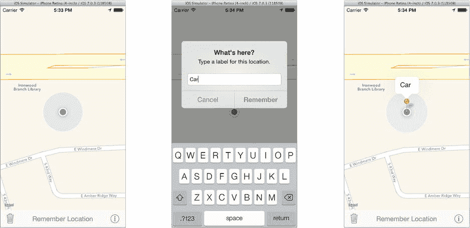
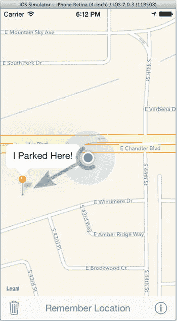

# 装饰你的地图

有三种方式可以为地图添加视觉元素：标注、覆盖层和子视图。

**标注**标识地图上的单个点。它可以按你喜欢的任何方式显示，但 iOS 提供了使用可识别的"图钉"图像来标记位置的类。标注可以选择显示一个包含标题、副标题和辅助视图的标注框。选中（点击）时，标注框会出现在图钉上方。

**覆盖层**标识地图上的路径或区域。你将在 Pigeon 应用中不会使用覆盖层，但它是用于绘制线条（如行车路线）和突出显示任意区域（如城市公园）的方法。

**子视图**与其他子视图类似。`MKMapView`是`UIView`的子类，你可以自由地向其中添加自定义的`UIView`对象。使用子视图可以为地图添加额外的控件或指示器。

标注和覆盖层是附着在地图上的。它们使用地图坐标（稍后会讲到）来描述，并且会随地图移动而移动。子视图则位于`MKMapView`对象的本地图形坐标系中，不会随地图移动。

你的 Pigeon 应用将在用户点击"记住位置"按钮时，在其当前位置创建一个标注——即"放置一个图钉"。垃圾按钮则会丢弃该图钉。对我来说，这听起来像是两个操作方法。

## 添加标注

当用户点击"记住位置"按钮时，你将捕获他们的当前位置，并向地图添加一个标注。我认为如果用户能为该位置选择一个标签会更好，这样更容易记住他们想要记住的内容。为实现这一切，你需要一个实例变量来存储标注对象，并且你的`HPViewController`需要成为警告视图的代理。将这两项添加到`HPViewController.m`中的私有`@interface`段（新代码以粗体显示）：

```objectivec
@interface HPViewController () <UIAlertViewDelegate>
{
    MKPointAnnotation   *savedAnnotation;
}
@end
```

下一步是编写`-dropPin:`方法。它首先显示一个警告视图，以便用户可以输入标签。将此方法添加到`@implementation`段：

```objectivec
- (IBAction)dropPin:(id)sender
{
    UIAlertView *alert = [[UIAlertView alloc]
        initWithTitle:@"这里有什么？"
        message:@"为此位置输入一个标签。"
        delegate:self
        cancelButtonTitle:@"取消"
        otherButtonTitles:@"记住", nil];
    alert.alertViewStyle = UIAlertViewStylePlainTextInput;
    alert.delegate = self;
    [alert show];
}
```

此方法创建一个警告框，并将其样式设置为`UIAlertViewStylePlainTextInput`。这会显示一个带有常规文本字段的警告视图，用户可以在其中输入内容。`-dropPin:`操作的功能部分在用户输入标签并点击"记住"按钮后执行。在`-dropPin:`方法之后添加以下代码：

```objectivec
- (void)    alertView:(UIAlertView *)alertView
clickedButtonAtIndex:(NSInteger)buttonIndex
{
    CLLocation *location = _mapView.userLocation.location;
    if (location==nil)
        return;

    NSString *name = [[alertView textFieldAtIndex:0] text];
    name = [name stringByTrimmingCharactersInSet:
        [NSCharacterSet whitespaceAndNewlineCharacterSet]];

    if (name.length==0)
        name = @"在这里!";

    [self clearPin:self];
    savedAnnotation = [MKPointAnnotation new];
    savedAnnotation.title = name;
    savedAnnotation.coordinate = location.coordinate;
    [_mapView addAnnotation:savedAnnotation];
    [_mapView selectAnnotation:savedAnnotation animated:YES];
}
```

第一步是获取用户的当前位置。请记住，自从应用启动以来，地图视图一直在跟踪用户的位置，因此它现在应该对用户的位置有相当准确的了解。但是，你必须考虑到地图视图可能不知道位置的情况（`location==nil`）。用户可能禁用了定位服务、在"飞行模式"下运行，或者正在洞穴探险。无论如何，如果没有位置信息，就没有任何操作可做。

接下来的代码清理用户输入的内容。它会去除所有前导或尾随的空白字符（也就是空格），并在用户未输入内容时提供一个可读的标签。

现在该方法开始执行核心功能。它清除任何现有的图钉；Pigeon 一次只记住一个位置。它创建一个新的标注对象，设置其`title`和`coordinates`，将标注添加到地图，然后选中该标注。由于你尚未进行任何特殊设置，地图视图将使用标准的红色图钉标注视图来指示地图上的位置。通过编程方式选中新的标注会使其标注框弹出，就像用户点击了图钉一样。

当你仍在`HPViewController.m`中时，添加`-clearPin:`方法，该方法无需太多解释：

```objectivec
- (IBAction)clearPin:(id)sender
{
    if (savedAnnotation!=nil)
    {
        [_mapView removeAnnotation:savedAnnotation];
        savedAnnotation = nil;
    }
}
```

运行应用并尝试一下。点击"记住位置"按钮，输入一个标签，一个图钉就会出现在你的当前位置，如图 17-7 所示。



**图 17-7.** 测试标注

## 地图坐标

标注对象的坐标被设置为用户位置的坐标（由地图视图提供）。但这些"坐标"是什么呢？Map Kit 使用三种坐标系，如表格 17-2 所示。

**表 17-2.** 地图坐标系

| 坐标系 | 描述 |
| --- | --- |
| 纬度和经度 | 地球上某个位置的纬度、经度，有时还包括海拔。这些被称为地图坐标。 |
| 墨卡托 | 地球墨卡托地图上的位置（x,y）。墨卡托地图是将地球表面投影到平面地图上的圆柱投影。你在地图视图中看到的就是墨卡托地图。墨卡托地图上的位置称为地图点。 |
| 图形 | 界面中的图形坐标，由`UIView`使用。这些简称为点。 |

地图坐标（经度和纬度）是用于标识地图上位置的主要值，存储在`CLLocationCoordinate2D`结构中。它们不是 XY 坐标，因此计算两个坐标之间的距离和方位是一项不易完成的工作，最好交给定位服务和 Map Kit 来处理。标注位于地图坐标上。

地图点是墨卡托地图投影中的 XY 位置。由于是平面上的 XY 坐标，计算角度和距离要简单得多。地图点用于绘制覆盖层。这简化了绘图并减少了涉及的数学计算。

> **注：** 墨卡托投影对于导航特别方便，因为墨卡托地图上任意两点之间的直线描述了用户可以从一点到达另一点的方位。其缺点是东西方向的距离和南北方向的距离比例不一致——赤道除外。

地图点最终会被转换为图形坐标，以便显示在屏幕上的某个位置。有一些方法可以将地图坐标转换为图形坐标，还有另外的方法进行反向转换。在本项目的后续部分，你将使用这些方法以及一些用于计算坐标之间距离的实用方法。


### 添加一点弹跳效果

你的地图标记会显示在地图上，并随着地图移动。你可以轻点它以显示或隐藏其标注框。考虑到只需几行代码就能创建它，这已经相当令人印象深刻了。不过，我们确实热爱动画，而且我敢肯定你见过那种“掉落”到指定位置的地图标记。而你的标记只是直接出现，并不会掉落。那么，如何让地图标记呈现动画效果、改变颜色或以其他方式进行自定义呢？答案是使用自定义标注视图。

地图中的标注实际上由一对对象组成：标注对象和标注视图对象。标注对象将信息与地图上的坐标关联起来——这是数据模型。标注视图对象则负责标注的外观——这是视图。如果你想要自定义标注的显示方式，就必须提供自己的标注视图对象。

你可以通过实现 `-mapView:viewForAnnotation:` 委托方法来做到这一点。当地图视图想要显示一个标注时，它会向委托发送此消息，并附带标注对象。该方法的工作是返回一个代表该标注的标注视图对象。如果你没有实现这个方法，或者决定对某个标注返回 `nil`，地图视图就会使用默认的标注视图，也就是一个普通的地图标记。

将此方法添加到 `HPViewController.m` 中：

```
- (MKAnnotationView *)mapView:(MKMapView *)mapView
viewForAnnotation:(id<MKAnnotation>)annotation
{
    if (annotation == self.mapView.userLocation)
        return nil;

    NSString *pinID = @"Save";
    MKPinAnnotationView *view = (MKPinAnnotationView*)
        [self.mapView dequeueReusableAnnotationViewWithIdentifier:pinID];

    if (view == nil)
    {
        view = [[MKPinAnnotationView alloc] initWithAnnotation:annotation
                                               reuseIdentifier:pinID];
        view.canShowCallout = YES;
        view.animatesDrop = YES;
    }

    return view;
}
```

第一条语句将标注与地图视图的用户标注对象进行比较。用户标注对象与任何其他标注对象一样，代表用户在地图上的位置。当你要求地图视图显示用户位置时，它会自动添加这个标注。这个自动标注可以通过地图视图的 `userLocation` 属性获取。如果你对此标注返回 `nil`，地图视图将使用其默认的用户标注视图——我们都熟悉的那个脉冲蓝色圆点。如果你想用其他方式表示用户位置，就需要在此处提供那个视图。

其余代码的工作方式与第 4 章中的表格视图单元格代码完全相同。地图视图维护着一个可重用的 `MKAnnotationView` 对象缓存，你可以通过标识符来回收利用它们。你的地图只使用一种标注视图：由 `MKPinAnnotationView` 类提供的标准地图标记视图。该标记被配置为可以显示标注框，并且在添加到地图时播放动画（“掉落”）。

**提示**

如果你想赋予用户移动刚放置的标记的能力，只需将标注视图对象的 `draggable` 属性设置为 `YES` 即可。

再次运行应用。现在当你保存位置时，标记会以动画方式插入到地图中，这看起来要有趣得多。

你的 `-mapView:viewForAnnotation:` 委托方法可以返回内置标注视图类的自定义版本，就像你在这里所做的那样。`MKPinAnnotationView` 可以显示不同颜色的标记，可以允许或禁止显示标注框，可以在其标注框中添加自定义辅助视图，等等。或者，你也可以继承 `MKAnnotationView` 并创建自己的标注视图，随意添加你想要的任何自定义图形和动画。你甚至可以用一只摇摇摆摆的鸭子来表示用户的位置。尽情发挥你的想象力吧。

**注意**

叠加对象和叠加视图对象的工作方式与标注几乎完全相同。主要区别在于，叠加物占据的是地图上的一个区域，而不仅仅是一个点。


## 指引方向

另一种增强地图视图的方法是添加你自己的子视图。这些子视图可以显示额外信息（行进方向、已耗时行程距离等），或者你可以添加控制对象（开关、音乐播放按钮等）。

`Pigeon` 将添加一个显示箭头的图像视图。箭头将从用户当前位置指向他们在地图上标记的位置。其工作方式如下：

*   当地图视图委托收到用户位置变化的通知时。
*   该委托方法将计算用户位置和已保存位置在屏幕上的坐标，以及两者之间的实际距离。
*   如果实际距离超过 50 米，则将图像视图（箭头）定位到用户屏幕坐标位置，并旋转使其指向已保存位置。
*   否则，隐藏箭头。

为实现此功能，你需要一个箭头图像、一个图像视图实例变量、一个隐藏箭头的方法，以及一个显示箭头并将其指向正确方向的方法。首先，将 `arrow.png` 资源文件添加到你的 `Images.xcassets` 图像目录中，该文件位于 `Learn iOS Development Projects` ➤ `Ch 17` ➤ `Pigeon (Resources)` 文件夹。在添加图像的同时，`Pigeon (Icons)` 文件夹中有一套应用图标，你可以将其拖入 `AppIcons` 组。

在 `HPViewController.m` 文件中，找到私有的 `@interface` 部分。定义阈值距离常量，添加一个实例变量，并声明几个方法，如下所示（新增代码以粗体显示）：

```
#define kArrowDisplayDistanceMin    50.0

@interface HPViewController () <UIAlertViewDelegate>

{
    MKPointAnnotation   *savedAnnotation;
    UIImageView         *arrowView;
}

- (void)hideReturnArrow;
- (void)showReturnArrowAtPoint:(CGPoint)userPoint towards:(CGPoint)returnPoint;

@end
```

下一步是捕捉用户位置的变化。当用户移动时，用户与已保存位置之间的距离会改变，地图会随之移动，并改变两者之间的角度。你的 `HPViewController` 已经是地图视图的委托。你只需实现以下方法：

```
- (void)        mapView:(MKMapView *)mapView
    didUpdateUserLocation:(MKUserLocation *)userLocation
{
    if (savedAnnotation!=nil)
    {
        CLLocationCoordinate2D coord = savedAnnotation.coordinate;
        CLLocation *toLoc = [[CLLocation alloc] initWithLatitude:coord.latitude
                                                       longitude:coord.longitude];
        CLLocationDistance distance =
            [userLocation.location distanceFromLocation:toLoc];
        if (distance>=kArrowDisplayDistanceMin)
        {
            CGPoint userPoint = [mapView convertCoordinate:userLocation.coordinate
                                           toPointToView:self.mapView];
            CGPoint savePoint = [mapView convertCoordinate:coord
                                           toPointToView:self.mapView];
            [self showReturnArrowAtPoint:userPoint towards:savePoint];
            return;
        }
    }
    [self hideReturnArrow];
}
```

只有当存在已保存位置，且该位置与用户之间的实际距离超过 50 米时，箭头才会显示。前两个条件用于检查这些前提。`-distanceFromLocation:` 方法特别方便，因为它处理了计算两个地图坐标之间距离所涉及的数学运算。

要定位箭头，你需要知道它在屏幕上的位置以及已保存位置的位置。`-convertCoordinate:toPointToView:` 方法执行此转换。你向该方法传入地图坐标，它会返回该点在地图上的视图坐标。这些坐标随后被传入你的 `-showReturnArrowAtPoint:towards:` 方法。在所有其他情况下，箭头视图都将被隐藏。

最后一步是实现 `-hideReturnArrow` 和 `-showReturnArrowAtPoint:towards:` 方法：

```
- (void)hideReturnArrow
{
    arrowView.hidden = YES;
}

- (void)showReturnArrowAtPoint:(CGPoint)userPoint towards:(CGPoint)returnPoint
{
    if (arrowView==nil)
    {
        UIImage *arrowImage = [UIImage imageNamed:@"arrow"];
        arrowView = [[UIImageView alloc] initWithImage:arrowImage];
        arrowView.opaque = NO;
        arrowView.alpha = 0.6;
        [self.mapView addSubview:arrowView];
        arrowView.hidden = YES;
    }

    CGFloat angle = atan2f(returnPoint.x-userPoint.x,userPoint.y-returnPoint.y);
    CGAffineTransform rotation = CGAffineTransformMakeRotation(angle);
    void (^updateArrow)(void) = ^{
        arrowView.center = userPoint;
        arrowView.transform = rotation;
    };

    if (arrowView.hidden)
    {
        updateArrow();
        arrowView.hidden = NO;
    }
    else
    {
        [UIView animateWithDuration:0.5 animations:updateArrow];
    }
}
```

`-hideReturnArrow` 方法的作用应该显而易见。

`-showReturnArrowAtPoint:towards:` 方法首先惰性创建图像视图对象（如果是第一次显示的话）。接下来几条语句计算用户点与已保存点之间的角度，并创建一个旋转变换，使箭头从一点指向另一点。

其余代码变得稍显花哨——但这是好事。如果箭头之前是隐藏的，你希望它立即出现在正确的位置，不带动画。如果它当前正在显示，你希望它能平滑动画到新位置。这里的解决方案是将定位和旋转箭头视图的代码捕获到一个代码块变量 (`updateArrow`) 中。随后的 `if` 语句要么立即执行该代码块（无动画）并显示视图，要么将该代码块传递给 `UIView` 进行动画处理。你看，这并不太难。

运行应用并测试。点击“记住位置”按钮在地图上放置一个大头针，然后使用 iOS 模拟器的调试菜单移动模拟位置。如果你使用的是真实设备，只需向任意方向移动 50 米，如图 17-8 所示。



**图 17-8.** 测试方向箭头 注意

这种技术之所以有效，很大程度上是因为用户位置不断被更新，从而逐步精细化箭头视图的位置和角度。这更像是一个向地图视图添加子视图以及将地图坐标转换为图形坐标的练习，而非提供地图内导航方向的推荐做法。如果我要“真正地”编写这个应用，我会使用覆盖层和自定义覆盖视图来绘制从用户位置返回已保存位置的路径。

你还在好奇工具栏中的信息按钮是做什么用的吗？我把它留作本章末尾的练习了。在你开始练习之前，让我们简要了解一下你尚未探索过的一些定位服务和地图功能。


