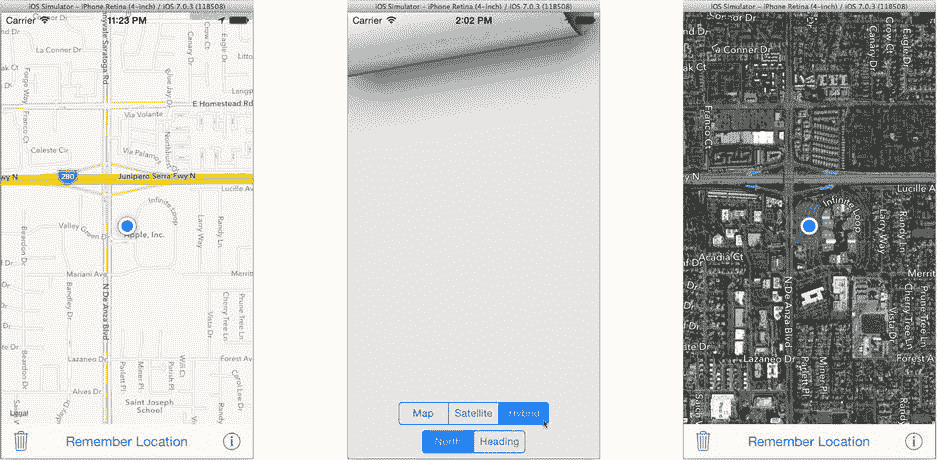

# 练习

`MKMapView` 可以显示图形地图、卫星图像或两者的组合。它可以以真北为方向定位地图，也可以根据设备的方向旋转地图。不让你的用户选择他们想使用这些选项中的哪一个是不礼貌的。Pigeon 锁定了地图视图的方向和显示模式。你的练习就是修复这个问题。

地图显示的这两个方面由两个属性控制：`mapType` 和 `userTrackingMode`。地图类型可以设置为显示图形（`MKMapTypeStandard`）、卫星图像（`MKMapTypeStellite`）或两者的组合（`MKMapTypeHybrid`）。用户的跟踪模式可以是跟随用户（`MKUserTrackingModeFollow`），或者跟随用户并显示方向（`MKUserTrackingModeFollowWithHeading`）。

你添加到界面的控件由你决定。有些应用会在地图界面上添加一个按钮，用于在不同地图类型和跟踪模式之间切换。对于 Pigeon，我决定将设置放在一个单独的视图控制器上，并使用页面卷曲转场来展示它们。

你可以在 `Learn iOS Development Projects` > `Ch 17` > `Pigeon E1` 文件夹中找到完成的项目。基本上，我是这样做的：

- 创建了一个名为 `HPMapOptionsViewController` 的 `UIViewController` 子类。
- 在故事板中添加了一个视图控制器对象，并将其类更改为 `HPMapOptionsViewController`。
- 在 `HPMapOptionsViewController` 中，我创建了一个 `mapView` 属性和两个 `UISegmentControl` 插座：`mapStyleControl` 和 `headingControl`。
- 我定义了三个操作方法：`-changeMapStyle:`、`-changeHeading:` 和 `-done:`。
- 在新的视图控制器中，我创建了一个包含三个选项（地图、卫星和混合）的分段控件，将其连接到 `mapStyleControl` 插座，并将其“值已更改”操作连接到 `-changeMapStyle:`。
- 我在第一个分段控件下方创建了第二个分段控件，包含两个选项（正北和方向），将其连接到 `headingControl` 插座，并将其“值已更改”操作连接到 `-changeHeading:`。
- 我将下方的分段控件约束到“底部布局指南”（`标准`），将上方的分段控件约束到下方的控件，然后将两者在容器视图中居中。
- 在 `HPMapOptionViewController` 的实现中，我使用 `mapView` 属性获取当前地图类型和跟踪模式，并在 `-viewWillAppear:` 中设置两个分段控件。
- `-changeMapStyle:` 操作更改地图的类型。
- `-changeHeading:` 操作更改地图的跟踪模式。
- `-done:` 方法取消视图控制器。
- 在 `HPViewController` 中，我添加了一个 `-prepareForSegue:` 方法，当转场标识为 `"mapOptions"` 时，设置 `HPMapOptionsViewController` 的 `mapView` 属性。
- 在故事板中，我从工具栏中的信息按钮创建了一个模态转场，连接到新的视图控制器，将其转场设置为“部分卷曲”，并为其分配标识符 `"mapOptions"`。

> **注意**：创建转场时，请确保选中了嵌入在工具栏按钮项内部的按钮（`UIButton`）对象；发送操作消息的是这个嵌入的控件，而不是工具栏按钮项。

最后，我向 `HPMapOptionsViewController` 的根视图对象添加了一个点击手势识别器，并将其连接到 `-done:` 操作，并将视图的背景颜色设置为非常浅（90%）的灰色。

这些都是你在第 10 章和第 12 章中学到的内容。以下是最终界面的效果图：

