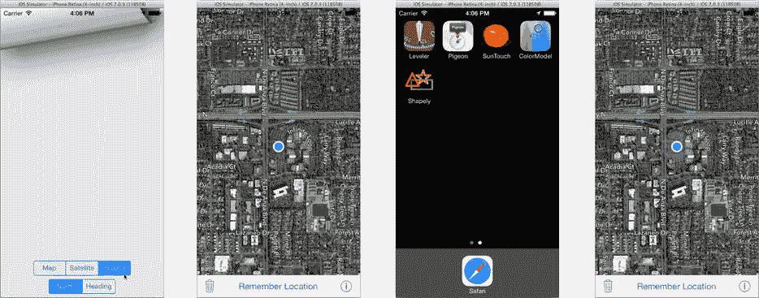

# 18. 记住我？

## 摘要

iOS 设备之所以能成为我们生活中不可或缺的一部分，其卓越特性之一便是能够记住大量信息：照片、电话号码、地址、日程安排、待办事项清单、课堂笔记、项目创意、主题演示文稿、播放列表、你想阅读的文章——这份清单似乎无穷无尽。但到目前为止，你在这本书中开发的所有应用都记不住任何东西。`MyStuff` 每次启动时都从一个空列表开始。`Wonderland` 甚至连你读到了哪一页都记不住。再看看 `Pigeon`，可怜的 `Pigeon`。它唯一的任务就是记住一个位置，却连这点也做不到。你将要解决所有这些问题，甚至更多。

正如你可能想象到的，在 iOS 中存储信息有许多不同的方式。接下来的两章将探讨基本的方法。我们将从用户默认设置（有时称为“偏好设置”）开始。这项技术最常用于记住小块信息，比如你的设置、你正在查看的标签页、你上次看到的页码、你收藏的 URL 列表等等。在本章中，你将：

-   了解属性列表
-   从用户默认设置中添加和检索值
-   为你的应用创建设置包
-   在云端存储和同步属性列表数据
-   保存和恢复视图以及视图控制器

属性列表的机制以及如何使用它们很简单；只需一两页就能解释清楚全部内容。如何最好地使用它们则是另一回事了。本章的大部分内容将集中于使用属性列表的策略，所以请戴上你的思考帽，让我们开始吧。

## 属性列表

属性列表是一个对象图，其中每个对象都属于以下类之一：

-   `NSDictionary`
-   `NSArray`
-   `NSString`
-   `NSNumber`（任何整数、浮点数或布尔值）
-   `NSDate`
-   `NSData`

虽然属性列表可以是一个单独的字符串，但它最常见的形式是一个包含字符串、数字、日期或其他数组和字典的字典。这些类的实例被称为属性列表对象。

说真的，就是这样。

## 序列化属性列表

属性列表在 iOS 中广泛使用，因为它们灵活、通用且易于序列化。在这种情况下，“序列化”（Cocoa 术语）的意思就是“序列化”（计算机科学术语）。Cocoa 使用序列化这个词来表示将属性列表转换为可传输的字节流。你自己通常不需要序列化属性列表，但它们经常在后台被序列化。

> **注意**
>
> 属性列表可以序列化为两种不同的格式：二进制和 XML。二进制格式是 Cocoa 独有的。它只能被另一个 Cocoa（OS X）或 Cocoa Touch（iOS）应用读取和理解。XML 格式是通用的，可以与世界上几乎任何计算机系统交换数据。二进制格式的优势在于效率（无论是大小还是速度）。XML 格式的优势在于可移植性。

一个被序列化并写入文件的属性列表被称为属性列表文件，通常是 `.plist` 文件。Xcode 包含一个属性列表编辑器，因此你可以直接创建和修改属性列表文件的内容。你将在本章后面用到这个属性列表编辑器。

对于 `Wonderland` 应用，我编写了一个 Mac（OS X）实用程序来生成 `Characters.nsarray` 资源文件。那是一个属性列表（一个包含字符串的字典数组），以 XML 格式序列化，并写入一个属性列表文件中。之后，你将它作为资源文件添加进来，你的应用通过反序列化该文件将其变回一个 `NSArray` 对象。

> **提示**
>
> 如果你想自己序列化一个属性列表，请使用 `NSPropertyListSerialization` 类，或者 `NSArray` 和 `NSDictionary` 中的某个 `-writeTo...` 方法。

## 用户默认设置

属性列表对象的一个主要应用场景是用户默认设置。用户默认设置是一个属性列表对象的字典，你可以用它来存储少量持久化信息，比如偏好设置和显示状态。你可以将任何属性列表值存储到用户默认设置对象（`NSUserDefaults`）中，并在之后检索它。你存储在那里的值会被序列化并保存在你的应用两次运行之间。

用户默认设置对象在你的应用启动时被创建。你上次存储在那里的任何值都会被反序列化并立即可用。如果你对用户默认设置做了任何更改，它们会自动被序列化并保存，以便在你下次运行应用时可用。

> **注意**
>
> 用户默认设置的值是你的应用本地的。换句话说，你的应用无法获取或更改其他 iOS 应用存储的值。

使用 `NSUserDefaults` 非常简单。你通过 `[NSUserDefaults standardUserDefaults]` 获取你应用的单一用户默认设置对象。你向其发送“set”消息来存储值（`-setInteger:forKey:`，`-setObject:forKey:`，`-setBool:forKey:` 等等）。你使用“get”消息来检索值（`-integerForKey:`，`-objectForKey:`，`-boolForKey:` 等等）。

## 让 Pigeon 学会记忆

你将使用用户默认设置来赋予 `Pigeon` 长期记忆能力。当你向一个应用添加用户默认设置时，需要考虑：

-   存储哪些值
-   将使用哪些属性列表对象和键
-   何时存储这些值
-   何时检索这些值

每个决定都会影响后续的决定，所以从第一步开始。对于 `Pigeon`，你希望它记住：

-   被记住的地图位置（显而易见）
-   地图类型（标准、卫星或混合）
-   跟踪模式（无或跟随航向）

下一步是决定你将使用哪些属性列表对象来表示这些属性。地图类型和跟踪模式很简单；它们都是整数属性，你可以直接将任何整数值存储在用户默认设置中。

然而，封装了地图位置的 `MKPointAnnotation` 对象不是一个属性列表对象，不能直接存储在用户默认设置中。相反，它的重要属性需要被转换为可以存储的属性列表对象。典型的技术是将你的信息转换成一个字符串或一个属性列表对象的字典，这两者都与用户默认设置兼容。对于 `Pigeon`，你将把注解转换成一个包含三个值的字典：它的纬度、它的经度和它的标题。这些信息足以在应用再次运行时重建该注解。

你还必须选择用于标识每个存储值的键。在顶层，你希望选择那些不会与 iOS 可能正在使用的任何键混淆的键。许多 iOS 框架也使用你应用的用户默认设置来保存信息。最简单的技术是使用你的项目使用的相同类前缀。例如，键“HPMapType”和“HPFollowHeading”不太可能与任何保留键冲突。用于子字典中值的键可以是任何你想要的。


### 最小化更新与代码量

处理好第一部分后，你现在可以专注于一个更微妙的问题：何时以及如何将数值保存到用户默认设置中，以及何时将其取回。

首先处理存储问题。通常，你希望尽可能少地更新用户默认设置，同时保持代码简洁。常见的解决方案有：

- 在数值发生变化时捕获
- 在某个可靠的退出点捕获

第一个解决方案非常适合 Pigeon。它只保存三个数值，而且这些数值都不常变化。用户可能会偶尔更改地图类型和朝向，但不太可能每分钟调整十几次这些设置。同样，用户到达某个地点时会保存位置，但只有到达另一个地方后才会再次保存。

限制用户默认设置更新的原因是，每次更改都会触发一系列事件，导致后台执行大量工作。只要不过度复杂化你的设计，就应该避免这种情况。优秀的设计会用最少的代码来最小化更新。当你开始使用基于云的存储时（本章后面会提到），避免不必要的更改就显得更为重要。

另一方面，有些你想保存的数值可能会频繁变化，或者在许多不同地方发生变化。例如，记住有声读物的播放位置就是一个不断变化的值。如果在音频播放的每一秒都捕获播放位置，那将非常荒谬。相反，更合理的做法是，在用户退出应用时简单记录当前的播放位置。你将在本章后面探讨这一技巧。

我们先从保存地图类型和跟踪模式开始，因为它们是最简单的。然后再处理地图位置的保存与恢复。

### 定义键

本教程从第 17 章练习中的 Pigeon 版本开始。你可以在 `Learn iOS Development Projects` ➤ `Ch 17` ➤ `Pigeon E1` 文件夹中找到该版本。如果你自己完成了练习的解决方案，将这段代码适配到你的应用应该没有问题。

首先定义用于标识用户默认设置中数值的键。选择 `HPViewController.h` 文件，添加以下三个常量：

```
#define kPreferenceMapType          @"HPMapType"
#define kPreferenceHeading          @"HPFollowHeading"
#define kPreferenceSavedLocation    @"HPLocation"
```

### 将数值写入用户默认设置

找到地图类型和跟踪模式发生变更的代码位置。如果你使用的是我为第 17 章编写的 Pigeon 版本，该代码在 `HPMapOptionsViewController.m` 中。添加以下 `#import` 语句，以便代码能使用你刚定义的键常量：

```
#import "HPViewController.h"
```

现在找到每个设置发生变更的代码。在 `HPMapOptionsViewController` 中，这发生在 `-changeMapStyle:` 和 `-changeHeading:` 方法中。修改代码使其如下所示（新代码以粗体显示）：

```
- (IBAction)changeMapStyle:(id)sender
{
    MKMapType mapType = self.mapStyleControl.selectedSegmentIndex;
    self.mapView.mapType = mapType;
    [[NSUserDefaults standardUserDefaults] setInteger:mapType
                                               forKey:kPreferenceMapType];
}

- (IBAction)changeHeading:(id)sender
{
    MKUserTrackingMode tracking = self.headingControl.selectedSegmentIndex+1;
    self.mapView.userTrackingMode = tracking;
    [[NSUserDefaults standardUserDefaults] setInteger:tracking
                                               forKey:kPreferenceHeading];
}
```

这个修改很直接，你应该能轻松地将同样的思路适配到自己的应用中。当设置变更时，新数值也会被存储到用户默认设置中。你只需要做这些。`NSUserDefaults` 会处理其余所有事情：将简单的整型值转换为适当的属性列表（`NSNumber`）对象，序列化数值，并存储它们，以便在下次应用运行时可用。

这是前半部分。现在你需要添加代码来检索这些已保存的数值，并在应用启动时恢复地图选项。

### 从用户默认设置中获取数值

选择 `HPViewController.m` 文件，找到 `-viewDidLoad` 方法。将 `[_mapView setUserTrackingMode:MKUserTrackingModeFollow]` 语句替换为以下代码：

```
NSUserDefaults *userDefaults = [NSUserDefaults standardUserDefaults];
_mapView.mapType = [userDefaults integerForKey:kPreferenceMapType];
NSUInteger trackingMode;
if ([userDefaults objectForKey:kPreferenceHeading]!=nil)
    trackingMode = [userDefaults integerForKey:kPreferenceHeading];
else
    trackingMode = MKUserTrackingModeFollow;
_mapView.userTrackingMode = trackingMode;
```

这段新代码从用户默认设置中检索地图类型和跟踪模式的整型值，并在地图显示之前用它们恢复这些属性。这样做的结果是，当用户运行应用并更改地图类型后，每次启动应用时地图类型都会保持不变。

但有一个问题。应用第一次运行时——或者如果用户从未更改过地图类型或跟踪模式——用户默认设置中这些键对应的值根本不存在。如果你请求一个不存在的键的属性列表对象，用户默认设置会返回 `nil`。如果你请求一个标量值（布尔值、整型或浮点型），用户默认设置会返回 `NO`、`0` 或 `0.0`。这里有三种处理这种情况的方法：

- 选择你的数值，使得 `nil`、`NO`、`0` 或 `0.0` 成为默认值
- 测试用户默认设置中是否包含某个键对应的值
- 为某个键注册一个默认值

地图类型属性采用了第一种方案。碰巧的是，Pigeon 中的初始地图类型是 `MKMapTypeStandard`，其整数值为 `0`。因此，如果用户默认设置中没有 `kPreferenceMapType` 键对应的值，它会返回 `0` 并将地图类型设置为标准模式——这非常完美。

跟踪模式就没这么幸运了。Pigeon 使用的初始跟踪模式是 `MKUserTrackingModeFollow`，其整数值为 `1`。如果 `kPreferenceHeading` 键没有对应的值，你肯定不希望错误地将 `trackingMode` 设置为 `MKUserTrackingModeNone`（`0`）。

因此，代码采用了第二种方案。它首先获取该键对应的属性列表（`NSNumber`）对象。如果该键没有值，用户默认设置返回 `nil`，你就知道从未设置过跟踪值。利用这一点，你可以要么恢复用户选择的模式，要么设置正确的默认值。

> **注意**：代码使用 `-objectForKey:` 方法来检查是否有任何值存在。属性列表中的每个值最终都由一个属性列表对象表示。而 `-boolForKey:`、`-integerForKey:` 等方法会为你将简单的整型、浮点型或布尔值与 `NSNumber` 对象进行相互转换。

以上就是保存和恢复这些地图设置所需的全部内容。现在该测试一下了，但这需要一点技巧。


### 测试用户默认设置

使用已配置的设备或模拟器，运行更新后的 Pigeon 应用。点击设置按钮，更改地图类型和跟踪模式，如图 18-1 所示。这会用新值更新用户默认设置，但这些值可能尚未保存到持久化存储中，也可能已经保存。这是因为用户默认设置会尽量提高效率，可能会等待更多更改后再开始序列化和存储过程。



图 18-1. 测试地图设置

一种促使它保存的方法是让应用进入后台。点击主页按钮，或在模拟器中使用 **Hardware** ➤ **Home** 命令即可实现，如图 18-1 中的第三幅图所示。当应用进入后台时，它不会立即停止运行，而是会为这种可能性做好准备。其中一个步骤就是序列化并保存所有用户默认设置。

用户默认设置安全存储后，您可以停止应用并重新启动它。切换回 Xcode，点击停止按钮。应用停止后，再点击运行按钮。应用会重新启动。此时，它会从保存的用户默认设置中加载地图类型和跟踪模式，并恢复这些属性。当视图控制器加载时，地图会完全保持用户上次离开时的状态。

恭喜！您已经掌握了在用户默认设置中保存和恢复值的基础知识。在接下来的几节中，您将进一步完善相关技术，并处理保存和恢复用户已保存地图位置这一（稍微）更复杂的问题。

## 注册默认值

恢复跟踪模式的代码非常丑陋。好吧，也许算不上“非常丑陋”，但确实有点丑陋。如果您有十几个这样的设置需要恢复，就需要编写大量重复代码。幸运的是，有一种更优雅的解决方案。

您的应用可以为用户默认设置中的特定键注册一组默认值——没错，它们是默认的默认值。当您的代码请求一个值（`[userDefaults integerForKey:kPreferenceHeading]`）时，用户默认设置会检查该键是否已设置过值。如果没有，它会返回一个默认值。对于整数，该值为 `0`——除非您指定了其他值。您可以通过 `-registerDefaults:` 方法来实现。

选择 `HPAppDelegate.m` 实现文件。这是您的应用委托对象。它会接收大量与应用状态相关的消息。其中之一是 `-application:willFinishLaunchingWithOptions:` 方法。这是应用对象接收到的第一条消息，通常也是您编写的代码首次运行的机会。

在文件顶部添加以下 `#import`，以便您的代码可以使用键常量：

```
#import "HPViewController.h"
```

在 `@implementation` 部分，添加此方法（如果已存在则更新）：

```
- (BOOL)            application:(UIApplication *)application
 willFinishLaunchingWithOptions:(NSDictionary *)launchOptions
{
    [[NSUserDefaults standardUserDefaults] registerDefaults:@{
         kPreferenceHeading: @(MKUserTrackingModeFollow)
     }];
    return YES;
}
```

`-registerDefaults:` 消息为用户默认设置的主字典建立了一个后备字典。用户默认设置对象实际上管理着多个字典，这些字典按域（domains）组织。当您请求检索一个值时，它会搜索每个域，直到找到值并返回。`-registerDefaults:` 方法会在所有其他域之后设置一个域，因此如果其他域都不包含 `kPreferenceHeading` 的值，这个字典就会提供一个。

**注意**  
用户默认设置中的每个域都有其自身的用途和属性。您存储值的域是持久化的；它会在应用运行之间被序列化和保存。注册域则不是持久化的。您传递给 `-registerDefaults:` 的值在应用退出时会消失。您可以在《偏好设置与设置编程指南》的“偏好设置的组织方式”章节中了解有关域的更多信息。

现在您可以清理 `-viewDidLoad` 中的代码。返回 `HPViewController.m`，将之前添加的代码替换为以下内容（更新的代码以粗体显示）：

```
NSUserDefaults *userDefaults = [NSUserDefaults standardUserDefaults];
_mapView.mapType = [userDefaults integerForKey:kPreferenceMapType];
_mapView.userTrackingMode = [userDefaults integerForKey:kPreferenceHeading];
```

是不是简单多了？由于您已经注册了一个默认值字典，您的代码无需再担心 `kPreferenceHeading` 没有值的情况，因为现在它总会有一个值。

现在地图设置已经持久化了，是时候处理已保存的地图位置问题了。


