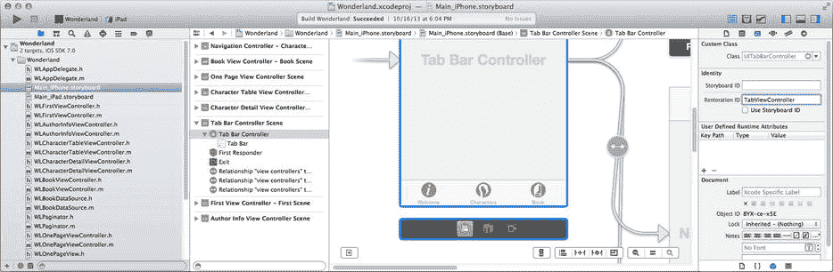

# 保存与恢复`savedLocation`

回到`HPViewController.m`。你将使用与之前保存和恢复已记住地图位置相同的技术。当位置信息（字典）建立时保存它，并在应用再次启动时恢复它。然而，`savedLocation`对象并非简单的整数，因此代码会稍微复杂一些。此外，你目前从代码中的两个位置建立新位置：当用户设置时以及应用再次启动时。如你所知，我不喜欢重复代码，因此我将让你整合设置位置的代码。稍后当你添加第三种设置位置的途径时，这将会派上用场。

总结一下，你需要修改以下内容：

- 添加`-setLocation:`方法来设置或清除已保存的位置
- 编写`-preserveAnnotation`和`-restoreAnnotation`方法，用于在用户默认设置中存储和检索地图位置
- 在`-dropPin:`和`-clearPin:`中添加代码以保存地图位置
- 在应用启动时恢复任何已记住的位置

首先，在其他`#import`语句之后立即导入你刚创建的类别：

```
#import "MKPointAnnotation+HPPreservation.h"
```

将新的方法声明添加到私有的`@interface HPViewController ()`部分：

```
- (void)setAnnotation:(MKPointAnnotation*)annotation;
- (void)preserveAnnotation;
- (void)restoreAnnotation;
```

将新的`-setAnnotation:`方法添加到`@implementation`部分：

```
- (void)setAnnotation:(MKPointAnnotation*)annotation
{
    if ([savedAnnotation isEqual:annotation])
        return;
    if (savedAnnotation!=nil)
        [_mapView removeAnnotation:savedAnnotation];
    savedAnnotation = annotation;
    if (annotation!=nil)
    {
        [_mapView addAnnotation:annotation];
        [_mapView selectAnnotation:annotation animated:YES];
    }
}
```

此方法将在整个`MKViewController`中用于设置或清除标注对象。它遵循常见的设值方法模式，处理以下情况：当`savedAnnotation`变量为`nil`、`annotation`参数为`nil`、两者都为`nil`或两者都不为`nil`时。并且，如果再次设置相同的标注对象，它会刻意不执行任何操作。

找到`-alertView:clickedButtonAtIndex:`方法。定位到`[self clearPin:self]`语句。删除该语句及其之后方法中的所有语句，并将其替换为以下代码：

```
MKPointAnnotation *newAnnotation = [MKPointAnnotation new];
newAnnotation.title = name;
newAnnotation.coordinate = location.coordinate;
[self setAnnotation:newAnnotation];
[self preserveAnnotation];
}
```

新代码做了两处更改。首先，它使用新的`-setAnnotation:`方法将标注添加到地图上。其次，它发送`-preserveAnnotation`消息，将新的地图位置存储到用户默认设置中。现在对`-clearPin:`方法进行类似的更改（修改的代码以粗体显示）：

```
- (IBAction)clearPin:(id)sender
{
    if (savedAnnotation!=nil)
    {
        [self setAnnotation:nil];
        [self preserveAnnotation];
    }
}
```

添加新的`-preserveAnnotation`和`-restoreAnnotation`方法：

```
- (void)preserveAnnotation
{
    NSUserDefaults *userDefaults = [NSUserDefaults standardUserDefaults];
    if (savedAnnotation!=nil)
    {
        NSDictionary *annotationInfo = [savedAnnotation preserveState];
        [userDefaults setObject:annotationInfo
                        forKey:kPreferenceSavedLocation];
    }
    else
    {
        [userDefaults removeObjectForKey:kPreferenceSavedLocation];
    }
}

- (void)restoreAnnotation
{
    NSUserDefaults *userDefaults = [NSUserDefaults standardUserDefaults];
    NSDictionary *restoreInfo = [userDefaults dictionaryForKey:kPreferenceSavedLocation];
    if (restoreInfo!=nil)
    {
        MKPointAnnotation *restoreAnnotation = [MKPointAnnotation new];
        [restoreAnnotation restoreState:restoreInfo];
        [self setAnnotation:restoreAnnotation];
    }
}
```

`-preserveAnnotation`将`savedAnnotation`对象转换为一个字典，适合存储到用户默认设置中。如果没有地图位置，它会刻意从用户默认设置中删除该键对应的任何已保存值。你不能将`nil`作为值存储在用户默认设置中。若要不存储任何内容，请通过发送`-removeObjectForKey:`消息来删除该值。

`-restoreAnnotation`方法逆转了该过程，从用户默认设置中检索地图位置信息的字典，并将其转换回具有相同信息的`MKPointAnnotation`对象。只剩下一件事要做。在`-viewDidLoad`中，将以下语句添加到方法的末尾：

```
[self restoreAnnotation];
```

Pigeon 现在拥有了大象般的记忆力！复用你之前测试地图设置的测试步骤：

运行 Pigeon → 在地图上记住一个位置 → 按 Home 键将应用置于后台 → 在 Xcode 中停止应用 → 再次运行应用

当应用重新启动时，保存的位置仍然存在。成功！

该项目演示了在应用中利用用户默认设置进行工作的几种常见技巧。记住用户的偏好、设置和工作数据（如已保存的地图位置）都是用户默认设置的完美用途。

另一个常见用途是保存应用的显示状态。当用户在音乐应用中选择“艺术家”标签页，深入浏览一张专辑，最终定位到一首歌曲时，第二天启动音乐应用时，他们不会惊讶地发现仍然停留在同一艺术家、同一专辑、同一歌曲以及“艺术家”标签页中。这是因为音乐应用付出了努力，精确记住了用户离开时的视图控制器，并在下次启动时重构了它。

根据你目前所知，你可能会认为需要编写代码来捕获标签视图和导航视图控制器的状态，将其转换为属性列表对象，存储在用户默认设置中，然后在应用重启时再次展开所有内容。这基本上是实际发生的情况，但你会很高兴地知道，你不需要（大量）自己动手。iOS 有一个特定的机制，用于保存和恢复视图控制器的状态。

### 持久化视图

在“最小化更新和代码”部分，我提到捕获用户默认设置的主要技巧是（a）当值发生变化时，或（b）在可靠的退出点。你在 Pigeon 中使用了技巧（a），因为它非常合适。你保存的值仅在少数几个地方发生变化，而且变化不频繁。但情况并非总是如此。

有些变化持续发生（例如用户当前所在的视图控制器），而有些变化则以多种不同的方式发生，导致很难全部捕获。在这些情况下，第二种方法是最佳选择。你不必担心尝试监视，甚至不必关心发生了哪些变化。只需要安排在用户退出应用、关闭视图控制器或退出他们正在使用的任何界面之前捕获该值即可。有两个适合捕获变化的退出点：

- 关闭视图控制器
- 应用进入后台

对于视图控制器，你可以在关闭视图控制器的代码中捕获值。在某些情况下，如弹出视图控制器，你可能需要做一些额外的工作，因为点击弹出框外部可能会隐式关闭它。你还需要捕获该消息（`-popoverControllerDidDismissPopover:`），以免错过该退出路径。但大多数情况下，捕获视图控制器被关闭的所有方式通常相当容易。


### 淡入后台

捕获变更（尤其是视图状态）的另一个绝佳时机，是应用切换到后台的时候。要理解这项技巧，你需要了解 iOS 应用所经历的状态。你的 iOS 应用始终处于以下状态之一：

- 未运行
- 前台
- 后台
- 已挂起

应用在启动前或最终被终止后，处于“未运行”状态。处于该状态时，几乎没有任何操作发生。

**前台**状态是你最熟悉的状态。此时应用显示在设备屏幕上，用户正在与之交互。前台包含**活跃**和**非活跃**两个子状态，应用在这两者之间切换。活跃意味着应用正在运行。当有电话或弹窗等事件打断时，应用会进入非活跃状态，但它仍然显示在屏幕上。应用在非活跃状态下不会执行代码。非活跃状态通常不会持续很久。

当你按下主页按钮、切换到其他应用或屏幕锁定时，应用会进入**后台**状态。应用会继续运行一小段时间，但很快就会进入**已挂起**状态。

应用一旦被挂起，就不会再执行任何代码。如果 iOS 后来决定需要回收应用占用的内存，或者用户关闭了设备，被挂起的应用将被终止（无警告）并回到**未运行**状态。

但应用也可能不会被终止。如果用户重新启动应用，而它仍处于后台状态，那么应用不会被重新启动，只会被重新激活。它会直接进入前台状态并立即恢复执行。在应用的生命周期中，它可能会反复进入和退出后台状态。

**注意**  
你可以进行特殊设置，让应用在后台继续运行。例如，即使应用不在前台，你也可以请求播放音乐或接收用户位置变更。详情请参阅《iOS 应用编程指南》中的“后台执行与多任务”部分。

应用会利用这段短暂的后台处理时间来为终止做准备。此时，用户默认设置会将其属性值序列化并保存到持久化存储中。这也是捕获界面状态的绝佳时机。

应用可以通过两种方式得知自己何时进入了后台状态。应用委托对象会收到一条 `-applicationDidEnterBackground:` 消息。大约在同一时间，一条 `UIApplicationDidEnterBackgroundNotification` 通知会被发出。重写那个方法，或者让任何对象观察该通知，然后保存你需要的任何状态信息。

**警告**  
iOS 大约给应用 5 秒的后台处理时间来保存状态并完成进行中的工作。应用必须在这段时间内完成收尾工作，或者采取明确步骤来启用后台处理。

iOS 还提供了一种机制来捕获并随后恢复视图控制器的状态。当应用进入后台状态时，该机制会被自动调用。

### 保留视图控制器

以 Wonderland 应用为例（我是认真的，请找到第 12 章中完成的 Wonderland 应用，你将要修改它）。用户可能会整天在标签页之间切换、浏览表格视图中的角色，以及翻阅页面视图。你需要在应用切换到后台时捕获关键信息：用户正在使用哪个标签页，以及他们正在查看哪一页。你将用这些信息在下次启动应用时恢复那些视图。

当 iOS 应用进入后台时，iOS 会检查活跃的视图控制器。如果配置得当，它会自动将视图控制器的状态保存在用户默认设置中。这结合了 iOS 已知的视图控制器信息以及你的代码提供的额外信息。具体来说，iOS 会记住正在显示哪个标签页视图、表格视图的滚动位置等。在此基础上，你可以添加只有你的应用才能理解的自定义信息。对于 Wonderland 应用，你需要记住用户正在阅读的页码（请记住，页面视图控制器本身没有页码的概念，这是你为页面视图控制器数据源自行设计的）。

首先要解决的是“配置得当”这一前提条件。要让 iOS 为你工作，自动保留和恢复视图控制器，你必须做两件事：

- 实现 `-application:shouldSaveApplicationState:` 和 `-application:shouldRestoreApplicationState:` 这两个应用委托方法。
- 为视图控制器（从根视图控制器开始）分配恢复标识符。

第一步是告诉 iOS 你希望它协助保留和恢复应用的视图状态。这些方法必须被实现，并且必须返回 `YES`，否则 iOS 将直接忽略你的应用。这两个方法还有一个次要功能：如果你有任何希望在应用范围内保存的自定义状态信息，可以在这些方法中实现。Wonderland 应用没有这类信息，因此只需要返回 `YES` 即可。

打开第 12 章中的 Wonderland 项目，选择 `WLAppDelegate.m` 文件。在 `@implementation` 部分添加以下两个方法：

```
- (BOOL)          application:(UIApplication *)application
   shouldSaveApplicationState:(NSCoder *)coder
{
    return YES;
}

- (BOOL)             application:(UIApplication *)application
   shouldRestoreApplicationState:(NSCoder *)coder
{
    return YES;
}
```


### 指定恢复标识符

当 iOS 获准保存视图状态后，它会从当前显示的根视图控制器开始，检查其是否设置了恢复标识符。恢复标识符是一个字符串属性（`restorationIdentifier`），用于标记该视图控制器的状态信息。它同时也像一个开关，告诉 iOS 是否要保存并在最终恢复该视图控制器的状态。如果 `restorationIdentifier` 属性为 `nil`，iOS 会忽略该视图控制器；不会保存任何内容，也不会恢复任何内容。

接着，iOS 会查找所有设置了 `restorationIdentifier` 的视图（`UIView`）对象并进行保存。如果根视图控制器是一个容器视图控制器，则会对每一个子视图控制器重复整个过程，捕获那些设置了恢复 ID 的视图控制器的状态，并忽略那些没有设置的。

**注意**：对于可恢复视图控制器的搜索会跳过任何缺少恢复 ID 的视图控制器。因此，要想保存标签视图控制器内部导航视图控制器中的表格视图控制器的状态，这些控制器中的每一个都必须设置一个恢复 ID，否则表格视图控制器的状态将不会被捕获。

你可以通过编程方式设置恢复 ID，但如果你的视图控制器是在 Interface Builder 文件中定义的，那么最简单的方法是在那里进行设置。选择 `Main_iPhone.storyboard`（或 `_iPad`）文件。选择根标签栏视图控制器并切换到标识检查器，如图 18-2 所示。找到 `Restoration ID` 属性并将其设置为 `TabViewController`。



**图 18-2.** 设置恢复 ID 属性

现在，您已完成了让 iOS 保存和恢复标签视图控制器状态所需的所有操作。然而，这其实没什么大用。您想要的是，当用户再次启动 Wonderland 应用时，他们退出时正在查看的那个子视图控制器能重新出现。要实现这一点，每个子视图控制器也必须被恢复。使用标识检查器，参照表 18-1，选择每个子视图控制器并为它们分配恢复 ID。

**表 18-1.** Wonderland 视图控制器恢复 ID

| 视图控制器 | 恢复 ID |
| --- | --- |
| 根标签视图控制器 | `TabViewController` |
| `WLFirstViewController` | `CoverViewController` |
| `UINavigationController` | `CharacterNavController` |
| `WLBookViewController` | `BookViewController` |

这足以记住并在之后恢复用户退出应用时正在查看的顶级标签。试一下：

- 运行 Wonderland 应用
- 选择角色或书籍标签
- 按下 Home 键将应用置入后台
- 在 Xcode 中停止应用
- 再次运行应用

恢复 ID 字符串可以是任何你想要的值；它们只需要在其他视图控制器的范围内保持唯一即可。

### 自定义恢复

到目前为止，唯一被恢复的视图状态是用户所在的标签。如果用户正在查看角色的信息，或者已经翻到了书的第 87 页，他们在重新启动应用后，会回到角色列表和第 1 页。

决定保存多少视图状态信息取决于你。通常来说，用户期望回到他们退出应用时正在做的事情。但这也有一定的限度。如果用户进入了一个模态视图控制器来选择一首歌或输入密码，两天后让他们回到那个精确的视图不一定合理。你需要决定你的恢复逻辑应该深入到什么程度。

对于 Wonderland 应用，你肯定希望用户回到书的同一页。如果用户不得不翻阅 86 页才能回到昨天阅读的位置，他们会非常恼火。然而，页面视图控制器对你的书籍数据结构一无所知。那是你在编写 `WLBookDataSource` 类时创建的。如果你想保存并恢复他们所在的页面，你就得编写一些代码来实现这一点。

每个具有恢复 ID 的视图和视图控制器对象在应用进入后台时都会收到一个 `-encodeRestorableStateWithCoder:` 消息。在应用启动期间，它会收到一个 `-decodeRestorableStateWithCoder:` 消息来恢复自身。如果你想保存自定义状态信息，请覆盖这些方法。

选择 `WLBookViewController.m` 实现文件。将这两个方法添加到 `@implementation` 部分：

```
- (void)encodeRestorableStateWithCoder:(NSCoder *)coder
{
    [super encodeRestorableStateWithCoder:coder];
    WLOnePageViewController *currentView = self.viewControllers[0];
    [coder encodeInteger:currentView.pageNumber forKey:@"page"];
}

- (void)decodeRestorableStateWithCoder:(NSCoder *)coder
{
    [super decodeRestorableStateWithCoder:coder];
    NSUInteger page = [coder decodeIntegerForKey:@"page"];
    if (page != 0)
    {
        WLOnePageViewController *currentView = self.viewControllers[0];
        currentView.pageNumber = page;
    }
}
```

第一个方法获取当前在页面视图控制器中显示的视图控制器。`WLOnePageViewController` 知道它正在显示的是哪个页码。这个数字被保存在 `NSCoder` 对象中。

**注意**：`NSCoder` 是 iOS 归档框架的主力。通过存储值和属性来使用它，这些值和属性会被转换为序列化数据。你将在下一章全面了解 `NSCoder`。

当你的应用重新启动时，页面视图控制器会收到一个 `-decodeRestorableStateWithCoder:` 消息。它会在 `NSCoder` 对象内部查找是否包含已保存的页码。如果有，它会在视图出现之前恢复该页码，将用户带回他们退出时的位置。这不算太难，对吧？

测试你的新代码。启动 Wonderland，翻阅几页书，然后退出应用并在 Xcode 中停止它。再次启动，你最后查看的那一页将会重新出现，仿佛你从未离开过。

### 更深层次的恢复

究竟要保存多少视图状态信息取决于你。以下是制定恢复策略的一些建议：

-   `UIView` 对象也可以被保存。为它们分配一个恢复 ID，如有必要，实现 `-encodeRestorableStateWithCoder:` 和 `-decodeRestorableStateWithCoder:` 方法。
-   如果你想恢复表格或集合视图的数据模型状态，你的数据源对象应该采用 `UIDataSourceModelAssociation` 协议。然后实现两个方法（`-indexPathForElementWithModelIdentifier:inView:` 和 `-modelIdentifierForElementAtIndexPath:inView:`），用于记住和恢复用户在表格中的位置。
-   你可以在应用代理的 `-application:shouldSaveApplicationState:` 和 `-application:shouldRestoreApplicationState:` 方法中对任何你想要的内容进行编码和恢复。你可以使用这些方法执行你自己的视图控制器恢复，或者结合使用自动恢复和自定义解决方案。

所有详细内容都在 iOS 应用编程指南的“状态保存与恢复”一章中进行了说明，你可以在 Xcode 的文档和 API 参考窗口中找到它。


