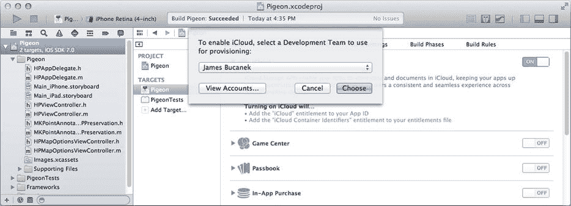
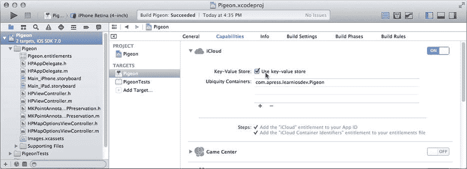
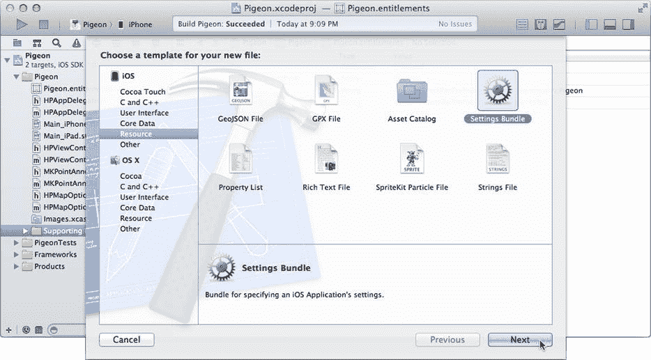
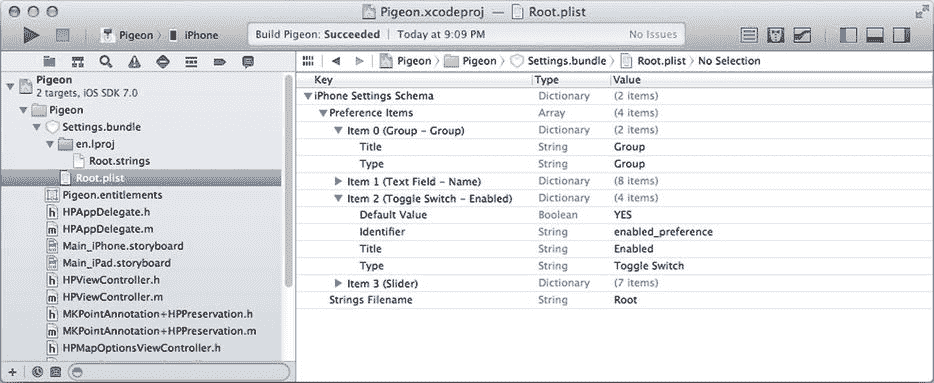
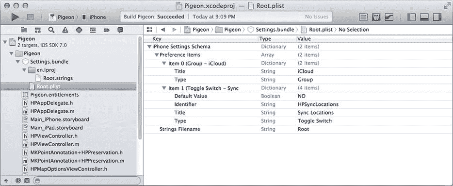
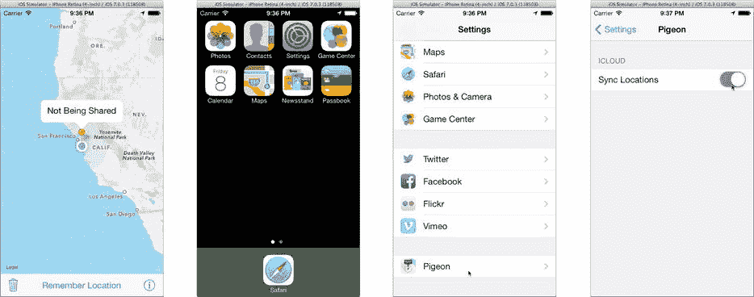

# 云端之鸽

云存储和同步是热门新技术，能让 iOS 设备发挥更大作用。在一台设备上设置一个预约，它会自动出现在你所有其他设备上。这项神奇技术背后的原理十分复杂，但 iOS 让你的应用能够轻松利用它。

iOS 提供了多种云存储和同步功能，但目前最简单易用的是 `NSUbiquitousKeyValueStore` 对象。它的工作方式与用户默认设置几乎完全相同。区别在于，你存储其中的任何内容都会自动与你的所有其他 iOS 设备同步。哇！

对于哪些信息应该或可以跨设备同步，既存在实际限制，也有策略约束。你的首要任务是决定哪些信息适合共享。通常，用户设置和视图状态仅在本地保留。如果在 iPhone 上更改地图类型，然后突然发现 iPad 的地图视图也随之改变，那会显得很奇怪。另一方面，如果你的用户正在 iPad 上阅读《爱丽丝梦游仙境》，他们拿起 iPhone 就能在同一页打开它，那岂不是非常神奇？

另一个需要谨慎选择同步内容的理由是，iCloud 服务严格限制了通过 `NSUbiquitousKeyValueStore` 可以共享的信息量。限制如下：

-   数据总量不超过 1MB
-   对象数量不超过 1000 个
-   “合理”的更新次数

苹果并未明确说明“合理”的具体标准，但最好尽量减少对 `NSUbiquitousKeyValueStore` 的更改次数。

警告

如果滥用这些限制，iCloud 服务器可能会延迟你的更新，甚至完全停止同步你的数据。

## 在云端存储值

通过添加云同步功能，让你的 Pigeon 应用展翅高飞。你将同步的唯一信息是保存过的地图位置——地图类型和追踪模式不适合同步。使用 `NSUbiquitousKeyValueStore` 的方式几乎与使用 `NSUserDefaults` 完全相同。事实上，它们如此相似，以至于你将复用本章开头编写的许多相同策略和方法。

通过 `[NSUbiquitousKeyValueStore defaultStore]` 获取单例 `NSUbiquitousKeyValueStore` 对象的引用。你设置的任何值都会自动序列化并与 iCloud 服务器同步。

选择 `HPViewController.m`，并向私有 `@interface HPViewController ()` 中添加一个实例变量。这将保留云存储对象（新代码以粗体显示）：

```objc
@interface HPViewController () <UIAlertViewDelegate>
{
    MKPointAnnotation           *savedAnnotation;
    UIImageView                 *arrowView;
    NSUbiquitousKeyValueStore   *cloudStore;
}
```

通过在 `–viewDidLoad` 方法的末尾添加以下语句来初始化新变量：

```objc
cloudStore = [NSUbiquitousKeyValueStore defaultStore];
[cloudStore synchronize];
```

这段代码获取并保存了单例云存储对象的引用，然后请求立即同步。这会促使 iOS 更新存储中可能被其他 iOS 设备更改的值，反之亦然。同步最终会完成，但这会在应用首次启动时加快进程，并且这是唯一需要发送 `-synchronize` 的地方。

注意

我让你创建并保存 `NSUbiquitousKeyValueStore` 对象的引用，而不是在需要时直接使用 `[NSUbiquitousKeyValueStore defaultStore]`，这是有原因的。到本章结束时，你便会明白。

现在更新 `-preserveAnnotation` 方法，使其同时将标注信息存储在用户默认设置和云端（新代码以粗体显示）：

```objc
- (void)preserveAnnotation
{
    NSUserDefaults *userDefaults = [NSUserDefaults standardUserDefaults];
    if (savedAnnotation!=nil)
        {
        NSDictionary *annotationInfo = [savedAnnotation preserveState];
        [userDefaults setObject:annotationInfo
                         forKey:kPreferenceSavedLocation];
        [cloudStore setDictionary:annotationInfo
                           forKey:kPreferenceSavedLocation];
        }
    else
        {
        [userDefaults removeObjectForKey:kPreferenceSavedLocation];
        [cloudStore removeObjectForKey:kPreferenceSavedLocation];
        }
}
```


### 云端监听

与用户默认设置不同，云端的值随时可能发生变化。因此，仅仅在应用启动时读取这些值是远远不够的。你的应用必须准备好随时响应这些变化，无论它们何时发生。此外，你的 iOS 设备并不总是能够访问云端。它可能处于“飞行”模式、遭遇信号不良的蜂窝网络，或者你为了隐私正在法拉第笼中使用设备。无论何种情况，你的应用都应该在这些条件下以智能的方式继续工作。

首选的解决方案是在本地用户默认设置中镜像你的云端设置。这正是 `-preserveAnnotation` 方法所做的。当地理位置发生变化时，用户默认设置和云端都会用相同的值进行更新。如果云端目前无法更新，这不会影响应用的运行。同样，如果云端中的某个值发生了变化，你也应该更新你的用户默认设置以保持一致。

这就引出了你的任务：监听云端的变化。那么，你如何得知云端何时发生了变化呢？在本书的当前阶段，你应该在心里默念“通知、通知、通知”，因为这正是你监听这些变化的方式。你的视图控制器会监听 `NSUbiquitousKeyValueStoreDidChangeExternallyNotification` 通知（它也是 iOS 中名字最长的通知的有力竞争者）。你将创建一个新方法来处理这些变化，因此，首先在 `HPViewController.m` 中的私有 `@interface HPViewController ()` 部分添加该方法：

```
- (void)cloudStoreChanged:(NSNotification*)notification;
```

找到 `-viewDidLoad` 方法，并增强设置云端存储的代码（新代码以粗体显示）：

```
cloudStore = [NSUbiquitousKeyValueStore defaultStore];
```

```
NSNotificationCenter *center = [NSNotificationCenter defaultCenter];
```

```
[center addObserver:self
           selector:@selector(cloudStoreChanged:)
               name:NSUbiquitousKeyValueStoreDidChangeExternallyNotification
             object:cloudStore];
```

```
[cloudStore synchronize];
```

**警告**

你必须在发送 `-synchronize` 之前注册监听变更通知，否则你的应用可能会遗漏云端已有的变更。

现在，每当云端发生任何变化时，都会收到 `-cloudStoreChanged:` 消息。最后一步是编写该方法：

```
- (void)cloudStoreChanged:(NSNotification*)notification
{
    NSDictionary *cloudInfo = [cloudStore dictionaryForKey:
                                            kPreferenceSavedLocation];
    NSUserDefaults *localStore = [NSUserDefaults standardUserDefaults];
    [localStore setObject:cloudInfo forKey:kPreferenceSavedLocation];
    [self restoreAnnotation];
}
```

每当云端值发生变化时——因为只有一个值，所以你甚至无需担心是哪个值发生了改变——该方法会检索新值并将其拷贝到本地用户默认设置中。然后，它会发送 `-restoreAnnotation` 以从用户默认设置中恢复地图位置，此时该位置与云端中的值相同。

通过 `-preserveAnnotation` 和 `-cloudStoreChanged:` 的配合，用户默认设置始终拥有最新的（已知）位置。即使某些因素干扰了云端同步，应用仍然拥有一个可用的位置，并能继续正常运行。

最后，考虑一下你之前编写的 `-restoreAnnotation` 方法。它从未考虑过可能已经存在地图标注的情况。这是因为之前唯一调用它的时机是应用启动时。而现在，它可以在任何时候被调用，以设置或清除已保存的地图位置。在该方法末尾添加一个 else 子句来处理这种情况（新代码以粗体显示）：

```
if (restoreInfo!=nil)
    {
    MKPointAnnotation *restoreAnnotation = [MKPointAnnotation new];
    [restoreAnnotation restoreState:restoreInfo];
    [self setAnnotation:restoreAnnotation];
    }
else
    {
    [self setAnnotation:nil];
    }
```

### 启用 iCloud

你所有的 iCloud 代码都已准备好运行，但有一个问题：它们全都无法工作。在应用能够使用 iCloud 服务器之前，你必须为你的应用添加一个 iCloud 授权。这反过来要求你向 Apple 注册你应用的包标识符并获取一个授权证书。这些步骤并不复杂，但却是必需的。

在导航器中选择 Pigeon 项目。确保选中了 Pigeon 目标（通过侧边栏或弹出菜单），然后切换到“Capabilities”（功能）标签页。找到 iCloud 部分并将其打开，如图 18-3 所示。



**图 18-3.** 启用 iCloud 服务

选择将要测试此应用的开发者团队，并点击“Choose”（选择）。Xcode 将向 iOS Dev Center 注册你应用的唯一 ID，并启用该 ID 以用于 iCloud 服务。然后，它会下载并安装允许你的应用使用 iCloud 服务器所必需的授权证书。现在，你应该启用键值存储的使用，如图 18-4 所示。这是 `NSUbiquitousKeyValueStore` 类所依赖的 iCloud 服务。



**图 18-4.** 启用 iCloud 的键值存储

当你启用键值存储时，Xcode 会生成一个通用容器标识符。该标识符用于整理和同步你放入 `NSUbiquitousKeyValueStore` 中的所有值。通常，你使用的是你应用的包标识符——这也是默认值。这会将你应用的 iCloud 值与用户的任何其他应用所存储的 iCloud 值分开。

**提示**

你可以输入另一个应用（你编写并注册的）所使用的键值存储标识符。这允许你的应用与另一个应用共享一个键值存储。例如，如果你创建了同一个应用的“精简版”和“专业版”，你可能会这样做。两个应用可以使用相同的键值存储来共享和同步它们的设置。


好的，作为高级文档工程师和翻译员，我将严格遵循您提供的格式和注意事项，将给定的英文文本翻译成中文。


### 测试云同步

要测试 Pigeon 的云版本，你需要两台配置好的 iOS 设备。两台设备都需要有活跃的网络连接，登录同一个 iCloud 账户，并且打开了 iCloud“文稿与数据”功能。在两台设备上都启动 Pigeon 应用。在其中一台设备上，点击“记住位置”按钮，为它起一个名字，然后等待。如果一切设置正确，另一台设备上应该会在大约一分钟内出现一个完全相同的大头针。尝试在第二台设备上“记住”一个位置。尝试清除位置。

**提示**

即使你只有一台 iOS 设备，你仍然可以通过检查 `-synchronize` 方法返回的值来判断 `NSUbiquitousKeyValueStore` 是否在正常工作。如果 `-synchronize` 返回 `YES`，则表明云值已成功同步，一切正常。如果它返回 `NO`，则说明存在问题。这可能是网络原因。也可能意味着你的 App 标识符、授权或配置文件没有正确配置。

你不需要让两个应用同时运行——这只是体验 iCloud 同步最酷的方式。在一台设备上启动 Pigeon，记住一个位置，然后退出。倒数到二十。在第二台设备上启动 Pigeon，你会立刻看到更新后的位置。这是因为无处不在的键值存储只要有网络连接，就会在后台持续工作，以保持你所有值同步。

并非所有人都希望他们的地图位置能与所有其他设备共享。有些用户会觉得第一个非云版本的 Pigeon 就完全够用了。何不让所有用户都满意，给他们一个选择呢？添加一个配置设置，让他们可以选择开启或关闭云同步。现在的问题是将这个设置放在哪里？是把它放在地图选项视图控制器里？还是创建另一个设置按钮，将用户带到第二个设置视图？或者，你可以在地图视图上添加一个带有小云朵图标的小按钮？那会非常可爱。有很多可能性，但我希望你跳出常规思维。或者，更准确地说，我希望你跳出你的 App 来思考。你的任务是创建一个界面让用户开启或关闭云同步，*但不要把它放在你的 App 里*。困惑吗？不必，这比你想象的要简单。

## 打包你的设置

设置包是一个属性列表文件，描述了一个或多个你的用户可以设置的默认值。看到了吧，属性列表的另一个用途。用户不是在 App 内部，而是在每个 iOS 系统自带的“设置”App 中设置它们。使用设置包非常简单：

-   你创建一个值描述的列表。
-   iOS 将该列表转换为出现在“设置”App 中的界面。
-   用户启动“设置”App 并更改他们的设置。
-   更新后的值会出现在你的 App 的用户默认设置中。

设置包对于用户不经常更改，并且你不想让其杂乱地出现在你的 App 界面中的设置特别有用。对于 Pigeon，你将创建一个极其简单的设置包，其中包含一个选项：使用 iCloud 同步。可选值为开或关（`YES` 或 `NO`）。让我们开始吧。

### 创建一个设置包

在 Pigeon 项目中，选择“文件 ➤ 新建 ➤ 文件...”命令（通过“文件”菜单或在项目导航器中右键/按住 Control 键单击）。在 iOS 部分，找到 `Resource` 组，然后选择 `Settings Bundle` 模板，如图 18-5 所示。



**图 18-5.** 创建设置包资源

确保选中 Pigeon 目标，并将新的设置资源添加到你的项目中。

**注意**

不要更改新文件的名称。你的设置包必须命名为 `Settings.bundle`，否则 iOS 将忽略它。

一个设置包包含一个名为 `Root.plist` 的属性列表文件。该文件包含一个字典。你可以在图 18-6 中看到这一点。`Root.plist` 文件描述了当用户在“设置”App 中选择你的应用时（首先）出现的设置。



**图 18-6.** 设置包模板中的属性列表

字典包含一个键为 `Preference Items` 的数组值。该数组包含一个字典列表。每个字典描述一个设置或组织项目。可以包含的设置种类列在表 18-2 中，组织项目列在表 18-3 中。每种类型的详细信息在“偏好设置与设置编程指南”的“实现 iOS 设置包”一章中进行了描述，你可以在 Xcode 的“文档与 API 参考”窗口中找到它。

**表 18-3.** 设置包组织类型

| 设置类型 | 键 | 描述 |
| --- | --- | --- |
| 分组 | `PSGroupSpecifier` | 将后面的设置组织到一个组中。 |
| 子表 | `PSChildPaneSpecifier` | 呈现一个表格项，点击后显示另一组设置，从而创建设置层级结构。 |

**表 18-2.** 设置包值类型

| 设置类型 | 键 | 界面 | 值 |
| --- | --- | --- | --- |
| 文本字段 | `PSTextFieldSpecifier` | 文本字段 | 一个字符串 |
| 开关 | `PSToggleSwitchSpecifier` | 开关 | 任意两个值，但通常是 `YES` 和 `NO` |
| 滑块 | `PSSliderSpecifier` | 滑块 | 一个范围内的任意数值 |
| 多值 | `PSMultiValueSpecifier` | 表 | 值列表中的一个值 |
| 单选组 | `PSRadioGroupSpecifier` | 选择器 | 值列表中的一个值 |
| 标题 | `PSTitleValueSpecifier` | 标签 | 仅显示（值不可更改） |

你的设置包可以邀请用户输入一个字符串（如昵称），让他们打开或关闭设置，从一个值列表中进行选择（如“地图”，“卫星”，“混合”），或使用滑块选择一个数字。如果你的 App 有很多设置，你可以将它们组织成组，甚至可以链接到另一个包含更多设置的集合。

图 18-6 中显示的值，在一个名为 `Group`（这个命名相当缺乏想象力）的单一组中展示了三个设置。这些设置包括一个文本字段、一个开关和一个滑块。

对于 Pigeon，你只有一个布尔设置。选择 `Root.plist` 文件，并使用 Xcode 的属性列表编辑器进行以下更改：

-   选择 `Item 3 (Slider)` 行，并按删除键（或选择“编辑 ➤ 删除”）。
-   选择 `Item 1 (Text Field - Name)` 行，并按删除键（或选择“编辑 ➤ 删除”）。
-   展开 `Item 0 (Group - Group)` 行。将其 `Title` 的值更改为 `iCloud`。
-   展开 `Item 1 (Toggle Switch - Enabled)` 行。将 `Default Value` 更改为 `NO`。
-   将 `Identifier` 更改为 `HPSyncLocations`。
-   将 `Title` 更改为 `Sync Locations`。

你完成的设置包应该看起来像图 18-7 中的那样。



**图 18-7.** Pigeon 设置包


### 使用设置捆绑包的值

设置捆绑包已配置完毕。现在只需将你刚刚定义的值应用到应用中。选择`HPViewController.h`文件并添加以下常量：

```
#define kPreferenceLocationsInCloud @"HPSyncLocations"
```

切换到`HPViewController.m`文件，找到`-viewDidLoad`方法，并在云存储设置代码中添加以下条件语句（新代码以粗体显示）：

```
if ([userDefaults boolForKey:kPreferenceLocationsInCloud])
    {
    cloudStore = [NSUbiquitousKeyValueStore defaultStore];
    NSNotificationCenter *center = [NSNotificationCenter defaultCenter];
    [center addObserver:self
       selector:@selector(cloudStoreChanged:)
           name:NSUbiquitousKeyValueStoreDidChangeExternallyNotification
         object:cloudStore];
    [cloudStore synchronize];
    }
```

就这么简单！如果你在想“但代码中那些将值存储到`cloudStore`的地方怎么办”，你完全不用担心。现有代码利用了 Objective‑C 的一个特性：向`nil`对象发送的消息会被忽略。如果`kPreferencesLocationsInCloud`的值为`NO`，`cloudStore`永远不会被设置，保持为`nil`。向`nil`发送的消息（如`[cloudStore removeObjectForKey:kPreferenceSavedLocation]`）不会执行任何操作。最终效果是，`cloudStore`设为`nil`时，Pigeon 不会对 iCloud 的通用键值存储进行任何更改，也不会接收任何更改通知。完整说明请参阅第 20 章中的“nil 是你的朋友”部分。

### 测试设置捆绑包

运行 Pigeon，如图 18-8 所示。如果你仍连接着两台 iOS 设备，可以验证你的应用不再将地图位置保存到云端。每个应用都独立运行。



图 18-8.

测试设置捆绑包

在 Xcode 中停止你的应用。这将返回到主屏幕（图 18-8 中的第二个屏幕截图）。找到并启动“设置”应用。向下滚动直到找到 Pigeon 应用（图 18-8 中的第三个屏幕截图）。点击它，你将看到之前定义的设置（图 18-8 右侧）。

将“同步位置”设置改为“开启”——在两台设备上都执行此操作——然后再次运行你的应用。这次，Pigeon 会使用 iCloud 同步来共享地图位置。

## 总结

Pigeon 再也不能被称为“鸟脑”应用了！它不仅会记住用户保存的位置，还会记住最后设置的地图样式和跟踪模式。在这个过程中，你学会了如何将属性列表值存储到用户默认设置中，如何将非属性列表对象转换为适合存储的对象，以及如何再次读取它们。更重要的是，你理解了存储和检索这些值的最佳时机。

你还学会了如何处理用户默认值缺失的情况，以及如何创建和注册一组默认值。你还利用用户默认设置来保存视图控制器状态，从而为应用赋予了持久性。这是通过利用 iOS 内置的强大视图控制器恢复功能实现的。

你还飞向了云端，使用 iCloud 存储服务共享和同步更改。iCloud 集成为你的应用增加了引人注目的维度，拥有多台 iOS 设备的用户会特别欣赏这一点。如果这还不够，你还定义了用户可以在应用外部访问的设置。

在创建符合用户预期的应用方面，你又迈出了重要一步。但这只是很小的一步。用户默认设置，尤其是通用键值存储，只适合存储少量信息。要学习如何存储“大数据”，请进入下一章。

