# 测试你的文档

想必你现在已经写够了代码，能够亲眼看到文档的实际效果了。在模拟器或已配置的设备上运行你的应用。首次启动时，它应该显示为空白，如图 19-1 所示。为几个项目输入详细信息。

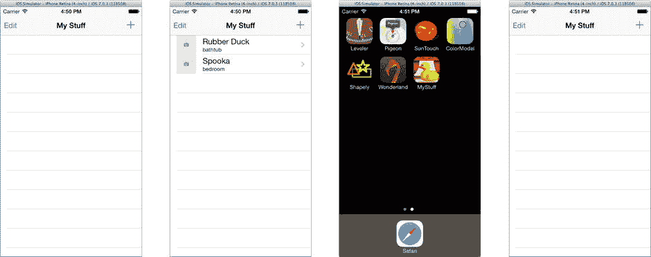

图 19-1. 测试文档存储

现在，等待大约 20 秒，或按下 Home 键将应用推入后台状态。当你创建新项目时，文档会收到变更通知。`UIDocument` 的自动保存功能会在用户未进行其他操作时定期保存文档，并在应用移至后台时立即执行保存。

当数据安全地保存在文档中后，停止应用，然后从 Xcode 重新运行。你应该能看到先前输入的项目列表，作为你辛勤工作的回报。

然而，你看到的却是一个空屏幕，如图 19-1 右侧所示。

那么，哪里出了问题？也许你的文档在应用启动时没有被打开？或者它一开始就没有被保存？你知道的是，代码中存在一个 bug；是时候使用调试器了。

## 设置断点

切换回 Xcode，在 `-contentsForType:error:` 方法中点击代码左侧的边距区域设置一个断点，如图 19-2 所示。断点会显示为一个蓝色标签。

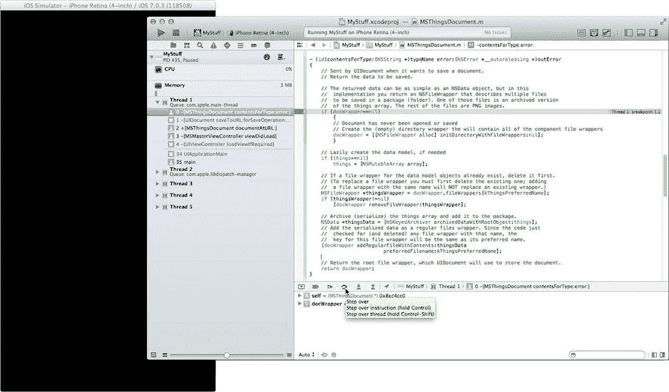

图 19-2. 在 `-contentsForType:error:` 中设置断点

在你的设备或模拟器上卸载 My Stuff 应用。（长按主屏幕上的 My Stuff 应用图标，直到它开始抖动，点击删除 (x) 按钮，确认删除应用，然后再次按下 Home 键。）这会删除你的应用及其存储的所有数据，包括任何文档。再次运行应用。Xcode 将重新安装应用，并以全新状态启动。

几乎立即，Xcode 会在 `-contentsForType:error:` 方法处的断点处停止，如图 19-2 所示。如果你查看左侧的栈回溯，可以看到 `-contentsForType:error:` 消息是从 `+documentAtURL:` 方法发送的，而后者又来自 `-viewDidLoad`。综合来看，这告诉你，当文档不存在时，`-contentsForType:error:` 被调用以创建初始的空文档。

## 单步执行代码并检查变量

验证这一点的另一种方法是检查方法执行时 `things` 数组的值。`things` 对象是你的数据模型。当方法首次进入时，你可以看到 `things` 变量为 `nil`。你可以在调试窗格（窗口底部）中，或者将光标悬停在变量名上来检查其值，如图 19-3 所示。

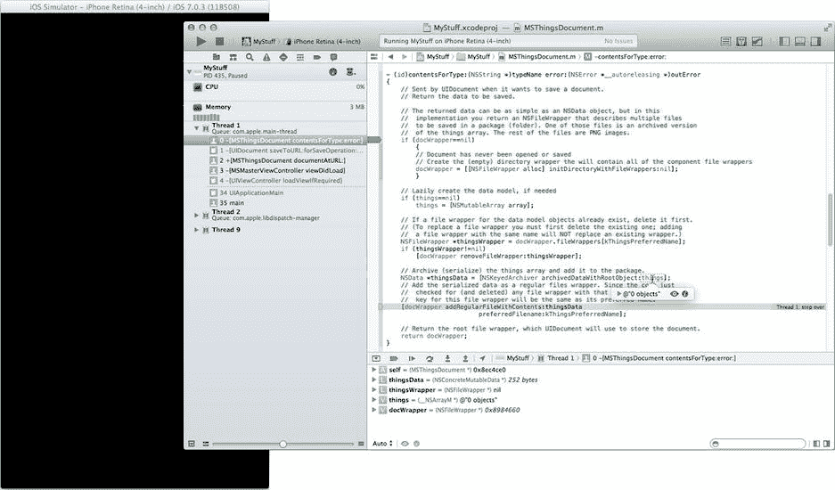

图 19-3. 单步执行 `-contentsForType:error:`

点击“单步跳过”按钮（参见图 19-2）来执行一行代码。继续单步跳过各行，观察代码将 `things` 变量与 `nil` 进行比较，然后创建一个空数组（用 `"0 objects"` 替换 `nil`），如图 19-3 所示。

> 提示  
> “单步跳过”执行源代码中的一条完整语句，并在完成后停止。“单步进入”执行一条语句；如果它是一个函数调用或应用中的消息，则会进入该函数或消息并再次停止。“单步跳出”允许函数或方法的剩余部分执行，并在返回到其调用者时再次停止。

要让你的应用再次全速运行，请点击“继续”按钮，它位于“单步跳过”按钮的左侧。你的应用将恢复全速执行，直到遇到另一个断点。回到你的应用，添加一两个项目，然后暂停。自动保存机制最终会启动，发送另一条 `-contentForType:error:` 消息，你的应用将再次在断点处停止。这一次，`things` 数组包含了新的 `MyWhatsit` 对象，如图 19-4 所示。

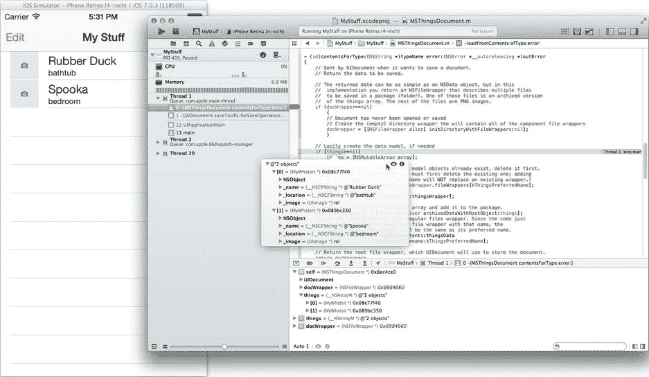

图 19-4. 第二次保存时 things 数组的内容

这证实了你的应用正在将 `MyWhatsit` 对象添加到 `things` 数组，将其序列化，并返回给 `UIDocument` 进行保存。问题不在于文档没有被保存。所以，一定是在加载文档时出现了问题。

顺便提一下，这被称为“分而治之”的调试技术。确定你的代码应该做什么，在该过程的中间某处设置一个断点，然后查看这一步是否执行正确。如果不是，问题要么就在那里，要么在你代码中更早的位置。如果执行正确，问题就在该点之后。选择另一个断点并重复，直到找到 bug。

> 提示  
> 通过将断点拖出边距区域来移除它。通过将断点拖到新位置来重新定位它。通过点击断点来禁用它或启用它。

再次运行应用，但首先在 `-loadFromContents:ofType:error:` 方法中设置一个断点。当你的应用启动时，你会看到 `-loadFromContents:ofType:error:` 方法立即被接收，如图 19-5 所示。

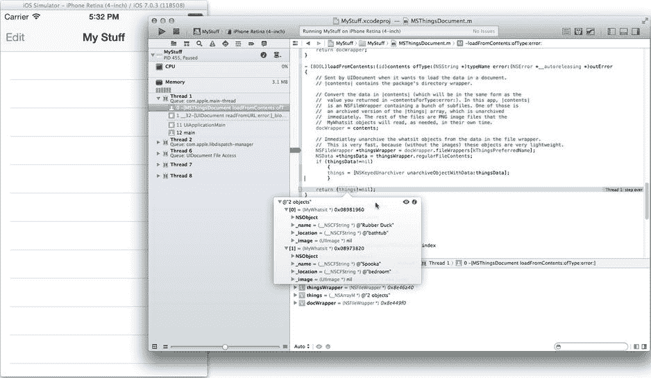

图 19-5. 检查 `-loadFromContents:ofType:error:` 是否被接收

使用“单步跳过”命令，你可以观察代码获取包装对象、提取其数据，并将该数据转换回 `things` 数组。正如你在图 19-5 中所见，你所有的数据都已被恢复。

所以，你的文档正在被打开，其内容已被读取，然而表格视图仍然是空的。这是怎样的不可思议？更糟糕的是，如果你尝试添加一个新项目，应用会崩溃。为什么（偏偏是你）会遇到这种情况？


### 问题剖析

事实证明，这个问题并不神秘。如果你在`+documentAtURL:`方法中设置断点，并在`MSMasterViewController`的`-tableView:numberOfRowsInSection:`方法（表格视图数据源接收到的第一条消息之一）中也设置断点，如图 19-6 所示，你会发现两件事。首先，`-tableView:numberOfRowsInSection:`是在`+documentAtURL:`之后，但在接收到`-loadFromContents:ofType:error:`消息之前被调用的。其次，如果你检查文档对象（也如图 19-6 所示），你会发现`things`数组仍然是`nil`。

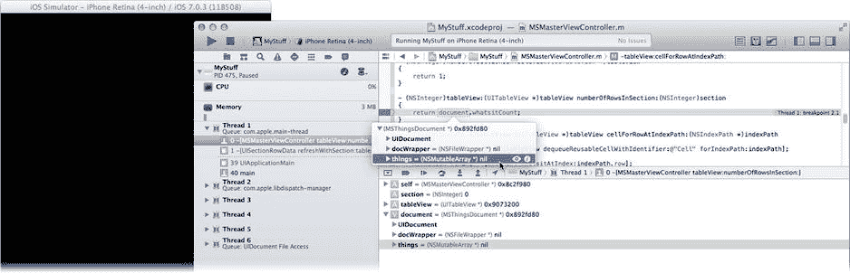

图 19-6. 在调试器中检查文档对象

你明白了吗？`UIDocument`的`-openWithCompletionHandler:`方法（在`+documentAtURL:`中发送）是异步的。它启动在后台检索文档数据的过程，并立即返回。你的应用代码继续执行，显示表格视图，而此时数据模型仍为空。

稍后，文档数据加载完成，并传递给`-loadFromContents:ofType:error:`以转换为数据模型。转换成功，但表格视图不知道这一点，并继续显示它认为的空列表。

你的文档需要做的是，在数据模型更新时通知你的视图控制器，以便表格视图可以刷新自身。你可以使用通知或代码块属性来实现这一点，但我认为最合理的解决方案是使用委托消息。作为额外收获，你将练习创建自己的协议。

### 定义委托协议

定义一个新的委托协议。你可以为此协议向项目添加一个新的头文件，但由于它与`MSThingsDocument`类紧密相关，我建议将其添加到`MSThingsDocument.h`接口文件的末尾：

```
@protocol MSThingsDocumentDelegate <NSObject>

@optional

- (void)gotThings:(MSThingsDocument*)document;

@end
```

这定义了一个包含一个可选方法（`-gotThings:`）的协议，每当你的文档对象从文档加载新事物时，都会发送此消息。回到`MSThingsDocument.h`文件的开头，找到`@class MyWhatsit`语句，并添加新协议的前向声明和一个委托属性（新代码以粗体显示）：

```
@class MyWhatsit
@protocol MSThingsDocumentDelegate;

@interface MSThingsDocument : UIDocument

+ (NSURL*)documentURL;
+ (MSThingsDocument*)documentAtURL:(NSURL*)url;

@property (weak) id<MSThingsDocumentDelegate> delegate;
```

**提示**

使用`@class`和`@protocol`指令创建前向声明。前向声明告诉编译器某个类或协议存在，但不包含任何细节。然后，该符号可以在类或协议引用中使用，而不会导致编译器错误。这是必要的，因为某些定义（如`MSThingsDocument`和`MSThingsDocumentDelegate`）是循环的；`MSThingsDocument`引用`MSThingsDelegateProtocol`，而`MSThingsDocumentProtocol`引用`MSThingsDocument`。

### 实现委托回调

切换到`MSThingsDocument.m`实现文件。在`+documentAtURL:`方法中，将打开文档的语句修改为以下内容（修改后的代码以粗体显示）：

```
[document openWithCompletionHandler:^(BOOL success){
    if (success)
    {
        if ([document.delegate respondsToSelector:@selector(gotThings:)])
            [document.delegate gotThings:document];
    }
}];
```

修改后的代码在文档加载完成后执行一个操作，其中包括解档数据模型对象。现在，它向委托发送`-gotThings:`消息，因此委托（你的视图控制器）知道数据模型已更改。

**提示**

这是向委托发送可选消息的方式。委托对象不需要实现可选方法，你也不希望向未实现该方法的对象发送消息；这会导致一个可怕的异常，你的代码将停止执行。`-respondsToSelector:`方法用于确定一个对象是否实现（“响应”）某个特定方法。

### 视图控制器采纳协议

切换到`MSMasterViewController.h`文件，并使你的视图控制器成为文档委托（新代码以粗体显示）：

```
@interface MSMasterViewController
: UITableViewController <MSThingsDocumentDelegate>
```

在`MSMasterViewController.m`实现文件中，进行两处更改。在`-viewDidLoad`中获取新的文档对象后，立即将视图控制器设置为文档的`delegate`对象（新代码以粗体显示）：

```
document = [MSThingsDocument documentAtURL:[MSThingsDocument documentURL]];
document.delegate = self;
```

最后，将可选的`-gotThings:`方法添加到`@implementation`部分：

```
- (void)gotThings:(MSThingsDocument *)document
{
    [self.tableView reloadData];
}
```

再次运行你的应用，如图 19-7 所示，大功告成！文档中的数据出现在表格视图中。

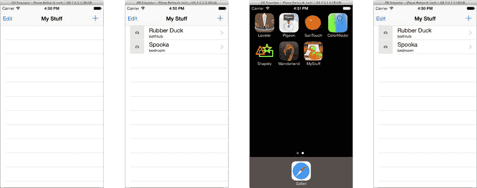

图 19-7. 正常工作的文档

进行更改或添加新项目。按下主页按钮，让`UIDocument`有机会保存文档，然后停止应用，重新启动，你的更改将保持不变。MyStuff 唯一不会保存的内容是你添加的任何图片。这是因为图片不是归档对象数据的一部分。你将直接把图片数据添加到文档的目录包装器中，接下来请解决这个问题。

**提示**

调试 ▶ 停用断点命令将禁用项目中的所有断点，使你能够不间断地运行和测试应用。


## 存储图像文件

图像数据的存储方式与 `MyWhatsit` 对象中的其他属性有所不同。其工作流程如下：

- 当新的或更新后的图像（`UIImage`）对象被添加到 `MyWhatsit` 对象时，该图像会被转换为 PNG（便携式网络图形）数据格式，并以文件包装器的形式存储在文档中。`MyWhatsit` 对象会记住该文件包装器的键。
- 保存文档时，`UIDocument` 会自动包含文档中所有文件包装器的数据。图像文件包装器的键会由 `MyWhatsit` 对象归档。
- 重新打开文档时，图像数据的文件包装器对象会被恢复。
- 当客户端代码请求 `MyWhatsit` 对象的图像属性时，`MyWhatsit` 会使用其保存的键来定位并加载文件包装器中的数据，最终将其转换回原始的 `UIImage` 对象。

这一设计（并非双关语）的关键在于 `MyWhatsit` 对象与文档对象之间的关系。`MyWhatsit` 对象将使用文档对象来存储并在后续检索单个图像的数据。然而，从软件设计的角度来看，我们希望将实际存储和检索图像数据的代码与 `MyWhatsit` 对象分离。单一职责原则鼓励 `MyWhatsit` 对象专注于它自身的功能（表示数据模型中的值），而文档对象则专注于它自身的功能（管理文档数据的存储与转换），避免一个类承担另一个类的职责。

解决方案是在 `MSThingsDocument` 类中创建一个抽象层（或称抽象服务），用于存储和检索图像。`MyWhatsit` 仍将发起图像管理，但将这些图像转换为文件包装器的具体机制将保留在 `MSThingsDocument` 内部。让我们开始吧。

在 `MSThingsDocument.h` 的 `@interface` 中添加两个公有方法：

```
- (NSString*)setImage:(UIImage*)image existingKey:(NSString*)key;
- (UIImage*)imageForKey:(NSString*)key;
```

第一个方法将在文档中存储或替换图像；第二个方法用于检索图像。现在修改 `MyWhatsit`，使其使用这些方法来保存和恢复其图像属性。

选择 `MyWhatsit.h` 接口文件。添加对 `MSThingsDocument` 类的前向引用、一个新的文档属性以及一个 `readonly imageKey` 属性（新增代码以粗体显示）：

```
@class MSThingsDocument;
@interface MyWhatsit : NSObject <NSCoding>
@property (weak,nonatomic) MSThingsDocument *document;
@property (readonly,nonatomic) NSString *imageKey;
```

在此处，删除你最初在第 5 章为帮助测试而添加的 `-initWithName:location:` 方法，你已不再使用它。

`document` 属性包含对此对象存储和检索其图像所在文档的引用。`imageKey` 属性是包含此对象图像数据的文件包装器的键。修改图像处理逻辑以使用这些新属性。

选择 `MyWhatsit.m` 实现文件。首先导入文档对象接口，放在其他 `#import` 指令下方：

```
#import "MSThingsDocument.h"
```

在 `@implementation` 部分之前，添加一个归档键和一个定义两个实例变量（一个用于图像，一个用于图像数据键）的私有接口部分：

```
#define kImageKeyCoderKey   @"image.key"
@interface MyWhatsit ()
{
    UIImage *image;
    NSString *imageKey;
}
```

注意

此前，用于存储 `image` 属性（`_image`）的实例变量是由编译器自动创建的。然而在此版本中，你需要为 `image` 属性提供一个自定义的设置方法（`-setImage:`）。当这样做时，定义该属性的存储空间就成为了你的责任。

删除你已不再使用的 `-initWithName:location:` 方法。


在`-encodeWithCoder:`方法中，添加一条语句来归档`imageKey`属性的值：

`[coder encodeObject:imageKey forKey:kImageKeyCoderKey];`

在`-initWithCoder:`方法中，在其他`-decodeObjectForKey:`消息之后立即添加一条匹配的语句，以便在解档时恢复它：

`imageKey = [decoder decodeObjectForKey:kImageKeyCoderKey];`

您不会将实际的图像数据添加到归档中，但您的对象确实需要记住存储该数据在文档目录包装器中的键。

**注意**：您的`NSCoding`方法不会对对象的`image`或`document`属性进行编码或解码。当对象被解档时，这些属性值将为`nil`。这使它们成为瞬态属性。由归档保留的属性称为持久属性。

现在，您可以为`image`属性定义自定义的 getter 和 setter 方法。从 getter 开始：

```
- (UIImage*)image
{
    if (image==nil && imageKey!=nil)
        image = [_document imageForKey:imageKey];
    return image;
}
```

`image`属性的 getter 方法现在会检查以下情况：当前没有图像对象（`image==nil`），但存在一个在文档中存储图像的键（`imageKey!=nil`）。在这种情况下，它会从文档中检索存储的图像对象。这是惰性执行的；即，在首次请求`image`属性时执行。当表格视图首次出现时，只有列表中可见的那些项目会加载它们的图像。文档中其余的项目将不会加载，直到用户滚动列表以显示它们为止。

`image`属性的 setter 方法必须保持文档更新。在 getter 之后，添加其配套的 setter 方法：

```
- (void)setImage:(UIImage *)newImage
{
    imageKey = [_document setImage:newImage existingKey:imageKey];
    image = newImage;
}
```

setter 方法会在文档中添加或替换图像。文档的`-setImage:existingKey:`方法将图像数据存储在一个文件包装器中，并返回标识该包装器的键。`existingKey`参数传入对象先前存储的图像数据的键。文档使用此键在添加新数据之前删除任何旧图像数据。最后，图像对象被保留。

最后，必须为`imageKey`属性提供 getter 方法：

```
- (NSString*)imageKey
{
    return imageKey;
}
```

至此，`MyWhatsit`类的所有修改都已完成。选择`MSThingsDocument.m`实现文件。显然，您需要提供在接口中定义的两个图像存储方法。从`-setImage:existingKey:`方法开始：

```
- (NSString*)setImage:(UIImage *)image existingKey:(NSString *)key
{
    if (key!=nil)
    {
        NSFileWrapper *imageWrapper = docWrapper.fileWrappers[key];
        if (imageWrapper!=nil)
            [docWrapper removeFileWrapper:imageWrapper];
    }

    NSString *newKey = nil;
    if (image!=nil)
    {
        NSData *imageData = UIImagePNGRepresentation(image);
        newKey = [docWrapper addRegularFileWithContents:imageData
                                     preferredFilename:kImagePreferredName];
    }

    [self updateChangeCount:UIDocumentChangeDone];
    return newKey;
}
```

它的工作方式正如您所期望的那样。如果调用方提供了现有文件包装器的键，则首先移除该文件包装器。如果正在存储图像（`image!=nil`），则通过`UIImagePNGRepresentation`函数将图像编码为 PNG 文件格式。然后，压缩的图像数据作为新的文件包装器添加到目录包中，并将标识该包装器的键返回给调用方。当然，您没有忘记在返回之前通知文档其内容已更改。

这处理了在文档中存储新图像以及用新图像替换现有图像的情况。现在添加从文档中检索图像的代码：

```
- (UIImage*)imageForKey:(NSString *)key
{
    UIImage *image = nil;
    if (key!=nil)
    {
        NSFileWrapper *imageWrapper = docWrapper.fileWrappers[key];
        if (imageWrapper!=nil)
```


```objectivec
image = [UIImage imageWithData:imageWrapper.regularFileContents];
```
```
}
```
```
return image;
```
```

该方法执行了 `-setImage:existingKey:` 方法的逆操作。它使用 `key` 在文档中查找文件包装器，向该包装器发送 `-regularFileContents` 消息以获取数据，并使用这些 PNG 图像数据重建原始的 `UIImage` 对象，然后将其返回给调用方。

> **注意**  
> 常规文件包装器所表示的数据，直到你向其发送 `-regularFileContents` 消息时才会被读入内存。文件包装器只是持久化存储中数据的轻量级占位符，直到你请求该数据为止。

还有一个隐藏的图片被从文档中移除的地方：当用户删除 `MyWhatsit` 对象时。找到 `-removeWhatsitAtIndex:` 方法。在该方法开头添加代码，在移除该条目之前，先移除该条目的图像文件包装器（新增代码以粗体显示）：

```objectivec
- (void)removeWhatsitAtIndex:(NSUInteger)index
{
    MyWhatsit *thing = things[index];
    if (thing.imageKey!=nil)
        [self setImage:nil existingKey:thing.imageKey];
    [things removeObjectAtIndex:index];
    [self updateChangeCount:UIDocumentChangeDone];
}
```

> **提示**  
> 处理此问题的另一种方法是让 `MyWhatsit` 对象在被移除前自行删除其图像。你可以通过定义一个（类似）`-prepareToBeRemovedFromDocument:` 的方法来实现，该方法会移除属于该 `MyWhatsit` 的所有文档资源。这完全取决于你希望将逻辑封装在数据模型侧还是数据模型控制器侧。

从文档中保存、检索和删除图像的所有机制都已就位。遗憾的是，这一切都无法正常工作。`MyWhatsit` 必须通过其 `document` 属性连接到正在工作的 `MSThingsDocument` 对象，此新代码才能生效。目前，还没有人设置该属性。

那么，`document` 属性应该在哪里设置？哪个对象应该负责设置它？答案是 `MSThingsDocument` 对象。它应负责维护自身与其数据模型对象之间的连接。

事实证明，这是一个极其容易解决的问题，因为只有两个地方会创建 `MyWhatsit` 对象：当文档解档时和用户创建新条目时。从 `-anotherWhatsit` 方法开始，添加一条语句来设置新对象的 document 属性（新增代码以粗体显示）：

```objectivec
- (MyWhatsit*)anotherWhatsit
{
    MyWhatsit *newItem = [MyWhatsit new];
    newItem.document = self;
```

> **注意**  
> 像 `-anotherWhatsit` 这样的方法被称为工厂方法。工厂方法会为客户端创建新的、配置正确的对象。这些对象可能属于不同的类，或者需要以特殊方式初始化（例如添加到集合中并设置其 `document` 属性）后才能返回。对于需要以调用方不应负责的方式创建的对象，应编写工厂方法来创建它们。

找到 `-loadFromContents:ofType:error:` 方法。在 `things` 数组解档之后，立即添加以下语句（新增代码以粗体显示）：

```objectivec
if (thingsData!=nil)
{
    things = [NSKeyedUnarchiver unarchiveObjectWithData:thingsData];
    [things makeObjectsPerformSelector:@selector(setDocument:)
        withObject:self];
}
```

`-makeObjectsPerformSelector:withObject:` 消息会向集合中的每个对象发送一个带参数的消息（相当于 `[things[0] setDocument:self]`，`[things[1] setDocument:self]`，以此类推）。完成后，数组中的每个 `MyWhatsit` 对象的 `document` 属性都会被设置为存储其图像的文档。

你的文档实现终于完成了！运行 `MyStuff` 来试验一下。添加一些条目，附加一些图片，然后退出应用，如图 19-8 所示。在 Xcode 中停止应用并重新启动。所有条目及其图片都保留在文档中。

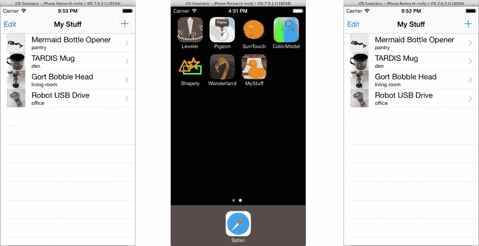

**图 19-8.** 测试图像存储

嗯，差不多。但存在一些性能问题和图像方向上的不规则性。前者你将在第 24 章中修复，而方向问题你可以在本章结尾的练习中尝试解决。

> **注意**  
> 在急于为你的 `MyWhatsit` 对象添加图像存储功能时，我想确保你没有遗漏一个值得注意的事实：你没有改变数据模型的接口。任何使用 `MyWhatsit` 对象的代码（例如 `MSDetailViewController` 中的代码）都不需要任何修改。这是因为 `image` 属性的含义和用途从未改变。唯一改变的是数据的存储方式。这就是封装在起作用。

如果你在已配置的设备上运行 `MyStuff`，可以在 Organizer 窗口（Window ➤ Organizer）的 `Devices` 标签中查看你的应用的文档文件。选择 Devices 标签，选择设备上安装的 `Applications`，然后选择 `MyStuff` 应用。Organizer 窗口会显示你应用沙盒中的文件，如图 19-9 所示。

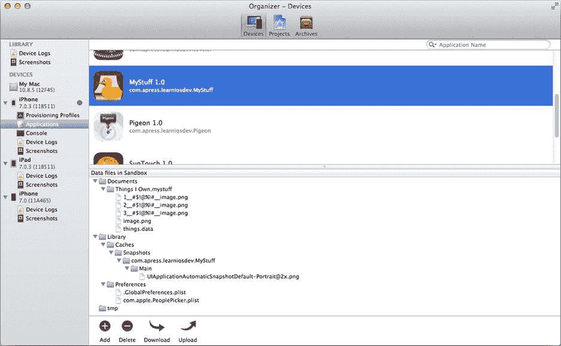

**图 19-9.** MyStuff 沙盒文件

你可以清楚地看到应用 `Documents` 文件夹中的 `Things I Own.mystuff` 文档包。那些滑稽的文件名（`1__#$!@%!#__image.png`）是 `UIDocument` 处理两个或多个具有相同首选名称的文件包装器的方式。它会给文件起一些奇怪的名字，以便它们都能存储在同一个目录中。

如果你需要获取这些文件，请使用窗口底部的 Download 按钮。Xcode 会从你的 iOS 设备复制文件并保存到你的硬盘上，你可以在那里检查它们。

## 未尽事宜

你在 `MyStuff` 中已完成了大量工作，但这实际上只代表了文档集成所需的最低限度支持。有很多特性和问题我略过未提。现在我们来回顾其中的几个。


# iCloud 存储

你可以将文档存储在云中，就像你在第 18 章中将属性列表值存储在云中一样。当然，文档要稍微复杂一些。

苹果的指南建议你提供一个设置，允许用户将所有文档放在云中，或者完全不放在云中。不推荐零散的方式。当用户改变主意时，你的应用程序负责将本地存储的文档移动（复制）到云中，或者反向操作。这并不是一项简单的任务。它涉及多任务处理，我直到第 24 章才会讨论到这一点。

一旦文档进入云中，你打开、修改和保存文档的方式与你从本地沙盒操作的方式非常相似。你为 `-contentsForType:error:` 和 `-loadFromContents:ofType:error:` 编写的所有代码都不需要任何修改（如果你编写正确的话），你只需使用不同的 URL 即可。实际上，“云”文档的数据是本地存储在设备上的。任何更改都会在后台与 iCloud 存储服务器同步，但你始终保留数据的本地副本，这既是为了速度，也是为了防止与云端的网络连接中断。

本地文档和基于云的文档之间存在一些微妙（以及不那么微妙）的差异。其中一个主要区别在于变更。你的云文档可能随时发生更改。用户可以在另一台设备上自由编辑同一个文档，而网络中断可能会延迟这些更改立即到达你的应用程序。

一般来说，你的应用程序会观察 `UIDocumentStateChangedNotification` 通知。如果 iCloud 服务检测到冲突版本（本地版本与服务器版本），你的文档状态将变为 `UIDocumentStateInConflict`。然后由你的应用程序来比较这两个文档，并决定保留什么，丢弃什么。你可以询问用户以获得指导，或者你的应用程序可以自动处理。

要了解更多关于 iCloud 文档的信息，请从 iOS 的《基于文档的应用程序编程指南》开始，你可以在 Xcode 的“文档和 API 参考”窗口中找到它。这是一本很好的读物，如果你计划进行任何涉及 `UIDocument` 的进一步开发，我强烈建议你仔细阅读它。其中“管理文档生命周期”和“解决文档版本冲突”章节直接涉及云存储。

# 存档版本控制

在实现 `NSCoding` 时，你可能需要考虑类发生变化时会发生什么。将对象归档到持久存储的一个后果是数据是——嗯——持久的。用户会期望你的应用程序打开多年前创建的文档。我一直在努力改进我的软件，我想你也是如此。我总是在给类添加新的属性，或者更改属性的类型和范围。这通常意味着创建新类并定期放弃旧类。所有这些更改都会改变类的编码方式，并在解档由旧版本（有时是新版本）软件创建的数据时带来挑战。

有几种处理归档兼容性的技术。你的新代码可以使用不同的键来编码其值。在解码时，你的软件可以测试该键是否存在，以确定归档数据是由现代软件还是旧版软件创建的。你可以在归档数据中编码一个“版本”值，并在解码时测试该版本。较新的软件可以同时以现代形式和旧版形式编码一个值，这样旧版软件（对新形式一无所知）仍然可以解释文档数据。

甚至还有在解档过程中用一个类替换另一个类的技术。这可以解决编码类不再存在的问题。关于这些问题的详细讨论以及一些解决方案，可以在《归档和序列化编程指南》的“键控归档的前向和后向兼容性”章节中找到。

## 总结

采用 `UIDocument` 为你的应用程序增加了一层用户既欣赏又期待的现代数据存储方式。你已经学会了如何以及在哪里存储应用程序的文档。更重要的是，你理解了对象和方法所扮演的不同角色，它们共同协作，将模型对象转换为原始数据，然后再转换回来。你学习了如何构建可以增量保存和延迟加载的多文件文档。在此过程中，你还学习了如何归档对象以及创建可以被归档的对象。

你已经取得了长足的进步，应该对自己的 iOS 能力充满信心。为你的应用程序添加持久化存储实际上是你要完成的最后一个主要的 iOS 技能。接下来的几章将深入探讨 Objective‑C，以磨练你的语言知识和熟练程度。

# 练习

如果你使用 iOS 设备的内置相机拍摄你的物品，可能会注意到一个恼人的问题。初次添加时，图片显示正常。但稍后，当它们被保存到文档并重新加载后，某些图片会侧着或者倒着显示。

尝试搜索 iOS 开发者论坛或互联网，看看可能是什么问题。你可以在 `Learn iOS Development Projects` ➤ `Ch 19` ➤ `MyStuff E1` 文件夹中找到我对这个问题的第一个“修复”。提示：我只改了两行代码，都在 `MSThingsDocuments.m` 中。

`MyStuff E1` 中的“修复”并没有真正解决问题；它只是在绕开问题。真正解决这个问题需要更多工作。我改变了在 `-imagePickerController:didFinishPickingMediaWithInfo:` 方法中创建裁剪图像的方式。你可以在 `Learn iOS Development Projects` ➤ `Ch 19` ➤ `MyStuff E2` 文件夹中找到该解决方案。利用你在第 10 章中学到的知识以及你在第 13 章中编写的代码，你应该能够毫不费力地理解它是如何工作的。也许你还能想出一个不同的解决方案。

## 脚注

1  
Blob 实际上是一个数据库术语，意为二进制大对象（Binary Large Object），有时写作 BLOb。

2  
所有属性列表对象都采用 `NSCoding`。因此，属性列表对象是可归档对象的一个子集。


# 20. 保持客观

**摘要**

如我所承诺的，本书并没有一上来就枯燥地讲解 Objective‑C。你直接跳进去并开始创建应用——我觉得这很棒。`Xcode` 让即使是新手程序员也能设计和制作出高质量的 iOS 应用，这开启了一个充满可能性的世界。但你并不想永远停留在新手阶段。在修道院的食堂里你得不到好座位，也从来不会有粉丝来信。我并不是说读完这一章就能让你变成 Objective‑C 大师，但它绝对能提升你的水平。

如果你对 Objective‑C 感到吃力，或者只是相对新手上路，请认真阅读这一章。它基本上是一个速成课程，能让你打下坚实的基础。如果你已经读过一本关于 Objective‑C 的书，或者已经用它编程一段时间，那么这一章的内容可能不会让你感到惊讶。在这种情况下，请把它当作一份关于 Objective‑C “精华部分”的便捷参考。在本章中，你将：

*   学习如何声明 Objective‑C 类以及如何创建对象
*   理解属性、实例变量、getter 和 setter 之间的关系
*   使用内省来检查对象和类
*   探究协议和分类之间的区别，以及它们的用途
*   学会爱上 `nil`
*   了解集合对象的要点
*   熟悉一些非常实用的快捷方式

本章没有相关项目，所以你可以给 `Xcode` 放一天假。我会从基础知识开始，你可以随意浏览，然后我会带你旋风式地了解那些你会经常使用或需要了解的类和特性。让我们从基础开始吧。

## Objective‑C 就是 C

Objective‑C 就是 C。这是一个颇具迷惑性的简单陈述，但它有着深远的影响。C 和 BASIC 是计算机历史上第一批真正流行的编程语言。尽管诞生了近半个世纪，C 仍然是世界上最流行的编程语言¹。它简洁的语法，以及能够高效编译为计算机代码的特性，使其成为业界的砥柱。当新的语言被开发出来时，很自然地，它们会采纳许多 C 的约定，既因为其语法确实优秀，也因为有太多程序员已经掌握了 C。我们现在生活在一个充满类 C 语言的世界里：C++、C#、Perl、Java、JavaScript 以及 PHP，仅举几例。

“类 C”语言是一种看起来有点像 C，但又不是 C 的语言。该语言的作者喜欢 C 的语法，但出于某种原因想要对其做出修改。如果你已经懂 C，那么学习这些语言会更容易。但这也意味着，例如，你不能拿标准的 C 代码直接用 Java 或 C# 来编译。

> **注意**  
> 到目前为止，C++ 是与 C 关系最密切的类 C 语言。C++ 最初是作为 C 的一个预处理器而诞生的：你的 C++ 代码首先被翻译成纯 C 语言，然后再由 C 编译器编译。自那以后，C++ 已经与 C 有了足够大的差异，以至于它不再是 C 语言的超集，尽管你仍然可以使用其特殊的 `extern "C" { /* 纯 C 代码在此 */ }` 语法将纯 C 代码插入到 C++ 程序中。

相比之下，Objective‑C 是 C 语言的一个严格超集。这意味着 Objective‑C 为 C 添加了面向对象的特性，但并没有改变或移除其任何 C 的特性。在很大程度上，它通过引入一些以 `@` 开头的关键字（如 `@interface`、`@private`、`@selector` 等）以及用于向对象发送消息的方括号语法（`[object message]`）²。介于其间的一切——我是指一切——都是标准的（ISO/IEC 9899:2011）C 语言。

对你而言，这意味着任何标准的 C 代码都可以直接放入你的项目中原样使用。你可以在你的 Objective‑C 应用中随意加入 `struct` 和 `typedef` 语句，使用预处理器，并定义你自己的 C 函数。同时，这也意味着你可以直接、无过滤地访问你的应用能够链接到的任何 C 函数。

最后这一点意义重大。用 C 语言编写的计算机代码数量超过任何其他语言——据最新估计，有数十亿行之多。iOS 构建在 Core Foundation 和 BSD 库之上，其中包含数千个有用的 C 函数，全部任你调用。如果你的应用需要一些特别的功能——比如计算椭圆加密代码，或预测行星轨道——我可以保证，已经有人用 C 语言写过那样的代码了。

> **提示**  
> 还有一种 Objective‑C++ 语言。它为 C++ 添加了与 Objective‑C 为 C 添加的相同特性。Objective‑C++ 对于 OpenGL 编程特别有用，因为其中很多代码是用 C++ 编写的。

这对我也有好处，因为我只需要声明“Objective‑C 就是 C”，然后就可以接着解释 Objective‑C 为 C 添加了什么。在我看来，你有三条通往精通 Objective‑C 的道路：

*   如果你已经会用 C 编程，那你几乎就成功了。阅读本章的其余部分，了解 Objective‑C 为 C 添加了什么。
*   如果你不熟悉 C，或者掌握得不太扎实，你有两条路可走：
    *   先学习 C，然后阅读本章的其余部分。互联网上有大量的 C 语言教程和参考资料。Apress 也出版了一本非常出色的书，《在 Mac 上学习 C 语言》第二版，作者是大卫·马克和区区在下——不过我现在只是在自夸。
    *   如果不想读本章，那就找一本关于 Objective‑C 的书。一本详尽的 Objective‑C 专著会解释整个语言，其中就包括了 C。

如果你对 C 已经很熟练，那就继续学习 Objective‑C 吧。


## Objective‑C 类

这一点你到目前为止已经见过无数次了，我也在第 6 章中解释过，但这里还是要完整地展示一遍。Objective‑C 中的类通过 `@interface` 指令声明，通常位于 `.h`（头）文件中：

```
@interface ClassName : SuperClassName <ProtocolName>
{
    @public
    int instanceVariable;
}
@property (nonatomic) int property;
+ (void)classMethod;
- (void)instanceMethod:(int)param1 withTwoParameters:(int)param2;
@end
```

以下是重点：

*   `@interface` 声明告知编译器类的存在并对其进行描述：它继承自哪个类、实现了哪些额外的实例变量、属性和方法，以及遵循了哪些协议。它不会生成任何代码。
*   虽然技术上可选，但实际上你必须指定一个父类。如果你不继承自某个特定类，则继承 `NSObject`。
*   协议是可选的。多个协议之间用逗号分隔。如果不遵循任何协议，可以省略尖括号。
*   实例变量声明在两个花括号之间的代码块中。如果你的类不声明任何实例变量，则可以完全省略该代码块。只有实例变量可以在该代码块内声明。
*   你可以在实例变量声明之间插入可见性指令（`@public`、`@protected` 或 `@private`）。这些指令之后声明的所有变量都会继承该可见性。在第一条指令之前声明的变量默认为 `@protected`。
*   `@end` 指令标记 `@interface` 声明的结束，并且是必需的。你不能在 `@interface` 内部嵌套其他声明（`@interface`、`@category`、`@protocol` 或 `@implementation`）。

到目前为止，这些内容对你来说应该都很好理解了。本书之前未提及的唯一关键字是可见性指令。变量的可见性决定了哪些方法可以直接访问这些变量。可选的可见性列于表 20-1 中。

**表 20-1. 可见性指令**

| 指令 | 含义 |
| --- | --- |
| `@public` | 任何拥有该对象引用的代码都可以直接操作该实例变量 |
| `@protected` | 只有此类或其子类的方法可以直接操作该变量 |
| `@private` | 只有此类的方法可以直接操作该变量 |

我所说的“直接操作”，是指代码可以在 C 表达式中使用该实例变量来直接获取或更改其值。（具体细节参见本章后面的“属性”部分。）可见性不适用于方法或属性；它们始终是公开的。最有用的可见性指令是 `@private`，但其用途在很大程度上已被“扩展”所取代，本章后面的“类别”部分会对此进行描述。

### 实现你的类

类的代码出现在其 `@implementation` 部分，通常位于 `.m`（实现）文件中：

```
@implementation ClassName
+ (void)classMethod
{
}
- (void)instanceMethod:(int)param1 withTwoParameters:(int)param2
{
}
@end
```

你需要负责实现类 `@interface` 指令中列出的每个方法（以及可能的某些属性）。这包括你的类所遵循的协议中的任何必需方法。

> **警告**: 未实现你已声明的方法可能只会产生编译器警告。这或许不会阻止你构建和运行应用程序，但如果收到了针对这些未实现方法的消息，你的应用程序将抛出异常并崩溃。请务必注意编译器警告。

### 创建和销毁对象

创建对象是一个两步过程：

> 分配对象 → 初始化对象

你告诉类去分配它，然后向该对象发送一条“init”消息来初始化它，就像这样：

`id myObject = [[MyClass alloc] init];`

类可能具有备选的初始化方法，有些带有参数，能以不同的方式初始化对象。某些类会指定其指定的初始化方法；即使该对象从其父类继承了其他初始化方法，你也只应向这些对象发送指定的初始化消息。所有初始化方法传统上都以字母“init”开头。

> **提示**: `NSObject` 基类定义了一个 `+new` 类消息，用于分配一个新对象，向其发送 `-init` 消息，并将其返回给发送者。`[[AnyClass alloc] init]` 和 `[AnyClass new]` 这两个语句在功能上是相同的。我一直很困惑为什么程序员不更频繁地使用 `[MyClass new]` 这种简写形式。

如果你为类定义了一个初始化方法，它必须遵循以下模式：

```
- (id)init
{
    self = [super init];
    if (self)
    {
        instanceVariable = 1;
    }
    return self;
}
```

你的类必须先向对象的父类发送适当的初始化方法。这通常是 `-init`，但也可以是父类实现的任何初始化方法。

然后你必须将返回的值重新赋值给 `self` 变量，并检查它是否为 `nil`。如果父类无法初始化该对象，它会销毁该对象并返回 `nil`。这表示不再有对象需要初始化；你的方法应立即返回 `nil`。

接着，你的代码继续初始化其实例变量和属性。当你的对象被分配时，所有实例变量和属性都会被预初始化为 `0`、`0.0`、`NO` 或 `nil`。你只需要设置那些不应为零的值。

与父类类似，如果在初始化过程中出了问题，你可以销毁该对象并返回 `nil`（通过 `self = nil`），表明你的初始化失败了。

下一章将描述对象是如何以及何时被销毁的。

### 类簇

在向父类发送初始化方法时更新 `self` 变量（`self = [super init]`）非常重要。Objective‑C 有一种独特的能力，可以用不同的对象替代你初始化的对象。也就是说，你分配了一个类的对象，向其发送了 `-init` 消息，但你拿回的对象并非你分配的那个。事实上，它甚至可能不是同一个类。

这种技术被称为类簇，是工厂模式的一种变体。编写你自己的类簇并不困难。你的代码看起来会像这样：

```
- (id)initCluster:(int)param
{
    self = [super init];
    if (self)
    {
        if (param<0)
        {
            self = [[SpecialNegativeClass alloc] init];
        }
    }
    return self;
}
```

类簇在 iOS 中用于优化内存和简化类接口。例如，你可能会认为每次执行 `[[NSNumber alloc] initWithBool:YES]` 语句时都会创建一个新的 `NSNumber` 对象。但是 `NSNumber` 对象是不可变的（不能更改），因此任何两个代表 `YES` 的 `NSNumber` 对象都是可互换的。iOS 利用了这一特性，预分配了两个 `NSNumber` 对象，一个用于 `YES`，另一个用于 `NO`。执行 `[[NSNumber alloc] initWithBool:YES]` 实际上会返回这两个对象中的一个，以替代你试图创建的那个对象。


### 引用对象

Objective‑C 使用 C 语言的指针语法来引用对象。以下是一个指向特定类 Objective‑C 对象的变量：

`SpecificClass *anObject;`

指向 Objective‑C 对象的指针被称为对象指针、对象引用，或简称为对象。与某些语言不同，你不能声明一个包含对象本身的变量（如 `SpecificClass anObject`）。Objective‑C 中的所有对象都是动态分配的，因此你只能声明和操作指向对象的指针。

当使用特定类声明变量时，Objective‑C 编译器会知道该对象定义了哪些方法、属性和实例变量。如果你试图访问一个它未实现的属性或方法，编译器会报错。这在大多数情况下是件好事。尝试向你的对象发送一条它不理解的消息，或访问一个它不存在的变量，都会导致编译错误。

但当对象实际上是其所声明类的子类时，就会产生问题。例如，在你的 `DrumDub` 应用中，你通过标签获取了一个 `UIButton` 对象，然后设置了它的 `enabled` 属性。你最初可能编写了这样的代码：

`[[self.view viewWithTag:i+1] setEnabled:active];`

遗憾的是，这条语句无法编译。问题在于 `-viewWithTag:` 方法返回的是 `UIView*`，而不是 `UIButton*`。你我都知道返回的对象是 `UIButton`，但编译器不知道。编译器唯一能确定的是该对象是一个 `UIView`，而 `UIView` 并没有 `-setEnabled:` 方法；你的程序无法编译，你也永远无法播放音效。在这种情况下，C 语言的类型转换语法可以解救你：

`[(UIButton*)[self.view viewWithTag:i+1] setEnabled:active];`

这段代码的意思是：“我知道 `-viewWithTag:` 返回的是 `UIView*`，但我也知道这个对象是 `UIButton`，所以请按后者来对待它。”唯一的告诫是：它最好真的是一个 `UIButton`，否则后果会很严重。在“自省”一节中，我会讨论如何检查某个对象是否确实是 `UIButton`——以防万一。

### 让我看看你的 `id`？

你偶尔会在 Objective‑C 中看到 `id` 类型。这种特殊类型的意思是“指向任意对象的指针”。它的处理方式与普通的对象指针不同。在以下几个要点中，假设有如下代码：

`id anyObj;`

`SpecificClass *specificObj;`

*   你可以向 `id` 类型的对象发送任何消息（`[anyObj anyMessage]`）。编译器不会报错。它不知道 `anyObj` 究竟是什么类型的对象，并假设你知道。同样，你需要自己确保 `anyObj` 能够响应 `-anyMessage`。
*   你不能通过 `id` 引用访问实例变量（`anyObj->instanceVariable`），或引用属性（`anyObj.enabled=YES`）。你必须先将变量转换为特定类型（`((SpecificClass*)anyObj)->instanceVariable`），或者使用等价的 getter 或 setter 消息（`[anyObj setEnabled:YES]`）。
*   `id` 引用可以赋值给任何对象指针变量或参数（`specificObj=anyObj`）。编译器不会对此发出警告，你也不需要 C 语言类型转换运算符。其假设是你知道该对象的类。（所以你最好确认无误。）
*   任何对象指针都可以赋值给 `id` 变量或参数（`anyObj=specificObj`）。编译器不会对此发出警告，你也不需要 C 语言类型转换运算符。`id` 变量可以引用任何对象，而 `specificObj` 也是一个对象，所以这有什么问题呢？

`id` 类型用于变量、方法和参数，适用于（几乎）任何对象都可接受的情况。这简化了你的代码，因为编译器会放宽对待该引用的规则。

集合类（`NSArray`、`NSDictionary` 等）就是一个很好的例子。集合中的每个值都是 `id` 类型，因为它确实可以是“任意对象”。这使得在集合中存储和检索对象变得容易，即使是特定类型的对象也不例外：

`SpecificClass *specificObj = [[SpecificClass alloc] init];`

`[array appendObject:specificObj];`

`specificObj = [array lastObject];`

编译器不会为这段代码生成任何警告，并且你无需在赋值语句中对对象进行类型转换。如果 `-lastObject` 返回的是 `NSObject*` 类型，而不是 `id`，那么你每次都要写成 `specificObj = (SpecificObject*)[array lastObject]`——真是麻烦。

**注意**

`id` 中的 `*` 是隐含的。使用 `id` 时，你不需要包含 C 语言的指针运算符。如果你写成了 `id *`，实际上你写的是“指向任意对象指针的指针”。

### 方法名称

Objective‑C 中的方法名称传统上比较冗长。这是 Objective‑C 的魅力之一，也大大提高了代码的可读性。考虑下面这个 C 语言函数调用：

`CGBitmapContextCreate(pixes,768,1024,8,space,kCGImageAlphaPremultipliedLast);`

除非你正在查看文档，否则很难准确说出每个参数的含义。现在将其与类似的 Objective‑C 消息进行对比：

`[[CIImage alloc] initWithBitmapData:pixes`  
              `bytesPerRow:768*4`  
                     `size:CGSizeMake(768,1024)`  
                   `format:kCIFormatARGB8`  
               `colorSpace:space];`

第二条语句中每个参数的用途要直观得多。当 Objective‑C 消息过长无法放在一行时，惯例是将每个参数单独放在一行，并对齐冒号，如上所示。Xcode 的源代码编辑器会自动执行此操作。

以减号（`-`）开头的方法是实例方法。它们在接收对象的上下文中执行。以加号（`+`）开头的方法是类方法。它们在类的上下文中执行。


### 方法名称构造

方法中的参数由冒号分隔。单词与冒号共同构成方法签名（method signature）。方法签名是方法的唯一标识符。以下述方法为例：

`- (BOOL)getBytes:(void *)buffer maxLength:(NSUInteger)maxBufferCount usedLength:(NSUInteger *)usedBufferCount encoding:(NSStringEncoding)encoding options:(NSStringEncodingConversionOptions)options range:(NSRange)range remainingRange:(NSRangePointer)leftover;`

（没错，这是一个动作方法。）该方法的签名为：

`getBytes:maxLength:usedLength:encoding:options:range:remainingRange:`

在 `@selector()` 指令中使用签名来指定特定方法。

**提示**  
有时你会在文档、调试过程中或程序员之间的交流中看到类似 `-[ClassName method:name:]` 的方法名称写法。这是一种用于标识类中特定方法的简写形式。它并非 Objective‑C 语法，也绝不会在程序中使用，但具有参考价值。

每个参数的类型以及方法的返回值，会在参数名称和方法名称前以括号形式明确声明。以下方法接受两个参数——一个 `CGPoint` 结构体和一个指向 `UIEvent` 对象的指针——并返回一个 `BOOL` 值：

`- (BOOL)pointInside:(CGPoint)point withEvent:(UIEvent *)event;`

从技术上讲，参数和返回值的类型是可选的。如果省略，则默认类型为 `id`。以下两个方法是等价的：

`- (id)objectforKey:(id)key;`

`- objectForKey:key;`

我不建议省略参数或返回值的类型。惯例是显式声明返回值及每个参数的类型。这样做不仅能避免大量混淆，而且所需的输入量并不大。

关于 Objective‑C 的一个常见误解是它使用了命名参数。事实上它并没有。你无法改变 Objective‑C 消息中参数的顺序。方法 `-setLineDash:count:phase:` 和 `-setLineDash:phase:count:` 是两个截然不同的方法。从技术上讲，消息中的各个单词被称为标记（token）。有时——我在书中也这样做过——程序员会用标记来指代参数，但这并非参数的“名称”。

另外鲜为人知的一点是，这些标记是可选的。`CAMediaTimingFunction` 中有一个方法定义如下：

`+ (id)functionWithControlPoints:(float)c1x :(float)c1y :(float)c2x :(float)c2y;`

你可以这样发送该消息：

`[CAMediaTimingFunction functionWithControlPoints:100.0:120.0:180.0:200.0];`

如果你执意追求古怪的写法，下面这个也是完全有效的 Objective‑C 方法：

`- :i :j :k;`

**注意**  
切勿在类中使用此类方法。如果使用了，请别告诉别人你是从我这里学到的。

### +initialize 方法

每个类都继承了一个 `+initialize` 方法。当类首次被初始化时，会收到该消息。Objective‑C 运行时库采用懒加载方式初始化类，因此 `+initialize` 消息会在类首次被使用之前发送——很可能是在该类第一个对象被创建之前。

`+initialize` 方法非常适合放置那些需要执行一次、且必须在类中任何代码运行之前完成的代码。请参考以下 `+initialize` 方法：

```
static NSNumberFormatter *Formatter;

+ (void)initialize
{
    if (Formatter==nil)
        {
        Formatter = [[NSNumberFormatter alloc] init];
        Formatter.roundingMode = NSNumberFormatterRoundHalfEven;
        }
}
```

该类的任何方法都可以安全地假设 `Formatter` 变量包含一个已初始化的 `NSFormatter` 对象，因为 `+initialize` 消息保证会在该类收到任何其他类消息、或创建任何该类实例之前发送。使用 `+initialize` 可以创建单例对象、初始化全局变量、创建共享集合、预取用户默认值等等。

**警告**  
你的子类会继承 `+initialize` 方法，这意味着当子类被初始化时，该方法可能再次被调用。在上述代码中，`if (Formatter==nil)` 条件可防止该代码执行多次。

## 属性

对象属性是对象所存储值的公共接口。大多数情况下，它们简单地实现为一个可查询或修改的实例变量。但它们也可以是合成值——即从其他信息推导得出的值。无论如何，客户端看到的接口是一个可以通过属性名称获取、并可选择性地修改的值。

你可以通过以下四种方式之一为类添加属性：

- 公共实例变量（前属性时代）
- 私有实例变量配合自定义的 getter 和 setter 方法
- 由私有实例变量支持的 `@property` 声明，配合可选的 getter 和 setter 方法
- 现代的 `@property` 声明

这四种技术回顾了 Objective‑C 中属性值的演变历史。重温属性的进化过程将有助于解释你拥有哪些选项，以及为何拥有这些选项。让我们从黑暗时代开始。

### 实例变量

很久以前（20 世纪 80 年代），Objective‑C 诞生了。在其最初的形态中，它只是在 C 语言基础上的一层极其微薄的封装，为称为对象的特殊 `struct` 添加了类似 Smalltalk 的消息传递机制。对象的值存储在其实例变量中，访问方式与访问 C 语言 `struct` 的字段完全相同。示例如下：

```
@interface DarkAge : Object
{
    BOOL dawn;
}
@end

...

DarkAge *darkest = [[DarkAge alloc] new];
if (darkest->dawn==NO)
    ...
```

如今你仍然可以这样做。然而，程序员很快发现这种设计存在诸多问题。最大的问题是它违背了封装原则。客户端代码在修改对象值时拥有过多访问权限，也承担了过多责任。这一认识开启了对象值的第二个时代。


### 使用 Getter 和 Setter

业界普遍采用的做法是声明一个私有实例变量，然后编写返回和设置该变量值的方法。这些方法统称为访问器方法。检索值的方法称为 getter 方法，设置值的方法称为 setter 方法。Getter 方法与变量同名，而 setter 方法则以 "set" 作为变量名的前缀。（对于不可修改的值，则省略 setter 方法。）以下是按此方式编写的类：

```
@interface GoGetter : NSObject
{
    @private
    BOOL eager;
}
@end

@implementation GoGetter
- (BOOL)eager
{
    return eager;
}
- (void)setEager:(BOOL)newEager
{
    eager = newEager;
}
@end
```

这是一个巨大的进步——至少在良好的软件设计、封装和灵活性方面是如此。现在，客户端代码使用 getter（`[obj eager]`）和 setter（`[obj setEager:YES]`）方法来访问对象的值。任何特殊情况、必要的内存管理、变更通知等，都可以在 getter 和 setter 方法中一致且可靠地处理。像键值观察（参见第 8 章）这样的技术也因此成为可能。

这种做法也为影响对象值创建了两条路径：直接操作实例变量和发送访问器消息。通过使用 `@private` 或 `@protected` 等指令，你可以将实例变量的直接访问限制为仅由该类（或其子类）定义的方法。有时直接访问变量更受青睐，因为它速度更快，并且可能避免访问器方法带来的不良副作用。典型的例子是访问器方法本身，它们必须能够直接影响实例变量；显然，它们不能使用 getter 和 setter 方法。

日子看起来相当不错，除了那些可怜的开发者，他们不得不一遍又一遍地编写相同的 getter 和 setter 方法。开发者们急切地寻求解决方案。难道真没有办法让 Objective-C 把他们从这种枯燥乏味中解救出来吗？负责管理 Objective-C 的智者们听到了他们的呼声，于是属性的时代开始了。

### 声明的属性

Objective-C 2.0 引入了 `@property` 指令。这使开发者们一直使用的约定得以规范化，并增加了一种属性访问器语法，极大地简化了其使用。现在可以通过 `obj.value` 来检索属性值，并使用 `obj.value=nil` 来设置它。属性声明如下所示：

```
@property (nonatomic) id value;
```

类会继承其父类的属性。除一种特殊情况外，你不能在类中更改继承属性的定义，但可以重写其访问器方法。

最初，`@property` 声明除了使实例变量与 getter 和 setter 方法之间的关系合法化之外，几乎没什么别的用处。它既不生成任何代码，也不为变量定义存储空间。所有这些仍需由开发者负责。但它确实让语法变得更优雅了。

现在，开发者可以拿 Objective-C 2.0 之前的代码（如 `GoGetter` 类），为其添加 `@property` 声明，并使用属性的 getter 语法（将 `[obj setEager:YES]` 替换为 `obj.eager=YES`）。这无疑是一个改进。

但 Objective-C 2.0 还有一份礼物。如果 getter 和 setter 方法是通用的——它们所做的仅仅是返回或设置实例变量的值——那么开发者就可以使用新的 `@synthesize` 指令，而 Objective-C 会为他们编写这些代码。现在他们的类看起来像这样：

```
@interface GoldenAge : NSObject
{
    @private
    BOOL joyful;
}
@property BOOL joyful;
@end

@implementation GoldenAge
@synthesize joyful;
@end

...
GoldenAge *age = [[GoldenAge alloc] init];
age.joyful = YES;
```

它拥有封装的所有优点，却无需编写任何代码。访问器语法尤其受欢迎，因为在 Objective-C 中，嵌套的 setter 和 getter 有时很难阅读。考虑下面两条等效的语句：

```
[layer setRasterizationScale:[layer rasterizationScale]*2];
layer.rasterizationScale *= 2;
```

你得承认，第二条语句看起来更舒服。这引出了一个重要的观点。Objective-C 2.0 添加的属性访问器语法，从根本上说，并没有改变 getter 和 setter 方法的发送方式或工作原理。它仅仅改变了用于发送它们的语法。计算机语言设计者将此称为语法糖；它“甜化”了语言，但并不改变其功能。

表 20-2 中的语句展示了使用属性访问器语法时发生的转换。表中的最后两行说明了直接访问实例变量（在实例方法内部）与调用对象自身的该属性访问器方法之间的区别。

**表 20-2. 属性访问器消息等效性**

| Objective-C 2.0 | Objective-C (任意版本) |
| --- | --- |
| `v = obj.property;` | `v = [obj property];` |
| `obj.property = v;` | `[obj setProperty:v];` |
| `obj.property += v;` | `[obj setProperty:[obj property]+v];` |
| `property = v;` | `property = v;` |
| `self.property = v;` | `[self setProperty:v];` |

**提示**

你不必为了使用访问器语法而使用 `@property` 指令。Objective-C 允许你将任何不接受参数并返回一个值的方法视为属性的 getter 方法，并将任何不返回值、以单词 "set" 开头并接受单个参数的方法视为属性的 setter 方法。`NSPort` 类从未用 `@property` 声明进行过更新；它只定义了 `-delegate` 和 `-setDelegate:` 方法。然而，Objective-C 允许你编写 `port.delegate = nil`，因为这两个方法符合 `delegate` 属性的访问器模式。


### 自动合成属性

现代 Objective-C 编译器（LLVM）终于实现了属性的“全闭环”。如今，如果你在 `@interface` 中声明一个 `@property`，且既不编写必需的访问器方法，也不包含 `@synthesize` 指令，Objective-C 会自动为你合成一切。它会为你的对象添加一个实例变量（以下划线开头），并生成 getter 和 setter 方法。

这基本上就是你在本书中一直使用的方式。以下类展示了现代属性：

```
@interface Nirvana : NSObject

@property BOOL automatic;

@end

@implementation Nirvana

@end
```

该类拥有一个名为 `_automatic` 的私有 `BOOL` 类型实例变量，并实现了两个方法：`-automatic` 和 `-setAutomatic:`。分配和实现属性的繁琐工作现已为你代劳。不过，你并非必须使用这种现代方案。如果你的类有特殊需求，可以退而使用之前介绍的任何方案。表格 20-3 总结了声明和实现属性的不同组合。

**表格 20-3.** 属性实现选择

| `@interface` | `@implementation` | 备注 |
| --- | --- | --- |
| `@property id prop;` | （无） | 创建一个名为 `_prop` 的实例变量，并生成方法 `-(id)prop` 和 `-(void)setProp:(id)prop`； |
| `@property (readonly) id prop;` | `-(id)prop;` | 不添加实例变量，你必须自行实现 getter 方法 |
| `@property id prop;` | `-(id)prop;` `-(void)setProp:(id)prop;` | 如果你提供了自己的 setter 方法，将不会添加实例变量（`_prop`）。由你负责属性值的存储方式。 |
| `{ id prop; }` `@property id prop;` | `@synthesize prop;` | 生成方法 `-(id)prop` 和 `-(void)setProp:(id)prop`，这些方法使用 `prop` 变量进行存储 |
| `{ id prop; }` `@property id prop;` | （无） | 导致编译器发出警告，提示你声明的自定义变量（`prop`）与编译器添加的 `_prop` 变量重复 |

### 属性的构成

一个属性声明由四部分组成：

*   `@property` 关键字
*   可选的一组属性特性，位于括号内
*   属性类型
*   属性名称

`@property` 关键字、类型和名称无需解释。另一方面，可选的属性特性为你提供了多个选择，这些选择会影响属性的实现方式和处理方式。

#### 可变性

`readonly` 特性声明一个只能读取、不能设置的属性。表达式 `obj.property` 是允许的，但语句 `obj.property=nil` 则不允许。以下是一个 `readonly` 属性的例子：

```
@property (readonly) NSDate *created;
```

正如你在表格 20-3 中看到的，指定 `readonly` 特性意味着 Objective-C 不会为你的属性分配实例变量（对于从不变化的东西，变量有何用？），并且你必须提供一个 getter 方法。

`readwrite` 特性与 `readonly` 特性相反。所有属性默认都是 `readwrite`，因此你通常不需要显式声明。

`readwrite` 特性有一个用途。Objective-C 允许你在一个类中将属性声明为 `readonly`，然后在子类中将其重新声明为 `readwrite`。这是 Objective-C 唯一允许你在子类中重新声明属性的情况，且属性的所有其他方面必须完全相同。此特性支持不可变超类、可变子类的设计模式。

#### 存储

`copy` 特性适用于对象属性。（标量和结构体属性始终是复制。）没有它时，设置对象属性会保留指向该对象的指针。`copy` 特性会更改 setter 方法中的代码，使得对象被复制——其机制将在后面的“复制对象”部分进行解释。对象保留的是对副本的引用，而非传递给 setter 方法的那个对象。示例如下：

```
@property (copy) NSDictionary *collection;
```

当属性是一个可变对象时，这一点可能非常重要。例如，考虑一个字典属性。如果你的属性被设置为一个可变字典对象，那么该对象和发送者都将引用同一个字典。如果发送者后来修改了该字典，属性所指向的字典也会随之改变——因为它们是同一个字典。复制一份字典可以防止这种情况发生。

在非 ARC（自动引用计数）环境中，`retain` 和 `assign` 特性是 `copy` 特性的替代方案。在本书中，你在项目中全部使用了 ARC，因此这些特性不适用（尽管为了兼容旧软件，它们是允许的）。

#### 生命周期限定符

在使用 ARC 的应用中，`strong` 或 `weak` 特性决定了属性如何保留对象引用，你在本书中已多次见到它们：

```
@property (strong) NSString *title;
```

其详细内容将在第 21 章中解释。简而言之，`strong` 属性会确保只要你的属性引用该对象，该对象就始终存在，并且这是默认行为。`weak` 属性则不会阻止对象被销毁——如果没有其他对象对该对象持有强引用的话。

**注意**

特性 `assign`、`retain`、`strong`、`weak` 和 `copy` 是互斥的；你只能使用其中一个。

如果在 ARC 项目中使用遗留代码，`retain` 特性等同于 `strong`，而 `assign` 大致等同于 `weak`。

#### 访问器方法名称

当属性的 getter 或 setter 方法名称不符合常规模式时，可使用 `getter=` 和/或 `setter=` 特性。这些特性的一个用途是，当你向已有的、实现了非标准名称访问器方法的旧代码添加 `@property` 声明时。

另一个更现代的用途涉及布尔值的 getter 方法。布尔属性通常表示状态信息。历史上，其 getter 方法会以“to be”动词的现在或过去时态作为前缀，例如 `-isEnabled` 或 `-hasConnection`。为了使这些 getter 方法能像属性一样工作，你可以在属性声明中覆盖 getter 名称，如下所示：

```
@property (getter=hasConnection) BOOL connected;
```

现在，语句 `obj.connected` 和 `[obj hasConnection]` 是等价的。请注意，将不会存在 `-connected` 方法。

#### 原子性

如第 24 章所述，某些属性必须以原子方式访问和设置。这可以确保从多个执行线程使用它们时的数据完整性。如果这不是问题（大多数情况都是如此），则指定 `nonatomic` 关键字。如果确实是个问题，并且第 24 章将解释何时需要关注，请使用 `atomic` 关键字或不指定任何关键字；`atomic` 是默认值。以下是两个示例：

```
@property (nonatomic) NSString *name;
```

```
@property (atomic) NSPort *port;
```

`atomic` 作为默认值多少有些令人遗憾。它确实能产生最安全的代码，但同时也引入了线程同步代码，这些代码会在每次调用 setter 方法时执行。为了获得最佳性能，请为所有不需要原子性的对象和结构体属性指定 `nonatomic` 特性。


### 信守承诺

当你自行实现 getter 和 setter 方法，而非让 Objective-C 自动生成它们时，你有责任实现属性所指定的行为。表 20-4 列出了你的各项职责。

**表 20-4.** 必需的存取方法行为

| 属性 | 你的实现 |
| --- | --- |
| `readonly` | 你必须实现一个 getter 方法。你仍然可以实现一个 setter 方法，通常供类自身内部使用。 |
| `copy` | 你的 setter 方法必须拷贝被设置的对象，并保留对该副本的引用。对于不可变对象，可以例外。 |
| `strong`、`weak`、`retain`、`assign` | 使用属性中声明的规则来保留对象值。例如，不要在声明为 `weak` 的属性中强保留一个对象。 |
| `getter=`、`setter=` | 根据属性声明来命名你的 getter 和 setter 方法。 |
| `atomic` | 编写你的 getter 和 setter 方法，使得对属性值的访问和修改是原子性的。这通常涉及使用互斥信号量。 |

## 自省

自省是一种检查对象元数据的能力。你可以确定对象属于哪个类，它实现了哪些方法，声明了哪些属性，等等。你能深入探查对象或类细节的程度令人惊叹，但实际上，日常工作中最有用的只有三种测试。

### 类

每个对象都有一个 `class` 属性。该属性代表对象的类。类本身也是一个对象（类型为 `Class`）。类对象拥有描述该类的属性和方法。

**注意：** `Class` 对象的运作方式与其他对象非常相似，但在某些方面又有所不同。例如，`Class` 是一个类型，而不是一个类。因此，尽管它行为上像一个对象，但它并不是 `NSObject` 的子类。当你发送类消息（`+classMethod`）时，上下文是 `Class` 对象，因此 `self` 变量指向该类。`Class` 对象（作为对象）的 `class` 属性返回它自身。

有两个方法可用于测试对象的类：`-isKindOfClass:` 和 `-isMemberOfClass:`。前者用于判断一个对象是否属于某个特定类，或该类的任何子类。使用方法如下：

```
if ([view isKindOfClass:[UIControl class]]) ...
```

这个表达式在 `view` 是 `UIControl` 对象或 `UIControl` 的任何子类时返回真。如果 `view` 是 `UIView` 则返回假；如果 `view` 是 `UIButton` 则返回真。表达式 `[UIControl class]` 返回 `UIControl` 的 `Class` 对象。记住，一个类的 `class` 就是它自身，所以这个语句本质上是一个常量。你可能会认为可以写成 `[view isKindOfClass:UIControl]`，但晦涩的 Objective-C 语法规则禁止这样做。

第二个方法用于测试一个对象是否属于某个特定的类。它的使用方式与 `-isKindOfClass:` 消息类似：

```
if ([view isMemberOfClass:[UIControl class]]) ...
```

如果接收者是那个特定的类，则消息返回 `YES`，否则返回 `NO`。如果 `view` 是 `UIView` 或 `UIButton`，这个语句将返回假。这是因为它们都不是 `UIControl`。实际上，这个语句几乎不太可能返回真，因为 `UIControl` 是一个抽象类。

**警告：** 方法 `-isMemberOfClass:` 优于表达式 `[view class]==[UIControl class]`。该方法能正确处理特殊对象——例如作为另一个进程中对象的占位符的代理对象——对于这些对象，相等性测试会失败。

你可能会想用这个测试来判断一个类是否实现了特定的方法或属性（比如 `buttonType`，如果它是一个 `UIButton` 的话）。不推荐这样做，因为对于方法，有另一个更相关的测试。

### 方法

可能最常用的自省测试是 `-respondsToSelector:` 消息。如果对象响应该消息选择器（即实现了该方法），则返回 `YES`。典型用法如下：

```
if ([delegate respondsToSelector:@selector(saveTheUniverse)])
    [delegate saveTheUniverse];
```

这段代码的优雅之处在于它速度快、具体明确，并且即使在接收者为 `nil` 时也能正确工作。这是确定一个对象选择实现了哪些可选协议方法的唯一实用技术。

它还能避免做出假设的问题。新手程序员通常会测试对象的类，然后根据这个知识假定它实现了某个特定方法。这不仅速度更慢，而且如果类的实现发生变化，这个假设有朝一日就可能出错。

Objective-C 鼓励功能性测试。如果你想知道一个对象是否有 `tag` 属性，就测试它是否实现了 `-tag` 方法；不要检查它的类然后去猜测。

### 协议

在处理委托对象时，检查一个对象是否遵循某个特定协议有时很有用。这比测试它的类更具体，也比测试一堆不同方法更高效。它不会告诉你对象是否实现了任何可选的协议方法，但它暗示了对象已经实现了所有必需的方法。

这种测试的一个应用是要求对象遵循一个协议。例如，你为某个类编写的委托 setter 方法可以检查提议的对象是否确实遵循了正确的协议，如果没有，就终止程序：

```
if (![newDelegate conformsToProtocol:@protocol(MyClassDelegate)])
    @throw [NSException exceptionWithName:NSInvalidArgumentException
                                   reason:@"does not conform to protocol"
                                 userInfo:nil];
```

这三种自省技术是你的基本功，但它们仅仅触及了你能了解的对象和类信息的皮毛。在 Xcode 的“文档和 API 参考”窗口中搜索“introspection”，你会发现许多与我在此所述类似的文章和指南。如果你真想深入研究，终极指南是 *Objective-C Runtime Reference*。

### 协议

协议定义了一组类承诺要实现的方法。协议使用 `@protocol` 指令定义。以下是一个协议声明：

```
@protocol PromiseDelegate

- (void)pledge:(Promise*)promise;  // 必需方法
@property BOOL crossHeart;         // 必需属性

@optional
- (void)swear;                     // 可选方法
@property BOOL hopeToDie;          // 可选属性

@end
```

协议看起来与 `@interface` 非常相似，只是它不能声明实例变量。协议可以定义属性，但这些属性不会像在 `@interface` 中那样自动分配任何实例变量或生成 getter 或 setter 方法。你还可以使用 `@optional` 和 `@required` 指令来指定方法/属性是可选的；默认是 `@required`。

协议通常位于其自己的 `.h`（头）文件中，并以协议名称命名。如果一个协议与某个类紧密相关，你可能会在类的 `.h` 文件中同时找到两者的定义。


### 采用协议

一个类通过在其 `@interface` 指令后列出协议来采用一个或多个协议，如下所示：

`@interface Agent : NSObject <PromiseDelegate>`

该类负责实现所需的协议方法，以及任何所需属性的 getter 和 setter。它可以自由地实现全部、部分或零个可选方法。采用了某个协议的类的对象被称为遵循该协议。

分类（下一节）也可以采用协议。一个协议可以采用另一个协议（超协议？），如下所示：

`@protocol PromiseDelegate <NSCoding>`

采用一个已经采用了另一个协议的协议意味着同时采用了这两个协议。使用此协议声明，`Agent` 类同时采用了 `PromiseDelegate` 和 `NSCoding` 协议。

### 引用遵循协议的对象

任意数量的类都可以采用同一个协议。该协议定义了一种独立于类层次结构的行为，任何类都可以采用。这使得不同的对象可以共享公共功能并被同质化处理，这是面向方面编程的核心特性。Objective-C 提供了一种特殊的语法来引用任何遵循协议的对象：

`id<PromiseDelegate> promisor;`

`id<PromiseDelegate>` 类型可以在任何接受对象引用类型（`id` 或 `Agent*`）的地方使用。`promisor` 变量可以被设置为任何采用 `PromiseDelegate` 协议的对象。该类型可以包含多个协议，用逗号分隔。

`NSCoding` 协议是一个很好的例子。任何类，无论其超类是什么，都可以选择采用 `NSCoding` 协议并参与归档和解档。通过将它们引用为 `id<NSCoding>` 对象，可以统一地处理所有这些对象。

然而，这种方案存在一个障碍。当您将一个变量声明为 `id<PromiseDelegate>` 时，Objective-C 编译器会假定该对象仅实现了 `PromiseDelegate` 协议中的方法和属性。因此，`id<PromiseDelegate>` 类型更像是一个特定的类引用（`UIButton*`），而不是通配符（`id`）。尝试向该对象发送任何协议中没有的消息会导致编译器错误。这会为如下语句带来问题：

```
if ([promisor respondsToSelector:@selector(swear)])    // * compiler error *
    [promisor swear];
```

`PromiseDelegate` 协议只定义了两个方法和两个属性。方法 `-respondsToSelector:` 不在其中。您可能会说，“但是 `promisor` 必须实现 `-respondsToSelector:`，因为它是在 `NSObject` 中定义的，而每个对象都继承自 `NSObject`！” 您是对的，`promisor` 确实继承了 `-respondsToSelector:` ——但 Objective-C 编译器并不这样认为，因为 `promisor` 的类型是 `id<PromiseDelegate>`。

**提示**

解决此问题的一个不太优雅的方法是将对象变量转换为 `id` 类型，例如 `[(id)promisor respondsToSelector:...]`。Objective-C 允许您向 `id` 对象发送任何消息而不会报错。

Cocoa Touch 框架定义了特殊的 `NSObject` 协议来帮助您解决这个不便之处。`NSObject` 协议声明了几乎所有与 `NSObject` 实现相同的方法。通过在您的协议中采用 `NSObject`（`@protocol PromiseDelegate <NSObject>`），任何使用 `id<PromiseDelegate>` 类型都意味着该对象同时采用了 `PromiseDelegate` 和 `NSObject` 协议，这包含了 `NSObject` 中所有常用的方法。

## 分类

分类为现有类实现额外的方法，并且独立于该类进行编译。如果您习惯了 Java 或 C# 等面向对象语言，分类会显得很奇怪，甚至不可思议。这是一个独特的特性，但它巧妙解决了许多棘手的编程问题。

分类声明并实现一组方法。这些方法被编译并链接到您应用的独立模块中。当您的应用运行时，分类会将其方法添加到一个现有类中。它可以是任何类：您编写的类，甚至是操作系统的一部分。

**警告**

不要在分类中重写方法。分类不能（可靠地）用于替换现有方法。如果您尝试这样做，只有一个方法会执行，并且无法预测是哪一个。

声明分类就像定义类一样。类名是一个已经定义好的类。与指定超类不同，您需要在类名后面加上括号中的分类名称，如下所示：

```
@interface NSString (WordCount)
- (NSUInteger)wordCount;
@end
```

这定义了 `NSString` 的一个名为 `WordCount` 的分类。它为现有的 `NSString` 类添加了一个新方法 `-wordCount`。然后，您在一个命名类似的 `@implementation` 部分中实现这些方法：

```
@implementation NSString (WordCount)
- (NSUInteger)wordCount
{
    return /* count number of words in self here */;
}
@end
```

当您的应用加载时，此分类会将其方法插入到 `NSString` 类中。您现在可以向任何 `NSString` 对象发送 `-wordCount` 消息。您实现的方法在对象的上下文中执行，并且与原始类定义的方法无法区分。

分类通常像普通类一样编写为 `.h`（接口）和 `.m`（实现）文件。在导入头文件时，请记住编译器必须先看到类接口和分类的接口，然后才能识别您分类中的方法和属性。

**提示**

为分类选择文件名时，惯例是使用类名“加”分类名，例如 `NSString+WordCount.h` 和 `NSString+WordCount.m`。Xcode 的 Objective-C 分类文件模板会自动为您执行此操作。

我提到分类有助于解决特殊的编程问题。我们来谈谈其中三个。

### 单一职责

单一职责原则鼓励一个对象（进而扩展到类）做好一件事情。但这可能具有局限性。有时您需要一个对象来执行各种不相关的任务。

单一职责意味着字符串对象只处理“字符串”相关的事情。这很好。这应该是这样。但是当需要对字符串执行“非字符串”相关操作时，例如在图形上下文中绘制字符串，软件设计者就会遇到问题。他们希望能够告诉字符串“绘制你自己”。但他们不希望用非字符串相关的代码“污染”字符串类。使用其他面向对象语言的程序员最终将所有的绘制代码组织在其他类中，导致如下方法：

`[graphicsContext drawString:string at:point];`

分类为您提供了简化设计的工具，而无需“污染” `NSString` 类。使用分类，您可以直接向字符串类添加绘制方法。所有的绘制代码都与 `NSString` 类分开维护和编译。现在您的应用可以像这样绘制字符串：

`[string drawAt:point];`

您的代码实际上更面向对象、更简单、更容易编写。而且这个例子并非假设性的。iOS 中所有的字符串绘制函数都在 UIKit 框架提供的 `NSString` 的一个分类中定义，具体来说是 `NSString(UIStringDrawing)`。


### 模块组织

分类（Category）对于组织方法也很有用。在特别复杂的类中，将方法分组到不同的分类中会很有帮助——这是双关语。

在第 14 章中，`STGame` 对象负责所有游戏逻辑。后来，你还让它负责与其他 iOS 设备上的 `STGame` 对象进行通信。与其简单地将新方法塞进 `STGame`，不如创建一个分类 `STGame(STDataMessaging)`。所有通信代码都被整齐地组织在它自己的模块中。

这在大型项目中非常有用，尤其是当多个程序员为同一个类贡献代码时。一个程序员可以处理游戏逻辑，而另一个程序员则完善通信代码。由于分类与主类是分离的，他们不会互相干扰。

### 私有方法

Objective‑C 程序员很快发现了分类的另一个用途：隐藏方法。假设你编写了一个“观星者”（Star Gazer）应用。它有一个代表恒星的 `Star` 类。你的 `Star` 对象是不可变的；恒星不会改变。但随后你创建了“恒星编辑器”（Star Editor）应用，允许用户编辑恒星。你不想让“观星者”应用中的 `Star` 类变为可变。在这个上下文中，恒星仍然应该是不可变的。

分类巧妙地解决了这个问题。两个应用都使用 `Star` 类，而“恒星编辑器”应用添加了一个 `Star(MutableStar)` 分类，其中包含了修改它所需的方法。这些方法对于“恒星编辑器”应用来说是“私有的”。

而对私有方法的需求可能更加平凡。Objective‑C 方法没有可见性属性；你无法像声明实例变量那样，将方法声明为 `@private` 或 `@protected`。因此，程序员们很快开始使用分类来“隐藏”那些仅供内部使用的类方法。几乎每个类都会定义类似这样的分类：

```
@interface MyClass (Private) // 私有方法
- (void)doSomethingSecret;
@end
```

这种做法变得非常普遍，以至于促成了 Objective‑C 语言的一项改动。

### 扩展（Extension）

Objective‑C 2.0 引入了扩展。扩展是一个类的未命名分类。我在本书中一直将这些称为“类的私有 `@interface`”，但从技术上讲，它们是扩展。以下是一个扩展的例子：

```
@interface MyClass ()
- (void)doSomethingSecret;
@end
```

扩展的规则与常规分类略有不同：

-   每个类只能有一个扩展，并且必须在类的 `@implementation` 之前声明。
-   在扩展中声明的方法和属性是在类的 `@implementation` 部分中实现的，与类的常规方法放在一起——而不是在单独的类别的 `@implementation` 中。
-   扩展可以声明额外的实例变量以及会创建实例变量的属性。这些变量会成为对象的一部分，就像它们在类的 `@interface` 中声明一样。

## nil 是你的朋友

如果你是一位经验丰富的程序员，但刚接触 Objective‑C，你可能对 `NULL` 指针抱有合理的恐惧。而且你应该如此。在大多数语言中，`NULL` 指针和对象引用就像定时炸弹。在 Java 中对 `NULL` 对象调用方法，你的代码会抛出一个未捕获的异常。在 C 语言中解引用一个 `NULL` 指针，你的应用就会崩溃。终止了。完蛋了。死翘翘了。一个前应用。

### nil 的轻灵

相反，Objective‑C 对 `nil` 采取了一种截然不同的态度。你可以向 `nil` 对象发送任何消息。这完全安全。甚至被鼓励这样做，并且这会改变你编写软件的方式。让我们来看看。

一个 Objective‑C 调用涉及一个消息和一个接收者。接收者通常是一个变量，像这样：

`[obj doSomething];`

如果对象 `obj` 实现了 `-doSomething` 方法，它就会执行。如果它没有实现 `-doSomething` 方法，它会抛出一个异常（这很糟糕）。但如果 `obj` 是 `nil`（指向地址 `0`），Objective‑C 会做一个奇怪的事情：它静静地什么也不做，然后继续执行。在第 18 章中，当用户没有将他们的位置与云同步时，`cloudService` 变量会是 `nil`。当用户移除已保存的地图位置时，会执行这段代码：

`[cloudStore removeObjectForKey:kPreferenceSavedLocation];`

如果 `cloudStore` 引用的是通用值存储，那么该键对应的值就会被移除。如果 `cloudStore` 是 `nil`，该语句就会什么也不做并继续执行。没有必要在代码中塞满 `if (cloudStore!=nil) ...` 语句来防止那行代码执行。

请注意代码中那些当对象缺失或未被设置时，你不希望某些事情发生的地方。回顾本书项目中的例子；可能比你意识到的要多。让变量的 `nil` 值隐式地跳过那些如果存在对象你会执行的操作。如果没有计时器，你可能就不启动它。如果没有锁，你可能就不设置它，等等。

### 正面表述的优点

它不仅返回，而且返回一个空值。如果你向 `nil` 对象发送的消息返回一个对象、标量或指针值，Objective‑C 保证返回值将是 `0`、`0.0`、`NO`、`NULL` 或 `nil`。这使得编写以下代码毫无风险：

```
if ([delegate conformsToProtocol:@protocol(MyClassDelegate)])
{
    // 对 delegate 做些什么
}
```

如果 `delegate` 是 `nil`，消息 `-conformsToProtocol:` 将返回 `NO`。这很合理。一个 `nil` 对象没有实现你的协议。它什么也没有实现。

这也意味着 `nil` 适用于属性值。如果 `collection` 是 `nil`，表达式 `collection.count` 将总是 `0`，因为 `collection.count` 会被转换为 `[collection count]`。而且还有级联效应。语句 `[viewController.button.superview.backgroundColor setFill]` 会在 `backgroundColor` 是 `nil`、`superview` 是 `nil`、`button` 是 `nil`、或者 `viewController` 是 `nil` 时什么都不做。

你可以通过从正面表述返回值或属性值，在自己的设计中利用这一点。定义像 `-hasContent` 这样的方法，而不是 `-isEmpty`。如果对象引用是 `nil`，消息 `-hasContent` 返回 `NO`。这很合理；一个 `nil` 对象没有任何内容。但 `-isEmpty` 也会返回 `NO`，这暗示它有内容；相信我，它没有。简而言之，选择那些在发送给 `nil` 对象时仍有意义的属性和返回值。

### nil 的坏处

这并不是说 `nil` 始终无害。如果用作 C 指针，它具有与解引用 `NULL` 指针相关的所有危险。这也是拥抱属性的另一个原因；获取方法和设置方法与 `nil` 对象一起使用时是完全安全的。如果 `obj` 是 `nil`，语句 `obj.var=0` 是安全的，并且什么都不做。相比之下，语句 `obj->var=0` 会使你的应用崩溃。

`nil` 参数也可能是一个危险。很多方法不接受 `nil` 参数。在语句 `[array removeObject:obj]` 中，`array` 可以是 `nil`，但 `obj` 绝对不能是 `nil`。大多数允许 `nil` 参数的方法会在文档中说明。如果没有说明，请假设不允许使用 `nil`。

最后，发送给 `nil` 对象的消息什么都不做，但该消息的参数会首先被准备。这意味着，组装参数的任何副作用都会发生。在以下代码中，如果 `downloader` 是 `nil`，则不会发送 `-useConnection` 消息，但 `+createConnection` 消息仍然会被发送：

`[downloader useConnection:[DownloadSource createConnection]];`

如果你希望阻止发送 `+createConnection`，你需要先测试 `downloader` 是否不等于 `nil`。


## 拷贝对象

Cocoa 框架定义了一套用于拷贝（复制）对象的协议。并非所有对象都能被拷贝。能够被拷贝的对象需要遵循 `NSCopying` 协议并实现 `-copyWithZone:` 方法。有三种方式可以让你的对象支持拷贝：

- 遵循 `NSCopying` 并在 `-copyWithZone:` 方法中创建一个新对象
- 继承 `NSCopying` 并向父类发送 `-copyWithZone:` 消息
- 走捷径

## 遵循 `NSCopying`

如果你的类是第一个遵循 `NSCopying` 的类，其 `-copyWithZone:` 方法必须创建一个新对象并适当复制其属性。示例如下：

```
@interface Recipe : NSObject <NSCopying>

@property NSString *title;

@property NSMutableArray *ingredients;

@end

@implementation Recipe

- (id)copyWithZone:(NSZone *)zone

{

    Recipe *copy = [[[self class] allocWithZone:zone] init];

    if (copy!=nil)

        {

        copy->_title = _title;

        copy->_ingredients = [_ingredients copy];

        }

    return copy;

}

@end
```

`Recipe` 类是第一个遵循 `NSCopying` 的类，因此必须在 `-copyWithZone:` 方法中创建一个新对象。注意它通过语句 `[[[self class] allocWithZone:zone] init]` 创建新对象。正确创建副本对象需要三步：

- 获取原始对象的类。`Recipe` 的子类会继承此 `-copyWithZone:` 方法，因此 `self` 可能是 `Recipe` 的子类。表达式 `[self class]` 会获取对象的实际类，而非假定它是 `Recipe` 对象。
- 发送 `-allocWithZone:` 消息以在请求的内存区域中分配对象。在 iOS 中，`zone` 参数通常为 `nil`，但这满足了 `-copyWithZone:` 的内存管理约定。
- 最后，新创建的对象接收 `-init` 消息，你需要检查它是否不为 `nil`，以防对象创建失败。

**注意：** 内存区域在 iOS 中并不使用。但为了与 Cocoa (OS X) 类保持兼容，`-copyWithZone:` 消息仍然包含一个 `zone` 参数。

之后，将原始对象（`self`）的各个属性值复制到新对象（`copy`）。复制哪些内容以及如何复制由你决定，但原则上副本应在功能上与原件完全相同，且相互独立。为此，`title` 引用被直接复制。`title` 属性是一个 `NSString`，而 `NSString` 对象是不可变的，因此两个对象都可以安全地引用同一个字符串对象。这被称为浅拷贝。然而，`ingredients` 数组被复制了一份，这样副本的 `ingredients` 就不会与原件的 `ingredients` 耦合。这被称为深拷贝。

其他属性的处理方式可能不同。例如，一个带有 UUID（通用唯一标识符）属性的对象在拷贝时可能生成新的 UUID，以确保两个对象拥有唯一的 ID。你需要根据具体情况做出这类决策。

## 继承 `NSCopying`

当你的类继承 `NSCopying` 时，你有责任确保它履行拷贝约定。这是一个容易被忽略的事情。你的子类应该实现自己的 `-copyWithZone:` 方法，如下所示：

```
@interface AssignedRecipe : Recipe

@property Chef *chef;

@end

@implementation AssignedRecipe

- (id)copyWithZone:(NSZone *)zone

{

    AssignedRecipe *copy = [super copyWithZone:zone];

    if (copy!=nil)

        {

        copy->_chef = _chef;

        }

    return copy;

}

@end
```

`Recipe` 已经遵循 `NSCopying` 并在其 `-copyWithZone:` 方法中创建了对象副本。子类只需让父类创建新副本，然后复制任何子类特有的属性即可。

## 拷贝特殊对象

作为替代方案，你的 `-copyWithZone:` 实现也可以做完全不同的事情。例如，如果你的对象是不可变的，或者是一个单例，那么它的 `-copyWithZone:` 方法可以是：

```
- (id)copyWithZone:(NSZone *)zone

{

    return self;

}
```

任何尝试拷贝该对象的操作都将返回一个指向自身的引用。

## 拷贝对象

当你想拷贝一个对象时，首先要确保它遵循 `NSCopying`。要执行拷贝，请向它发送 `-copy` 消息。（`NSObject` 的 `-copy` 方法只是执行 `[self copyWithZone:nil]`）。返回的值就是副本对象。如果你正在编写一个指定了 `copy` 属性的属性设置器，你的代码看起来会像这样：

```
@property (copy) NSDictionary *options;

...

- (void)setOptions:(NSDictionary*)options

{

    _options = [options copy];

}
```

## 可变拷贝

少数类，尤其是集合类，采用了特殊的 `NSMutableCopying` 协议并实现了 `-mutableCopyWithZone:` 方法。

基类集合（`NSArray`、`NSDictionary`、`NSSet` 等）以及 `NSString` 都是不可变的——它们无法被修改。如果你拷贝一个不可变对象，你只会得到另一个不可变对象，甚至可能是同一个对象。

如果你需要字符串、集合或任何遵循 `NSMutableCopying` 的不可变对象的可变副本，请向其发送 `-mutableCopy` 消息。如果该数组（举例）已经是可变数组，你将收到该数组的一个副本，与发送 `-copy` 效果相同。但如果它是不可变数组（`NSArray`），则会返回一个包含相同内容的新可变数组（`NSMutableArray`）。


### 属性字符串

在本书中，你已经看到许多 `UIView` 类和绘图方法使用属性字符串而非普通字符串。属性字符串会将可变的属性值与字符串中的一系列字符关联起来。这些属性可以表示字符的绘制字体（字体系列、大小、样式）、颜色、排版调整（字符间距）、对齐方式（右对齐、上标、下标）、文本装饰（下划线、删除线）等。属性字符串非常灵活，能够描述任意复杂的排版效果。从概念上讲，它们并不复杂，尽管在实际操作中可能有些繁琐。

属性通过字典形式表达。键标识属性的类型。然后这个字典与一系列字符相关联。以下示例展示了属性字符串的构建方式：

```
NSMutableAttributedString *fancyString;
fancyString = [[NSMutableAttributedString alloc] initWithString:@"iOS "];
NSDictionary *iOSAttrs = @{
    NSFontAttributeName: [UIFont italicSystemFontOfSize:30],
    NSForegroundColorAttributeName: [UIColor redColor],
    NSKernAttributeName: @4,
};
[fancyString setAttributes:iOSAttrs range:NSMakeRange(0,3)];

NSDictionary *appAttrs = @{
    NSFontAttributeName: [UIFont boldSystemFontOfSize:28],
    NSUnderlineStyleAttributeName: @(NSUnderlineStyleSingle)
};
NSAttributedString *secondString;
secondString = [[NSAttributedString alloc] initWithString:@"App!"
                                              attributes:appAttrs];
[fancyString appendAttributedString:secondString];
self.label.attributedText = fancyString;
```

第一段代码从一个普通字符串创建了一个可变属性字符串。然后创建了一个字典，定义了三项属性：30 磅的斜体系统字体、红色以及 4 磅的间距（字符间间距）。这些属性应用于字符串的前三个字符。请注意，空格字符（字符串中的第四个字符）没有属性。

第二种方法是直接通过一个字符串和属性字典来创建属性字符串。`appAttrs` 字典描述了 28 磅的粗体系统字体和下划线样式。通过这种方式创建属性字符串时，属性将应用于所有字符。

最后，第二个属性字符串被追加到第一个字符串末尾。追加的字符串保留其所有属性。`fancyString` 对象现在有 8 个字符，其中前三个字符有一套属性，后四个字符有另一套属性，空格字符仍然没有属性。所有属性都有默认值，对于缺失的任何属性，字符将使用默认值。

当属性字符串被赋值给 `UILabel` 时，如图 20-1 所示，其属性决定了它的绘制方式。


图 20-1. 标签中的属性字符串

以下是使用属性字符串的一些提示：

*   属性字符串不是 `NSString` 的子类。它包含一个 `NSString`（即其 `string` 属性），但它本身不是 `NSString`。
*   如果属性适用于整个字符串，你可以使用 `NSAttributedString` 创建一个单一的、不可变的属性字符串。
*   如果你想要创建一个包含多种不同属性的属性字符串，你必须创建一个 `NSMutableAttributedString` 并逐步构建它。
*   使用可变属性字符串，你可以为一个范围的字符设置属性（`-setAttributes:range:`），这会替换该范围内所有先前的属性。你还可以添加（`-addAttributes:range:`）或移除（`-removeAttributes:range:`）属性。这些方法会与现有属性合并，或从中选择性移除。

**注意：** 切勿通过修改已分配给某个范围的属性字典中的值对象来更改属性。你必须始终替换整个属性才能进行更改。

在 Xcode 的“文档与 API 参考”窗口中查找 `NSAttributedString UIKit Additions Reference`。其中的“Constants”部分列出了 iOS 支持的所有属性键，以及每个键需要提供的值对象类型。

### 集合

你可能已经通过潜移默化掌握了关于集合的几乎所有知识。数组（`NSArray`）和字典（`NSDictionary`）集合在 iOS 中得到了广泛应用。你刚刚看到了字典如何在字符串中描述属性。

然而，还有一些你可能没听说过的集合对象，以及一些你需要了解的细节。此外，了解如何处理集合中的对象总是很有帮助。让我们先从菜单上的内容开始。


### 集合类

表 20-5 列出了 iOS 中的主要集合类。

表 20-5. 集合类

| 不可变类 | 可变类 | 描述 |
| --- | --- | --- |
| `NSArray` | `NSMutableArray` | 对象的有序集合。对象通过其在集合中的位置（索引）来标识。 |
|  | `NSPointerArray` | 类似于 `NSMutableArray`，但可定制以存储对象以外的内容（整数值、指针、`NULL`）。 |
| `NSDictionary` | `NSMutableDictionary` | 对象的无序集合。每个值对象都由一个唯一的键对象来寻址。 |
|  | `NSMapTable` | 类似于 `NSMutableDictionary`，但可定制以存储对象以外的内容（整数值、指针、`NULL`）。 |
| `NSSet` | `NSMutableSet` | 唯一对象的无序集合。对象要么在集合中，要么不在。无法对单个对象进行寻址。 |
|  | `NSHashTable` | 类似于 `NSMutableSet`，但可定制以存储对象以外的内容（整数值、指针、`NULL`）。 |
| `NSIndexSet` | `NSMutableIndexSet` | 整数值的集合。 |

传统的集合类 `NSArray`、`NSDictionary`、`NSSet` 和 `NSIndexSet` 都有两种形式：一个不可变基类和一个可变子类。`NSArray`、`NSDictionary` 和 `NSSet` 只能存储对象值，且不能包含 `nil`。`NSIndexSet` 是一种特殊集合，用于高效地跟踪一组整数值。

较新的 `NSPointerArray`、`NSMapTable` 和 `NSHashTable` 本质上是 `NSArray`、`NSDictionary` 和 `NSSet` 的专业版本。它们可以配置为存储对象以外的内容，使用不同的内存管理规则，并且可以存储 `nil`/`NULL` 值。除非你迫切需要将 `nil` 值存储在数组中，或者正在存储海量的小型值对象，否则最好使用 `NSArray`、`NSDictionary` 和 `NSSet` 类。如果你想升级使用 `NSPointerArray`、`NSMapTable` 或 `NSHashTable`，请阅读“集合编程主题”文档中的相关章节，你可以在 Xcode 的“文档和 API 参考”窗口中找到该文档。

以下是关于集合你应该了解的一些细节：

*   数组、字典和集合中的对象和键的相等性由对象的 `-isEqual:` 方法决定。每个对象都从 `NSObject` 继承了一个 `-isEqual:` 方法。它用于判断两个对象是否等价。如果你将自定义对象添加到集合中，并测试它们是否存在（使用诸如 `-containsObject:` 之类的方法），或者对集合进行任何操作，这些对象必须正确实现其 `-isEqual:` 和 `-hash` 方法。请参阅 `-hash` 的文档。
*   用作字典键的对象在添加到集合时会被复制。对于典型的键（`NSNumber` 和 `NSString`），这无关紧要，因为它们都是不可变的，并且已经符合 `NSCopying` 协议。如果你使用不常见的对象作为字典键，它们必须实现 `NSCopying` 协议，并且要注意它们在添加时会被复制。
*   你可以通过以下四种方式之一对数组进行排序：提供一个对象响应的比较消息、提供一个比较描述符数组、提供一个用于比较对象的 C 函数，或者传递一个用于比较对象的代码块。不可变数组可以创建一个新的已排序数组。可变数组可以原地排序。请参阅“集合编程主题”文档中的“数组：有序集合”部分。
*   所有集合都有用于添加、移除和合并集合的方法。如果你需要对集合进行批量更改，例如合并两个数组（`-addObjectsFromArray:`）、确定两个集合的交集（`-intersectSet:`）或从字典中移除多个键（`-removeObjectsForKeys:`），可以查找已经为你完成这些工作的方法。

### 枚举

很多时候，你希望对集合中的所有对象执行某些操作。Objective‑C 语言为集合提供了一种专门的 `for` 循环语法，并且集合对象本身也有多种枚举方法。让我们从 Objective‑C 开始介绍。

#### 快速对象枚举

集合中的对象可以使用 C 语言 `for` 循环的一种特殊形式逐一遍历：

```
for ( id obj in collection ) { ... }
```

循环的代码块对集合中的每个对象执行一次。在每次迭代中，`obj` 变量将指向一个不同的对象。对于数组，顺序始终是数组中的对象顺序。对于字典和集合，顺序是不可预测的。

**警告**

在 `for` 循环执行期间，你不能修改集合。修改集合会引发异常。要么循环遍历集合的副本（它不会改变），要么避免在循环结束前进行任何修改。

在字典上使用 `for` 循环时，`obj` 是字典中的键，而不是值。要处理值，你可以使用键在代码块开头获取值（`id v = collection[obj]`），或者使用类似 `for ( id v in dictionary.allValues )` 的代码循环遍历值。`allValues` 属性返回一个仅包含字典中值对象的数组。

**注意**

从技术上讲，`for` 循环中的 `collection` 项可以是任何符合 `NSFastEnumeration` 协议的对象。如果你创建了一个遵循 `NSFastEnumeration` 协议的自定义类，你可以将你的对象作为 `for` 循环的 `collection` 项传入。你的对象负责提供单个对象值。

#### 集合枚举

另一种技术是使用集合类中的众多枚举方法之一。总的来说，这些方法有两种形式：

*   向集合中的每个对象发送一条简单消息。例如 `-makeObjectsPerformSelector:`。
*   对集合中的每个对象执行一个代码块。例如 `-enumerateObjectsUsingBlock:` 和 `-enumerateKeysAndObjectsUsingBlock:`。

后一种方法最为灵活，并且在很多方面与使用 `for` 循环技术非常相似。大多数基于块的枚举方法都包含一个 `stop` 参数。该参数指向一个 `BOOL` 值。如果在处理对象时，你的代码希望停止枚举，请将 `BOOL` 值设置为 `YES`，如下所示：

```
*stop = YES;
```

### 快捷方式

谁不喜欢快捷方式呢？它意味着更少的输入，并且你的代码通常也更容易阅读。你已经见过访问器语法如何简化你的代码。最新版本的 Objective‑C 添加了一批新的快捷方式，我在表 20-6 中进行了总结。

表 20-6. Objective‑C 快捷方式

| 任务 | 快捷方式 | 等价代码 |
| --- | --- | --- |
| 创建 `NSNumber` | `@3` `@3.14159267` `@YES` `@(` `(int)expression` `)` | `[NSNumber numberWithInteger:3]` `[NSNumber numberWithDouble:3.14159267]` `[NSNumber numberWithBool:YES]` `[NSNumber numberWithInteger:` `expression` `]` |
| 创建 `NSArray` | `@[a,b,c]` | `[NSArray arrayWithObjects:a,b,c,nil]` |
| 创建 `NSDictionary` | `@{ @"key": v }` | `[NSDictionary dictionaryWithObject:v` `forKey:@"key"]` |
| 创建 `NSDictionary` | `@{ @"key1": v1`, `@"key2": v2 }` | `[NSDictionary dictionaryWithObjectsAndKeys:` `v1, @"key1"`, `v2, @"key2"`, `nil]` |
| `NSArray` 中的对象 | `array[1]` | `[array objectAtIndex:1]` |
| 替换 `NSMutableArray` 中的对象 | `array[1] = obj` | `[array replaceObjectAtIndex:1 withObject:obj]` |
| `NSDictionary` 中的对象 | `dictionary[@"key"]` | `[dictionary objectForKey:@"key"]` |
| 设置 `NSMutableDictionary` 中的对象 | `dictionary[@"key"] = obj` | `[dictionary setObject:obj forKey:@"key"]` |


## 总结

关于 Objective‑C 的内容远不止于此；我并未涵盖所有。但你已学到了大量知识。我的意思是，非常多——足以编写专业级别的 iOS 应用。我没有涉及的一些主题包括：键值编码、代码块、异常、程序化方法调用以及免费桥接，仅举几例。别担心；Xcode 文档中包含了所有相关技术的指南。如果你需要我没有提及的内容，请查阅文档。那里应有尽有。

我也不指望你第一次就能记住本章的所有内容。包括我在内的大多数 Objective‑C 开发者，都是经过多年的时间才学会这些知识的。请将本章作为参考，或者当概念变得模糊时再回来翻阅。

是时候坦白了。在前面的章节中，我故意回避了一个最繁重的编程任务：内存管理。现在你已经准备好应对这个话题了。

脚注 1：由各种指数定义的流行度，例如语言流行度指数（`lang-index.sourceforge.net`）。

2：Objective‑C 的近期扩展则不那么明显。像快速枚举和属性访问器这样的现代特性，很难看出它们是 Objective‑C 对 C 的补充。

# 21. 房间里的“大象”

## 摘要

到目前为止，我一直忽略了应用开发中的一个重要部分——内存管理。这可能是一个棘手而痛苦的话题，也是许多程序员的噩梦。就我个人而言，曾花费数天时间追踪内存泄漏和过度释放的 bug。如果你有任何编程经验，可能已经花费了大量精力来处理内存管理规则。

那么，我是如何在本书的大部分内容中做到忽略如此重要主题的呢？答案是自动引用计数（ARC）。Apple 与 Objective‑C 语言开发者合作，已将高效且近乎无懈可击的内存管理直接融入 Objective‑C 和 iOS 中。这对于像你这样的现代 iOS 开发者来说，是一个巨大的福音。

很高兴本书没有让你背负内存管理的负担。但这并不意味着无知就是福。要成为一名熟练的 iOS 开发者，了解对象何时被销毁、ARC 如何替代传统内存管理，以及那些 `strong` 和 `weak` 属性修饰符的含义，都大有裨益。在本章中，你将学习：

*   内存管理的原则
*   垃圾收集的工作原理
*   引用计数的工作原理
*   ARC 如何为你实现引用计数
*   生命周期限定符的含义
*   ARC 无法完成的任务

在第 18 章中，你以编程方式创建了页面视图控制器的数据源。你还必须将一个引用同时存储在该控制器的数据源输出口和一个实例变量中——一个你从未使用过的变量。这看起来像是巫术，除非你理解了对象引用的持有规则。如果不理解，你可能会因为试图弄明白为什么视图控制器的数据源不断消失而抓狂。我想让你免于这种命运，那么，让我们启航前往神秘的内存管理之地吧。

## 内存管理

什么是内存管理？内存管理是应用管理其动态分配内存的方式。从根本上说，内存管理是一个简单的概念：

你的应用进程被分配了一段内存位置（字节），称为其逻辑地址空间。这些位置的大部分被放入一个巨大的可用内存池中，称为堆。每当你的应用需要一块内存来存储某些内容（比如一个对象）时，它会从堆中请求一个字节块。一个空闲的字节块被找到（分配）出来，现在可以被你的应用使用。指向这个字节块的指针成为该对象的引用。你的应用使用这个块/对象来存储值并完成奇妙的事情。当你的应用使用完这个块/对象时，它将地址交还给堆。那个范围的位置被归还到空闲字节池中，准备用于其他目的。

这就像是幼儿园的规则：你从架子上拿东西，玩一会儿，玩完之后放回去。虽然听起来简单，但操作系统已经为你做了大量令人难以置信的工作，跟踪哪些内存正在使用并高效地回收它们。

确定你的应用何时需要一块内存很容易。但弄清楚何时应该将其归还给堆，则让程序员彻夜难眠。及时交还内存块非常重要，这引出了内存管理的前三个陷阱：

*   内存耗尽
*   没有向堆归还足够的内存，导致内存耗尽
*   忘记归还不再使用的内存块，导致内存耗尽

当你的应用的内存需求超过设备可用内存时，你将遇到第一个问题。这在 iOS 设备上是一个非常现实的可能性。手持计算机系统拥有的内存仅相当于典型桌面计算机的极小一部分，并且它们没有采用扩展内存的技术（如虚拟内存存储）。因此，虽然现代桌面应用几乎不可能耗尽可寻址内存，但即使是优秀的 iOS 应用，这种情况也司空见惯。如果你的应用处理大量数据，这是你不得不面对的问题。

第二个问题只是糟糕的应用设计。未能归还不需要的内存意味着你的应用会使用比实际需要更多的内存。这会降低你的应用、其他应用以及整个 iOS 设备的性能。在第 23 章中，你将分析应用的内存使用情况，并采取措施释放你并不真正需要的对象。

最后一个问题被称为内存泄漏，这是一个 bug。如果你分配了一个内存块，忘记归还，并且忘记了它的地址，那么这块内存就丢失了——它将保持已分配状态，并且永远（永远！）无法再次使用。重复这种情况数千次，你的应用将开始受到影响，最终耗尽空闲内存并崩溃。


# 你祖父级的内存管理

简单的内存管理遵循“内存管理”开头列出的步骤：你的代码在需要时分配一块内存，使用完毕后再将其释放。如果需要，你可以直接操作。将你想要分配的字节数传递给`alloc()`函数，它会返回一个指向已分配内存块的指针。当你用完这块内存后，将同一个指针传递给`free()`函数，将其归还给可用内存池。

当你分配一个新的 Objective‑C 对象（`[[MyClass alloc] init]`）时，`+alloc`类方法最终会调用`alloc()`（C 函数）来从堆中切出一小块空间给你的新对象。当对象被销毁时，会调用`free()`来回收它。

这听起来很简单。那为什么这一章还没结束呢？当代码分配了一个对象，就需要有其他代码负责在不需用时销毁它。具体来说，你必须回答一个普遍问题：“当你的应用用完对象时，哪段代码负责销毁它？”回答这个问题可能有点棘手。

我们已经讨论过对象是如何形成图的。对象引用其他对象，这些对象又引用更多对象。多个对象可以引用同一个对象。一个对象可以引用一个指向原始对象的对象，从而形成循环。在这些情况下，回答“谁对这个对象负责”并不容易，甚至没有意义。

这里有一个简单的例子。在上一章中，你看到了如何使用属性字符串在`UIView`中显示样式化文本。图 21-1 显示了一个类似的对象图。它有两个按钮，标题不同，但两个标题都使用了相同的字体。

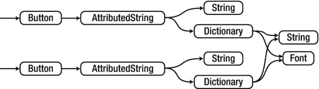

图 21-1. 属性字符串对象图

现在假设某个按钮的属性字符串被替换成了另一个。对象图现在看起来像图 21-2 所示。

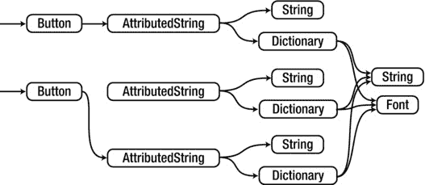

图 21-2. 存在泄漏对象的对象图

原始属性字符串不再有任何引用。除非属性字符串、字符串和字典对象被销毁，否则它们会“泄漏”，浪费宝贵的内存。用不了多久，成千上万（甚至数百万！）泄漏的对象就会让你的应用窒息而亡。

你可能会建议让按钮负责销毁属性字符串对象。这是一个极好的建议。你可以制定一个通用规则：拥有引用的对象在用完后负责销毁原始对象。

但是，哪个对象应该销毁字体对象呢？多个对象引用了它。没有一个对象是“负责”字体对象的。那么，当引用它的字典被销毁时，它是否需要销毁字体对象？

这就是在无向对象图中回收对象的核心问题——确定哪些对象仍然有用，哪些没用。计算机科学家和工程师们花了几十年时间试图解决这个问题，并提出了两种解决方案：**垃圾回收**和**引用计数**。

### 垃圾回收

iOS 不使用垃圾回收（尽管它在 OS X 的 Cocoa 中短暂出现过）。目前垃圾回收的标志性语言是 Java 和 C#。理解垃圾回收的工作原理非常有用，主要是作为理解自动内存管理为你所做事情的概念基础。这样，当我们讨论引用计数时，你就能理解其背后的逻辑。为此，以下是垃圾回收的 Cliff Notes 版本。

在垃圾回收中，操作系统会跟踪你的应用创建的每个对象。它会定期追溯应用中的对象图。从你的永久对象（比如应用对象）开始，找到它引用的所有对象（你的视图控制器），这些对象引用的所有对象（你的数据模型），依此类推，直到创建出可达对象的集合。这些都是你的应用可以访问到的对象。（如果你没有引用某个对象的方式，你就无法使用它，无论你多想用它。）剩下的就是不可达对象；换句话说，就是垃圾。如图 21-3 所示。

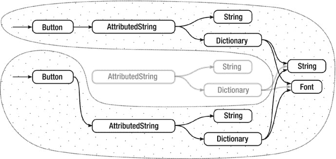

图 21-3. 可达与不可达对象

属性字符串，以及它引用的字典和字符串对象，已经变得不可达。这些对象被销毁，它们的内存被回收。

垃圾回收的美妙之处在于，程序员几乎不需要付出任何努力。你只需根据需要设置或遗忘对象引用即可。操作系统最终会来判断哪些对象你正在使用，哪些你不再使用。

这听起来很棒，不是吗？那为什么 iOS 不使用垃圾回收呢？有几个原因。垃圾回收将所有工作转移到了操作系统身上。定期筛选成千上万个对象以确定谁引用了谁，并非一项简单的任务。这需要大量的 CPU 时间，从而转化为电池消耗和间歇性的无响应。

其次，研究得出结论，只有在可用内存远大于应用程序使用时，垃圾回收才真正高效¹。当内存紧张时，垃圾回收的性能会急剧下降，进一步降低应用性能。

因此，当拥有大量 CPU 能力、无需节省这些能力，并且内存充足时，垃圾回收的效果很好。这听起来像什么？我希望你回答的是“台式电脑”或“服务器”，因为那不是对像 iOS 设备这类小型手持计算平台的描述。

你想要的是一种类似垃圾回收的解决方案——能够自动判断哪些对象正在使用、哪些需要销毁——但又没有那么多开销。这种解决方案叫做**引用计数**。


### 引用计数

引用计数通过统计指向某个对象的引用数量来判断该对象是否仍在使用中。这是一种协作机制，每个对象都会记录指向自身的引用数量——即其引用计数。使用某个对象的其他对象在建立指向该对象的引用时会通知它，并在不再需要时再次通知它。当最后一个引用对象断开连接时，该对象才会被销毁。简要机制如下：

- 当某个对象希望保持对另一对象的引用时，它会向该对象发送 `-retain` 消息。`-retain` 消息会使接收方的引用计数加一。
- 当某个对象停止引用另一对象时，它会先向该对象发送 `-release` 消息。`-release` 消息会使接收方的引用计数减一。
- 当某个对象的引用计数变为 0 时，它会自我销毁。

本质上，这种方式将判断对象何时不再被使用的责任从操作系统转移到了对象自身以及引用该对象的其他对象上。

回到带属性的字符串示例，图中的每个对象引用都伴随一条 `-retain` 消息。每条消息都会将该对象的引用计数加一，使对象知晓有另一个对象正在使用它。像 `Font` 对象这样的共享对象，其引用计数为 2 或更高，因为它们被多个对象所使用，如图 21-4 所示。

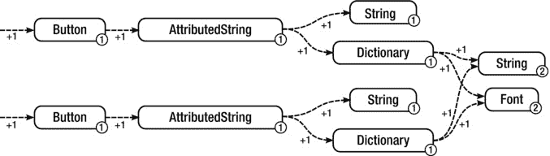

图 21-4. 被引用计数的对象

`retain` 和 `release` 消息的发送通常被封装在属性的设置方法中。设置方法会向新的对象引用发送 `retain` 消息，并向被替换的旧引用发送 `release` 消息。当你为按钮对象设置一个新的带属性字符串对象时，首先发生的操作就是向新的带属性字符串对象发送一条 `retain` 消息，如图 21-5 所示。该带属性字符串对象已经向它引用的字符串和字典发送过 `-retain` 消息，而字典也已向其集合中的字符串和字体对象发送过 `-retain` 消息。

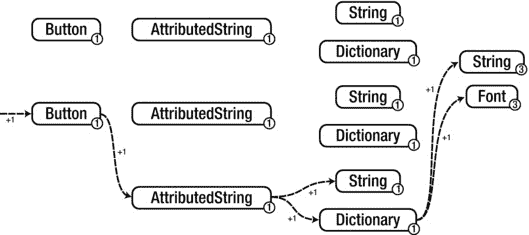

图 21-5. 保留新属性

在按钮的设置方法返回之前，它会向之前引用的对象发送一条 `-release` 消息。该对象的引用计数原本为 1。`-release` 消息将其引用计数降为 0，随后该对象立即自我销毁。作为销毁过程的一部分，它会向所有仍持有的对象引用发送 `-release` 消息。这引发了一连串的 `-release` 消息，系统地寻找并销毁所有不再具有活动引用的对象，如图 21-6 所示。

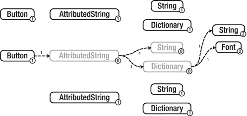

图 21-6. 释放旧对象

引用计数提供了垃圾回收的大部分好处，而开销却不到其三成。所有 iOS 应用都使用引用计数。当你启动新项目时，你将使用自动引用计数（ARC）。现有项目可能使用 ARC 或手动引用计数（也称为托管内存，或简称引用计数）。这一选择会影响你的编码方式。我们首先从传统的引用计数开始。

### 手动引用计数

在使用传统引用计数编写 iOS 应用时，你的代码负责在更改对象引用时保留和释放它们。如果你查看非 ARC 的 Objective-C 代码，你会看到其中散布着 `-retain`、`-release` 和 `-autorelease` 消息（稍后我将解释 `-autorelease`）。但这并不像听起来那么难。以下是基本要点：

- 向你希望继续引用的对象发送 `-retain` 消息。
- 对于你保留过的对象，在放弃引用之前立即发送 `-release` 消息。
- 每个新创建的对象引用计数为 1。如果你创建了一个对象（通过 `[[SomeClass alloc] init]` 或 `-copy`），那么你已经保留了它，并且在完成使用后必须释放它。
- 当对象被销毁时，它会收到一条 `-dealloc` 消息。`-dealloc` 方法必须释放它仍引用的所有对象。

你通常会在属性的设置方法中发送 `retain` 和 `release` 消息——这也是使用设置方法更改属性值的又一个充分理由。现在你能理解 `retain` 属性的作用了吗？`retain` 属性的设置方法承诺会保留新对象并释放旧对象。一个典型的属性和设置方法对看起来像这样：

```
@property (retain) UIFont *font;
...
- (void)setFont:(UIFont*)font
{
    [font retain];
    [_font release];
    _font = font;
}
```

注意：请留意设置方法中 `-retain` 和 `-release` 消息的发送顺序。现在考虑新对象与现有对象是同一个对象的情况。

更棒的是，如果你让 Objective-C 自动合成你的设置方法，它会发送所有正确的消息。

你的对象还负责在销毁时释放它仍持有的任何引用。每个对象在引用计数降到 0 后、内存返还堆之前，会立即收到一条 `-dealloc` 消息。以下是一个典型的 `-dealloc` 方法：

```
- (void)dealloc
{
    [_font release];
    [super dealloc];
}
```

这并不复杂，而且工作得相当好——除了两个巨大的缺陷。嗯，一个巨大缺陷和一个严重问题。我们先来看这个巨大缺陷。


### 跳入池中

这种引用计数机制在大约五分钟内运行良好，直到你需要从方法中创建并返回一个对象。想一想：如果创建对象的代码负责在完成后释放它，那就意味着不可能创建对象并将其返回给调用者。最终你会得到这样的代码：

```
- (NSArray*)allThatJazz
{
    NSMutableArray *jazz = [[NSMutableArray alloc] init];
    [jazz addObject:hands];
    [jazz release];
    return jazz;        // 哎呀，jazz 已不复存在！
}
```

你可能会建议让 `-allThatJazz` 返回一个保留的对象，并由调用者负责释放它，但这会引发大麻烦。现在每个调用者都必须知道哪些消息返回需要释放的对象，哪些不需要。更别提以后改变主意，决定 `-allThatJazz` 应该返回一个无需释放的对象了，因为那样你就得修改所有使用该方法的代码。不，还有更好的办法。

解决方案是一种巧妙的结构，称为自动释放池。自动释放池会延迟向对象发送 `-release` 消息。当你的代码执行完毕后，自动释放池会被排干（是的，就用的这个词）。它会向池中的所有对象发送 `-release` 消息。不再有任何引用的对象会被销毁。

使用自动释放池来安排“在未来的某个时间点”向对象发送 `-release` 消息。具体做法是向对象发送 `-autorelease` 消息，而不是 `-release` 消息。如果 `-release` 消息表示“我已经完全不用这个对象了”，那么 `-autorelease` 消息则表示“这段代码执行完毕后，我将不再需要这个对象。”

**警告**

通过发送 `-release` 或 `-autorelease` 消息来表示你对一个对象不再感兴趣，但切勿同时发送两种消息。两者的含义（“我不用这个对象了”）完全相同，并且都与一次 `-retain` 消息相平衡。唯一的区别在于时机（现在还是稍后）。

使用自动释放池后，`-allThatJazz` 方法如今变成了这样：

```
- (NSArray*)allThatJazz
{
    NSMutableArray *jazz = [[[NSMutableArray alloc] init] autorelease];
    [jazz addObject:hands];
    return jazz;
}
```

`jazz` 对象被称为自动释放对象。该对象的引用计数非零，并且保证会一直存在直到自动释放池被排干。更妙的是，发送消息的对象也无需为此操心：

```
- (void)fosse
{
    NSArray *jazz = [self allThatJazz];
    if (jazz.count<3)
        [self yell:@"More!"];
}
```

注意这段代码并没有保留或释放该对象，尽管它显然“正在使用”它。这是因为一条非常重要的规则：每个 Objective-C 方法返回的对象都由另一个对象保留着。该对象要么由你向它请求的对象保留，要么由自动释放池保留。

**警告**

此规则的例外是那些返回新创建对象的方法。这些方法名会以“init”、“copy”或“new”开头。当使用这些方法时，请遵循新对象的规则。

这意味着你不需要为了立即使用一个对象而保留它。事实上，除非你想在方法返回后继续使用该对象，否则无需保留它。因此只要 `-fosse` 方法在返回后不需要使用 `jazz`，它就不必保留或释放它。

如果它确实需要在之后使用呢？那么它就应该向对象发送 `-retain` 消息，并将其存储在一个更持久的变量中。这通常是一个属性，其设置器方法会自动发送 `-retain` 消息：

```
- (void)fosse
{
    NSArray *jazz = [self allThatJazz];
    self.modernJazz = jazz;
}
```

你还在好奇自动释放池何时被排干吗？自动释放池由应用程序的事件循环创建和排干。在第 4 章中，我解释过你的应用程序是如何“事件驱动”的。在每个事件被分发到你的代码之前，会自动创建一个自动释放池。每个收到 `-autorelease` 消息的对象都会被添加到该池中。当你的所有代码执行完毕，控制权返回事件循环时，自动释放池被排干，销毁所有临时对象。在下一个事件被分发之前，会创建一个新的自动释放池，该过程重复进行。

**注意**

你也可以使用 `@autoreleasepool { ... }` 指令创建自己的自动释放池。它会创建一个新池，执行块中的代码，然后立即排干该池。`@autoreleasepool` 的使用并不多见。

自动释放池解决了引用计数的巨大缺陷，通常意味着你大部分代码无需发送任何 `-retain` 或 `-release` 消息。我很快就会讲到另一个大问题，但首先让我们回顾一下目前已学到的内容。

### 快速总结

这涵盖了手动内存管理的 99%。以下是其用法的简化总结：

- 创建对象（`[[Class alloc] init]` 或 `-copy`）之后，任选其一：
  - 使用它，然后向其发送 `-release` 消息
  - 向其发送 `-autorelease` 消息
- 由消息返回的对象可以在方法持续期间安全使用。
- 如果你在方法返回后可能还会用到的地方存储了对象引用，则应保留该对象（通常由属性设置器方法处理）。
- 如果你的代码向对象发送了 `-retain` 消息，那么在丢弃对该对象的引用之前，必须向其发送一条相应的 `-release` 或 `-autorelease` 消息（通常由属性设置器方法或 `-dealloc` 处理）。

有了这些基本规则，以及设置器方法的帮助，对象销毁和内存管理基本上会在后台自动进行。你几乎能以零成本获得垃圾回收的大部分好处。然而，有一种情况垃圾回收仍然优于引用计数。下面我们来看看这个问题。

**晦涩的引用计数陷阱**

在少数特殊情况下，即使遵循这些简化规则也仍可能让你陷入困境。考虑以下代码：

```
id obj = [array objectAtIndex:0];
[array removeObjectAtIndex:0];
[obj doSomething]; // ！崩溃！
```

那么问题出在哪里？问题在于代码依赖于 `-objectAtIndex:` 消息返回一个被（array）保留或自动释放的对象。它确实做到了。事实上，该对象是由 `array` 保留的。但下一行代码从数组中移除了该对象。数组不再保留它。如果这是该对象的唯一引用，它就会自我销毁。下一行代码就会让你的应用崩溃，因为 `obj` 现在指向了垃圾数据。（注意：自动引用计数不会被这种代码所迷惑。）

你有时会看到通过添加引用计数消息来解决此类问题的做法：

```
id obj = [[[array objectAtIndex:0] retain] autorelease];
[array removeObjectAtIndex:0];
[obj doSomething]; // 非常安全
```

完整的内存管理规则集可以在《高级内存管理编程指南》中找到，该指南位于 Xcode 的文档和 API 参考窗口中。


### 打破循环

现在我们来谈谈引用计数的“另一个问题”。一个对象可以间接地引用自身。这会导致其引用计数被人为抬高，从而阻止它被释放。以图 21-7 中展示的一个简单的课堂数据模型为例。

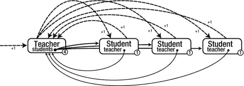

**图 21-7.** 循环保留

一个 `Class` 对象创建了一个 `Teacher` 对象，并向其中添加了 `Student` 对象。`Teacher` 维护着对每个学生的引用，这需要向每个学生发送一条 `-retain` 消息。每个 `Student` 都需要一个到其 `Teacher` 的连接。这个连接是一个属性，它引用并保留了 `Teacher` 对象。

当课程结束时，`Teacher` 对象被释放。接下来发生的事，嗯，什么也没有发生。如图 21-8 所示，Teacher 的引用计数从 4 下降到了 3，它只是待在那里，认为还有其他三个对象仍在用它。确实有，但那三个对象正是它正在保留的三个 `Student` 对象。

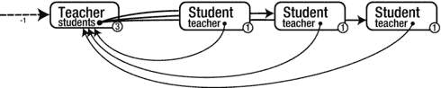

**图 21-8.** 释放一个过度保留的 Teacher

这被称为循环保留问题，引用计数无法解决它。循环中的对象被泄露，永远无法被销毁。

解决方案是不保留所有的对象引用。在图 21-9 中，`Student` 对象已被修改，因此它们不再向 `Teacher` 对象发送 `-retain` 消息。现在，当 `Teacher` 被释放时，其引用计数将降至 0。它将销毁自身及其三个 Student 对象。

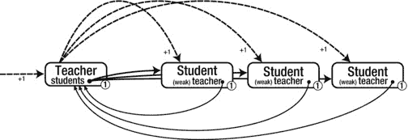

**图 21-9.** 未保留的对象引用

`Student` 对象使用的是未保留的引用。未保留的引用用于父子关系（如 `Teacher`-`Student` 示例）、委托以及有时用于目标对象，以避免创建循环保留。要创建一个未保留属性，请使用 `assign` 属性（`@property (assign) id delegate`）。一个 `assign` 属性仅存储对象引用；它不会发送任何 `retain` 或 `release` 消息。

这解决了循环保留问题，但我必须警告你（而且我怎么强调都不为过），未保留的引用是危险的。如果你正在引用的对象被销毁了——它可能被销毁，因为你没有保留它——那么对象引用将指向垃圾内存。这是你在 Objective-C 程序中会遇到的最令人头疼的错误之一。

> **注意：** 未保留的引用有时被称为弱引用。我暂时避免使用这个术语，因为 ARC 定义了一个含义不同的 `weak` 引用。

关键在于以一种能确保未保留引用永远不会指向已销毁对象的方式来编写代码。例如，`Teacher` 对象可以在其 `-dealloc` 方法中释放每个 `Student` 之前，将每个 `Student` 的 `teacher` 属性设置为 `nil`。如果其他某个对象仍然保留着一个 `Student` 对象，那么它将不会有一个指向垃圾内存的 `teacher` 属性。

这也是为什么在本书中，我反复警告你要在对象被销毁之前将其从通知中心移除的原因。在好几处地方，你都看到过这段代码：

```
- (void)dealloc
{
    [[NSNotificationCenter defaultCenter] removeObserver:self];
}
```

原因在于通知中心使用的是未保留的引用。（别问为什么；这是一个有着悠久历史的复杂原因。）如果你允许你的对象被销毁，却仍然让它注册在通知中心，那么下一条通知消息将被发送到垃圾位置。相信我，这是一个很难诊断的错误。

### 恐慌避雷

让我们用所有引用计数和内存管理可能严重出错的方式，来结束这个讨论。哦，别这样，这会很有趣的！

*   创建或保留一个对象，然后忘记向它发送 `-release` 或 `-autorelease` 消息。这将造成内存泄露。这被称为过度保留错误。
*   错误地向一个对象发送 `-release` 或 `-autorelease` 消息。这会导致对象在仍有引用指向它时被过早销毁。随后发送给该引用的消息将表现异常。这被称为过度释放错误。
*   创建循环保留。这最终会导致对象泄露。
*   在对象被销毁后未能清除未保留的对象引用。这被称为野指针错误。

有成百上千种不同的场景可能导致这些错误之一，但所有这些场景都归属于那四类。

你现在是不是害怕得不敢再写一行 Objective-C 代码了？深呼吸，放松一下，因为自动引用计数来拯救你了。ARC 能防止这四种悲剧中的三种，并为你提供轻松避免第四种的工具。现在，让我们回到 ARC 的安全范围内。

## 自动引用计数

自动引用计数是 Objective-C 编译器的一个特性。它分析你的源代码，以精确确定你何时停止使用某个对象引用，并自动插入代码以发送正确的 `-retain` 和 `-release` 消息。这种一致性意味着你的代码不会受到一半的引用计数错误的影响：过度保留和过度释放。它们根本不会发生。

剩下的两个问题，即避免循环保留和野指针问题，通过一个新的 `weak` 限定符得到了解决。任何变量或属性都可以声明为 `weak`。它不会保留其引用的对象（就像未保留的引用一样），但它也是安全的。如果其指向的对象应该被销毁，Objective-C 运行时会自动将该变量设置为 `nil`。因此，你可以解决那些烦人的循环保留问题，而不用担心可能导致应用崩溃的野引用。

ARC 是有（一点）代价的。ARC 不允许某些编程实践。但我相信，在审视它们之后，你会同意 ARC 的好处远远超过你不得不放弃的那些少数晦涩特性：

*   你的代码不能发送 `-retain`、`-release` 或 `-autorelease` 消息。这现在是编译器的工作。
*   你的 `-dealloc` 方法不再需要在末尾发送 `[super dealloc]`。编译器会为你做这件事。
*   你不能将对象指针放入 C 结构体（`struct { int number; id obj }`）中。
*   你不能将对象指针转换为 C 类型指针（`void *cPtr = obj`），反之亦然。
*   所有自动对象指针变量都被初始化为 `nil`。

还有其他一些更晦涩的限制，但以上是主要的一些。如果你仔细想想，放弃的并不多。大多数你不得不放弃的东西（发送你自己的 `-retain` 和 `-release` 消息），正是你希望 ARC 最初就能帮你避免的。

### 启用 ARC

你可以在项目设置中启用 ARC。所有新项目都会默认开启。如果你想在现有项目中更改它，请访问项目的构建设置。找到 `Apple LLVM – Language – Objective-C` 部分，并更改 `Objective-C Automatic Reference Counting` 设置，如图 21-10 所示。

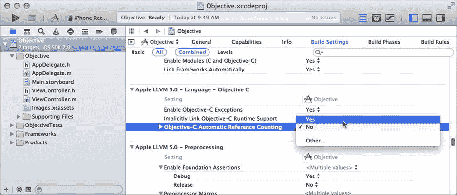

**图 21-10.** 为项目更改 ARC 设置

> **注意：** 可以按文件逐个启用 ARC。ARC 与非 ARC 代码完全兼容，因此你可以混合搭配使用。你可以通过在项目的构建阶段向特定文件添加 `-fobjc-arc` 或 `-fno-objc-arc` 编译器标志来实现这一点。有关“如何操作”，请查阅 Xcode 的“文档与 API 参考”窗口中的“控制单个文件的编译方式”指南。


# ARC 做不到的事

ARC 是一项出色的技术，可能是在平衡开发者需求与移动设备运行要求之间做出的最佳折衷方案。然而，它的作用范围恰好止步于 Objective‑C 的边界。Core Foundation（iOS 核心的 C 语言函数集）也使用引用计数，但 ARC 采取了明确的“放手”策略。

你在 `ColorModel` 应用中已经遇到过这种情况。在创建色相/饱和度场图像的代码中，你使用了一些 Core Graphics 函数。这些 C 函数返回的是指向被称为“类型”的类对象结构的指针。Core Foundation 类型同样使用引用计数：

```
CGColorSpaceRef colorSpace = CGColorSpaceCreateDeviceRGB();
CGDataProviderRef provider = CGDataProviderCreateWithCFData(
    (__bridge CFDataRef)bitmapData);
hsImageRef = CGImageCreate(...);
CGColorSpaceRelease(colorSpace);
CGDataProviderRelease(provider);
```

这段代码中有两处值得关注。首先，即使这是一个使用 ARC 的应用，你仍需负责这些类型的内存管理。`CGColorSpaceCreateDeviceRGB` 和 `CGDataProviderCreateWithCFData` 返回的值是新建的（已保留的）类型引用。你的责任是使用相应的 Core Foundation 释放函数 `CGColorSpaceRelease` 和 `CGDataProviderRelease` 来释放它们。

其次，有一条令人困扰的规则：你不能将 Objective‑C 对象指针转换为 C 指针。而这恰恰发生在 `CGDataProviderCreateWithCFData` 的参数中。该参数是一个 `CFDataRef`（C 指针），但 `bitmapData` 是一个 `NSData` 对象。`CFData` 和 `NSData` 在功能上可互换，它们属于免费桥接的成员。Objective‑C 中的部分类拥有对应的 Core Foundation 类型，二者可以相互替代。特殊的 `__bridge` 限定符放宽了 ARC 的常规规则，允许将 Objective‑C 对象引用作为 C 类型引用传递。

Objective‑C 与 Core Foundation 之间的边界并非完全封闭。ARC 有某种“迁移策略”。返回免费桥接类型的 Core Foundation 函数通常会经过类型转换并存储到 Objective‑C 对象引用中，从而可以将其作为对象处理。在 ARC 之前的代码中，可能看起来像这样：

```
NSString *strObj = (NSString*)CFUUIDCreateString(0,uuid);
```

这个特定函数从 UUID 结构创建了一个新字符串，并将其存储到字符串对象引用中。但同样，ARC 不允许这样做，因为 `CFUUIDCreateString` 返回的是 `CFStringRef` 指针，而非对象。通过添加 `__bridge_transfer` 限定符可以解决此问题：

```
NSString *strObj = (__bridge_transfer NSString*)CFUUIDCreateString(0,uuid);
```

这样做有两个好处。编译器不再报错，允许将 C 类型指针转换为 Objective‑C 对象指针。但更关键的是，ARC 接管了释放 `strObj` 的责任。`__bridge_transfer` 限定符的含义是：“此 C 指针代表一个保留计数为 1 的 Objective‑C 兼容对象。将其存储在对象引用中，并像对待任何新建对象一样处理它。” ARC 便接手后续工作。

如果你需要反向操作——将一个 ARC 管理的对象转换为 Core Foundation 引用——请使用 `__bridge_retained` 限定符，如下所示：

```
NSString *objString = @"Hello!";
CFStringRef coreString = (__bridge_retained CFStringRef)objString;
// 对 coreString 执行 C 函数操作
CFRelease(coreString);
```

ARC 会将 Objective‑C 对象的所有权和内存管理权转移给你，就像它是一个新建的 `CFStringRef` 一样。此后，你可以像对待任何 `CFStringRef` 一样处理它，包括在使用完毕后释放它（`CFRelease`）。

以上是使用 Core Foundation 和免费桥接的要点。这些内容以及其他相关问题，在 Xcode 的“文档和 API 参考”窗口中的《过渡到 ARC 发布说明》中有详细讨论。

## 总结

内存管理是成功开发 iOS 应用的关键部分。借助 ARC 等技术，你无需花费过多精力为此担忧。凭借你对 ARC 和循环引用的新认识，你可以明智地决定使用哪种引用类型（`strong` 或 `weak`），以及如何解决偶尔出现的（弱引用的）对象消失之谜。更重要的是，你理解了对象何时以及为何被销毁，这对于减少应用的内存使用至关重要。在后续章节中，你将看到应用具体使用了多少内存。

但在那之前，我们要稍作停留，探访 iOS 开发中一个常被忽视的领域。在那里，你可以问一句：“¿Qué pasa, Alicia?”

**脚注**
[1] 近期研究得出结论，只有当堆内存总量至少达到应用程序内存占用量的 4 到 5 倍时，垃圾回收的效率才能与引用计数相匹配：*《垃圾回收与显式内存管理的性能量化比较》*，作者：马萨诸塞大学阿默斯特分校计算机科学系的 Matthew Hertz 和 Emery D. Berger。

# 22. Êtes-vous Polyglotte?

## 摘要

Dumella rah!

Dumella rah!

也许你更喜欢 *kia ora*、*guten tag*、*bom dia*、*hallo*、*saluton*、*bonjour*、*¡hola*、*你好* 或 *ciao*？我敢打赌，你的用户中至少有一个喜欢其中一种。如果你正在开发面向全球发布的应用，那么请考虑这一点：你的大多数潜在用户并不说你的语言。

苹果长期以来一直拥抱支持软件翻译和本地化的技术，以便世界各地的人们能够用母语享受这些软件。Xcode 和 iOS 协同工作，帮助你使应用适应不同的语言和地区。在本章中，你将：

- 国际化你的项目和代码
- 为应用添加本地化设置
- 本地化应用资源
- 本地化字符串常量
- 使用本地化的系统对象

`Pigeon` 是一个很棒的小应用，我相信全世界的人都想用它。但如果他们看不懂，那就很难办了。让我们来本地化 `Pigeon`，这样讲西班牙语的人也能享受它。在此过程中，你将学习如何为几乎任何地区的用户本地化你的应用。


# 本地化流程

为国际分发准备应用程序通常被称为“翻译”应用。自然语言翻译是其一部分，但忽略了其他重要元素。正确的术语是本地化，它不仅涵盖语言差异，还涉及文化和地域差异。

本地化应用通常是应用开发的最后阶段之一。在你设计完所有界面、编写完所有代码，并且一切运转正常后，你才开始针对其他语言进行本地化。有两个主要步骤：

- 国际化你的项目和代码
- 本地化你的资源和字符串

第一步纯粹是技术性的，为第二步做好准备。国际化包括对项目和代码的修改，使你的应用能够被本地化。通常要做的事情不多，但它为接下来的工作奠定了基础。

第二步是本地化。一个国际化的应用无需修改代码即可针对不同语言进行本地化。一旦你的应用完成国际化，就可以随意添加本地化内容。你的应用最初可能只支持英语，但通过添加本地化版本，它可以轻松切换为法语、阿拉伯语、德语、中文、俄语、希伯来语、韩语或葡萄牙语。流行的应用通常支持数十种本地化语言。而且你无需做任何额外操作；你的应用会自动根据用户的资料、区域和偏好使用最佳的本地化版本。

本地化流程也旨在实现协作。如果你和我一样（连母语都搞不定，更不用说 20 种其他语言了），你将需要专业帮助来翻译你的应用。iOS 应用本地化是围绕一组资源文件有组织地进行的。你确定需要本地化的资源文件，并将其副本交给你的翻译人员或翻译服务提供商。他们会将其翻译成另一种语言，并返回这些文件的本地化版本。你只需将这些翻译后的文件添加到你的项目中，你的应用瞬间就变得 _muy versado_（非常精通）了！

## 语言包

iOS 将你应用的所有语言特定资源组织到本地化包中。每个包都是你应用中的一个子目录，以语言命名：`en.lproj` 包含所有英语资源，`fr.lproj` 包含法语资源，`es.lproj` 包含西班牙语资源，依此类推。当你的应用启动时，用户的偏好的语言会选择要使用的本地化包。每当你的代码请求一个资源文件时，包管理器会首先在首选语言包中查找该文件的本地化版本。如果没有找到，则使用默认语言或通用版本中的文件。

> **注意**  
> 语言标识符（`en`、`fr`、`de`、`ja` 等）由 ISO 639-1 和 ISO 639-2 标准定义。参见 [`http://www.loc.gov/standards/iso639-2/php/English_list.php`](http://www.loc.gov/standards/iso639-2/php/English_list.php)。对于 ISO 639-1 中未定义的语言，iOS 使用 ISO 639-2。你会很高兴地知道，克林贡语（`tlh`）最近已被添加到 ISO 639-2 标准中。MajQa’（太棒了）！

下面是一个示例。假设你已将 Wonderland 应用本地化为英语和法语。它将包含两个语言包：`en.lproj` 和 `fr.lproj`。当你创建 Wonderland 时，你添加了一个包含书籍文本的资源文件，存储在一个名为 `Alice.txt` 的文件中。如果你不采取任何其他操作，你的应用将始终显示英文版书籍，因为这是你的应用中 `Alice.txt` 的唯一版本。

如果你有该书的法语译本，它也将存储在一个名为 `Alice.txt` 的文件中，但放置在 `fr.lproj` 文件夹内。在 `WLBookViewController.m` 文件中，你编写了将书籍文本加载到字符串对象中的代码：

```
NSURL *bookURL = [[NSBundle mainBundle] URLForResource:@"Alice"
                                         withExtension:@"txt"];
NSString *text = [NSString stringWithContentsOfURL:bookURL
                                          encoding:NSUTF8StringEncoding
                                             error:NULL];
```

如果你的应用用户说法语，`NSBundle` 对象将首先在 `fr.lproj` 中搜索名为 `Alice.txt` 的文件。如果找到，它将加载该文件的法语版本，而不是原始的英语版本。你的代码无需更改，也无需做出任何语言特定的决策。它只是请求一个资源，包管理器就会提供本地化版本（如果可用且合适的话）。

由于所有视图控制器都从 Interface Builder 文件获取其视图对象，因此你应用的所有界面都可以轻松本地化。声音文件（特别是如果声音包含语音内容）、图标、图形等也是如此。你无需本地化所有内容，只需本地化那些需要翻译的资源即可。

Xcode 负责处理本地化包的创建和维护。你只需告诉 Xcode 你想要支持哪些语言，以及哪些资源文件需要本地化。Xcode 将创建本地化包并组织好这些文件。

### 程序化本地化

本地化资源文件可以轻松地本地化应用的大部分语言特定界面。但仍有少量自然语言内容不在资源文件中。这些内容包括程序中的字符串常量和格式化后的值。

iOS 包含一种机制，用于按用户期望的方式翻译字符串常量和格式化值。以下代码摘自本书前面的 Shorty 应用：

```
UIAlertView* alert = [[UIAlertView alloc]
          initWithTitle:@"Could not load URL"
                message:error.description
               delegate:nil
      cancelButtonTitle:@"That's Sad"
      otherButtonTitles:nil];
```

国际化此代码需要进行一些修改。首先，需要将字符串常量替换为能够提供每个字符串本地化版本的变量。其次，提供用户可见文本的对象应提供本地化版本（如果可用）。国际化后的代码如下所示（修改部分以**粗体**显示）：

```
UIAlertView* alert = [[UIAlertView alloc]
          initWithTitle:NSLocalizedString(@"Could not load URL",nil)
                message:error.localizedDescription
               delegate:nil
      cancelButtonTitle:NSLocalizedString(@"That's Sad",nil)
      otherButtonTitles:nil];
```

字符串字面量被替换为一个特殊的宏，该宏会在用户语言更改时替换为本地化的字符串。`error.description` 属性被替换为 `error.localizedDesription` 属性。它提供相同的信息，只是被翻译成了用户的母语。


# 即刻开始本地化！

通常，我会建议你在开始本地化流程之前，先彻底完成应用的国际化。不过我猜，你可能想直接上手，亲眼看看本地化是如何运作的。那么我们就这么做吧；这对本项目不会造成任何问题。你稍后就会完成代码的国际化。

**注意**

如果这是一个大型项目，我强烈建议你先进行国际化，再进行本地化。国际化代码往往会导致资源文件变更，而这些变更又需要重新进行本地化。

本地化项目分为三个步骤：

- 在项目中添加你想要支持的语言
- 选择哪些资源文件需要被本地化，以及分别翻译成哪些语言
- 编辑文件的本地化版本

从第 18 章完成的 Pigeon 项目开始。在项目导航器中选择该项目，然后在编辑器窗格中选择 `Pigeon` 项目（而非 target），如图 22-1 所示。选择 `Info` 标签页，向下滚动直到找到 `Localizations` 区域。

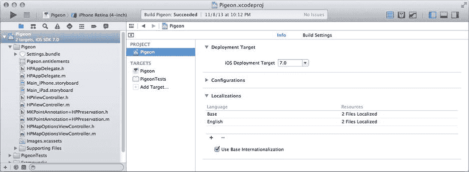

图 22-1. 项目本地化

你的项目已经有两种本地化内容：一个基础本地化，以及一个开发语言本地化。开发语言即是创建项目的开发者所使用的语言——也就是你的语言。而基础本地化则是在没有其他更适合用户的本地化时所使用的语言。

请注意，Xcode 提示某些文件已经完成了本地化。你（目前）在项目导航器中还找不到相关迹象，但如果你在 Finder 中打开项目文件夹（在项目导航器中选择 `Pigeon` 文件夹，右键/Control+单击，选择“在 Finder 中显示”），你将会看到本地化包的结构，如图 22-2 所示。

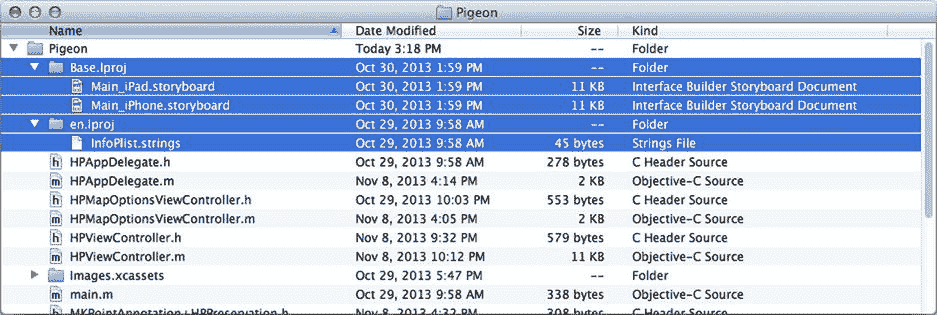

图 22-2. 默认的本地化包结构

在 Pigeon 项目中，`InfoPlist.strings` 以及两个 storyboard 文件已被本地化。已本地化的文件意味着它已被移入一个或多个特定的本地化包中。尚未本地化的文件则存放在本地化包之外，并适用于所有语言。

**提示**

要本地化一个资源文件，请在项目导航器中选择该文件，然后在文件检查器中点击 `Localize...` 按钮。此操作仅适用于那些可以被本地化且尚未被本地化的文件。

由于每个文件目前仍然只有一个版本，因此已本地化与未本地化的资源文件之间的区别基本上没有意义。让我们来改变这一点。回到 Xcode，进入项目信息标签页，点击 `Localizations` 组底部的 `+` 按钮，然后选择添加西班牙语（`es`）的本地化，如图 22-3 所示。常用语言会列在主菜单中。更多的语言可以在底部的 `Other` 子菜单中找到。

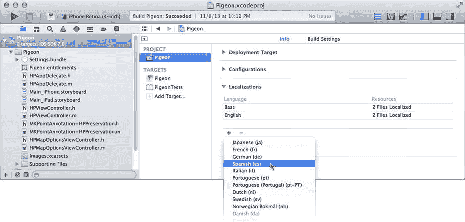

图 22-3. 为项目添加本地化

接着，Xcode 会提示你选择要本地化的文件，如图 22-4 所示。列表中将包含所有当前已本地化的文件。如果某个文件不需要为此语言进行本地化，可以取消勾选。`Reference Language` 是指将被复制用于创建此次本地化的源文件版本。如果你已经为某些语言做过本地化，那么选择一个与你正在创建的语言相似的语言可能会更轻松。例如，如果你正在为冰岛语创建本地化，那么从现有的挪威语翻译开始可能比从英语开始要容易。

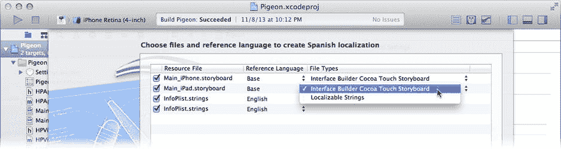

图 22-4. 选择要本地化的文件


```markdown
在`File Types`列中，某些文件提供了本地化方式的选择。本地化 Interface Builder 文件有两种方式：本地化整个文件或仅创建字符串翻译文件。如果选择前者，整个 Interface Builder 文件的副本将放置在本地化包中。这允许你为新的语言更改界面中的任何内容——你可以更改按钮标题、选择不同的图像、设置不同的文本对齐方式、指定不同的字体、添加不同的布局约束等。对于从右向左阅读的语言（如希伯来语）进行本地化，通常需要对界面布局进行大幅调整。视图可能需要调整大小以适应更长的（德语）或更短的（中文）标题。

另一方面，如果只需更改按钮和其他控件的文本标题，你可以通过`Localizable Strings`文件来本地化界面。你将在本章后续部分了解并创建这些文件。在本演示中，将两个故事板文件的文件类型更改为`Interface Builder Cocoa Touch Storyboard`，如图 22-4 所示。然后点击`Finish`按钮。

> **Note**
> 实际上，Pigeon 可以轻松地通过为两个故事板使用`Localizable Strings`文件来实现西班牙语本地化。但这样做会让你错过本地化 Interface Builder 文件的体验。

在项目导航器中，`InfoPlist.strings`和两个故事板文件旁边现在出现展开三角形，如图 22-5 所示。展开它们，你将看到每种语言的本地化版本。

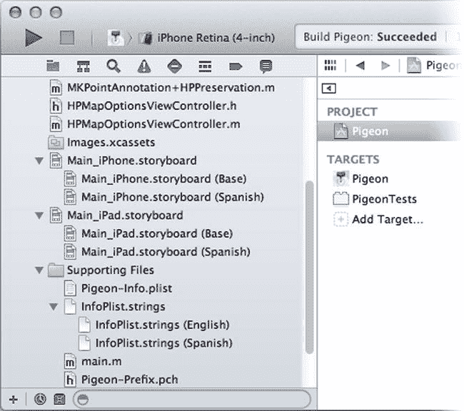
*图 22-5. 导航器中的本地化文件*

项目文件夹中的文件也发生了变化。如果你返回访达（Finder），你会看到 Xcode 已创建一个`es.lproj`包，并将三个资源文件复制到其中，如图 22-6 所示。

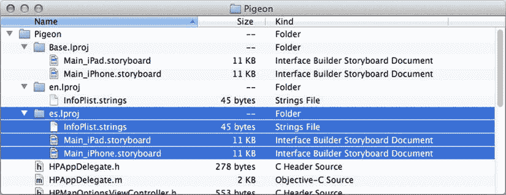
*图 22-6. 包含多个本地化包的项目文件结构*

幸运的是，Xcode 在项目导航器中隐藏了包结构。相反，它以一种更合理的方式展示你的资源文件：将特定资源的所有本地化版本分组到一个可展开的项中。

要本地化一个文件，只需编辑语言特定版本即可。确实如此。展开`Main_iPhone.storyboard`（或`_iPad`）文件组，然后选择`Main_iPhone.storyboard (Spanish)`本地化版本，如图 22-7 所示。选择文件组等同于选择基础语言或开发语言版本。因此，如果你没有选择编辑特定的本地化版本，你将会编辑默认版本。

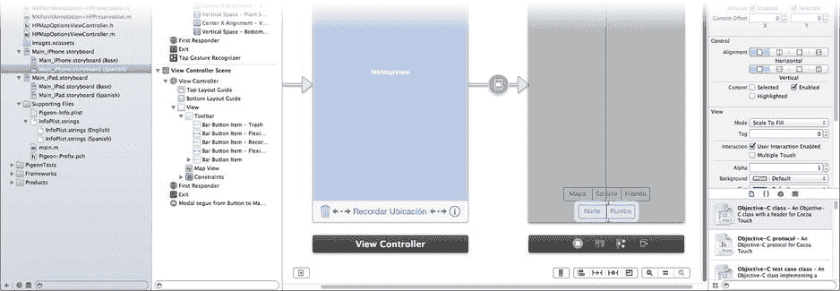
*图 22-7. 编辑 iPhone 故事板的西班牙语版本*

根据表 22-1，编辑两个视图控制器中的按钮标题，并根据需要调整其大小。

*表 22-1. 西班牙语按钮标题*

| 英文标题 | 西班牙语标题 |
| :--- | :--- |
| Remember Location | Recordar Ubicación |
| Map | Mapa |
| Satellite | Satélite |
| Hybrid | Híbrido |
| North | Norte |
| Heading | Rumbo |

运行应用。你不会注意到任何差异，如图 22-8 左侧所示，因为首选语言仍然是英语。按下 Home 键，打开“设置”应用。在“通用”>“国际”>“语言”中，将语言更改为“Español”，然后点击“完成”按钮。模拟器或设备将执行“热”重启。这将导致所有正在运行的应用停止。当它们再次启动时，将会使用不同的本地化资源集。

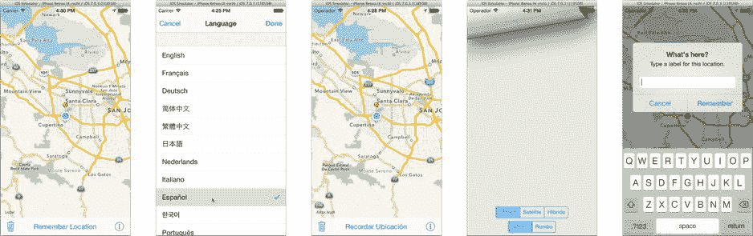
*图 22-8. 首次尝试本地化 Pigeon*

从 Xcode 再次运行 Pigeon 应用。这次，它变成了西班牙语！图 22-8 的中间部分显示了按钮的本地化标签，甚至一些地图标签也已更改（由 Map Kit 提供）。

不过，你还没有完成。点击`Recordar Ubicación`按钮，看看弹出的警告（图 22-8 右侧）。在我看来，那看起来不像西班牙语。这是因为你还没有首先对应用进行国际化。现在是时候回过头来正确地完成这件事了。

## 国际化你的应用

国际化应用包括进行使代码和项目支持本地化所需的更改。这分解为四个任务：

*   向应用添加语言包
*   翻译字符串常量
*   获取本地化属性
*   使用 iOS 格式化对象

你已经在上一节中完成了第一个任务，即向你的应用添加了一个`es.lproj`本地化包。Pigeon 的问题在于它包含了一些英文的字符串常量。这些需要用本地化版本替换。

### 国际化字符串常量

Cocoa Touch 框架拥有一组宏——它们看起来像 C 函数，但并非如此——它们使你的字符串常量的本地化变得（相对）容易。这些宏与一个开发工具协同工作，该工具会提取你应用中的字符串常量，并将其转换为资源文件，存储在你的本地化包中。以下是这四个宏：

*   `NSLocalizedString`
*   `NSLocalizedStringFromTable`
*   `NSLocalizedStringFromTableInBundle`
*   `NSLocalizedStringWithDefaultValue`

第一个是最常用的，也是你将在 Pigeon 中使用的唯一一个。其他宏在需要组织大量字符串、或从其他包中读取字符串的情况下非常有用，但这些情况在此都不适用。所有宏的工作流程都是相同的：

1.  将你的字符串常量嵌入到`NSLocalizedString...`宏中
2.  运行`genstrings`工具以提取代码中的字符串
3.  本地化并编辑你的`.strings`资源文件

我可以解释这一切是如何工作的，但直接向你展示会容易得多。选择`HPViewController.m`文件，找到用户将看到的所有字符串。在 Pigeon 中，这些字符串仅位于两段代码中。在`-dropPin:`方法中，编辑警告对象的构造代码，使其看起来像这样（修改的代码以粗体显示）：

```objc
UIAlertView *alert = [[UIAlertView alloc] 
      initWithTitle: NSLocalizedString( @"What's here?" , @"Pin alert title")
            message: NSLocalizedString( @"Type a label for this location.", 
                                        @"Pin alert message")
           delegate:self
  cancelButtonTitle: NSLocalizedString( @"Cancel" , @"Pin alert cancel button")
  otherButtonTitles: NSLocalizedString( @"Remember" , @"Pin alert save button"),
                nil];
```

字符串常量被重写为`NSLocalizedString`语句。第一个参数是原始的、未翻译的字符串字面量。第二个是对该字符串含义或如何在程序中使用的提示或描述。这第二个参数不会成为你程序的一部分。它仅用于协助翻译人员。

这个程序中只有一个其他的英文字符串常量，位于`-alertView:clickedButtonAtIndex:`方法中。找到并编辑此语句（修改的代码以粗体显示）：

```objc
name = NSLocalizedString( @"Over Here!" , @"Default location label") ;
```

你应用中的字符串现在已国际化。下一步是将它们转换为资源。

> **Note**
> 你只本地化用户会看到的字符串。所有其他字符串常量——字典键、编码键、用户默认设置、表格单元格标识符等——永远不会被本地化。
```


### 使用 `genstrings` 工具

当你安装 Xcode 时，它同时安装了一系列命令行工具，其中包括 `genstrings` 工具。`genstrings` 会扫描代码（C、Objective‑C、C++ 以及其他语言），找出 `NSLocalizedString ...` 宏中的字符串常量，并将其编译成 `.strings` 文件。使用 `genstrings` 工具是为数不多需要离开 Xcode 舒适区的情况之一。

从 Finder、程序坞、LaunchPad 或你喜欢的启动应用程序中启动“终端”应用。终端让你可以使用 OS X 的命令 shell。你将从命令行运行 `genstrings` 工具，扫描项目中所有的 Objective‑C 源文件，将所有 `NSLocalizedString ...` 语句编译成一个 `.strings` 文件。请遵循以下步骤：

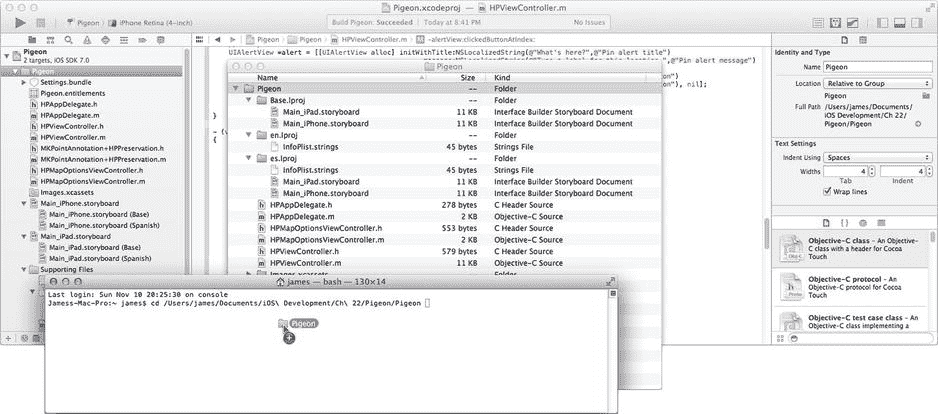

图 22-9. 设置 `genstrings` 工具

1.  在项目导航器中选择 `Pigeon` 文件夹组（而不是项目）。
2.  显示文件检查器（见图 22-9 右侧），并点击其“完整路径”右侧的箭头。这将在 Finder 中显示该文件夹。
3.  打开一个终端窗口，输入 `cd` 并按下空格键（见图 22-9 底部）。`cd` 是 shell 的更改目录命令。
4.  在 Finder 中，将 `Pigeon` 项目文件夹内的 `Pigeon` 文件夹拖拽到终端窗口中并放下。
5.  确保终端窗口再次处于活动状态，然后按下回车键。这会将 shell 的默认目录设置为 `Pigeon` 文件夹，该文件夹包含所有源文件和 `es.lproj` 语言包。
6.  在终端窗口中输入命令 `genstrings -o es.lproj *.m`，然后按下回车键。

当 `genstrings` 完成对所有源文件的扫描并创建一个 `.strings` 文件时——这通常快到你来不及眨眼——一个新的 `Localizable.strings` 文件将出现在 `es.lproj` 包中，如图 22-10 所示。此文件尚不属于你的项目，因此将其拖拽到项目导航器的“支持文件”组中，同样如图 22-10 所示。

> **注意**：如果你将来更改了字符串，可以再次运行 `genstrings` 工具来更新现有的 `Localizable.strings` 文件；无需再次将其添加到项目中。

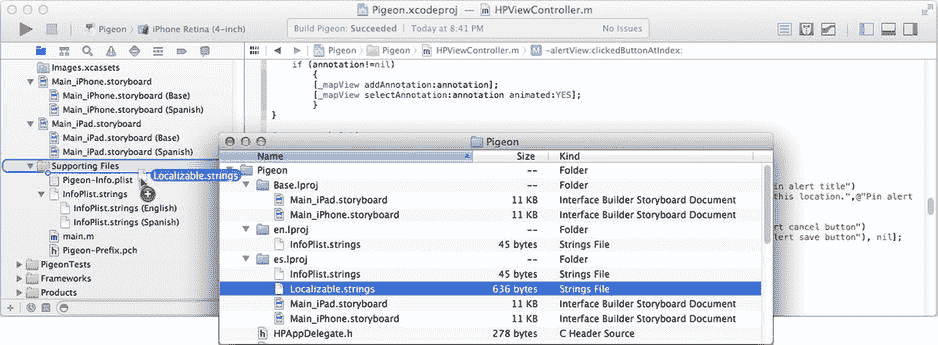

图 22-10. 添加初始的 `Localizable.strings` 文件

确保选中 `Pigeon` 目标并将其添加到项目中。在导航器中选择 `Localizable.strings` 文件，并显示文件检查器（`视图 ➤ 工具 ➤ 显示文件检查器`），如图 22-11 所示。

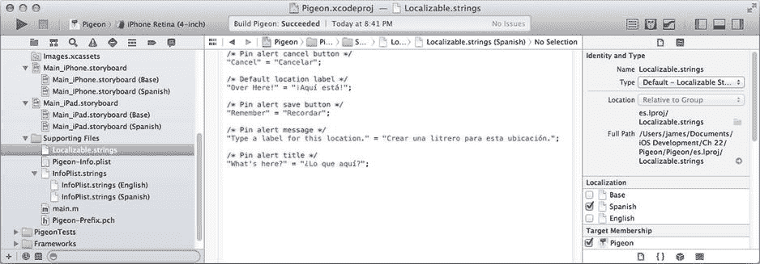

图 22-11. 新创建的 `Localizable.strings` 文件

`.strings` 文件是一个资源文件，包含一系列字符串替换条目。其格式类似于 C 源代码。每个 `=` 语句的左侧是原始字符串（键）。右侧是其本地化翻译（值）。每个替换条目上方是来自原始 `NSLocalizedString ...` 语句的注释，采用 C 风格注释格式。

> **注意**：你不必使用原始字符串作为键，但这是使用 `NSLocalizedString` 最便捷的方式。你也可以这样写 `NSLocalizedString(@"KEY1",nil)`，然后在英文的 `.strings` 文件中将其翻译成可读的内容，例如：`"KEY1" = "Welcome to Pigeon!";`。但这要求你也拥有一个英文 `.strings` 文件。

### 本地化你的字符串文件

选择 `Localizable.strings` 文件。在文件检查器中，找到“本地化”部分。如图 22-11 所示，只勾选了“西班牙语”本地化，因为只有一个版本的 `Localizable.strings`。在此项目中，你只需为西班牙语准备一个 `Localizable.strings` 文件。所有其他语言将使用源代码中原始的、未经翻译的字符串。当你准备好添加第三种语言时，只需在文件检查器的“本地化”部分勾选它，Xcode 便会复制现有的 `Localizable.strings` 文件并将其复制到新的语言包中。然后你将拥有一组 `Localizable.strings` 文件，就像 `Main_iPhone.storyboard` 一样。

选中 `Localizable.strings` 文件后，使用表 22-2 编辑每个字符串的右侧（值）部分。

**表 22-2.** 西班牙语字符串常量

| 注释 | 西班牙语字符串 |
| --- | --- |
| 固定提醒取消按钮 | Cancelar |
| 固定提醒保存按钮 | Recordar |
| 固定提醒标题 | ¿Lo que aquí? |
| 固定提醒消息 | Crear una letrero para esta ubicación. |
| 默认位置标签 | ¡Aquí está! |

完成后，编辑好的 `.strings` 文件应该类似于图 22-11 中所示。

### 测试你的字符串本地化

再次运行 `Pigeon`。假设用户的语言设置仍为 Español（西班牙语），应用程序将以西班牙语显示，如图 22-12 所示。

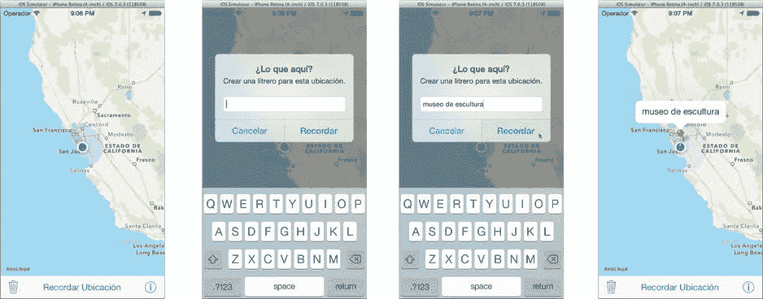

图 22-12. `Pigeon` 西班牙语版本

其工作原理如下。`NSLocalizedString...` 宏展开后会生成代码，向应用的 `NSBundle` 对象发送一个 `-localizedStringForKey:value:table:` 消息，并将字面字符串作为键传递。该方法会在首选本地化包中搜索 `.strings` 文件。如果找到文件，则会在该文件中搜索该键（原始字符串）并返回其翻译。

默认的 `.strings` 文件是 `Localizable.strings`，但如果你有大量字符串需要组织，也可以定义其他文件。每个字符串文件被称为一个表（table），你可以通过 `-localizedStringForKey:value:table:` 消息或 `NSLocalizedStringFromTable` 宏传递表名。使用这些宏时，`genstrings` 会自动创建多个 `.strings` 文件，每个表名对应一个文件。

如果该语言没有对应的 `.strings` 文件，或者在 `.strings` 文件中找不到键，则不执行翻译，宏或消息将返回原始字符串。


# 使用可本地化字符串实现界面本地化

既然你已经了解了`.strings`文件，那么就能理解如何使用`.strings`文件来本地化一个 Interface Builder 文件。当你本地化`Main_iPhone.storyboard`时，是通过选择`Interface Builder Cocoa Touch Storyboard`选项来实现整个文件的本地化的。然后你继续为这个 storyboard 创建了一个本地化版本。

如果你选择的是`Localizable Strings`选项，Xcode 就会为该 Interface Builder 文件创建一个本地化字符串文件，命名为`Main_iPhone.strings`。该文件会包含界面中视图对象的各种文本属性（主要是控件标题）的替换内容，就像这样：

`"jkj-WQ-xYm.title" = "Remember Location";`

这个键是一个只有 Interface Builder 和 iOS 才能理解的标识符；**不要修改它**。在这个例子中，它标识的是栏按钮项的标题属性。请根据你的本地化需求编辑该值，就像这样：

`"jkj-WQ-xYm.title" = "Recordar Ubicación";`

当 iOS 加载这个界面文件时，它会用本地化包中`Main_iPhone.strings`文件里的相应内容来替换对应的文本属性。

如果只需要修改控件和文本对象的标题就能实现界面的本地化版本，那么使用可本地化字符串文件比复制整个 Interface Builder 文件更合适。这样做的好处是，你以后可以修改 Interface Builder 文件（比如添加新视图、调整约束等），而无需在其他语言的副本中重复这些修改。

以上就是国际化和本地化的要点。在接下来的几个小节中，我将介绍一些不常见的本地化问题，以及编写代码以保持应用程序国际化的小技巧。

# 本地化 `Settings.bundle`

Pigeon 应用的资源中有一个`Settings.bundle`，它定义了该应用在“设置”应用中的偏好设置。这其实是一个包（bundle），类似于你的应用程序包，它也有自己的本地化包。如果你在项目导航器或访达中展开它，会看到在其默认本地化包中包含一个`Root.strings`文件。请选择该`Root.strings`文件，如图 22-13 所示。

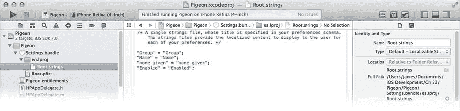

图 22-13. 默认的 `Root.strings` 文件

这个文件是原始`Settings.bundle`模板遗留下来的。它本应包含`Root.plist`文件中所有可见字符串的翻译。你在第 18 章中编辑过`Root.plist`文件，但从未编辑过这个文件。现在我们来修复它。编辑英文版的`Root.strings`文件，使其包含以下内容：

`"iCloud" = "iCloud";`

`"Sync Locations" = "Sync Locations";`

**提示：** 任何翻译结果与原字符串相同的条目（例如`"iCloud" = "iCloud";`）都是多余的，可以从`.strings`文件中省略。当找不到翻译时，系统会使用原始值，因此缺少替换条目就意味着不进行替换。例外情况是当使用`NSLocalizedStringWithDefaultValue`或`-localizedStringForKey:value:table:`并提供了默认值时，这些方法会在找不到替换条目时返回一个替代值。

这些键就是设置包中可见的文本——分组名称和开关标题。保存文件（文件 ➤ 保存）。不幸的是，当前版本的 Xcode 无法管理其他包内的本地化文件，因此你需要手动创建西班牙语本地化版本。这相当简单：

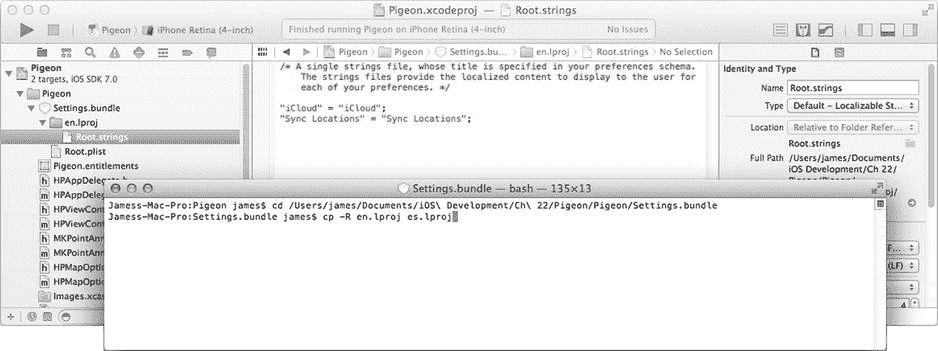

图 22-14. 从`Settings.bundle`中的`en.lproj`包创建`es.lproj`包

1. 打开一个终端窗口。
2. 输入`cd`并按空格键。
3. 直接从 Xcode 的项目导航器中将`Settings.bundle`拖拽并放入终端窗口。
4. 切换到终端窗口并按回车键。
5. 输入命令`cp -R en.lproj es.lproj`，然后按回车键，如图 22-14 所示。

回到 Xcode，你现在会看到`Settings.bundle`中包含了新的`es.lproj`包，如图 22-15 所示。

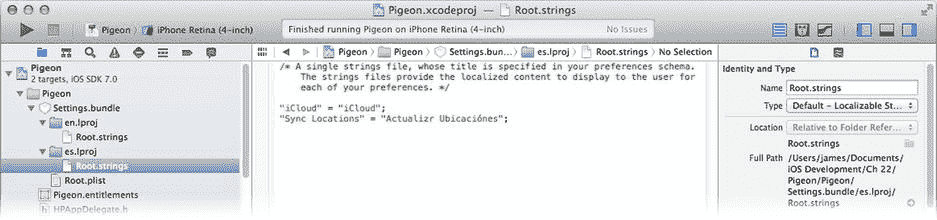

图 22-15. 本地化后的 `Settings.bundle` 字符串

在导航器中展开新的`es.lproj`文件夹，选择`Root.strings`文件，并按如下方式编辑：

`"Sync Locations" = "Actualizar Ubicaciónes";`

运行 Pigeon 应用。启动后，按下 Home 键并点击“设置”应用——哦，我是说“Ajustes”应用。找到 Pigeon 的设置项，你会看到它已经本地化了的设置内容，如图 22-16 所示。

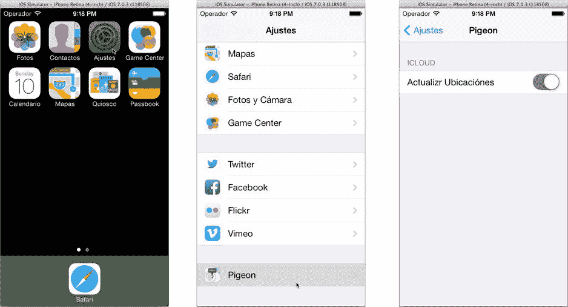

图 22-16. 本地化后的 Pigeon 设置项


# 其他代码注意事项

除了语言差异之外，你的应用还应该对区域偏好保持敏感。只要你允许，iOS 会自动处理其中的大部分情况。在编写代码时，请注意以下问题：

-   可见消息
-   日期
-   数字，包括百分比和货币

大多数返回供用户查看字符串的对象都会提供本地化版本。只要有可能，这些字符串就会被翻译成用户的语言。当你获取到要展示给用户的字符串时，请留意这些方法。以下是一些示例：

- `-[NSError localizedDescription]`
- `-[UIDocument localizedName]`
- `-[UIDevice localizedModel]`
- `-[PKPass localizedName]`

日期、数字（包括货币）会根据用户所在的区域和个人偏好进行格式化。这不能从他们的语言推断出来；法国的法语使用者与加拿大的法语使用者对货币的格式化方式不同。除了用户所在区域外，iOS 还可能提供用户可以自定义的个人偏好（例如 12 小时制或 24 小时制）。

所有这些变量和选择使得正确格式化数值变得极具挑战性。当然，除非你让 iOS 替你完成。让我这么说：总是让 iOS 来格式化日期和数字；永远不要试图自己动手。

假设你想向用户展示一个可读的日期和时间。使用 `NSDateFormatter` 类，根据用户期望的语言、日历和格式样式，将日期对象转换为可显示的字符串。这是一个非常常见的操作，以至于甚至有一个便捷方法可以通过单条语句完成所有这些工作。

我创建了一个名为 Dated 的简单演示应用，你可以在 `Learn iOS Development Projects` ➤ `Ch. 22` ➤ `Dated` 文件夹中找到它。Dated 应用展示了一个日期选择器，以及使用 `NSDateFormatter` 类将该日期转换为可读字符串的结果。以下是 `DTViewController.m` 中执行所有工作的代码：

```
self.dateView.text =
    [NSDateFormatter localizedStringFromDate:self.datePicker.date
                                    dateStyle:NSDateFormatterFullStyle
                                    timeStyle:NSDateFormatterLongStyle];
```

当我第一次在模拟器中启动 Dated 时，如图 22-17 左侧所示，即使当前语言设置为西班牙语，日期仍显示为英文。这是因为日期、时间、数字和货币是由另一组偏好设置控制的——这也是你不能根据用户语言假设数字格式化方式的另一个原因。

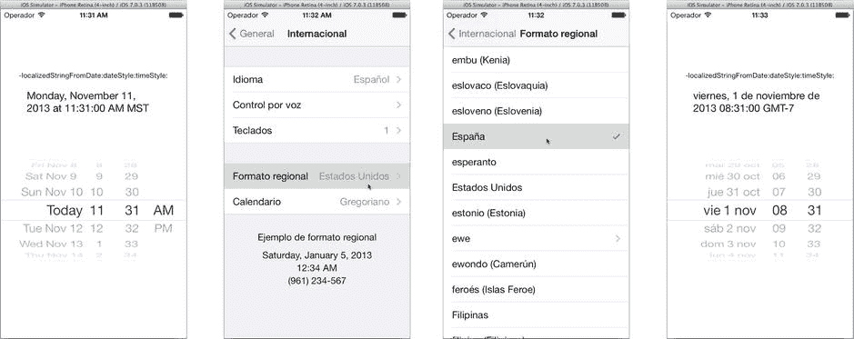

图 22-17. 使用 `NSDateFormatter` 本地化日期

在“设置”应用中，我将“区域格式”设置从“美国”改为“西班牙”，如图 22-17 中间所示。返回 Dated 应用后，应用选择器和格式化日期都已翻译成西班牙语，并采用了西班牙常见的日期格式惯例。

使用 `NSNumberFormatter` 来格式化数字、百分比和货币。这两个类处理了所有微妙的细节。有关更多信息，请参考 Xcode 的“文档和 API 参考”窗口中的“数据格式化指南”。

## 本地化你的应用名称

正如你已经看到的，你的 `.strings` 文件最常用于本地化程序中的字符串常量。实际上，它们是通用的字符串翻译文件，用于多种用途，比如翻译 `Settings.bundle` 中的可见字符串。

一个重要的 `.strings` 文件是 `InfoPlist.strings` 文件，它会自动为你进行本地化。此 `.strings` 文件中的替换会应用到应用的 `Info.plist` 文件。这是一个属性列表文件，包含关于你的应用的信息（元数据）。你在本书前面编辑过这个文件，当时你添加了像 `gps` 这样的设备要求。

展开 `InfoPlist.strings` 组并选择 `InfoPlist.strings (Spanish)` 项。`InfoPlist.strings` 文件包含了对 `Info.plist` 文件中任何用户可见属性值的替换。在 iOS 中，这几乎仅限于你的应用名称。然而，`InfoPlist.strings` 文件的键并不是原始字符串，而是 `Info.plist` 的属性键。要本地化特定属性，请将一个属性键及其本地化值添加到你的 `InfoPlist.strings` 文件中，如下所示：

```
"CFBundleDisplayName" = "Paloma";
```

对于讲西班牙语的用户，应用名称在主屏幕、设置应用以及其他地方将变为“Paloma”，如图 22-18 所示。

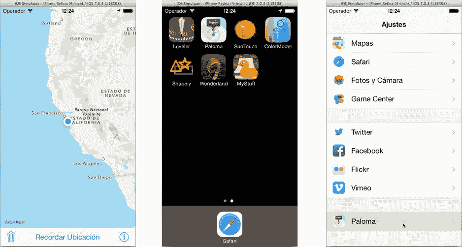

图 22-18. 本地化你的应用名称

## 总结

本地化是你对应用进行的最后一项工作，但它绝对不是最不重要的。本地化极大地拓展了应用的视野。正如你所看到的，这并没有太多的工作量。我甚至可以说，本地化你的应用是你可以采取的扩大其吸引力的最重要的一步。

尽管你已经完成了所有常见的步骤，但你的应用还可以通过更复杂和非标准的方式支持本地化。例如，在你的应用内切换语言、提供你自己的本地化逻辑，甚至添加不受支持的语言（如夏威夷语或克林贡语）。从 Xcode 的“文档和 API 参考”窗口中的“国际化编程主题”文档开始学习吧。

由于本地化是你进行的最后几项应用开发任务之一，因此它作为本书的最后几章之一也恰如其分。但是，你的 iOS 之旅不必止步于此。还有更多内容可以完善你的应用和精进你的应用开发技巧。接下来的两章将提升你的应用性能，使其更上一层楼。


# 23. 更快，更快

## 摘要

本书中我已经花费了大量篇幅来讲解 iOS 中的“正确”做法：正确的委托使用方式、正确的数据模型定义方法、正确的通知注册流程，等等。但打造一款出色的应用，不仅仅要确保这些方面正确无误。当然，你希望应用没有 Bug，希望按钮能正常工作，更不希望它崩溃，但还有其他重要因素。应用的适配性、精致度以及性能，与它的功能特性同样至关重要。本章将重点聚焦于性能。

Xcode 提供了一套用于性能剖析和测试的工具，称为 Instruments，你之前甚至都没接触过。在本章中，你将启动 Instruments，并学习以下内容：

-   掌握代码优化的基础知识
-   分析方法执行时间
-   识别“热点”并重组代码以提升应用响应速度
-   追踪对象分配以量化内存使用情况
-   对应用进行压力测试
-   实现低内存处理机制

性能这个概念，通常局限于衡量代码 X 完成任务 Y 的速度。但我对它的定义要宽泛得多。对我来说，应用的性能很简单，就是它在用户面前的表现如何：它应该高效、响应灵敏，并且（理想情况下）不会在重负载下慢如蜗牛。你可以为其中一些方面设定度量指标——本章我们也会进行测量——但最终，重要的是你的应用用起来感觉如何。它是充满活力还是反应迟钝？是断断续续还是流畅顺滑？这才是试金石。

当你在第 19 章为 MyStuff 不断添加新功能时，你的应用开始显得有些疲惫。某些操作变得缓慢。它正在失去响应能力。在本章中，你将把 MyStuff 放到测试台上，看看它哪里出了问题。但在那之前，我们先来谈谈整体流程。

## 性能优化

性能优化是一门从代码中获取最佳性能的艺术。解决几乎任何软件问题都有成百上千种不同方法。其中一些方法会比其他方案更高效——占用更少内存、需要更少资源、执行速度更快。简而言之，性能优化就是寻找性能最优解决方案的过程。那么，我们现在是不是要去查看一些代码，然后设法让它运行得更快？

错。

几乎每个程序员都会犯的一个错误是优化那些不需要优化的代码。我也干过这事。这很难避免。当你看到一段明明可以变得更快或更高效的代码时，就会忍不住想重写它。千万别这么做。深吸一口气，如果需要就吸三口气，然后仔细阅读下面的内容。

代码优化服务于一个目的：让你的应用变得更好。如果你的工作不能让应用变得更好，那就不该去做。仅仅因为能让代码更快就跳进去重写，那是傻瓜才干的蠢事。首先，你根本不知道应该优化什么。说真的，你不知道。即使是拥有几十年经验的程序员，也无法准确猜出应用的性能问题出在哪里。

其次，仅凭看代码就能判断它是否对应用产生了负面影响，这更难。你可能知道如何让它变得更好，或者使用更少的对象，但这并不意味着这能给你的应用带来切实的改观。

最后，代码优化——尤其是为了提升执行性能的优化——往往会复杂化你的代码，并可能引入新的 Bug。这会使代码更难阅读、更难调试、更难维护。你最好能确保从中获得的巨大收益能抵消它带来的代价，否则你的开发努力不是在前进，而是在倒退。

以下是实现有目的、理性且有效的性能优化的方法：

1.  设定一个性能标准
2.  测量应用的性能并记录一个基线
3.  优化你的代码
4.  测量修改后应用的性能，并与基线进行比较
5.  重复步骤 3 和 4，直到达到步骤 1 中设定的目标

开始时，简单直接地编写你的代码。一开始不要太担心优化和性能问题。专注于编写简洁、直截了当、健壮、无 Bug 且易于维护的解决方案。然后，你就可以开始性能分析和优化过程了。

第一步至关重要。你必须从确定应用的性能标准开始。这个标准不必很花哨，甚至不必很具体。可以简单到“我希望我的应用响应灵敏”。这实际上就是一个非常好的性能标准。在测试应用时，如果你发现有一两个地方响应不如预期，那么这些就是你需要集中精力优化的代码。其余代码则无需理会。无论你能把它优化得多好，从定义上说，它都没有损害应用的性能。

一旦确定某些地方需要改进，就使用像 Instruments 这样的工具来测量和分析你应用当前的性能。这将成为你的基线。这也是一个关键步骤。如果你没有衡量进展的参照物，就无法评估优化的有效性。

然后，也只有到那时，你才能开始修改你的代码。因为你已经完成了前两步，所以你知道需要实现什么目标，并且拥有（从基线测量中获得的）制定计划以实现目标所需的信息。

之后，你应该再次测量应用的性能，并与基线进行比较。这将明确告诉你取得了多少进展。如果改动达到了你最初的性能标准，那就大功告成了。回去添加很酷的新功能吧。

如果没有，那就再试一次。优化既是科学也是艺术，尝试两三种不同的解决方案才能找到满意方案的情况并不少见。关键在于，你将知道是否取得了真正的进展，以及进展了多少。

好了，说教到此结束。现在，让我们用实践来检验一下这些理论吧。


# 修复缓慢的点击响应

在第 19 章末尾，你为 MyStuff 添加了文档存储功能，并修复了一个图片旋转问题。我一直在我的 iPhone 上试用 MyStuff，发现它开始变得有些卡顿。当我从照片库中选择一张新图片时，从我点击图片到我回到详情视图控制器之间，会出现明显的卡顿——大约一秒钟的暂停。这段时间长到每次操作时，我都会瞬间觉得好像没点到图片，想要再试一次。这太慢了。

> **注意**  
> 你可能并未遇到这些性能问题。在本章中，我特意在一台较旧的 iPhone 4 上测试 MyStuff。更新的、更快的设备响应可能会快得多，但我希望所有用户都能获得出色的应用体验，而不仅仅是那些拥有最新硬件的用户。

我脑海中的程序员声音在告诉我问题所在：“老兄，`did-pick-image` 方法需要裁剪、旋转和调整图片大小，然后还要将其压缩成 PNG 格式并存储到文件包装器中。这当然需要一两秒！”然后我不得不提醒我的程序员声音：“老兄，这不重要，用户体验太差了。”

如果你理解我的推理思路，那你已经在性能优化的道路上迈出了第一步。你以简单直接的方式写下了可运行的代码。然后，你为应用设定了性能标准，具体来说，就是触摸响应不应有延迟。点击后等待整整一秒才响应，这太慢了。

> **注意**  
> 在大多数情况下，如果对触摸手势的视觉反馈在 ¼ 到 ¹/3 秒内发生，界面就会显得生动且响应迅速。任何在 1/10 秒内完成的操作都会显得是即时的。而延迟达到 ½ 秒或以上时，界面就会开始让人感觉迟钝。

下一步是测量应用的性能，收集信息并建立基准。为此，你将使用 Instruments。

## 启动 Instruments

Instruments 是一套分析、性能分析和故障排查工具的前端界面，就像 Xcode 是编辑器、编译器和调试器的前端界面一样。你可以单独使用 Instruments 应用，但 Xcode 让直接从项目中使用它变得非常方便，我实在想不出你还有什么理由不想这样做。

对于本章，请从你添加了文档支持并修复了图片旋转问题后的 MyStuff 版本开始（第 19 章中的第二个练习）。你可以在 `Learn iOS Development Projects` ➤ `Ch 19` ➤ `MyStuff E2` 文件夹中找到这个项目。

Instruments 通常在你对应用进行性能分析（Profile）时启动。这由项目中定义的一组方案控制。当你运行应用（使用运行按钮或菜单命令）时，会使用运行方案。当你进行性能分析时，会使用分析方案。要查看项目的方案，请选择工具栏中的方案控件或通过菜单选择 `Product` ➤ `Scheme` ➤ `Edit Schemes...` 中的 `Edit Scheme...`。这将打开方案编辑器，如图 23-1 所示。

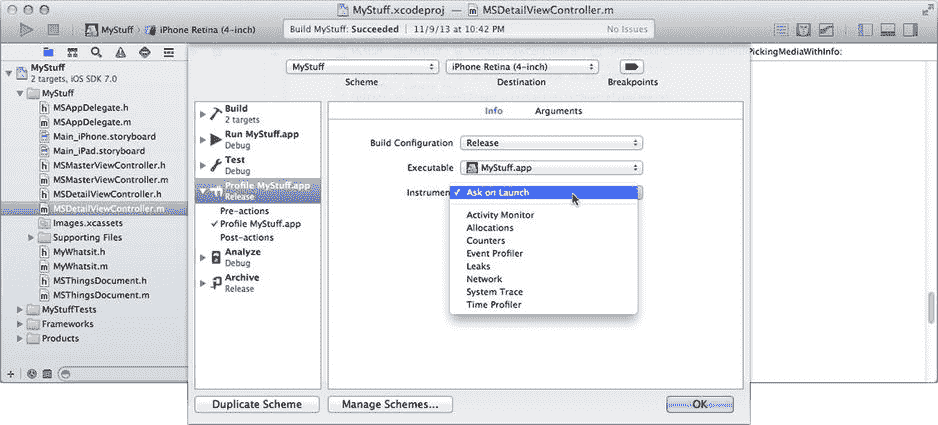

**图 23-1.** 项目方案编辑器

这里无需更改任何内容，我只是想让你知道它的位置。分析方案的默认配置是启动 Instruments 并提示你（`Ask on Launch`）选择要执行的分析类型，这对于入门来说非常完美。那你还在等什么呢？关闭方案编辑器，通过菜单或运行按钮的下拉菜单选择 `Product` ➤ `Profile`（`Command+I`）来对应用进行性能分析。Xcode 将构建你的项目并启动 Instruments，如图 23-2 所示。

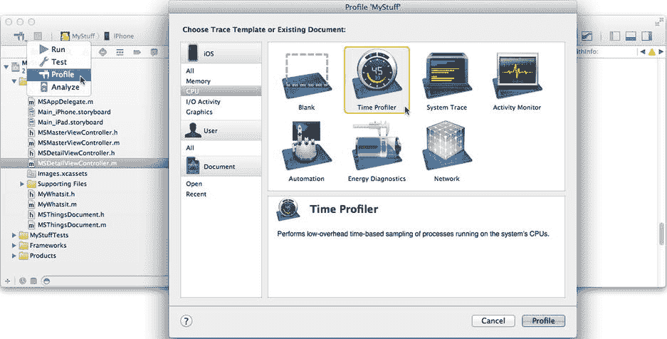

**图 23-2.** Instruments 模板选择器

每个 Instruments 模板描述了不同类型的分析。为方便起见，它们被分成了不同的组。对于首次性能分析尝试，请选择 `iOS` ➤ `CPU` 组，然后选择 `Time Profiler`。这是衡量代码性能最常用的检测工具。它的工作原理是每秒数千次地对正在执行的代码进行采样。在每次采样时，它会记录当前正在执行的函数和方法。通过聚合数十万次的采样结果，它可以非常准确地描绘出你的应用将时间花在了哪里。这些就是你想让其加速的方法。

> **注意**  
> 虽然你可以在模拟器中进行性能分析，但这并没什么用。性能高度依赖于 CPU 型号、硬件组件、内存速度以及设备的其他物理特性。所有性能测试都应在真实的 iOS 设备上进行。

点击 `Profile` 按钮，你的应用将在 Time Profiler 检测工具的监控下开始执行，如图 23-3 所示。你想找出添加新图片时到底什么操作耗时那么长，所以立即开始添加新项目，并从你的相机胶卷中为这些项目选择图片。重复此操作几次。你应该会注意到，当你在照片选择器中点击图片时，CPU 活动会出现一个相当大的尖峰，从而在 CPU 使用率图表中形成一系列“驼峰”。

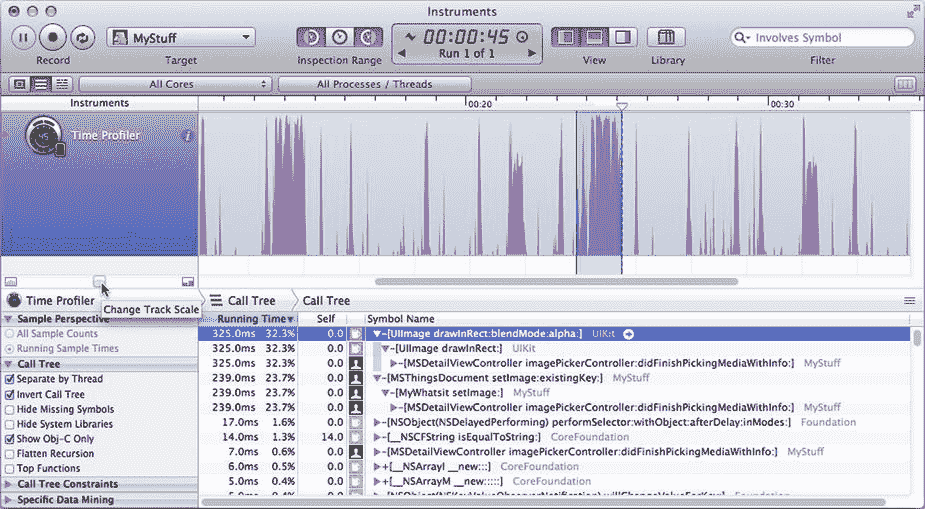

**图 23-3.** MyStuff 的初始采样

添加了几张新图片后，按主页按钮将应用推入后台，等待几秒钟，然后点击 Instruments 工具栏中的 Record 按钮。这将停止记录并终止应用。

恭喜，你有了一个基准！你已经捕获了与你试图解决的性能问题相关的代码活动。现在是时候挖掘这堆数据，来寻找一些答案了。


# 寻找热点区域

首先，请将你感兴趣分析的性能信息单独分离出来。在 Instruments 的时间线（窗口顶部）中使用鼠标，将采样光标（带虚线的空心三角形）拖动到你点击相册选择器中某张图片时记录到的图形“驼峰”的左侧。为了操作更方便，请拖动“更改轨道缩放比例”控件（如图 23-3 窗口左中部所示）来放大你感兴趣的采样点。点击工具栏中“检查范围”控制器的左侧遮罩按钮，然后将光标拖动到驼峰的右侧，再点击右侧遮罩按钮。现在，你在下方窗格中将要处理的所有数据将只包含高亮范围内的采样点（见图 23-3 下方窗格），因为这部分才是你希望进行性能分析的代码。

**注意**  
代码的性能数据在不同 CPU 上会有很大差异。因此，务必要在真实硬件（而非模拟器）上测量你的应用，并尽可能在你能获取到的多种硬件配置上重复测试。

现在，你需要找到代码中的热点区域。这是优化领域的行话，指的是那些消耗了大量 CPU 时间的代码。通俗点说，就是积累采样点最多的代码区域。在跟踪文档中选中“时间分析器”工具后，在时间分析器侧边栏中找到“反转调用树”和“仅显示 Objective-C”选项。将这两个选项都勾选上，如图 23-3 所示。

“仅显示 Objective-C”选项会从分析结果中过滤掉所有 C 函数。我建议 Objective-C 程序员使用这个选项，尤其是在刚开始分析时。

“反转调用树”选项会反转你右侧看到的调用树。当未勾选时，调用树会汇总整个应用的调用层级结构。表格中的每一行显示一个方法或函数，以及应用在其中花费的时间。展开某一行，你会看到它调用的方法，以及每个子方法所花费时间的明细。再展开其中一个子方法，你就明白其中的逻辑了。

调用树通常按照“最重”的方法排序。也就是说，每个分组的第一个行就是消耗最多 CPU 时间的方法。要深入挖掘并找到树中最重的代码路径，请持续展开每个分组的第一个行。

当勾选“反转调用树”选项后，调用树会被彻底翻转。此时，列表顶部显示的方法是应用中消耗时间最多的叶子方法。展开它，列表会显示是哪些方法调用了它——而不是它调用了哪些方法。在图 23-3 中，你可以看到应用 32.3% 的响应时间花在了 `-drawInRect:blendMode:alpha:` 方法上。通过反向展开各行，你会发现是 `-imagePickerController:didFinishPickingMediaWithInfo:` 方法调用了它（用于调整和裁剪所选图片）。

**提示**  
反转调用树对于识别那些从不同位置被调用的重量级方法特别有用。

继续往下看列表，下一个最重的方法是 `-setImage:existingKey:` 方法。这是你添加的用于将新图片存储到文档中的方法。当用户在图片选择器中点击某张图片时，23.7% 的时间用于将其存储到新文档中。如果你展开它的调用者，会看到它也是从 `-imagePickerController:didFinishPickingMediaWithInfo:` 方法中被调用的。

这证实了你的猜测：用户在选取图片时，你在第 19 章中添加的图片转换和文档存储代码拖慢了界面响应速度。让我们深入分析 `-imagePickerController:didFinishPickingMediaWithInfo:` 方法，看看具体发生了什么。再次关闭“反转调用树”选项，然后开始展开调用树中最重的方法，直到找到 `-imagePickerController:didFinishPickingMediaWithInfo:` 方法，如图 23-4 所示。

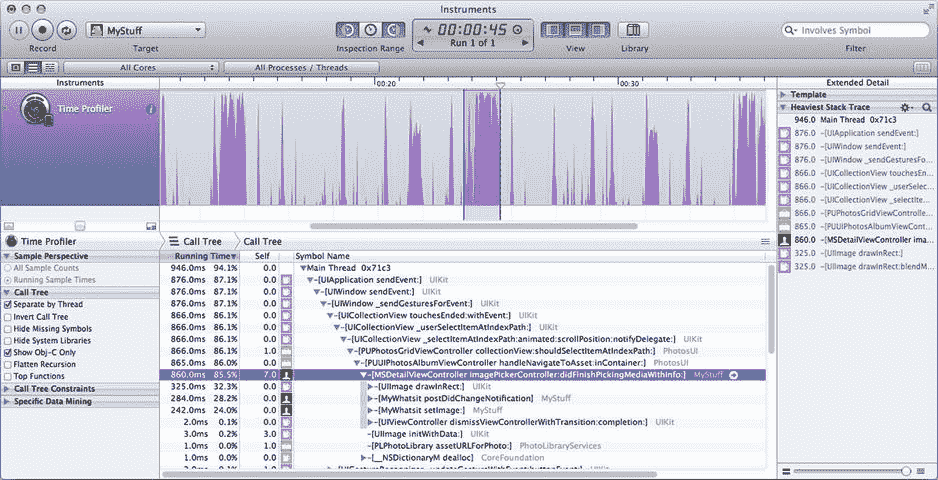

图 23-4. `-imagePickerController:didFinishPickingMediaWithInfo:` 执行时间详情

在这组采样数据中，显示图片选择器委托方法花费了近一秒（860 毫秒）来响应用户点击。展开该行，你可以看到图片选择器方法发送的每条消息所花费的时间。虽然这些信息很准确，但有时难以将其直接对应到你的代码正在执行的操作上。Instruments 在这里也能帮到你。

双击 `-imagePickerController:didFinishPickingMediaWithInfo:` 方法行，时间分析器会切换到其源代码视图，如图 23-5 所示。

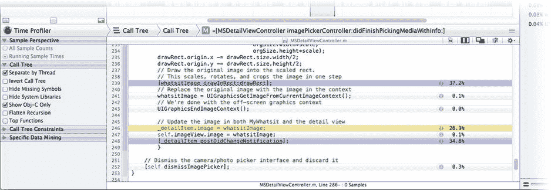

图 23-5. 时间分析器源代码视图

Instruments 会在源代码的每一行上叠加显示其所花费的时间，清晰地标出代码中的热点区域。这个视图尤其适合定位那些执行时间过长的循环。

从图 23-5 中你学到了什么？你了解到，当用户在图片选择器中点击某张图片时，37.3% 的时间用于裁剪图片，26.9% 的时间用于将其存储到文档中，0.3% 的时间用于关闭图片选择器视图控制器。而令人惊讶的是，34.8% 的时间用于通知所有观察者数据模型已更改。

嗯？

## 经验带来的自负

是的，这同样出乎我的意料。当我最初规划这些章节的项目时，我以为第 19 章中的图片压缩和文档存储代码会给 MyStuff 应用带来大量开销。我曾处理过 PNG 格式使用的 LZ77 压缩算法，深知其 CPU 消耗有多大。我原本计划在本章开头向你展示，当用户选择图片后，图片转换和压缩例程占用了多少时间，以及该如何处理。但实际上当我用 Instruments 分析 MyStuff 时，我发现了什么？我发现几乎三分之一的延迟都缠在了数据模型通知上。我原以为这件事甚至不会出现在雷达上。

这就是为什么你不能自以为知道性能问题出在哪里。即使拥有多年的编程经验，你的猜测也很可能是错误的。我就猜错了。你必须从实际测量你的性能表现开始。如果不这样做，你就只是在与风车搏斗。

那么，到底发生了什么？深入分析 `-postDidChangeNotification` 方法（如图 23-6 所示），结果发现，MyWhatsit 的变化通知被视图控制器观察到了，从而触发了表格视图的重绘（`-reloadRowsAtIndexPaths:withRowAnimation:`）。显然，这个操作比我预想的要昂贵得多。

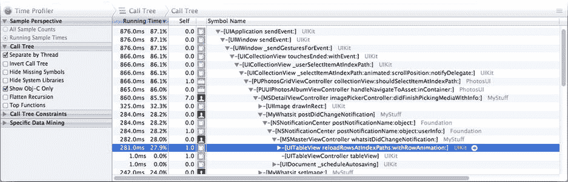

图 23-6. `-postDidChangeNotification` 的时间采样详情

好吧，我猜错了。现在我们可以回到如何改进 MyStuff 的问题上了吗？


### 摘取低垂的果实

掌握了这些知识后，你现在需要制定一个优化计划。你在照片选择器处理代码中发现了三个热点问题：

- 数据模型通知
- 图像转换
- 图像压缩与文档存储

诀窍在于“摘取低垂的果实”：找到对性能影响最大且最容易改进的代码。

图形操作本质上属于数据密集型和 CPU 密集型任务，而 iOS 图形库本身已经过高度优化。通过重写裁剪图像的代码来获得大幅改进的可能性微乎其微。

这样一来，数据模型通知和文档存储就成了潜在的改进对象。令人惊喜的是，最繁重的任务反而最容易解决。

### 延迟通知

在 iOS 中，通知是立即发送的。当你发送一个通知时，所有观察者都会立即收到通知消息，只有等它们全部处理完毕，控制权才会返回给你的方法。在这个实例中，通知所有对象数据模型已更改这一行为，触发了一系列耗时且开销巨大的操作。

你无法避免这项工作——数据模型必须发送通知，观察者也必须被通知到——但你可以拖延时间。对于选择新图片的代码而言，这些通知是否在代码完成前发送并不关键。你可以利用这一点来延迟通知。通知仍然会被发送，只是不会在用户点击图片的那一刻发生。这反过来会提升点击事件的响应时间。

通知中心有一个常被忽视的亲戚，叫做通知队列（`NSNotificationQueue`）。通知队列会代表你将通知发送给通知中心，但它提供了两项关键服务：首先，它不会立即发送通知，因此由这些通知触发的代码不会立即执行；其次，它会合并重复的通知，只发送一条——这一特性称为合并。有些通知（如数据模型更改）可能会发生多次，但含义相同。通知队列会将它们合并为一条通知，从而避免向所有观察者重复发送相同消息，效率远高于逐个发送。

打开你的 `MyStuff` 项目。在项目导航器中选择 `MyWhatsit.m` 实现文件，找到 `-postDidChangeNotification` 方法。按如下方式重写该方法（新代码以粗体标出）：

```
- (void)postDidChangeNotification

{

    NSNotification *noti;

    noti = [NSNotification notificationWithName:kWhatsitDidChangeNotification

                                         object:self];

    [[NSNotificationQueue defaultQueue] enqueueNotification:noti

                                               postingStyle:NSPostWhenIdle];

}
```

要使用通知队列，你必须先创建一个通知对象。（当你使用通知中心的 `-postNotification...` 消息时，系统会为你创建 `NSNotification` 对象。）创建通知后，将其推入队列。

每个通知队列都绑定到一个通知中心。iOS 会方便地为你创建一个绑定到默认通知中心的队列。你添加到默认队列中的任何内容，最终都会被发送到默认通知中心。

当修改后的 `MyWhatsit` 对象收到 `-postDidChangeNotification` 消息时，它不会立即通知观察者。这个方法已变为异步方法，仅将通知排入队列，留待将来发送。

那么，通知何时会被发送呢？你有几种选择，由 `postingStyle` 参数控制。最常用的两种是 `NSPostWhenIdle` 和 `NSPostASAP`：

- `NSPostASAP` 会在当前代码执行完毕、控制权返回事件循环后，尽快发送通知。适用于必须在下一个事件派发前发送的通知。
- `NSPostWhenIdle` 会保存通知，直到事件循环空闲时才发送。它会等待所有待处理事件（触摸事件、定时器、延迟消息、用户界面更新）处理完毕，然后在事件循环即将进入休眠前，发送所有排队的通知。当你希望在所有用户和定时器事件响应完毕后，立即处理通知时，请使用 `NSPostWhenIdle`。

现在，更新数据模型、刷新表格视图以及通知文档更改的工作仍然会被处理，但会在你响应用户点击事件、关闭视图控制器并更新完屏幕上所有内容之后才进行。

### 再战一轮

关闭并保存你的 Instruments 跟踪文档，如图 23-7 所示。给它取一个描述性的名称，例如“基线性能分析”。关闭分析窗口。

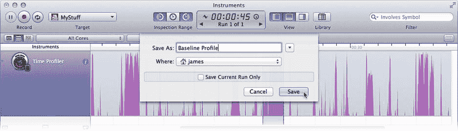

图 23-7. 保存基线跟踪文档

返回 Xcode 并再次对你的应用进行性能分析。执行与之前相同的步骤：选择 `Time Profiler` 模板，向应用添加图片，停止运行，将检查范围缩小到选择新图片的代码，并查看调用树，如图 23-8 所示。

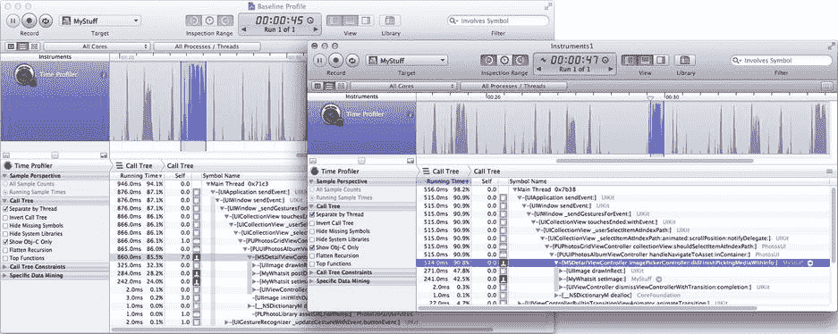

图 23-8. 对修改后的代码进行性能分析

这一次，`-imagePickerController:didFinishPickingMediaWithInfo:` 方法中的代码执行仅用了半秒钟（514 毫秒）。性能提升了超过 67%。打开你之前保存的基线跟踪文档，对比两段相似的执行片段。在修改后的代码中，`-postDidChangeNotification` 方法甚至没有出现在采样结果中——它执行得太快了！

如果你深入查看调用树，最终还是会找到数据模型通知被发送的位置，以及与之相关的所有繁忙工作仍在进行。但这些工作并非发生在用户点击界面的时候，因此用户看不到它们。

你的应用现在应该感觉响应迅速多了。创建响应式应用的关键在于，让事件循环持续运行，并随时准备对用户或其他事件做出即时反应。这通常意味着要分解工作，避免所有任务同时执行。通知队列是一种绝佳的方式，用于推迟那些你不希望干扰界面的任务，并且可以安全地在后续执行。

这是巨大的进步，但响应时间仍未降低到 0.5 秒以下。列表中的下一个“重头戏”是将图像添加到文档的代码。你将在下一章中学习另一种推迟该工作的方式。

保存你的第二个跟踪文档并关闭它。现在，你已准备好审视应用性能中一个完全不同的方面了。


# 珍贵的内存

与大多数计算环境相比，移动应用可用的 RAM 容量微不足道。然而，用户期望移动应用能完成许多相同的任务：浏览网页、播放视频、阅读书籍和编辑文档。iOS 应用在节约和充分利用内存方面承受着巨大压力。Xcode 提供了多种工具来帮助你分析和改善应用的内存使用情况。

量化内存使用并不像衡量代码性能那样直观。内存使用不当会以各种奇怪而微妙的方式降低你应用、其他应用乃至整个 iOS 设备的性能。通常，你希望应用尽可能少地使用内存。但这可能与提升应用速度相悖，因为缓存数据和对象是提升性能的方法之一。

在本节中，你将通过对应用进行压力测试并响应 iOS 的低内存警告，来实践负责任内存使用的最基本要求。当应用开始占用过多内存时，iOS 首先会给它一个机会，让它释放不再依赖的内存。它通过发送低内存警告通知来实现这一点。如果应用响应了，它（以及其他应用）就能继续运行。如果没有响应，或者无法回收足够的内存，iOS 将开始终止应用，以确保当前活跃的应用能够运行。

如果应用继续忽视这些警告，它就有耗尽内存的风险。这通常会导致灾难性的后果。应用会崩溃，用户只能面对主屏幕。这种情况必须不惜一切代价避免。

在本节中，你将使用 Instruments 来追踪应用的内存使用情况，并找到它的临界点。然后，你将修改代码，再次使用 Instruments 来验证其行为是否正常。但首先，你必须将其推向极限。

## 压垮 MyStuff

`MyStuff` 是一个无限制的应用。你没有对用户能添加的项目数量设置任何限制。你可能认为这个数字会相对合理，因此 `MyStuff` 的内存需求也会适中。在大多数情况下，你是对的。但假设我有 20 辆模型火车，你知道总有人会有 300 辆。当用户想追踪 100 个、500 个或 2,000 个项目时，`MyStuff` 会发生什么？这听起来很疯狂吗？确实如此。但 `MyStuff` 在添加第 500 个项目后崩溃，这就能接受吗？不，不能。

在开发任何应用时，你都需要进行压力测试。如何测试取决于应用的性质。对于 `MyStuff` 而言，它的致命弱点是所有项目图片对象所使用的内存。如果用户不断添加项目和图片，内存终将耗尽。

你之前编写的 `MyStuff` 会将图片对象保存在内存中，这些对象是从文档的文件封装对象中懒加载的。你还需要建立一个性能标准：`MyStuff` 应高效地使用内存，并且当用户输入 1,000 个项目时不应崩溃。这是一个合理的目标。下一步就是进行测试。

我不知道你这个周末打算做什么，但我不想把时间花在向 `MyStuff` 中输入 1,000 个项目（带图片）上。我建议你像任何正经程序员那样做——作弊。向 `MyStuff` 添加一些代码，用以生成数百个测试项目。

第一步是让 `MyWhatsit` 支持复制。选择 `MyWhatsit.h` 接口文件，并采纳 `NSCopying` 协议（新代码以粗体显示）：

`@interface MyWhatsit : NSObject <NSCoding` `，NSCopying` `>`

切换到 `MyWhatsit.m` 实现文件，并添加必要的 `-copyWithZone：` 方法（你在第 20 章中已学过如何操作）：

```
- (id)copyWithZone：(NSZone *)zone
{
    MyWhatsit *copy = [[[self class] alloc] init];
    if (copy!=nil)
        {
        copy->_name = _name;
        copy->_location = _location;
        copy->image = image;
        copy->imageKey = imageKey；
        }
    return copy；
}
```

选择 `MSThingsDocument.m` 文件，找到 `-loadFromContents：ofType：error：` 方法，定位到解档 `things` 数组的代码。紧随其后，添加这段测试代码（以粗体显示）：

```
    if (thingsData!=nil)
        {
        things = [NSKeyedUnarchiver unarchiveObjectWithData：thingsData];
#if 1 // 压力测试：生成一千个测试项目
        if (things.count>10)
            {
            NSUInteger cloneIndex = 0；
            while (things.count<1000)
                [things addObject：[things[cloneIndex++] copy]];
            }
#endif
        [things makeObjectsPerformSelector：@selector(setDocument：)
                                withObject：self]；
        }
```

运行修改后的 `MyStuff` 应用。在列表中添加 10 个以上的项目，并包含图片。按下 Home 键，将应用推入后台，并让其保存文档。再次运行它。这一次，你的列表中将有 1,000 个项目。现在来看看 `MyStuff` 处理得如何！

> **注意：** 测试完成后，将 `#if 1` 语句改为 `#if 0`。这将禁用 `#if 0` 和 `#endif` 之间的所有代码。

## 测量内存

内存和 CPU 使用率是应用非常重要的性能指标，因此 Xcode 在其调试导航器中内置了一组“微型”仪器。在 Xcode 中运行你的 `MyStuff` 应用。切换到调试导航器（如果它没有自动出现），如图 23-9 所示。

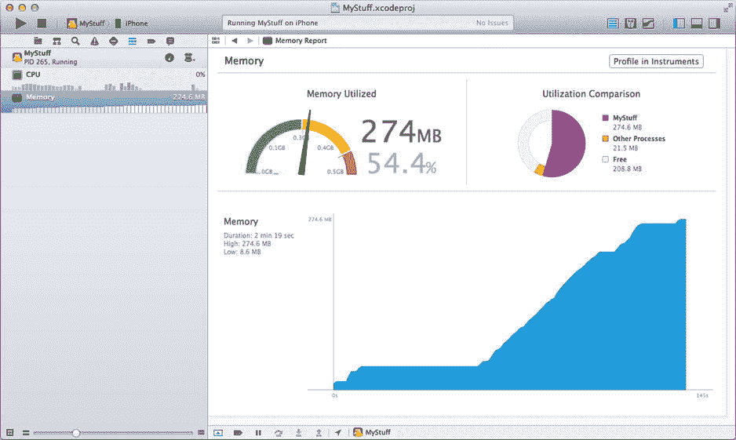

**图 23-9.** Xcode 的 CPU 和内存监视器

你添加的压力测试代码将会生成 1,000 个测试项目。开始滚动列表。当每个表格行显示新的 `MyWhatsit` 项目时，它会请求该项目的图片。这进而会从文档中加载一个新的 `UIImage` 对象，并将其保存在对象的 `image` 属性中。

在滚动过程中，你会注意到应用的内存使用量开始攀升，如图 23-9 所示。继续滚动，应用最终会耗尽内存。你将“收获”一个致命的应用崩溃，并伴随如图 23-10 所示的消息。

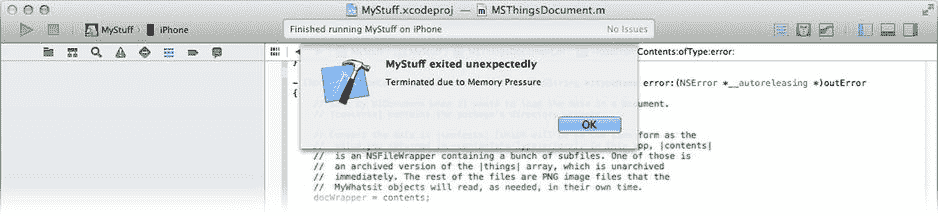

**图 23-10.** 内存压力导致失败

Xcode 解释道，你的应用“因内存压力而终止”，这实际上是说它用尽了所有可用内存，然后悲惨地死掉了。这太可怕了。你绝对不希望用户遇到这种情况。

Xcode 中的 CPU 和内存监视器非常适合对应用使用这些宝贵资源的情况进行抽查，但当出现大问题时，你通常需要更多细节。让我们再次转向 Instruments。


### 内存分析工具

Allocations 工具是面向 Objective-C 程序员的优选内存测量工具。该工具会追踪 Objective-C 对象的创建与销毁——每一个对象都逃不过它的法眼。它在排查各类问题时都很有用，但今天你只需用它来测量应用使用的总内存量、统计分配的图片对象数量，并观察内存警告。

对你的应用进行性能分析。当 Instruments 显示模板选择器时，选择 Allocations 模板，如图 23-11 所示。

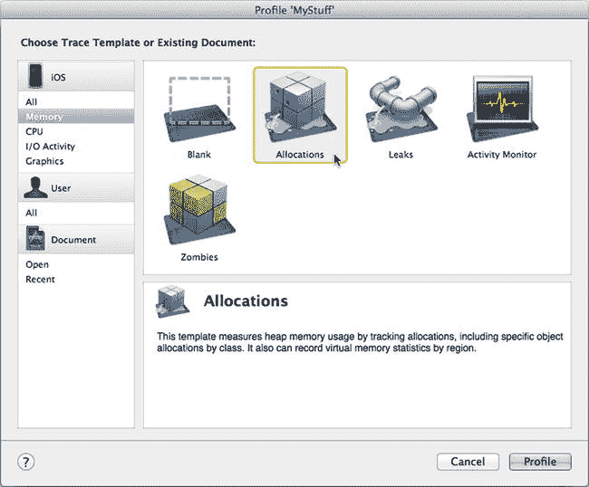

图 23-11. Allocations 模板

`MyStuff` 开始运行，Allocations 工具开始收集数据。在顶部，你会看到所有内存分配的图表。（通过勾选不同分类中的项目，你可以自定义要绘制的分配数据集。）开始滚动浏览 `MyStuff` 应用中的项目列表。正如你在第 5 章中回忆的那样，表格单元格视图对象是懒加载的。当你滚动时，每个即将显示的项目的图片都会从文档中懒加载。每次发生这种情况，就会创建一个新的 `UIImage` 对象。你可以看到它对整体内存使用产生的影响，如图 23-12 所示。

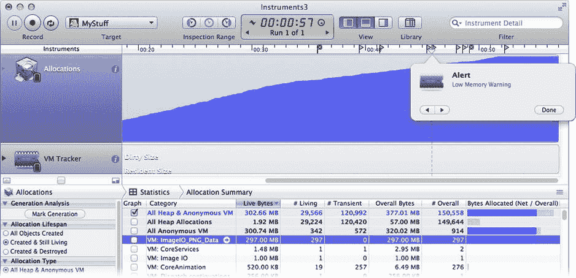

图 23-12. 包含 1000 个项目的 MyStuff 的基线内存使用情况

如果你继续滚动表格，内存使用量会一直上升、上升、再上升……然后，砰！应用崩溃了。

> **注意：** 你的应用可能在滚动 300 个项目后不会崩溃，甚至 600 个项目也不会。苹果不断制造内存更大的新款 iOS 设备，所以当你读到本文时，最新的 iOS 设备即使在加载了 1000 张图片后可能也不会耗尽内存。这就是为什么你需要尽可能多地在不同硬件配置（CPU/内存组合）上测试你的应用。一个在最新一代硬件上能跑好几天的应用，在几年前的旧设备上可能连 5 分钟都撑不住。

你会注意到时间线上有一组标记。点击其中一个，如图 23-12 所示，它会显示一个低内存警告已发送给你的应用——实际上，发送了多次。iOS 试图警告你的应用程序内存即将耗尽。你的应用忽略了这些警告，继续加载图片，最终自食其果。你也可能会在时间线上看到黑色标记（带 X 的）。这些标记表示 iOS 终止了另一个正在运行的应用，以便为你的应用提供更多内存。这凸显了糟糕的内存管理不仅会影响你自己的应用，还会影响其他应用。

如果按每种分配类型占用的内存量对列表进行排序，你会看到最大的消耗者是 `VM: ImageIO_PNG_Data` 分配，如图 23-13 所示。如果你向下滚动对象/分配类型列表，还会找到列出的 `UIImage` 对象。如果过滤列表，会更轻松地找到这些对象；图 23-13 中使用了关键词“image”来排除许多不相关的类别。

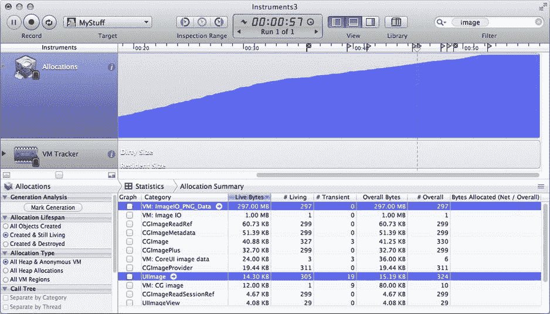

图 23-13. 基线压力测试中的 UIImage 分配

在此示例中，应用在创建了 324 个 `UIImage` 对象后崩溃，其中 305 个仍然存在并占用内存。因此，我们了解到，在这款特定型号的 iPhone 上运行的 `MyStuff`，一次最多可以将约 300 张图片加载到内存中。但列表中有 1000 张图片！你能对此做些什么呢？

> **注意：** 仅通过查看 Allocations 工具中的这一行，你无法判断 `UIImage` 对象总共消耗了多少内存。`UIImage` 的内存大小仅是该对象本身占用的内存；它不包括 `UIImage` 引用的其他对象或内存分配所占用的任何内存。图片数据的主体部分是在单独的 `ImageIO_PNG_Data` 分配中分配的，这些分配会出现在列表的其他位置。对于集合对象（如 `NSArray`）也是如此。

### 重视警告

事实证明，这个问题也很容易解决。你的 `MyWhatsit` 对象有两个图片引用：文档中压缩图片数据的 ID（`NSString`）和内存中的工作图片对象（`UIImage`）。图片对象可以随时根据文档中的数据轻松重建。

如果你的应用内存不足，它应该做的第一件事就是丢弃所有可以轻松重建的对象。你的视图控制器对象已经在这样做了。当内存开始不足时，每个 `NSViewController` 对象都会收到一个 `-didReceiveMemoryWarning` 消息。（自定义视图控制器类模板包含了这些方法的存根，所以我知道你见过它们。）如果视图控制器已加载其视图对象，但并未显示——它曾被展示过但随后被关闭——它会销毁其所有视图对象。¹ 它的视图对象可以从其 Interface Builder 文件轻松重建，以备再次展示。

`MyStuff` 的解决方案是让每个 `MyWhatsit` 对象都观察这些低内存警告。当收到一个警告时，它可以丢弃其 `UIImage` 对象，因为它知道可以使用其 `imageKey` 属性从文档中重新加载。

选择 `MyWhatsit.h` 文件。在 `@interface` 部分添加这个新方法原型：

```
- (void)memoryWarning;
```

切换到 `MyWhatsit.m` 实现文件并添加新方法：

```
- (void)memoryWarning

{

    if (imageKey!=nil && image!=nil)

        image = nil;

}
```

这个方法很简单。如果对象有图片（`image!=nil`）并且有一个可以用于从文档重新加载该图片的键（`imageKey!=nil`），那么它就会丢弃其图片对象（`image=nil`）。下一次请求其图片（`-image`）时，会从文档创建一个新的 `image`。

现在的问题是：谁将向 `MyWhatsit` 对象发送这条 `-memoryWarning` 消息？这听起来像是文档对象的任务。选择 `MSThingsDocument.m` 实现文件。在私有接口部分，为新的 `-memoryWarning:` 方法添加一个原型（新增代码以粗体显示）：

```
@interface MSThingsDocument ()

{

    NSFileWrapper   *docWrapper;

    NSMutableArray  *things;

}

- (void)whatsitDidChange:(NSNotification*)notification;

- (void)memoryWarning:(NSNotification*)notification;

@end
```

找到 `+documentAtURL:` 类方法，并找到注册以观察 `kWhatsitDidChangeNotification` 通知的代码。紧接着，再添加另一个注册代码：

```
[notificationCenter addObserver:document

                       selector:@selector(memoryWarning:)

                           name:UIApplicationDidReceiveMemoryWarningNotification

                         object:nil];
```

最后，添加新的 `-memoryWarning:` 通知处理程序：

```
- (void)memoryWarning:(NSNotification*)notification

{

    [things makeObjectsPerformSelector:@selector(memoryWarning)];

}
```

`-memoryWarning:` 方法会观察 iOS 发出的应用程序内存不足的通知。然后它会向每个 `MyWhatsit` 对象发送一条 `-memoryWarning` 消息，让每个对象都有机会释放一些内存。

> **警告：** 在 Objective-C 方法签名中，冒号是至关重要的。签名 `-memoryWarning`（不带冒号）和 `-memoryWarning:`（带冒号）是两种不同的方法，但很容易混淆。


# 压力测试，第 2 轮

再次对`MyStuff`进行性能分析。这一次，你并没有保存并关闭上一次性能分析中的跟踪文档。以这种方式操作时，Instruments 会复用已打开的跟踪文档，而本次运行收集的数据会累积到同一份文档中。你会在工具栏的运行状态中看到类似“Run 2 of 2”的消息，如图 23-14 所示。这是比较应用多次测量结果的另一种技巧：将多次运行收集到同一个跟踪文档中，然后通过运行状态中的箭头，或者通过“视图”菜单中的“运行浏览器”窗口，来回切换查看它们，从而对比并分析你的优化进展。

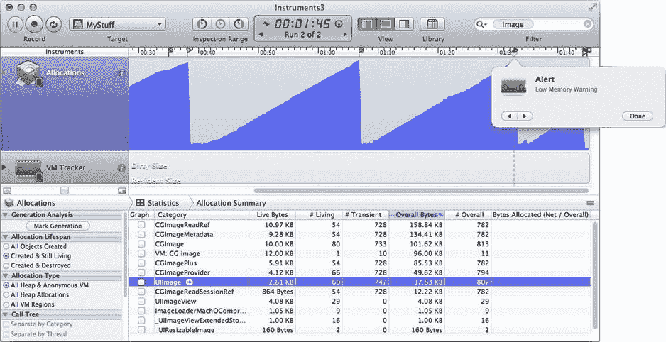

图 23-14. 成功对`MyStuff`进行压力测试

你执行了和上次相同的操作；当`MyStuff`开始运行时，你开始向下滚动列表，强制表格视图加载每个项目的图片。如图 23-14 所示，内存消耗开始上升，情况和之前一样。

最终，你的应用开始耗尽内存，并收到低内存警告（时间线上的标记）。这次，应用通过释放所有`UIImage`对象来响应警告，从而大幅降低了内存使用。当你继续滚动时，新行被绘制出来，导致它加载新的图片对象，然后循环重复。但这次不会重复的是崩溃。这一次，你可以成功滚动到包含 1000 行的表格最底部，而没有任何意外。

如果你查看图 23-11 中`UIImage`对象的数量，可以看到总共创建了 807 个对象，其中 747 个已被销毁，60 个仍保留在内存中。如果你继续滚动，存活对象数量会再次攀升，直到下一次内存警告将它们销毁。`MyStuff`现在能正确响应内存警告了。

## Allocations 工具

Allocations 工具对于 Objective-C 程序员来说是一个隐藏的宝石。本章中，你只是以相当基础的方式使用了它，但它可以追踪各种内存管理问题。

Allocations 工具会追踪每一次对象的分配和销毁，记录是什么例程创建了它，以及是什么例程负责销毁它。在非 ARC 应用中，它还会记录发送给对象的每一个`-retain`、`-release`和`-autorelease`消息（以及发送者），这对于发现 retain/release 不匹配的问题非常有价值。

“对象摘要”按类列出了所有曾被分配过的对象。你可以使用左侧的选项进行过滤，只查看仍然存在的对象，或者仅查看已被销毁的对象。

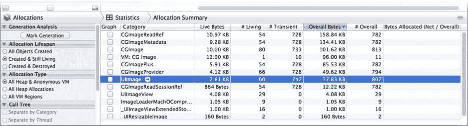

如果你点击某个类右侧的聚焦按钮（箭头），列表会展开，列出应用中该对象的每一个实例，包括当前和过去的。每一行记录了对象创建的时间及其内存地址。如果你的应用同时在 Xcode 的调试器中暂停，你可以使用对象的内存地址在 Instruments 中找到其历史记录，反之亦然。

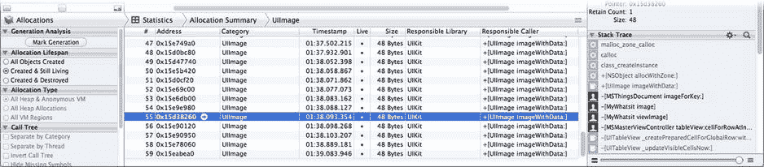

右侧的扩展详情面板（视图 ➤ 扩展详情）会显示对象创建时的堆栈跟踪。这就是你应用中创建此对象的代码路径。“存活”列指示该对象是否仍然存在。这就是你如何找到正在泄露的对象的方法——它们本应被销毁却没有，这可能是由于循环引用导致的。

点击某个特定实例旁的聚焦按钮，列表会显示该对象的完整历史记录。

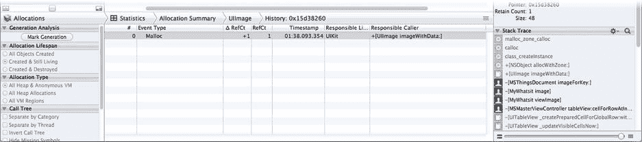

在 ARC 应用中，这可能会相当乏味，但仍然可以用来识别负责销毁对象的代码。在非 ARC 应用中，此跟踪可以包括所有发送了`-retain`、`-release`和`-autorelease`消息的地方。通过反向追溯，你可以识别出那些应该发送`-retain`却没有发送的代码，或者发现那些不应该发送`-release`却发送了的代码。

你已经解决了`MyStuff`中的两个显著性能问题。在这个过程中，你学到了一些关于 Instruments 的知识，以及如何衡量代码性能和 Objective-C 内存使用。但这只是 Instruments 功能的冰山一角。我建议你从阅读 Instruments 用户指南开始，你可以在 Xcode 的“文档和 API 参考”窗口中找到它。本指南是为 iOS 和 OS X 开发者编写的，因此有些主题可能不适用。

## 总结

性能分析与优化是 iOS 开发中的一个重要阶段。请尽可能在多种硬件配置上测试你的应用，以确保它在各种条件下以及面对压力情况时都能表现良好。这是确保你的应用不仅能运行，而且能始终运行良好的唯一方法。

如果你在本章中其他什么都没学到，我希望你学会了什么时候不应该优化代码。最佳地利用你的时间和才能，与其他开发技能同样重要。但我相信你一定还学到了其他东西。你学会了如何启动 Instruments 来分析你的应用性能。你能找到代码中的热点，并追踪其内存使用情况。这些工具揭示了应用中你可能未曾意识到的行为，并帮助你将编码工作聚焦在正确的方向上。

但是，`MyStuff` 还没有完成！我曾向你承诺过第二种延迟工作的方法，以使图片选择器的响应更加灵敏。这需要一些你尚未掌握的技巧。既然这是最后一章，我不能再推迟了。

脚注 1

这就是为什么你不希望视图对象的出口是`strong`引用的原因。


# 24. 加倍美好

## 摘要

这是本书的最后一章，也是我想在书中涵盖的最后一个主题。你的应用基本已经完成了。本地化和性能优化通常是你最后处理的细节。下一步是将其上传到 App Store（请参阅“向 App Store 提交应用”侧边栏），并开始构思你的下一个项目。

但我还不能就这样放你走。你的某个应用中还存在一个 bug，你还有一些性能问题，而这些问题都围绕着并发这一主题。并发是指两段或更多段代码序列（称为线程）同时执行。这能让你的 iOS 设备真正地同时处理多件事。但同时它也极大地复杂了你作为程序员的工作。在本章中，你将学习：

*   多任务处理的基础知识
*   在另一个线程上执行代码块
*   使用互斥锁来同步多个线程
*   探索线程安全性
*   拥抱主线程

并发编程，或者说多线程，让人联想到围棋，常被描述为“学一分钟，精通一辈子”。其基本原则很简单，但它会为你的应用增加一种通常难以理解的复杂性。即使为你的应用添加少量的多任务处理，也会对你的设计产生广泛影响，引入微妙的 bug，使你的代码难以测试，并可能创造出让你的应用戛然而止的条件。

那么为什么要这样做呢？我们使用多任务处理，是因为没有它就无法编写现代应用。正是它让你的应用在加载网页、更新用户位置、播放音乐、同步文档、动画化视图以及执行更多操作的同时，依然保持“活跃”。iOS 试图让你的应用免受多任务处理机制的影响，但有时你不得不处理它，而如果不能利用其强大功能，那将是一种遗憾。

## 向 App Store 提交应用

在本书中，你已经体验了 iOS 应用开发的每个主要阶段，除了一个：将你完成的应用发布到苹果的 App Store。鉴于你目前已取得的成就，提交应用的剩余步骤几乎微不足道：

*   在 iOS Dev Center 注册你应用的唯一 ID。你在第 14 章为 SunTouch 做过一次，又在第 18 章为 Pigeon 做过一次。
*   登录 iTunes Connect 并创建一个应用，就像你在第 14 章为 SunTouch 所做的那样。你需要提供将出现在 App Store 上的插图、屏幕截图、联系信息和其他材料。
*   仍在 iTunes Connect 中，点击 `Prepare for Upload` 按钮并回答任何剩余问题。你需要同意一些法律条款。你还需确保你的在线应用已启用其所需的服务，例如 Game Center 和 iCloud。
*   回到 Xcode，选择 `iOS Device`（或任何真实的 iOS 设备）作为你的运行目标。
*   选择 `Product ➤ Archive` 来构建你的应用并将其打包成分发归档文件。
*   在 Organizer 窗口中，选择你刚刚创建的归档文件并点击 `Validate...` 按钮。这将对你的应用进行预检，确保它已准备好提交。处理任何报告的问题。
*   当你准备就绪时，在 Organizer 窗口中选择归档文件并点击 `Distribute...` 按钮。选择 `Submit to iOS App Store` 选项并按照说明操作。

苹果将审核你的应用。如果被接受，它将出现在 App Store 中！如果你有任何问题或疑问，请查阅 iTunes Connect 指南或联系开发者服务（使用 iTunes Connect 门户中的 `Contact Us` 按钮）。

## 并发编程

线程是一段每次执行一条语句的计算机代码序列。这通常是我们所认为的“计算机程序”，并且正是你在本书中迄今为止所编写的内容。大多数时候，你的设计和编码完全专注于应用的主线程。实际上，“你的应用”这个术语几乎与在主线程上执行的代码同义。

在多线程环境中，可以有多个线程并发执行。我在本书中偶尔提到过后台线程和异步方法。你的应用甚至通过委托方法与它们通信。但在大多数情况下，这些活动是“幕后”发生的。老实说，这正应该是其应有状态。当设计得当并正确实现时，多任务处理能增强你应用的能力，而不会使其复杂化。

然而，有时这些复杂性会侵入你的代码。从好处方面看，多任务处理是一个强大的工具，你没有理由不在你的应用中使用它。为此，你需要学习一些基本概念，然后准备将你的思维扩展到第四维度。

### 线程

一个线程执行单个计算机代码序列。多任务处理或多线程是一种同时执行两个或更多线程的机制。线程具有状态。真正有趣的状态是运行和休眠。当一个线程正在运行时，它正在执行其代码。当它休眠时，它什么也不做。

在小型微处理器中，中央处理单元（CPU）一次只能执行一个操作。因此，严格来说，任何时候只有一个线程在真正执行。CPU 会定期（每秒几百次）停止执行当前线程，保存其所有信息，然后开始执行另一个不同的线程。这称为任务切换。它在不同线程之间切换得如此之快，以至于给人一种所有线程都在同时运行的错觉。两个线程可以被描述为并发运行，但并非同时运行。

许多较新的微处理器具有多个核心。这些设备在单个芯片上包含两个（或更多）完整 CPU 的硬件。在这种环境中，两个线程可以真正地同时执行，每个 CPU 运行不同的程序。两个 CPU 都执行与单核处理器相同的任务切换，因此所有线程看起来仍然在同时运行，但 CPU 完成了两倍的工作。在撰写本文时，多核 CPU 才刚刚开始出现在 iOS 设备这样的小型便携式计算系统中。当你读到这篇文章时，多核 CPU 可能已成为常态。


### 同步

让 CPU 同时执行两个、三个甚至二十个不同的线程听起来确实很美妙。想想你的应用能完成多少工作！问题在于如何协调这些工作，避免冲突。如果你是世界上唯一拥有汽车的人，就不需要车道、红绿灯或环岛。道路上只要再多一个司机，你们最好就得协商好谁先通过路口。而这正是你的应用即将面临的混乱局面。以这段简单的代码片段为例：

```
if (singleton==nil)
    singleton = [[MySingle alloc] init];
```

你已经在很多地方写过类似的代码。只要同一时间只有一个线程在执行这段代码，它就能很好地工作。现在考虑一下，如果两个线程同时执行这段代码会发生什么：

- 线程 A 会检查 `singleton`，发现它为 `nil`。
- 线程 B 会检查 `singleton`，发现它为 `nil`。
- 线程 A 会分配并初始化一个新的 `MySingle` 对象。
- 线程 B 会分配并初始化第二个 `MySingle` 对象。
- 线程 A 会将其 `MySingle` 对象存入 `singleton`。
- 线程 B 会用它的 `MySingle` 实例覆盖线程 A 刚创建的对象。

结果是创建了两个 `MySingle` 对象，线程使用了不同的对象，其中一个对象的引用丢失了——这简直一团糟。

为了控制这种混乱局面，程序员使用多种手段来协调线程。主要的手段是互斥信号量，简称互斥锁。它授予一个线程对某个资源的访问权，并强制所有其他线程等待。以下是一个使用示例：

```
@synchronized (self)
{
    if (singleton==nil)
        singleton = [[MySingle alloc] init];
}
```

Objective-C 的 `@synchronized` 指令通过互斥锁保护一段代码块。该互斥锁用于确保同一时间只有一个线程能执行该代码块。其工作原理如下：

- 线程 A 锁定互斥锁。这是第一个请求，因此线程 A 成功。
- 线程 B 尝试锁定互斥锁。互斥锁已被锁定，因此线程 B 的请求被拒绝。线程 B 进入休眠状态——它停止执行。
- 线程 A 检查 `singleton` 变量，发现其为 `nil`，创建一个新的 `MySingle` 对象，并将其存入 `singleton`。
- 线程 A 解锁互斥锁。
- 解锁互斥锁会唤醒线程 B，它再次尝试锁定互斥锁。现在只有它一个线程请求，因此锁定成功。
- 线程 B 检查 `singleton`，发现对象已创建。
- 线程 B 解锁互斥锁。

即使有一百个不同的线程同时尝试执行这段代码，它仍然会完全按照你的预期运行。互斥锁阻止任何其他线程运行这段代码，直到当前执行的线程完成。这段代码现在被称为原子性操作。原子一词源自希腊语 *atomos*，意为“不可分割的”。该代码块执行的动作不能被分解或中断。

iOS 提供了一系列对象和函数来帮助协调和同步线程活动。高效的并发编程很大程度上取决于如何、何时以及何时不使用这些工具。在介绍这些工具之前，我们先来谈谈如何在多个线程中运行你的代码。

## 运行多个线程

在本书中，每当你发送异步消息时，你已经在间接地让代码在独立线程中运行了。`UIWebView` 类的 `-loadRequest:` 方法会创建第二个执行线程，在后台加载网页内容。

安排你自己编写的代码在不同线程中运行也相当简单。你只需指定要执行的代码，并请求 Grand Central Dispatch（GCD）来运行它。对于 Objective-C 程序员来说，GCD 的接口是操作队列。一个操作队列（`NSOperationQueue`）对象管理着一个操作（`NSOperation`）对象数组，每个操作封装了一个可执行的任务。你可以创建自己的 `NSOperation` 自定义子类，也可以使用配置好用于执行特定方法或代码块的具体子类。

**注意**：`NSThread` 对象代表单个执行线程，但你很少直接处理线程对象。Grand Central Dispatch 会自动创建、调度和终止你的操作对象将运行的线程。

在上一章中，我提到还有另一种推迟工作的方法，可以改进 `-imagePickerController:didFinishPickingMediaWithInfo:` 方法的响应性。在本章中，你将安排图像压缩（`UIImagePNGRepresentation`）在独立的线程上执行。这将推迟图像压缩的工作，让你的主线程能更快地响应用户的触摸事件。

### 创建操作队列

第一步是创建一个操作队列。这个队列需要能被所有 `MyWhatsit` 对象访问，它们将用它来调度工作，因此将其设为 `MSThingsDocument` 类的属性。从第 23 章的 MyStuff 最终版本开始。你可以在 `Learn iOS Development Projects` ➤ `Ch 23` ➤ `MyStuff-2` 文件夹中找到它。选择 `MSThingsDocument.h`，并在 `@interface` 部分添加以下属性：

```
@property (readonly) NSOperationQueue* editOperations;
```

现在你需要实现这个属性。切换到 `MSThingsDocument.m` 实现文件，并在私有 `@interface` 部分添加一个实例变量（新代码以粗体显示）：

```
@interface MSThingsDocument ()
{
    NSFileWrapper       *docWrapper;
    NSMutableArray      *things;
    NSOperationQueue    *editOpQueue;
}
```

通过在 `@implementation` 部分添加以下方法来为属性创建惰性初始化的 getter 方法：

```
- (NSOperationQueue*)editOperations
{
    if (editOpQueue==nil)
        editOpQueue = [[NSOperationQueue alloc] init];
    return editOpQueue;
}
```

你的文档对象现在提供了一个操作队列，供任何想要异步调度文档变更（编辑）的代码使用。


### 添加操作

你需要在 `MyWhatsit` 对象中使用新添加的操作队列。选择 `MyWhatsit.m` 实现文件，找到 `-setImage:` 方法，并按如下所示进行编辑（新增代码以粗体显示）：

```
- (void)setImage:(UIImage *)newImage
{
    [_document.editOperations addOperationWithBlock:^{
        imageKey = [_document setImage:newImage existingKey:imageKey];
        }];
    image = newImage;
}
```

当用户为某个项目选择了新图片时，`-imagePickerController:didFinishPickingMediaWithInfo:` 方法最终会向 `MyWhatsit` 对象发送一条 `-setImage:` 消息。以前，该方法会在返回之前压缩图片并将其存储在文档对象中（使用 `-setImage:existingKey:`）。

现在，将图片数据存储在文档中的代码只是被安排稍后执行。`-setImage:` 方法已经变成了异步方法。它会立即返回，而实质性的工作则在后台线程中完成。

`-addOperationWithBlock:` 消息是一个便捷方法，它创建一个 `NSBlockOperation` 对象（一个执行代码块的操作对象），并将其添加到操作队列中。要添加其他类型的操作，你需要首先创建 `NSOperation` 的自定义子类，或实例化它的具体子类之一（`NSBlockOperation` 或 `NSInvocationOperation`），然后将其添加到队列中。`NSOperation` 类的文档详细介绍了如何对其进行子类化。

操作队列的可配置项非常少。在大多数情况下，你只需将操作对象添加到队列中，然后就不必再管它了。GCD 会管理所有细节，包括创建操作将要执行的线程（有时称为“生成线程”）。它还会管理并发运行的操作数量，以便在完成最多工作的同时，不会拖累应用程序的主线程，这种技术称为负载均衡。你还可以在两个或多个操作之间创建依赖关系。操作队列会确保某个操作所依赖的操作先被执行，然后再运行该操作本身。

### 测量效果

再次使用时间分析器模板对 `MyStuff` 进行性能分析。和之前一样，添加几个新项目，并从你的照片库中选择图片。每选择一张照片，都会在时间分析图中产生一个 CPU 峰值，如图 24-1 所示。和之前一样，停止录制并隔离其中一个峰值。

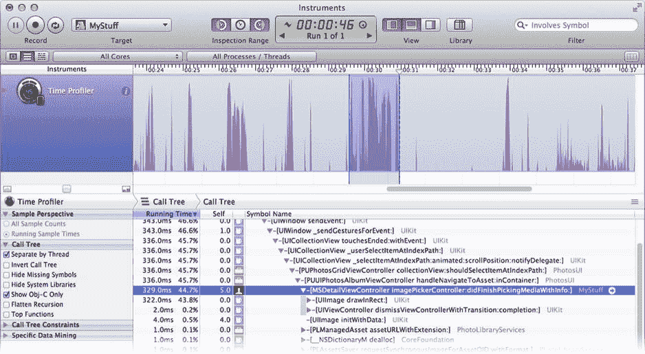

图 24-1. 多线程的时间分析图

展开调用树，直到找到 `-imagePickerController:didFinishPickingMediaWithInfo:` 方法，如图 24-1 所示。你可以看到，在该方法中花费的总时间仅为 329 毫秒。这还不到三分之一秒，相比上一章中耗时半秒的情况有了显著的改进。现在，对用户点击图片选择器的响应时间已完全符合我们的性能响应目标，并且几乎是刚开始时的三倍快。

如果你继续向下查看调用树列表，你会看到其他线程，如图 24-2 所示。深入分析这些线程，你会发现 `-[MSThingsDocument setImage:existingKey:]` 方法执行的位置（耗时 254 毫秒）。执行这段代码仍然需要时间和 CPU 资源，但由于它运行在自己的线程中，因此不会干扰应用程序的事件循环，这意味着你的应用程序能够保持响应。


图 24-2. `-setImage:existingKey:` 在另一个线程中运行

以下是发生的事情。`-addOperationWithBlock:` 消息创建了一个 `NSOperation` 对象，并将其配置为运行参数中传递的代码块。该操作对象被添加到文档的操作队列中。然后，Grand Central Dispatch 会决定开始执行该操作的最佳时间。计划的操作可能直到图片选择器方法完成后才会运行（这最有可能），也可能在图片选择器方法完成之前就完全运行完毕。关于线程执行时间，几乎没有太多保证，我稍后会解释。

**提示：** 查看异步方法执行顺序的一种方法是在你的方法中添加 `NSLog` 语句，并观察这些日志消息在 Xcode 控制台窗格中出现的顺序。消息会指示哪个线程记录了该消息。完成后别忘了移除 `NSLog` 语句。

## 执行顺序

你刚刚添加的并发操作也在文档处理中引入了一些错误。不仅有一个，而是两个，并且还有一个预先存在的错误。所有这些都与应用程序中运行的并发任务之间完全缺乏协调有关——就像那些没有红绿灯的汽车在行驶。

当你同时运行多个线程时，会极大地复杂化代码可能的执行顺序。考虑两个代码块，命名为 `A` 和 `B`。在多任务处理之前，只有一种可能的执行顺序，如图 24-3 所示。

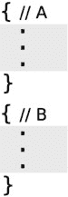

图 24-3. 单线程的执行顺序

如果 `A` 和 `B` 中的代码在单独的线程中运行，执行顺序可以是图 24-4 中所示的任何一种。

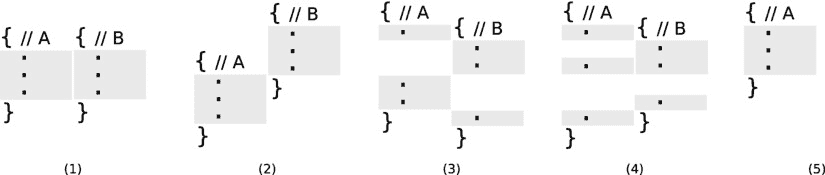

图 24-4. 两个线程可能的执行顺序

代码可以同时执行 (1)。`B` 代码可以在 `A` 代码甚至开始之前完全执行完毕 (2)，反之亦然。`A` 和 `B` 代码的一部分可以交替执行 (3)。`A` 和 `B` 代码的一部分可以交替执行，其他部分可以同时执行，而在其他时间两者都不执行 (4)。在极端情况下，`B` 代码可能根本不执行 (5)，或者至少在很长一段时间内不会开始执行。

**注意：** 如果 `A` 和 `B` 中的代码仅由三条原子语句组成，那么代码可能的执行顺序就有超过 30 种。现在考虑一下，有用的后台任务将有数百条非原子语句，并且可能有十几个其他线程与它们同时运行。当我思考所有可能的执行顺序时，脑海中浮现出“天文数字”这个词。

那么，如何在这场混乱中注入一些顺序呢？编写代码是可能的，使其行为理性和可预测，同时仍然获得并发执行的好处。这只需要一些仔细的计划和一些实践。

### 线程安全

线程安全的代码在从多个线程并发执行时，其行为是理性和可预测的。你引入 `MyStuff` 的第一个大错误是它的 `-setImage:existingKey:` 方法不是线程安全的。没有什么能阻止用户快速选择多张图片，这可能会向操作队列中添加多个操作对象。然后 GCD 可能会选择同时运行其中两个或更多操作，这意味着多个线程将同时执行 `-setImage:existingKey:` 方法。这将是一场灾难。

创建线程安全的代码有很多技术。以下是四大要点：

- 不要使用线程
- 不要共享数据
- 只共享不可变对象
- 使并发操作和修改原子化


### 别谈线程安全

创建线程安全代码的首选方案是不使用线程。正如你在“执行顺序”一节所见，单线程方案没有任何线程安全问题。它完全安全、完全可预测、易于编写且易于调试。

如果能够找到不使用线程的解决方案，那就用它。在本节中，你使用了定时器、委托方法、事件处理程序、通知和通知队列来分配工作并及时响应事件——所有这些都在主线程上完成。请继续这样做。只要你的代码都在主线程上执行，根据定义，就不会出现线程安全问题。

但并非所有事情都能在主线程上执行。最大的问题是执行时间过长的代码。这会占用主线程，破坏其响应能力，如果耗时过长，甚至可能完全杀死你的应用。对于这些问题，线程是唯一的解决方案。

剩下的技术都涉及数据共享问题，这正是所有线程安全问题的核心所在。

### 不共享就是关爱

规避线程安全问题的第二种方法是不共享相同的数据。几乎所有并发问题都是由多个线程同时试图修改相同的数据或对象引起的。你在本章前面的“同步”一节中已经看到了一个简单例子。简而言之，任何修改某些内容（设置变量、更改集合内容、修改属性等）且能被第二个线程访问到的代码，都不是线程安全的。

因此，编写线程安全代码的第二个解决方案是不共享任何数据。如果线程 A 中的数据只由线程 A 使用和修改，线程 B 中的数据只由线程 B 使用和修改，那么代码就隐式地是线程安全的。

iOS 应用本身就是这种安排的极端例子。你的 iOS 设备此刻正在运行多个不同的应用（假设它已开机）。每个应用都在自己的线程中运行。但每个应用也处于独立的进程中；一个进程是一座孤岛，无法访问任何其他进程中的任何数据或变量。应用之间不存在线程安全问题，因为它们没有共享数据。

当然，这也意味着线程无法通信（它们不共享任何数据），这并不实用。一种线程安全的解决方案是将数据移交到另一个线程，这样线程永远不会同时使用同一个对象。这就是 `UIWebView` 对象所使用的技术。具体过程如下：

- 主线程准备一个 `NSURLRequest` 对象。
- 主线程将 `NSURLRequest` 对象传递给 `-loadRequest:` 方法。
- `-loadRequest:` 方法复制 `NSURLRequest` 对象并启动一个后台线程。
- 后台线程使用其 URL 请求的副本发送网页请求，并将服务器响应收集到一个 `NSData` 对象中。
- 后台线程终止。
- 后台线程收集到的 `NSData` 被传递回主线程。

主线程和后台线程在任何时候都没有使用，甚至没有访问过相同的对象。后台线程使用的是在线程启动前复制的 `NSData` 对象的副本。主线程可以对其原始副本做任何操作；这不会影响后台线程使用的副本，反之亦然。

同样，`NSData` 对象在构造期间只能由后台线程访问。完成后，后台线程将该对象交给前台（主）线程，之后便不再触碰它。

这种简单、顺序的移交技术意味着后台线程和主线程都没有任何需要担心的线程安全问题。

### 答应我永不改变

有一类对象可以被多个线程安全地共享：不可变对象。不可变对象的属性永远不会改变，因此它们可以被任意数量的线程并发安全地使用和访问。

这包括字符串（`NSString`）、数字（`NSNumber`、`NSValue`）、集合（`NSArray`、`NSDictionary`、`NSSet`）和字节（`NSData`）的不可变基类。对于集合对象，不仅集合对象本身不可变，集合中的对象也必须不可变，这一点很重要。

> **提示**
> 严格来说，共享对象不必是不可变的；它们只是不能改变。一旦创建了对象，你可以将其视为不可变对象，并与另一个线程共享，只要后续代码不对其进行任何修改。这是一个你必须小心遵守的承诺。

### 原子时代

好了，如果你的代码无法在主线程上执行。你的解决方案是创建一个必须共享对象并发送消息以改变数据的第二个线程。在这种情况下，你需要使代码线程安全。这主要包括使你的方法和属性成为原子性的。原子性代码在其完整执行完成之前，不会被任何其他线程或进程中断或重新执行。

你可以选择多种工具，但大多数线程同步都是通过互斥信号量完成的。它非常流行，以至于有近十种不同的类型可供选择。对于 Objective‑C 程序员来说，最简单易用的是 `@synchronized` 指令和各种 `NSLock` 类。让我们从使用 `@synchronized` 使 `-setImage:existingKey:` 方法成为原子性开始。


# 创建原子方法 (Creating an Atomic Method)

选择 `MSThingsDocument.m` 文件并找到 `-setImage:existingKey:` 方法。将其重写如下（新代码或修改的代码以粗体显示）：

```
- (NSString*)setImage:(UIImage *)image existingKey:(NSString *)key
{
    NSString *newKey = nil;
    @synchronized (docWrapper)
    {
    if (key!=nil)
        {
        NSFileWrapper *imageWrapper = docWrapper.fileWrappers[key];
        if (imageWrapper!=nil)
            [docWrapper removeFileWrapper:imageWrapper];
        }
    if (image!=nil)
        {
        NSData *imageData = UIImagePNGRepresentation(image);
        newKey = [docWrapper addRegularFileWithContents:imageData
                                      preferredFilename:kImagePreferredName];
        }
    }
    [self updateChangeCount:UIDocumentChangeDone];
    return newKey;
}
```

你在修改 `docWrapper` 对象的代码块周围添加了一个互斥锁。这段代码现在是原子的；一次只能有一个线程执行它。每个改变该对象的原子代码块都应使其处于稳定状态，准备好接收下一条消息或更改。在这个特定案例中，所有添加、删除或替换文档中数据文件包装器的逻辑都不间断地完成了。当它完成后，下一个可能需要 `docWrapper` 对象的动作可以安全地进行。

`@synchronized` 指令易于使用，因为它为你创建了互斥对象。括号中的对象并不是互斥锁本身；该对象仅用于标识互斥锁，被称为令牌。为了使互斥锁正常工作，两个线程必须引用同一个互斥锁，因此选择你的令牌很重要。最常用的令牌是 `self`：

```
@synchronized (self)
{
    ...
}
```

这个互斥锁防止多个线程针对同一个对象执行这段代码。它还防止任何其他以类似方式保护的代码在同一个对象上同时执行。但它并不阻止两个线程针对不同对象执行这段代码。

你为令牌选择什么对象并不重要。重要的是令牌与正在被修改的数据相关；任何两个试图修改相同数据的线程必须引用相同的令牌。正因如此，我选择了 `docWrapper` 对象，因为那是正在被更改的共享对象。你不可能找到比这更相关的对象了。在这种情况下你也可以使用 `self`——效果也会是一样的。

# 创建原子属性 (Creating an Atomic Property)

我告诉过你，即使在它自己的线程中调度一丁点代码执行也会使你的工作复杂化。回到 `MyWhatsit.m` 文件。`-setImage:` 中的代码块看起来很简单，但它充满了复杂性：

```
imageKey = [_document setImage:newImage existingKey:imageKey];
```

将这段代码放入操作队列意味着它可能在任意时刻执行。这也意味着你先前假设的 `image` 和 `imageKey` 变量之间的关系已经消失，具体来说：

*   `imageKey` 变量可能在任意时刻被设置（由第二个线程）。多次引用 `imageKey` 变量的代码可能在第一次读取一个值，而第二次读取一个不同的值。
*   当 `-setImage:` 返回时，`imageKey` 变量可能已经被设置，也可能没有被设置。
*   在任何给定时刻，`imageKey` 变量不再保证是 `image` 变量的图像标签。

要修复 `MyWhatsit`，需要使 `imageKey` 变量成为原子变量。它被多个线程引用和修改，现在必须使其线程安全。从 `MyWhatsit.h` 文件开始，更改 `imageKey` 属性的声明（修改的代码以粗体显示）：

`@property ( atomic ) NSString *imageKey;`

切换到 `MyWhatsit.m` 文件。找到现有的 `-imageKey` getter 方法并添加一个原子的 setter 方法：

```
- (void)setImageKey:(NSString *)key
{
@synchronized (self)
{
imageKey = key;
}
}
```

现在，任何设置 `imageKey` 属性的代码都将以线程安全的方式执行。

> **注意**
> 
> 重写 getter 方法是不必要的。指针变量的单次加载是隐式线程安全的。CPU 总是在一次原子操作中传输整个字。换句话说，读取或设置单个标量值不能被另一个线程中断。

第一个需要重写的方法是 `-image` 方法。将方法修改如下（新代码以粗体显示）：

```
- (UIImage*)image
{
@synchronized (self)
{
if (image==nil && imageKey !=nil)
image = [_document imageForKey:imageKey];
}
return image;
}
```

这段代码现在是线程安全的，因为它在评估 `imageKey` 变量之前获取了对象上的锁。请记住 `imageKey` 可能随时改变，所以 `if` 语句中的 `valueKey` 有可能与传递给 `-imageForKey:` 的 `valueKey` 不同。互斥锁阻止了这种情况发生。任何试图在 `if` 和 `-imageForKey:` 消息之间设置 `imageKey` 属性（使用你刚刚编写的 setter）的代码都会停止并等待此方法完成。你是否开始明白这一切是如何协同工作的了？

最后，`-setImage:` 代码需要再次更改（新代码以粗体显示）：

```
- (void)setImage:(UIImage *)newImage
{
[_document.editOperations addOperationWithBlock:^{
self.imageKey = [_document setImage:newImage existingKey:imageKey];
}];
image = newImage;
}
```

唯一的改变是 `imageKey` 属性的设置方式。现在它通过线程安全的 setter 方法进行。当后台任务最终设置了 `imageKey` 属性时，它会与当前使用该值的任何其他线程协调该更改。

> **注意**
> 
> `-encodeWithCoder:`, `-copyWithZone:`, 和 `-memoryWarning` 方法不需要更改。它们都只获取一次 `imageKey` 的值，并且只获取一次，这使它们保持线程安全。如果代码被更改以至于不再如此，这些方法也需要被设为线程安全。

你只对 `imageKey` 属性的设置和使用进行了原子化。你没有更改 `MyWhatsit` 的任何其他属性。这是因为 `imageKey` 属性是唯一可能被另一个线程修改的值。如果你后来编写了从另一个线程设置 `name` 或 `location` 属性的代码，你需要重复此分析并采取措施使这些属性也成为线程安全的。


### 使非原子方法变为原子操作

这解决了两个 bug——让 `setImage:existingKey:` 和 `imageKey` 属性变为原子操作——但还有一个自你为 `MyStuff` 添加文档支持以来就一直存在的 bug。只有在文档对象自动保存的同一时刻你选择了某张图片时才会遇到它。这充分说明了并发 bug 可以多么隐蔽和难以发现。你可能对 `MyStuff` 进行了数天的测试，将其交付给客户，却从未遇到这个 bug。以下是你的排查方法。

在 `Xcode` 的控制下运行 `MyStuff`，反复从你的照片库中添加项目并为其选择图片。你添加项目越快、数量越多，`UIDocument` 在自动保存期间更新文件所需的时间就越长，你也越有可能遇到这个 bug。当 bug 发生时，它会出现在 `Xcode` 的控制台窗格中，如图 24-5 所示。

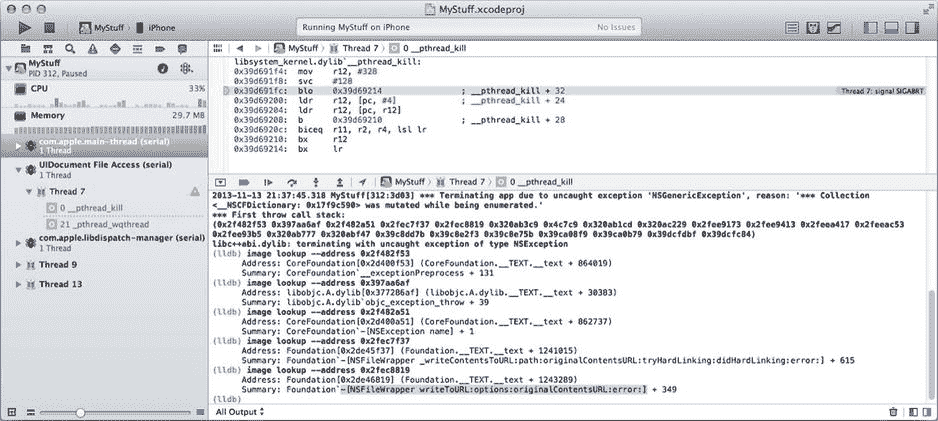

图 24-5. 一个并发 bug

这条消息是一个异常，是一种在出现问题时软件“中止”的方式。当你在 `Xcode` 的控制下运行应用时，异常会被捕获并记录到控制台。查看栈窗格，你可以发现异常是在线程 7 中捕获的，该线程标记为 `UIDocument File Access`。这是一个相当明确的线索，表明问题发生在文档尝试从文件系统读取或写入时。

异常的描述（“集合在被枚举时发生了改变”）告诉了你发生了什么，但没有说明原因。抛出异常的代码已不再运行，所以你无法查看栈视图。相反，你必须研究异常记录下来的堆栈跟踪。不幸的是，这只是一串数字。

这里我就不让你上网搜索了（`lldb.llvm.org`）。异常消息后面跟着一个列表，列出的是异常发生时栈上的返回代码地址。如果你知道这些地址指向哪些代码，你就能大致了解异常发生时程序在做什么。

控制台窗口中的 `(lldb)` 提示符是调试器的命令提示符。你可以直接输入命令将其发送给调试器。在这种情况下，`image lookup --address` 命令非常有用。它会尝试识别任何代码地址对应的方法/函数名。如果你将堆栈跟踪中的地址输入进去，就能迅速了解异常抛出时代码在执行什么操作，如图 24-5 所示。

从栈顶向上回溯，你很快就能发现负责的方法是 `writeContents: toURL:forSaveOperation:originalContentsURL:error:`。它写入 `docWrapper`（`NSFileWrapper`）对象时出现了问题，因为该对象在写入过程中被修改了。现在你知道问题出在哪里了，接下来要找出原因。显然，有其他代码在 `docWrapper` 被写入时修改了它。查看栈窗格，你找不到任何其他正在修改 `docWrapper` 的代码。很可能是修改它的代码已经执行完毕并退出了，因此在调试器中找不到它的踪迹。你需要仔细检查自己的代码，找出所有修改 `docWrapper` 的地方，并通过实验确定其中某处是否可能是问题所在。

很快你就锁定了一个嫌疑人；`setImage:existingKey:` 方法通过添加和删除常规文件包装器来更改（变换）`docWrapper`。与此同时，`UIDocument` 会定期自动保存文档，并在后台线程中将 `docWrapper` 写入持久存储。问题在于，集合对象（如 `docWrapper`）在被枚举时不能进行修改。你可能还记得第 20 章“集合”部分中这条晦涩的规则。

排除了其他可能性之后，你的方法就很明确了。你需要防止 `docWrapper` 在写入时被修改。这听起来像是要用互斥锁。但应该把它放在哪里呢？运行在后台线程上的方法属于 `UIDocument`。

解决方案是将 `UIDocument` 的方法包装在互斥锁中。选择 `MSThingsDocument.m` 实现文件，并添加以下方法：

```
- (BOOL)writeContents:(id)contents
                toURL:(NSURL *)url
     forSaveOperation:(UIDocumentSaveOperation)saveOperation
  originalContentsURL:(NSURL *)originalContentsURL
                error:(NSError *__autoreleasing *)outError
{
    @synchronized (docWrapper)
    {
    return [super writeContents:contents
                          toURL:url
               forSaveOperation:saveOperation
            originalContentsURL:originalContentsURL
                          error:outError];
    }
}
```

此方法覆盖了 `UIDocument` 的 `writeContents:toURL:forSaveOperation:originalContentURL:error:` 方法，并防止在其他线程正在修改 `docWrapper`（具体来说是 `setImage:existingKey:`）时运行它。一旦开始运行，它会阻止任何其他线程修改 `docWrapper`，直到 `writeContents:...` 方法完成。

正如你所见，编写线程安全代码并非总是显而易见。它需要相当程度的规划、测试和分析。这也是为什么首要规则仍然是最好的：尽可能避免它。

现在，我将简要介绍一些其他可用的并发工具来结束本章。

## 并发工具概览

以下是一些零散的建议、概念和工具，将帮助你开始使用多任务处理，并希望能让你远离麻烦。

### 线程安全概览

即使是让对象的单个属性（如 `MyWhatsit` 的图片属性）变得线程安全，通常也是一项复杂的任务。因此，大多数类和属性都不是线程安全的。请再读一遍这句话。那些线程安全的类或特定方法通常会有文档说明。如果你想要一个列表，可以在 `Xcode` 的“文档和 API 参考”窗口中查找“线程安全摘要”。它列出了所有线程安全的 Cocoa 类；这个列表并不长。

特别需要注意的是，UI 类并非线程安全。它们不仅不是线程安全的，唯一可以使用它们的线程是主线程。换句话说，你绝不能从主线程以外的任何线程对用户界面对象做任何操作——甚至包括告知 `UIView` 对象它需要重绘。极少数的例外之一是离屏绘制。你可以在后台线程中创建一个离屏绘制上下文（`UIGraphicsBeginImageContext`）并进行绘制。具有讽刺意味的是，生成的 `UIImage` 对象并不是线程安全的，并且在使用之前必须传递回主线程。

> **警告**
> 不要试图从主线程以外的任何线程向 UI 类发送任何消息。

要以线程安全的方式使用任何非线程安全的对象、消息或属性，你需要提供自己的线程同步和原子性保证。


### 向主线程发送消息

之前我描述了 `UIWebView` 如何“将对象传递到主线程”。有几种方法可以在特定线程上发送消息或执行代码块。所涉及的线程必须正在运行一个事件循环。这排除了你的操作对象使用的任何线程，但它确实包括主线程，而这个技巧在主线程上最为有用。

当代码在主线程上运行时，许多线程安全问题都会消失。如果你能安排一个方法或代码块在那里执行，就可以避免大量问题。毫不意外，这是通过主线程的运行循环实现的。消息被添加到事件队列中，并依次执行。两种最常用的技术是：

- 向任何对象发送 `-performSelectorOnMainThread:withObject:waitUntilDone:` 消息。它会安排该对象接收 Objective‑C 消息（带有可选的 `object` 参数）。该消息由主线程的运行循环分发给对象。如果 `waitUntilDone` 为 `YES`，发送线程将休眠，直到主线程执行完该消息。
- `+[NSOperationQueue mainQueue]` 对象是一个特殊的操作队列，它会在主线程上运行其操作。如果你需要让一个代码块或比单条消息更复杂的内容在主线程上运行，请将其转换为操作对象并添加到该队列中。

你已经知道不能从另一个线程发送任何 UI 对象消息。那么，你的波形分析线程如何在其完成计算后，告知其自定义的 `UIView` 对象重新绘制自身？方法如下：

```
[waveView performSelectorOnMainThread:@selector(setNeedsDisplay)
                           withObject:nil
                        waitUntilDone:NO];
```

类似地，后台任务的结果可以通过其运行循环传递到你的主线程，从而避免大量线程安全问题：

```
[[NSOperationQueue mainQueue] addOperationWithBlock:^{
    [xrayViewController addImage:image sequence:n forPatient:patientID];
}];
```

### 锁对象

你已经使用 `@synchronized` 指令创建了互斥对象，但有时自己创建互斥对象会更方便、高效且灵活。主力互斥类为 `NSLock`。以下是一个示例：

```
NSLock *lock = [[NSLock alloc] init];
...
[lock lock];
// 在此处理线程安全的代码
[lock unlock];
```

这与之前使用的 `@synchronized` 代码块等价，但速度稍快，因为你无需请求 Objective‑C 动态创建并跟踪互斥对象。

锁对象也更加灵活。`-tryLock` 和 `-lockBeforeDate:` 消息会尝试获取锁，如果未成功则返回 `NO`。你的代码可以不必被迫休眠，而是利用此信息，在锁当前被其他（可能是长时间运行的）任务锁定时去做其他事情。

**警告**

务必在锁定互斥对象的同一线程上对其解锁。你绝不能在某个线程上锁定互斥对象，然后在另一个线程上解锁。如果你想通知线程或等待线程，请使用 `NSCondition` 或 `NSConditionLock` 类。

有一些细微的风险需要避免。如果锁保护的代码可能抛出异常，或者你的方法需要返回一个值，必须采取措施确保在返回之前解锁。以下是使用 `@synchronized` 指令的原子方法：

```
- (BOOL)doItSafely
{
    @synchronized (self)
    {
        return [obj doSomething];
    }
}
```

以下是功能相同的方法，使用 `NSLock` 对象编写：

```
- (BOOL)doItSafely
{
    BOOL result;
    @try {
        [lock lock];
        result = [obj doSomething];
    }
    @finally {
        [lock unlock];
    }
    return result;
}
```

`@finally` 块会拦截 `-doSomething` 可能抛出的任何软件异常，并确保在退出方法前解锁 `NSLock`。如果 `lock` 未被解锁，下次收到 `-doItSafely` 消息时程序将卡死，这引出了使用互斥信号量的下一个风险。

### 死锁

当代码试图锁定一个永远无法解锁的互斥对象时，就会发生死锁。代码会停止执行——永远地停止。如果这发生在你的主线程上，你的应用就“挂”了。这种情况可能发生在同一线程内或不同线程之间，在后者情况下，它有一个更生动的术语：“致命拥抱”。

当大多数程序员第一次开始编写线程安全代码时，倾向于“锁定所有内容”。这导致了像这个实时订单处理系统一样的代码：

```
NSLock *lock = [[NSLock alloc] init];
...
- (NSUInteger)availableProduct:(int)productID
{
    NSUInteger count = 0;
    [lock lock];
    for ( Item *item in inventory )
        if (item.productID==productID)
            count++;
    [lock unlock];
    return count;
}

- (void)orderProduct:(int)productID count:(NSUInteger)count
{
    [lock lock];
    // 客户不能订购超过库存的数量
    if (count>[self availableProduct:productID])
        count = [self availableProduct:productID];
    if (count!=0)
        {
        // 创建商品并添加到订单中
        OrderItem *item = [[OrderItem alloc] init];
        item.productID = productID;
        item.count = count;
        item.taxExempt = NO;
        [order addObject:item];
        }
    [lock unlock];
}
```

第一次收到 `-orderProduct:count:` 消息会导致程序卡死。它将永远不会执行另一行代码。你能看出原因吗？

`-orderProduct:count:` 方法获取了 `lock`，然后向自身发送 `-availableProduct:` 消息。该方法尝试获取 `lock`。它无法获取，线程随即进入休眠状态等待 `lock` 被解锁，而这永远不会发生。

#### 递归锁

解决这类问题有两种方法。第一种是使用递归锁。将 `NSLock` 替换为 `NSRecursiveLock`，如下所示：

```
NSRecursiveLock *lock;
```

递归锁允许单个线程多次获取该锁。其他线程将该锁视为任何其他互斥对象。现在，`-orderProduct:count:` 和 `-availableProduct:` 都能（在同一线程内）获取互斥对象，执行其工作，并返回。你仍然需要平衡每个 `-lock` 消息与对应的 `-unlock` 消息，否则互斥对象将（对其他线程）永远保持锁定状态。

#### 多重锁

另一种解决方案是使用两个锁，如下所示：

```
NSLock *inventoryLock = [[NSLock alloc] init];
NSLock *orderLock = [[NSLock alloc] init];
...
- (NSUInteger)availableProduct:(int)productID
{
    NSUInteger count = 0;
    [inventoryLock lock];
    ...
    [inventoryLock unlock];
    return count;
}

- (void)orderProduct:(int)productID count:(NSUInteger)count
{
    [orderLock lock];
    if (count>[self availableProduct:productID])
        count = [self availableProduct:productID];
    ...
    [orderLock unlock];
}
```

同样地，`-orderProduct:count:` 运行顺畅。然而，这种技术很容易导致两个线程之间发生“致命拥抱”：

线程 A 锁定 `inventoryLock`
线程 B 锁定 `orderLock`
线程 A 尝试锁定 `orderLock`，失败，进入休眠。
线程 B 尝试锁定 `inventoryLock`，失败，进入休眠。

现在两个线程都被挂起，永远不会唤醒。如果你使用多个互斥对象来保护不同的数据对象，请尽量始终以相同的顺序锁定和解锁它们。


### 自旋锁

`Mutex` 对象虽然很棒，但（相对而言）速度较慢。如果一个 `mutex` 对象被锁定和解锁几次，这没什么大不了的。但如果你在代码中使用了 `mutex` 对象，且该代码被执行了数十万次，它就会损害应用的性能。当你在 Instruments 中运行“时间分析器”时，你会发现应用大量 CPU 时间都花在了锁定和解锁 `mutex` 上。

自旋锁是一种高性能的 `mutex`，它不会让失败的线程进入休眠。如果线程无法获取 `mutex`（因为另一个线程已经锁定了它），该线程就会“自旋”，等待 `mutex` 再次被解锁。自旋锁适用于保护满足以下条件的小段代码：

- 被调用成千上万次
- 执行速度非常快
- 与第二个线程竞争的可能性极低

“自旋”的过程会大量浪费 CPU 资源，但自旋锁在锁定和解锁未被其他线程锁定的 `mutex` 时速度极快，从而弥补了这一点。这些被称为乐观锁。

自旋锁是不透明的 C 变量，你需要使用 C 函数来锁定和解锁它们。除此之外，它们的用法与 `NSLock` 对象完全相同：

```
static OSSpinLock spinner;
...
OSSpinLockLock(&spinner);

// 在这里执行非常快速的代码

OSSpinLockUnlock(&spinner);
```

举个例子，iOS 的内存管理函数（即那些将内存块分配到堆并返回的函数）就使用了自旋锁。想想看：所有内存函数都必须是线程安全的，因为任何线程都可以创建和销毁对象。它们还必须极快，而且两个线程在同一瞬间分配对象对象的概率非常小。对于此类函数，自旋锁是完美的选择。

### 延伸阅读

当你准备好深入并发编程和线程安全领域时，可以从以下两个优秀的资料开始，它们都能在 Xcode 的“文档和 API 参考”窗口中找到：

- 首先阅读《并发编程指南》。这是你了解所有并发相关内容的路线图。它描述了异步应用设计、Grand Central Dispatch 以及如何使用操作队列。
- 《线程编程指南》对线程和线程同步进行了详尽讨论。在这里，你会找到所有底层工具（排他信号量、锁、自旋锁、信号、条件、原子操作函数和内存屏障）的描述，用于同步你的线程和数据。

## 总结

多线程无疑是一种高级的应用开发技术。掌握它，你就能创建出能处理大量工作，同时保持响应灵敏和流畅的应用。虽然我还不打算称你为并发编程大师，但你已经掌握了所有基础知识，并且知道去哪里获取更多信息。

从第 1 章开始，你已经学习了大量关于 iOS 应用开发的知识。这是一段激动人心的旅程，而且才刚刚开始。有了现在打下的基础，你可以探索本书中未涉及的许多技术，并对已涉及的技术进行更深入的研究。

希望你和我一样享受阅读本书的过程。发挥你的想象力，运用你所学到的知识，当你写出很棒的应用时，请务必通过邮件（`james@learniosappdev.com`）或推特（@LearniOSAppDev）告诉我。祝你好运！


# 学习 iOS 应用开发

## 索引

- A
- B
- C
- D
- E, F
- G
- H
- I, J
- K
- L
- M
- N
- O
- P, Q
- R
- S
- T
- U
- V
- W
- X, Y, Z

---

## A

### 访问器方法
### 辅助视图
### 临时分发
### 动画
- 添加形状
- 基于块的动画方法
- 核心动画编程指南
- 曲线属性
- 构建内容
- 核心动画
- 自建解决方案
- OpenGL
- 步骤
- 类型
### 应用程序音乐播放器
### 应用程序编程接口（API）
### 应用
- `CMMotionManager`
- 动态动画器（参见动态动画器）
- 框架定义
- 重力向量
- `NSTimer` 对象
- 推拉方法
- `updateAccelerometerTime:` 方法
- 更新过程
- `viewDidLoad:` 方法
### 水平仪（参见水平仪）
### 运动数据
- 设备运动与姿态
- 参考系
- 陀螺仪数据
- 磁力计数据
- 测量值
### 任意对象
### 归档序列化
- 优势与局限
- 定义
- `encodeWithCoder:` 方法
- 特性
- `initWithCoder:` 方法
- `@interface` 声明
- `MyWhatsit.m` 文件
- `NSCoding` 协议
- `NSKeyedUnarchiver`
- 解归档对象
### 原子时代
- 并发错误
- `docWrapper` 对象
- `imageKey` 属性
- `setImage:existingKey:` 方法
- `token` `UIDocument` 方法
- `writeContents:` 方法
### 属性字符串
- 构造
- 要点
- `UILabel`
### 自动属性
### 自动引用计数（ARC）
- Core Foundation
- 启用步骤
- 强引用与弱引用
- `weak` 限定符
### 自动保存文档模型

---

## B

### Bonjour
- 概述
- 文档

---

## C

### 类簇
### `CLLocationManager`
### 云存储
- 云监控特性
- `HPViewController`
- iCloud
- `NSUbiquitousKeyValueStore`
- 同步测试
### 代码重构
### 集合
- 集合类
- 集合枚举方法
- 快速对象枚举
### 并发
- 定义
### 并发编程（参见线程）
### 控制器，Interface Builder
- 手势识别器
- `moveShape:` 方法
- `SYShapeView` 对象
- `SYViewController`
- `loadShape:forViewController:` 方法
- 声明的占位符
- `SYShapeFactory` 类
- 用户界面组
- 替换 viewController 代码
- `SYShapeFactory` 工厂
- 输出口
- `RectangleShape.xib` 文件
- `SquareShape.xib` 文件
- `SYShapeView initWithShape:` 方法
- 属性
### 坐标与像素
- 数学精度
- 像素问题
- 像素完美对齐
- 影响
### 坐标系
### 自定义视图对象（参见动画；绘制简单形状；变换）
### 绘制的贝塞尔路径
- 核心图形上下文
- 填充和描边函数
- 基础绘画工具
- 图像
### 事件驱动程序练习
### 图形
- 混合模式
- 上下文栈
- 阴影、渐变和图案
- 文本
### 图像与位图
- 从绘图创建位图
- 图像创建
- 视图坐标系转换坐标值类型
- 框架与边界
- 图形坐标系
- 平移方法
- Z 顺序重叠形状
### 制作形状应用

---

## D

### 悬空指针错误
### 数据网络（参见网络）
### 死锁
- 定义
- 多锁
- 实时订单处理系统
- 递归锁
### 委托模式
### 设计模式与原则
### 文档
- `UIDocument`（参见 `UIDocument`）
### 绘制简单形状
- `-drawRect:` 方法
- 贝塞尔路径对象
- 未完成路径方法
- 形状应用设计
- 形状与颜色
- 重复
- getter 方法
- 多色形状
- 属性
- 三角函数
- 步骤
- 测试正方形操作方法
- 添加第一个按钮连接
- 形状视图测试正方形：`-addSubview:` 方法
- 以编程方式创建视图对象
- 指定初始化器
- 枚举
- init 方法
- `initWithFrame:` 方法
- `SYShapeView`
- Xcode
### 动态动画器
- 基本公式
- 行为
- 定义
- 创建
- 阻尼和频率属性
- 玩家
- `rotateDialView:` 方法

---

## E, F

### 封装
### 枚举方法
### 事件
- 高级事件处理
- 传递方法
- 直接传递
- 第一响应者
- 命中测试
- 事件驱动应用
- 事件处理
- 事件队列
- 高级与低级事件
### 魔法八号球应用
- 设计
- `EBViewController` 对象
- 第一响应者
- 处理摇晃事件
- 图像设置
- 导入应用图标
- 界面创建
- 在 iOS 设备上
- 项目创建
- 响应者链
- 测试
- `UIApplication` 对象
- 响应者链
- 运行循环
### 触控应用
- 自定义视图设计
- `drawRect:` 消息
- 处理触摸事件
- Interface Builder
- 项目创建
- 测试
- `UIEvent` 对象
- `updateTouches:` 方法

---

## G

### 支持 Game Center
- 成就
- 应用 ID 配置
- Game Center 按钮
- Game Center 配置
- 排行榜
- 窗口
- `GameKit` 要求
- iTunes Store
- App Store 连接
- 本地玩家
- 匹配
- 记录
- 排行榜分数
- 沙盒测试玩家创建
- 游戏画面
- 沙盒玩家
### 垃圾回收
### Getter 方法
### 全球定位系统（GPS）
- 地理编码
- 获取路线
- iOS 技术
- 位置数据
- `CLLocationManager`
- 设备要求
- `MKMapView` 对象
- 位置监控
- 移动与方向
- 非 GPS 设备
- 减少位置
- 区域监控
### 地图装饰
- 添加小弹跳标注
- 地图坐标系
- `MKMapView` 对象
- 覆盖子视图
### 鸽子创建设计
- `HPViewController`
- `#import` 语句
- 接口
- `Main_iPhone.storyboard` 文件
- Map Kit 声明
- 地图视图对象
- 解决自动布局问题
- 垃圾桶按钮
- 使用地图视图对象委托输出口
- 动态链接
- `HPViewController` 对象
- `MapKit.framework`
- `MPViewController` 对象
- `showsUserLocation` 属性
- 测试
- 跟踪模式
- `viewDidLoad` 方法
### Grand Central Dispatch（GCD）
### 组尾
### 组头

---

## H

### 热点
- 更改轨道缩放控制
- 检查范围控制
- 反向调用树选项
- `NSNotificationQueue`
- 合并
- 定义
- `NSPostASAP`
- `NSPostWhenIdle`
- `postDidChangeNotification` 方法
- 照片选择器处理代码
- `postDidChangeNotification` 方法
- `setImage:existingKey:` 方法
- 仅显示 Obj-C 选项
- 时间分析器模板
- 跟踪文档

---

## I, J

### iCloud
### 继承
### `Inherits NSCopying`
### `+initialize` 方法
### 实例方法
### 实例变量
### Instruments
- 热点（参见热点）
- 内存（参见内存）
- 性能优化
- 慢速点击修复
- `did-pick-image:` 方法
- instruments 照片库
- 方案编辑器
- 模板选择器 instrument
- 时间分析器 instrument
- 视图控制器
### 集成开发环境（IDE）
### Interface Builder
- 控制器
- 手势识别器
- `loadShape:forViewController:` 方法
- 声明的占位符
- 替换代码
- `SYShapeFactory`
- `SYShapeView` 文件
- 对任意对象进行操作
- 编译
- 连接
- 编辑属性
- 文件所有者
- 加载界面
- 对象图对象创建
- 占位符对象
- 根/顶层对象
- 发送操作消息
- `.xib` 文件
### 内省
- 类方法
- 协议

---

## K

### 键值观察（KVO）
- 更改属性
- 有缺陷的依赖
- `observeValueForKeyPath`

---

## L

### 学习 iOS 开发项目
### 水平仪
- 角度标签布局
- 连接
- 表盘和指针视图定位
- Interface Builder 布局
- `LRDialView`
- 上下文变换
- `drawRect:` 方法
- `viewDidLoad` 方法
- Xcode 项目创建
### 逻辑地址空间

---

## M

### 手动引用计数
- 自动释放对象基础
- 打破循环
- 循环保持问题
- 循环保持
- 过度保持的教师
- 未保持的对象引用
- 池快速总结
- 引用计数陷阱
- 直击要点
### 地图装饰
- 添加小弹跳
- `mapView:viewForAnnotation:` 委托方法
- `MKPinAnnotationView` 标注
- 弹出框
- `clearPin:` 方法
- `dropPin:` 方法
- `HPViewController` 测试
- 地图坐标系
- `CLLocationCoordinate2D` 结构体
- 地图点
- `MKMapView` 对象
- 指向覆盖
- `distanceFromLocation:` 方法
- `hideReturnArrow` 方法
- `HPViewController`
- `showReturnArrowAtPoint:towards:` 方法
- 测试子视图
### 内存
- 分配模板
- 黑色标记时间线
- `copyWithZone:` 方法
- 注意警告
- `+documentAtURL:class:` 方法
- `imageKey` 属性
- `memoryWarning:` 方法
- `ImageIO_PNG_Data` 分配测量
- `MSThingsDocument.m` 文件
- `MyStuff`
- `NSCopying` 协议
- RAM 压力测试，第 2 轮
- `UIImage` 对象
### 内存泄漏
### 内存管理（参见自动引用计数（ARC））
- 属性字符串
- 对象图概念
- 垃圾回收
- 堆
- 泄漏的对象
- 手动引用计数
- 自动释放对象基础
- 循环
- 池快速总结
- 引用计数陷阱
- 直击要点
- 内存泄漏概述
- 陷阱
- 可达和不可达对象
- 引用计数
- 计数的对象
- 释放旧对象
- 保留消息
- 方案
### 内存压力
### 方法名称
- 构造函数
- `+initialize` 方法
### 方法签名
### 模型-视图-控制器设计模式
- 敏捷开发
- 颜色模型
- 控制器
- 数据模型
- 初始设计
- 接口项目创建
- 视图对象
- 复杂视图对象
- `CMColorView.m`
- 替换为 `CMColorView` 对象
- 转换为 `CMColor` 数据模型
- 更新的 ColorModel 设计
- 合并更新
- 控制器对象
- 数据模型对象
- KVO（参见键值观察（KVO））
- 多视图
- HSB 值标签
- 标签输出口
- 占位符值
- 重新对齐滑块
- 多向量数据模型
- 更改
- 绑定滑块
- `-changeHSToPoint:` 方法
- 触摸事件处理器
- MVC 通信
- 过度设计
- 视图对象
### 多线程
- 负载均衡
- 测量
- `NSOperation` 类
- 操作队列
- 顺序执行
- `setImage:existingKey:` 方法
- `setImage:` 方法
### 多任务/多线程
### MyStuff 应用
- 单元格标识符
- 数据模型
- 数据源对象
- 可选信息
- Xcode 重构
- 系统设计添加图片
- 相机技术
- 相机测试
- 裁剪和调整大小
- C 与 Objective-C 编程
- getter 方法
- `imageView` 对象
- 导入图像
- iPad 界面
- `MSDetailViewController.h`
- `MSMasterViewController`
- 弹出框控制器
- `presentImagePickerUsingCamera:` 方法
- setter 方法
- 粘性键盘
- 合成属性
- `UIActionSheet` 委托
- `UIImagePickerController` 方法
- `viewImage` 属性
- init 方法
- iPad 设计
- iPhone 设计
- Master Detail 模板
- `MyWhatsit` 类创建
- 实现
- 橡皮图章实现
- 表格单元格缓存
- 测试测试对象

---

## N

### 导航视图控制器
- 容器视图控制器
- 内容视图控制器
- 视图对象
- 仙境设计
- 初始视图控制器
- 模态
- 导航栈/树风格
- 样式和类
- `UIPageViewController`
- `UISplitViewController`
- `UITabBarController`
- 仙境设计（另参见仙境应用设计）
### 网络（参见对等网络）
- 通信练习
- 支持 Game Center 的成就
- 配置
- Game Center 按钮
- Game Center 配置
- iTunes Store
- 本地玩家
- 匹配
- 记录
- 排行榜分数
- 测试玩家创建
- `GameKit` 概述
- 对等网络
- 项目详情
- `STFlipsideViewController`
- `STGameViewController`
- 视图控制器/竖屏方向
- 单人游戏
- 核心动画
- 模拟器
- `STGameDefs.h`
- `STGame ViewController`
- `SunTouch` 版本
- 视图控制器
- `SunTouch` 创建
- 设计
- 初始界面
### 下一代 Interface Builder（NIB）
### nil
### nil 不好
- 难以承受之轻
- 优点
### `NSCopying`
### `NSFileWrapper`
- `contentsForType:error:` 方法
- 定义
- 目录文件包装器
- `docWrapper` 实例变量声明
- 解释
- `loadFromContents:ofType:error:` 方法
- 文档加载与更新
- `NSData` 对象
- 常规文件包装器
- `things.data`
- 类型
- 唯一键
### `NSNotificationQueue`
- 合并
- 定义
- `NSPostASAP`
- `NSPostWhenIdle`
- `postDidChangeNotification` 方法

---

## O

### Objective-C
- 属性字符串
- 构造
- 要点
- `UILabel`
- 数十亿行类别
- 声明
- 扩展
- 模块组织
- `NSString` 类
- 括号
- 私有方法
- 单一职责类
- 类簇
- 创建和销毁对象
- `.h`（头）文件
- `@implementation` 部分
- 要点
- 引用类型
- `id`
- 可见性指令
- 集合
- 集合类
- 集合枚举方法
- 快速对象枚举
- 复制（复制）对象
- 采用 `NSCopying`
- `copyWithZone`
- 继承 `NSCopying`
- 可变副本
- 对象复制
- 内省
- 类方法
- 协议
- 语言
- 方法名称
- 构造函数
- `+initialize` 方法
- `nil`
- nil 不好
- 难以承受之轻
- 优点
- 概述
- 路径
- 属性
- 访问器消息等效性
- 访问器方法名称
- 剖析
- 原子性
- 自动属性
- 声明
- 实例变量
- 生命周期限定符
- 可变性
- 要点
- 必需的访问器方法
- setter 和 getter 方法
- 存储
- 协议
- 采用
- 符合对象
- 定义
- 快捷方式
- 严格超集
- `struct` 和 `typedef` 语句
### 面向对象语言
### 对象
- 类和饼干
- 类方法
- 数据和代码
- 定义
- 设计模式与原则
- 装饰器模式
- 委托模式
- 封装
- 工厂模式和类簇
- 惰性初始化模式
- 开闭原则
- 单一职责原则
- 单例模式
- 稳定性
- 继承
- 抽象类和具体类
- 类层次
- 重写方法
- 实例方法
- Objective-C 编程术语
- 面向对象语言
- 过程式语言
- 结构体
- 子类型多态
### 观察者模式
### 开闭原则

---

## P, Q

### 对等网络
- 数据交换（设备）
- 数据格式
- 定义
- 数据消息类别
- 反序列化、解组/解压
- 处理匹配中断
- 小端机器
- 接收数据
- 发送数据
- 序列化、编组/压缩
- 开始游戏
- 攻击数据（接收）
- 攻击数据（发送）
- 太阳捕获数据（接收）
- 太阳捕获数据（发送）
### SunTouch 的通信
- 测试（双人游戏）
- 完全无意义的界面
- 匹配
- 完成
- 匹配连接
- 多步骤过程
- 双人游戏（SunTouch）
- `kGameStrikeNotification`
- 细节补充
- 对手游戏视图
- `-setStrikeDrawColor:` 方法
- `STGameView`
- `STOpponentGameView`
### 持久化视图
- 后台状态
- 捕获更改
- `decodeRestorableStateWithCoder:` 消息
- `encodeRestorableStateWithCoder:` 消息
- 前台状态
- 未运行状态
- `NSCoder` 对象
- `restorationIdentifer` 属性
- 恢复策略
- 挂起状态
- 技术
- 视图控制器
- `WLBookDataSource` 类
### 鸽子创建设计
- `HPViewController`
- `#import` 语句
- 接口
- `Main_iPhone.storyboard` 文件
- Map Kit 声明
- 地图视图对象
- 解决自动布局问题
- 垃圾桶按钮
### 过程式语言
### 属性列表对象
- `alertView:clickedButtonAtIndex:` 方法
- `clearPin:` 方法
- Cocoa Touch 函数
- 浮点字段
- `@interface HPViewController ( )`
- `MKPointAnnotation`
- `preserveAnnotation` 方法
- `restoreAnnotation` 方法
- `savedLocation` 对象
- 技术
- 测试视图控制器
### 协议
- 采用
- 符合对象
- 定义

---

## R

### 引用计数
- 计数的对象
- 释放旧对象
- 保留消息
- 方案
### 请求评议（RFC）

---

## S

### Segue
- 添加图像视图对象
- 添加新视图控制器
- 添加文本视图创建
- 自定义背景图像视图
- 导航栏
- 在文本字段中粘贴文本
- 设置半透明背景颜色
### Setter 方法
### 单人游戏
- 核心动画
- 模拟器
- `STGameDefs.h`
- `STGame ViewController`
- 删除 `STGameViewController.xib` 文件
- `SunTouch` 版本
- 视图控制器
### 单一职责原则
### 社交网络
- 账户对象
- 活动视图控制器
- `UIActivityItemProvider`
- `UIActivityItemSource`
- 活动视图控制器
- 代码重构
- ColorModel 应用
- 排除的活动
- `NSURLRequest`
- 请求方法
- 服务类型
- 服务 URL 和参数字典
- 分享
- 邮件活动
- `MFMailComposeViewController`
- `SLComposeViewController`
- `UIActivityViewController`
- `SLRequest`
- `UIActivityViewController`
### 社交工作（参见网络）
### 软件开发工具包（SDK）
### 速度优化（参见 Instruments）
### 故事板
- 完成的应用
- 无摩擦开发
- segue
### 强引用与弱引用
### SunTouch 创建设计
- 初始界面
- 翻转界面设计
- 游戏说明
- 步骤
### 超现实主义应用
- 属性检查器
- 自定义按钮对象
- 自定义按钮
- 调试约束
- 测试
- 删除和连接对象
- 设计阶段
- 初始视图控制器
- Interface Builder 画布
- 大纲
- 对象库
- 项目创建
- 类前缀设置
- iOS 项目模板
- 设置详情
- 将资源导入项目
- 预览
- 根视图控制器
- 故事板
- 完成的应用
- 无摩擦开发
- segue
- 表格视图控制器
- 目标项目设置
- 测试
- 视图控制器对象
### 同步

---

## T

### 表格编辑
- 插入和删除项目
- 接口
- 通知观察者匹配目标
- 观察者模式
- 观察通知
- 发布通知
- 任务
### 表格
- 详情视图配置
- `–configureView:` 消息
- 创建
- iPad
- iPhone
- `MyStuff`
- `–setDetailItem:` 方法
- 编辑
- 插入和删除项目
- 接口
- 无模态界面
- 模态界面
- 通知观察者匹配目标
- 观察者模式
- 观察通知
- 发布通知
- `tableView:` 任务
- 编辑（参见表格编辑）
- 表格视图单元格辅助视图
- 单元格样式
- 自定义单元格
- 分组表格样式
- 纯表格样式
### 表格视图单元格
- 辅助视图
- 单元格对象和橡皮图章
- 单元格样式
- 默认
- 副标题
- 值 1 和值 2
- 自定义单元格
- 描述
- 分组表格样式
- 纯表格样式
- 可重用单元格对象
### 任务切换
### 测试
- 异步
- 继续按钮
- 调试面板
- 委托属性
- 文档存储
- `gotThings:` 方法
- `loadFromContents:ofType:error:` 方法
- `MSThingsDocument.h` 接口文件
- `respondsToSelector:` 方法
- 设置断点
- `contentsForType:error:` 方法
- 单步执行按钮
- `things` 数组
### 线程
- 死锁
- 定义
- 多锁
- 实时订单处理系统
- 递归锁
- 定义
- 锁对象
- 多线程
- 负载均衡
- 测量
- `NSOperation` 类
- 操作队列
- 顺序执行
- `setImage:existingKey:` 方法
- `setImage:` 方法
- 多任务/多线程
- 乐观锁
- 自旋锁
- 同步
- 任务切换
- 技术，向主线程发送消息
### 线程安全领域
### 线程安全
- 原子时代（参见原子时代）
- 不可变对象
- 技术
- `UIWebView` 对象的使用
### 变换
- `-addShape:action:` 方法
- 方法声明
- 阶段缩放变换
- `@implementation` 部分
- 调整大小平移变换
- 仿射变换
- 破坏性平移
- 非破坏性平移
- `tryLock`

---

## U

### `UIDocument`
- 归档版本
- 归档序列化
- 优势与局限
- 定义
- `encodeWithCoder:` 方法
- 特性
- `initWithCoder:` 方法
- `@interface` 声明
- `MyWhatsit.m` 文件
- `NSCoding` 协议
- `NSKeyedUnarchiver`
- 解归档对象
- `contentsForType:error:` 方法
- 数据模型
- `awakeFromNib` 方法
- 文档语句
- `insertNewObject:` 方法
- `MSMasterViewController.m` 文件
- `MyWhatsit` 类
- `things` 数组
- `viewDidLoad` 方法
- `+documentURL` 方法
- 文件包装器（参见 `NSFileWrapper`）
- iCloud 存储
- 图像文件存储
- 抽象层
- 文件包装器
- `imageKey` 属性
- `initWithName:location:` 方法
- `MyStuff`
- 沙盒文件
- 便携式网络图形
- `removeWhatsitAtIndex:` 方法
- `setImage:existingKey:` 方法
- 测试
- `things` 数组
- `loadFromContents:ofType:error:` 方法
- `MSThingsDocument.h` 接口文件
- `MyStuff` 的文档
- `NSDocumentDirectory` 概述
- 包
- 沙盒
- 测试（参见测试）
- 跟踪更改
- `UIFileSharingEnabled` 键
### URL 缩短应用
- 条形按钮项
- 剪贴板
- 测试设计
- `(IBAction) clipboardURL:(id) sender`
- 界面清理
- iPad 版本
- iPhone 界面
- 粘贴对象
- 测试
- 项目创建，Xcode
- URL 缩短
- `absoluteString` 属性
- 异步方法
- 后台线程
- 委托
- 设计
- 转义序列
- 完成界面
- `kGoDaddyAccountKey`
- 多任务
- `NSURLConnection` 委托
- 可选委托方法
- 私有变量
- 协议
- 必需委托方法
- 服务请求
- URL shortURLData
- `shortURL:` 方法
- 测试
- 工具栏
- `UIWebViewDelegate` 协议
- URL 字符串编码
- X.co 服务
- 网页浏览器
- 操作连接
- 设置编码
- 调试
- 导航栏属性
- `SUViewController`
- 测试
- URL 字段
- 网页视图
- 网页视图输出口

---

## V

### 视图动态
### 视图对象
- 按钮
- 属性字符串代码
- 控件类
- 控件状态
- 事件处理
- 手势识别器
- 属性
- 响应者和视图类
- 类型
- `UIButton` 类
- 分组表格
- 图像视图
- 页面控件属性
- 天气应用
- 选择器
- 任意选择器
- 日期选择器模式
- 视图
- 进度指示器
- 滚动视图
- 边界和框架
- 概念布局
- 键盘滚动应用
- 功能
- 分段控件
- 步进器
- 开关和滑块
- 关键视觉自定义
- 属性
- 属性设置应用
- 文本视图
- 标签
- 文本编辑行为
- 文本字段
- Xcode 文档
- 示例代码
- `UICatalog` 应用
- `UICatalog` 项目
- 围墙花园

---

## W

### 仙境应用设计
- 高级导航
- 内容视图控制器创建
- 详情视图控制器
- 解散视图控制器
- 模态视图控制器
- 导航视图控制器
- 根视图控制器
- 到标签栏
- 页面视图控制器
- 类初始化
- 单页视图代码
- 页面视图数据源
- 分页器原型页面设计
- 到标签栏
- 弹出框控制器
- 项目选项
- 资源文件
- 标签栏配置
- 标签栏项目配置
- 标签页应用模板
- `UITableViewController`
- 数据模型
- 数据源对象
- 详情视图控制器
- 表格单元格
- `tableView:cellForRowAtIndexPath:` 方法

---

## X, Y, Z

### Xcode
- API
- 应用执行
- 开发者模式
- iPhone 模拟器
- 方案和目标选择
- IDE 安装
- iOS 应用开发（参见 iOS 应用开发，Xcode）
- iOS 开发者（参见 iOS 开发者）
- SDK
- 设置
- 许可协议
- 启动窗口
- 系统要求
- 工作区窗口
- 调试区
- 编辑器区
- 导航区
- 工具栏
- 实用工具区
- `.xib` 文件
- 图形表示
- 占位符对象
- `STGameViewController.xib` 文件
