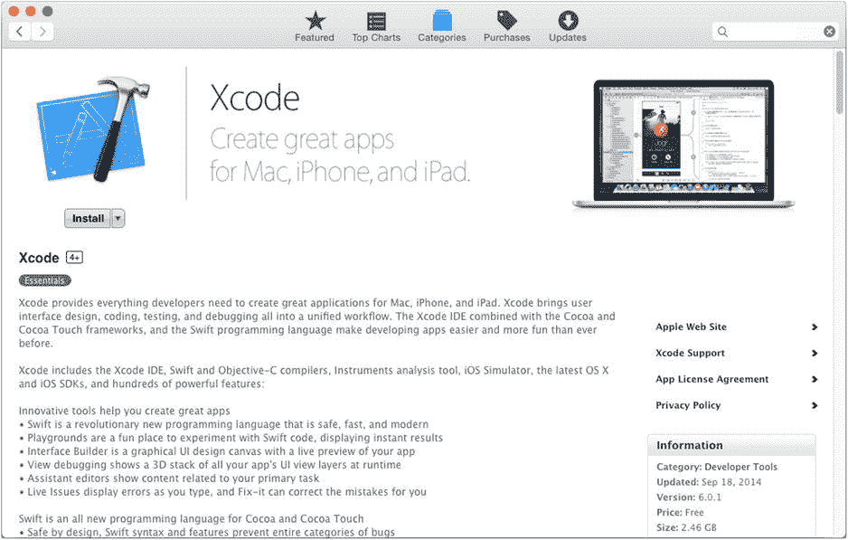
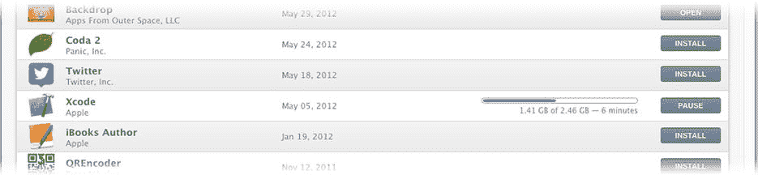
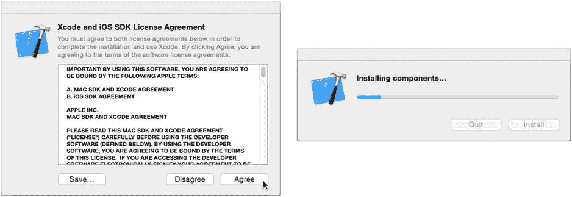
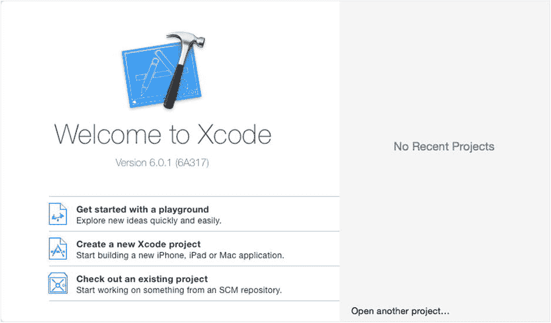
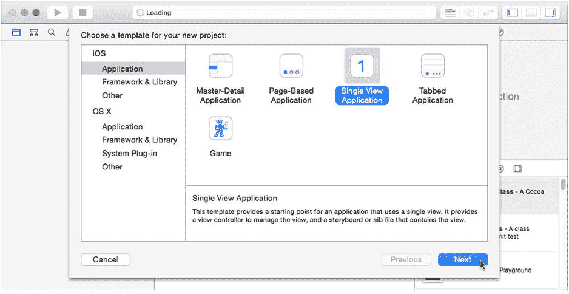
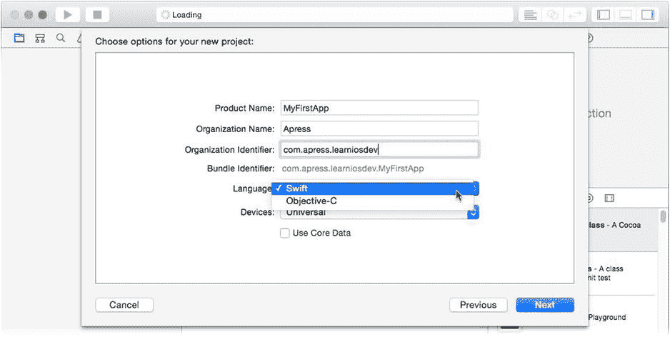
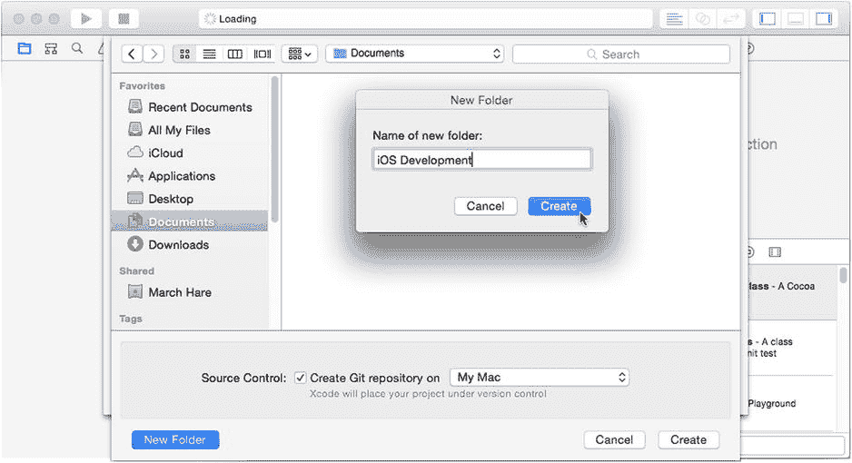
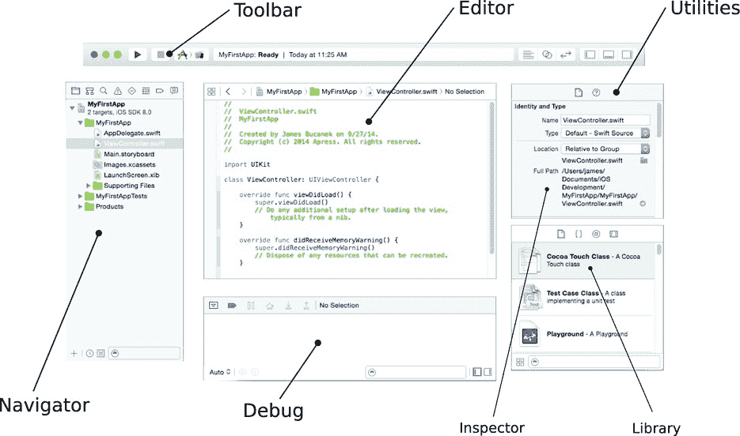

# 本书假定您是 iOS 开发新手

本书假定您是 iOS 应用开发新手，且编程经验有限。如果您一直在学习 Apple 的新编程语言 Swift，那就再好不过了。如果您熟悉 Objective-C、C、Java、C# 或 C++，跟随本书学习应该也不会有太大困难，而且第 20 章还提供了 Swift 入门指南，建议您阅读。如果您是编程领域的绝对新手，我建议先阅读一本基础的 Swift 编程书籍——例如 Gary Bennett 和 Brad Lees 合著的《*Swift for Absolute Beginners*》——作为先行或同步学习。iOS 应用可使用 Objective-C 或 Swift 开发，但本书将完全采用 Swift。

本书将讲解 iOS 应用设计、构建和部署的基本原理。您将养成一些良好的设计习惯，掌握核心编程技能，并熟悉用于创建应用的开发工具。

本书并非针对某一技术的深度论述。它的设计旨在通过扎实地引导您构建利用多种设备功能的应用——例如在地图上定位、使用加速计、用内置相机拍照、创建动态动画、参与社交网络以及将信息存储在云端——来激发您的想象力。在此基础上，您可以超越这些示例，去创造下一个伟大的 iOS 应用！

## 不拘一格

我是一名“老派”程序员。我从最底层的二进制位开始学习编程（毫不夸张）。不怕暴露年龄，我写的第一个程序是在一个 4 位微控制器上，用拨动开关输入机器指令。因此，在我开始使用 BASIC 和 C 等“高级”语言编程之前，我已经几乎掌握了机器代码的一切知识。在为我（当时革命性的）Macintosh 电脑编写第一个图形用户界面（GUI）应用程序时，这些都已成为过往。

虽然我珍视这些积累的知识，其中许多仍然有用，但我意识到，如今为 iOS 开发出色的应用，严格的“自底向上”方法并非必需。过去几十年软件开发的许多进步，都在于将开发者——也就是您——与 CPU 指令、硬件接口和软件设计的细枝末节隔离开来。这让您能够专注于利用这些技术将想法变为现实，而不是把所有时间花在担忧寄存器分配和内存管理上。

所以，激动人心的是，您只需具备最基础的计算机编程知识，甚至对底层技术知之甚少，就能直接上手创建功能完备的 iOS 应用。这正是本书前几章要做的事——向您展示如何在不进行任何传统编程的情况下创建一个 iOS 应用。

这并非说您不需要这些技能就能掌握 iOS 开发。恰恰相反；您对编程、性能和内存管理了解得越多，就越得心应手。变化在于，这些技能已不再是过往那样的先决条件了。现在，您可以在探索 iOS 开发新领域的同时，并行学习它们。

## 如何使用本书

本书提倡“边探索边前进”的方法。有些章节会引导您完成创建使用相机或播放音乐的 iOS 应用的整个过程。这些章节可能会略过许多细节。在其间，您会找到讲解基础软件开发技能的章节。书中还有关于良好软件设计、充分利用示例代码以及 Swift 编程语言的章节。

因此，与“先学完所有基本技能，再用这些技能构建应用”的传统顺序不同，本书从构建应用开始，然后探索其中的细节。

您可以按任意顺序阅读各章节，根据需要跳过或返回。如果您真想更早地了解某个对象章节，可以跳过去先读那章。如果您已经熟悉模型-视图-控制器设计模式，遇到那章时跳过即可。将本书视为一套需要学习的技能合集，而非必须按顺序进行的系列课程。

以下是各章预览：

- *工欲善其事？* 向您展示如何下载和安装 Xcode 开发工具。您会需要它们。
- *Boom！App* 引导您完成创建 iOS 应用的核心步骤——无需编程。
- *旋转网页* 创建一个利用 iOS 内置网页浏览器强大功能的应用。
- *事件将至* 讨论事件（触摸、手势和移动）如何从设备传入您的应用，以及您如何利用它们让应用响应用户。
- *表格礼仪* 向您展示数据如何在应用中显示以及如何被编辑。
- *对象课程* 深入浅出地讲解对象和面向对象编程。
- *笑一个！* 向您展示如何将相机和照片库集成到您的应用中。
- *模范公民* 阐释软件工程师称之为“模型-视图-控制器”的神奇咒语。
- *甜美音乐* 通过向您展示如何在应用中添加音乐、声音和 iTunes 来丰富您的组合。
- *有视图吗？* 带您简要了解 Cocoa Touch 框架中可用的视图对象（按钮、滑块等）。
- *给我画幅画* 向您展示如何创建自定义视图，解锁在 iOS 应用中绘制几乎任何东西的能力。
- *去而复返* 阐述应用导航的基础：用户如何从一个屏幕切换到另一个屏幕再返回。
- *分享即关爱* 全是关于如何通过 Twitter、短信和电子邮件等服务将您的内容分享到网络。
- *游戏开始！* 提供一个带有实时动画的趣味的游戏。
- *若是你建造它……* 讲解 Interface Builder 背后的一些魔法。
- *有个性的应用* 用加速计让您的应用“摇”起来。
- *你在哪里？* 真真切切地为您绘制一幅地图。
- *记住我？* 向您展示如何设置和保存用户偏好设置，以及如何使用 iCloud 与其他 iOS 设备共享。
- *医生，您是说我需要存储* 解释应用文档如何存储、读取和更新。
- *看 Swift，看 Swift 跑* 是 Swift 编程语言的速成课程。
- *框架搭建* 跳出应用的局限来创建扩展，并在此过程中教您一些关于框架的知识。

## 第 1 章：工欲善其事？

如果你想构建东西，很可能需要一些工具：锤子、钉子、激光、起重机，还有一把宜家的内六角扳手。构建 iOS 应用需要一套名为 *Xcode* 的工具。

本章将向您展示如何获取并安装 Xcode，并对其进行简要介绍，以便您熟悉它。如果您已经安装并使用过 Xcode，请查看“要求”部分以确保您拥有所需的一切，但您很可能可以跳过本章大部分内容。

### 要求

在本书中，您将创建运行于 iOS 8 版本上的应用。为 iOS 8 创建应用需要 Xcode 6 版本。Xcode 6 需要 OS X 10.9 版本（也称为 Mavericks），这需要一台基于 Intel 处理器的 Mac。都记住了吗？以下是您的完整清单：

- 基于 Intel 处理器的 Mac
- OS X 10.9（或更新版本）
- 数 GB 的可用磁盘空间
- 互联网连接
- 至少一台运行 iOS 8.0（或更新版本）的 iOS 设备（iPod Touch、iPhone 或 iPad）

请确保您拥有安装了 OS X 10.9（Mavericks）或更新版本的基于 Intel 处理器的 Mac 电脑、足够的磁盘空间和互联网连接。您可以在 Mac 上完成所有初始应用开发，但最终您会想在真实的 iOS 设备（iPhone、iPod Touch 或 iPad）上运行您的应用，为此您需要一台这样的设备。

**注意**：作为一般规则，较新版本更好。本书中的示例是针对 iOS 8.0 开发的，使用 Xcode 6.1 构建，运行在 OS X 10.10（Yosemite）上。当你阅读本书时，所有这些可能都有了更新的版本，这没关系。请阅读 Xcode 和 iOS 的发布说明以了解更改内容。

### 安装 Xcode

Apple 已经让安装 Xcode 变得尽可能简单。在你的 Mac 上，启动 App Store 应用程序——不要与你在 iTunes 中找到的 iOS App Store 混淆。找到开发者工具类别，或者直接搜索“Xcode”。图 1-1 展示了 Mac App Store 中的 Xcode 应用。

图 1-1. App Store 中的 Xcode

点击“安装”按钮开始下载 Xcode。这需要一段时间（参见图 1-2）。你可以从 App Store 的“已购”标签页监控其进度。请耐心等待。Xcode 体积巨大，即使拥有快速的互联网连接，安装也需要一些时间。

图 1-2. 下载 Xcode

在 Xcode 下载的同时，我们来讨论一下它以及一些相关主题。

### 什么是 Xcode？

那么，你正在下载的这个巨大应用程序是什么？

Xcode 是一个*集成开发环境*（IDE）。现代软件开发需要数量惊人的不同程序。要构建和测试一个 iOS 应用，你需要编辑器、编译器、链接器、语法检查器、加密签名器、资源编译器、调试器、模拟器、性能分析器等等。但你无需担心这些；Xcode 为你协调所有这些独立的工具。你所要做的就是使用 Xcode 界面来设计你的应用，而 Xcode 将决定需要运行哪些工具以及何时运行。换句话说，Xcode 将“我”放入了 IDE。

除了包含你所需的所有工具之外，Xcode 还可以托管多个*软件开发工具包*（SDK）。SDK 是一组文件，为 Xcode 提供构建特定操作系统（如 iOS 8）应用所需的内容。Xcode 下载时会附带一个用于构建 iOS 应用的 SDK 和一个用于构建 OS X 应用的 SDK，两者都是最新版本。你可以根据需要下载额外的 SDK。

一个 SDK 将由一个或多个*框架*组成。框架精确地告诉 Xcode 你的应用程序如何使用某个 iOS 服务。这被称为*应用程序编程接口*（API）。虽然可以在你的应用中编写代码来做几乎任何事情，但它所做的很多事情是向 iOS 发出请求，以完成那些已经为你编写好的功能：显示警报、在字典中查找单词、拍照、播放歌曲等。本书大部分内容将向你展示如何使用这些内置服务。

**注意**：框架是一个文件夹中的文件包，很像你将在本书中创建的应用包。然而，框架包含的不是一个应用，而是你的应用使用操作系统特定部分所需的文件。例如，在屏幕上绘制所有东西所需的函数、常量、类和资源都位于 Core Graphics 框架中。AVFoundation 框架包含允许你录制和播放音频的类。想知道你在哪里？你需要 CoreLocation 框架中的函数。这样的单个框架有数十个。

哇，这么多首字母缩略词！我们来回顾一下。

*   *IDE*：集成开发环境。Xcode 就是一个 IDE。
*   *SDK*：软件开发工具包。允许你为特定操作系统（如 iOS 8）构建应用的支持文件。
*   *API*：应用程序编程接口。一组已发布的函数、类和定义，描述了你的应用如何使用特定服务。

你不需要记住这些。知道它们在你听到或与其他程序员交谈时的含义是件好事。

### 成为 iOS 开发者

你在阅读本书这个事实就让你成为了一个 iOS 开发者——至少在精神上是。要成为一名官方的 iOS 开发者，你需要加入 Apple 的 iOS 开发者计划。

如果你想做以下任何一件事，你必须成为一名 iOS 开发者：

*   通过 Apple 的 App Store 销售或免费赠送你的应用
*   获得 Apple 开发者论坛和支持资源的访问权限
*   直接（在 App Store 之外）将你的应用分发给他人
*   开发使用 Game Kit、应用内购买、推送通知或其他依赖 Apple 运营服务的技术的应用
*   在真实的 iOS 设备上测试你的应用

第一个原因是促使大多数开发者加入该计划的原因，也很有可能就是你加入的原因。但是，你不必加入就能在 Xcode 的模拟器中构建、测试和运行你的应用。如果你从未计划通过 App Store 分发你的应用或在 iOS 设备上运行你的应用，你可能永远不需要成为官方的 iOS 开发者。不加入该计划你也可以阅读本书的大部分内容。

另一个加入的原因是获得 iOS 开发者社区和支持计划的访问权限。Apple 的在线论坛包含丰富的信息。如果你遇到问题找不到答案，很可能其他人已经碰到了同样的问题。快速搜索开发者论坛很可能会找到答案。如果没有，发布你的问题，可能会有人为你解答。

即使你不打算在 App Store 上销售或免费赠送你的杰作，也还有其他几个加入的理由。如果你想将你的应用安装到设备上，Apple 要求你成为注册开发者。然后 Apple 会生成特殊的文件，允许你的应用安装到 iOS 设备上。

作为注册开发者，Apple 也会允许你直接将你的应用安装到其他人的设备上（即，不通过 App Store）。这被称为*ad hoc 分发*。你可以这样做的对象数量有限，但这是可能的，也是在实际环境中测试你应用的好方法。

最后，某些技术要求你的应用与 Apple 的服务器通信。在允许这样做之前，你必须先向 Apple 注册你自己和你的应用，即使只是为了测试它们。例如，如果你计划在你的应用中使用 Game Kit——本书包含一个 Game Kit 示例——你需要成为一名官方的 iOS 开发者。

在我撰写本书时，成为 iOS 开发者的费用是 99 美元。这是一项年度订阅，所以你在需要加入之前加入没有意义。访问`http://developer.apple.com/`以获取关于 Apple 开发者计划的更多信息。

那么，在`http://developer.apple.com/`上有什么是免费的吗？实际上相当多。你可以搜索所有 Apple 已发布的文档、下载示例项目、阅读技术指南、查找技术说明等——这些都不需要你成为 iOS 开发者。某些活动可能需要你使用你的 Apple ID 登录。你在 iTunes 或你的 iCloud 账户中使用 Apple ID 即可，或者你可以免费创建一个新的 Apple ID。

付费注册还让你有机会购买 Apple 每年举办的全球开发者大会（WWDC）的门票。这是一个大型聚会，专为 Apple 开发者举办。

### 获取项目文件

现在是下载本书项目文件的好时机。本书使用了大量的项目。许多项目可以通过遵循每章中的步骤重新创建，我鼓励你尽可能这样做，这样你就能体会到从头开始构建应用的感觉。然而，有一些项目并没有解释每一个细节，还有一些项目包含了无法在印刷品中复现的二进制资源（图像和声音文件）。

跳转到本书页面：`www.apress.com`（您可以通过书名、ISBN 或作者姓名进行搜索）。在书籍简介下方，您会看到几个文件夹标签，其中一个是“Source Code/Downloads”。点击该标签。现在找到下载本书项目的链接。点击该链接，一个名为`Learn iOS Development Projects.zip`的文件将下载到您的硬盘中。

在您的“Downloads”文件夹（或浏览器保存的任意位置）中找到`Learn iOS Development Projects.zip`文件。双击该文件以解压其内容，您将得到一个名为`Learn iOS Development Projects`的文件夹。将该文件夹移动到任意位置。

## 首次启动 Xcode

Xcode 应用程序下载完成后，您将在`Applications`文件夹中找到它。通过双击、使用“Launchpad”或您喜欢的任何其他方式打开 Xcode 应用程序。我建议将 Xcode 添加到 Dock 中以便快速访问。

Xcode 会显示一份许可协议（见图 1-3），建议您至少浏览一遍，但必须同意后才能继续。随后，Xcode 可能会要求提供管理员账户和密码以完成安装。一旦获得授权，它将完成安装，如图 1-3 右侧所示。

图 1-3. 许可协议

完成所有准备工作，Xcode 将一切归位后，您将看到 Xcode 的启动窗口，如图 1-4 所示。

图 1-4. Xcode 启动窗口

启动窗口有几个自解释的按钮，可帮助您快速上手。它还列出了您最近打开的项目。

Xcode 6 的一个新功能是“playground”。Playground 是一个空白页面，您可以在其中尝试使用本书将用到的语言——Swift 编写代码。您无需创建项目或运行编译器；只需输入一些 Swift 代码，Xcode 就会向您展示运行结果或报错原因。您将在第 20 章中详细使用 playground 探索 Swift 语言，但如果您想尝试某些代码，随时可以创建一个 playground。

除非打开一个项目，否则 Xcode 的有趣部分不会显现出来，因此，首先创建一个新项目。点击启动窗口中的“Create a new Xcode project”按钮（或从菜单中选择“File”>“New”>“Project”）。Xcode 首先会询问您要创建的项目类型，如图 1-5 所示。

图 1-5. 项目模板浏览器

模板浏览器允许您选择一个项目模板。每个模板都会创建一个预配置好、用于构建特定内容（应用程序、库、插件等）的新项目，且针对特定平台（iOS 或 OS X）。虽然可以手动配置任何项目以生成您想要的任何内容，但这既技术化又繁琐；为了节省大量工作，请尽量选择一个与您的应用的最终“形态”最接近的模板。

在本书中，您将只创建 iOS 应用，因此请选择 iOS 部分下的“Application”类别——但您也可以随意查看其他部分。如您所见，Xcode 的用途远不止 iOS 开发。

选中“Application”部分后，点击“Single View Application”模板，然后点击“Next”按钮。在下一个屏幕中，Xcode 希望了解有关您新项目的一些详细信息，如图 1-6 所示。此处显示的选项取决于您选择的模板。

图 1-6. 新项目选项

对于这个简单的演示，请在“Product Name”字段中为您的项目命名。可以是任何名称——我在此示例中使用了`MyFirstApp`——但我建议您保持名称简洁。“Organization Name”是可选的，但我建议您填写您的姓名（如果您将为公司开发应用，则填写公司名称）。

组织标识符和产品名称共同创建一个唯一标识您应用的“bundle identifier”。组织标识符是一个反向域名，应由您（或您的公司）拥有。目前这并不重要，因为您将仅为自己构建此应用，因此可以使用任何喜欢的域名。当您构建计划通过 App Store 分发的应用时，这些值必须是合法且唯一的。

最后，为项目语言选择“Swift”。Objective-C 是 iOS（以及大多数 OS X）开发的传统语言。在 2014 年全球开发者大会上，Apple 推出了 Swift 语言。Swift 是一种高效、简洁的计算机语言，具有许多有助于轻松、无 bug 开发的特性。Swift 是 iOS 开发的未来，也是您将在本书中使用的语言。

**注意**：虽然您选择了 Swift 作为项目语言，但您并不局限于仅使用 Swift。Xcode 和 iOS 可以在同一个项目中无缝混合使用 Swift、Objective-C、C++和 C。您可以随时向 Swift 项目添加 Objective-C 代码，反之亦然。

其余选项对本演示并不重要，因此点击“Next”按钮。Xcode 最后会询问将新项目存储在何处（见图 1-7），以及是否要创建一个源代码控制仓库。源代码控制是一种维护项目历史的方法。您以后可以回溯并查看所做的更改。Xcode 首选的源代码控制系统是 Git，Xcode 会提供选项为您的项目创建一个本地 Git 仓库。如果您不确定该怎么做，请选择“是”；这几乎没有任何代价，而且现在做比以后做更容易。Xcode 也支持远程 Git 仓库以及较旧的源代码控制系统，如 Subversion。现在让我们回到创建项目上。

图 1-7. 创建新项目

每个项目都会创建一个以项目名称命名的“project folder”。用于创建应用的所有文档都将（应该）存储在该项目文件夹中。您可以将项目文件夹放在任何地方（甚至桌面上）。在此示例中（见图 1-7），我创建了一个新的“iOS Development”文件夹，以便将所有项目文件夹集中存放。

## 欢迎使用 Xcode

在回答了关于新项目的所有详细信息后，点击“Create”按钮。Xcode 将创建您的项目，并在一个“workspace window”中打开它。图 1-8 展示了一个工作区窗口的分解视图。这就是奇迹发生的地方，也是您在本书中花费大部分时间的地方。

图 1-8. Xcode 工作区窗口

一个工作区窗口有五个主要部分。

*   导航器区域（左侧）
*   编辑器区域（中间）
*   实用工具区域（右侧）
*   调试区域（底部）
*   工具栏（顶部）

您可以有选择地隐藏除编辑器区域之外的所有内容，因此您可能看不到所有这些部分。让我们简单浏览一下每个部分，以便您熟悉各区域。

### 导航区域

导航器位于工作区窗口的左侧。共有八个导航器：

*   项目
*   符号
*   查找
*   问题
*   测试
*   调试
*   断点
*   报告

