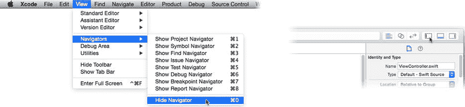
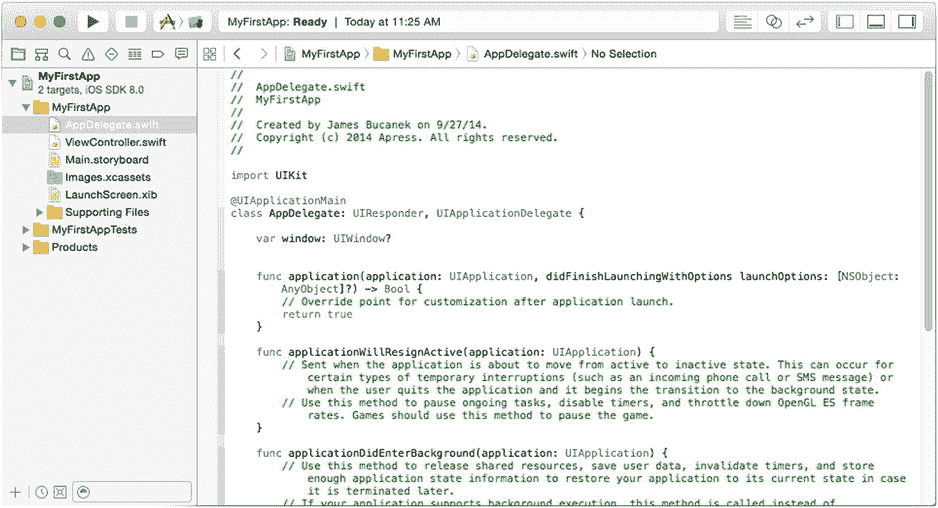
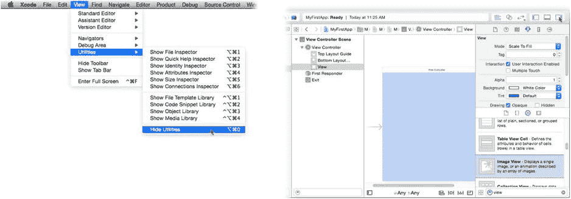
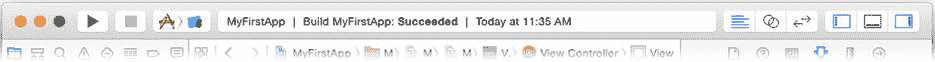
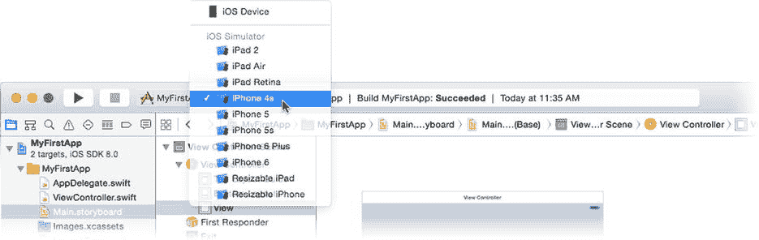
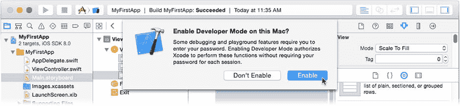
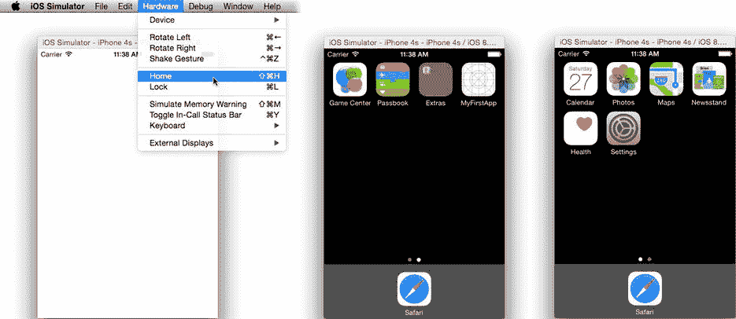

# 通过点击面板顶部的图标或从“视图”“导航器”子菜单切换导航器。您可以使用“视图”“导航器”“隐藏导航器”命令（`Command+0`），或点击工具栏中“视图”按钮的左侧（如图 1-9 右侧所示）来隐藏导航器。这将为编辑器腾出一点额外的屏幕空间。

图 1-9. 导航器视图控件

项目导航器（参见图 1-8）是您的工作基地，也是您最常使用的导航器。项目中包含的每个源文件都组织在项目导航器中，您可以通过它来选择要编辑的文件。

**注意** *源文件*是指在创建应用程序过程中使用的任何原始文档。大多数项目都有多个源文件。该术语用于将它们与*中间文件*（构建过程中产生的临时文件）和*产品文件*（最终应用程序的文件）区分开来。您的产品文件会出现在项目导航器底部的一个特殊`Products`文件夹中。

符号导航器会持续列出您在项目中定义的所有符号。搜索导航器可以在多个文件中查找文本。当您准备构建和测试应用程序时，问题、调试、断点和报告导航器便会发挥作用。

### 编辑器区域

编辑器区域是您“具体”创建应用程序的地方。在项目导航器中选择一个源文件，它就会出现在编辑器区域中。编辑器显示的外观取决于文件的类型。

**注意** 并非所有文件都可在 Xcode 中编辑。例如，图像和声音文件不能在 Xcode 中编辑，但 Xcode 会在编辑器区域中显示它们的预览。

您最常编辑的是程序源文件（编辑方式与任何文本文件相同，参见图 1-8 和 1-10），以及界面构建器文件（显示为可连接和配置的对象关系图，参见图 1-11）。

编辑器区域有三种模式。

*   标准编辑器
*   助理编辑器
*   版本编辑器

标准编辑器用于编辑选中的文件，如图 1-10 所示。助理编辑器会分割编辑器区域，并（通常）在右侧加载一个*对应*文件。例如，您可以在左侧窗格中编辑界面设计，在右侧窗格中预览该界面在不同设备上的显示效果。编辑 Swift 源文件时，您可以选择让其父类的源代码自动显示在右侧，以此类推。

图 1-10. 编辑器

版本编辑器用于比较源文件与早期版本。Xcode 支持多种版本控制系统。您可以将文件签入版本控制系统，或对项目进行“快照”备份。之后，您可以比较当前编写的代码与同一文件的早期版本。本书不涉及版本控制，如果您有兴趣，请阅读 Xcode 用户指南中的“保存和还原项目更改”部分。

要更改编辑器模式，请点击工具栏中的“编辑器”控件，或使用“视图”菜单中的命令。您不能隐藏编辑器区域。

### 实用工具区域

工作区窗口的右侧是实用工具区域。顾名思义，它包含各种有用的工具，如图 1-11 右侧所示。

图 1-11. 编辑界面构建器文件

实用工具区域顶部是*检查器*。它们会根据正在编辑的文件类型以及可能在该文件中的选定内容而变化。与导航器类似，您可以通过点击面板顶部的图标或从“视图”“实用工具”子菜单（如图 1-11 左侧所示）来切换不同的检查器。您可以使用“视图”“实用工具”“隐藏实用工具”命令，或点击工具栏中“视图”控件的右侧（同样显示在图 1-11 的右上角）来隐藏实用工具区域。

实用工具区域底部是资源库。这里包含了现成的对象、资源和代码片段，您可以将其拖入项目。它们也按类型组织成标签页：文件模板、代码片段、界面对象和媒体资源。

### 调试区域

调试区域用于测试应用程序并解决各种问题。它通常只有在您运行应用程序后才会出现，并且在此之前用处不大。要显示或隐藏它，请使用“视图”“调试区域”“显示/隐藏调试区域”命令。您也可以点击调试面板左上角的关闭抽屉图标。

### 工具栏

工具栏包含许多有用的快捷方式和一些状态信息，如图 1-12 所示。

图 1-12. 工作区窗口工具栏

您已经看到了右侧的“编辑器”和“视图”按钮。左侧是用于运行（测试）和停止应用程序的按钮。在开发过程中，您将使用这些按钮来启动和停止应用程序。

“运行”和“停止”按钮旁边是“方案”控件。这个多部分弹出式菜单允许您选择项目的构建方式（称为*方案*）以及应用程序的目标运行位置（模拟器、真实设备、App Store 等）。

工具栏中间是项目的状态。它会显示当前正在进行的活动，或刚刚完成的活动，例如构建、索引等。如果您刚安装 Xcode，它可能正在后台下载额外的文档，状态会显示这一点。

如果您愿意，可以使用“视图”“显示/隐藏工具栏”命令来隐藏工具栏。工具栏中的所有按钮和控件只是菜单命令的快捷方式，因此没有工具栏也可以操作。但本书假设工具栏是可见的。

如果您有兴趣了解更多关于工作区窗口、导航器、编辑器和检查器的信息，可以在“帮助”菜单下的“Xcode 概览”中找到所有相关内容（以及更多）。

## 运行您的第一个应用程序

打开工作区窗口后，点击“方案”控件，并从子菜单中选择一个 iPhone 选项，如图 1-13 所示。这告诉 Xcode 当您点击“运行”按钮时，希望应用程序在哪里运行。

图 1-13. 选择方案和目标

点击“运行”按钮。好了，可能还需要办理一个手续。在测试应用程序之前，Xcode 需要被授予一些特殊权限。第一次尝试运行应用程序时，Xcode 会询问是否可以获得这些权限（参见图 1-14）。点击“启用”，并提供您的管理员账户名称和密码。

图 1-14. 启用开发者模式

一旦完成了初步设置，`Xcode` 就会将项目中的所有部分组装成你的应用——这一过程称为*构建*——然后使用其内置的 iPhone 模拟器运行你的应用，如图 1-15 左侧所示。

图 1-15. iPhone 模拟器

这个模拟器正如其名，是一个尽可能逼真地模拟真实 iPhone 或 iPad 的程序。模拟器让你可以在 Mac 上直接完成大部分 iOS 应用测试，无需将应用加载到真正的 iOS 设备上。它还允许你在不同类型的设备上测试应用，这样你就不必每种设备都买一个了。

恭喜！你刚刚在一个（模拟的）iPhone 上创建、构建并运行了一个 iOS 应用！这一切之所以可行，是因为 `Xcode` 项目模板总是会生成一个可运行的项目；缺少的是让你的应用实现某些精彩功能的部分，而这正是本书其余内容要讲述的。

现在，你可以随意摆弄 iPhone 模拟器。虽然你创建的应用没有任何功能——除了一个简陋的“手电筒”应用之外——但你会注意到，你可以通过 `Hardware`  `Home` 命令（如图 1-15 左侧所示）来模拟按下主屏幕按钮，并返回主屏幕（如图 1-15 中间和右侧所示）。在那里，你会找到你的新应用、`设置`应用、`Game Center` 等等，就像这是一台真正的 iPhone 一样。不过，抱歉，它不能用来打电话。

完成后，切换回工作区窗口，并点击工具栏中的 `Stop` 按钮（位于 `Run` 按钮旁边）。

