# 总结

现在你已拥有开发和运行 iOS 应用所需的所有工具。你了解了 `Xcode` 的组织方式以及如何在模拟器中运行你的应用。

下一步是为你的应用添加一些内容。

## 第 2 章：砰！应用

在本章中，你将创建一个能做些事情的应用。虽然不多——毕竟还处于早期阶段——但足以称得上实用。在此过程中，你将完成以下任务：

*   使用 Xcode 的 `Interface Builder` 设计应用
*   向应用添加对象
*   连接对象
*   自定义对象以提供内容
*   向项目添加资源文件
*   使用故事板创建转场
*   使用约束控制视觉元素的布局

令人惊讶的是，你将创建一个无需编写一行计算机代码的应用。这虽然不典型，但将展示 `Xcode` 的灵活性。

你要创建的应用将展示一些关于 20 世纪女性超现实主义者的有趣事实。让我们开始吧。

#### 设计

在启动 `Xcode` 并开始疯狂输入之前，你需要有一个计划。这是应用开发的设计阶段。在应用的生命周期中，你可能会随着改进而多次修改设计，但在开始之前，你需要对应用的外观和工作方式有一个基本概念。

你的设计可以是正式写出来的，在餐巾纸上草草画出的，或者只是停留在脑海中。只要你有设计，形式并不重要。至少，你需要能够回答一些基本问题。你的应用将在哪些设备上运行（iPhone/iPod、iPad，还是两者兼有）？你的应用将以竖屏模式、横屏模式，还是两种模式运行？用户将看到什么？用户如何导航？他们如何与它交互？

图 2-1 展示了本应用的粗略草图。这个应用很简单，因此不需要太多初步设计。超现实主义者应用将有一个包含著名女性超现实主义者肖像的起始屏幕。点击其中一张肖像将过渡到第二个屏幕，显示一幅代表性画作和一个可滚动的文本字段，内容是关于这位艺术家生平的介绍。你已决定此应用仅能在 iPhone 或 iPod Touch 上运行，且仅支持竖屏方向。这将简化你的设计和开发。

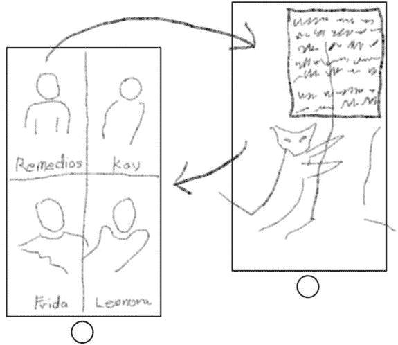

图 2-1. 超现实主义者应用的草图

### 创建项目

第一步是创建你的项目。点击启动窗口中的 `New Project` 按钮，或选择 `File`  `New Project` 命令。浏览可用的模板，如图 2-2 所示。

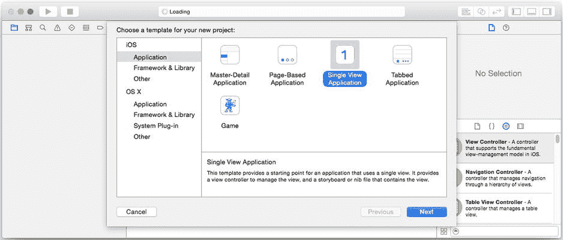

图 2-2. iOS 项目模板

你的设计让你对应用的工作方式有了基本概念，这应能提示你应该选择哪个 Xcode 项目模板作为起点。你的应用设计与这些模板中的任何一个都不是完美匹配，因此选择 `Single View Application` 模板——这是最简单的模板，并且已经包含一个视图。点击 `Next` 按钮。

下一步是填写关于你的项目的详细信息（参见图 2-3）。将项目命名为 `Surrealists`，并填写你的组织名称和标识符。与你的设计选择一致，将 `Devices` 选项从 `Universal` 改为 `iPhone`，如图 2-3 所示。语言的选择无关紧要，因为正如我前面提到的，你不会为这个应用编写任何代码。

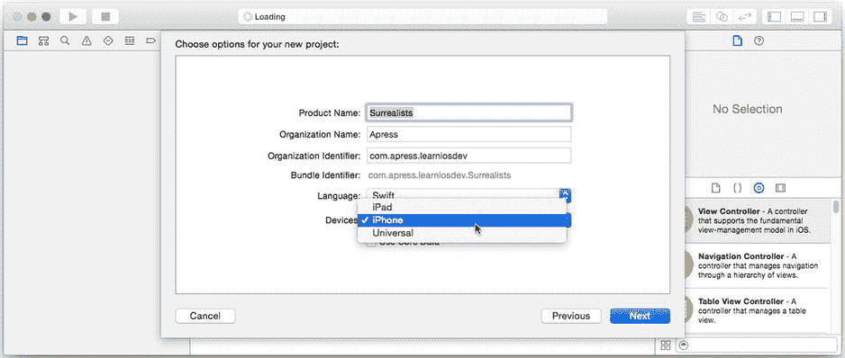

图 2-3. 设置项目详细信息

**注** 为 iPhone 开发与为 iPod Touch 开发是相同的（除非你的应用使用了仅 iPhone 可用的功能）。此后，我将仅提及 iPhone，但请记住这也包括了 iPod Touch。

点击 `Next` 按钮。在你的硬盘上选择一个位置来保存新项目，然后点击 `Create`。

### 设置项目属性

你现在有了一个空的 Xcode 项目；是时候开始自定义它了。首先，通过点击项目导航器中的项目名称（`Surrealists`）来进入项目设置，如图 2-4 左上角所示。编辑器区域将显示此项目的所有设置。如果你的项目目标已折叠，请从编辑器左上角的弹出菜单中选择 `Surrealist` 目标（参见图 2-4 左侧）。如果你的项目目标已展开，只需从列表中选择该目标，如图 2-4 中间所示。一旦选择了目标，在中间选择 `General` 选项卡，如该图右侧所示。

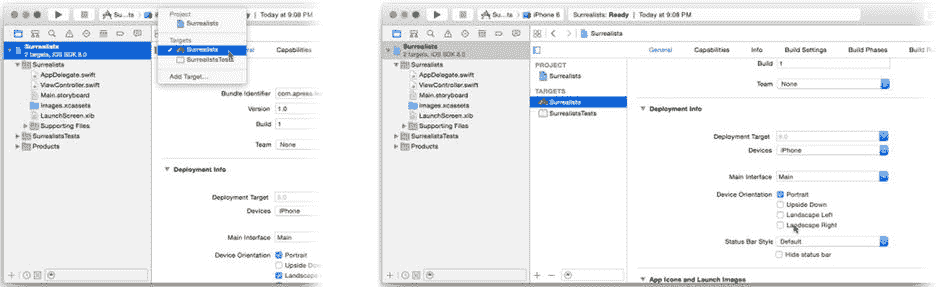

图 2-4. 目标设置

滚动目标设置直到找到 `Deployment Info` 部分。取消选中 `Device Orientation` 中的 `Landscape Left` 和 `Landscape Right` 复选框，以便只保留 `Portrait` 方向处于选中状态。

回顾一下，你已经创建了一个仅支持 iPhone 且仅以竖屏方向运行的应用项目。现在，你可以开始设计界面了。

### 构建界面

点击项目导航器中的 `Main.storyboard` 文件。Xcode 的 Interface Builder 编辑器会出现在编辑区域中，如图 2-5 所示。

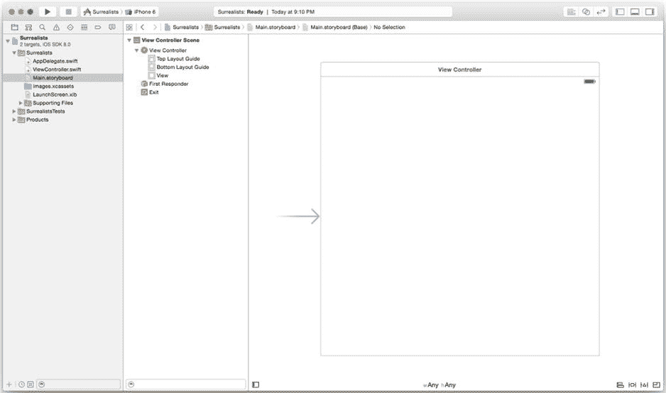

图 2-5. Interface Builder

`Interface Builder`是苹果应用厨房里的秘密配料。简而言之，它是一个无需编写代码即可在应用中添加、配置和互连对象的工具。你可以在`Interface Builder`中定义应用的大部分视觉元素。`Interface Builder`编辑`storyboard`、`xib`和（遗留的）`nib`文件。

**注意**  现代`Interface Builder`文件的扩展名为`.xib`或`.storyboard`。遗留的`Interface Builder`文件扩展名为`.nib`（读作“nib”），你仍然会听到程序员泛称它们为“nib”文件。`NIB`是`Next Interface Builder`的缩写，因为`Xcode`、`Interface Builder`和`Cocoa Touch`框架的根源都可以追溯到史蒂夫·乔布斯的“另一”家公司——`NeXT`。在本书的后续部分，你会看到许多以`NS`开头的类名，这是`NeXTStep`（`NeXT`操作系统的名称）的缩写。

`Interface Builder`以两种视图显示文件中的对象。左侧（参见图 2-5）是组织成层级列表的对象，称为*大纲*。某些对象可以包含其他对象，就像文件夹可以包含子文件夹一样，大纲反映了这一点。使用展开三角形来显示包含的对象。

**提示**  大纲可以折叠为仅显示顶级对象图标的*停靠栏*。点击画布窗格左下角（图 2-5 底部中央）的展开按钮，可在两种视图之间切换。

右侧的视图称为*画布*。在这里你可以找到`Interface Builder`文件中的视觉对象。只有视觉对象（如按钮、标签、图像等）会出现在画布上。不具有视觉方面的对象将仅列出在大纲中。如果一个对象同时出现在两个视图中，你操作哪一个都无关紧要——它们是同一个对象。

**注意**  如果你一直在学习面向对象编程语言，那么你会知道什么是对象。如果你还不知道什么是对象，请不要惊慌。现在，只需将对象视为乐高积木——它是一个在应用中执行特定任务的离散包，并且可以与其他对象连接以构建更大的东西。如果你想立即了解对象，可以跳到第 6 章。

### 添加对象

你从库中获取新对象。选择“视图”  “工具”  “显示对象库”命令。这将同时显示右侧的工具区域并切换到对象库（那个小圆形图标），如下所示：

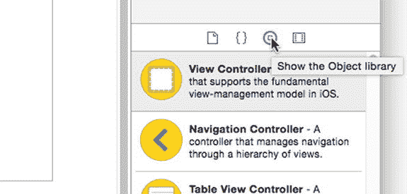

要向应用中添加对象，请将其从库中拖出并放入`Interface Builder`编辑器。你的应用需要一个导航控制器对象，因此请滚动对象列表，直到找到“导航控制器”。你可以通过在库面板底部的搜索字段中输入术语（例如`nav`）来简化搜索（参见图 2-6）。

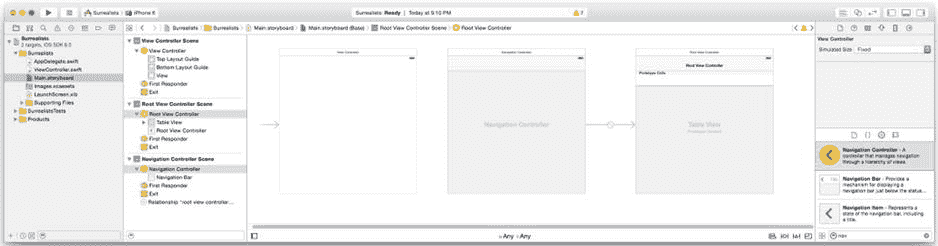

图 2-6. 添加导航控制器

将导航控制器对象从库中拖入画布，如图 2-6 所示，并将其放在空白区域的任意位置。你刚刚向你的应用添加了一个对象——实际上是几个对象。

### 删除和连接对象

库中的导航控制器对象实际上是一个对象集群。顾名思义，导航控制器管理用户在多个屏幕之间的移动，每个屏幕由一个单独的视图控制器对象控制。导航控制器连接到将出现的第一个屏幕的视图控制器，称为其*根视图控制器*。不要担心细节；你将在接下来的章节中了解更多关于导航控制器的知识。

为方便起见，库中的导航控制器会同时创建一个导航控制器对象和它的根视图控制器。这个根视图控制器恰好是一个表格视图控制器。这是一个流行的选择；导航控制器和表格视图就像面包和黄油一样搭配。然而，你的项目并不需要表格视图控制器。相反，你希望这个导航控制器使用你已有的、没有多余功能的视图控制器。

首先，删除多余的表格视图控制器。在右侧选中连接到导航控制器的表格视图控制器，如图 Figure 2-7 所示。按下 Delete 键，或选择 Edit  Delete。

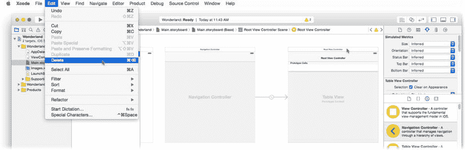

Figure 2-7. 删除表格视图控制器

现在，你需要将新的导航控制器连接到项目自带的普通视图控制器。拖动原始的视图控制器，将其放置在导航控制器的右侧（参见 Figure 2-8）。我倾向于从左到右布局我的故事板，但你可以按自己的喜好来组织。

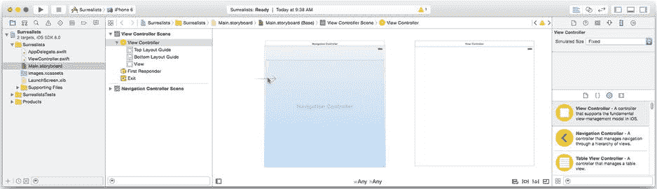

Figure 2-8. 指定初始视图控制器

视图控制器上未连接的箭头表示你的应用的初始视图控制器。你需要让导航控制器成为第一个控制器，因此将箭头从原始视图控制器拖开，放到导航视图控制器上，如图 Figure 2-8 所示。

最后一步是重新建立导航控制器与其根视图控制器的连接。在 Interface Builder 中有多种建立连接的方法。我将向你展示最流行的两种。右键单击导航控制器（或按住 Control 键并单击），然后从它拖出一条线到视图控制器，如图 Figure 2-9 所示。

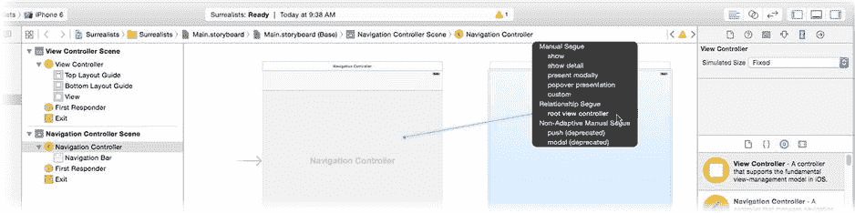

Figure 2-9. 设置根视图控制器连接

松开鼠标后，会弹出一个菜单，列出这两个对象之间所有可能的连接。点击 `root view controller` 连接。现在，当你的应用启动时，导航控制器将会把这个视图控制器作为第一个屏幕显示出来。

我确实承诺过教你两种连接对象的方法。第二种方法是使用实用工具区域中的连接检查器。选择 View  Utilities  Show Connections Inspector，或者点击实用工具面板中的小箭头图标，如图 Figure 2-10 所示。

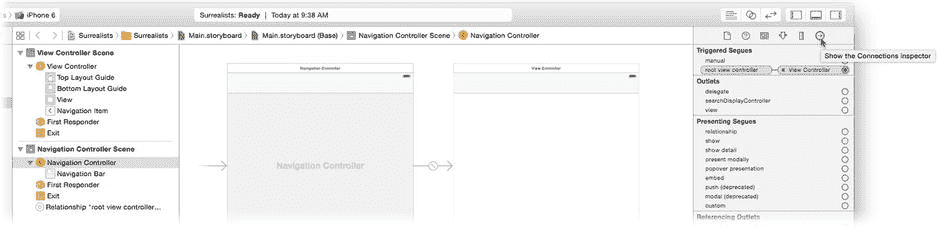

Figure 2-10. 使用连接检查器

要使用检查器，首先选择一个对象。在这种情况下，选择导航控制器。连接检查器将显示该对象的所有连接。找到标记为 `root view controller` 的连接。每个连接的右侧都有一个小圆圈。要设置一个连接，点击并拖拽该圆圈到你想要连接的对象上——在这里是视图控制器。要清除（或“断开”）一个连接，点击连接旁边的小 `x`。

到目前为止，你已经创建了一个新项目。项目模板包含一个简单的视图控制器。你为应用添加了一个新的导航控制器对象（以及一个不需要的表格视图控制器，你已经将其删除）。你将导航控制器指定为应用启动时控制应用的对象，并将该控制器连接到了空的视图控制器。现在是时候往那个空白视图中添加一些内容了。

### 向视图添加视图

现在你来到了这个项目最有趣的部分：创建应用的内容。首先，在你的初始屏幕上添加四个按钮，你将自定义它们。为此，你需要在初始屏幕的视图对象中工作。

视图控制器对象不是一个单一对象；它是一个对象的集合。我之前说过，一些对象可能包含其他对象；视图控制器和视图就是两个这样的对象。首先，选择视图对象。在 Interface Builder 中有两种方法可以做到这一点。你可以在左侧的大纲中找到该对象并选中它（参见 Figure 2-11）。另一种方法是直接在画布中选择对象。点击视图控制器的中心（Figure 2-11 的中间部分）来选中它的根视图对象——每个视图控制器都有一个根视图对象。你可以通过大纲确认是否选中了所需的对象。

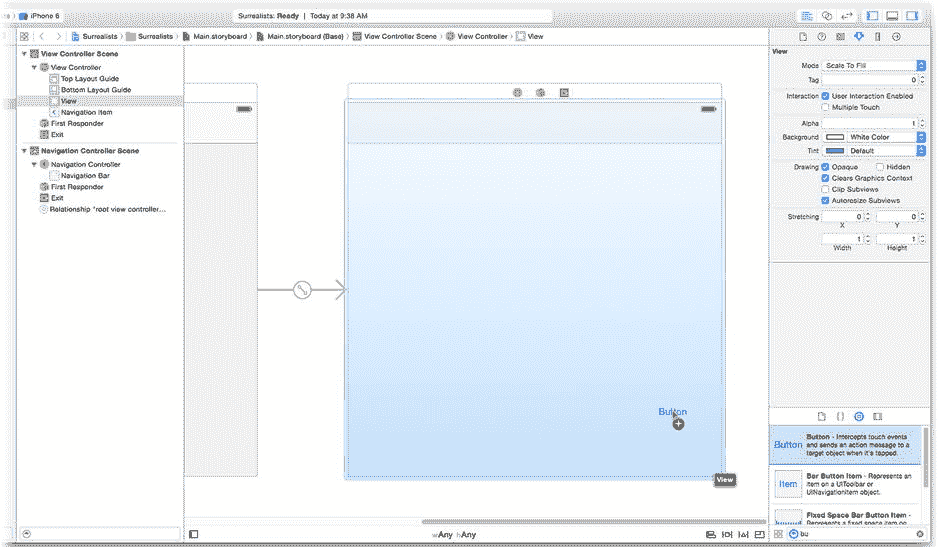

Figure 2-11. 选择视图对象

**提示** 一些可视对象是嵌套的。例如，一个工具栏是一个包含各个按钮项目的视图对象。要“深入”选择嵌套对象，先点击一次选择外层对象（工具栏），然后再点击一次选择嵌套对象（该工具栏中的某个按钮项目）。如果你不确定选的是什么，请使用大纲。

现在，是时候向你的设计添加一些新的视图对象了。在对象库中，找到 Button 对象——在搜索字段中输入 **bu** 可以更容易地找到它。抓取一个按钮对象并将其拖入视图对象中，如图 Figure 2-11 所示。

重复此操作三次，使视图内共有四个按钮对象，大约如图 Figure 2-12 所示。现在你需要调整这些按钮的大小，使每个按钮大约占据屏幕的四分之一。Figure 2-12 显示了一个按钮正在调整大小——按钮的背景被临时更改为灰色，以便更容易看清。

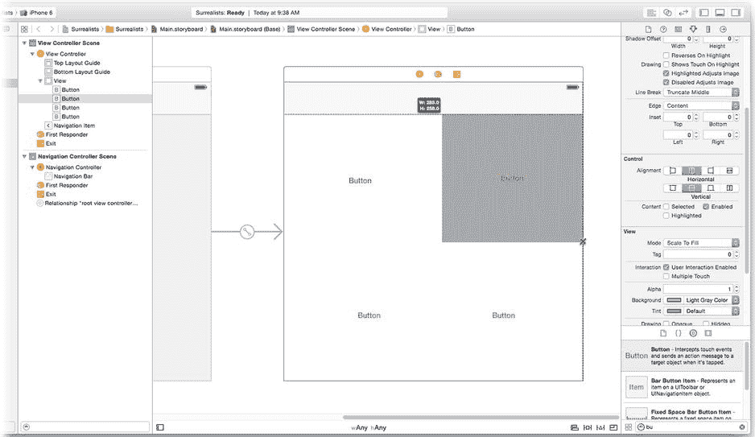

Figure 2-12. 放置按钮

### 编辑对象属性

现在是时候自定义你的按钮了。选中所有四个按钮——点击一个按钮，然后按住 Shift 键，再依次点击其他三个按钮。选择 View  Utilities  Show Attributes Inspector，或者点击检查器面板中的小控件图标，如图 Figure 2-13 所示。

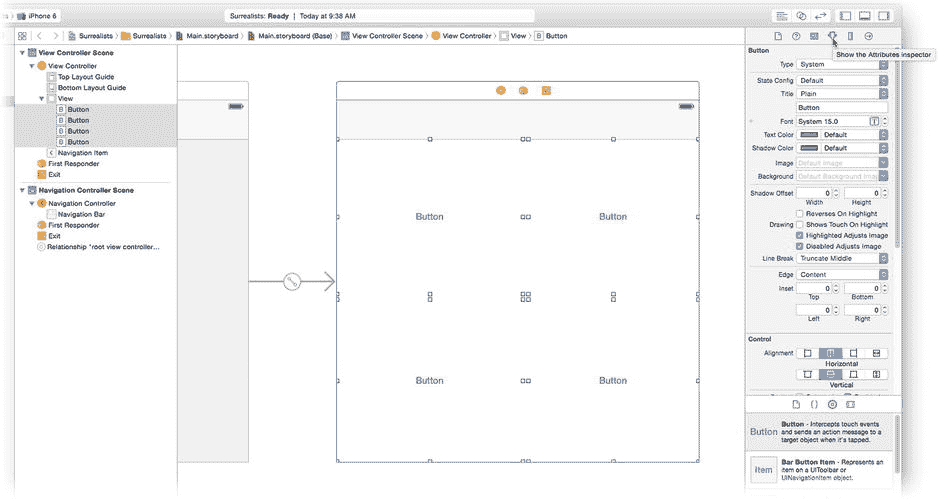

Figure 2-13. 自定义按钮对象

属性检查器用于更改对象（或对象组）的各种属性。检查器中的属性会根据你选择的对象类型而变化。如果你选择了多个对象，检查器会仅显示这些对象共有的属性。

在选中四个按钮的情况下，使用属性检查器进行以下更改：

*   将 Type 更改为 Custom。
*   点击 Font 属性并将其设置为 System Bold 18.0。
*   点击 Text Color 弹出菜单并选择 White Color。
*   找到 Control 组并选择底部的垂直对齐图标。

完成后，你的视图应该看起来像 Figure 2-14 所示。下一步是分别向每个按钮添加一个图像和一个标签。为此，你需要向你的项目添加一些资源。

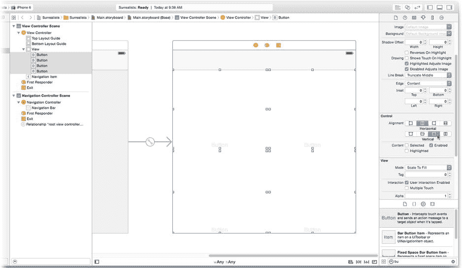

Figure 2-14. 自定义后的按钮

### 添加资源

