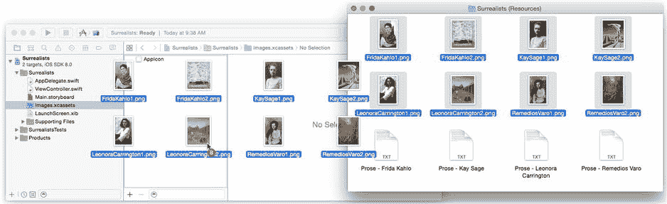
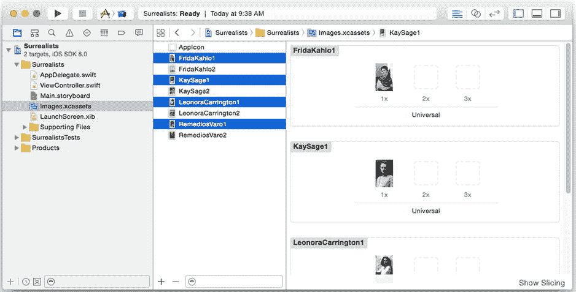

# 资源（Resources）

你的应用运行所需的一切都必须包含在你构建的应用中。如果你的应用需要一张图片，该图片必须包含在其资源中。图片文件、界面构建器文件、声音文件以及其他任何非计算机代码的内容统称为*资源*。

你几乎可以将任何文件作为资源添加到你的应用中。资源文件在应用构建时会被复制到应用的*包（bundle）*中，并在应用运行时可供使用。

`Xcode`有一种特殊的方式来组织常用的媒体资源（如图片），将它们整合到一个称为*资产目录（asset catalog）*的单一资源中。要向资产目录添加新图片，请在项目导航器中选择该目录，如图 2-15 所示。在访达中找到你想要添加的资源文件。你可以在第 1 章中下载的`Learn iOS Development Projects`文件夹里找到这些文件。在`Ch 2`文件夹内，你会找到`Surrealists (Resources)`文件夹，其中包含八个图片文件。保持文件和工作区窗口可见，将这八个图片文件拖拽到资产目录的组列表（左侧）中，如图 2-15 所示。

图 2-15 将资源文件拖拽到资产目录中

这些文件将被复制到你的项目文件夹，添加到项目导航器，并作为资源添加到你的应用中。`Xcode`无法编辑这些文件，但预览窗格（见图 2-16）允许你查看它们的缩略图。

图 2-16 预览图片文件

### 图片资源的分辨率

较旧的`iOS`设备每个界面坐标点显示一个像素。较新的`iOS`设备具有视网膜（Retina）和视网膜高清（Retina HD）显示屏，每个坐标点有两个或三个像素。为了适应这些高密度显示屏，资产目录会组织每个资源图片的多个版本。

在图 2-16 中，请注意每个图片都有`1x`、`2x`和`3x`版本——在此项目中后两个版本是空的。我只为你提供了这些图片的`1x`版本，这足以让应用运行。理想情况下，你还应该包含应用中每个资产图片的`2x`和`3x`版本，这样你的应用在较新设备上看起来会非常清晰。

要添加分辨率，只需准备另外两个图片文件——一个分辨率（像素尺寸）恰好是原图的两倍，另一个是三倍。分别将它们放入`2x`和`3x`的图片槽位中。`Cocoa Touch`的视图类与资产目录协同工作，会自动加载与用户正在运行的设备分辨率匹配的图片版本。你甚至无需编写任何代码。

