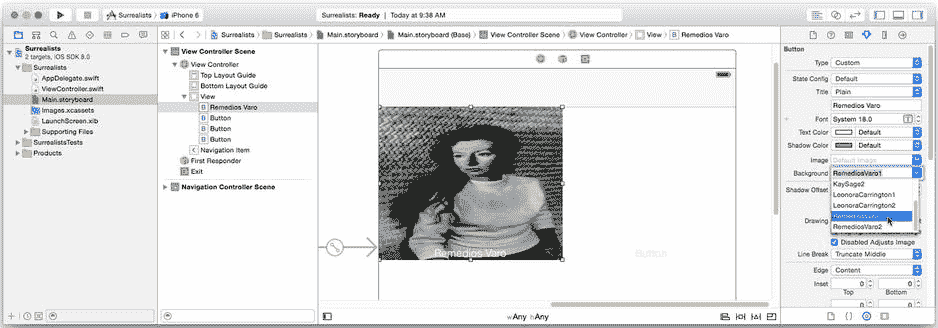
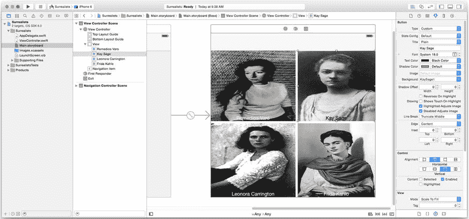

# 自定义按钮（Customizing Buttons）

有了必要的资源文件后，是时候自定义你的按钮了。再次选择`Main.storyboard`文件，并选择左上角的按钮。调出属性检查器（View  Utilities  Show Attributes Inspector），将标题属性更改为`Remedios Varo`，并将背景属性更改为`RemediosVaro1.png`，如图 2-17 所示。

图 2-17 自定义第一个按钮

`background`属性是你希望按钮用作背景的图片的资源名称。你可以直接输入它，但`Xcode`能识别常见的图片类型，并将你刚刚添加的图片资源包含在下拉列表中。只需从该列表中选择文件名即可。

**注意** 背景图片在你的布局中看起来会变形。不用担心；它在运行的应用中看起来会正常。你稍后会明白原因。

自定义其余三个按钮（按顺时针方向操作），设置它们的标题和背景图片如下：

*   `Kay Sage`，`KaySage1.png`
*   `Leonora Carrington`，`LeonoraCarrington1.png`
*   `Frida Kahlo`，`FridaKahlo1.png`

作为收尾工作，选择`Kay Sage`的按钮，并将文本颜色更改为黑色（以便更易阅读）。全部完成后，你的界面应该看起来像图 2-18 所示。

图 2-18 完成后的按钮

