# 使用故事板（Using Storyboards）

故事板通过允许你规划应用的屏幕并定义用户如何在它们之间导航，简化了应用开发。在故事板出现之前，你可以在界面构建器中设计你的屏幕，但每个屏幕都在单独的文件中，并且你必须编写代码来在它们之间切换。代码量不大，也不复杂，但很繁琐。通过故事板，你可以在一个文档中看到所有内容并连接它们——通常无需编写任何代码。

#### 无摩擦开发

重复的代码会拖慢开发进度。你花费在反复编写相同代码上的时间，本可以用来开发酷炫的新功能。你想要的是一种*无摩擦*的开发环境，在这种环境中，简单的任务会为你处理完毕，留下时间让你专注于使你的应用与众不同的部分。

`Apple`致力于让`iOS`和`Xcode`尽可能无摩擦。每个新版本都会添加新的类和开发工具，使开发高质量应用更加容易。例如，在手势识别器引入之前，编写代码来检测多点触控手势（如捏合或三指滑动）是一项复杂的任务，常常需要一页或更多的代码。今天——你可能已经猜到了——你的应用只需在设计界面中放置一个手势识别器对象并将其连接到某个动作，就能检测这些手势。

让我们使用故事板来定义应用的其余屏幕以及用户如何在它们之间导航。

#### 添加新场景

在你可以创建两个屏幕之间的转换（称为*转场（segue）*，发音为“seg-way”）之前，你必须先创建另一个视图控制器（在故事板的术语中称为*场景（scene）*）。返回到对象库，将一个全新的视图控制器对象拖拽到你的`Main.storyboard`文件中，如图 2-19 所示。

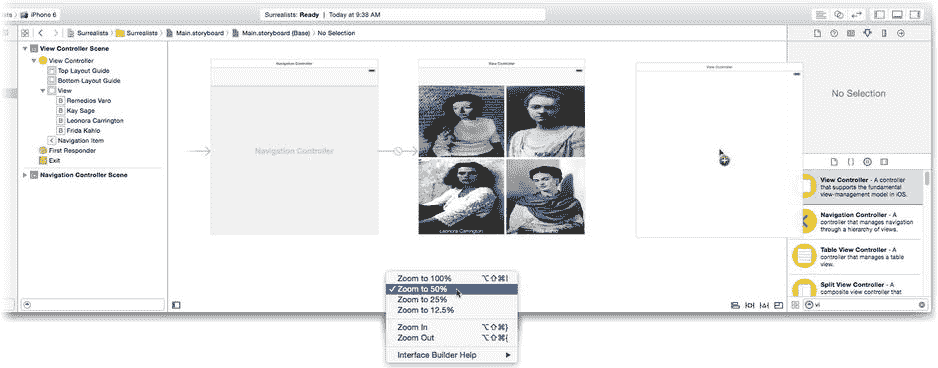

图 2-19 添加一个新的视图控制器

**提示** 有时故事板会有点笨重，尤其是在笔记本电脑这样较小的屏幕上。要获得鸟瞰视图，请通过`Control`+点击或右键点击界面构建器画布的任何空白部分，并选择其中一个缩放命令来缩小，如图 2-19 所示。

在库中找到图片视图对象。将一个图片视图拖拽到空视图中，如图 2-20 所示。

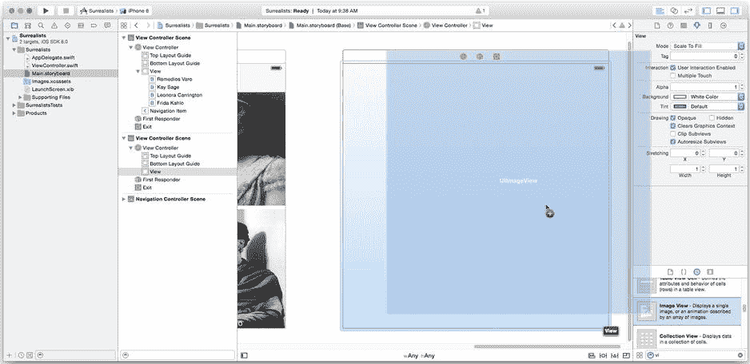

图 2-20 添加一个图片视图对象

如果图片视图对象没有自动吸附以填满整个视图，请拖动它直到填满。保持新的图片视图对象处于选中状态，切换到属性检查器。将`Image`属性更改为`RemediosVaro2.png`，并将图片模式更改为`Aspect Fill`，如图 2-21 所示。

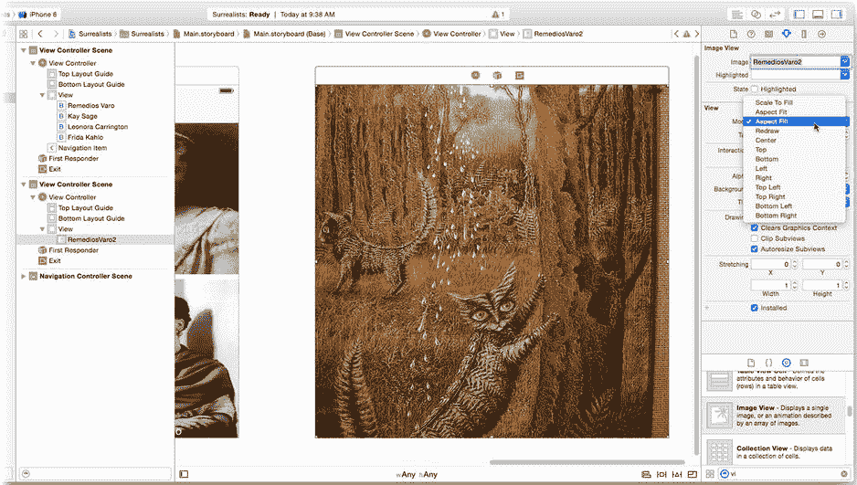

图 2-21 自定义图片视图

现在向此屏幕添加一个滚动文本字段。在库中找到文本视图（注意，不是文本字段！）对象。拖拽一个新的文本视图到窗口中，并使用自动用户界面参考线将其定位在场景的右上角，如图 2-22 所示。

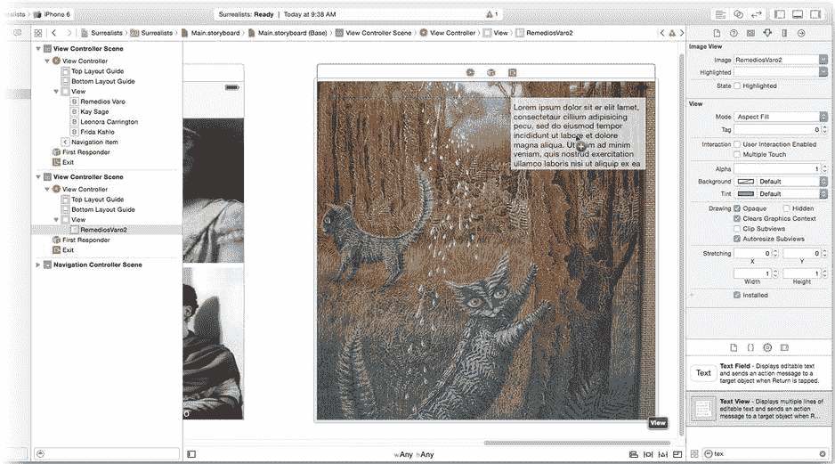

图 2-22. 添加一个文本视图

选中文本视图后，使用属性检查器修改以下属性：

- 将文本颜色设置为白色。
- 将字号缩小至 12.0。
- 取消勾选“可编辑”选项。
- 继续向下，取消勾选“显示水平指示器”。
- 点击“背景颜色”的颜色块（弹出窗口左侧的示例色）。这将打开一个取色器面板。使用灰度滑块选择 50% 灰度，并设置 33% 的 alpha 或透明度（见图 2-23）。

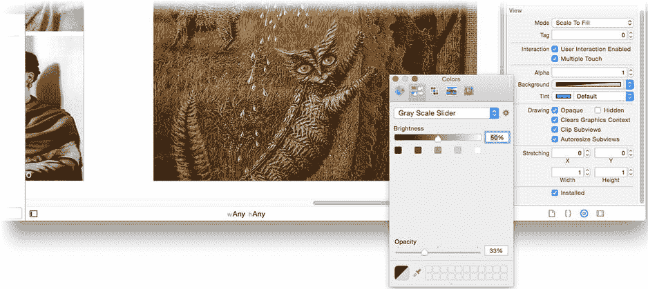

图 2-23. 设置半透明背景颜色

你可以在存放图片文件的 `Surrealists (Resources)` 文件夹中找到该对象的文本。不过，你无需将这些文件添加到项目中。而是打开名为 `Prose - Remedios Varo` 的文件，复制其中的文字，切换回 Xcode，然后使用属性检查器将其粘贴到对象的“文本”属性中，如图 2-24 所示。

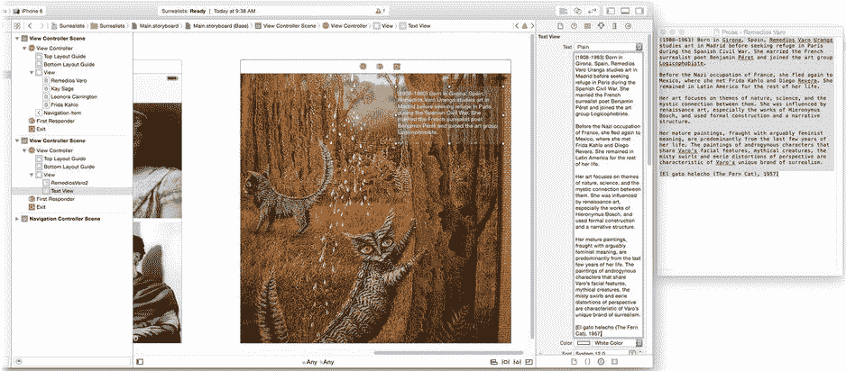

图 2-24. 将文本粘贴到文本字段对象中

#### 创建 Segue

设计好初始场景后，现在需要定义主屏幕与这个屏幕之间的 segue。你希望当用户点击 Remedios Varo 按钮时，这个屏幕能够出现。要创建这个 segue，请按住 Control 键并点击（或右键点击）Remedios Varo 按钮，然后将连接拖拽到新的视图控制器上，释放鼠标，如图 2-25 所示。

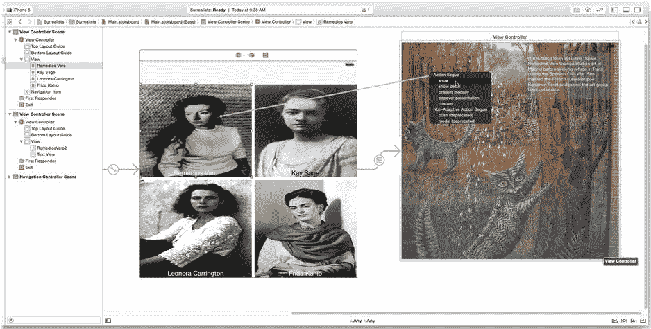

图 2-25. 创建 Segue

释放鼠标按钮后，会弹出一个菜单，显示可能的 segue 类型。选择“Show”（见图 2-25）。当用户点击 Remedios Varo 按钮时，你的 segue 将执行一次“Show”过渡。它与导航控制器配合使用，将新屏幕滑入视图。

#### 设置导航标题

初始的视图控制器本身受你一开始创建的导航控制器对象控制。导航控制器的工作是在导航栏下方呈现一系列视图。你见过无数次的导航栏会显示当前屏幕的标题，并且可选地提供一个返回按钮，让你返回上一个屏幕。导航控制器处理所有这些细节。

当你为第二个屏幕添加了 Show 类型的 segue 后，该屏幕也受导航控制器控制。当 Show 类型的 segue 与导航控制器一起使用时，它会用一个视图替换另一个视图，并使原始视图成为新视图中返回按钮的目标。这种操作称为推送（push）。

为了让用户能理解界面，你需要为每个屏幕设置标题。这样导航栏才会清晰易懂。

在初始视图控制器中选择导航栏，并打开属性检查器。将导航栏的标题改为“Woman Surrealists”，并将返回按钮属性设置为“Surrealists”。大多数带有标题的 Interface Builder 对象都可以通过在画布上双击标题进行编辑，如图 2-26 所示。或者，你也可以选中该对象，在属性检查器中编辑其标题属性，如图 2-26 右侧所示。设置可选的返回按钮属性，将为返回到此屏幕的返回按钮指定一个更简洁的标题。

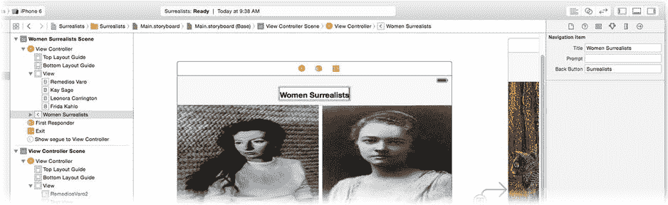

图 2-26. 编辑导航栏标题

最后，选中第二个场景中的视图控制器，将其标题改为“Remedios Varo”，如图 2-27 所示。

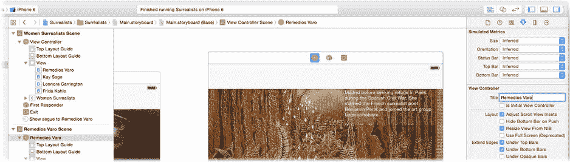

图 2-27. 设置视图控制器的标题

### 测试你的界面

你已经非常有耐心了，但关键时刻终于到来。现在你已经构建了足够的应用内容，可以看看它的实际运行效果了！确保运行目标设置为其中一个 iPhone 模拟器，如图 2-28 所示。

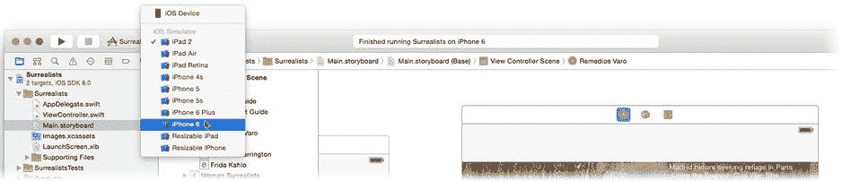

图 2-28. 选择运行目标

点击“运行”按钮。Xcode 将构建你的应用，并在模拟器中启动运行。如果因某些意外原因导致构建出现问题，你可以在问题导航器中找到描述这些问题的消息（View  Navigator  Show Issue Navigator）。

你的应用将出现在 iPhone 模拟器中，看起来应该像图 2-29 左侧所示。

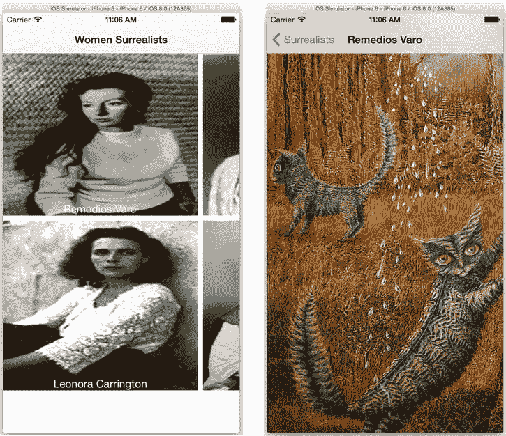

图 2-29. 应用的首次测试

点击左上角的按钮，第二个屏幕便会平滑滑入视图。屏幕顶部会出现一个导航栏，显示屏幕名称和一个返回按钮。点击返回按钮即可返回初始屏幕。你的应用具备 iOS 应用的所有标准行为：触摸界面、标题栏、动画、导航，一切按预期工作。嗯，也不完全是。

### 调试你的应用

你可以运行应用，它——大致上——能按你设计的方式运行。但是，哇，看起来真糟糕！第一个屏幕上的按钮大小不合适，而且其中一些按钮之间还有奇怪的间隙。第二个屏幕显示了画作，但文本视图却不知所踪。这是怎么回事？

我不想这么说，但你的应用有 bug。Bug 通常用来描述计算机代码中的缺陷，但应用行为或操作中的任何缺陷都是 bug，你需要修复它。追踪和修复 bug 的过程称为调试。在这个案例中，问题与视图在不同设备上的调整大小或重新定位有关。问题在于你的界面没有适应 iPhone 的显示尺寸。

**注意** “bug”一词源于一只飞蛾在一台早期的数字计算机中死亡，导致计算机故障。我没开玩笑。在格蕾丝·赫柏的维基百科页面（`http://en.wikipedia.org/wiki/Grace_hopper`）上，有一张这只飞蛾的照片。

iOS 8 引入了一种新的界面设计理念。你不再需要为特定设备设计界面，而是为一种“通用”设备设计一次——就是你一直在 Interface Builder 中处理的那个大方块。它并不代表任何特定设备或任何特定方向。它只是一个用于组织视图的容器。当需要在应用中呈现该视图时，必须让视图适应实际的设备、屏幕尺寸、分辨率和方向。你还没有告诉 iOS 如何做到这一点。

有许多方法可以适配界面，你将在后续章节中探索大部分内容，但首选的工具是自动布局。自动布局基于一组约束来定位和调整视图对象的大小。约束是一条描述视图几何形状某个方面的规则。约束可以像“此视图的高度为 20 点”这样简单。约束也可以相对于其他视图，例如“此视图的左边缘距离那个按钮的右边缘正好 8 点”。创建正确的约束集后，无论用户的设备是大、小、高还是宽，iOS 都能重新组织你的视图。

好的，作为高级文档工程师和翻译员，我会严格遵循您的格式要求，将给定的英文文本翻译成中文。

回 Xcode 并选择你的`Main.storyboard`文件。你需要为界面添加一些约束，使其能够适配 iPhone 的显示屏。

### 添加基本约束

即使是一个仅包含少量视图的“简单”界面，也可能需要十几个或更多的约束才能向自动布局传达你的意图。幸运的是，Xcode 提供了许多智能的方式来添加约束，并且通常只需少许提示就能猜到你需要的约束。

让我们从第二个视图控制器中的图像视图对象（带有猫画作的那个）开始。当你在设计中拖入一个新的图像视图时，Xcode 会猜测你想让它填充整个视图，这个猜测是正确的。无论设备显示屏的尺寸如何，你都需要四个约束来让该图像视图填满整个界面。

-   视图的顶部边缘必须与其父视图的顶部边缘位置相同。
-   视图的左侧边缘必须与其父视图的左侧边缘位置相同。
-   视图的右侧边缘必须与其父视图的右侧边缘位置相同。
-   视图的底部边缘必须与其父视图的底部边缘位置相同。

图像视图的父视图是视图控制器的根视图。（你可以在 Interface Builder 大纲中看到这种关系。）这个根视图的大小始终与视图控制器的显示区域大小一致。即使你尝试改变，也无法更改。根视图的大小成为你可以用来构建约束的第一组常量。当你给自动布局一个约束，比如“图像视图的顶部边缘必须与其父视图的顶部边缘位置相同”时，它会将图像视图的顶部边缘移动到显示屏的顶部。这是它唯一的选择；父视图是不可移动的，因此移动图像视图是唯一的解决方案。有了这四个约束，图像视图的大小将始终与其父视图完全相同。

在画布区域的右下角，你会找到四个控件（也显示在图 2-30 中）。它们从左到右依次是：

-   对齐约束
-   间距约束
-   解决自动布局问题
-   重新定位约束首选项

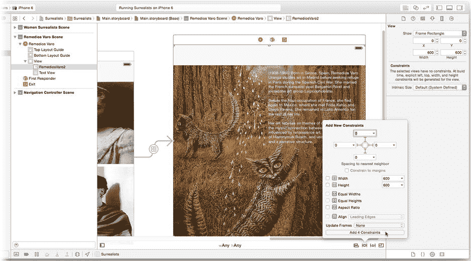

**图 2-30.** 为图像视图添加边缘约束

选中图像视图后，点击间距约束控件（左数第二个）。间距约束控件允许你添加常见的约束，这些约束可以表示固定的尺寸或到另一个视图的固定距离。在弹出的面板中（见图 2-30），首先取消勾选“约束至边距”选项。边距适用于从边缘缩进的内容，此处不适用。点击支架以添加上、左、右、下的距离约束，并将它们全部设置为 0（也见图 2-30）。如果任何默认值不是 0，请将其改为 0。点击“添加 4 个约束”按钮。

保持图像被选中状态，在实用工具区域中打开大小检查器（视图 > 实用工具 > 显示大小检查器）。大小检查器会显示与此视图相关的所有约束。你可以看到，Xcode 添加了四个新约束：顶部空间、前导空间、尾部空间和底部空间。这些就是先前列出的四个约束。恭喜你，图像视图的约束已经添加完成了。

**注意** 视图的左右边缘也可以称为*前导*和*尾部*边缘。当用户的语言是从左到右阅读（例如英语）时，前导边缘就是左侧边缘。如果用户的语言是从右到左阅读（例如希伯来语），前导边缘就是右侧边缘。这允许约束为从右到左的读者反转视图的布局和对齐。Xcode 更喜欢创建前导/尾部约束，但如果你的布局不应为从右到左的语言进行转置，你可以将它们改为左/右边缘约束。

### 添加缺失的约束

现在尝试一组稍微不同的约束。将文本视图向下拖动一点，并将其定位，使其“吸附”到人机界面指南附近，靠近右侧边缘，并位于顶部导航栏占位符的正下方，如图 2-31 所示。

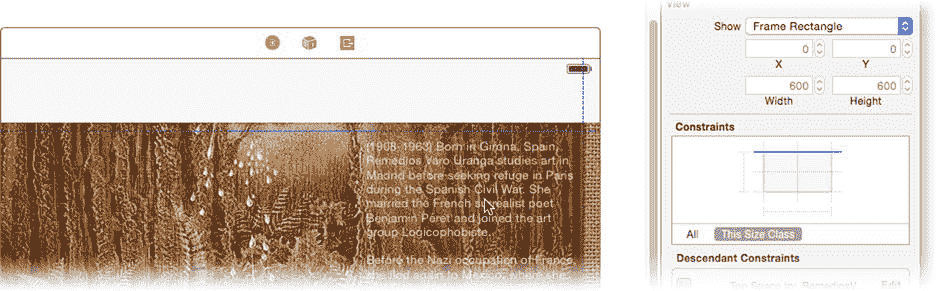

**图 2-31.** 重新定位文本视图

**提示** 在添加约束时，我建议将视图尽可能放置到接近其最终布局的位置。Xcode 可以轻松地为你设计中已存在的关系定义约束。

保持文本视图为选中状态，再次选择间距约束控件（左数第二个）。这次，添加一个 270 点的高度约束和一个 230 点的宽度约束，如图 2-32 左侧所示。点击“添加 2 个约束”按钮。

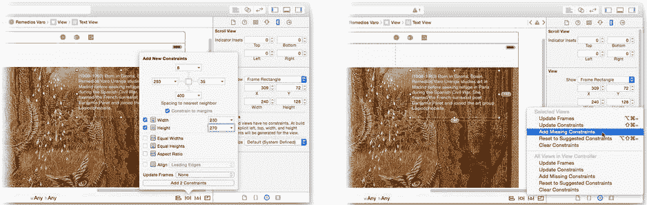

**图 2-32.** 添加尺寸约束

保持文本视图为选中状态，选择解决自动布局问题控件（左数第三个按钮），然后选择“添加缺失的约束”命令，如图 2-32 右侧所示。如果你首先将视图定位到它们在布局中应有的位置，Xcode 通常能推断出你的视图需要哪些约束。通过使用顶部和右侧布局向导来定位文本视图，Xcode 正确地猜到你希望将顶部和尾部边缘约束附加到顶部布局向导和右边距。如果你的布局意图很明显，“添加缺失的约束”命令将为你节省大量时间。

布局对象是特殊的视图对象，仅用于辅助约束。每个对象代表视图中可用内容开始的位置。某些视觉元素位于视图控制器之外，比如通常位于 iPhone 屏幕顶部的状态栏。然而，某些视觉元素会被插入到你的视图中，比如当你的视图呈现时，导航控制器会添加的导航栏。在这些情况下，顶部和底部布局向导会移动以适应新的元素。使你的视图相对于这些向导进行布局，可以保持它们可见且位置整齐。

**提示** 如果你的视图消失在导航栏或搜索栏下方，请确保你是在对齐到顶部布局向导，而不是另一个视图的边缘。

### 编辑约束对象

现在花点时间看看你的设计发生了哪些变化，如图 2-33 所示。约束是对象，它们在 Interface Builder 中以几种不同的方式出现。选择一个视图，与该视图关联的约束会同时出现在大小检查器（图 2-33 右侧）和画布中。距离和尺寸约束显示为支架，而对齐和零长度距离约束则显示为直线。

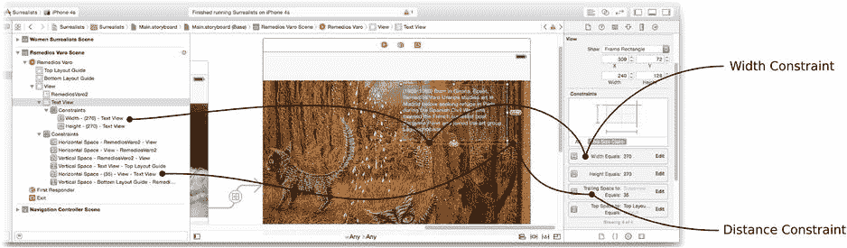

**图 2-33.** 检查视图约束

好的，作为高级文档工程师和翻译员，我将严格遵循注意事项和示例，将给定的英文文本翻译成中文。

你可以在画布中选择一个约束——尽管这可能需要稳定的鼠标操作，因为它们可能非常小。约束对象也可以在轮廓中选中（如图 2-33 左侧所示）。使用属性检查器编辑选定的约束，或者在大小检查器（Size inspector）中找到该约束并点击其编辑按钮。

设计中有些约束会显示为橙色并附有一个数字。这表示 Xcode 告诉你，设计中对象的大小或位置与约束不符。该数字表示 Xcode 希望调整你的视图多少点（point）以使其一致。具体来说，你给文本视图添加了一个 270 点宽的约束，但画布中的文本视图宽度并不是 270 点。当你运行应用时，该文本视图*将*是 270 点宽，因为这是约束的要求。如果你想在设计中也看到同样大小的文本视图，请从“解决自动布局问题”（resolve auto-layout issues）控件中选择`Update Frames`命令，如图 2-34 所示。这些警告纯粹是提示性的——忽略它们不会改变应用的运行方式。

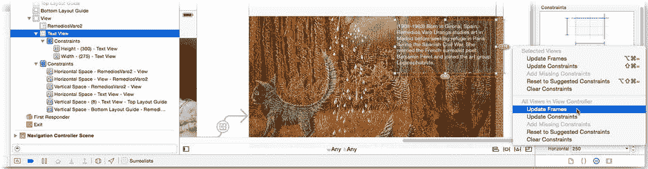

图 2-34。更新框架以匹配其约束

**注意** 如果你的约束不足或存在冲突，这些约束会（以红色）显示在对象轮廓中。

让我们来试试你已经添加的约束。再次运行你的应用，如图 2-35 所示，使用 iPhone 6 模拟器。初始屏幕仍然很丑——这并不意外。点击 Remedios Varo 按钮。这次，你将拥有一个美观且可用的界面，如图 2-35 中间所示。

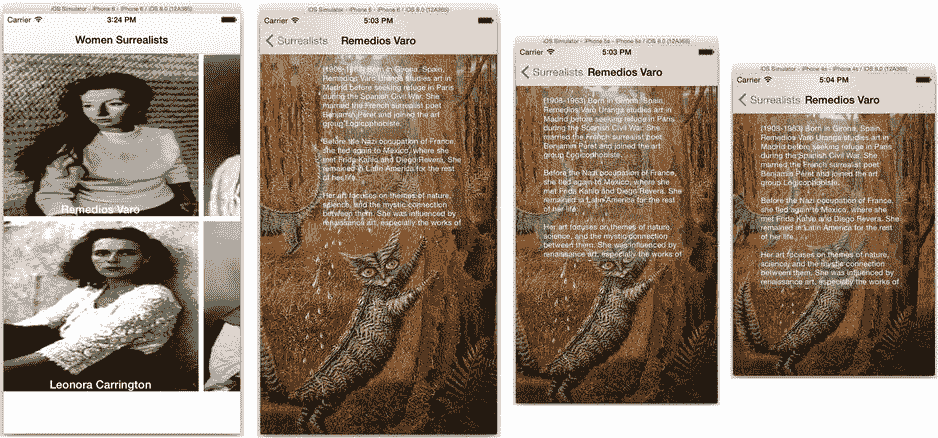

图 2-35。测试约束

更重要的是，如果你使用 iPhone 5s 和 iPhone 4s 模拟器再次运行应用，你的界面在这些设备上看起来也还不错，如图 2-35 右侧所示。现在让我们修复那些按钮。

### 添加关系约束

这些按钮提出了更大的挑战。你希望它们填满界面，并且均匀平铺。填满界面听起来很像你刚刚添加到图像视图上的约束。而在它们的内边缘之间添加一些间距约束，应该能使它们紧密排列并平铺。听起来是个好计划。

幸运的是，你可以一步创建所有这些约束。你本质上希望所有四个按钮具有相同的约束：顶部、左侧、右侧和底部边缘应紧贴最近的视图或界面边缘。选中所有四个按钮，然后点击固定约束控件（Pin constraints control），如图 2-36 所示。

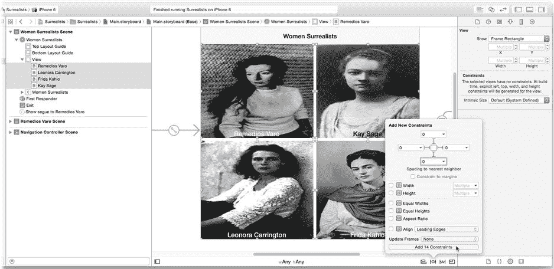

图 2-36。固定按钮

再次，取消选中`Constrain to Margins`选项。点击支柱（struts）为所有四个视图添加上、左、右、下的距离约束。编辑距离值，使它们都为 0，如图 2-36 所示。点击`Add 14 Constraints`按钮。

*瞧*！完成了，对吧？尝试从“解决自动布局问题”控件中选择`Update Frames`命令。你可能会得到类似图 2-37 的结果。

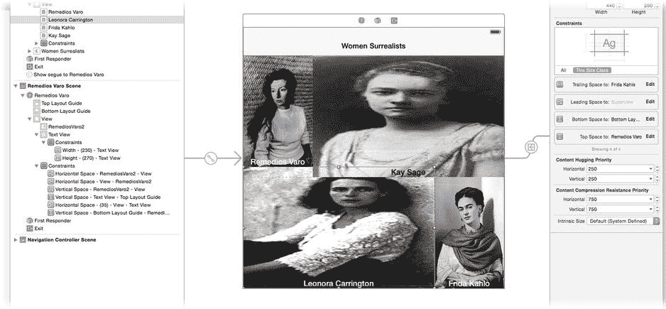

图 2-37。一个不可接受的布局解决方案

有点滑稽的是，图 2-37 中的布局满足了所有约束，但显然不是你想要的。你需要更多或不同的约束才能得到所需的几何形状。思考这个问题，你希望所有四个按钮的大小相同——而且正好有一个用于此目的的约束。

选中顶部两个按钮，再次点击固定约束控件。当选中多个视图时，`Equal Widths`（等宽）约束变为可用，如图 2-38 所示。勾选`Equal Widths`约束，然后点击`Add 1 Constraints`按钮。你现在添加了一个约束，告诉自动布局这两个视图的宽度应该相同，无论具体是多少。

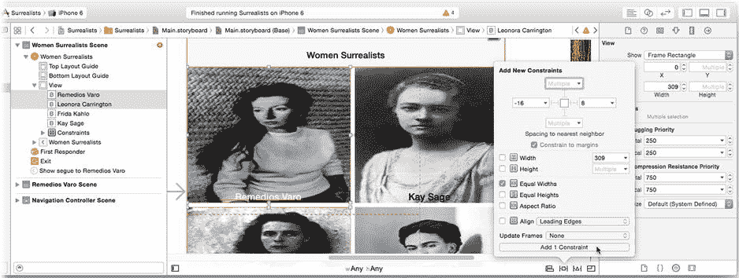

图 2-38。添加等宽约束

现在对底部两个按钮重复此操作。继续这个模式，选中左侧两个按钮并添加等高（Equal Heights）约束。对右侧两个按钮重复此操作。

再次运行你的应用。现在一切看起来都符合预期，如图 2-39 所示。即使在不同的设备上，这些按钮也会根据可用显示区域对齐和调整大小。

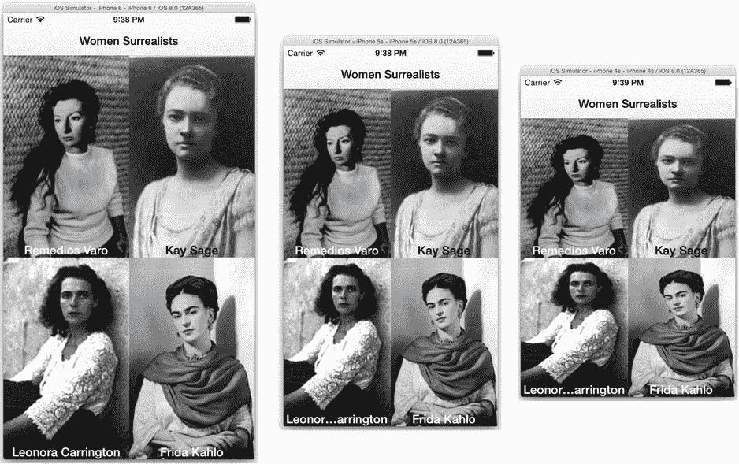

图 2-39。使用约束平铺的按钮

这不是解决这个问题的唯一方法。事实上，我能想到至少五组不同的约束可以实现相同的布局。就像编程一样，没有哪一组约束是“正确”的。某些约束集可能比其他约束集更优雅，但最终它们要么有效，要么无效。关于约束说得够多了，让我们来收尾这个应用。

### 完成你的应用

返回到 Xcode 工作区窗口，点击工具栏中的`Stop`按钮停止你的应用。你可以通过为其他三位艺术家重复“添加新场景”部分中的步骤来完成应用。但这对我来说听起来太像工作了。

选择 Remedios Varo 的视图控制器并将其复制到剪贴板，如图 2-40 所示。点击画布的空白区域（以取消选中任何对象）并粘贴三份视图控制器的副本。排列它们使其不重叠。

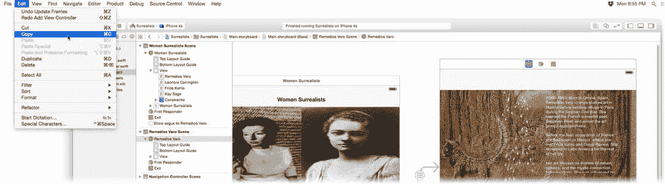

图 2-40。复制第一个视图控制器

视图控制器中的所有内容都被复制了。没有被复制的是视图控制器之外的对象和连线（segues）。通过`Control`+点击或右键点击其他按钮，并将每个按钮连接到新的视图控制器之一，再创建三个连线，如图 2-41 所示。和之前一样，选择显示连线（show segue）。

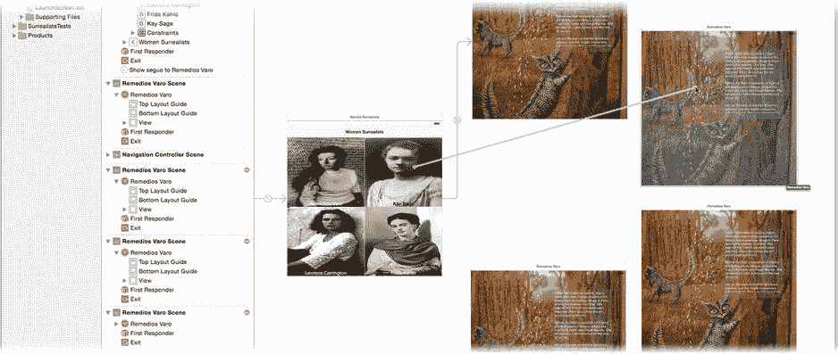

图 2-41。将按钮连接到新的视图控制器

现在，用与之关联的艺术家的信息编辑新控制器的内容。从连接到`Key Sage`按钮的场景开始。按如下方式编辑其内容：

1.  选中图像视图，将其`Image`属性更改为`KeySage2`。
2.  找到`Prose – Kay Sage`文本文件，将文本复制到文本视图对象中。
3.  选中视图控制器对象，将其标题更改为`Kay Sage`。

对其余两个视图控制器重复此操作，使用与所连接按钮相对应的图像、文本和标题。完成后，你的设计应如图 2-42 所示。

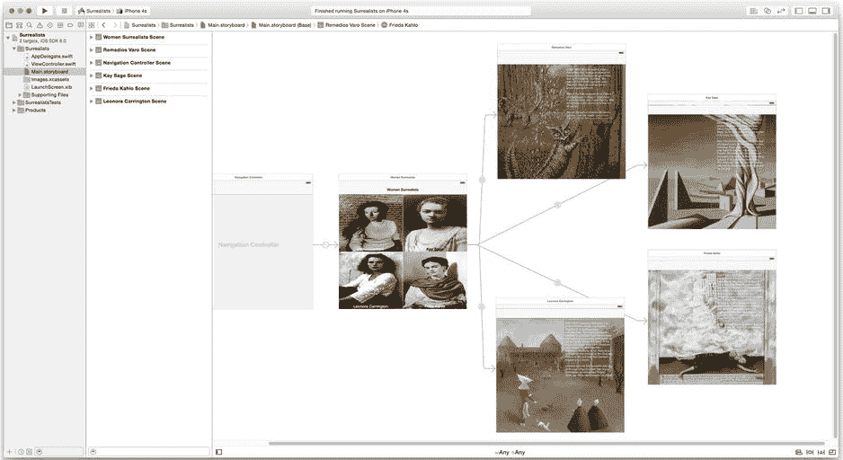

图 2-42。完成的应用设计

现在运行你的应用，确保一切正常，如图 2-43 所示。

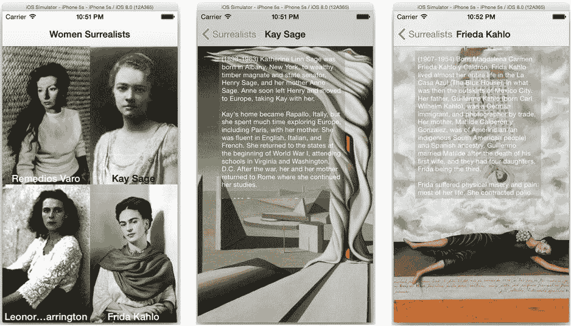

图 2-43。可运行的超现实主义应用

这是一个相当简单的应用，但在宣布完成之前，你仍然需要测试许多内容。

- 检查所有屏幕布局在不同设备上是否美观。
- 确保每个按钮都能正确跳转到对应的屏幕。
- 测试文本是否正确且可以滚动。
- 检查所有标题。

一切正常？那么你的第一个 iOS 应用就成功了！

