# 旋转网页

活动一下你的编码手指。本章将向你介绍 iOS 应用开发的一些核心技能，以及大量的 Swift 代码。你在本章中创建的应用以及将要采取的步骤，是构建 iOS 应用的典型方式。从这个角度来看，这将是你第一个“真正的”iOS 应用。

你已经学会了使用 Interface Builder 向应用添加库对象、自定义它们并建立连接。在本章中，你将执行以下操作：

- 自定义一个 Swift 类
- 使用 Swift 为你自定义的类添加 `outlet` 和 `action`
- 使用 Interface Builder 将这些 `outlet` 连接到对象
- 使用 Interface Builder 将对象连接到你的自定义 `action`
- 通过将库对象连接到 `delegate` 来改变其行为

你要构建的应用是一个 URL 缩短应用。这个应用依赖于许多可用的 URL 缩短服务之一。这些服务接收任意长度的 URL，并生成一个更短的 URL，这在阅读、电话口述或在推特中使用时要方便得多。URL 缩短服务的工作原理是记住原始 URL。当世界上任何人试图加载这个短 URL 对应的网页时，该服务会返回一个*重定向*响应，将浏览器引导至原始 URL。

为了制作这个应用，你将学习如何在其中嵌入一个网页浏览器——这是一个有多种用途的技巧。它还将向你展示如何以编程方式从你的应用发送和接收 HTTP 请求，这是创建使用互联网服务的应用的有用工具。

> **注**：对于计算机程序员来说，*编程方式（programmatically）* 一词的意思是“通过编写计算机代码”。这意味着你通过使用诸如 Swift 之类的计算机语言编写指令来完成某事，而不是通过其他任何方式。例如，Interface Builder 允许你通过在两个对象之间拖拽一条线来连接它们。你也可以编写 Swift 代码来连接这两个相同的对象。如果你使用了后一种方法，你可以说你是“以编程方式设置了连接”。

#### 设计

这个应用需要一些基本元素。用户需要一个输入和编辑 URL 的字段。内置一个网页浏览器会很好，这样他们可以查看该 URL 的页面，并点击链接跳转到其他 URL。还需要一个按钮将长 URL 转换为短 URL，以及一个显示缩短后 URL 的地方。

这个设计并不特别复杂，所有内容应该能轻松地放在一个屏幕上，如图 3-1 的草图所示。让我们再加入一个额外功能：一个用于将缩短后的 URL 复制到 iOS 剪贴板的按钮。现在，用户可以方便地将缩短后的 URL 粘贴到其他应用中。

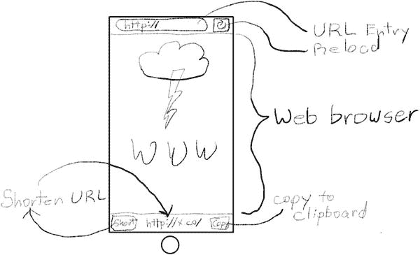

*图 3-1. Shorty 应用草图*

你的应用将在所有 iOS 设备上运行，并且同时支持竖屏和横屏方向。现在你已经有了基本设计，是时候启动 Xcode 并开始动手了。

### 创建项目

与任何应用一样，首先在 Xcode 中创建一个新项目。这是一个单屏幕应用，所以显而易见的选择是 `Single View Application` 模板。

填写项目详细信息，如图 3-2 所示。将项目命名为 `Shorty`，将语言设置为 `Swift`，并为设备选择 `Universal`。

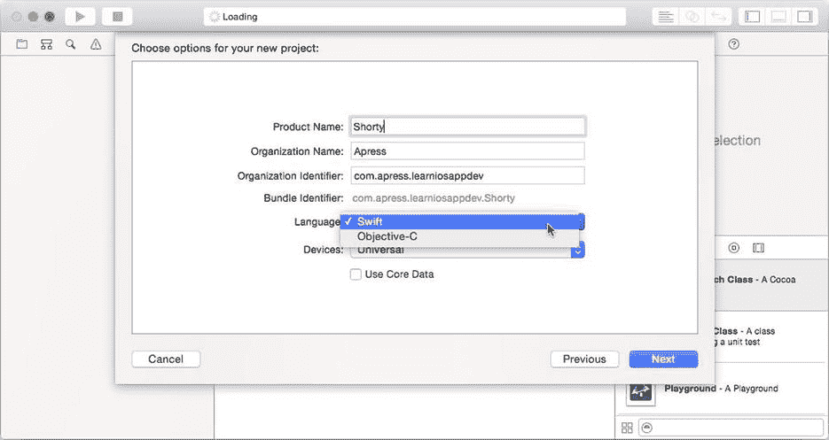

*图 3-2. Shorty 项目详细信息*

点击 `Next` 按钮。选择一个位置来保存你的新项目，然后点击 `Save`。

### 构建网页浏览器

首先构建应用的网页浏览器部分。这将由一个文本字段（用户在此输入他们想要访问/转换的 URL）和一个显示该页面的网页视图组成。让我们再加一个刷新按钮，用于重新加载当前 URL 的页面。

在导航器中选择 `Main.storyboard` 文件。在对象库中，找到 `Navigation Bar` 对象并将其拖入视图，靠近顶部，如图 3-3 所示。导航栏对象通常由导航控制器创建，用于显示标题、返回按钮等。你在 Surrealist 应用中已经见过。不过，这里你将单独使用一个。

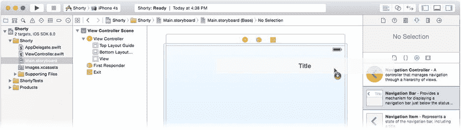

*图 3-3. 添加导航栏*

将导航栏定位为视图的全宽。确保它仍处于选中状态，然后点击画布右下角的“Pin 约束”控件（四个按钮中的第二个）。在“Pin 约束”弹出窗口中，点击以设置顶部、左侧和右侧边缘约束，如图 3-4 所示。

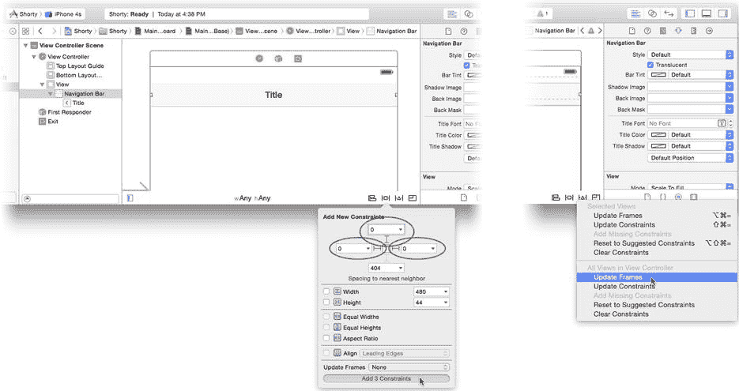

*图 3-4. 为导航栏添加约束*

确保所有三个约束的值都是 `0`。这告诉 iOS 将导航栏定位在屏幕顶部的推荐位置（就在系统状态栏下方），并且它将是显示器的全宽。点击 `Add 3 Constraints` 按钮。如图 3-4 右侧所示，点击“解决自动布局问题”控件（四个按钮中的第三个），然后选择 `Update Frames` 命令。这将根据你刚设置的约束在 Interface Builder 中重新定位视图。

现在添加网页视图。在库中找到 `Web View` 对象，并将其拖入屏幕的下半部分。移动并调整网页视图的大小，使其恰好填满视图的其余部分——从导航栏到屏幕底部，如图 3-5 所示。

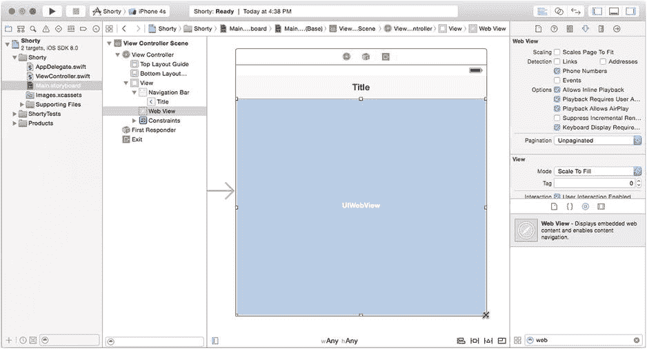

*图 3-5. 添加网页视图*

再次点击“解决自动布局问题”控件，但这次选择 `Add Missing Constraints in View Controller`。Interface Builder 会使用你已建立的约束，并填充任何额外的约束，以在所有设备上建立此布局。

在库中找到 `Bar Button Item` 对象，并将其拖入导航栏的右侧，如图 3-6 所示。栏按钮项是专门为放置在导航栏或工具栏中而设计的按钮对象。

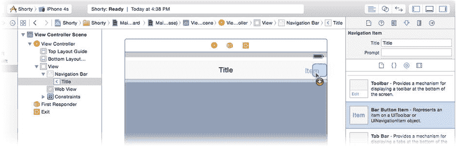

*图 3-6. 向导航栏添加按钮*

放置好后，选中它。切换到属性检查器，将新按钮的 `Identifier` 设置改为 `Refresh`（见图 3-7）。按钮的图标将变为一个圆形箭头。

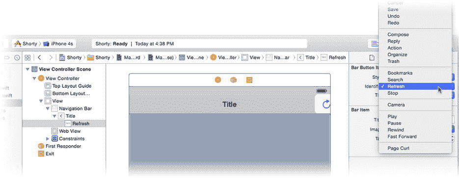

*图 3-7. 将按钮标识符改为 Refresh*


### 图 3-7. 在导航栏中创建刷新按钮

在库中找到文本字段（注意不是文本视图！）对象，并将其拖入导航栏中央。该对象会替换通常显示的默认标题。抓住右侧或左侧的调整大小手柄，拉伸该字段使其填满导航栏中的大部分空闲空间，如图 3-8 所示。

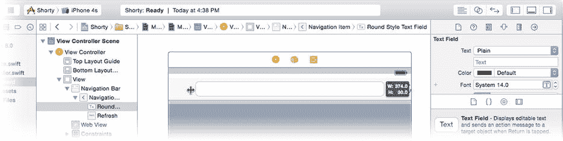

### 图 3-8. 调整 URL 字段大小

用户将在该字段中输入他们的 URL。对其进行配置，使其针对输入和编辑 URL 进行优化。选中新的文本字段对象，然后使用属性检查器更改以下属性：

*   将 `text` 设置为 `http://`。
*   将 `Placeholder Text` 设置为 `http://`。
*   将 `Clear Button` 更改为 `Appears while editing`。
*   将 `Correction` 更改为 `No`。
*   将 `Keyboard Type` 更改为 `URL`。
*   将 `Return Key` 更改为 `Go`。

这些设置将字段的初始内容设为 `http://`（这样用户就不必输入它），如果用户清除了该字段，一个半透明的 `http://` 会提示他们输入一个网页 URL。关闭拼写校正功能是合适的（URL 并非口语）。当键盘出现时，它会针对 URL 输入进行优化，并且键盘上的 Return 键将显示单词 *Go*，表示用户点击该键时将会加载 URL。

你已经创建并布局了你的网页浏览器的所有可视化元素。现在你需要编写一些代码来连接这些部分，使它们协同工作。

### 编码一个网页浏览器

在项目导航器中选择 `ViewController.swift` 文件（见图 3-9）。该文件定义了你的 `ViewController` 类。这是一个你创建的自定义类——好吧，严格来说，它是由项目模板为你创建的，但你可以将其归功于自己。我不会告诉别人的。你的 `ViewController` 对象的工作是增强功能并管理其所连接的视图对象的交互。你的应用程序只有一个视图，因此你只需要一个视图控制器。

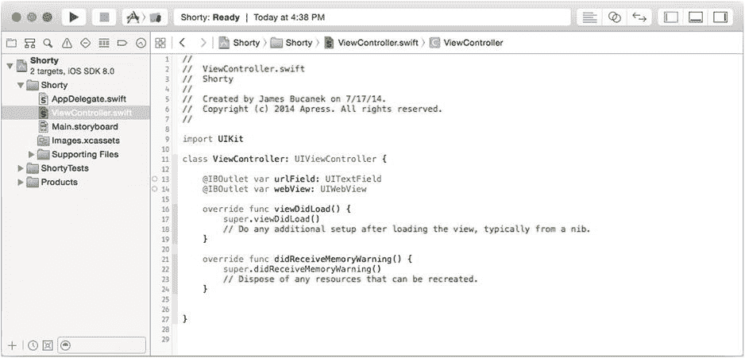

### 图 3-9. 向 `ViewController.swift` 添加属性

不同的对象在你的应用程序中扮演着不同的角色。这些角色将在第 8 章中进行解释。当你向应用程序添加代码时，你需要决定将其添加到哪个类中。这个应用很简单；你将把所有自定义内容添加到 `ViewController` 类中。

> **提示**: *类*和*对象*这两个术语让你困惑了吗？请阅读第 6 章的前半部分以获取解释。

你的 `ViewController` 类是 `UIViewController` 类的一个子类，`UIViewController` 由 Cocoa Touch 框架定义。这意味着你的 `ViewController` 类继承了 `UIViewController` 的所有特性和行为——这很多，因为 `UIViewController` 相当复杂。如果你什么都不做，你的 `ViewController` 对象的行为将与任何其他 `UIViewController` 对象完全一样。

乐趣在于编辑 `ViewController.swift` 以添加新功能或更改其继承的行为。

### 向 `ViewController` 添加输出口

首先，向 `ViewController` 添加两个新属性。一个*属性*定义了一个与对象关联的值。在其最简单的形式中，它仅仅是创建了一个对象会记住的新变量。将这些属性添加到 `ViewController.swift` 中（新代码以粗体表示）：

```
class ViewController: UIViewController {
    @IBOutlet var urlField: UITextField!
    @IBOutlet var webView: UIWebView!
```

完成后，你的类定义应类似于图 3-9 中的那个。那么，这一切都意味着什么呢？让我们详细分析这些声明：

*   `@IBOutlet` 是一个重要的关键字，使该属性在 Interface Builder 中显示为*输出口*。
*   `var` 定义一个*变*量属性。
*   `urlField`/`webView` 是该属性的*名称*。
*   `UITextField`/`UIWebView` 是该属性的*类型*。在这种情况下，它指的是该属性所存储对象的类。
*   `!` 表示它是一个可选变量，但假定其包含一个有效的对象引用。可选类型将在第 20 章中解释。

通过将这些属性添加到 `ViewController`，你使得任何 `ViewController` 对象都可以直接连接到一个文本字段对象（通过其 `urlField` 属性）和一个网页视图对象（通过其 `webView` 属性）。

你已经定义了连接到其他两个对象的可能性，但还没有连接它们。为此，你将使用 Interface Builder。

### 连接自定义输出口

点击项目导航器中的 `Main.storyboard` 文件。在侧边栏或视图上方的 Dock 中找到并选择视图控制器对象，两者都如图 3-10 所示。

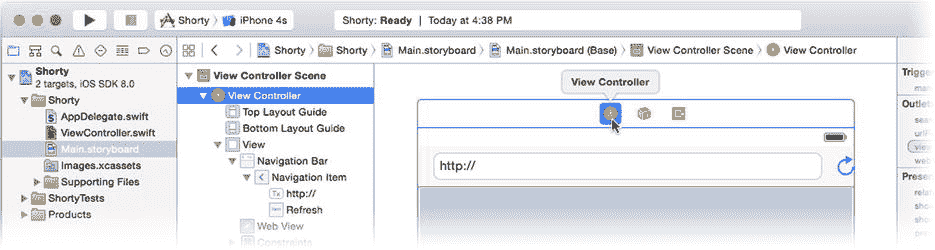

### 图 3-10. 为场景选择视图控制器对象

在大多数情况下，iOS 中的屏幕由一个视图控制器对象和一组视图对象定义。当需要显示该屏幕时，iOS 会从 `.storyboard` 文件中读取信息，并使用该信息来构建该场景中所有对象的新实例。除了创建对象之外，它还会使用你设置的输出口和连接来连接这些对象。完成后，你的视图控制器及其所有视图对象都已被创建、初始化并连接好。

> **注意**: 如果你不能立刻理解这个概念，请不要担心。Interface Builder 优雅而简单，但大多数人需要一段时间才能完全掌握其工作原理。请查看第 15 章以深入了解 Interface Builder 是如何施展其魔法的。

到目前为止，你已经将对象添加到场景中，但尚未连接它们。现在就来做这件事。选择视图控制器对象并显示连接检查器。在其中，你将看到刚刚添加到 `ViewController.swift` 的 `urlField` 和 `webView` 属性。它们之所以出现在 Interface Builder 中，是因为你在属性声明中包含了 `@IBOutlet` 关键字。

将连接圆圈拖到 `urlField` 的右侧，并将其连接到导航栏中的文本字段，如图 3-11 所示。现在，当加载 `ViewController` 场景时，你的视图控制器对象的 `urlField` 属性将引用界面中的文本字段。很酷，对吧？

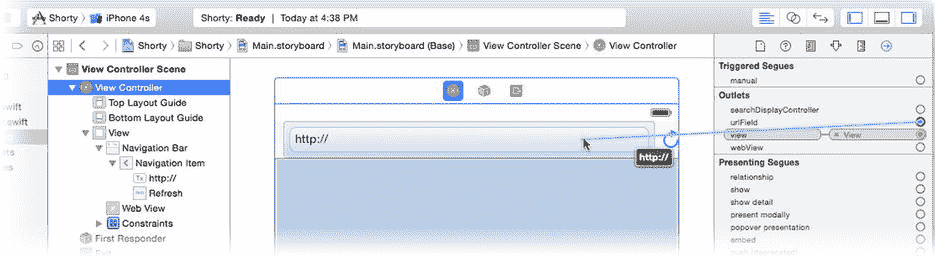

### 图 3-11. 将输出口连接到对象

另一种方便的设置连接方法是 Control+拖动或右键+拖动从具有连接的对象到你想要连接的目标对象。按住 Control 键，点击视图控制器对象（无论是在侧边栏中还是场景顶部），然后向下拖动到网页视图对象，如图 3-12 所示。

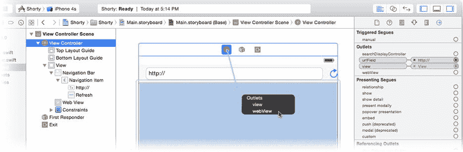

### 图 3-12. 连接网页视图输出口

当你释放鼠标按钮时，会弹出一个菜单，要求你选择要设置哪个输出口。选择 `webView`。

### 向 `ViewController` 添加操作


