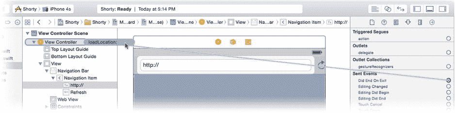
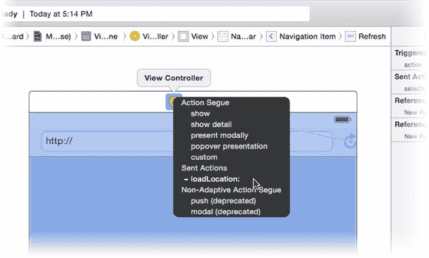
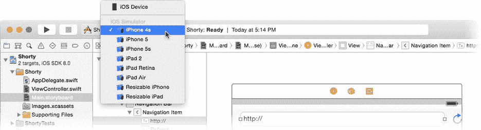
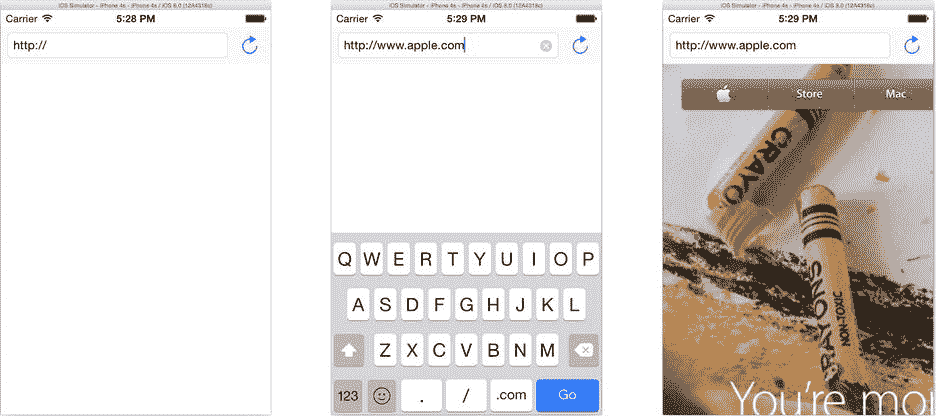
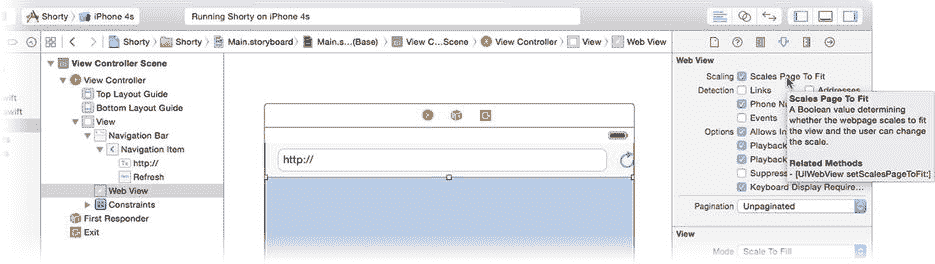
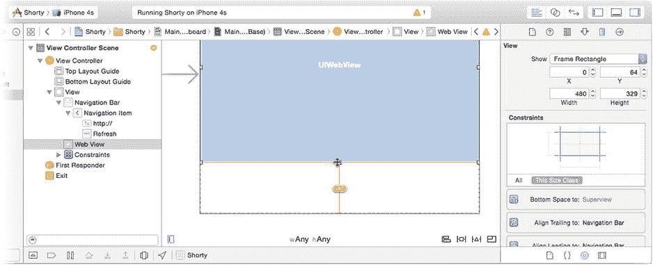
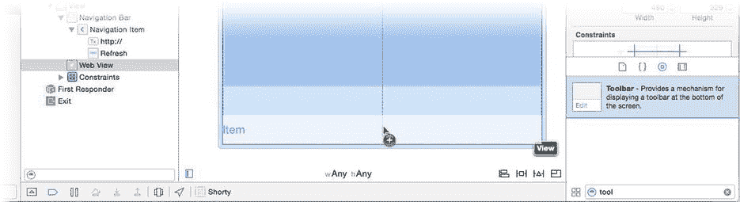
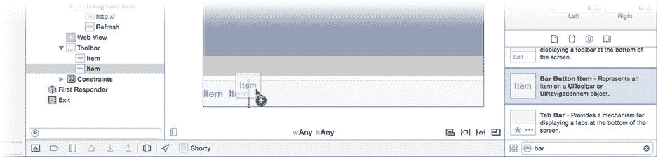
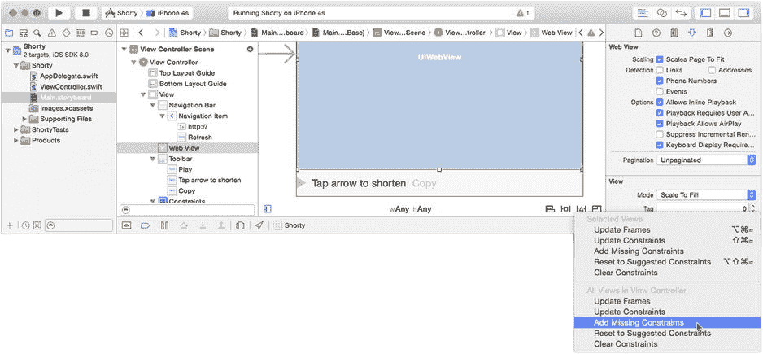
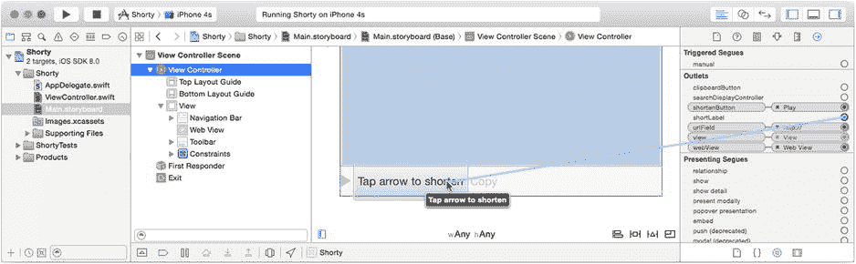

# 为何要创建 Outlet 并连接它们？

你的控制器对象需要获取用户输入的 URL 值，并将其传递给网页视图对象，以便网页视图知道要加载哪个 URL。你的视图控制器对象在此扮演了联络员或管理者的角色，从一个对象（文本字段）获取数据，并将任务分配给另一个对象（网页视图）。现在你明白为什么它被称为*控制器*了吧？

这是一个简单的任务，但需要编写一些代码来实现。在项目导航器中选择 `ViewController.swift` 文件。在项目模板包含的现有函数之后、类声明的结束花括号 `}` 之前，添加这个新函数：

```
func loadLocation( AnyObject ) {
    var urlText = urlField.text

    if !urlText.hasPrefix("http:") && !urlText.hasPrefix("https:") {
        if !urlText.hasPrefix("//") {
            urlText = "//" + urlText
        }
        urlText = "http:" + urlText
    }

    let url = NSURL(string: urlText)
    webView.loadRequest(NSURLRequest(URL: url))
}
```

这个函数完成一个简单的任务：加载用户在 URL 栏中输入的网页。这需要三个基本步骤。

1.  获取用户在文本字段中输入的字符串字符。
2.  将该字符串字符转换为 URL 对象。
3.  请求网页视图对象加载该 URL 的页面。

以下是这段代码的解析：

```
var urlText = urlField.text
```

第一行声明了一个名为 `urlText` 的新字符串对象变量，并将其赋值为该对象的 `urlField` 属性的 `text` 属性值。`urlField` 属性就是你刚刚添加到这个类的属性。你的 `urlField` 引用的是界面中的 `UITextField` 对象，因为你在 Interface Builder 中连接了它。一个 `UITextField` 对象有一个 `text` 属性，其中包含当前字段中的字符——无论是用户输入的还是你通过编程方式放入的。（看，我又用了*编程方式*这个词）。

**提示**：要查看任何类或常量的文档，请按住 Option 键，然后单击（快速查看）或双击（完整文档）其名称。要查看 `UITextField` 类的属性和函数，请按住 Option 键并双击 `.swift` 文件中的 `UITextField` 一词。

任务的第一部分已经完成；你已经使用定义并连接的 `urlField` 属性获取了 URL 的文本。接下来的几行代码可能看起来有点奇怪。

```
if !urlText.hasPrefix("http:") && !urlText.hasPrefix("https:") {
    if !urlText.hasPrefix("//") {
        urlText = "//" + urlText
    }
    urlText = "http:" + urlText
}
```

如果你熟悉 Swift，请仔细看看这段代码。它对你的应用来说并非关键；即使删掉它，你的应用也能正常工作。不过，它确实为用户提供了一个便利。它会检查用户输入的字符串是否以 `http://` 或 `https://` 开头，即网页的标准协议。如果缺少这些标准 URL 元素，这段代码会自动插入一个。

计算机往往比较死板，但你的应用应该宽容且友好。前面的代码允许用户只输入 `www.apple.com`（例如），而不是正确的 `http://www.apple.com`，页面仍然会加载。这样讲得通吗？我们继续往下看。

面向对象编程的核心在于将事物的复杂性封装在对象中。虽然一个字符串对象可以表示 URL 的字符，但它仍然只是一个字符串（一组字符）。大多数处理 URL 的函数期望的是 URL 对象。在 Cocoa Touch 中，URL 对象的类是 `NSURL`。如何将从文本字段获取的 `String` 转换为可以在网页视图中使用的 `NSURL`？我想你会问这个问题。

```
let url = NSURL(string: urlText)
```

这行代码从一个字符串对象创建了一个新的 URL 对象。在 Swift 中，你可以使用对象的类名（`NSURL`）后跟一对圆括号（`()`）来创建新对象，就像调用函数一样。这会创建该类的一个新实例并执行其初始化器。一个类可以声明多种创建方式，而 `NSURL` 类提供了一个初始化器，可以直接从 `String` 对象创建 `NSURL` 对象。如你所见，将字符串对象转换为 URL 对象相当容易，也存在反向转换的函数，你将在本章后面用到。

第二步完成后，最后要做的就是在网页视图中显示该 URL 的网页。这通过函数中的最后一行代码实现。

```
webView.loadRequest(NSURLRequest(URL: url))
```

`webView` 是你之前创建的 `webView` 属性，它连接到屏幕上的网页视图对象。你调用该对象的 `loadRequest()` 函数来加载页面。然而，事实证明，网页视图需要的是一个 URL 请求（`NSURLRequest`）对象，而不仅仅是一个简单的 URL 对象。URL 请求不仅表示一个 URL，还描述了该 URL 应如何通过网络传输。就你的需求而言，一个简单的 HTTP GET 请求就足够了，而表达式 `NSURLRequest(URL:url)` 会根据给定的 URL 创建一个新的 `NSURLRequest` 对象，然后将其传递给 `loadRequest(_:)`。剩下的工作由网页视图完成。

### 设置动作连接

让我们回顾一下到目前为止你已完成的工作。

-   你创建了一个文本字段对象，用户可以在其中输入 URL。
-   你创建了一个网页视图对象，该对象将显示该 URL 的网页。
-   你向你的 `ViewController` 类添加了两个 Outlet（属性）。
-   你将文本字段和网页视图对象连接到了这些 Outlet。
-   你编写了一个 `loadLocation(_:)` 函数，该函数获取文本视图中的 URL 并将其加载到网页视图中。

缺少什么？问题是“`loadLocation(_:)` 函数如何被调用？”这是一个非常重要的问题，而目前答案是“永远不会被调用”。下一步也是最后一步，是将 `loadLocation(_:)` 函数连接到某个东西上，以便它能够运行并加载网页。

首先，将 `@IBAction` 关键字添加到你的函数中。在你的 `ViewController.swift` 文件中，找到 `func loadLocation()` 声明并将其编辑为如下形式：

```
@IBAction func loadLocation( AnyObject ) {
```

`@IBAction` 关键字告诉 Interface Builder，这个函数可以被界面对象调用，就像 `@IBOutlet` 关键字告诉 Interface Builder 属性可以引用界面对象一样。能够在界面中被对象（如按钮和文本字段）调用的函数称为*动作*。

再次选择 `Main.storyboard` 文件。选择文本字段对象并切换到连接检查器。向下滚动，直到在“已发送事件”部分找到 `Did End On Exit`。将连接圆圈拖到 `View Controller` 对象上并释放鼠标，如图 3-13 所示。会弹出一个菜单，询问你希望将该事件连接到哪个动作；选择 `loadLocation:`（目前这是唯一的动作）。



图 3-13. 设置 Did End On Exit 动作连接

你还希望在用户点击刷新按钮时加载网页，因此将刷新按钮连接到同一个动作。刷新按钮比文本字段更简单，它只发送一种事件（“我被点击了”）。使用 Interface Builder 快捷方式连接它。按住 Control 键，点击刷新按钮，并将连接拖到 `View Controller` 对象上。释放鼠标按钮，并选择 `loadLocation:` 已发送动作，如图 3-14 所示。




图 3-14. 设置刷新按钮的动作

### 测试网页浏览器

是不是很兴奋？你应该感到兴奋。你刚刚为 iOS 编写了一个网页浏览器应用！确保构建目标设置为 iPhone 模拟器（参见图 3-15），然后点击运行按钮。



图 3-15. 设置 iPhone 模拟器目标

你的应用将在 iPhone 模拟器中构建并启动，如图 3-16 左侧所示。点击文本字段，一个针对 URL 优化过的键盘会弹出。输入一个 URL（我在此示例中使用的是 `www.apple.com`），然后点击 Go 按钮。键盘收起，Apple 的主页便会出现在网页视图中。这真是太棒了。



图 3-16. 测试你的网页浏览器

那么，它是如何工作的呢？文本字段对象会根据其状态变化触发多种事件。你将 `Did End On Exit` 事件连接到了 `loadLocation(_:)` 函数。当用户通过点击键盘中的操作按钮（Go）来“结束”编辑时，便会发送此事件。当你运行应用并点击 Go 后，文本字段触发了它的 `Did End On Exit` 事件，进而调用了你 `ViewController` 中的 `loadLocation(_:)` 函数。该函数获取了用户输入的 URL，并指示网页视图加载它。*瞧*！网页便出现了。

**注意** iOS 模拟器使用你电脑的网络连接来模拟设备的 Wi-Fi 或蜂窝数据连接。如果你是荒岛在阅读本章节，你的应用可能无法正常工作。

### 调试网页视图

到目前为止你所开发的内容已相当出色。继续吧——尝试打开任意网页，我等着。不过有两件事让我不太满意。其一，当你点击页面中的链接时，文本字段中的 URL 不会更新。其二，网页的尺寸大得离谱。

第二个问题很容易解决。退出模拟器或切换回 Xcode，点击工具栏中的 Stop 按钮。在 `Main.storyboard` 文件中选中网页视图对象，并切换到属性检查器，如图 3-17 所示。找到并勾选“缩放页面以适配”选项。现在，当网页视图加载页面时，它会缩放页面，以便你能看到完整内容。



图 3-17. 设置“缩放页面以适配”属性

第一个问题的解决稍显复杂，需要编写更多代码。我将在你为应用添加其余功能时解决这个问题。

### 添加 URL 缩短功能

现在你有了一个允许输入 URL 并在网页浏览器中浏览该 URL 的应用。下一步，也是这个应用的核心目的，就是将页面的长 URL 转换为短 URL。

为此，你需要在 Interface Builder 中创建并布局新的可视化对象，在你的控制器类中创建输出口和操作，然后将这些输出口和操作连接到可视化对象，就像你在本章第一部分所做的那样。如果你还没猜到，这就是应用开发的基本工作流程：设计界面、编写代码、并将两者连接起来。

首先，完善界面其余部分。编辑 `Main.storyboard`，选择网页视图对象，抓住其底部的调整手柄，向上拖动，以便在屏幕底部为一些新的视图对象腾出空间，如图 3-18 所示。选中视图下方的垂直约束（也在图 3-18 中显示），然后将其删除（按下 Delete 键或选择 编辑  删除）。你不再希望网页视图的底部边缘与它的父视图底部边缘对齐；你现在希望它与即将添加的工具栏视图紧密贴合。



图 3-18. 为新视图腾出空间

在对象库中，找到工具栏对象（不是外观相似的导航栏对象），并将其拖入视图，如图 3-19 所示。将其放置在视图底部，使其紧密贴合。



图 3-19. 添加一个工具栏

在对象库中找到栏按钮项对象，并向工具栏添加新的按钮对象，如图 3-20 所示，直到你有三个按钮为止。



图 3-20. 向工具栏添加额外的按钮对象

你将定制这三个按钮的外观，以使它们为在应用中的角色做好准备。左侧按钮将变为“缩短 URL”操作，中间按钮用于显示缩短后的 URL，右侧按钮将变为“将短 URL 复制到剪贴板”操作。切换到属性检查器并进行以下更改：

1. 选择最左侧的按钮。
   1. 将标识符更改为 Play。
   2. 取消勾选“已启用”。
2. 选择中间的按钮。
   1. 将样式设置为 Plain。
   2. 将标题更改为“点击箭头以缩短”。
   3. 将色调更改为“黑色”。
3. 选择最右侧的按钮。
   1. 将标题更改为“复制”。
   2. 取消勾选“已启用”。

现在选择并调整网页视图的大小，使其接触新的工具栏。通过点击“解决自动布局问题”按钮中的“在视图控制器中添加缺失的约束”来完成布局。最终的布局应如图 3-21 所示。



图 3-21. 完成的界面

和先前一样，你需要在 `ViewController` 类中添加三个输出口，以便你的对象能够访问这三个按钮。在项目导航器中选择 `ViewController.swift` 文件，并在你现有的输出口之后立即添加以下三个声明：

```swift
@IBOutlet var shortenButton: UIBarButtonItem!
@IBOutlet var shortLabel: UIBarButtonItem!
@IBOutlet var clipboardButton: UIBarButtonItem!
```

选择 `Main.storyboard` Interface Builder 文件，选择视图控制器对象，然后切换到连接检查器。三个新的输出口会出现在检查器中。将 `shortenButton` 输出口连接到左侧按钮，将 `shortLabel` 输出口连接到中间按钮，将 `clipboardButton` 输出口连接到右侧按钮，如图 3-22 所示。



图 3-22. 将输出口连接到工具栏按钮

### 设计 URL 缩短代码

界面完成后，是时候卷起袖子编写实现此功能的代码了。以下是你的应用预期表现：


1. 用户向文本字段中输入一个 `URL` 并点击“前往”。`Web` 视图将加载该 `URL` 对应的网页并显示。
2. 页面加载成功后，会发生两件事：
    1. `URL` 字段会更新，以反映实际加载的 `URL`。
    2. “缩短 `URL`”按钮会被启用，允许用户点击。
3. 用户点击“缩短 `URL`”按钮后，会向 `URL` 缩短服务发送一个请求。
4. 当 `URL` 缩短服务发送其响应时，会发生两件事：
    1. 缩短后的 `URL` 会显示在工具栏中。
    2. “复制到剪贴板”按钮会被启用，允许用户点击。
5. 当用户点击“复制到剪贴板”按钮时，短 `URL` 会被复制到 `iOS` 剪贴板。

你已经可以大致看出这其中的工作方式。“缩短 `URL`”和“复制到剪贴板”按钮对象将连接到执行这些功能的操作上。你刚刚创建的出口（`outlet`）将允许你的代码更改它们的状态，例如在按钮准备就绪时启用它们。

这些步骤之间的环节则略显神秘。“当页面成功加载时”这一概念很好理解，但你的应用程序如何得知网页何时加载完成或加载是否成功呢？同样，“当 `URL` 缩短服务发送其响应时”也是如此。这发生在什么时候？这些问题的答案在于多任务处理（`multitasking`）和委托（`delegate`）。

“多什么？”你可能会问。*多任务处理*是指同时处理多件事情。通常，你编写的代码一次只做一件事，并且在前一件事完成之前不会执行下一件事。然而，有一些技术可以让你的应用程序触发一个将并行执行的代码块，从而使这两个代码块或多或少地并发运行。这将在第 24 章中详细解释。你在自己的应用程序中已经做过类似的事情，只是可能没有意识到。

```
webView.loadRequest(NSURLRequest(URL: url))
```

`Web` 视图对象的 `loadRequest(_:)` 函数并不会加载 `URL`；它仅仅是*启动*加载 `URL` 的过程。对这个函数的调用会立即返回，然后你的代码继续执行其他操作。这被称为一个*异步*函数。你希望持续执行的任务之一是对用户的触摸操作做出响应——这将在第 4 章中介绍。这一点很重要，因为它能让你的应用保持响应。

与此同时，属于 `UIWebView` 类的代码开始独立运行，静静地发送请求到 `Web` 服务器，收集并解释响应，最终在 `Web` 视图中显示渲染完成的页面。这通常被称为一个*后台线程*或*后台任务*，因为它独立于你的主应用（称为*前台线程*）默默地完成其工作。

### 成为 Web 视图的委托

所有这些多任务处理理论都很棒，但它仍然没有回答你的应用程序如何得知网页是否加载完成的问题。任务之间可以通过多种方式进行通信。其中一种方式是使用*委托*。委托是一个对象，它同意为另一个对象承担某些决策或任务，或者希望在特定事件发生时得到通知。你将在这个应用中使用委托的这最后一个特性。

`Web` 视图类有一个`delegate` 出口。你需要将其连接到将成为其委托的对象上。委托是 `iOS` 中一种流行的编程模式。如果你查看一下 `Cocoa Touch` 库，你会发现很多类都有一个`delegate` 出口。第 6 章会详细介绍委托。

成为委托包含三个步骤：

1.  在你的自定义类中，采用委托的协议（`protocol`）。
2.  实现适当的协议函数。
3.  将对象的`delegate` 出口连接到你的委托对象。

*协议*是一个契约或承诺，它表明你的类将实现特定的函数。这能让其他对象知道你的对象已同意承担某些责任。一个协议可以声明两种函数：*必需*的（`required`）和*可选*的（`optional`）。所有必需函数都必须包含在你的类中。如果遗漏了任何一个，你就违反了契约，你的项目将无法编译。

要实现哪些可选函数由你自己决定。如果你实现了一个可选函数，该函数就会被调用。如果不实现，它就不会被调用。就这么简单。大多数 `Cocoa Touch` 委托函数都是可选的。

**提示** 少数较老的类依赖于所谓的*非正式协议*（`informal protocol`）。它实际上根本不是协议，而是一组有文档记载的、你的委托需要实现的函数。该类的文档会说明你应该使用哪些函数。使用非正式协议的步骤与上述所有步骤相同，只是不需要在你的类中添加正式的协议名称。

第一步是决定哪个对象将充当委托，并采用适当的协议。选择你的`ViewController.swift`文件。修改声明该类的行，使其内容如下：

```
class ViewController: UIViewController, UIWebViewDelegate {
```

所做的更改是在类声明的末尾添加了`UIWebViewDelegate`。将此项添加到你的类定义中，意味着你的类同意定义`UIWebViewDelegate` 协议所要求的函数，并准备好连接到`UIWebView` 的`delegate` 出口。

查阅`UIWebViewDelegate` 协议，你会发现它列出了四个函数，且全部都是可选的。

```
optional func webView(webView: UIWebView!, 
                      shouldStartLoadWithRequest request: NSURLRequest!, 
                      navigationType: UIWebViewNavigationType) -> Bool
optional func webViewDidStartLoad(webView: UIWebView!)
optional func webViewDidFinishLoad(webView: UIWebView!)
optional func webView(webView: UIWebView!, 
                      didFailLoadWithError error: NSError!)
```

第一个函数`webView(_:,shouldStartLoadWithRequest:...)` 在用户点击链接时被调用。它允许你的委托决定是否应该打开该链接。例如，你可以创建一个将用户限制在特定网站（如学校日历）上的 `Web` 浏览器。你的委托可以阻止任何将用户带到其他网站的链接，或者只是为了警告他们正在离开当前网站。这个应用不需要做任何类似的事情，所以忽略这个函数即可。通过省略这个函数，`Web` 视图将允许用户点击并跟随他们想要的任何链接。

接下来的三个函数是你感兴趣的。`webViewDidStartLoad(_:)` 在网页开始加载时被调用。`webViewDidFinishLoad(_:)` 在加载完成时被调用。最后，`webView(_:,didFailLoadWithError:)` 在页面由于某种原因无法加载时被调用。

你需要实现这三个函数。从第一个开始。选择你的`ViewController.swift` 文件，找到一个合适的位置来添加这个函数：

```
func webViewDidStartLoad( UIWebView ) {
    shortenButton.enabled = false
}
```

当网页开始加载时，此函数将禁用（通过将`enabled` 属性设置为 `false`）用于缩短 `URL` 的按钮。这样做是为了避免在页面切换之间触发缩短 `URL` 的按钮，同时你也不能确定该页面是否能成功加载。你希望只缩短那些你确信有效的 `URL`。

在该函数之后，添加以下函数：

```
func webViewDidFinishLoad( UIWebView ) {
    shortenButton.enabled = true
    urlField.text = webView.request.URL.absoluteString
}
```

此函数在网页加载完成后被调用。第一行使用你之前创建的`shortenButton` 出口来启用“缩短 `URL`”按钮。因此，一旦网页加载完毕，用于将其转换为短 `URL` 的按钮就会变为可用状态。


