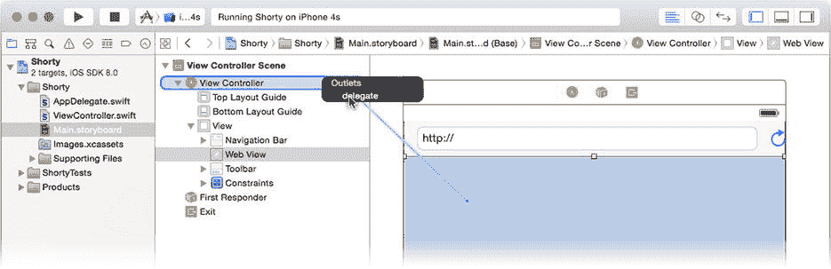
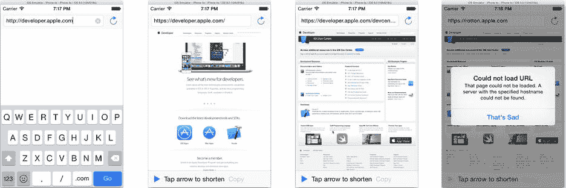

# 排版后的文档

第二行修复了我在之前"调试"部分提到的一个问题。你希望屏幕顶部文本字段中的 URL 能反映用户在网页视图中查看的页面。这段代码使两者保持同步。网页加载完成后，这行代码会深入 `webView` 对象，找到实际加载的 URL。`request` 属性（一个 `NSURLRequest` 对象）包含一个 URL 属性（一个 `NSURL` 对象），该对象又有一个名为 `absoluteString` 的属性。此属性返回一个描述已加载 URL 的纯字符串对象。简而言之，它将 URL 转换为字符串，与你之前在 `loadLocation(_:)` 中所做的操作正好相反。剩下要做的唯一一件事就是将其赋值给 `urlField` 对象的 `text` 属性，这样新的 URL 就会显示在文本字段中。

最后一个函数仅在网页无法加载时被调用。具有讽刺意味的是，它是最复杂的函数，因为你需要花时间告知用户页面为何未能加载——而不是让他们凭空猜测。代码如下：

```
func webView( webView: UIWebView, didFailLoadWithError error: NSError! ) {
    var message = "That page could not be loaded. " + 
                  error.localizedDescription
    let alert = UIAlertController(title: "Could not load URL",
                                message: message,
                         preferredStyle: .Alert )
    let okAction = UIAlertAction(title: "That's Sad",
                                 style: .Default,
                               handler: nil)
    alert.addAction(okAction)
    presentViewController(alert, animated: true, completion: nil)
}
```

第一条语句创建了一条消息，内容为"该页面无法加载..."，并附加了从 `error` 对象（由网页视图传递给该函数）获取的问题描述。接下来的几条语句创建了一个警告视图（即弹出对话框），将这条消息呈现给用户。

至此，你已经完成了让 `ViewController` 类成为网页视图委托所需的一切工作，但它目前还不是委托。最后一步是将网页视图连接到它。选择 `Main.storyboard` 文件。按住 Control 键，从网页视图对象拖拽到视图控制器对象。松开鼠标按钮时，选择 `delegate` outlet，如图 3-23 所示。



图 3-23. 连接网页视图委托

现在你的视图控制器对象已成为网页视图的委托。当网页视图执行操作时，你的委托会收到关于其进度的调用。你可以在模拟器中看到效果。运行你的应用，访问一个 URL（图 3-24 中的示例使用了 `http://developer.apple.com`），然后在网页视图中点击一两个链接。每次页面加载时，文本字段中的 URL 都会更新。



图 3-24. 跟随链接的 URL 字段

**提示** 还可以尝试加载一两个无法加载的 URL，例如输入无效域名或不存在的路径，如 图 3-24 右侧所示。测试应用如何处理失败情况同样重要。

### 缩短 URL

终于来到了关键时刻：编写缩短 URL 的代码。但首先，让我们回顾一下到目前为止的进展。

1.  用户已输入一个 URL 并将其加载到网页视图中。
2.  当网页视图加载完成后，你的 `ViewController` 对象的 `webViewDidFinishLoad(_:)` 函数被调用，你的代码在此启用了"缩短 URL"按钮。

接下来你希望用户点击"缩短 URL"按钮，将长 URL 神奇地转换为短 URL。这听起来像是一个操作。再次选择你的 `ViewController.swift` 文件，添加以下新代码：

```
let GoDaddyAccountKey = "0123456789abcdef0123456789abcdef"
var shortenURLConnection: NSURLConnection?
var shortURLData: NSMutableData?

@IBAction func shortenURL( AnyObject ) {
    if let toShorten = webView.request.URL.absoluteString {
        let encodedURL = toShorten.stringByAddingPercentEscapesUsingEncoding(
                                                          NSUTF8StringEncoding)
        let urlString = 
      "http://api.x.co/Squeeze.svc/text/\(GoDaddyAccountKey)?url=\(encodedURL)"
        shortURLData = NSMutableData()
        let request = NSURLRequest(URL:NSURL(string:urlString))
        shortenURLConnection = NSURLConnection(request:request, delegate:self)
        shortenButton.enabled = false
    }
}
```

`shortenURL(_:)` 动作函数向 X.co URL 缩短服务发送了一个请求。iOS 包含许多类，使得发送和接收 HTTP 请求到 Web 服务器这类复杂操作变得相对容易编写。

#### X.CO URL 缩短服务

我选择在此项目中使用 X.co URL 缩短服务有以下几个原因。首先，该服务是免费的。其次，它拥有文档完善且简单直接的应用程序编程接口（API），通过执行简单的 HTTP 请求即可使用。最后，它具备一些调试和管理功能。该服务允许你登录并查看你的应用缩短了哪些 URL，这在调试时非常有用。

X.co 服务由 GoDaddy! 提供。要使用 X.co，请前往 X.co 网页，创建一个免费账户或使用你现有的 GoDaddy! 账户登录（如果你已经是客户）。在你的 X.co 账户设置中，你会找到一个账户密钥——一个 32 字符的十六进制字符串——用于向 X.co 服务唯一标识你的身份。此密钥必须包含在你的请求中。获得密钥后，请编辑 `ViewController` 类中的以下行，将引号中的占位数字替换为你的账户密钥：

`let GoDaddyAccountKey = "0123456789abcdef0123456789abcdef"`

还有其他 URL 缩短服务，你可以轻松地调整此应用以使用其中几乎任何一项。有些服务，例如 Bit.ly，甚至提供了 iOS SDK，你可以下载并集成到你的项目中！

X.co 服务将接受一个包含待缩短 URL 的 HTTP GET 请求，并回复一个缩短后的 URL。就是这么简单。构建 GET 请求特别容易，因为所有必需的信息都包含在 URL 中。

#### 编写 `shortenURL(_:)`

现在让我们逐行解析 `shortenURL(_:)`。首先，你构建请求的 URL。你需要三部分信息。

-   服务请求 URL
-   你的 GoDaddy! 账户密钥
-   待缩短的长 URL

第一部分信息在 X.co 网站上有文档说明。要将长 URL 转换为短 URL 并让服务以纯文本形式返回缩短后的 URL，请提交格式如下的 URL：

```
http://api.x.co/Squeeze.svc/text/<YourAccountKey>?url=<LongURL>
```

要构建此 URL，你需要两个占位符 `<YourAccountKey>` 和 `<LongURL>` 对应的值。从 GoDaddy 获取你的账户密钥，并用它来定义 `GoDaddyAccountKey` 值（参见"X.co URL 缩短服务"边栏）。

你需要的最后一部分信息是要缩短的 URL。从这里开始，就像你在 `webViewDidFinishLoad(_:)` 函数中所做的那样，将其赋值给 `toShorten` 变量。

```
if let toShorten = webView.request.URL.absoluteString {
```

接下来的两行代码是你的应用中最复杂的语句。它使用**字符串插值**（一个花哨的说法，意指从其他值组装一个新字符串）来构建完整的 X.co 请求 URL。

```
    let encodedURL = 
toShorten.stringByAddingPercentEscapesUsingEncoding(NSUTF8StringEncoding)
    let urlString = 
"http://api.x.co/Squeeze.svc/text/\(GoDaddyAccountKey)?url=\(encodedURL)"
```


