# 排版后内容

请注意，你并不直接使用`toShorten`值。相反，使用了`stringByAddingPercentEscapesUsingEncoding(_:)`函数来替换 URL 中具有特殊含义的任何字符，将其替换为不会与重要内容混淆的字符序列。侧边栏“URL 字符串编码”解释了这样做的原因和原理。结果保存在`encodedURL`值中。

### URL 字符串编码

计算机，以及计算机程序员，经常处理字符串。字符串是一系列字符。通常，字符串中的某些字符具有特殊含义。URL 可以表示为字符串。特殊字符分隔了 URL 的不同部分。下面是一个通用 URL，其中特殊字符以粗体显示：

`scheme`**://**`some.domain.net`**/**`path`**?**`param1`**=**`value1&param2`**=**`value2`**#**`anchor`

冒号、斜杠、问号、与号、等号和井号（哈希）字符在 URL 中都具有特殊含义；它们用于标识 URL 的不同部分。问号之后的所有字符都是 URL 的查询字符串部分。与号分隔多个名称-值对。片段标识符位于井号字符之后，以此类推。

那么，如何编写一个路径中包含问号字符或某个查询字符串值中包含与号字符的 URL 呢？你不能像下面这样写，这毫无意义：

`http://server.net/what?artcl?param=red&white`

这就是在向 X.co 服务发送 URL 时面临的问题。你的 URL 的查询字符串中包含另一个 URL——它充满了特殊字符，所有这些字符都必须被忽略。你需要一种方法来编写通常具有特殊含义的字符，但又不携带其特殊含义。你需要的是转义序列。

*转义序列*是一种特殊的字符序列，用于表示单个字符，因此它像其他任何字符一样被对待，而不是被视为特殊字符。（请重新阅读这句话直到理解为止。）URL 使用百分号（`%`）后跟两位十六进制数字。当 URL 看到百分号后跟两位十六进制数字时，例如`%63`，它将其视为一个由两位数字的值确定的单个字符。将字符转换为转义序列以保留其值的过程称为*编码*字符串。

序列`%63`代表单个问号字符（`?`），而`%38`代表单个与号字符（`&`）。现在你可以对那个棘手的 URL 进行编码，接收方就能理解它：

`http://server.net/what%63artcl?param=red%38white`

`stringByAddingPercentEscapesUsingEncoding(_:)`函数会转换任何可能对 URL 造成混淆的字符，并用表示相同字符但不具有任何特殊含义的转义序列替换它们。现在你有了一个可以安全附加到 URL 查询部分的字符串，而不会造成混淆，尤其是对服务器而言。

下一行代码构建完整的 URL（以字符串形式）并将其存储在`urlString`值中。该字符串使用字符串插值构建。当你在字符串字面量中包含序列`\(任意+表达式)`时，Swift 会将其替换为该表达式的值——前提是 Swift 知道如何将表达式的结果转换为字符串。在你的程序中，这很简单，因为`GoDaddyAccountKey`和`encodedURL`已经是字符串，因此字面量字符串中的占位符会被直接替换为实际字符串。

下面这行代码可能看起来有点神秘：

```
shortURLData = NSMutableData()
```

它将一个名为`shortURLData`的实例变量设置为一个新的、空的`NSMutableData`对象。现在不用关心它，很快就会明白其用途。

接下来这行代码与你之前加载网页时使用的代码类似：

```
let request = NSURLRequest(URL: NSURL(string:urlString))
```

就像网页视图一样，`NSURLConnection`类（将为你发送 URL 的类）需要一个`NSURLRequest`。`NSURLRequest`需要一个`NSURL`。反过来看，这行代码从你刚刚构建的 URL 字符串创建一个`NSURL`，并用它来创建一个新的`NSURLRequest`对象，将最终结果保存在`request`变量中。

接下来的这条语句完成了（几乎）所有工作：

```
shortenURLConnection = NSURLConnection(request:request, delegate:self)
```

创建一个新的`NSURLConnection`对象会立即启动发送请求 URL 的过程。就像网页视图的`loadRequest(_:)`函数一样，这是一个异步函数——它只是启动一个后台任务并立即返回。同样，你提供一个委托对象，该对象将在进度发生时接收关于进度的调用。

然而，与网页视图不同的是，`NSURLConnection`的委托是在创建请求时（通过编程方式）传递的。这正是调用中`delegate:self`部分的作用；它告诉`NSURLConnection`使用此对象（`self`）作为其委托。

你刚说什么？你还没有让`ViewController`类成为 URL 连接的委托？你说得完全正确。你应该着手处理这件事。

### 成为 NSURLConnection 委托

现在你可以遵循与将`ViewController`设置为网页视图委托相同的步骤，将其也变为`NSURLConnection`的委托。你的对象可以成为多少个对象的委托，实际上没有限制。

第一步是采纳使你的类成为委托所需的协议。`NSURLController`声明了几个不同的委托协议，你可以自由采纳那些对你的应用程序有意义的协议。在这种情况下，你需要采纳`NSURLConnectionDelegate`和`NSURLConnectionDataDelegate`协议。为此，在你的`ViewController.swift`文件中，将这些协议名称添加到`ViewController`类中，如下所示：

```
class ViewController: UIViewController, UIWebViewDelegate,
                                        NSURLConnectionDelegate,
                                        NSURLConnectionDataDelegate {
```

`NSURLConnectionDelegate`定义了在关键事件发生时发送给你的委托的函数。有大量消息涉及你的应用如何响应经过身份验证的内容（受账户名和密码保护的网络服务器上的文件）。这些都不适用于当前应用。你唯一感兴趣的函数是`connection(_:,didFailWithError:)`。如果请求因某种原因失败，则会发送该消息。打开你的`ViewController.swift`文件并添加这个新函数：

```
func connection( connection: NSURLConnection!, 
                 didFailWithError error: NSError! ) {
    shortLabel.title = "failed"
    clipboardButton.enabled = false
    shortenButton.enabled = true
}
```

URL 缩短请求失败的可能性很小。唯一可能的原因是你的 iPhone 暂时失去了网络连接。尽管如此，你还是希望应用在任何情况下都能表现良好并做出明智的响应。这个函数通过执行三件事来处理失败情况。

*   将短 URL 标签设置为“failed”，表示出现了问题
*   禁用“复制到剪贴板”按钮，因为没有什么可复制的内容
*   重新启用“缩短 URL”按钮，以便用户可以重试

处理完这些不太可能发生的情况后，让我们来看看发送请求时应该发生的事情。`NSURLConnectionDataDelegate`协议的函数主要关注你的应用如何获取从服务器返回的数据。它同样定义了许多你不感兴趣的其他函数。你感兴趣的两个函数是`connection(_:,didReceiveData:)`和`connectionDidFinishLoading(_:)`。首先，将这个`connection(_:,didReceiveData:)`函数添加到你的类中：

```
func connection( connection: NSURLConnection!, didReceiveData data: NSData! ) {
    shortURLData?.appendData(data)
}
```


`X.co`服务在 HTTP 响应体中以简单的 ASCII 字符串形式返回缩短后的 URL。每当从服务器接收到新的主体数据时，你的委托对象会收到一次`connection(didReceiveData:)`调用。在这个应用中，由于请求的数据量很小，这很可能只会发生一次。如果你的应用请求了大量数据（例如整个网页），这个函数会被多次调用。

这个函数唯一做的事情是：获取接收到的数据（存放在`data`参数中），并将其添加到你在`shortURLData`中维护的数据缓冲区。还记得`shortenURL()`中的`shortURLData = NSMutableData()`语句吗？该语句在请求开始前设置了一个空缓冲区（`NSMutableData`）。当你收到该请求的响应时，数据会累积到你的`shortURLData`变量中。这一切都说得通吗？我们继续看最后一个函数。

最后一个函数现在应该不言自明了。当事务完成时，会调用`connectionDidFinishLoading(_:)`函数：你已发送了 URL 请求，收到了所有数据，并且整个过程成功了。将此函数添加到你的实现中：

```
func connectionDidFinishLoading( connection: NSURLConnection! ) {
    if let data = shortURLData {
        let shortURLString = NSString(data:data, encoding:NSUTF8StringEncoding)
        shortLabel.title = shortURLString
        clipboardButton.enabled = true
    }
}
```

前两条语句将你在`connection(_:,didReceiveData:)`中接收到的 ASCII 字节转换成一个字符串对象。字符串对象使用 Unicode 字符值，因此将字节字符串转换为字符字符串需要一点转换。

**提示** 如果你需要将字符串对象与其它形式（如字符或字节数组）相互转换，学习一些关于 Unicode 字符的知识会很有帮助。Joel Spolsky 在`http://joelonsoftware.com/articles/Unicode.html`上为初学者写了一篇很棒的文章，标题是“每个软件开发人员绝对、肯定必须了解的关于 Unicode 和字符集的最低知识（没有借口！）”。

第三行代码将`shortLabel`工具栏按钮的标题设置为你刚刚收到（并转换）的短 URL。这会使短 URL 出现在屏幕底部。

最后一步是启用“复制到剪贴板”按钮。现在你的应用有了一个有效的短 URL，它就有了可以复制的内容。

### 测试服务

你差不多准备好测试你的应用了；但首先要处理一个很小的细节。你已经编写了向`X.co`服务发送请求的代码，设置了用于收集返回数据的委托函数，并编写了处理任何问题的代码。剩下唯一要做的事情就是将界面中的“缩短 URL”按钮连接到你的`shortenURL(_:)`函数，这样当你点击按钮时，所有操作才会发生。

选择`Main.storyboard`文件。按住 Control 键，点击“缩短 URL”按钮，并将其操作连接到视图控制器。释放鼠标按钮，然后选择`shortenURL:`操作，如图 3-25 所示。

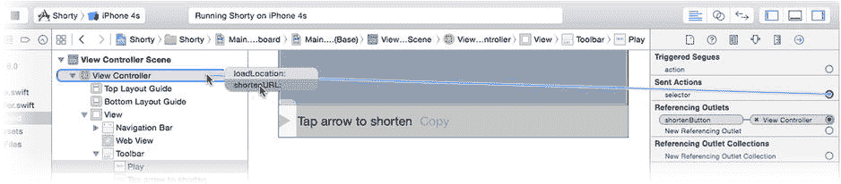

图 3-25. 连接“缩短 URL”按钮

运行你的应用并输入一个 URL。在图 3-26 所示的示例中，我输入了`http://www.apple.com`。当页面加载完成后，“缩短 URL”按钮变为可用。点击它，一两秒内，一个指向该页面的短 URL 会出现在工具栏中（图 3-26 的右侧）。

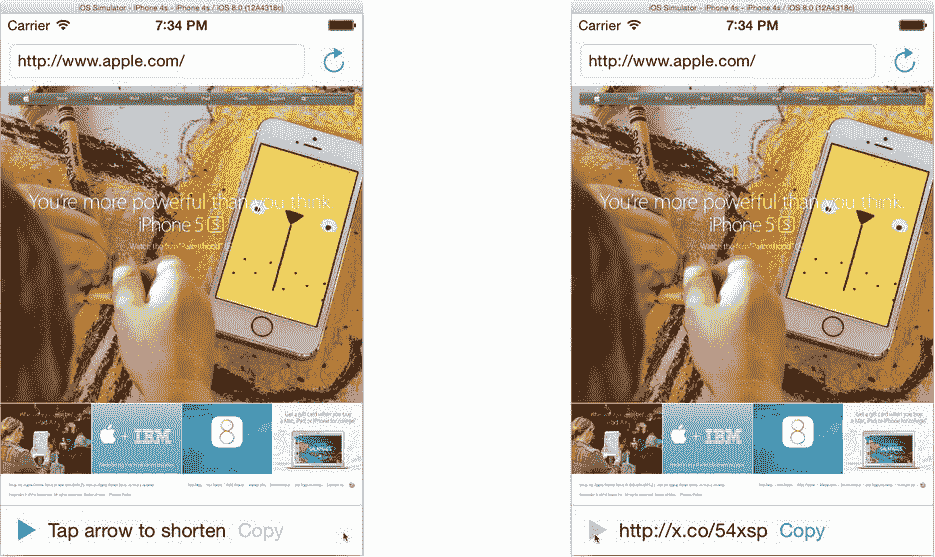

图 3-26. Shorty 应用在运行中

这值得庆祝一下！通过利用现有 iOS 类的强大功能，明智地连接正确的对象，并编写操作和委托函数来处理细节，你创建了一个非常复杂的应用。

### 最终润色

你还没有完全完成。你还需要编写将短 URL 复制到系统剪贴板的操作。幸运的是，这编码起来也不难。在你的`ViewController.swift`文件中，添加此函数：

```
@IBAction func clipboardURL( AnyObject ) {
    let shortURLString = shortLabel.title
    let shortURL = NSURL(string: shortURLString)
    UIPasteboard.generalPasteboard().URL = shortURL
}
```

第一行从`shortLabel`按钮（其标题由`connectionDidFinishLoading(_:)`设置）获取 URL 的文本。第二行将短 URL 的文本转换为一个 URL 对象，就像你在本章开头编写的`loadLocation(_:)`函数中所做的那样。最后，`UIPasteboard.generalPasteboard()`函数返回用于“通用”数据的系统级剪贴板——也就是大多数人认为的剪贴板。你将该剪贴板对象的`URL`属性设置为你刚刚创建的 URL 对象。几乎像变魔术一样，短 URL 现在就在剪贴板上了。

现在你可以使用 Interface Builder 将“复制到剪贴板”按钮连接到`clipboardURL(_:)`函数。以你连接“缩短 URL”按钮的相同方式执行此操作（参见图 3-25）。

一切连接完毕后，再次运行你的应用。你应该养成边编写边运行应用的习惯，在开发过程中测试每个新特性和函数。在模拟器中，访问一个 URL 并生成一个缩短版本，如图 3-27 左侧所示。获得缩短的 URL 后，点击“复制”按钮。

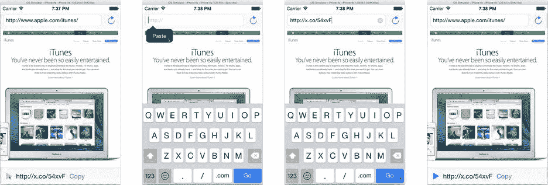

图 3-27. 测试剪贴板

再次点击文本字段并清除内容。按住鼠标（模拟手指）直到出现“粘贴”弹出按钮（图 3-27 中的第二张图）。点击粘贴按钮，缩短的 URL 将被粘贴到字段中。这同样适用于任何允许粘贴文本的其他应用。

作为最终测试，点击“前往”按钮。缩短的 URL 将被发送到`X.co`服务器，服务器会将你的浏览器重定向到原始 URL，你在浏览器中开始的网页将重新出现，同时文本字段中也会显示原始 URL。

### 清理界面

你的应用功能齐全，但界面中仍有一些小问题。在模拟器仍在运行时，选择“硬件”>“向左旋转”命令。这会模拟设备逆时针旋转 90°，如图 3-28 所示。大部分看起来还不错，但底部工具栏中的按钮被挤到了左侧，看起来有点粗糙。

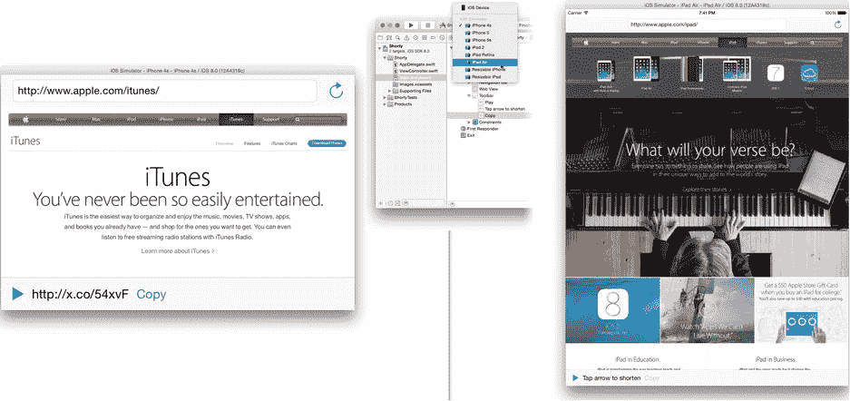

图 3-28. 测试设备旋转

退出模拟器，将工具栏中的项目目标更改为 iPad 模拟器，然后再次运行你的应用。情况还行，但所有工具栏按钮再次堆叠在左侧。

退出模拟器或点击 Xcode 中的停止按钮。选择`Main.storyboard`文件。在库中找到“灵活空间栏按钮项”。这个名称超长的对象充当一个“弹簧”，填充工具栏中的可用空间，从而将两侧的按钮对象推到屏幕边缘。

将一个灵活空间项对象拖放到“缩短 URL”按钮和短 URL 字段之间。再拖放一个到 URL 字段和“复制到剪贴板”按钮之间，如图 3-29 所示。

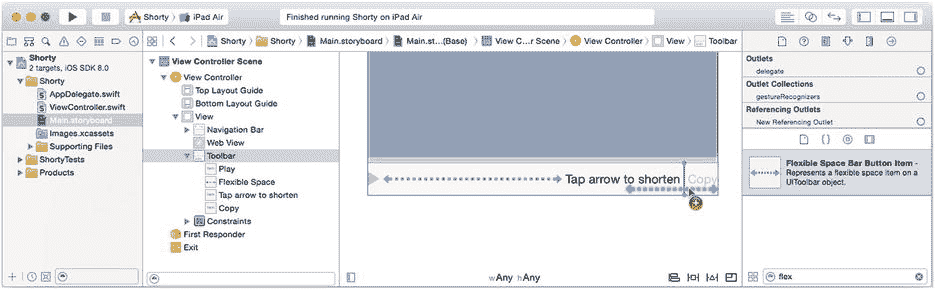


### 图 3-29 添加弹性空间栏按钮项

借助两个弹性空间项，这些“弹簧”占用了空白区域，使得中间的标签居中对齐，而复制按钮则完全移到了右侧。在竖屏方向上这一点并不明显，但如果你将设备旋转到横屏，它会完美地工作。切换回 iPhone 模拟器，运行你的应用（参见图 3-30），然后将设备向左（或向右）旋转。现在工具栏看起来美观多了（见图 3-30 的右侧）。

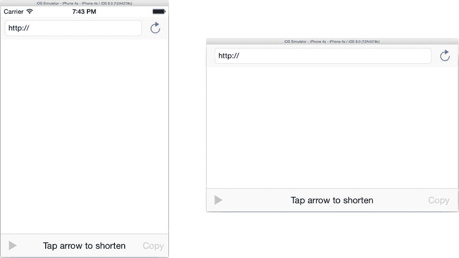

图 3-30 测试 iPhone 旋转

## 本章小结

这是一章非常重要的内容，而你已出色地完成了学习。你学到了关于 iOS 应用开发和 Xcode 工作流程的大量基础知识。几乎在你开发的每一个应用中，你都会用到这些技能。

你学会了如何快速搭建一个 Web 浏览器，这个功能用途广泛，不仅仅限于显示网页。例如，你可以通过向应用添加 `.html` 资源文件来创建静态 web 内容，并让 Web 视图加载这些文件。Web 视图类还允许你使用 JavaScript 与其内容交互，从而开启各种可能性。

学习创建并连接输出口（outlet）是一项至关重要的 iOS 技能。正如你所发现的，iOS 应用是一个对象网络，而输出口就是连接这个网络的线索。

最重要的是，你学会了如何编写动作函数和创建委托。这两种模式在 iOS 开发中反复出现。

在下一章中，我将解释事件如何将手指触摸转化为一个动作。

## 第 4 章：即将发生的事件

既然你已经见识了 iOS 应用的实际运行，你可能会想知道是什么让你的应用“存活”下来。在 Shorty 应用中，你创建了动作函数，当用户点击按钮或按下键盘上的 Go 键时，这些函数会被调用。当达到某些里程碑时，比如网页加载出现问题或 URL 缩短服务响应时，你创建的委托对象会收到消息。你从未编写任何代码来检查用户是否触摸了某物，或检查网页是否已加载完毕。换句话说，你并没有主动去获取这些信息；你的应用只是在等待这些信息主动到来。

iOS 应用是*事件驱动型*的应用程序。一个事件驱动的应用不应该（而且也不会！）循环地检查某事是否发生。事件驱动的应用会设定它们想要响应的条件（例如用户的触摸、设备方向的变化或网络事务的完成）。然后应用会安静地待着，什么都不做，直到其中一件事情发生。所有这些事情统称为*事件*，这正是本章将要讨论的内容。

在本章中，你将学习以下内容：

- 事件
- 运行循环
- 事件传递
- 事件处理
- 第一响应者与响应者链
- 在真实的 iOS 设备上运行你的应用

我将从一些基本理论开始，讲解事件如何从设备硬件进入你的应用程序。你将了解不同类型的事件以及它们如何在你的应用对象中导航。最后，你将创建两个应用：一个处理高层级事件，另一个处理低层级事件。

### 运行循环

iOS 应用保持静止，等待某件事情发生。这是应用设计的一个重要特性，因为它能提高应用的效率；只有当有重要的事情要做时，你应用中的代码才会运行。

这种看似无伤大雅的安排对于让用户满意至关重要。运行计算机代码需要电力，而移动设备中的电力是宝贵的资源。避免代码在非必要时刻运行，使得 iOS 能够节约电量。它通过在不需使用时关闭或最小化 CPU 及其他硬件配件的功耗来实现这一点。这种电源管理每秒发生数百次，但它对移动设备的电池寿命至关重要，而用户喜爱电池续航长的移动设备。

你应用中的代码处于两种机制的接收端：运行循环和事件队列。运行循环在有事情发生时执行你应用中的代码，并在无事可做时停止应用运行。事件队列是一个数据结构，包含等待处理的事件列表。只要队列中有事件，运行循环就会将它们——一次一个——发送给你的应用。一旦所有事件都处理完毕，事件队列为空，你的应用就会停止执行代码。

从概念上讲，你应用的运行循环看起来像这样：

```swift
while true {
    let event: UIEvent = iOS.waitForNextEvent()
    yourApp.processEvent(event)
}
```

神奇之处在于 `waitForNextEvent()` 函数（这个函数不存在，是我编的）。如果有一个事件正在等待处理，该事件就会从队列中移除并返回。运行循环将其传递给应用进行处理。如果没有事件，该函数就不会返回；你的应用会被挂起，直到有事可做。现在，让我们来看看这些事件是什么以及它们来自哪里。

### 事件队列

等待处理的事件会被添加到一个先进先出（FIFO）的缓冲区中，这个缓冲区被称为 *事件队列*。存在不同类型的事件，并且事件来自不同的来源，如图 4-1 所示。

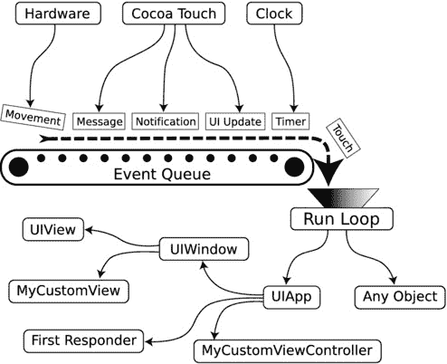

图 4-1 事件队列

让我们跟随一个事件在你的应用中走一遍。当你将手指触摸到 iOS 设备的屏幕表面时，会发生以下情况：

1.  屏幕中的硬件检测到触摸的位置。
2.  此信息被用来创建一个触摸事件对象，该对象记录了触摸的位置、发生的时间以及其他信息。
3.  触摸事件对象被放置在你应用的事件队列中。
4.  运行循环从队列中取出触摸事件对象，并将其传递给应用对象。
5.  应用对象利用应用中活跃视图的几何信息来确定你的手指“触摸”了哪个视图。
6.  包含触摸事件的事件消息被发送给该视图对象。
7.  视图对象决定触摸事件的含义及其将要采取的行动。它可能会高亮一个按钮或发送一个动作消息。

当你在第 3 章的 Shorty 应用中触摸“缩短 URL”按钮时，这就是物理触摸屏幕的行为转变为视图控制器接收到的 `shortenURL(_:)` 调用的过程。

不同的事件类型走不同的路径。接下来的几节将描述不同的传递方法，以及每种方法所传递的事件类型。

### 事件传递

事件传递是指事件从事件队列传递到应用中的一个对象的过程。不同类型的事件因其目的不同而走不同的路径。实际的传递机制是 Cocoa Touch 框架、你的应用对象以及你的应用对象定义的各种函数中的逻辑组合。

广义上讲，有三种传递方法。

- 直接传递
- 命中测试
- 第一响应者

接下来的几节将分别描述这三种方法以及通过它们传递的事件。

#### 直接传递


#### 直接传递

*直接传递*是最简单的事件传递形式。许多事件类型针对特定对象。这些事件知道哪些对象将接收它们，因此除了知道它们是由运行循环派发的之外，你无需过多了解这些事件的传递方式。

例如，一个 Swift 函数调用可以被放入事件队列。当该事件从队列中取出时，调用将在其目标对象上执行。这就是 Web 视图在你的 Shorty 应用中告知网页已加载的方式。当网络通信代码（在其自身线程中运行）确定页面加载完成后，它会将一个 `webViewDidFinishLoad()` 调用推送到主线程的事件队列中。当你主线程从事件队列中拉取事件时，其中一个事件会在你的 Web 视图委托对象上执行该调用，告知它页面已加载。

**注意** 异步委托消息的实际传递方式并非完全如此。但从应用开发者——也就是你——的角度来看，这在概念上是准确的；具体细节并不重要。

其他发送给特定对象或对象组的事件包括通知、定时器事件和用户界面更新。所有这些事件都直接或间接地知道它们将被发送给哪些对象。作为应用开发者，你只需知道，当这些事件到达事件队列末尾时，运行循环会调用一个或多个对象上的 Swift 函数。

#### 命中测试

命中测试根据用户界面的几何形状来传递事件，并且它仅适用于触摸事件。当触摸事件发生时，`UIWindow` 和 `UIView` 对象协同工作，以确定哪个视图对象与触摸位置相对应。然后，消息被发送到该视图对象，该对象会以任意方式解释这些事件；它可能会拨动开关，滚动购物清单，或者炸毁一艘宇宙飞船。我们快速了解一下命中测试的工作原理。

当触摸事件从事件队列中取出时，它包含了触摸发生的绝对硬件坐标，如图 4-2 左侧所示。本例将使用上一章 Shorty 应用的简化表示。

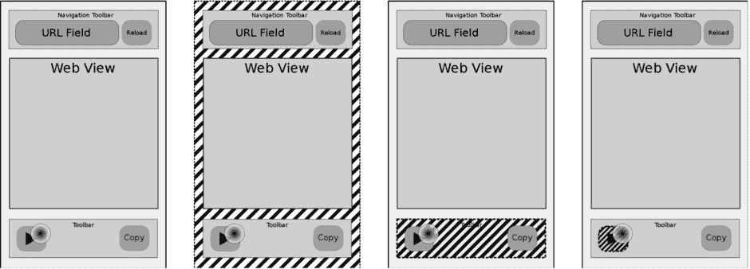

图 4-2. 触摸事件的命中测试

你的 `UIApplication` 对象使用事件坐标来确定负责该屏幕区域的 `UIWindow` 对象。该 `UIWindow` 对象收到一个包含待处理触摸事件对象的 `sendEvent(_:)` 调用。

然后，`UIWindow` 对象执行命中测试。从其视图层次结构的顶部开始，它在其顶层视图对象上调用 `hitTest(_:,withEvent:)` 函数，如图 4-2 的第二个面板所示。

顶层视图首先确定事件是否在其边界内。是的，因此它开始查找包含该触摸坐标的任何子视图。顶层视图包含三个子视图：顶部的导航工具栏、中间的 Web 视图以及底部的工具栏。触摸位于工具栏的边界内，因此它将事件传递给工具栏的 `hitTest(_:,withEvent:)` 函数。

工具栏重复此过程，寻找包含该位置的子视图，如图 4-2 的第三帧所示。工具栏对象发现触摸发生在最左侧的栏按钮项边界内。该栏按钮项作为“命中”对象被返回，这导致 `UIWindow` 开始向其发送低级别的触摸事件消息。

作为一个“按钮”，栏按钮项对象检查事件以确定用户是否点击了按钮（而不是滑动它或其他无关手势）。如果是，该按钮会将其动作（在本例中为 `shortenURL()`）发送到其连接的对象。

**提示** 如果你需要修改命中测试，它高度可定制。通过重写视图对象的 `pointInside(_:,withEvent:)` 和 `hitTest(_:,withEvent:)` 函数，你可以真正改写决定触摸事件如何找到其目标视图对象的规则。有关详细信息，请参阅 Xcode 文档和 API 参考中的 *Event Handling Guide for iOS*。

#### 第一响应者

*第一响应者*是活动界面（可见窗口）中的视图、视图控制器或窗口对象。可以将其视为不由命中测试决定的事件的*指定接收者*。我将在本章后面讨论对象如何成为第一响应者。现在，只需知道每个活动界面都有一个第一响应者。

以下是传递给第一响应者的事件：

*   摇晃动作事件
*   远程控制事件
*   按键事件

摇晃动作事件告知你的应用用户正在摇晃其设备（快速来回移动）。此信息来自加速度计硬件。

所谓的远程控制事件在用户按下任何多媒体控件时生成，包括以下内容：

*   播放
*   暂停
*   停止
*   跳到下一曲
*   跳到上一曲
*   快进
*   快退

这些被称为*远程*事件，因为它们可能源自外部配件，例如许多耳机线缆上的播放/暂停按钮。实际上，最常来自你在屏幕上看到的播放/暂停按钮。

按键事件来自点击虚拟键盘或通过蓝牙连接的硬件键盘。

回顾一下，直接传递会将事件对象或 Swift 调用直接发送到其目标对象。触摸事件使用命中测试来确定哪个视图对象将接收它们，而所有其他事件则发送给第一响应者。现在是时候对这些事件进行一些操作了。

#### 事件处理

你已经到达事件处理之旅的第二部分：事件处理。简单来说，如果一个对象包含代码来解释事件并决定如何处理它，那么该对象就*处理*或*响应*一个事件。

我先处理直接传递事件。接收直接传递事件的对象*必须*有一个函数来处理该事件、调用或通知。这是必须的。如果对象没有实现预期的函数，你的应用程序将出现故障甚至崩溃。这就是你需要了解的直接传递事件的全部内容。

**警告** 在请求定时器和通知事件时，确保接收它们的对象实现了正确的函数。

其他事件类型则宽容得多。就像可选的委托函数一样，如果你的对象重写了处理事件的函数，它就会接收到这些事件。如果它对处理该类型事件不感兴趣，你只需在其实现中省略这些函数，iOS 就会去寻找另一个想要处理它们的对象。

例如，要处理触摸事件，你可以在类中重写以下函数：

```
override func touchesBegan(touches: NSSet, withEvent event: UIEvent)
override func touchesMoved(touches: NSSet, withEvent event: UIEvent)
override func touchesEnded(touches: NSSet, withEvent event: UIEvent)
override func touchesCancelled(touches: NSSet!, withEvent event: UIEvent)
```

如果命中测试确定你的对象应接收触摸事件，那么当硬件检测到你的视图中有物理触摸时，它会收到一个 `touchesBegan(_:,withEvent:)` 调用；每当位置发生变化时（拖动手势），会收到一个 `touchesMoved(_:,withEvent:)` 调用；当与屏幕的接触被移除时，会收到一个 `touchesEnded(_:,withEvent:)` 调用。当用户在屏幕上点击并拖动手指时，你的对象可能会收到许多这样的调用，并且往往快速连续地发生。


**注意**  `touchesCancelled(_:,withEvent:)`函数是这个组里的异类。如果触摸事件序列被某些因素打断（例如，在拖拽手势过程中你的应用切换到另一个屏幕），就会调用此函数。只有当不完整的触摸事件序列（例如，接收到“开始”但未收到“结束”消息）会混淆你的对象时，你才需要处理这个取消调用。

如果你在类中省略所有这些函数，你的对象将不会处理任何触摸事件。

所有用于处理事件的方法都继承自`UIResponder`类，并且每种事件类型都有一个或多个函数，如果你想要处理该事件，就必须实现这些函数。`UIResponder`类文档提供了事件处理函数的完整列表。

那么，如果命中测试或第一响应者对象忽略了该事件，会发生什么？这是个好问题，答案可以在响应者链中找到。

---

**响应者链**

*响应者链*是一系列对象的链，它们代表了你用户界面的焦点。我所说的*焦点*是指那些控制当前可见界面的对象，以及那些与用户当前操作最相关的视图对象。这听起来是不是模糊又令人困惑？一张图片以及对 iOS 如何创建和使用响应者链的解释，将让一切变得清晰。

响应者链始于*初始响应者*（参见图 4-3）。在传递运动事件、按键事件和远程控制事件时，第一响应者就是初始响应者对象。对于触摸事件，初始响应者是由命中测试确定的视图对象。

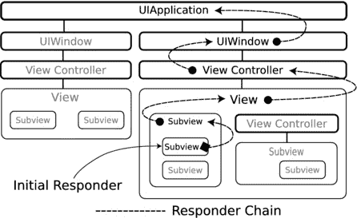

图 4-3。第一响应者链

**注意**  响应者链中的所有对象都是`UIResponder`的子类。因此，从技术上讲，响应者链由`UIResponder`对象组成。`UIApplication`、`UIWindow`、`UIView`和`UIViewController`都是`UIResponder`的子类。推而广之，初始响应者（第一响应者或命中测试结果）始终是一个`UIResponder`对象。

iOS 首先尝试将该事件传递给初始响应者。*尝试*是这里的关键词。如果该对象提供了处理该事件的函数，它就会进行处理。如果没有，iOS 将沿着链移动到下一个对象，直到找到一个想要处理该事件的对象，或者它放弃并将该事件丢弃。

图 4-3 展示了一个包含两个屏幕的应用中视图对象的概念性组织。第二个屏幕当前正展示给用户。它由一个视图控制器对象、许多子视图（其中一些嵌套在其他子视图中），甚至还有一个子视图控制器组成。在这个示例中，一个子-子视图已被指定为初始响应者，这在命中测试确定用户触摸了该视图后是合适的。

iOS 将尝试将触摸事件传递给初始响应者（子-子视图）。如果该对象不处理触摸事件，iOS 会检查该视图是否有视图控制器对象（实际上没有），并尝试将事件发送给其控制器。如果视图及其控制器都不处理触摸事件，iOS 会找到包含该视图的视图（其父视图），并重复整个过程，直到尝试完所有视图和视图控制器为止。

在所有视图和视图控制器对象都有机会处理该事件之后，事件传递将移交给该屏幕的窗口对象，并最终移交给唯一的应用对象。

响应者链的优雅之处在于其动态特性和有序的事件处理。响应者链是自动创建的，因此你的对象无需做任何事情就能成为响应者链的一部分，只需确保它自己或一个附属视图是初始响应者即可。当你的界面部分处于活动状态时，你的对象会接收事件消息；当它不活动时，则不会接收事件。

另一个方面是响应者链事件处理的从具体到一般的特性。该链总是从与用户最相关的视图开始：他们触摸的按钮、一个活动的文本输入字段或列表中的一行。该对象总是最先接收事件。如果事件对这些视图具有特定含义，它将被相应地处理。同时，你的视图控制器或`UIApplication`对象也可以响应这些事件，但如果某个子视图先处理了它，那么这些对象就不会接收到它。

如果用户移动到另一个屏幕，如图 4-4 所示，并按下耳机上的暂停按钮，就会建立一个新的响应者链。这个链从第一响应者开始，在本例中是一个视图控制器。该链根本不包含任何视图对象，因为顶层的视图控制器对象就是第一响应者。


图 4-4。第二响应者链

如果视图控制器处理了“暂停”事件，那么它就继续执行下去。其他界面中的视图控制器永远不会看到这个事件。通过在各个控制器中实现不同的“暂停”事件处理代码，你的应用对“暂停”事件的响应将取决于哪个屏幕处于活动状态而有所不同。

你的应用对象也可以处理“暂停”事件。如果没有一个视图控制器处理“暂停”事件，那么所有“暂停”事件都会向下渗透到应用对象。如果你希望所有“暂停”事件都以相同方式处理，而不管用户正在查看哪个屏幕，那么这就是你想要采用的组织方式。

最后，你可以混合使用这些方案。应用中的“暂停”事件处理器可以用一种通用方式处理该事件，然后特定的视图控制器可以拦截该事件（如果在该屏幕中按下暂停按钮有特殊含义的话）。

**提示**  很少会创建`UIApplication`的自定义子类，而创建`UIWindow`的子类则更为罕见。在一个典型的应用中，你所有的事件处理代码都将位于你自定义的视图和视图控制器对象中。

---

**有条件地处理事件**

在实际应用中，你要么重写一个事件处理函数（例如`touchesBegan(_:,withEvent:)`）来处理该事件类型，要么省略该函数以忽略它。实际上，情况要更微妙一些。

事件是通过接收特定的 Swift 函数调用（例如`touchesBegan(_:,:withEvent:)`）来处理的。你的对象从`UIResponder`基类继承了这些函数。因此，每个`UIResponder`对象都有一个`touchesBegan(_:,:withEvent:)`函数，并将通过函数调用接收触摸事件对象。那么，对象是如何忽略事件的呢？

秘密在于`UIResponder`对这些函数的实现。所有事件调用的继承基类实现只是简单地将事件向上传递给响应者链。因此，更精确的描述是这样的：要处理事件，你重写`UIResponder`的事件处理函数并处理该事件。要忽略它，你让事件转到`UIResponder`的函数，该函数会忽略事件并将其传递给响应者链中的下一个对象。

这引出了一个有趣的特性：有条件地处理事件。可以编写一个事件处理函数，由它决定是否要处理某个事件。它可以任意选择自己处理该事件，或者将其传递给响应者链中的下一个对象。将其传递下去是通过将事件转发给基类的实现来完成的，如下所示：

```
override func touchesBegan(touches: NSSet, withEvent event: UIEvent) {
    if iWantToHandleTheseTouches(touches) {
        // handle event
        doSomethingWithTheseTouches(touches)
    } else {
        // ignore event and pass it up the responder chain
        super.touchesBegan(touches, withEvent: event)
    }
}
```


#### 高级 vs. 低级事件

使用这种技术，你的对象可以动态决定它想要处理哪些事件，以及将哪些事件传递给响应者链中的其他对象。

既然你已经了解了事件是如何传递和处理的，现在可以开始构建一个直接使用事件的应用程序了。为此，你需要考虑你想要处理哪些类型的事件以及原因。

#### 高级 vs. 低级事件

程序员总是喜欢给事物贴上"高级"或"低级"的标签。应用中的对象形成一种金字塔结构。顶部的少数复杂对象由中层的更原始对象构建而成，而这些中层对象本身又由更底层的原始对象构成。顶部的复杂对象被称为*高级*对象（`UIApplication`、`UIWebView`）。底部的简单对象被称为*低级*对象（`NSNumber`、`String`）。同样，程序员也会谈论高级和低级的框架、接口、通信路径等。

事件也有不同的层级。低级事件是那些正在发生的、细微的、每时每刻的细节。触摸事件是低级事件的例子。另一个例子是你可以从加速度计和陀螺仪硬件请求的瞬时力向量值。

在另一端的则是高级事件，例如摇动运动事件。另一个例子是`UIGestureRecognizer`对象，它解释复杂的触摸事件模式，并将其转化为单个高级动作，例如"捏合"或"轻扫"。

在设计应用时，你必须决定要处理哪个层级的事件。在下一个应用中，你将使用摇动运动事件来触发应用中的操作。

为此，你可以请求并处理低级的加速度计事件。你需要创建变量来跟踪三个运动轴（x、y 和 z）上的力向量。当你检测到设备在特定方向上加速时，你将记录该方向并启动一个计时器。如果运动方向在合理的轨迹角度和短时间内反转，然后再次反转两到三次，你可以得出结论：用户正在摇动设备。

或者，你可以让 iOS 为你完成所有这些计算，只需处理 Cocoa Touch 框架生成的摇动运动事件即可。当用户开始摇动设备时，你的第一响应者会收到一个`motionBegan(_:,withEvent:)`调用。当用户停止摇动时，你的对象会收到一个`motionEnded(_:,withEvent:)`调用。就这么简单。

这并不意味着你永远不需要低级事件。如果你正在编写一个游戏应用，用户通过从一侧到另一侧倾斜设备来控制一只星鼻鼹鼠在魔法花园的土壤中穿行，那么解释低级的加速度计事件将是正确的解决方案。你将在第 16 章中使用低级的加速度计事件。

决定你需要从事件中获取什么信息，然后处理能提供这些信息的最高级事件。现在你已经准备好开始设计你的应用了。

## 八球应用

你将创建的应用模仿了 20 世纪 50 年代著名的魔法八球玩具（`http://en.wikipedia.org/wiki/Magic_Eight_Ball`）。该应用的工作原理是：每当你摇动 iOS 设备时，它就会显示一条惊人准确的预言信息。首先，为你的应用勾勒出一个快速设计。

#### 设计

这个应用的设计是迄今为止最简单的：一个包含信息的屏幕显示在"球"的中心，如图 4-5 所示。当你摇动设备时，当前信息消失。当你停止摇动时，一条新信息出现。


图 4-5. 八球应用设计

### 创建项目

启动 Xcode 并选择 File  New Project。选择 Single View iOS 应用模板。在下一个表单中，将应用命名为`EightBall`，将语言设置为 Swift，并为设备选择 iPhone，如图 4-6 所示。

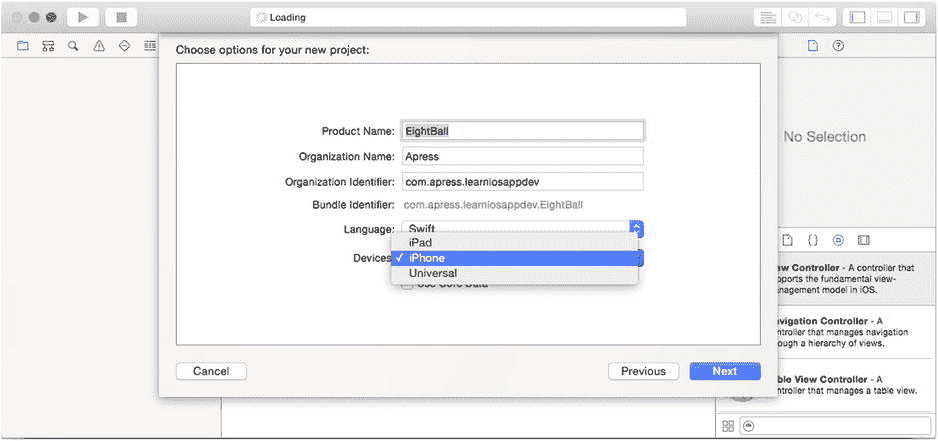

图 4-6. 创建 EightBall 项目

选择一个位置保存新项目并创建它。在项目导航器中，选择项目，从弹出菜单中选择`EightBall`目标（如果需要），选择 General 选项卡，然后在 Supported Interface Orientation 部分关闭两个横屏方向，以便只启用竖屏方向。

### 创建界面

选择`Main.storyboard` Interface Builder 文件并选择单个视图对象。使用属性检查器，将背景色设置为 Black，如图 4-7 所示。

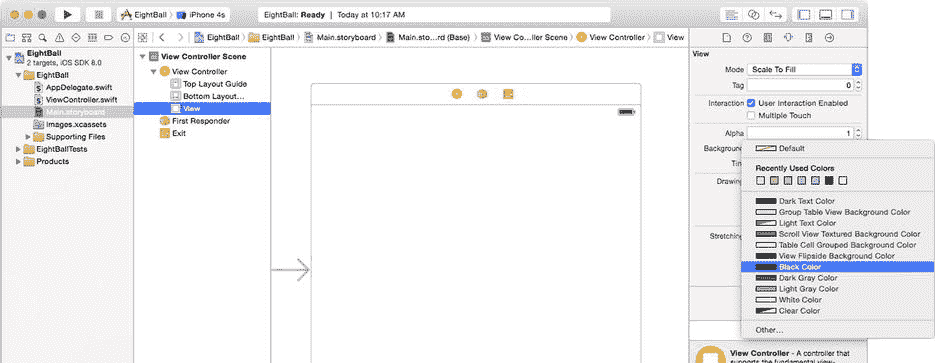

图 4-7. 设置主视图背景色

从库中拖入一个新的图像视图对象到界面中。选中新图像对象后，点击 pin 约束控制（画布右下角的第二个按钮）。勾选 Width 和 Height 约束，如图 4-8 左侧所示，并将其值都设置为 320。点击 Add 2 Constraints 按钮。

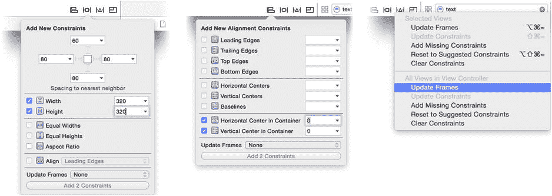

图 4-8. 设置图像视图约束

点击 align 约束控制（最左侧按钮）。勾选 Horizontal Center in Container 和 Vertical Center in Container 约束，如图 4-8 中间所示。确保它们的值都设置为 0。点击 Add 2 Constraints 按钮。最后，点击 Resolve Auto Layout Issues 控制（第三个按钮）并选择 Update Frames 命令，如图 4-8 右侧所示。图像视图对象现在将具有固定大小（320x320 点），并且始终居中于视图控制器的根视图中。

**提示**  通过 pin 约束或 align 约束控制添加新约束时，在点击添加按钮之前，从 Update Frames 弹出菜单中选择一个选项。Xcode 将应用约束并在一步中更新框架。

就像在第 2 章中所做的那样，你将向项目中添加一些资源图像文件。在项目导航器中，选择`Images.xcassets`素材目录。在 Finder 中，找到你在第 1 章下载的`Learn iOS Development Projects`文件夹。在`Ch 4`文件夹内，你会找到`EightBall (Resources)`文件夹，其中包含五个图像文件。选择文件`eight-ball.png`和`eight-ball@2x.png`。在文件和工作区窗口可见的情况下，将这两个图像文件拖入素材目录，如图 4-9 所示。

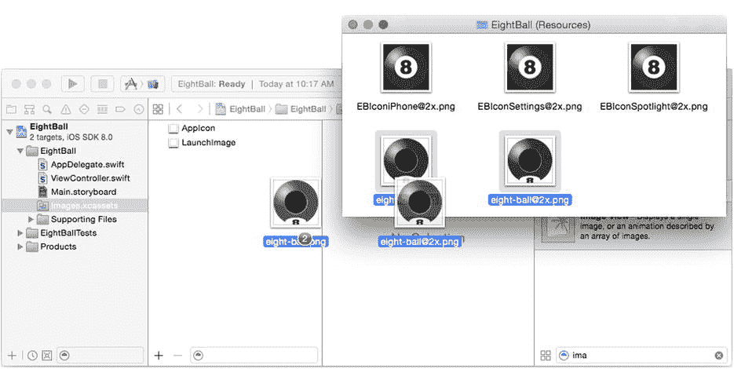

图 4-9. 将八球图像添加到素材目录

返回你的项目，选择`Main.storyboard`并选择图像视图对象。使用属性检查器，将 image 属性设置为`eight-ball`，如图 4-10 所示。

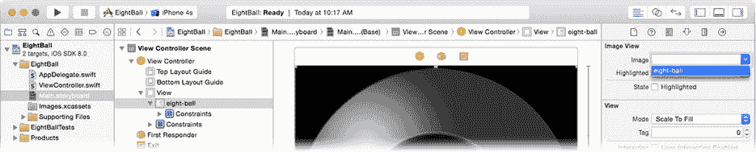

图 4-10. 设置图像

现在你需要添加一个文本视图来显示魔法信息。从对象库中拖入一个新的文本视图（不是文本字段）对象，将其放置在八球中间"窗口"的上方。几乎完全像你为八球图像视图所做的那样（参见图 4-8），添加以下约束：


1.  将`宽度`固定为 160，`高度`固定为 112。
2.  在容器内水平居中并垂直居中。

文本视图现在具有固定尺寸，并精确居中位于八球图像视图的正上方。保持文本视图处于选中状态，使用属性检查器设置以下属性：

1.  将文本设置为 `SHAKE FOR ANSWER`，共三行（参见图 4-11）。按住 Option 键的同时按 Return 键，可在文本属性字段中插入一个字面意义上的“回车”字符。

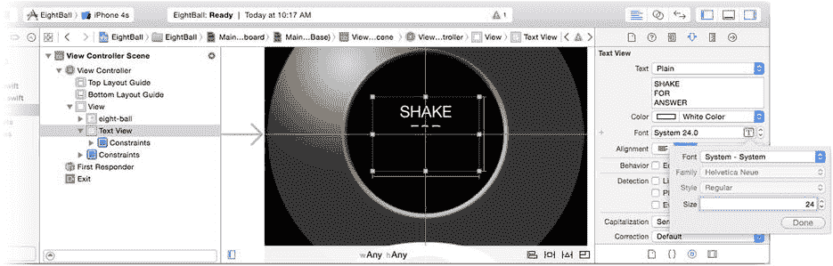

图 4-11. 完成的 EightBall 界面

2.  将文本视图颜色设为白色。
3.  点击字体属性中的向上箭头，直至显示 System 24.0。
4.  选择居中（中间）对齐。
5.  取消勾选“可编辑”行为属性。
6.  再往下，找到背景属性，并将其设置为默认值（无背景）。
7.  取消勾选“不透明”属性。

你的界面设计已完成，应看起来与图 4-11 一致。现在该进入代码部分了。

### 编写代码

你的 `ViewController` 对象需要与文本视图对象建立连接。选择你的 `ViewController.swift` 文件并添加以下属性：

```swift
@IBOutlet var answerView: UITextView!
```

你还需要一组答案，因此在新属性之后立即添加以下内容：

```swift
let answers = [ "\rYES", "\rNO", "\rMAYBE",
                "I\rDON'T\rKNOW", "TRY\rAGAIN\rSOON", "READ\rTHE\rMANUAL" ]
```

该语句定义了一个 `String` 对象的不可变数组。每个对象都是八球中可能出现的一个答案。`\r` 字符称为*转义*序列。它由一个反斜杠（向左倾斜的斜杠）字符后跟一个代码组成，该代码告诉编译器用特殊字符替换该序列。在这种情况下，`\r` 被替换为字面意义上的“回车”字符——这是一个在你源代码中无法通过另起一行来输入的字符。

现在，你将添加两个函数来更新消息显示：`fadeFortune()` 和 `newFortune()`。在数组之后添加此代码：

```swift
func fadeFortune() {
    UIView.animateWithDuration(0.75) {
        self.answerView.alpha = 0.0
    }
}

func newFortune() {
    let randomIndex = Int(arc4random_uniform(UInt32(answers.count)))
    answerView.text = answers[randomIndex];
    UIView.animateWithDuration(2.0) {
        self.answerView.alpha = 1.0
    }
}
```

`fadeFortune()` 函数使用 iOS 动画将 `answerView` 文本视图对象的 `alpha` 属性更改为 `0.0`。视图的 `alpha` 属性表示视图的可见不透明度。值为 `1.0` 表示完全不透明，`0.5` 表示 50% 透明，值为 `0.0` 表示完全不可见。`fadeFortune()` 使文本视图对象在 ¾ 秒的时间内逐渐淡出至消失。

**注意** 动画将在第 11 章中更详细地介绍。

`newFortune()` 函数是乐趣所在。第一条语句执行了以下三项操作：

1.  调用 `arc4random_uniform(_:)` 函数，在 0 到小于答案数量的数字之间随机选取一个数。因此，如果 `answers.count` 为 6，则该函数将返回 0 到 5（含）之间的随机数。
2.  使用该随机数作为 `answers` 数组的索引，选取一个常量字符串对象。
3.  使用随机答案来设置文本视图对象的 `text` 属性。设置后，文本视图对象将在你的界面中显示该文本。

最后，再次使用 iOS 动画将 `alpha` 属性缓慢更改回 `1.0`，在 2 秒内从不可见变为不透明，使新消息逐渐显现。

还有一个细节需要处理：将 `answerView` 出口连接到界面中的文本视图对象。切换到 `Main.storyboard` 界面生成器文件。选择视图控制器对象，然后使用连接检查器连接 `answerView` 出口，如图 4-12 所示。

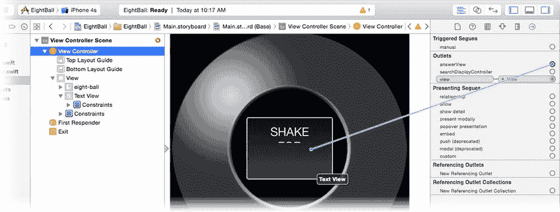

图 4-12. 连接 `answerView` 出口

### 处理摇动事件

你的应用现在具备运行所需的一切，只差触发它的事件处理。在 Xcode 文档（帮助  文档和 API 参考）中，查看 `UIResponder` 的文档。在其中，你将找到三个函数的文档。

```swift
func motionBegan(motion: UIEventSubtype, withEvent event: UIEvent)
func motionEnded(motion: UIEventSubtype, withEvent event: UIEvent)
func motionCancelled(motion: UIEventSubtype, withEvent event: UIEvent)
```

每个函数在运动事件的不同阶段被调用。运动事件很简单——记住，这些都是“高级”事件。运动事件开始，然后结束。如果运动被中断或从未完成，你的对象会收到一个运动取消消息。

要处理视图控制器中的运动事件，请将这三个事件处理函数添加到你的 `ViewController`：

```swift
override func motionBegan(motion: UIEventSubtype, withEvent event: UIEvent) {
    if motion == .MotionShake {
        fadeFortune()
    }
}

override func motionEnded(motion: UIEventSubtype, withEvent event: UIEvent) {
    if motion == .MotionShake {
        newFortune()
    }
}

override func motionCancelled(motion: UIEventSubtype, withEvent event: UIEvent) {
    if motion == .MotionShake {
        newFortune()
    }
}
```

每个函数首先检查运动参数，看接收到的运动事件是否描述了您感兴趣的事件（摇动动作）。如果不是，则忽略该事件。这一点很重要。未来版本的 iOS 可能会添加新的运动事件；你的对象应只关注它设计用来处理的事件。

`motionBegan(_:,withEvent:)` 函数调用 `fadeFortune()`。当用户开始摇动设备时，当前消息会淡出消失。

`motionEnded(_:,withEvent:)` 函数调用 `newFortune()`。当摇动停止时，会出现新的答案。

最后，`motionCancelled(_:,withEvent:)` 函数确保如果运动被中断或被解释为其他手势，仍有一条消息可见。

### 测试你的 EightBall 应用

确保在方案中选择了 iPhone 模拟器，然后运行你的应用。它将出现在模拟器中，如图 4-13 所示。

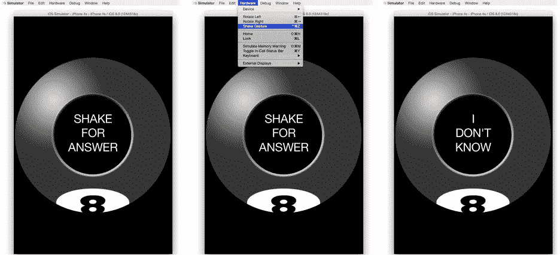

图 4-13. 测试 EightBall

在模拟器中选择“硬件”  “摇动手势”命令，如图 4-13 中间所示。该命令模拟用户摇动设备，这将导致摇动运动事件被发送到你的应用。

恭喜，你已经成功创建了一个摇动运动事件处理程序！每次你摇动模拟设备时，都会出现一条新消息，如图 4-13 右侧所示。

**第一响应者与响应者链**

从技术上讲，你的视图控制器不一定是第一响应者。要求的是你的视图控制器*位于响应者链中*。如果你的界面中任何视图或子视图是第一响应者，你的视图控制器就会在响应者链中，并且会接收运动事件——除非那些其他视图之一首先拦截并处理了该事件。


