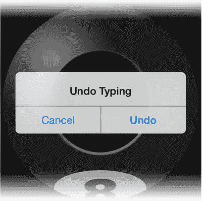

# 默认情况下，你的视图控制器不是第一响应者，也无法成为第一响应者

默认情况下，你的视图控制器不是第一响应者，也无法成为第一响应者。一个想要成为第一响应者的对象必须在其`canBecomeFirstResponder()`函数中返回`true`。`UIResponder`的基类实现返回`false`。因此，任何`UIResponder`的子类都没有资格成为第一响应者，除非它重写了`canBecomeFirstResponder()`函数。

在使你的对象有资格成为第一响应者之后，下一步是显式地请求成为第一响应者。这通常在`viewDidAppear()`函数中完成，使用如下代码：

```
becomeFirstResponder()
```

特定的 Cocoa Touch 类——最值得注意的是文本视图和文本字段类——被设计为第一响应者，并且当调用`canBecomeFirstResponder()`时，它们返回`true`。这些对象在被触摸或激活时将自己确立为第一响应者。作为第一响应者，它们处理键盘事件、复制粘贴请求等。

此时你可能会想，如果你的视图控制器不是第一响应者，也不在响应者链中，为什么它会接收到运动事件。这要归功于 iOS 7。iOS 最近的变化是，如果没有第一响应者，或者窗口是第一响应者，则将运动事件传递给活动视图控制器。如果你希望你的应用也能在更早版本的 iOS 上运行，你需要确保你的视图控制器能够成为第一响应者（通过重写`canBecomeFirstResponder()`），然后在视图加载时请求它成为第一响应者（`becomeFirstResponder()`）。

### 演示响应者链的实验

这里有一个实验可以演示响应者链的实际工作原理。在`Main.storyboard`文件中，选择文本视图对象，并使用属性检查器勾选可编辑行为。运行应用，长按文本字段，当键盘弹出时，编辑预言文本。现在选择模拟器的 Hardware  Shake Gesture 命令。会发生什么？字段中的文本发生了变化，正如你编程所期望的那样。

返回`ViewController.swift`文件，注释掉所有三个运动事件处理函数。通过选中所有三个函数的文本，然后选择 Editor  Structure  Comment Selection（Command+/）来完成。现在再次运行应用，选择文本，修改它，然后摇晃模拟器。会发生什么？这次你会看到一个撤销对话框，询问你是否要撤销对文本所做的更改。



运动事件最初发送给第一响应者（文本字段），然后最终通过视图控制器，最终落在`UIApplication`对象中。`UIApplication`对象将摇晃事件解释为“撤销输入”。通过在视图控制器中拦截运动事件，你覆盖了`UIApplication`对象提供的默认行为。

恢复到之前的代码状态：返回`ViewController.swift`并选择 Edit  Undo。对`Main.storyboard`也执行同样的操作。

