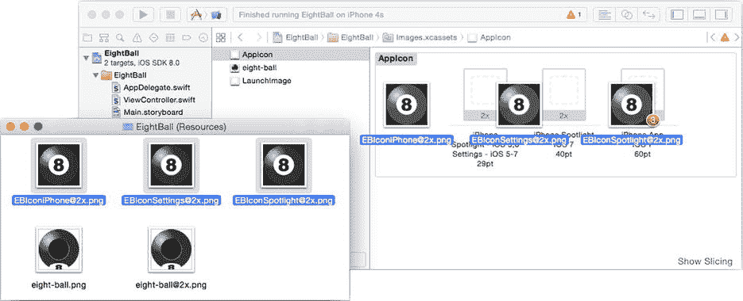

# 收尾工作

用漂亮的图标为你的应用增添一些光彩——至少用你在`EightBall (Resources)`文件夹中找到的图标。在项目导航器中，选择`images.xcassets`文件，然后选择`AppIcon`组。在`EightBall (Resources)`文件夹可见的情况下，将三个图标图像文件拖入`AppIcon`预览区域，如 Figure 4-14 所示。Xcode 会根据其大小自动为每个图标资源分配相应的图像文件。

Figure 4-14. 导入应用图标

处理完这个细节后，让我们真正地“摇一摇”——在真实的 iOS 设备上运行你的应用。

