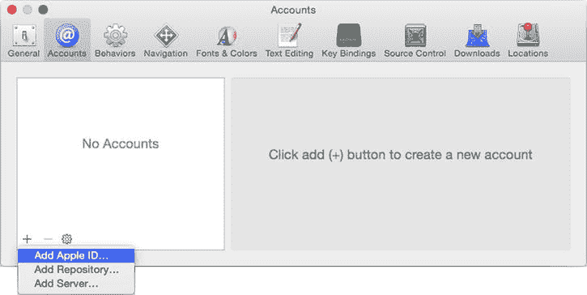
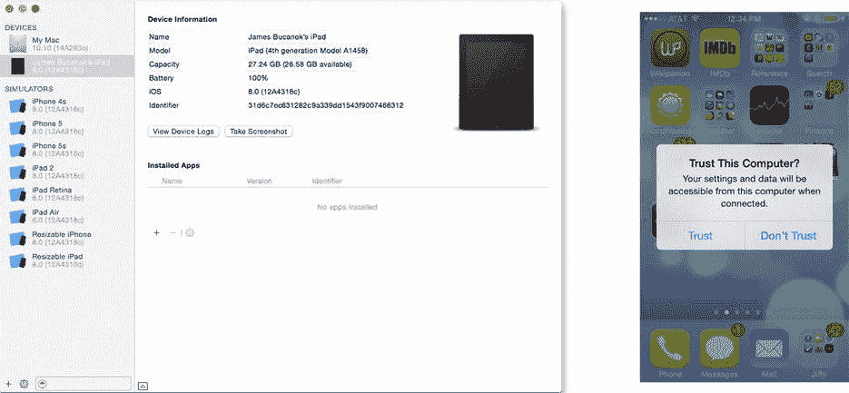
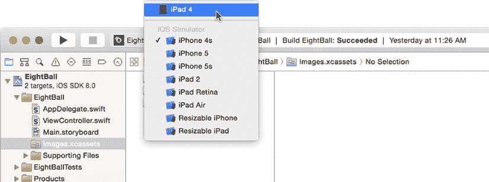

# 在物理 iOS 设备上测试

你可以使用 Xcode 的 iPhone 和 iPad 模拟器测试你的大量应用，但有一些事情模拟器无法模拟。其中两件事是多次（超过两次）触摸和真实的加速度计事件。要测试这些功能，你需要一个真实的 iOS 设备，带有真实的加速度计硬件，并且你可以用真实的手指触摸它。

第一步是将 Xcode 连接到你的 iOS 开发者账户。选择 Xcode  Preferences 并切换到 Accounts 标签。从窗口底部的 + 按钮选择 Add Apple ID，如 Figure 4-15 所示。

Figure 4-15. 将新的 Apple ID 添加到 Xcode

提供你的 Apple ID 和密码，然后点击 Add 按钮。如果你还不是 iOS Developer Program 的成员，有一个方便的 Join Program 按钮，会将你带到 Apple 的网站。

**注意** 在设备上运行应用之前，你必须先成为 iOS Developer Program 的成员。请访问`http://developer.apple.com/programs/ios`了解如何成为会员。一旦你成为会员，Xcode 将使用你的 Apple ID 来下载和安装配置设备所需的安全证书。

将 iPhone、iPad 或 iPod Touch 插入电脑的 USB 端口。打开 Xcode 的设备窗口（Window  Devices）。你插入的 iOS 设备将出现在左侧，如 Figure 4-16 所示。如果你的设备上出现“信任”对话框，如 Figure 4-16 右侧所示，你需要授予 Xcode 访问你的设备的权限。

Figure 4-16. 设备管理

在侧边栏中选择你的 iOS 设备。如果显示“Use for Development”按钮，点击它，Xcode 将准备你的设备进行开发，这个过程称为*配置*。这将允许你直接通过 Xcode 构建、安装和运行大多数 iOS 项目。

一旦你的设备配置完成，返回你的项目工作区窗口。将方案设置从某个模拟器更改为你的实际设备。我配置了一个名为 iPad 4 的 iPad，因此 iPad 4 现在作为运行目标之一出现在 Figure 4-17 中。

Figure 4-17. 选择用于测试的 iOS 设备

再次运行 EightBall 应用。这次，你的应用将被构建，复制到你的 iOS 设备上，并在那里开始运行。很酷吧？

令人惊叹的是 Xcode 仍然在控制之中——所以暂时不要拔掉你的 USB 连接！你可以设置断点、冻结应用、检查变量，并且通常可以做任何在模拟器中能做的事情。

当 EightBall 应用运行时，摇晃你的设备，看看会发生什么。完成后，点击 Xcode 工具栏中的 Stop 按钮。你会注意到你的 EightBall 应用现在已安装在你的设备上。你可以随意拔掉 USB 连接并随身携带；毕竟，这是你的应用。

