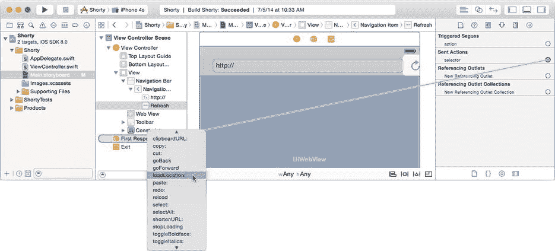
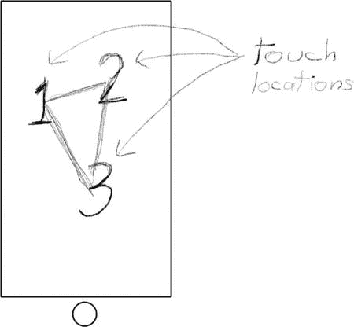
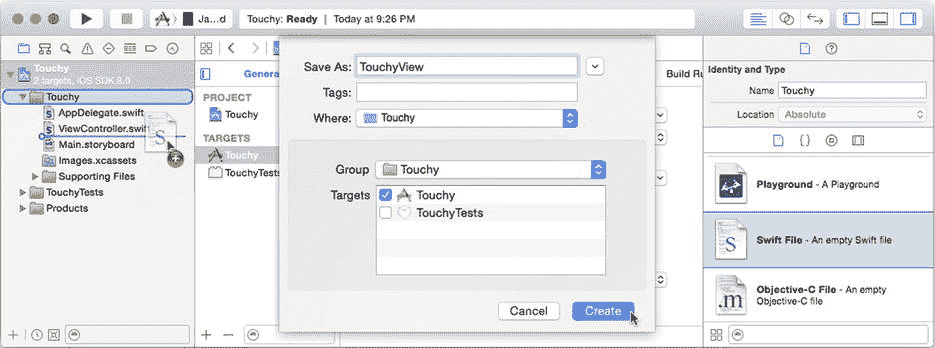
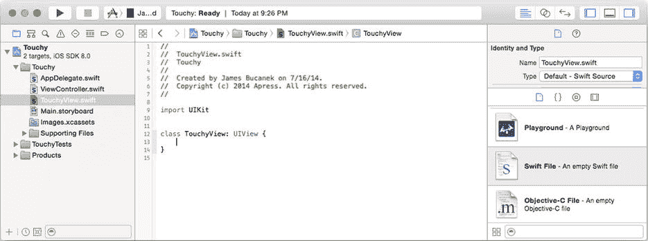
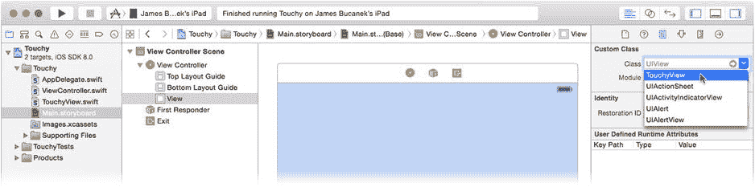
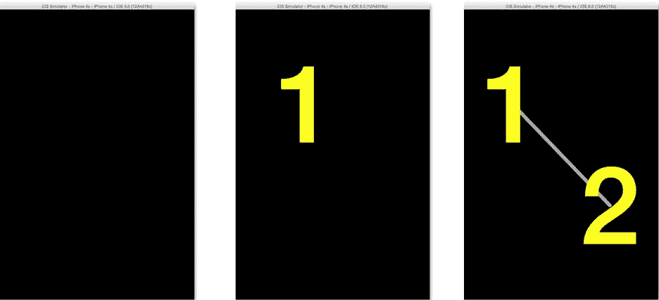

# 响应者链的其他用途

趁你对响应者链的概念还记忆犹新，在你继续学习低级事件之前，我想提一下响应者链的其他几个用途。响应者链不仅仅用于处理事件。它在操作、编辑和其他服务中也扮演着重要角色。

在之前的项目中，你将按钮和文本字段的操作连接到特定对象。在 Interface Builder 中连接操作会设置两部分信息。

*   将接收操作的对象（`ViewController`）
*   要调用的操作函数（`shortenURL(_:)`）


也可以将动作发送到响应链，而非特定对象。在 Interface Builder 中，你可以通过将动作连接到第一响应者占位对象来实现这一点，如图 4-18 所示。



图 4-18. 将动作连接到响应链

当按钮的动作被发送时，它会首先到达第一响应者对象——无论该对象是什么。对于动作，iOS 会检测该对象是否实现了预期的函数（本例中为 `loadLocation(_:)`）。如果是，则该对象会接收到那条消息。如果不是，iOS 就会沿着响应链逐级查找，直到找到一个实现了该函数的对象。

这在较复杂的应用中尤其有用，当动作消息的接收者位于 Interface Builder 文件或故事板场景的作用域之外时尤为如此。你只能在同一个场景中的对象之间建立连接。如果你需要一个按钮向另一个视图控制器或应用对象本身发送动作，在 Interface Builder 中是无法建立这种连接的。但你可以将按钮连接到第一响应者。只要预期的接收者在按钮触发动作时位于响应链中，你的对象就能接收到它。

编辑功能也高度依赖响应链。在 iOS 中开始编辑文本时（比如 Shorty 应用中的 URL 字段），该对象会成为第一响应者。当用户使用键盘（虚拟键盘或其他键盘）输入时，这些按键事件会被发送给第一响应者。同一屏幕中可以包含多个文本字段，但只有一个会成为第一响应者。所有按键事件、复制粘贴命令等，都会发送给当前活动的文本字段。

## Touchy 应用

你已经了解了很多关于所谓的高层事件、初始响应者和响应链的知识。现在是时候深入底层事件处理了，我们从最常用的底层事件开始：触摸事件。

Touchy 应用是一个演示应用。它唯一的功能就是向你展示你正在触摸屏幕的位置。它既有助于观察实际操作过程，也有助于探索触摸事件处理中的一些细微之处。你还将学到一项非常重是 Interface Builder 新技能：在界面中创建自定义对象。

#### 设计

Touchy 应用的界面也极其简单，如图 4-19 所示。Touchy 将显示你触摸视图对象的一个或多个位置。为了让应用不那么无聊，我们会添加一些额外图形来点缀一下，但这并非此次探索的重点。



图 4-19. Touchy 应用草图

该应用将通过一个自定义视图对象来拦截触摸事件。你的自定义视图对象将提取每个活动触摸点的坐标，并用这些坐标来绘制它们的位置。

### 创建项目

按照前几次的方式，首先创建一个基于“单视图 iOS 应用程序”模板的新 Xcode 项目。将项目命名为 Touchy，语言设置为 Swift，设备选择通用。

选择位置保存新项目并创建它。在项目导航器中，选择项目，选择 Touchy 目标，选择摘要标签页，然后更改设备方向，仅启用竖屏方向。

### 创建自定义视图

我们将改变前几个应用中的开发模式。你不再将代码添加到 `ViewController` 类中，而是创建一个新的 `UIView` 自定义子类。“为什么”将在第 11 章中解释。“如何做”现在就来解释。

在项目导航器中选中 Touchy 组（而不是项目）。从文件模板库中，拖入一个新的 Swift 文件，并将其放到你的项目中，放置在 `ViewController.swift` 文件下方，如图 4-20 所示。将该文件命名为 `TouchyView` 并添加到你的项目中。



图 4-20. 添加新的 Swift 源文件

将单一的 `import Foundation` 语句替换为 `import UIKit` 语句，后跟一个 `class TouchyView: UIView { }` 声明，如图 4-21 所示。



图 4-21. 定义一个新的 Swift 类

你已成功创建了一个新的 Swift 类！你的类是 `UIView` 的子类，因此它继承了 `UIView` 对象的所有行为和特性，并且可以在任何使用 `UIView` 对象的地方使用。

### 处理触摸事件

现在你将自定义你的 `UIView` 对象来处理触摸事件。请记住，基类 `UIResponder` 和 `UIView` 并不处理触摸事件。相反，它们只是将事件沿响应链向上传递。通过实现你自己的触摸事件处理函数，你将改变这一行为，使你的视图直接响应触摸操作。

正如你已经知道的，触摸事件会被传递到它们所发生的视图对象。如果你还不知道这一点，请返回阅读“命中测试”部分。你只需在你的类中添加适当的事件处理函数即可。将以下代码添加到你的 `TouchyView` 类中：

```
override func touchesBegan(touches: NSSet, withEvent event: UIEvent) {
    updateTouches(event.allTouches())
}

override func touchesMoved(touches: NSSet, withEvent event: UIEvent) {
    updateTouches(event.allTouches())
}

override func touchesEnded(touches: NSSet, withEvent event: UIEvent) {
    updateTouches(event.allTouches())
}

override func touchesCancelled(touches: NSSet!, withEvent event: UIEvent) {
    updateTouches(event.allTouches())
}
```

**注意** Xcode 会在你的源代码中显示一些错误。先忽略它们；等你添加了 `updateTouches(_:)` 函数后就会修复。

每个触摸事件消息都包含两个对象：一个包含相关触摸对象的 `NSSet` 对象，以及一个概括了导致函数被调用的事件的 `UIEvent` 对象。

在典型的应用中，你的函数可能只关心 `touches` 集合。这个集合（或无序集合）中的每个对象对应一个与该事件相关的触摸，都包含一个 `UITouch` 对象。每个 `UITouch` 对象描述一个触摸位置：其坐标、相位、发生时间、点击次数等。

对于“开始”事件，touches 集合将包含刚刚开始的触摸所对应的 `UITouch` 对象。对于“移动”事件，它只包含那些发生了移动的触摸点。对于“结束”事件，它只包含那些从屏幕上移除的触摸对象。从编程角度来看这很方便，因为大多数视图对象只关心与该事件相关的 `UITouch` 对象。

然而，Touchy 应用略有不同。Touchy 希望始终跟踪所有活动的触摸。你其实并不关心刚刚发生了什么。相反，你想要的是“全局视图”：当前与屏幕接触的所有触摸点的列表。为此，我们需要转向 `event` 对象。

`UIEvent` 对象的主要目的是描述刚刚发生的单个事件，或者更准确地说，是刚刚从事件队列中取出的单个事件。但 `UIEvent` 还携带了一些其他有趣的信息。其中之一是 `allTouches` 属性，它包含了设备上所有触摸点的当前状态，无论它们与哪个视图相关联。


现在我可以解释你所有的事件处理函数在做什么了。它们一直在等待设备触摸状态的任何变化，忽略具体的变化细节，深入`event`对象找到所有活跃触摸对象的状态，然后将这些状态传递给你的`updateTouches(_:)`函数。这个函数会记录所有活跃触摸的位置，并利用这些信息在屏幕上绘制这些位置。

那么，我想你需要编写这个函数了！紧接在`TouchyView.swift`中刚刚添加的触摸事件处理函数之后，添加以下函数：

```
var touchPoints = [CGPoint]()

func updateTouches( touches: NSSet? ) {
    touchPoints = []
    touches?.enumerateObjectsUsingBlock() { (element, stop) in
        if let touch = element as? UITouch {
            switch touch.phase {
                case .Began, .Moved, .Stationary:
                    self.touchPoints.append(touch.locationInView(self))
                default:
                    break
            }
        }
    }
    setNeedsDisplay()
}
```

`updateTouches(_:)`函数首先将`touchPoints`数组对象设置为空数组。这是你要存储感兴趣信息的地方。然后`updateTouches(_:)`遍历集合中的每个`UITouch`对象，并检查其*阶段（phase）*。触摸的阶段是其当前状态：“开始（began）”、“移动（moved）”、“静止（stationary）”、“结束（ended）”或“取消（canceled）”。Touchy 只对表示手指仍接触屏幕的状态（“开始”、“移动”和“静止”）感兴趣。`switch`语句匹配这三个状态，并获取相对于此视图对象的触摸坐标。然后将这个`CGPoint`值添加到`touchPoints`数组中。

一旦收集完所有活跃触摸的坐标，你的视图对象会调用其`setNeedsDisplay()`函数。这个函数告知视图对象需要重绘自身。

### 绘制你的视图

到目前为止，你还没有编写任何绘制内容的代码。你只是拦截了发送到视图的触摸事件，并提取了关于设备触摸状态所需的信息。在 iOS 中，你并不是在事件发生时立刻绘制内容，而是记录下需要绘制的内容，等待 iOS 告知你的对象何时进行绘制。绘制由我在本章开头提到的用户界面更新事件触发。

关于绘制的工作原理在第 11 章中有描述，因此这里我不再深入细节。只需知道当 iOS 希望你的视图进行自绘制时，会调用对象的`drawRect(_:)`函数。请将这个`drawRect(_:)`函数添加到你的类中：

```
override func drawRect(rect: CGRect) {
    let context = UIGraphicsGetCurrentContext()
    UIColor.blackColor().set()
    CGContextFillRect(context, rect)

var connectionPath: UIBezierPath?
    if touchPoints.count > 1 {
        for location in touchPoints {
            if let path = connectionPath {
                path.addLineToPoint(location)
            }
            else {
                connectionPath = UIBezierPath()
                connectionPath!.moveToPoint(location)
            }
        }
        if touchPoints.count > 2 {
            connectionPath!.closePath()
        }
    }

if let path = connectionPath {
        UIColor.lightGrayColor().set()
        path.lineWidth = 6
        path.lineCapStyle = kCGLineCapRound
        path.lineJoinStyle = kCGLineJoinRound
        path.stroke()
    }

var touchNumber = 0
    let fontAttributes = [
            NSFontAttributeName:            UIFont.boldSystemFontOfSize(180),
            NSForegroundColorAttributeName: UIColor.yellowColor()
            ];
    for location in touchPoints {
        let text: NSString = "\(++touchNumber)"
        let size = text.sizeWithAttributes(fontAttributes)
        let textCorner = CGPoint(x: location.x - size.width / 2,
                                 y: location.y - size.height / 2)
        text.drawAtPoint(textCorner, withAttributes: fontAttributes)
    }

}
```

哇，代码真多。同样，细节并不重要，但你可以自由研究这段代码以了解其功能。我仅在此概述其作用。

第一部分将整个视图填充为黑色。

中间部分是一个大循环，它创建了一个贝塞尔路径（以法国工程师皮埃尔·贝塞尔命名）。贝塞尔路径几乎可以表示任何线条、多边形、曲线、椭圆或这些元素的任意组合。基本上，只要是一个形状，贝塞尔路径就能绘制它。你将在第 11 章中全面了解贝塞尔路径。在这里，它用于在两个或更多触摸点之间绘制浅灰色线条。这纯粹是为了视觉美观，即使去掉`drawRect(_:)`函数的这一部分，应用仍然可以正常运行。

最后一部分是有趣的部分。它遍历触摸坐标，并在触摸屏幕的每个手指下方居中绘制一个大的黄色数字“1”、“2”或“3”。

现在你已经拥有了一个自定义视图类，它可以收集触摸事件、跟踪它们并在屏幕上绘制。这个谜题的最后一个部分是，如何将你的自定义对象引入到界面中。

### 在 Interface Builder 中添加自定义对象

选择你的`Main.storyboard` Interface Builder 文件，然后选择视图控制器场景中的唯一一个视图对象。切换到身份检查器。身份检查器会显示所选对象的类。在本例中，它是项目模板创建的普通`UIView`对象。

这里有一个很酷的技巧：你可以使用身份检查器将通用视图对象的类更改为你创建的任何`UIView`子类。将该视图对象的类从`UIView`更改为`TouchyView`，如图 4-22 所示。你可以使用下拉菜单或直接输入类名来完成此操作。



图 4-22. 更改 Interface Builder 对象的类

现在，你的应用将不再创建`UIView`对象作为根视图，而是创建一个`TouchyView`对象，并包含你定义的所有函数、属性、输出口和操作。你可以对界面中的任何现有对象执行此操作。如果你想创建一个新的自定义对象，请在库中找到基类对象（如`NSObject`、`UIView`等），添加该对象，然后将其类更改为你的自定义类。

你新的`TouchyView`对象仍然有一些属性需要定制才能正常工作。保持选中`TouchyView`对象，切换到属性检查器，然后勾选“交互”下的“多点触控”选项。默认情况下，视图对象不接收多点触摸事件。换句话说，即使存在多个触摸点，`touches*SomePhase*(_:withEvent:)`函数也永远不会包含超过一个`UITouch`对象。为了让你的视图接收所有触摸，你必须开启多点触控选项。

**注意**  如果你愿意，也可以给 Touchy 添加一个图标。打开`Touchy (Resources)`文件夹，找到五个`TouchyIcon....png`文件，然后将它们拖入`images.xcassets`资源目录的`AppIcon`组中，就像你为八球应用所做的那样。

### 测试 Touchy

将你的运行方案设置为 iPhone 或 iPad 模拟器，然后运行项目。界面将完全（并且不祥地）变为黑色，如图 4-23 左侧所示。



图 4-23. 在模拟器中运行 Touchy

点击界面，数字“1”就会出现，如图 4-23 中间所示。尝试拖动它。Touchy 会跟踪触摸界面的所有变化，进行更新，然后在每次触摸的确切位置下方绘制一个数字。


