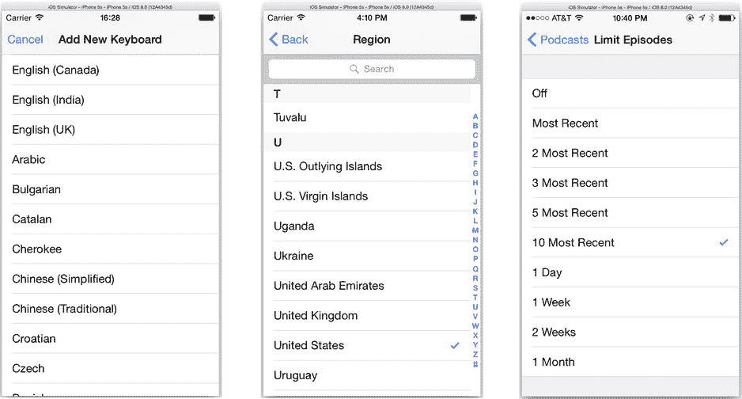
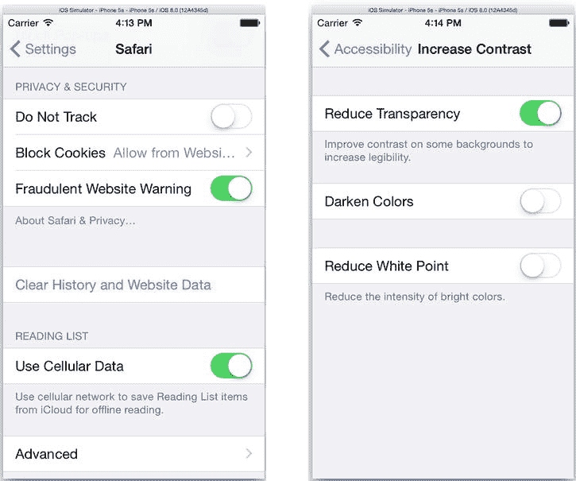
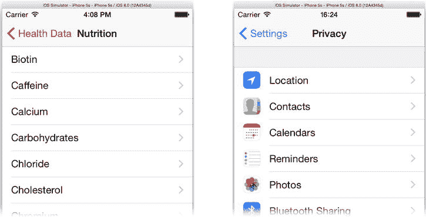
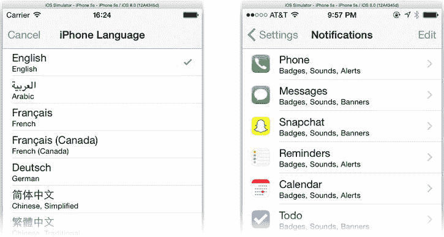
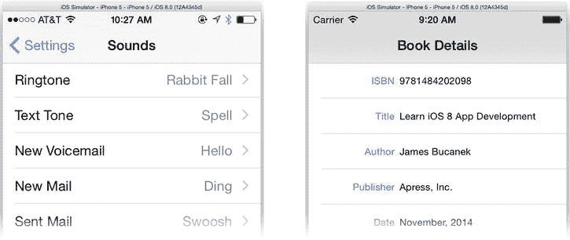
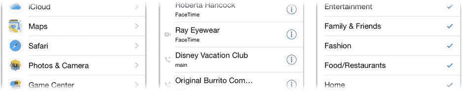

# 修改 EightBall

修改 `EightBall` 应用，使其请求设备方向通知，而非处理摇动动作事件。当应用收到方向变化通知时，检查当前 `UIDevice` 对象的朝向。如果朝向属性为 `UIDeviceOrientationFaceUp`，则显示一条新消息；如果是其他朝向，则让消息消失。现在你拥有了一个更“逼真”的魔法八球模拟器！你可以在 `EightBall E1` 文件夹中找到我对这个练习的解答。

## 第 5 章：餐桌礼仪

表格是 iOS 界面中一个强大且灵活的元素。它们如此灵活，以至于在许多应用中，表格视图*就是*界面的全部。在本章中，你将学习表格视图，并在此过程中掌握一些类组织与对象间通信的技巧。到本章结束时，你将了解以下内容：

- 表格视图
- 表格单元格
- 单元格缓存
- 表格编辑
- 通知

本章你将创建的应用将更依赖于 Swift 代码而非 Interface Builder。这对于表格视图界面来说是典型情况，因为表格视图类已经提供了表格的大部分外观，因此需要你设计的东西并不多。（这并不意味着你*不能*设计自己的样式，我也会讨论这一点。）首先，你需要了解表格视图的外观。

### 表格视图

*表格视图*是一个 `UITableView` 对象，用于呈现、绘制、管理和滚动一个垂直的单列行列表。每个*行*是表格中的一个元素。各行可以完全相同（同质），也可以彼此差异显著（异质）。表格可以显示为一个连续的行列表，也可以将行分组显示。

如果你用过 iPhone、iPad 或 iPod 超过几分钟，你就一定见过表格视图的实际应用。事实上，你可能没有意识到许多 iOS 应用的界面就是表格视图。等你学完本节，你将能一眼认出它们。

表格的整体外观由创建表格视图时选择的*表格样式*决定。其内容可以通过各个行的样式和布局进一步细化。我先从介绍整体表格样式开始。

#### 纯表格

纯表格样式（`UITableViewStyle.Plain`）是你最可能认出是表格视图或列表的一种。如图 5-1 左侧的键盘选择列表所示，它展示了一个纯（`.Plain`）样式视图。

图 5-1. 纯表格样式

在图 5-1 中间是一个带有索引的纯表格样式，这是长列表常见的装饰。索引添加了将相似项分组的部分标签，并提供了通过右侧索引快速跳转到列表中特定组的方法。

另一种略显小众的纯表格样式是选择列表样式（如图 5-1 右侧所示）。它看起来就像是带有部分标题的纯表格样式，但没有索引。它用于从（可能很长的）选项列表中选择一个或多个选项。

## 分组表格

分组表格样式（`UITableViewStyle.Grouped`）是另一种表格样式。此样式将多组行集合在一起。每个组都有可选的头部和尾部，允许你为组添加标题、描述甚至解释性文字。你应该能立刻认出图 5-2 中的示例。

图 5-2. 分组表格样式

“设置”应用几乎完全由表格视图构建而成。每组上方的标题是*组头部*。下方的文本是*组尾部*。各个设置控件是表格的每一行。它看起来几乎不像一个表格，但它使用了与图 5-1 中相同的 `UITableView` 对象。分组列表不能有索引。

你为列表选择的样式设定了表格的整体基调。然后，在每个行的外观方面，你有很多选择。

### 单元格样式

*表格视图单元格*对象控制每一行的外观和内容。iOS 提供了几种表格单元格样式。

- 默认
- 副标题
- 值 1（右侧详情）
- 值 2（左侧详情）

默认样式（`UITableViewCellStyle.Default`）是基本样式，如图 5-3 所示。

图 5-3. 默认单元格样式

默认样式有一个粗体标题。它可以选择性地包含一个显示在左侧的小图片。右侧的箭头、勾选标记或控件被称为*辅助视图*，稍后我会讨论它们。

第二种主要的单元格样式是副标题样式（`UITableViewCellStyle.Subtitle`），如图 5-4 所示。它与默认样式几乎相同，但可以在每个标题下方包含一行弱化的文本——即副标题。副标题文本是可选的。如果你省略副标题，它看起来就像默认样式。

图 5-4. 副标题单元格样式

最后两种样式是值 1 和值 2 样式（`UITableViewCellStyle.Value1` 和 `UITableViewCellStyle.Value2`），如图 5-5 所示。值 1 样式，也称为*右侧详情*样式（图 5-5 左侧），通常用于显示一系列值或设置；单元格的标题描述该值，右侧的字段显示当前值。

图 5-5. 值 1 和值 2 单元格样式

另一种 `.Value2` 样式，也称为*左侧详情*样式，更强调值而弱化其标题，如图 5-5 右侧所示。你会在“通讯录”应用中看到这种样式的单元格。`.Value1` 和 `.Value2` 单元格样式都不允许显示图片。

### 单元格辅助视图

在所有单元格样式的右侧，是可选的辅助视图。iOS 提供了三种标准辅助视图，如图 5-6 所示。

图 5-6. 标准辅助视图

标准辅助视图（从图 5-6 左到右）分别是：展开指示器、详情展开按钮和勾选标记。前两个用于指示点击行或按钮将*展开*——导航到——另一个显示该行详细信息的屏幕或视图。嵌套列表通常以此方式组织。例如，在一个国家表格中，每一行可能导航到另一个列出该国主要城市的表格。

展开指示器不是一个控件。它是一种提示，表明点击行内任何位置将导航到一些附加信息，就像国家/城市的例子一样。然而，详情展开按钮是一个常规按钮。你必须点击该辅助视图按钮才能导航到详情。这使行本身可以用于其他目的。“电话”应用的最近通话表格就是这样工作的（见图 5-6 中间）；点击一行向该联系人拨打电话，而点击详情展开按钮则导航到其联系信息。

