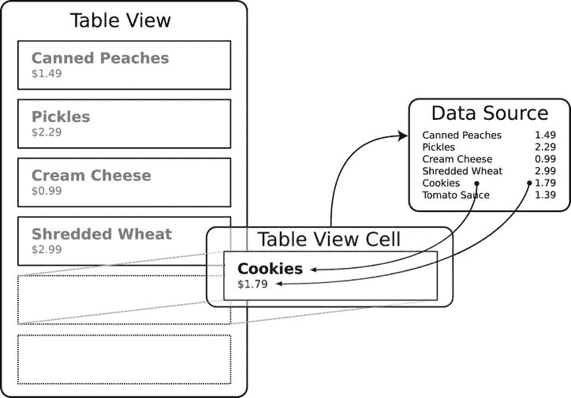
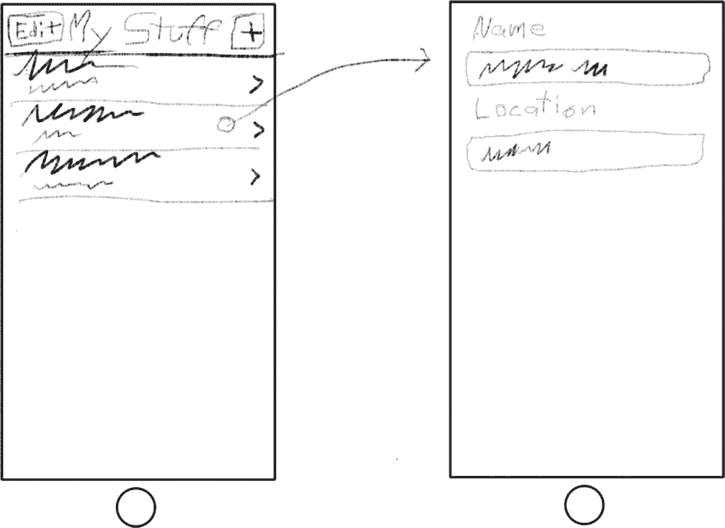
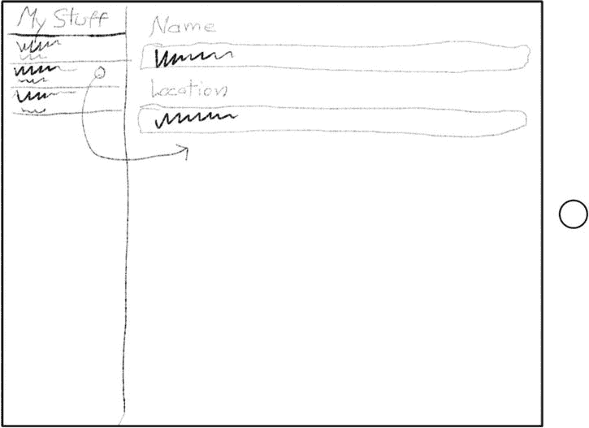
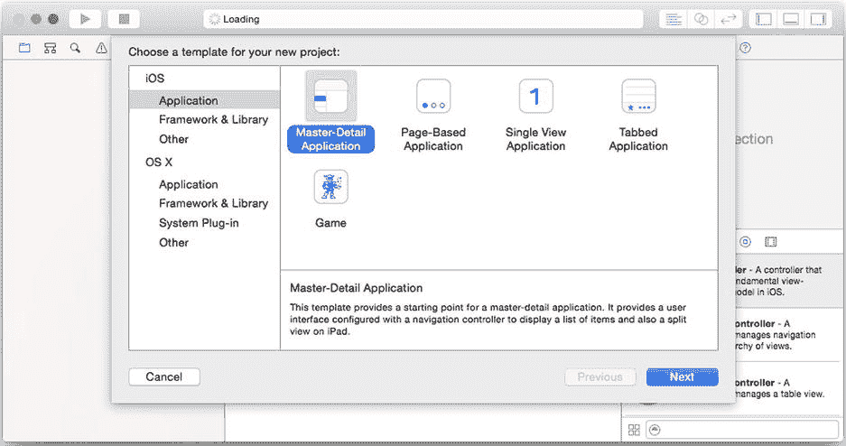

# Markdown 排版文档

复选标记正是如此，用于指示某行是否已被选中或标记，无论出于何种目的。

单元格的附属视图也可以设置为您选择的控件视图（例如切换开关）。这在显示设置的表格中很常见（参见图 5-2）。

### 自定义单元格

两种表格视图样式、四种单元格样式以及各种附属视图提供了极大的灵活性。如果你仔细研究苹果的通讯录、设置和音乐应用，你会惊讶地发现，界面的数量（据我统计有几十种）仅仅是内置表格和单元格样式的不同组合，并巧妙运用了可选图片、副标题和附属视图。

你还会注意到一些不符合我所描述的任何样式的单元格。表格单元格中有一个通配符：你可以设计自己的单元格。一个`UITableCell`对象是`UIView`的子类。因此，从理论上讲，一个表格单元格可以包含你想要的*任何*视图对象，甚至可以是你自己使用 Swift 和 Interface Builder 设计的自定义对象。所以，如果标准样式不完全符合你的需求，不必担心；你总是可以自己制作。我将在第 11 章中详细介绍这一点。

现在你已经了解了可能实现的功能，是时候更深入地了解表格的工作原理了。

### 表格视图的工作原理

到目前为止，你应用中的每个视觉元素都是一个视图对象。换句话说，你在设备上看到的与你的应用中的`UIView`对象之间存在着一一对应的关系。然而，表格视图在这种安排上存在一些问题，而表格视图类提供了一个巧妙的解决方案。

当一个表格视图为每一行都创建一个单元格对象时，当行数很多时就会遇到许多问题。不难想象一个包含数百个名字的联系人列表，或一个包含数*千*首歌曲的音乐列表。如果一个表格视图必须为每一首歌曲创建一个单元格对象，那么它将压垮你的应用，消耗大量的内存，花费很长时间来创建，并最终导致一个迟钝而笨重的界面。为了避免所有这些问题，表格视图使用了一些巧妙的障眼法。

#### 表格单元格和橡皮图章

如果你曾经在县书记官那里归档文件，或者在 UPC 条码时代之前在超市购物，那么你应该熟悉可调节的橡皮图章的概念，它可以通过刻度盘或可移动部件来印出特定的日期或价格。如果县书记官需要为每个日期准备不同的橡皮图章，那将是荒谬可笑的。类似地，表格视图不会为每一行创建单元格对象。它们创建一个单元格对象——或者至少少数几个——并重用这个单元格对象来绘制表格中的每一行，有点像橡皮图章。

图 5-7 展示了重用单元格对象的概念。此图中只有三个（主要的）视图对象：一个`UITableView`对象、一个`UITableViewCell`对象和一个数据源对象。表格视图重用这一个单元格对象来绘制每一行。

图 5-7. 可复用的单元格对象

表格视图使用委托对象来实现这一点，就像你在 Shorty 应用中使用过的委托对象一样。当你创建一个表格视图对象时，你必须为其提供一个*数据源*对象。你的数据源对象实现了特定的委托函数，当表格视图对象希望获得一个配置好用于绘制特定行的单元格对象时，会调用这些函数。

继续使用橡皮图章的类比，假设你有一个表格视图想要打印产品及其价格的列表。它首先将橡皮图章（单元格对象）交给你的（数据源）对象，并说：“请将此图章配置为列表中的第一个产品。”然后你的对象设置图章的属性（产品名称和价格），并将配置好的图章交回给表格视图。表格视图使用该图章打印第一行。然后它转身对第二行重复此过程，依此类推，直到所有行都被打印出来。

使用这种技术，一个表格视图可以绘制出高达数千行的表格，而只需使用几个对象。它快速、灵活且极其高效。

## MyStuff

你将创建一个名为`MyStuff`的个人物品清单应用。这是一个相对简单的应用，用于管理你拥有的物品列表，记录每件物品的名称及其存放位置（客厅、厨房等）。

#### 设计

此应用的设计比前两个稍复杂一些。由于 iPhone 和 iPad 之间的差异，它有点复杂。苹果的 Mail 应用在 iPhone 和 iPad 上的外观大相径庭。这是因为 iPhone 是一个紧凑型界面，屏幕空间仅够舒服地同时显示一个内容——要么是消息列表，要么是消息内容。iPad 是一个常规尺寸的界面，有足够的空间同时显示两者。底层应用逻辑相似，但视觉设计却大相径庭。幸运的是，`UISplitViewController`类为你管理了大部分这些差异。我将在本章中描述它的一些工作原理，并在第 12 章中更详细地介绍。图 5-8 展示了紧凑型（iPhone）设计。

图 5-8. MyStuff 的 iPhone 设计草图

紧凑型设计很简单，是表格视图工作原理的典型体现。主屏幕是物品列表，显示其描述和位置。点击一个项目会导航到第二个屏幕，你可以在那里编辑这些值。

常规型设计结构不那么严格。在横向模式下，物品列表将显示在左侧，如图 5-9 所示。点击一个项目会使其详细信息显示在右侧，并可以在那里进行更改。在纵向模式下（未显示），项目详情占满整个屏幕，而物品列表则变成一个弹出视图，用户通过屏幕左上角的按钮访问。

图 5-9. MyStuff 的 iPad 设计草图

如果这个界面看起来很眼熟，那就是苹果 Mail 应用使用的相同界面。编程实现这个界面并非易事，但你很幸运；Xcode 有一个应用模板，包含了使此设计工作所需的所有代码。你只需填写详细信息，这正是你接下来要做的。

### 创建项目

与所有应用一样，首先在 Xcode 中创建一个新项目。这次，选择 Master-Detail Application 模板，如图 5-10 所示。

图 5-10. 创建主从应用

主从模板之所以如此命名，是因为计算机开发者将这种界面称为主从界面。列表是你的*主*视图，显示所有数据的摘要。主视图会引导到一个次要的*详情*视图，该视图可能显示关于该项目的更多细节，或提供编辑工具。

将项目命名为`MyStuff`，选择 Swift 语言，并确保关闭 Use Core Data。将设备选项设置为 Universal。点击 Next 并将你的新项目文件夹保存到某个位置。

