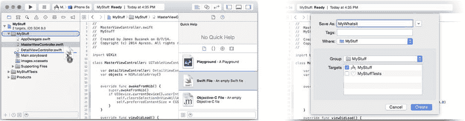
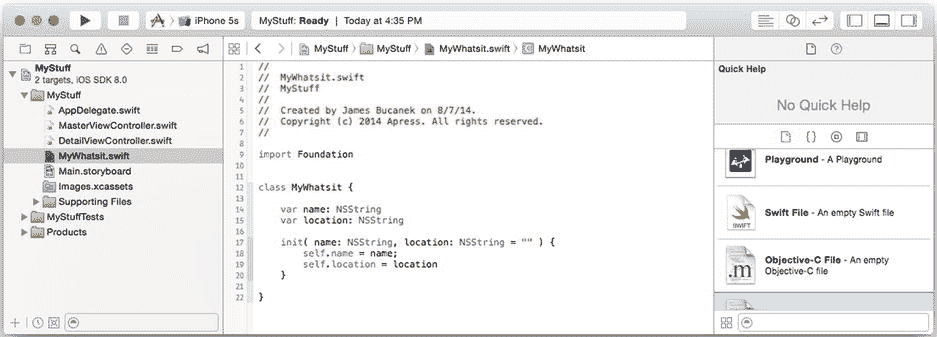
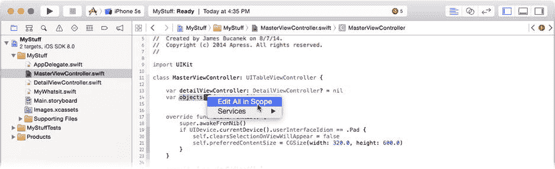
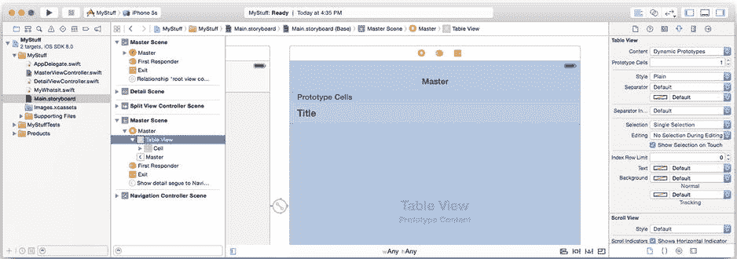
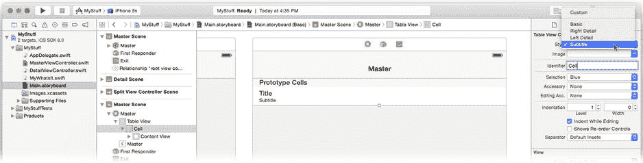
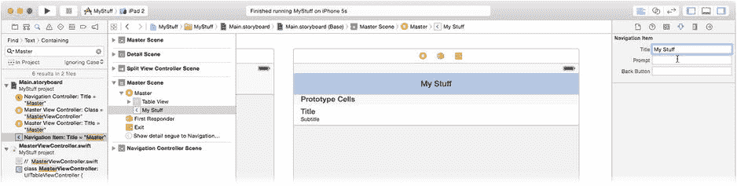
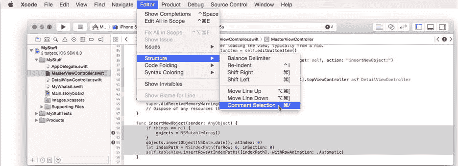

# 文档排版

首先你会注意到，这个项目中已经包含了许多代码。主从模板包含了显示项目列表、导航到详情界面、创建新项目、删除项目以及处理屏幕方向变化所需的全部代码。其表格的内容是简单的`NSDate`对象。你的任务是用有意义的内容替换这些占位对象。

**提示** 你最好花些时间仔细阅读项目模板中包含的代码。在导航、屏幕方向变化等方面，它做了“所有正确的事”。你将在第 12 章中了解更多关于导航的内容。

### 创建数据模型

你知道你想要显示一个“物品”列表——你拥有的各个物品。并且你知道每个物品至少需要两个属性：一个`name`属性和一个`location`属性，它们都是字符串。那么，用什么对象来表示每个物品呢？这是一个重要的问题，因为这个神秘的对象（或多个对象）就是所谓的*数据模型*。你的数据模型包含了代表你的表格视图正在显示的任何概念的对象。

**注意** 数据模型背后的理论和实践在第 8 章中有描述。

显然，Cocoa Touch 框架不包含这样的对象，所以你必须自己创建一个！在库中，选择文件模板选项卡，将一个新的 Swift 文件拖入你的项目，如图 5-11 左图所示。你也可以通过“文件”菜单中的“新建文件”命令，或者在导航器中按住 Control 键并右键点击一个组来添加新文件。使用你觉得最方便的方法。



图 5-11. 创建`MyWhatsit`类

将新文件命名为`MyWhatsit`，如图 5-11 右图所示。接受默认位置（`MyStuff`项目文件夹），确保新文件是`MyStuff`目标的一部分，然后点击“创建”。现在你的应用中有了一个名为`MyWhatsit.swift`的新 Swift 文件。在导航器中选择`MyWhatsit.swift`文件。它相当空洞。实际上，它什么也没定义。首先声明一个新的`MyWhatsit`对象类。

```
class MyWhatsit {
}
```

这个类将代表你拥有的每个物品。每个物品都需要一个`name`属性和一个`location`属性。现在通过向新类添加这些属性来定义它们：

```
var name: String
var location: String
```

恭喜，你现在有了一个数据模型。你还需要创建带有非空名称和位置的`MyWhatsit`对象，所以定义一个初始化函数，该函数在一条语句中创建一个对象并设置两个属性。

```
init( name: String, location: String = "" ) {
    self.name = name;
    self.location = location
}
```

这个初始化函数允许你创建带有名称和位置（`MyWhatsit("Lightsaber","guest bedroom")`）或仅带有名称（`MyWhatsit("Lightsaber")`）的`MyWhatsit`对象。初始化器和默认参数值在第 20 章中描述。

完成后，你的文件应该看起来像图 5-12 中的文件。



图 5-12. 完整的`MyWhatsit.swift`文件

既然你有了数据模型，下一步任务是教会表格视图类如何使用它。

### 创建数据源

一个表格视图对象（`UITableView`）有*两个*委托属性。它的`delegate`属性工作方式与你之前章节中使用的委托相同。表格视图委托是可选的。如果你选择使用它，它必须连接到一个遵循`UITableViewDelegate`协议的对象。

表格视图的另一个委托是其*数据源*对象。为了让表格视图正常工作，你必须将其`dataSource`属性设置为一个遵循`UITableViewDataSource`协议的对象。这个委托不是可选的——没有它，你的表格将不会显示任何内容。

数据源的工作是向表格视图提供所有必要的信息，以安排和显示表格的内容。至少，你的数据源必须执行以下操作：

*   报告表格中的行数
*   为每一行配置表格视图单元格（橡皮图章）对象

数据源也可以向表格视图提供许多可选信息。以下是你可以自定义的内容种类：

*   将行组织成组
*   显示分区标题
*   提供索引（用于索引列表）
*   为分组表格提供自定义的页眉和页脚视图
*   控制哪些行可选
*   控制哪些行可编辑
*   控制哪些行可移动

正如你在`Shorty`中看到的，单个类可以遵循多个协议，并且可以是多个对象的委托。类似地，你的视图控制器对象可以同时遵循`UITableViewDelegate`和`UITableViewDataSource`协议，并充当表格视图的委托和数据源。这种安排非常常见，以至于 iOS 提供了专门为此目的设计的类——`UITableViewController`。`UITableViewController`是`UIViewController`的子类，同时也是一个表格视图委托和表格视图数据源。你所要做的就是继承`UITableViewController`并重写几个函数。你甚至不需要做第一部分，因为主从项目模板已经为你完成了。

**注意** `UITableViewController`也可以控制一个为其委托和/或数据源使用不同对象的表格视图。当`UITableViewController`加载其视图时，它会检查`delegate`和`dataSource`属性。如果它们在 Interface Builder 中没有显式连接到其他对象，它会自动使自己成为表格的委托和数据源。

选择`MasterViewController.swift`文件，查看其中定义的函数。为了让表格视图工作，你的数据源对象必须实现这两个必需的函数：

```
func tableView(tableView: UITableView, numberOfRowsInSection section: Int) -> Int
func tableView(tableView: UITableView, cellForRowAtIndexPath indexPath: NSIndexPath) -> UITableViewCell
```

每当表格视图想知道表格中特定分区有多少行时，就会调用数据源对象上的第一个函数。请记住，一些表格可以被分组为多个分区，每个分区有不同数量的行。对于一个简单的表格（比如你的），只有一个分区（`0`），所以只需返回总行数。

你将把`MyWhatsit`对象存储在一个数组中。`MSMasterViewController`中已经定义了一个数组，但让我们重命名它。在`MasterViewController.swift`文件的顶部，找到`objects`变量。将光标（悬停）放在变量名上停留一两秒钟。符号名称右侧会出现一个弹出列表控件。轻轻滑过，点击它，然后选择“编辑所有作用域内的”命令，如图 5-13 所示。



图 5-13. 重命名变量

Xcode 会选择符号名称并高亮显示文件中该符号的所有其他出现位置。输入名称`things`，Xcode 会一步到位地将所有对`objects`的引用替换为`things`。

**注意** Xcode 的“编辑所有作用域内的”功能使用 Swift 的语言解析器来智能地查找对变量的引用。如果单词*objects*出现在注释中或作为循环中的局部变量，这些实例不会被改变。

最后，将变量的初始化替换为 Swift 数组（修改后的代码以粗体显示）：


```swift
var things = [MyWhatsit]()
```

这将 `things` 变量预设为一个能够存储 `MyWhatsit` 对象的空数组。现在，该去看看那两个必需的数据源函数了。

### 实现你的橡皮印章

找到 `tableView(_:,numberOfRowsInSection:)` 函数。它的代码如下：

```swift
override func tableView(tableView: UITableView, 
                        numberOfRowsInSection section: Int) -> Int {
    return things.count
}
```

这里无需做任何更改。该函数已经精确完成了你需要它做的事情：返回表格中的行数（`MyWhatsit` 对象）。

接下来看 `tableView(_:,cellForRowAtIndexPath:)` 函数。当前代码如下所示：

```swift
override func tableView(tableView: UITableView, cellForRowAtIndexPath indexPath:
                                                NSIndexPath) -> UITableViewCell {
    let cell = tableView.dequeueReusableCellWithIdentifier("Cell", 
                                   forIndexPath: indexPath) as UITableViewCell
    let object = things[indexPath.row] as NSDate
    cell.textLabel.text = object.description
    return cell
}
```

这就是你的橡皮印章。每当表格视图需要绘制一行时，就会调用这个函数。你的任务是准备一个 `UITableViewCell` 对象来绘制该行，并将其返回给调用者。这分两步完成。第一步是获取要使用的 `UITableViewCell` 对象。暂时先忽略这一步；我将在下一节（“表格单元格缓存”）中描述这个过程。

第二步是配置单元格，使其正确绘制该行。最后三条语句就是负责这一点的。目前，它期望从数组中获取一个 `NSDate` 对象，并将单元格的标签设置为其 `description`。这就是你需要替换的代码。将该函数中的最后三条语句替换为以下内容（修改的代码以粗体表示）：

```swift
let thing = things[indexPath.row] as MyWhatsit
cell.textLabel?.text = thing.name
cell.detailTextLabel?.text = thing.location
return cell
```

现在，你的橡皮印章会从 `indexPath` 对象中获取要绘制的行的 `MyWhatsit` 对象，并将其存储在 `thing` 变量中。然后，它使用 `name` 和 `location` 属性来设置单元格的 `textLabel.text`（标题）和 `detailTextLabel.text`（副标题）。

**注意：** 表格视图使用 `NSIndexPath` 对象来标识表格中的行。`UITableView` 使用的 `NSIndexPath` 对象具有 `section` 属性和 `row` 属性，可以明确标识每一行。由于你的表格只有一个分区，因此可以忽略 `section` 属性；它始终是 `0`。

你返回的单元格将用于绘制该行。这是简单部分。现在后退一步，重新审视该函数的第一部分。

### 表格单元格缓存

在橡皮印章的比喻中，我说过表格视图“给你一个橡皮印章，并让你配置它”。我撒谎了——至少撒了一点点。表格视图并不会给你要使用的单元格对象，因为它不知道你需要哪种单元格对象。相反，单元格对象是由故事板或你编写的代码创建的，表格视图会保留它，以便你下次可以再次重用。这被称为*表格单元格缓存*。

使用表格单元格缓存有三种方式：

- 让故事板创建单元格对象
- 在需要时通过编程方式延迟创建单元格对象
- 完全忽略缓存

在这个应用中，你将采用第一种方法。主-从项目模板已经定义了一个单一的表格单元格对象，标识符为 `Cell`。选择 `Main.storyboard` 文件，并选择“主场景”中的表格视图对象，如图 5-14 所示。



图 5-14. 带有原型表格单元格的表格视图

在表格视图的顶部，你会看到一个“原型单元格”区域。这就是 Interface Builder 让你设计表格视图将使用的橡皮印章——呃，单元格对象的地方。“原型单元格”计数（显示在图 5-14 右侧的属性检查器中）声明了你的表格定义了多少个不同的单元格对象。你只需要一个。

点击唯一的一个原型单元格模板，如图 5-15 所示。现在你正在编辑一个单一的表格单元格对象。注意，“标识符”属性设置为 `Cell`；这用于在缓存中标识该单元格，并且必须与你传入 `dequeueReusableCellWithIdentifier(_:,forIndexPath:)` 调用中的标识符完全匹配。



图 5-15. 编辑表格单元格原型

你的表格将显示对象的名称及其位置。符合该描述的标准单元格类型是副标题样式（`UITableViewCellStyle.Subtitle`）。将单元格的样式更改为“副标题”，如图 5-15 右上角所示。

你的表格视图设计就完成了。你已经定义了一个单一的单元格对象，其标识符为 `Cell`，并且使用了副标题表格单元格样式。

#### 单元格对象标识符与重用

表格视图单元格缓存使你的 `tableView(_:,cellForRowAtIndexPath:)` 函数能够高效地重用表格单元格视图对象，并且有多种不同的使用方式。

使用表格单元格缓存的传统方式是根据需要以编程方式创建表格单元格视图对象。这也被称为*延迟*对象创建。你可以通过检查所需单元格对象是否已在缓存中来做到这一点，只有在不存在时才创建一个。实现该功能的代码如下所示：

```swift
let cellIdent = "LazyCell"
var cell = tableView.dequeueReusableCellWithIdentifier(
                                            cellIdent) as? UITableViewCell
if cell == nil {
    cell = UITableViewCell(style: .Subtitle, reuseIdentifier: cellIdent)
    cell!.accessoryType = .DisclosureIndicator
}
```

这段代码询问表格单元格缓存是否已经添加了标识符为 `LazyCell` 的单元格。如果没有，该消息将返回 `nil`，表示缓存中没有这样的单元格。你的代码通过创建一个新的单元格对象并为其分配相同的单元格标识符来响应。当你将此单元格对象返回给表格视图时，它会自动将其添加到缓存中。下一次，该单元格视图对象就会位于缓存中。

一种更现代的方法是使用 `registerClass(_:,forCellReuseIdentifier:)` 或 `registerNib(_:,forCellReuseIdentifier:)` 函数向表格注册一个单元格视图类或 Interface Builder 文件。完成此操作后，当请求一个具有该标识符但不在缓存中的单元格时，表格会自动使用故事板文件中定义的原型单元格为你创建一个。当你使用故事板设计原型单元格时，这会自动发生，这也是你在 MyStuff 中使用的技术。

使用单元格标识符，你还可以维护一个由不同单元格对象组成的稳定小集合。在你的 MyStuff 应用中，也许有一天你会决定为《星球大战》纪念品设计一种不同的行样式，而为从祖母那里得到的东西设计另一种行样式。你需要为每个单元格对象分配其自己的标识符（`"Cell"`、`"Star Wars"`、`"Me Ma"`）。这样，表格视图单元格缓存在你调用任何 `dequeueReusableCellWithIdentifier(_:...)` 函数时，会保存所有三个单元格对象，并返回相应的那一个。要使用故事板实现这一点，请将“原型单元格”计数设置为 `3`，并为每个原型单元格分配一个唯一的标识符。

在另一个极端，你完全可以不使用缓存。你的`tableView(_:,cellForRowAtIndexPath:)`函数可以在每次被调用时都返回一个新的单元格对象。这适用于行数极少、每行完全不同或行数固定的情况——例如你在“设置”应用中看到的那种界面。

Xcode 允许你在 Interface Builder 中直接创建这种表格。使用属性检查器，将表格视图的 `Content` 属性从 `Dynamic` 改为 `Static`。现在，你添加到表格中的单元格就是表格将要显示的那些单元格。对于这种表格，你不需要重写`tableView(_:,numberOfRowsInSection:)`或`tableView(_:,cellForRowAtIndexPath:)`函数。

你可以自由地混合搭配这些技术。单个表格可以包含一些在故事板中定义的单元格视图对象，以及其他通过类名注册并由代码创建的单元格，而你的代码还可以惰性地创建剩余的部分。

在这里，将导航栏中的标题从 `Master` 改为 `My Stuff`。双击表格视图上方导航栏中的 `Master` 标题，或者找到导航项对象来实现（参见图 5-16）。现在，你已经实现了在表格视图中显示 `MyWhatsit` 对象所需的全部代码，但还有一些问题。你更改了原始 `objects` 数组的类型（和名称），并且项目模板中残留的一些代码仍然把它当作 `NSDate` 对象数组来使用。Swift 对值的类型要求非常精确，因此这段代码无法编译。

  
图 5-16. 重命名主视图

导致问题的代码现在并不重要，我们先忽略它。找到`MasterViewController.swift`文件中的`insertNewObject(sender:)`和`prepareForSegue(_:,sender:)`函数，并“注释掉”它们的代码：选中外层`{`和`}`大括号内的语句，然后选择 Editor  Structure  Comment Selection 命令，如图 5-17 所示。

  
图 5-17. “注释”一段代码块

还有一个小问题。当您用`[MyWhatsit]()`数组替换`NSMutableArray()`时，你不经意间将数组的类型从 Foundation 的`NSArray`对象改为了原生 Swift 数组对象。这两种数组类型在很大程度上可以互换，但（再次强调）Swift 对它们的使用方式很挑剔。`NSArray`有一个`removeObjectAtIndex()`函数。Swift 数组也有相同的功能，但它的名称是`removeAtIndex()`。找到`tableView(_:,commitEditingStyle:,forRowAtIndexPath:)`函数，并将`removeObjectAtIndex()`这一行修改如下（修改的代码以粗体显示）：

```
things.removeAtIndex(indexPath.row)
```

终于，你的项目可以构建了！但还缺少一样东西……

内容在哪里？

现在你就可以运行应用，但它不会显示任何内容。因为你没有任何`MyWhatsit`对象可以显示。更糟的是，你尚未编写任何用于创建或编辑对象的代码。

我的解决办法是偷个懒：通过编程方式创建几个测试对象，让界面有点东西可显示。找到`MasterViewController.swift`中的`var things`属性。将初始化语句替换为如下代码（修改的代码以粗体显示）：

```
var things: [MyWhatsit] = [
    MyWhatsit(name: "Gort",                     location: "den"),
    MyWhatsit(name: "Disappearing TARDIS mug",  location: "kitchen"),
    MyWhatsit(name: "Robot USB drive",          location: "office"),
    MyWhatsit(name: "Sad Robot USB hub",        location: "office"),
    MyWhatsit(name: "Solar Powered Bunny",      location: "office")
]
```


