# 本段代码使用五个新的 `MyWhatsit` 对象预初始化 `things` 数组

本段代码使用五个新的 `MyWhatsit` 对象预初始化 `things` 数组。这样一来，当你的控制器首次创建时，它就会拥有一组可供展示的 `MyWhatsit` 对象。

### 测试 MyStuff

将你的方案设置为某个 iPhone 模拟器并运行应用。你的 `MyWhatsit` 对象表格视图便会显示出来，如图 5-18 左侧所示。

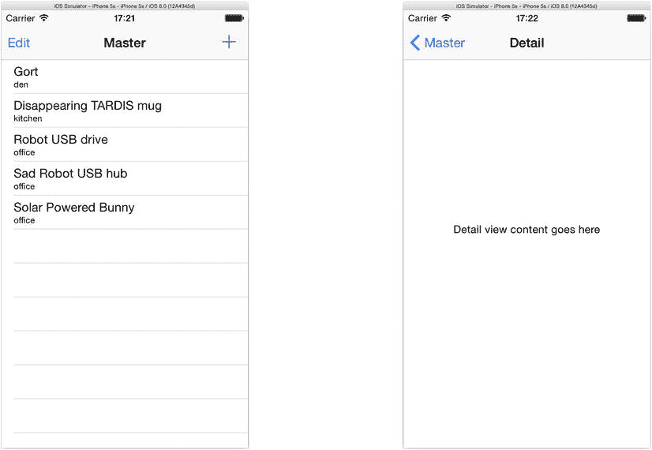

图 5-18. 工作中的表格视图

这相当酷！你创建了自己的数据模型对象，并实现了在表格视图中使用自定义单元格格式来显示自定义对象集所需的一切功能。

但很明显，这个应用尚未完成。如果你点击某一行，会看到一个新屏幕（见图 5-18 右侧），它内容不多，且肯定不是你设计的一部分。

趁着现在，停止应用并将模拟器切换为某个 iPad 设备。再次运行你的应用。这次界面看起来大不相同，如图 5-19 所示。

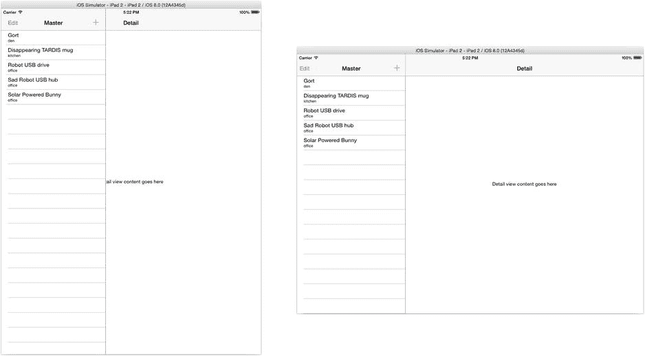

图 5-19. 在 iPad 上的工作中的表格视图

iOS 类在幕后工作，以根据用户设备的尺寸类别适配你的界面。在 iPad 上，你有充足的空间同时显示表格视图和详情视图。分视图控制器会介入并同时展示两者。

下一步是设计你的详情视图。之后，你将实现编辑列表、更改条目以及添加新条目所需的代码。

## 添加详情视图

现在你进入了主从设计的下半部分。你的详情视图由 `DetailViewController` 对象控制。`DetailViewController` 是“详情”场景中一个普通的 `UIViewController`。你需要创建标签和文本字段对象来显示和编辑你的 `MyWhatsit` 属性。你需要在 `DetailViewController` 中创建 Interface Builder 输出口，以连接这些文本字段，并且需要在 Interface Builder 中将这些输出口连接到对应的对象。这个过程现在应该很熟悉了，那么让我们开始吧。

### 创建详情视图

选择 `Main.storyboard` 文件，然后在详情场景中选择详情视图控制器，如图 5-20 所示。选择并删除视图中的标签对象。你不需要它。

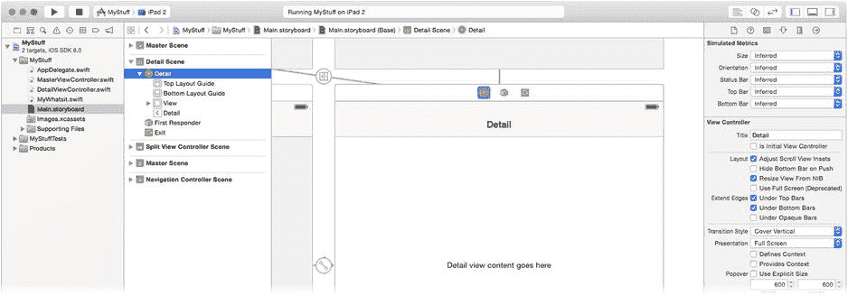

图 5-20. 模板详情视图

在对象库中，找到标签对象并向视图中添加两个。找到文本字段对象并添加两个。将一个标签的文本设置为**名称**，另一个设置为**位置**。排列并调整它们的大小，使你的界面看起来像图 5-21 中的样子。

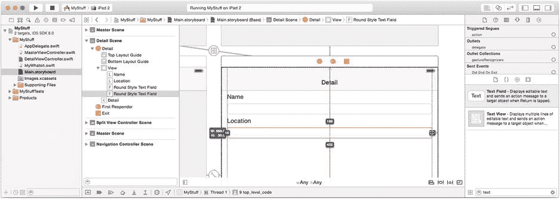

图 5-21. 完成的详情视图

选择“编辑器”“解决自动布局问题”“清除视图控制器中的所有约束”命令，以移除先前设计中遗留的任何多余约束。同时选中你刚刚添加的所有四个视图对象，并点击画布右下角的“固定约束”控件，如图 5-22 所示。点击三个支柱，为所有视图添加上、前导和尾随边缘约束，如图 5-22 右侧所示。

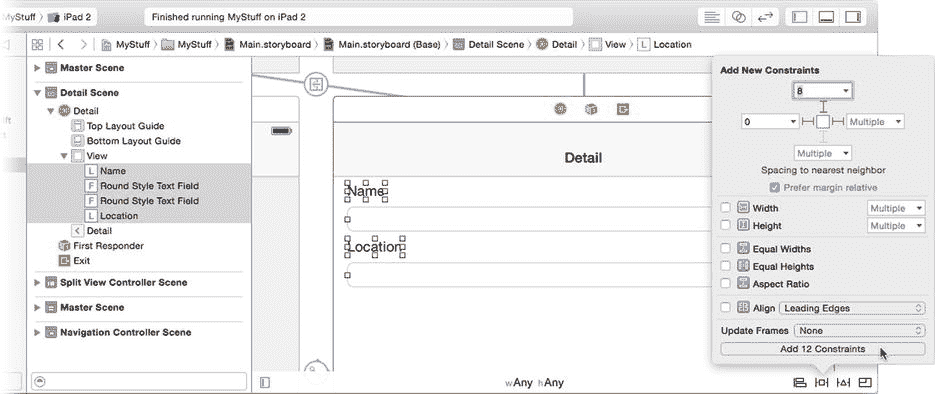

图 5-22. 添加详情视图约束

切换到 `DetailViewController.swift` 文件。更改 `detailItem` 属性的类型，使其明确为 `MyWhatsit` 对象（修改后的代码以粗体显示）：

```
var detailItem: MyWhatsit? {
```

删除现有的 `detailDescriptionLabel` 属性，并替换为两个新的输出口属性。

```
@IBOutlet var nameField: UITextField!
@IBOutlet var locationField: UITextField!
```

切换回 `Main.storyboard` 文件。选择详情视图控制器对象，并使用连接检查器将两个新的输出口（`nameField` 和 `locationField`）连接到界面中相应的文本字段对象，如图 5-23 所示。

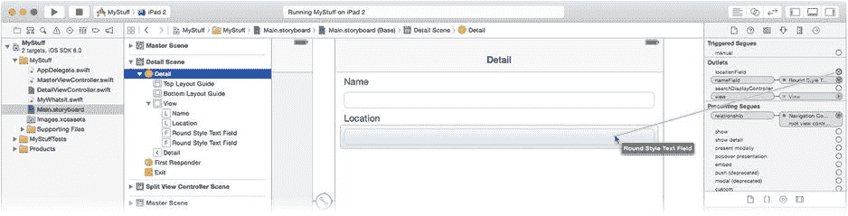

图 5-23. 连接文本字段输出口

### 配置详情视图

你可能会问，`MyWhatsit` 对象的值将如何传入你刚刚创建的两个 `UITextField` 对象。这是个好问题。这将在用户点击表格视图中的某一行时发生。从点击操作到进入详情视图的大部分机制已经为你写好（作为主从项目模板的一部分），但理解其工作原理会很有帮助。让我们来逐步解析点击一行的过程。

有几种不同的方法可以响应用户在表格中点击一行。传统的做法是重写表格视图委托函数 `tableView(_:,didSelectRowAtIndexPath:)`。这个顾名思义的函数会在用户选择（点击）表格中的某一行时被调用。你的代码可以决定要如何处理。

然而，使用 storyboard，你无需编写任何代码来响应点击。主从模板提供了一个原型单元格，它已经附加了一个标识符为 `showDetail` 的 Segue。当用户点击某一行时，该 Segue 会呈现详情视图控制器。

**注意**：将 Segue 附加到原型单元格会自动将单元格的附件类型设置为 `.DisclosureIndicator`——即行右侧的右向箭头。如果你不使用 Segue，请记得设置附件类型，以便用户知道点击某一行会发生什么。

使用 Segue 方法，你可以在 `prepareForSeque(_:,sender:)` 函数中拦截从表格视图到详情视图的转场。在 `MasterViewController.swift` 文件中找到该函数。嘿，看起来有人注释掉了它的所有代码！没问题。选中被注释的行，再次选择“编辑器”“结构”“注释选择”命令。这将“取消注释”之前被注释的行。

既然你已经修正了详情视图控制器中 `detailItem` 属性的类型，你可以修改这段代码使其能够编译。将代码编辑为如下所示（修改后的代码以粗体显示）：

```
if segue.identifier == "showDetail" {
    if let indexPath = tableView.indexPathForSelectedRow() {
        let thing = things[indexPath.row]
        let controller = (segue.destinationViewController as 
           UINavigationController).topViewController as DetailViewController
        controller.detailItem = thing
        controller.navigationItem.leftBarButtonItem = 
                            self.splitViewController?.displayModeButtonItem()
        controller.navigationItem.leftItemsSupplementBackButton = true
    }
}
```

这段代码编译成功，因为 `detailItem` 属性现在是一个 `MyWhatsit` 对象，与你从 `things` 数组中检索出来的类型相同。

`prepareForSeque(_:,sender:)` 函数为你提供了在界面转场到下一个视图控制器之前执行任何必要操作的机会。对于此应用，你捕获了名为 `showDetail` 的 Segue，并将详情视图控制器的 `detailItem` 属性设置为用户点击行中所显示的 `MyWhatsit` 对象。该信息通过 `indexPathForSelectedRow()` 函数获取。


`detailItem`属性的`didSet`观察者会调用`configureView()`函数。该函数的作用是用正在编辑的`MyWhatsit`对象的属性填充界面中的文本字段。编辑`DetailViewController.swift`文件中的`configureView()`函数，使其看起来如下所示（修改的代码以粗体显示）：

```
func configureView() {
    if let detail = detailItem {
        if nameField != nil {
            nameField.text = detail.name
            locationField.text = detail.location
        }
    }
}
```

从点击表格行到显示详细视图的神秘过程现在解开了。当用户点击一行时，会发生以下步骤：

1.  表格单元格触发指向详细视图控制器的转场（segue）。
2.  调用`prepareForSeque(_:,sender:)`。
3.  `prepareForSeque`获取用户点击的行索引。
4.  它使用该行索引获取`MyWhatsit`对象，并设置详细视图控制器的`detailItem`。
5.  `detailItem`属性的观察者调用`configureView()`。
6.  `configureView()`根据`MyWhatsit`对象设置文本字段。

至此，详细视图完成！运行您的应用并点击一行，如图 5-24 右侧所示。

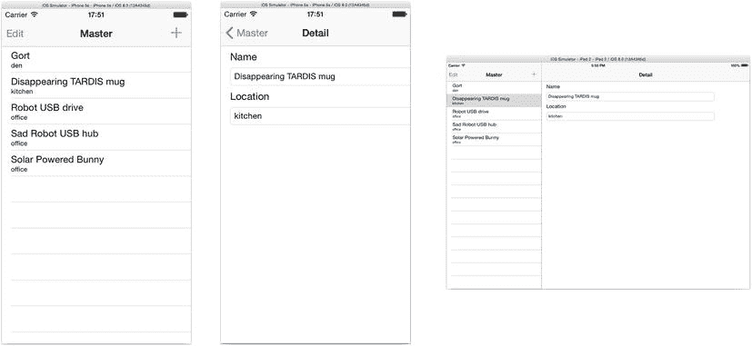

图 5-24 工作详细视图

您可能会注意到，虽然可以编辑文本字段，但它们不会改变任何内容。应用开发的最后一部分将是设置对`MyWhatsit`对象的编辑——允许用户创建新对象、更改对象以及删除不需要的对象。

### 编辑

我不想对您撒谎；编辑是困难的。这并不是说您无法应对，而且您将要为 MyStuff 添加编辑功能。但别担心，您已经有了巨大的先发优势。表格视图和集合类完成了大部分繁重的工作，并且由于主从项目模板，支持表格编辑所需编写的大部分代码已经包含在您的应用中。仍然需要您编写一些代码，但主要是需要理解已经编写好的内容以及各部分如何组合在一起。

编辑表格可以简化为几个基本任务。

*   在表格中创建并插入新项目
*   从表格中移除项目
*   重新组织表格中的项目
*   编辑单个项目的详细信息

您的应用将允许添加新项目、移除现有项目以及编辑项目的详细信息。默认情况下，表格中的项目无法重新排序。如果需要，您可以启用该功能，但这里不会这样做。

iOS 有一个用于删除和重新排序表格中项目的标准界面。您可以通过滑动行来单独删除项目，如图 5-25 左侧所示，或者点击“编辑”按钮进入编辑模式，如图 5-25 中间所示。在编辑模式下，点击行旁边的减号按钮将删除该行。点击“完成”按钮将表格视图恢复到常规查看模式。iOS 还提供了一个标准的“加号”按钮供您用来触发添加新项目，如图 5-25 右侧所示。

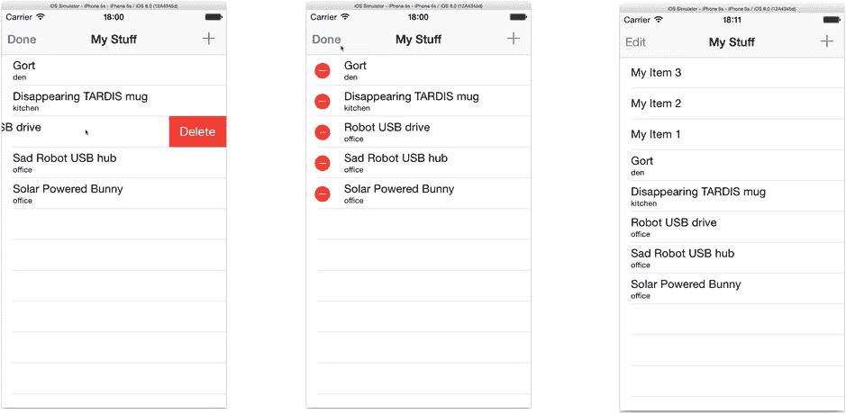

图 5-25 表格编辑界面

这些界面是表格视图类的一部分。您唯一需要做的是设置界面对象来触发这些操作。您将从提供添加新对象的代码开始，然后我将描述启用表格编辑的设置，最后您将编写编辑单个`MyWhatsit`对象属性的代码。

### 插入和移除项目

向列表插入新项目是一个两步过程：

1.  创建新对象并将它们添加到您的集合中。
2.  通知表格视图您添加了新对象及其位置。

主从模板包含一个动作函数`insertNewObject(_:)`来完成此操作。然而，模板代码并不知道您的数据模型，因此您需要进行一些小的调整来创建正确类型的对象。

在`MasterViewController.swift`文件中，找到`insertNewObject(_:)`函数。哇，看起来有人也注释掉了它的所有代码。取消注释该代码并编辑函数，使其看起来如下所示（修改的代码以粗体显示）：

```
var itemNumber = 0
func insertNewObject(sender: AnyObject) {
    let newThing = MyWhatsit(name: "My Item \(++itemNumber)")
    things.insert(newThing, atIndex: 0)
    let indexPath = NSIndexPath(forRow: 0, inSection: 0)
    self.tableView.insertRowsAtIndexPaths( [indexPath],
                         withRowAnimation: .Automatic)
}
```

您的代码为每个新项目生成一个唯一的名称（从“My Item 1”开始），使用该名称创建一个新的`MyWhatsit`对象，并将该新对象插入到索引 0 处的集合中。

下一步（这一点很重要）是告诉表格视图数据模型中发生了哪些变化——表格视图不能未卜先知。请注意，`insertRowsAtIndexPaths(_:,withRowAnimation:)`调用的第一个参数是一个`NSIndexPath`对象数组。如果向表格添加了多个项目，请确保数组中的每个项目都已考虑到。这里只插入了一个项目，因此只需要传递一个`NSIndexPath`。

**提示** 如果您希望新项目出现在列表末尾而不是开头，请将新对象追加到数组末尾（使用`things.append(newThing)`），然后告诉表格视图它被添加到了末尾（使用`let indexPath = NSIndexPath(forRow: things.count-1, inSection: 0)`）。

再次运行您的应用，并点击`+`按钮几次，如图 5-25 右侧所示。现在您可能会想知道`insertNewObject(_:)`函数何时以及如何被调用。毕竟，您并没有调用它，它也不是在任何一个 Interface Builder 文件中创建的对象。这个问题的答案可以在下一节中找到。

### 启用表格编辑

为了允许删除表格中的任何行（即通过标准的 iOS 编辑功能），您的数据源对象必须告诉表格视图允许这样做。否则，iOS 将不允许删除该行。您的数据源通过其可选的`tableView(_:,canEditRowAtIndexPath:)`函数来实现这一点。主从模板为您提供了一个（在`MasterViewController.swift`中）。

```
override func tableView(tableView: UITableView, 
                        canEditRowAtIndexPath indexPath: NSIndexPath) -> Bool {
    return true
}
```

模板提供的函数允许表格中的所有行都可编辑。默认情况下，“可编辑”意味着可以删除。如果您不希望某行可编辑，则返回`false`。

**注意** 从技术上讲，`tableView(_:,canEditRowAtIndexPath:)`函数仅确定一行是否*可以*被编辑。如果可以，那么表格视图委托对象将通过其可选的`tableView(_:,editingStyleForRowAtIndexPath:)`函数来决定如何编辑——或者是否编辑。您在这里使用的默认编辑样式允许删除该行（`UITableViewCellEditingStyle.Delete`）。

如果`tableView(_:,canEditRowAtIndexPath:)`为某行返回`true`，iOS 允许通过滑动手势删除该行。如果您还想为整个列表启用“编辑模式”（每行显示减号），您可以在由`UITableViewController`（您的`MasterViewController`继承自它）提供的导航栏中连接它。iOS 提供了所有需要的按钮对象以及大部分您需要的默认行为。您需要做的就是启用它们。在您的`MasterViewController`代码中，找到`viewDidLoad()`函数。该函数的开头应如下所示：

```
override func viewDidLoad() {
    super.viewDidLoad()
    self.navigationItem.leftBarButtonItem = self.editButtonItem()
```


```swift
let addButton = UIBarButtonItem(barButtonSystemItem: .Add,
                                 target: self,
                                 action: "insertNewObject:")
self.navigationItem.rightBarButtonItem = addButton
```

第一行代码调用了父类的`viewDidLoad()`函数，以便父类在视图对象加载时执行其所需的操作。

下一行代码创建了一个编辑按钮，你可以在导航栏的左侧看到它（参见图 5-24）。它将左侧按钮设置为视图控制器的`editButtonItem`。`editButtonItem`属性是一个预配置的`UIBarButtonItem`对象，已经设置好用于启动和停止表格的编辑操作。你只需获取该按钮并将其添加到界面中即可。

创建并插入新项的按钮需要稍多一些设置，但也不复杂。下一行代码创建了一个新的`UIBarButtonItem`，它将显示标准的 iOS +符号（`UIBarButtonSystemItem.Add`）。当用户点击它时，它会调用当前对象（`self`）的`insertNewObject(_:)`函数。最后一行代码将新的工具栏按钮添加到导航栏的右侧。

就是这样！这就是将"编辑"和"+"按钮添加到表格导航栏的代码。"编辑"按钮功能已自动实现，而"+"按钮也已配置为在点击时调用控制器对象的`insertNewObject(_:)`函数。

还有一个需要注意的细节。当添加新对象时，你的代码创建了对象，将其添加到数据模型中，然后告知表格视图你已完成操作。而在删除行时，表格视图决定删除哪些行。那么，实际的`MyWhatsit`对象如何从`things`数组中移除呢？这发生在以下数据源委托函数中，该函数已经为你写好。

```swift
override func tableView(tableView: UITableView, 
               commitEditingStyle editingStyle: UITableViewCellEditingStyle, 
               forRowAtIndexPath indexPath: NSIndexPath) {
    if editingStyle == .Delete {
        things.removeAtIndex(indexPath.row)
        tableView.deleteRowsAtIndexPaths([indexPath], withRowAnimation: .Fade)
    } ...
```

当用户编辑表格并决定删除（或插入）某一行时，该请求会通过调用此函数传递给数据源对象。数据源对象必须检查`editingStyle`参数以确定正在进行的操作（例如，正在删除一行），并采取相应的操作。删除一行时的操作是从数组中移除对应的`MyWhatsit`对象，并让表格视图知道你已执行了该操作。

这就是编辑表格所需的全部代码。现在是时候将拼图最后一块大拼图归位：编辑单个项目的详细信息。

## 编辑详细信息

要编辑某个项目的详细信息，你需要执行以下操作：

1.  创建一个用户可以看到所有详细信息的视图。
2.  用表格中选中项的属性设置该视图的值。
3.  记录对这些值的更改。
4.  使用新信息更新表格。

好消息是，你已经完成了一半的工作。你之前已修改了`DetailViewController`来显示`MyWhatsit`对象的`name`和`location`属性，并添加了代码以在`configureView()`中用选中项的属性值填充文本字段。现在你只需添加一些代码来完成接下来的两个步骤，你的应用就快完成了。

创建一个动作，用于响应名称和位置文本字段的更改。将以下函数添加到`DetailViewController.swift`中：

```swift
@IBAction func changedDetail(sender: AnyObject!) {
    if sender === nameField {
        detailItem?.name = nameField.text
    } else if sender === locationField {
        detailItem?.location = locationField.text
    }
}
```

当编辑名称或位置文本字段时，将调用此动作函数。由于两个字段都调用同一个函数，你必须通过将`sender`对象与已知的视图对象进行比较，来确定是哪个字段发送了该动作。如果匹配，你就知道是哪个文本字段触发了动作，然后用新值更新相应的`MyWhatsit`属性。

在 Interface Builder 中将两个文本字段的动作连接到这个函数。选择`Main.storyboard`文件。选择名称属性文本字段。按住 Control 键从文本字段拖拽到视图控制器对象，释放鼠标按钮，然后选择`changedDetail:`动作——这目前是你唯一的动作，如图 5-26 所示。对位置文本字段重复此操作。

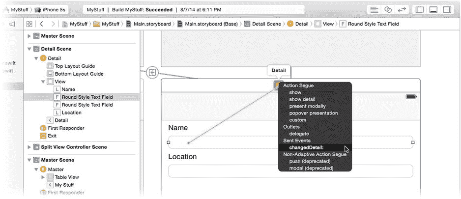

图 5-26 将文本字段连接到`changedDetail:`动作

现在，当你在详细信息视图中编辑其中一个文本字段时，它会更改原始对象的属性值，从而更新数据模型。试一试。

确保 scheme 仍然设置为 iPhone 模拟器并运行你的应用。你的项目会出现在列表中，如图 5-27 左侧所示。

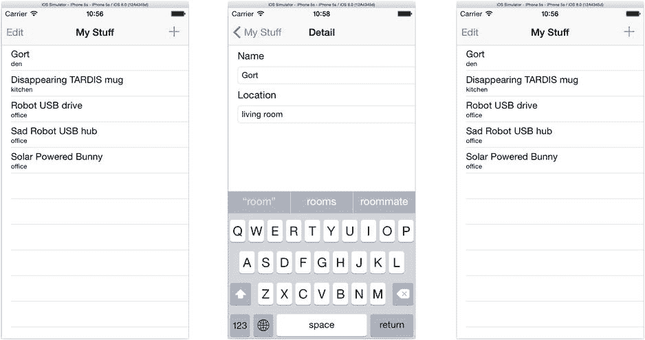

图 5-27 测试详细信息编辑

点击"Gort"项目会显示其详细信息。编辑第一行的详细信息。在图 5-27 的示例中，我正在将其位置更改为"living room"。点击导航栏中的"My Stuff"按钮会返回列表。但是等等！"Gort"这一行并没有更新。

还是说它更新了？你可以通过在`changedDetail(_:)`函数中设置调试器断点来验证这个想法，看看它是否被调用过（实际上被调用了）。不，问题要更隐蔽一些。用你的光标（或手指，如果你在真机上测试），向上拖动列表，使得"Gort"行短暂消失在导航工具栏下方，如图 5-28 左侧所示。

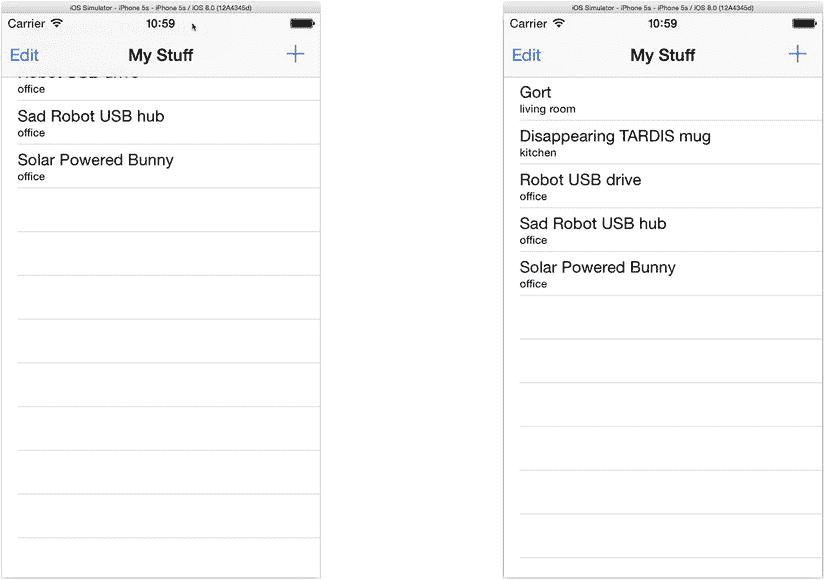

图 5-28 重绘第一行

释放鼠标/手指，列表会弹回原位。注意，现在第一行显示了更新后的值。这是因为你的`changedDetail(_:)`函数修改了数据模型中的属性值，但你从未通知表格视图，所以它不知道要重绘那一行。你需要修复这个问题。

## 观察 MyWhatsit 的变化

在第 8 章中，我将解释数据模型与视图对象通信的原理。现在，你只需知道，当`MyWhatsit`对象的属性发生变化时，表格视图需要知道这一点，以便重绘对应的行。

从理论上讲，这是一个容易解决的问题：当`MyWhatsit`属性被更新时，需要调用一个表格视图函数来重绘表格，就像你添加或移除对象时那样。实际上，这要稍微棘手一些。问题在于，`MyWhatsit`对象和`DetailViewController`都没有直接连接到`MasterViewController`视图的表格视图对象。虽然没有什么能阻止你添加一个连接，并在 Interface Builder 中或通过代码进行连接，但有一个更简洁的解决方案。

**注意** 在良好的模型-视图-控制器设计中，数据模型对象（如`MyWhatsit`）直接连接到视图对象（如表格视图）是完全不合适的。所以，这不仅仅是一个聪明的解决方案；它实际上是一个好的软件设计。

有一种称为*观察者模式*的软件设计模式。它的工作原理如下：


1. 任何对某事发生时感兴趣的对象都会注册为观察者。
2. 当某事发生时，负责的对象会发布一个通知。
3. 该通知随后会分发给所有感兴趣的观察者。

这种安排的真正美妙之处在于，观察者和发布通知的对象彼此都不需要了解对方。你将使用通知来将`MyWhatsit`对象的变更通信给`MasterViewController`。第一步是设计一个通知，并让`MyWhatsit`在适当的时候发布它。

**发布通知**

在你的`MyWhatsit.swift`文件顶部，在类声明之前添加这个常量定义：

```
let WhatsitDidChangeNotification = "MyWhatsitDidChange"
```

在类的内部，添加这个新函数：

```
func postDidChangeNotification() {
    let center = NSNotificationCenter.defaultCenter()
    center.postNotificationName(WhatsitDidChangeNotification, object: self)
}
```

当被调用时，这个函数会发布一个名为“MyWhatsitDidChange”的通知。该通知的对象是其自身。通知的名称可以是任何你想要的；你只需确保它唯一，以免与另一个对象使用的通知混淆。

当然，你需要在某个时刻调用这个函数。每当有人更改你的`MyWhatsit`对象的属性时，你都想发布通知。你可以通过向两个属性添加属性观察器来实现这一点（新代码以粗体显示）。

```
var name: String {
    didSet {
        postDidChangeNotification()
    }
}
var location: String {
    didSet {
        postDidChangeNotification()
    }
}
```

属性观察器是一段代码块，每当该属性值被设置时（即`something.name = anyValue`）执行。`didSet`观察器在属性被设置之后执行，这是触发你的通知的完美位置。（还有一个`willSet`观察器在设置之前执行，如果你需要的话。）

**注意**：属性观察器在对象初始化期间永远不会执行。因此，你的`init(name:,location:)`初始化器中的`self.name = name`语句不会发布通知。

现在，每当你更改`MyWhatsit`对象的详细信息时，它都会发布一个变更通知。任何对此感兴趣的对象都会收到该通知。最后一步是让`MasterViewController`观察此通知。

**观察通知**

观察通知的基本模式如下：

1. 创建一个用于接收通知的函数。
2. 为你对象感兴趣的特定通知注册为观察者。
3. 处理接收到的任何通知。
4. 在不再需要通知时或对象被销毁前停止观察通知。

第一步非常简单。在你的`MasterViewController.swift`文件中，添加一个`whatsitDidChange(_:)`函数。

```
func whatsitDidChange(notification: NSNotification) {
    if let changedThing = notification.object as? MyWhatsit {
        for (index, thing) in enumerate(things) {
            if thing === changedThing {
                let path = NSIndexPath(forItem: index, inSection: 0)
                tableView.reloadRowsAtIndexPaths( [path], 
                                withRowAnimation: .None)
            }
        }
    }
}
```

所有通知函数都遵循相同的模式：`func` *myNotification*`(notification: NSNotification)` *-> Void*。你可以随意命名你的函数，但它必须接受一个`NSNotification`对象作为其唯一参数。

`notification`参数包含有关通知的所有详细信息。通常你并不关心这些，特别是当你的对象只想知道通知发生了，而不关心具体原因时。在这种情况中，你关心的是通知的`object`属性。每个通知都有一个`name`和一个与之关联的`object`——通常是触发通知的那个`object`。

函数的第一行获取通知的`object`，并假设该属性已设置且包含一个`MyWhatsit`对象，将其赋值给`changedThing`常量。

接着，循环遍历你的`MyWhatsit`对象数组。如果发生变更的`MyWhatsit`对象是你的数据模型的一部分，则通知表格视图需要更新其某一行。如果被修改的对象不在你的数据模型中，则忽略它。

现在，你只需将`MasterViewController`注册到通知中心，以便它能接收到此通知。

找到`viewDidLoad()`函数。在函数末尾，添加以下语句：

```
let center = NSNotificationCenter.defaultCenter()
center.addObserver( self,
          selector: "whatsitDidChange:",
              name: WhatsitDidChangeNotification,
            object: nil)
```

这个调用告诉通知中心，当任何对象（`nil`）发布了名为`WhatsitDidChangeNotification`的通知时，注册此对象（`self`）并调用函数`whatsitDidChange(_:)`。

**通知匹配**

注册为通知观察者非常灵活。通过在`addObserver(_:,selector:,name:,object:)`中为`name`参数或`object`参数传递`nil`，你可以请求接收指定名称的通知、特定对象发送的通知，或两者兼具。下表展示了在成为观察者时`name`和`object`参数的效果：

| name | object | 接收到的通知 |
| --- | --- | --- |
| `"Name"` | `object` | 仅接收对象`object`发出的名为`Name`的通知 |
| `"Name"` | `nil` | 接收任何对象发出的所有名为`Name`的通知 |
| `nil` | `object` | 接收对象`object`发出的每条通知 |
| `nil` | `nil` | 接收每条通知（不推荐） |

在这种情况下，你希望在任何一个`MyWhatsit`对象被编辑时得到通知。你的代码随后会查看具体对象以确定它是否值得关注。在其他情况下，你可能只想在特定对象发送特定通知时接收，忽略来自无关对象的类似通知。

与注册接收通知同样重要的是，当你的对象不应再接收通知时取消注册。对于这个应用，没有哪个时刻通知是无关紧要的，但你仍然应该确保你的对象在被销毁前不再是观察者。在 iOS 中，让已销毁的对象仍然注册接收通知是导致应用崩溃的臭名昭著的原因。因此，请务必确保你的对象在消失之前已从通知中心移除。

这很容易做到，所以你没有理由不这样做。向你的`MasterViewController`类添加一个反初始化器。

```
deinit {
    NSNotificationCenter.defaultCenter().removeObserver(self)
}
```

特殊的反初始化器函数在对象被销毁前调用。在其中，你应该清理任何无法自动处理的“遗留问题”。这个语句告诉通知中心，此对象不再是任何通知的观察者。你甚至不需要记住之前请求观察哪些通知或对象；这个调用会注销所有。

在 iPhone 模拟器中再次运行你的应用。编辑一个项目并返回列表。这次你的更改会出现在列表中！

**模态编辑与非模态编辑**

你已经到了最后冲刺阶段。事实上，你离终点线如此之近，几乎触手可及。只有一个烦人的细节需要处理：iPad 界面。

iPhone 界面使用软件开发者所谓的*模态界面*：当你点击某行编辑项目时，你被转移到一个可以编辑其详细信息的屏幕（编辑模式），然后你退出该屏幕并返回列表（浏览模式）。


iPad 界面并非如此工作。特别是在横屏模式下，你可以在主列表和详情视图之间自由跳转。这意味着你可以开始编辑某个标题或位置，然后立即切换到列表中的另一个项目。这被称为*无模式界面*。

虽然这带来了流畅的用户体验，但对你的应用来说却是一场灾难，如图 5-29 所示。点击一个项目（本例中为“Gort”），编辑其中一个字段，然后切换到另一个项目。请亲自尝试，我会等待。

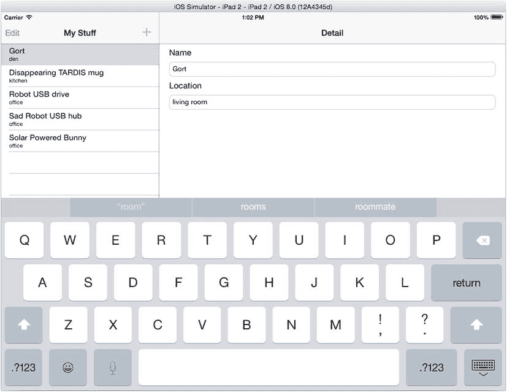

图 5-29. iPad 表格视图更新问题

问题在于，在你切换到列表中的另一个`MyWhatsit`对象之前，文本字段的编辑从未有机会“结束”。幸运的是，有一个简单的解决方法。当你将文本字段连接到详情视图控制器时，你连接的是`Editing Did End`事件。这是文本字段的默认动作事件。但还有很多其他事件。尝试连接`Editing Changed`事件。

在详情视图控制器中选择一个文本字段，如图 5-30 左侧所示。使用连接检查器，点击`Editing Did End`事件旁的`(x)`按钮以断开该动作。现在，将`Editing Changed`事件连接器拖到视图控制器上，将其连接到`changedItem:`动作，如图 5-30 右侧所示。这个事件是一个“较低级别”的事件，每当用户在文本字段中做出*任何*更改时都会发送。现在，当用户编辑详情时，表格视图中的行将随之更新。

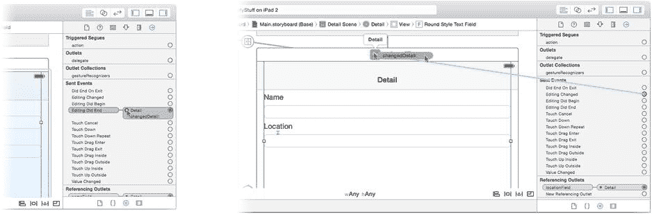

图 5-30. 重新连接文本字段动作

## 细节打磨

通过为应用添加图标来打磨它，就像你在上一章中为`EightBall`应用所做的那样。找到你在第 1 章中下载的`Learn iOS Development Projects`文件夹。在`Ch 5`文件夹中，你会找到`MyStuff (Icons)`文件夹。在导航器中选择`images.xcassets`项，然后选择`AppIcon`图像组。将`MyStuff (Icons)`文件夹中的所有图像文件拖放到该组中。Xcode 会自动整理它们。

你的应用已经完成，但我想花点时间向你介绍其他与表格相关的主题。

## 高级表格视图主题

你现在可以看到，表格视图的用途远不止列出联系人和歌曲标题。表格视图类功能强大且灵活，但这意味着它们有时会显得复杂和令人困惑。好消息是，它们有详尽的文档，并且有很多示例项目（你可以从 Apple 下载）来演示各种表格视图技术。

起点是*《iOS 表格视图编程指南》*。选择“帮助”  “文档与 API 参考”，在搜索字段中输入**Table View Programming**，然后从自动补全列表中点击“Table View Programming Guide for iOS”，如图 5-31 所示。

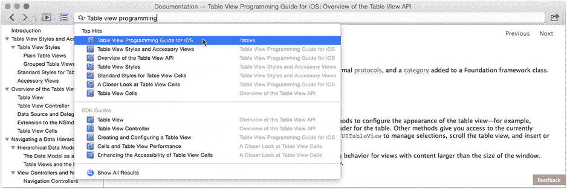

图 5-31. 定位《iOS 表格视图编程指南》

本指南将解释表格视图的每一个主要特性以及如何使用它们。虽然内容篇幅不短，但如果你想了解如何实现特定功能（例如创建索引列表），这正是你该开始的地方。

大多数主要的 iOS 类在其文档中都有链接，可以引导你进入解释如何使用它及相关类的指南。例如，在`UITableView`类的概览部分，就有几个链接指向表格专用的编程指南。

