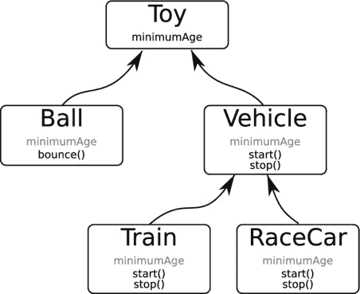
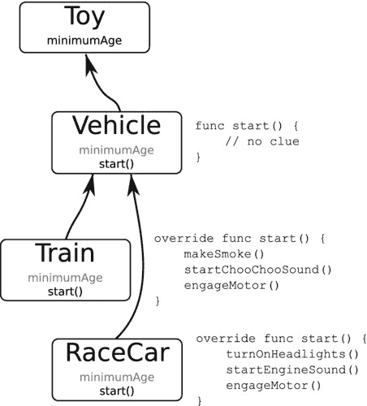
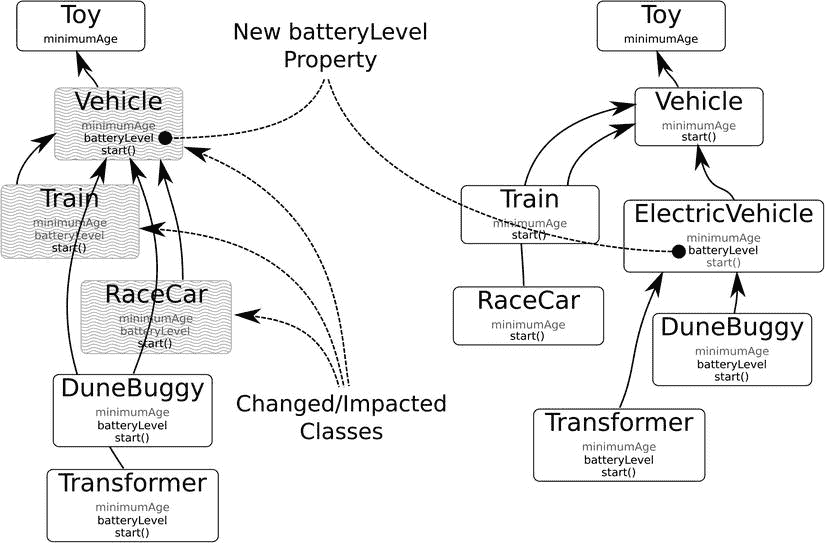

# 总结

给自己一个热烈的“击掌！”你在 iOS 应用开发中又迈出了一大步。你已经学习了表格视图的工作原理以及如何使用单元格对象。你知道当用户点击一行时你的应用会收到什么消息，如何处理行的编辑，以及如何创建新行。你创建了一个数据模型，并学习了如何在未连接的对象之间发布和观察通知。

这个应用在某些方面仍有不足。某个项目的详情可能，嗯，可以更详细。但最烦人的问题可能是你的应用不保存任何数据。如果你重启应用，所做的所有更改都会丢失。因此，对于一个旨在记录你的物品的应用来说，它做得并不好。

不过别担心；你将在未来的章节中解决这些不足之处。在此之前，先好好休息一下，暂时放下应用开发，简短地了解一下面向对象编程的理论。

## 第 6 章

## 对象之课

我想用一章的篇幅暂时离开应用开发。优秀的 iOS 开发需要超越仅仅知道如何编写`for`循环或连接按钮到输出口的概念和设计技能。软件工程师称这些为*设计模式*和*设计原则*。为了理解这些理念，我将从这一切的基础开始：对象。

“嘿！”你说，“我一直在使用对象，还有什么好理解的？”你会惊讶于有多少程序员无法准确描述*对象*是什么。如果你到目前为止对本书中使用的术语（*类*、*对象*、*实例*、*函数*、*存储属性*等）没有任何疑问，并且你已经熟悉设计模式和原则，可以随意跳过或略读本章。如果你有疑问，请继续阅读。

在本章中，我将做以下事情：

*   简要介绍对象和面向对象编程的历史
*   准确解释类、对象和实例是什么
*   描述继承和封装
*   解释委托及其他几种设计模式
*   简要提及几个关键的设计原则

要理解对象，有必要了解它们之前是什么，以及为什么它们如此重要。

## 两大家族，同样尊贵

计算机内部有两种基本信息在运转。*数据*由表示数值和量的二进制值组成，例如你的姓名、URL 或一只燕子的空速。*代码*由表示指令的二进制值组成，这些指令告诉计算机执行操作，例如在屏幕上绘制你的名字、加载 URL 或选择你最喜欢的颜色。

在计算机语言中，这种划分很容易看出。像 Swift 这样的编程语言，其语法主要分为定义、检索和存储值的语句，以及改变值、做出决策和调用其他语句的语句。可以将它们视为计算机语言的名词和动词。

就像蒙太古家族和凯普莱特家族一样，¹ 编程的这两个方面长期以来一直保持分离。随着计算机变得更大更快，计算机程序变得更长更复杂，一系列问题开始出现。

程序员遇到了更多需要将多条信息保存在一起的解决方案。一个人不仅有名字，还有身高、年龄、税号等。为了将这些相关事实保持在一起，他们开始将多个值组合成一个单独的内存块，称为*结构体*。在 Swift 编程语言中，结构体看起来像这样：

```
struct Person {
    var name: String
    var female: Bool
    var birthdate: Date
    var height: Float
    var taxNumber: Int
}
```


这些结构变得如此方便，以至于程序员开始像使用单一值一样使用它们。他们会将一个`Person`传递给函数，或者将一个`Person`存储在文件中。他们会编写操作`Person`结构的函数（而不是像日期这样的单一值）。一个例子是判断某人生日的函数，例如`IsBirthdayToday(Person person) -> Bool`。

程序员也开始遇到大量相似结构的情况。一个`Player`结构拥有`Person`结构的所有相同属性，只是它多了像玩家最高分这样的变量。他们很快发现可以从结构中创建结构，如下所示：

```
struct Player {
    var person: Person
    var gamesPlayed: Int
    var highScore: Int
}
```

让程序员真正兴奋的是，他们现在可以为`Player`结构重用为`Person`结构编写的函数！他们甚至给这个想法起了个名字：*子类型多态*。如果你在下一次聚会的谈话中用到这个词，会得到额外加分。

事情本应一帆风顺，但事实并非如此。结构和函数的数量以令人眩晕的速度增长。项目会有成千上万个独立的函数和几乎同样多的不同结构。有些函数可以与`Person`结构一起工作，但大多数不行。

问题在于数据结构和函数仍然属于不同的家族；它们没有混合。试图弄清楚哪些函数应该与哪些结构一起使用变得难以管理。程序无法运行。大型软件项目正在失败。必须有所改变——而改变确实发生了。

**罗密欧遇见朱丽叶**

在 20 世纪 60 年代末，神奇的事情发生了：结构和函数结合在一起，对象诞生了。*对象*是属性值（数据结构）和作用于这些值的方法（函数）融合成一个拥有这两者的单一实体。这看起来很简单，但它是计算机语言演变中的一个戏剧性转折点。

在对象出现之前，程序员整天编写和调用函数（也称为*过程*），并向它们传递正确的数据结构。以这种方式工作的计算机语言被称为*过程式*语言。当对象的概念被引入时，它彻底改变了程序员编写和思考程序的方式。现在，程序员世界的中心是对象；你获取一个对象并调用它的方法。这些新的计算机语言被称为*面向对象*语言。

对象也创造了感觉“有生命”的程序。数据结构是值的惰性集合，函数是抽象的指令序列，但对象两者兼有；它是一个既有特征又能被指示做事情的实体。从这个意义上说，对象更类似于你在现实世界中处理的各种事物。

既然你知道了对象是什么，我将给你一个关于对象如何定义和创建以及它在 Swift 中是什么样子的简短课程。第 20 章会更详细地描述这一点。

**类和饼干**

对象是*类*的具体体现。对象的类定义了该对象可以拥有哪些属性以及可以执行哪些操作。对象是你实际处理的东西。这样想：类是饼干模具，对象是饼干。见图 6-1。


图 6-1. 类和对象

在 Swift 中，类使用`class`声明来定义。

```
class MyClass {
    // 类定义在这里
}
```

一个类本身并不做太多事情。类只是用来创建新对象的“形状”。当你创建一个对象时，你需要指定你想要创建的对象的类，然后告诉该类创建一个对象。在 Swift 中，代码看起来像这样：

```
let object = MyClass()
```

该表达式的结果是一个新的*类的实例*，它与*一个对象*是同义词。该对象包含它自己的存储（数据结构），其中保存了它所有独立的属性值；改变一个对象的属性不会改变系统中任何其他对象的属性。

每个对象还与许多仅作用于该类对象的函数相关联。类定义了这些函数，并且该类的每个对象都被赋予了这些行为。在 Swift 中，这些函数的代码出现在类的定义中。

```
class MyClass {
    func doSomething() {
        // 在这里做一些事情
    }
}
```

在特定对象（实例）上执行其操作的函数被称为*实例函数*、*实例方法*或简称*方法*。方法总是在单个对象的上下文中执行。当方法中的代码引用属性值或特殊的`self`变量时，它引用的是调用该方法的特定对象的属性。在 Swift 中，方法总是在对象上“调用”，像这样：

```
object.doSomething()
```

在本书以及你的日常编程中，你将几乎 exclusively 编写和使用方法。你也可以为结构定义方法，它们的工作原理与为类定义的方法完全相同。你也可以定义不在对象（或结构）上下文中执行的全局函数，它们就像在对象出现之前普通的旧 C 函数一样工作。这些将在第 20 章中更详细地描述。

**类、对象和方法，天哪！**

对于新开发者来说，一个持续混淆的来源是面向对象编程中术语的繁多和混乱。每种编程语言似乎都选择了一组略有不同的术语。计算机科学家使用另一套词汇。术语经常被混淆，甚至经验丰富的程序员也会错误地使用术语，说“对象”时实际意思是“类”。

表 6-1 将帮助你导航面向对象编程术语的世界。它列出了常见的 Swift 编程术语、它们的含义以及你会遇到的一些同义词。我将在本章后面更详细地解释大部分内容。

表 6-1. 常见 Swift 术语


| 术语 | 含义 | 相似术语 |
| --- | --- | --- |
| `Class` | 对一类对象的定义。它规定了这些对象可以存储哪些属性值以及实现哪些函数。 | 接口、类型、定义、原型 |
| `Object` | 类的一个实例。 | 类实例、实例 |
| `Property` | 存储在对象中或由对象生成的值。（参见*存储属性*和*计算属性*。） | 属性 |
| `Stored property` | 存储在对象中的值。 | 实例变量（有时称为*ivar*） |
| `Computed property` | 由对象计算或生成的值。 | 合成属性 |
| `Method` | 在单个对象上下文中执行的函数。 | 实例方法、函数、实例函数、过程、业务逻辑 |
| `Global function` | 在任何特定对象上下文之外执行的函数。 | 类函数、静态函数 |
| `Override` | 用一个不同的实现来替代继承到的方法实现。 | |
| `Selector` | 用于选择对象中某个特定方法（实例函数）的值。 | 消息 |
| `Send` | 使用选择器调用对象的方法。 | 执行函数 |
| `Responds` | 当向其发送特定选择器时拥有可执行的函数。 | 实现、遵循 |
| `Client code` | 类外部使用该类或其对象公共接口的代码。 | 用户、客户端 |
| `Abstract` | 已定义或声明但无实际功能的类、属性或函数。用于定义概念，供子类以有意义的方式实现。 | 抽象层、占位符、桩代码 |
| `Concrete` | 有实际功能并可用的类、属性或方法。 | |

到现在为止，你应该对类、其对象、属性和方法之间的关系有了扎实的理解。

## 继承

前面我提到，程序员经常遇到这种情况：他们需要的类或结构体与已有的另一个对象或结构体相似，可能只有少量增补。而且，已为现有对象/结构体编写的方法全都适用于新对象/结构体。这种思想被称为*继承*，是面向对象语言的基石。

其核心思想是，类可以被组织成树状结构，通用的类位于顶层，向下延伸至底层的更具体类。这种结构可能类似于图 6-2 所示。



图 6-2. 类层次结构

在图 6-2 中，通用的 `Toy` 类作为所有其他类的基类。`Toy` 定义了一组所有 `Toy` 对象共有的属性和方法。`Toy` 的子类是 `Ball` 和 `Vehicle`。`Vehicle` 的子类是 `Train` 和 `RaceCar`。

**注意** 在 Swift 中，继承是区分类和结构体的一条清晰界线。一个类可以继承其他类。而结构体不能继承其他结构体。

`Toy` 类定义了一个 `minimumAge` 属性，用于描述该玩具适用的最低年龄。`Toy` 的所有子类都继承了这个属性。因此，`Ball`、`Vehicle`、`Train` 和 `RaceCar` 都具有 `minimumAge` 属性。

类似地，类也会继承方法。`Vehicle` 类定义了两个函数：`start()` 和 `stop()`。`Vehicle` 的所有子类都继承这两个函数，因此你可以对 `Train` 调用 `start()` 函数，对 `RaceCar` 调用 `stop()` 函数。而 `bounce()` 函数只能对 `Ball` 调用。

通过继承，每个类型为 `Vehicle` 的对象以及 `Vehicle` 的每个子类对象都将拥有 `start()` 和 `stop()` 函数。这正是计算机科学家所说的*子类型多态*。这意味着，如果你拥有一个特定类型（例如 `Vehicle`）的对象、参数或变量，你可以使用或替换任何 `Vehicle` 的子类对象。你可以将一个 `Train` 或 `RaceCar` 对象传递给一个期望 `Vehicle` 类型参数的函数，并且该函数可以同样有效地对这个更复杂的对象调用 `start()`。一个指向 `Toy` 的变量，可以存储 `Toy`、`Ball` 或 `Train` 对象。然而，指向 `Vehicle` 的变量不能设置为 `Ball` 对象，因为 `Ball` 不是 `Vehicle` 的子类。

你已经在编写过的应用中见过这种情况。`NSResponder` 是所有响应事件对象的基类。`UIView` 是 `NSResponder` 的子类，因此所有视图对象都能响应事件。`UIButton` 是 `UIView` 的子类，因此它可以出现在视图中，并且能响应事件。一个 `UIButton` 对象可以用在任何需要 `UIButton` 对象、`UIView` 对象或 `NSResponder` 对象的情境中。

## 抽象类与具体类

程序员将 `Toy` 和 `Vehicle` 类称为*抽象类*。这些类并不定义可用的对象；它们定义了所有子类共有的属性和方法。在你的程序中，你永远不会找到 `Toy` 或 `Vehicle` 对象的实例。你在程序中找到的对象是 `Ball` 和 `Train` 对象，它们从 `Toy` 和 `Vehicle` 类继承了公共的属性和方法。那些产生可用对象的类被称为*具体类*。

## 重写方法

启动火车与启动汽车有很大不同。一个类可以为特定函数提供自己的代码，从而替换其继承到的实现，这被称为*重写*方法。

例如，`UIViewController` 的所有子类都继承了一个 `supportedInterfaceOrientation()` 函数。该函数返回一个 `Int` 值，描述该视图控制器支持哪些设备方向（竖屏、横屏左、横屏右、倒置）。`UIViewController` 提供的 `supportedInterfaceOrientations()` 版本是通用的，它假设你的视图控制器在常规设备上支持所有方向，在紧凑设备上支持除倒置外的所有方向。作为程序员，你可以重写 `supportedInterfaceOrientations()` 来精确描述你的视图控制器允许哪些方向。

有时，一个类——尤其是抽象类——会定义一个什么都不做的函数；它只是供子类重写的占位符。`Vehicle` 类的方法 `start()` 和 `stop()` 就什么都不做。具体如何启动和停止，由特定的子类来决定，如图 6-3 所示。



图 6-3. 在子类中重写函数

从第 3 章开始你就一直在做这件事了。`UIViewController` 类定义了 `viewDidLoad()` 函数。这个函数什么也不做。它只是一个占位函数，会在视图控制器的视图对象创建后被调用。如果你的视图控制器子类需要做其他事情来设置视图对象，你的类就应该重写 `viewDidLoad()` 并执行你需要它完成的任务。

如果你的类还需要调用其超类定义的方法，Swift 有一种特殊的语法。`super` 关键字与 `self` 含义相同，但在 `super` 上调用的函数会去执行超类定义的函数（忽略你在当前类中定义的函数），就好像该函数没有被重写过一样。

```
super.viewDidLoad()
```


这是一种常见的设计模式，用于扩展（而非替代）函数的行为。重写函数会调用原始函数，然后执行额外的任务。

**注意** 有时超类的实现确实会执行一些重要操作，因此你的重写函数必须在返回前调用超类的版本。这些情况通常会在函数的文档中注明。

## 设计模式与原则

随着对象和继承带来的新能力，程序员发现他们可以构建比过去复杂多个数量级的计算机程序。同时他们也发现，如果类设计得不好，结果会是一团乱麻，甚至比旧的编程方式更糟糕。于是他们开始思考一个问题：“什么样的类才算好类？”

为了定义什么是好类以及在程序中最佳使用对象的方式，人们进行了大量的思考、理论研究和实验。这催生了一系列概念和哲学，统称为设计模式和设计原则。*设计模式*是针对常见问题的可复用解决方案——一种编程最佳实践。*设计原则*是关于如何实现良好设计的指南和洞察。这些模式和原则有几十种之多，你可能需要花费数年时间来研究它们。我将介绍其中几个比较重要的。

### 封装

一个对象应对其客户端（即使用和与该类交互的其他类）隐藏或*封装*不必要的细节。一个设计良好的类有点像一辆餐车。餐车外部是其接口，由菜单和窗口组成。使用餐车很简单：你选择想要的食物，下单，然后通过窗口取餐。而餐车内部发生的事情则要复杂得多：有炉灶、电力、冰箱、储物空间、库存、食谱、清洁流程等等。但所有这些细节都封装在了餐车内部。

同样，好类会将其实现细节隐藏在公共接口之后。该类客户端需要的属性和方法应正常声明。其他所有内容都应使用`private`关键字“隐藏”。您还可以在扩展中“隐藏”函数。访问权限范围和扩展将在第 20 章中解释。

这不仅仅是为了简单——尽管简单性是一个很大的好处。一个类向客户端暴露的细节越多，它与使用它的代码之间的耦合就越紧密。计算机工程师称之为*依赖*。依赖越少，就越容易在不破坏该类使用方式的前提下更改其内部工作方式。例如，餐车可以从使用冷冻薯条切换到将新鲜土豆切片并烹饪。这一改变会提高薯条的品质，但不需要修改菜单或改变客户的点餐方式。

### 目的单一性

最好的类是那些具有单一目的的类。一个设计良好的类应该只代表一件事或一个概念，封装关于该事物的所有信息，除此之外别无其他。类的一个方法应该只执行一个任务。软件工程师称之为*单一职责原则*。

一个用于启动计时器的按钮对象功能有限。诚然，如果你需要一个启动计时器的按钮，它会很好用。但如果你需要一个重置分数的按钮或翻页的按钮，它就毫无用处了。另一方面，`UIButton`对象非常通用，因为它只做一件事：呈现一个用户可以点击的按钮。当用户点击它时，它会向另一个对象发送消息。那个对象可以启动计时器、重置分数或翻页。

优秀的对象就像乐高积木。创建那些执行简单、独立任务的单个对象，然后通过连接它们来解决问题。不要创建解决整个问题的对象。我将在第 8 章中进一步讨论这一点。

### 稳定性

一个球应该随时可用。如果你拿起一个球，你会期望它能弹起来。如果发现一个球必须先翻转两次或涂上某种颜色才能弹起，那会很奇怪。

努力让你的对象无论以何种方式创建或设置了哪些属性，都能正常工作。在球的例子中，无论`minimumAge`属性是否设置，`bounce()`函数都应该能工作。软件工程师称之为*前置条件*，你应该将它们保持在最低限度。

### 开闭原则

单一职责原则有两个推论。第一个是所谓的开闭原则：类应该对*扩展*开放，对*修改*关闭。你是不是在想“呃？”嗯，有这想法的不止你一个；这是一个比较难理解的原则。它基本上意味着，如果一个类可以通过*扩展*现有类或方法（而非*修改*它们）来复用以解决其他问题，那么它就是设计良好的。

程序员厌恶改变，但改变是软件开发中唯一不变的事物。一个类中需要修改的东西越多，它就越有可能对项目中的其他部分产生不利影响。软件工程师称之为*耦合*。这是一种委婉的说法，意指改变一件事就会在其他地方产生新的缺陷。开闭原则试图通过设计你的类和方法，使你将来无需修改它们，从而避免改变。这需要实践。

再次使用玩具类的例子，假设你的应用获得了很好的评价，现在你想添加两种新的车辆玩具：一辆电动沙地车和一个电动变形金刚机器人。两者都将是`Vehicle`的子类，但两者也都需要电动汽车共有的新属性，比如电池电量。

你可能会忍不住向`Vehicle`类中添加一个`batteryLevel`属性，如图 6-4 左侧所示，然后创建你的新子类。这修改了你现有的`Vehicle`类。由于继承关系，它也间接修改了你的`Train`和`RaceCar`类。这很有可能会给三个原本工作正常的类引入缺陷或其他问题。

作为替代方案，考虑创建一个具有新属性`batteryLevel`的`ElectricVehicle`子类，然后让`DuneBuggy`和`Transformer`成为这个新中间类的子类。请参见图 6-4 的右侧。请注意，你为所有需要它的子类添加了新的`batteryLevel`属性，并创建了新的玩具类，但完全没有修改你现有的`Vehicle`、`RaceCar`和`Train`类。如果这些类之前工作正常，那么在添加之后它们应该仍然正常。



**图 6-4**. 修改现有类所带来的影响

开闭原则邀请你思考你的应用未来将如何发展。关键在于设计你的类，使得在不修改你已经编写并调试好的类的前提下，能够添加新的类和功能。因此，在设计你的类时，要稍微超越今天编写的代码，去考虑明天可能添加的代码。如果你有一个处理四种不同记录类型或二十种不同形状的类，问问自己：“我该如何在不修改我刚完成的类的情况下，添加第五种记录类型或九种新形状？”

### 委托


