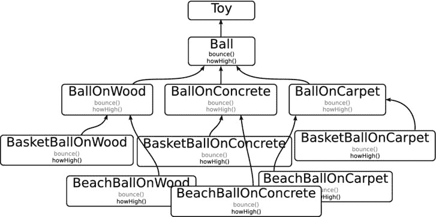
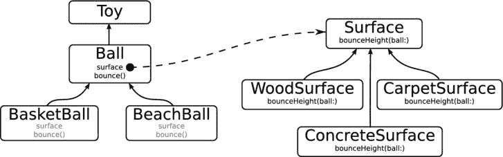

# 单一职责原则的另一个教训

避免在对象范围之外混合知识或逻辑。一个球有`bounce()`函数。要知道球会弹多高，该函数必须知道球撞击的是哪种表面。由于此计算必须在`bounce()`函数中进行，因此很容易将逻辑包含在`Ball`类中。你可以通过添加一个计算弹跳高度的`howHigh()`函数来实现。

不幸的是，这种设计决策会让你走上一条疯狂的道路。由于弹跳计算因环境而异，修改计算的唯一方法是在子类中重写`bounce()`方法。这迫使你创建诸如`BallOnWood`、`BallOnConcrete`、`BallOnCarpet`等子类。如果你随后想创建不同类型的球，例如篮球和沙滩球，你将不得不对这些子类全部进行子类化（`BeachBallOnWood`、`BasketBallOnWood`、`BeachBallOnCarpet`，等等）。你的类会失控，如图 6-5 所示。

图 6-5. 子类化的“解决方案”

避免这种混乱的设计模式是委托模式。如你所见，委托模式在 Cocoa Touch 框架中被广泛使用。*委托模式*将关键决策委托给另一个对象，这样逻辑就不会分散类的单一职责。

使用委托模式，你可以为球创建一个`surface`属性。`surface`属性将连接到一个实现了`bounceHeight(ball:)`函数的对象。当球想知道应该弹多高时，它会调用委托函数`bounceHeight(ball:)`，将自身作为参数传递。`Surface`对象会执行计算并返回结果。`Surface`的子类（`ConcreteSurface`、`WoodSurface`、`CarpetSurface`、`GrassSurface`）会重写`bounceHeight(ball:)`来调整其行为，如图 6-6 所示。

图 6-6. 委托解决方案

现在你有了一个简单而灵活的类层次结构。抽象类`Ball`有`BasketBall`和`BeachBall`子类。这些类中的任何一个都可以连接到任何`Surface`子类（`ConcreteSurface`、`WoodSurface`、`CarpetSurface`、`GrassSurface`）以提供正确的物理行为。这种安排也保持了开闭原则：你可以*扩展* `Ball`或`Surface`来创建新的球或新的表面，而无需*修改*任何现有的类。

## 其他模式

还有很多很多其他的设计模式和原则。我不期望你记住它们——只需要了解它们的存在。有了设计模式的意识，当你看到 Cocoa Touch 框架和其他地方的类是如何设计的时候，你就会开始注意到它们；iOS 是一个非常精心设计的系统。

以下是你将遇到的其他常见模式：

*   *单例模式*：一个维护单个对象实例供整个程序使用的类。`UIApplication.sharedApplication()`函数返回一个单例。
*   *懒加载模式*：等到需要对象（或属性）时才创建它。懒加载提高了某些操作的效率，并减少了前置条件。`UITableView`懒加载表格单元格对象；它会等到需要绘制某一行时，才要求数据源委托提供该行的单元格。
*   *工厂模式和类簇*：一种为你创建对象的方法（而不是你自己创建和配置它们）。通常，你的代码不知道需要创建什么对象，甚至不知道需要创建哪类对象。工厂方法为你处理（封装）了这些细节。`NSURL.URLWithString(_:)`函数是一个工厂方法。返回的`NSURL`对象的类会不同，具体取决于字符串描述的 URL 类型。
*   *装饰器模式*：使用另一个对象来“装饰”一个对象。具有讽刺意味的是，`UIBarButtonItem`不是一个按钮对象。它是一个装饰器，可能会导致一个按钮、一个特殊的控件项，甚至改变工具栏中控件的位置。

当然，还有很多其他模式。

第一本关于设计模式的重要著作（*Design Patterns: Elements of Reusable Object-Oriented Software*）于 1994 年由所谓的“四人帮”出版：Erich Gamma、Richard Helm、Ralph Johnson 和 John Vlissides。这些模式至今仍然适用，并且设计模式已成为任何严肃程序员的“必备知识”。原著并非针对任何特定的计算机语言；你可以将这些原则应用于任何语言，甚至非面向对象的语言。此后，许多作者将这些模式重新应用于特定语言并进行了改进。因此，如果你主要对学习适用于 Swift 的这些技能感兴趣，可以找一本关于 Swift 设计模式的书。

**注意** 设计模式的一个有趣分支是*反模式*的出现：开发人员反复陷入的编程陷阱。许多反模式都有有趣的名字，比如“上帝对象”（一个做了太多事情的对象）和“千层面代码”（层次过多的软件设计）。请参阅`http://en.wikipedia.org/wiki/Anti-patterns`了解它们的由来和其他示例。

