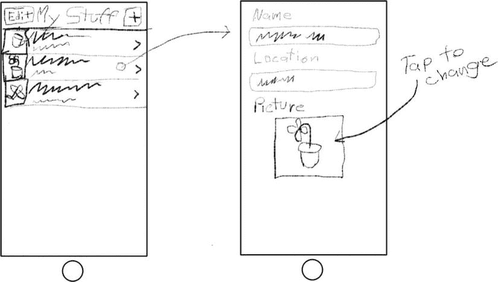
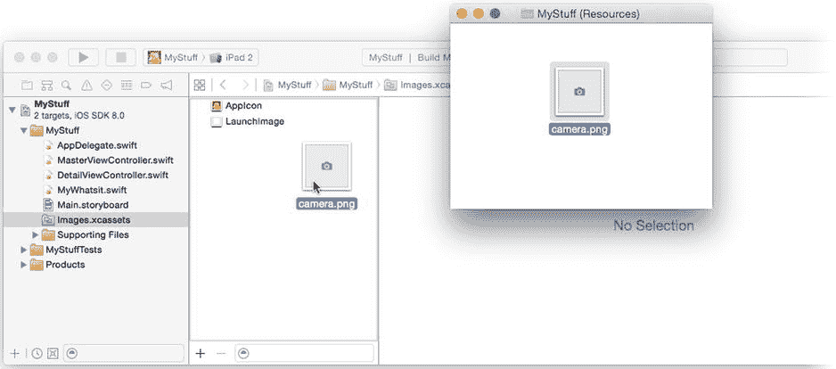
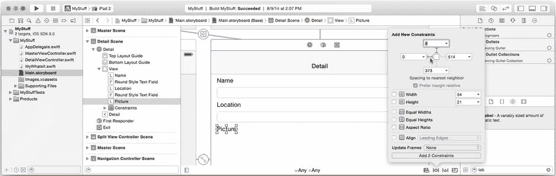
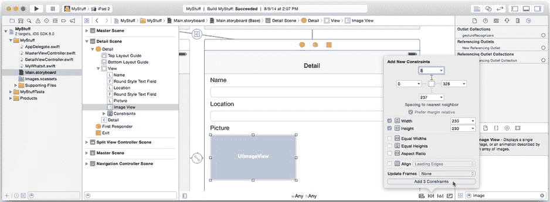
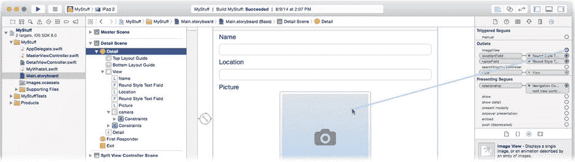
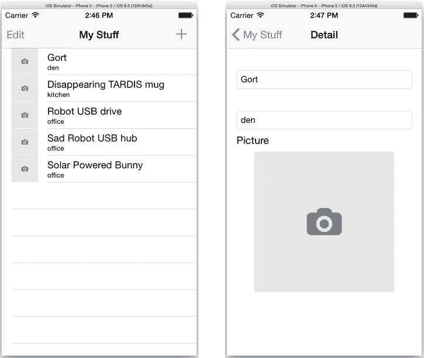
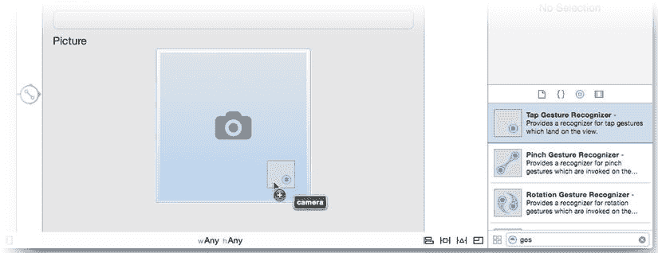
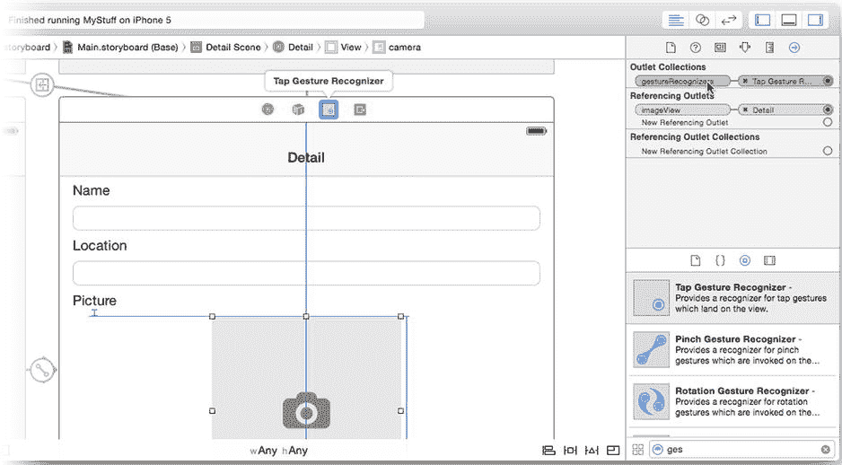
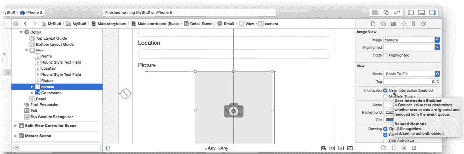
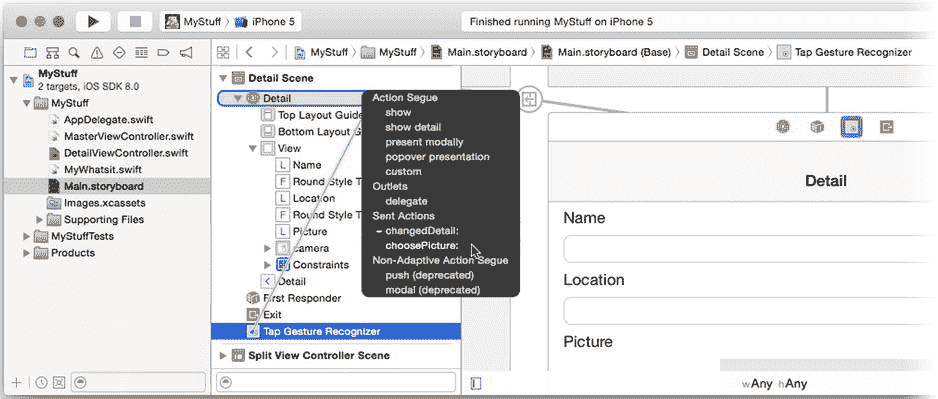

# 第七章 微笑！

图片和视频是移动应用的重要组成部分。这得益于大多数 iOS 设备内置的出色音视频硬件。你的应用可以利用这些硬件——而且这并不难。苹果使得展示一个界面变得异常简单，用户可以在其中拍照、从相册中选择现有照片，并在你的应用中使用该图像。


## 本章内容

在本章中，你将向 `MyStuff` 添加图片功能。你将允许用户为拥有的每个物品选择或拍摄一张图片，并在详细视图和主列表中都显示该图像。在此过程中，你将学习如何完成以下操作：

- 创建并显示相机或图片选择器控制器
- 获取用户拍摄或选择的图片
- 使用 Core Graphics 裁剪和调整图片大小
- 将图片保存到用户的相机胶卷
- 在表格视图的行中显示图片缩略图

此外，你还将掌握其他一些实用技能：

- 向视图对象添加点击手势识别器
- 在弹出窗口中展示视图控制器
- 关闭键盘

本章将扩展你在第 5 章编写的 `MyStuff` 应用。你可以继续使用第 5 章完成的版本，或者从 `Learn iOS Developer Projects` 文件夹中的 `Ch 7` 目录下找到最终版。如果你是在第 5 章的项目基础上继续开发（我强烈推荐这样做），则需要使用 `Ch 7`  `MyStuff (Resources)` 文件夹中的资源文件。

#### 设计

扩展 `MyStuff` 应用并不困难。你已经创建了主从界面，并实现了表格视图和编辑功能。所有繁重的工作已经完成，你只需稍加美化。在详细视图中，你将添加一个 `UIImageView` 对象来显示物品的图片；在表格视图中，你将添加图标来显示列表中的缩略图，如图 7-1 所示。



图 7-1. 更新后的 `MyStuff` 设计

当用户在详细视图中点击图片时，你的应用将显示相机或照片选择器界面。相机界面允许用户使用设备内置摄像头拍照，而照片选择器界面则让用户从相册中选择现有图片。新图片将同时显示在详细视图和主列表中。让我们开始吧！

### 扩展设计

要扩展你的设计，需要对多个现有类和界面文件进行小幅修改。无论你是否意识到，`MyStuff` 应用都使用了模型-视图-控制器设计模式。我将在下一章描述模型-视图-控制器设计，但目前你只需知道应用中的部分对象是“数据模型”对象，部分是“视图”对象，还有部分是“控制器”对象。为 `MyStuff` 添加图片需要以下步骤：

1. 扩展数据模型以包含图片对象
2. 添加视图对象来显示这些图片
3. 扩展控制器对象以拍摄图片并更新数据模型

#### 修改数据模型

第一步是扩展你的数据模型。找到 `MyWhatsit.swift` 接口文件并添加两个新属性。

```
var image: UIImage? {
    didSet {
        postDidChangeNotification()
    }
}

var viewImage: UIImage {
    return image ?? UIImage(named: "camera")
}
```

第一个属性为每个 `MyWhatsit` 对象添加了一个可选的存储型 `UIImage` 属性。它包含一个 `didSet` 观察器，当属性被修改时会发送“已更改”通知，就像其他存储属性一样。现在每个 `MyWhatsit` 对象都拥有了图片，修改该图片将通知其观察者。嗯，这很简单！

第二个属性需要稍作解释。在所有的视图对象中（包括详细视图和表格视图），你想显示物品的图片。然而，如果没有图片，你想显示一个占位图片——一个表示“没有图片”的图像。计算属性 `viewImage` 将返回物品的图片或占位图片。这是一个不可变属性，意味着该对象的客户端无法更改它；换句话说，语句 `something.viewImage = newImage` 是不允许的。

这个属性还使用了你可能不认识的 Swift 语法。`??` 是名称古怪的 *nil 合并运算符*。它用于可选值，当值为 `nil` 时返回替代值。如果左侧的值存在，表达式将计算为该值。如果左侧的值不存在，则计算为右侧的表达式。

#### `VIEWIMAGE` 的缺陷

将 `viewImage` 属性添加到 `MyWhatsit` 类实际上是一种糟糕的软件设计。问题在于 `MyWhatsit` 类是数据模型类，而 `viewImage` 属性属于视图类的领域。通俗地说，它解决的是图片显示的问题，而非图片存储的问题。你将视图特定的功能添加到了数据模型对象中，这是应该避免的。

在组织良好的模型-视图-控制器（MVC）设计中，每个类的领域应该是纯粹的：数据模型类只应包含与数据模型相关的属性和函数——不应包含其他内容。这里的问题在于，将 `viewImage` 属性添加到 `MyWhatsit` 类实在太方便了：它封装了为该物品提供一致且可预测的显示图片的逻辑，从而简化了其他地方的代码。封装逻辑并使对象更易用的代码不可能是坏代码，对吧？

这并不坏。事实上，这很好。但是否有办法避免将 `viewImage` 直接添加到 `MyWhatsit` 类的架构“缺陷”呢？解决方案是使用扩展。扩展是 Swift 的一项独特功能，可以解决此类棘手的领域问题，同时不增加对象的使用难度。通过扩展，你仍然可以为 `MyWhatsit` 对象添加 `viewImage` 属性，但可以在不同的模块中完成——一个视图模块，与 `MyWhatsit` 数据模型类分离。这样你既能获得将 `viewImage` 属性添加到 `MyWhatsit` 的好处，又能保持数据模型代码与视图代码分离。我将在第 20 章中解释扩展。

在运行时（应用运行时），你的 `MyWhatsit` 对象仍然拥有 `viewImage` 属性，就像直接添加到 `MyWhatsit` 类中一样。那么这有什么影响呢？影响不大，对于这样一个小项目来说，后果可以忽略不计，这就是为什么我没有让你为 `viewImage` 创建扩展。有时务实胜过对设计模式的盲目遵循。只需知道，在更复杂的项目中，在 `MyWhatsit` 中定义 `viewImage` 可能会成为障碍，解决方案是将其移入扩展。

为了让计算属性 `viewImage` 正常工作，你需要将占位图片文件添加到项目中。在 `MyStuff (Resources)` 文件夹中找到 `camera.png` 文件，并将其拖入 `Images.xcassets` 资源目录的组列表中，如图 7-2 所示。



图 7-2. 添加 `camera.png` 资源

`MyWhatsit` 已完成，接下来该向界面添加新的视图对象了。

#### 添加图片视图

下一步是向详细界面添加视图对象。现在你应该对这些操作感到熟悉了。

1. 为 `DetailViewController` 类添加 `imageView` 输出口。
2. 为 `DetailViewController` 界面文件添加标签和图片视图对象。
3. 将 `imageView` 输出口连接到图片视图对象。

从 `DetailViewController.swift` 文件开始。添加以下属性：

```
@IBOutlet var imageView: UIImageView!
```

现在切换到 `Main.storyboard` 文件。从对象库中添加一个新的标签对象。将其放置在位置文本框下方，如图 7-3 所示。将标签标题改为 Picture。点击固定约束控件，添加上边距和左边距约束，如图 7-3 右侧所示。




图 7-3. 添加“图片”标签

添加一个图像视图对象，并将其放置在新标签下方。选中它。点击“固定约束”控件，添加一个“上边距”约束，并添加“宽度”和“高度”约束，两者均设置为 `230`，如图 图 7-4 所示。最后，点击“对齐约束”控件，添加一个“在容器中水平居中”约束（值为 0）。至此，您的图像视图尺寸变为 230 x 230 像素，居中显示，并位于“图片”标签正下方。



图 7-4. 为图像视图添加尺寸约束

保持图像视图的选中状态，切换到“属性检查器”，并将其 `Image` 属性改为 `camera`。这样，在没有正在编辑的 `MyWhatsit` 对象时，将显示占位图像。（这主要适用于分屏 iPad 界面。）

最后一步是选中 `Detail View Controller`。切换到“连接检查器”，找到您添加到控制器中的 `imageView` 输出口。将其连接到图像视图对象，如图 图 7-5 所示。



图 7-5. 连接 `imageView` 输出口

**注** 可以调整图像视图的布局，使其更好地适应常规宽度（iPad）界面。您可以定义适应不同尺寸类别的约束，我将在第 9 章中向您展示具体方法。阅读完该章后，请回来优化此布局。

视图对象准备就绪后，就该添加代码来显示项目图像了。

### 更新视图控制器

您需要修改主视图控制器中的代码，为表格单元格添加图像，并修改详细视图控制器中的代码，让图像显示在新的图像视图中。从 `MasterViewController.swift` 开始。在 `tableView(_:,cellForRowAtIndexPath:)` 中找到以下代码，并添加粗体文本：

```
cell.textLabel?.text = thing.name
cell.detailTextLabel?.text = thing.location
cell.imageView?.image = thing.viewImage
return cell
```

新代码将单元格的图像（`cell.imageView.image`）设置为该行 `MyWhatsit` 对象的 `viewImage`。请记住，显示图像既可能是项目的实际图像，也可能是占位图。设置单元格图像视图的操作会改变单元格的布局，使图像显示在左侧。（请参考第 5 章中的“单元格样式”部分。）

`MasterViewController` 的修改已完成。点击 `DetailViewController.swift` 并找到 `configureView()` 函数。找到以下代码并添加加粗的一行：

```
if nameField != nil {
    nameField.text = detail.name
    locationField.text = detail.location
    imageView.image = detail.viewImage
}
```

这一新行将 `UIImageView` 对象（连接到 `imageView` 输出口）的图像，设置为正在编辑的 `MyWhatsit` 对象的图像。

从数据模型和视图的角度来看，所有准备工作都已就绪，现在可以试试看了。将方案设置为 iPhone 模拟器并运行项目。您会看到表格和详细视图中出现了占位图像，如图 图 7-6 所示。



图 7-6. 占位图像

目前一切运行良好——只是还无法更改图片。要实现该功能，需要创建一个操作。

### 连接“选择图片”操作

您希望当用户在详细视图中点击图像时，显示相机或照片库选择器界面。连接起来很简单：创建一个操作方法，并将图像视图连接到它。首先在 `DetailViewController.swift` 中定义一个新的操作（现在无需编写实现，只需声明）：

```
@IBAction func choosePicture(_: AnyObject!) {
}
```

现在切换回 `Main.storyboard` 界面，选中图像视图对象，并将其操作输出口连接到 `DetailViewController` 中的 `choosePicture:` 操作。

哎呀，我们似乎遇到了一个问题。图像视图对象不是一个按钮或任何其他类型的控件视图；它不会发送操作消息。实际上，默认情况下，它会忽略所有触摸事件（其“用户交互已启用”属性为 `false`）。那么，如何让图像视图对象向您的视图控制器发送操作呢？

有几种方法。一种解决方案是继承 `UIImageView` 并重写其触摸事件方法，如第 4 章所述。但有一个更简单的方法：向视图附加一个手势识别器对象。

在对象库中，找到“轻点手势识别器”。将一个轻点手势识别器对象拖入界面，并放到图像视图对象上，如图 图 7-7 所示。



图 7-7. 向图像视图附加轻点手势识别器

当您将手势识别器放到视图对象上时，Interface Builder 会创建一个新的手势识别器对象，并将视图对象连接到它。这是一对多的关系：一个视图可以连接到多个手势识别器，但一个识别器仅作用于单个视图对象。要查看此关系，请选中视图对象并使用“连接检查器”查看其识别器。将光标悬停在连接上，Interface Builder 会高亮显示它所连接的对象，如图 图 7-8 底部所示。



图 7-8. 检查图像视图对象的手势识别器连接

**提示** 您也可以在连接检查器中查看反向连接。选中一个识别器对象。在检查器底部附近，您会找到*引用输出口集合*部分。此部分显示从其他视图对象*到*此识别器对象的连接。这适用于 Interface Builder 中的所有对象。

默认情况下，新添加的轻点手势识别器被配置为识别单指轻点事件，这正是您所需要的。不过，您需要更改图像视图对象的属性。即使您已将其连接到手势识别器，视图对象仍然设置为忽略触摸事件，因此它永远不会收到任何可供识别的事件。通过选中图像视图对象并使用属性检查器来勾选“用户交互已启用”属性以解决此问题，如图 图 7-9 所示。



图 7-9. 为图像视图启用触摸事件

最后一步是将手势识别器连接到 `choosePicture:` 操作。按住 Control 键，从场景停靠栏中的手势识别器拖出，如图 图 7-10 所示，或者从对象大纲拖出。两者代表同一个对象。将连接拖到 `DetailViewController` 对象，并将其连接到 `choosePicture:` 操作，同样如图 图 7-10 所示。



图 7-10. 连接 `choosePicture:` 操作


