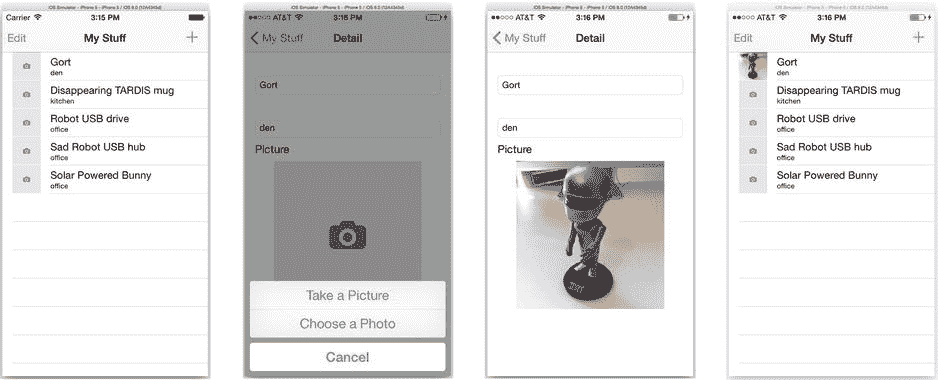
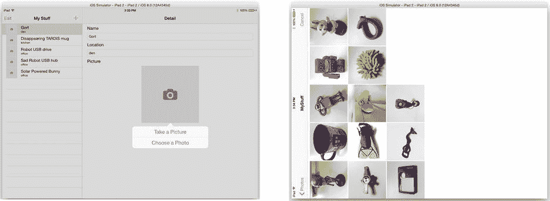
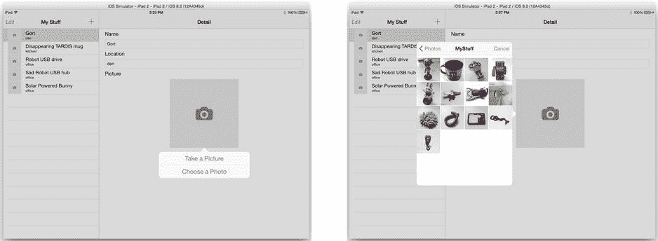
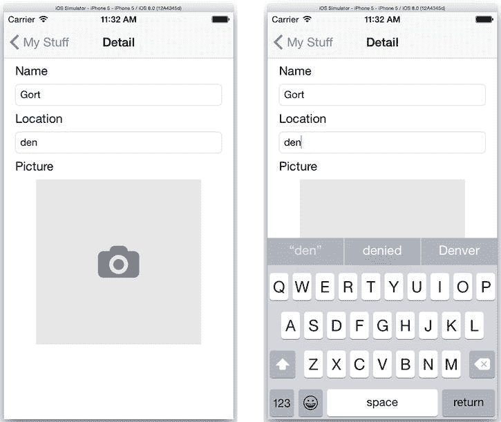
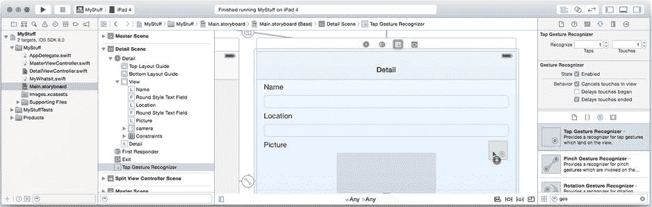

# 当用户点击图片时，详情视图控制器会收到一个 `choosePicture:` 动作。现在你需要实现 `choosePicture(_:)` 函数，这将带你进入最有趣的部分：让用户拍摄照片。

### 拍摄照片

`UIImagePickerController` 类提供了简单且独立的界面，用于拍摄照片、录制视频或从用户照片库中选择现有项目。图像选取控制器负责处理所有复杂工作。在大多数情况下，你的应用只需创建一个 `UIImagePickerController` 对象，并像展示其他视图控制器一样展示它即可。控制器的代理将接收包含用户选取的图像、拍摄的照片或录制的视频的消息。

但这并不意味着图像选取控制器能处理所有事情。在图像选取器执行操作前后，你的应用需要做出多项决策并考虑各种因素。这将是应用逻辑的核心部分，我将在你编写代码的过程中解释这些决策。首先，完善你在 `DetailViewController.swift` 文件中开始编写的 `choosePicture(_:)` 函数。

```
@IBAction func choosePicture(_: AnyObject!) {
    if detailItem == nil {
        return
    }
```

第一个决策很简单：只有当详情视图当前正在编辑 `MyWhatsit` 对象时，此动作才会执行操作。如果不是（即 `detailItem == nil`），则返回并什么也不做。这种情况可能发生在 iPad 界面中：详情视图可见，但用户尚未选择要编辑的项目。

### 你无法总是得到想要的东西

现在进入决定哪些图像选取器界面可用的代码部分。继续在 `DetailViewController.swift` 中编写 `choosePicture(_:)` 函数。

```
let hasPhotos = UIImagePickerController.isSourceTypeAvailable(.PhotoLibrary)
let hasCamera = UIImagePickerController.isSourceTypeAvailable(.Camera)
```

这是用户想要操作与你应用能实现功能之间的交集。`UIImagePickerController` *可能* 提供静态相机、视频相机、静态与视频组合相机、照片库选取器或相机胶卷（已保存）照片选取器。然而，这并不意味着它能实现所有这些功能。不同的 iOS 设备拥有不同的硬件。有些设备有相机，有些没有，还有些设备有两个相机。有些相机能拍摄视频，而有些则不能。即使设备配备了相机和照片库，安全限制或约束也可能禁止你的应用使用它们。

使用图像选取器的第一步是决定你想要做什么，然后查明你能做什么。对于此应用，你希望要么展示静态相机界面，要么展示选取器界面以从照片库中选择现有图像。使用 `UIImagePickerController` 的类函数 `isSourceTypeAvailable(_:)` 来查明你是否能实现其中任一功能。你向该函数传入一个常量，指示你想要展示的界面类型，该方法会返回该界面是否可用。

询问照片库选取器界面是否可用的结果保存在 `hasPhotos` 值中。`hasCamera` 值将记录实时相机界面是否可用。

**注意** 还有第三种界面：`UIImagePickerControllerSourceType.SavedPhotosAlbum`。它提供与照片库选取器相同的界面，但只允许用户从相机胶卷中选择图像——在无相机设备上称为“已保存照片”相册。

接下来的 `switch` 语句决定了在四种可能情况下分别执行什么操作：

```
switch (hasPhotos,hasCamera) {
    case (true,true):
        let alert = UIAlertController(title: nil,
                                    message: nil,
                             preferredStyle: .ActionSheet)
        alert.addAction(UIAlertAction(title: "Take a Picture",
                                      style: .Default,
                                    handler: { (_) in
                                        self.presentImagePicker(.Camera)
                                        }))
        alert.addAction(UIAlertAction(title: "Choose a Photo",
                                      style: .Default,
                                    handler: { (_) in
                                        self.presentImagePicker(.PhotoLibrary)
                                        }))
        alert.addAction(UIAlertAction(title: "Cancel",
                                      style: .Cancel,
                                    handler: nil))
        if let popover = alert.popoverPresentationController {
            popover.sourceView = imageView
            popover.sourceRect = imageView.bounds
            popover.permittedArrowDirections = ( .Up | .Down )
        }
        presentViewController(alert, animated: true, completion: nil)
    case (true,false):
        presentImagePicker(.PhotoLibrary)
    case (false,true):
        presentImagePicker(.Camera)
    default: /* (false,false) */
        break
}
```

`switch` 语句考虑元组 `(hasPhotos,hasCamera)`。在第一种情况下，两者都为 `true`，这意味着你不知道该展示哪个界面。遇到不确定的情况时，使用操作表询问用户。

操作表有三个按钮：拍摄照片、选择照片和取消。每个选择由 `UIAlertAction` 对象定义，包含按钮的 `title`、`style` 以及最重要的——当用户点击该按钮时将执行的代码。

`switch` 语句的第二和第三种情况（`(true,false)` 和 `(false,true)`）处理只有一种界面可用的情况，并直接展示该界面。最后一种情况什么也不做，因为没有什么可操作的。

**提示** 在实际开发中，最好弹出一条警告消息告知用户没有可用的图像源，而不是忽略他们的点击——但我会将其留作你可以自行探索的练习。

回顾一下，你已经查询了 `UIImagePickerController`，以确定在你想要展示的界面子集中哪些是可用的。如果没有可用界面，则什么也不做。如果只有一种可用，则立即展示该界面。如果有多个可用，则询问用户想要使用哪个，等待他们的回答，然后展示该界面。下一个重要任务是展示界面。

### 展示图像选取器

现在向你的 `DetailViewController` 类中添加 `presentImagePickerUsingCamera(_:)` 函数。

```
func presentImagePicker(source: UIImagePickerControllerSourceType) {
    let picker = UIImagePickerController()
    picker.sourceType = source
    picker.mediaTypes = [kUTTypeImage as NSString]
    picker.delegate = self
    presentViewController(picker, animated: true, completion: nil)
}
```

此方法首先创建一个新的 `UIImagePickerController` 对象，它是 `UIViewController` 的一个特殊子类。

`sourceType` 属性决定了图像选取器将展示哪个界面。它应仅设置为由 `isSourceTypeAvailable(_:)` 返回 `true` 的值。在你的应用中，它被设置为 `UIImagePickerControllerSourceType.Camera` 或 `UIImagePickerControllerSourceType.PhotoLibrary`，而你已确认这些是可用的。


`mediaTypes`属性是一个数据类型的数组，你的应用准备好接受这些数据类型。在 iOS 8 中，有效的选项（目前）是`kUTTypeImage`、`kUTTypeMovie`，或两者都选。该属性会修改界面（相机或选择器），使得只有那些图像类型被允许。当展示相机界面时，仅设置`kUTTypeImage`会限制控件，使用户只能拍摄静态图像。如果你同时包含了两种类型（`kUTTypeImage`和`kUTTypeMovie`），那么相机界面将允许用户在拍摄静态图像和电影之间自由切换。

**提示** 要找出特定选择器界面（例如，对于`.Camera`界面）实际支持哪些媒体类型，请调用`availableMediaTypesForSourceType(_:)`函数。有些相机可以录制电影，而其他相机只能拍摄静态照片。而且，未来的 iOS 版本可能会推出新的媒体类型，所以检查一下是个好习惯。

`kUTTypeImage`值也是一个奇怪的东西。首先，它不是标准 UIKit 框架的一部分。它定义在 Mobile Core Services 框架中。要使用它，请在`DetailViewController.swift`文件的开头添加这个`import`语句：

```swift
import MobileCoreServices
```

另一个怪异之处是常量`kUTTypeImage`和`kUTTypeMovie`不是原生的 Swift 值。它们是 Core Foundation 字面量，这就是为什么你必须将它们强制转换为 Cocoa 字符串对象（`kUTTypeImage as NSString`）。Core Foundation 类型和免费桥接在第 20 章中有解释。

**提示** 在启动界面之前，你还可以设置`UIImagePickerController`的其他一些属性。例如，如果你希望让用户能够精修图片或修剪电影，请将它的`allowsEditing`属性设置为`true`。

`presentImagePicker(_:)`的最后两行将你的控制器设置为选择器的委托，并启动其界面。控制器滑入视图，等待用户拍照、选取图片或取消操作。当这些情况之一发生时，你的控制器会接收到相应的委托消息。但要成为图像选择器委托，你的控制器必须同时采用`UIImagePickerControllerDelegate`和`UINavigationControllerDelegate`协议。现在将这些协议添加到你的`DetailViewController`类声明中。

```swift
class DetailViewController: UIViewController, UIImagePickerControllerDelegate,
                                              UINavigationControllerDelegate {
```

**注意** 你的`DetailViewController`对`UINavigationControllerDelegate`函数不感兴趣，也不实现它们。它采用该协议仅仅是为了避免因不采用而产生的编译器错误。

选择器启动并运行后，你现在就可以处理用户拍摄或选取的图像了。

### 导入图像

最终，用户会拍摄或选择一张图片。这会导致调用你的`imagePickerController(_:,didFinishPickingMediaWithInfo:)`委托函数。在这个函数中，你将获取用户拍摄/选择的图像，并将其添加到`MyWhatsit`对象中。关于用户操作的所有信息都包含在一个字典中，通过`info`参数传递给你的函数。将此代码添加到你的`DetailViewController.swift`文件中。这个函数的开始部分相当简单。

```swift
func imagePickerController(_: UIImagePickerController,
                didFinishPickingMediaWithInfo info: [NSObject : AnyObject]) {
    var image: UIImage! = info[UIImagePickerControllerEditedImage] as? UIImage
    if image == nil {
        image = info[UIImagePickerControllerOriginalImage] as UIImage
    }
```

第一个任务是获取图像对象。可能存在两个图像：原始图像和编辑后的图像。如果用户进行了裁剪、滤镜或任何其他相机内编辑，你想要的应该是编辑后的版本。首先从`info`字典中请求那个（`UIImagePickerControllerEditedImage`）。如果该值为`nil`，那么原始图像（`UIImagePickerControllerOriginalImage`）就是唯一提供的图像。

**注意** 如果你配置的选择器界面允许用户使用多种媒体类型（`kUTTypeImage`和`kUTTypeMovie`），那么`info[UIImagePickerControllerMediaType]`值会告诉你选择了哪一种。

接下来的代码块考虑了用户拍照的情况。当用户拍照时，大多数人期望他们的照片出现在相机胶卷中。这不是一个硬性要求，其他应用可能会有不同的行为，但这里你通过将用户刚拍摄的照片保存到他们的相机胶卷中，来满足用户的期望：

```swift
if picker.sourceType == .Camera {
    UIImageWriteToSavedPhotosAlbum(image,nil,nil,nil)
}
```

如果用户从他们的照片库中选取了一张现有图片，你就不想这样做；你只会重复照片库中已有的图片。

**提示** 许多应用允许用户将图像保存到相机胶卷。你可以随时使用`UIImageWriteToSavedPhotosAlbum()`函数来做到这一点。该函数不仅限于与图像选择器界面结合使用。

### 裁剪和调整大小

现在你有了图像，要怎么处理它呢？你可以直接将`MyWhatsit`的图像属性设置为返回的图像对象，然后返回。虽然这样可行，但有点粗糙。首先，现代 iOS 设备拥有高分辨率相机，会产生很大的图像，每张图像会消耗几兆字节的内存。不需要太多这样的照片，你的应用就会内存不足并崩溃。其次，这些图像是矩形的，而细节界面和表格视图使用方形图像会看起来更好。

为了解决这两个问题，你需要缩放并裁剪用户的图像。首先使用以下代码裁剪图像，这是你的`imagePickerController(_:,didFinishPickingMediaWithInfo:)`函数的下一部分：

```swift
let cgImage = image.CGImage
let height = Int(CGImageGetHeight(cgImage))
let width = Int(CGImageGetWidth(cgImage))
var crop = CGRect(x: 0, y: 0, width: width, height: height)
if height > width {
    crop.size.height = crop.size.width
    crop.origin.y = CGFloat((height-width)/2)
} else {
    crop.size.width = crop.size.height
    crop.origin.x = CGFloat((width-height)/2)
}
let croppedImage = CGImageCreateWithImageInRect(cgImage, crop)
```

第一步是从`UIImage`对象获取 Core Graphics 图像引用。`UIImage`是一个方便且易于使用的对象，为你处理各种复杂的图像存储、转换和绘制细节。然而，它不允许你以任何重要方式操作或修改图像。要做到这一点，你需要“降级”到更低级别的 Core Graphics 框架，那里有真正的图像操作和绘制函数。`cgImage`值包含一个`CGImageRef`——Core Graphics 图像引用。这是一个引用（可以将其视为对象引用），包含了原始图像数据。

接下来是获取图像的高度和宽度（以像素为单位）。这通过调用`CGImageGetHeight()`和`CGImageGetWidth()`函数来完成。

### C 语言与 Swift 编程

实际上，Cocoa Touch 框架的大部分是用 C 和 Objective-C 编写的，而不是 Swift。C 是一种过程式语言，已经存在很长时间，并且可能是世界上使用最广泛的计算机语言。Objective-C 构建在 C 语言之上，为 C 语言添加了对象的概念。


在第 6 章中，我提到过完全通过定义结构体并将这些结构体传递给函数来编写程序。这正是使用 C 语言以及名为 Core Foundation 的 C 函数框架进行编程的方式。

虽然 C 语言不是面向对象的语言，但你仍然可以编写面向对象的程序；只是需要做更多工作。在 Core Foundation 中，类被称为*类型*（`type`），对象被称为*引用*（`reference`）。你不再调用对象的方法，而是调用全局函数并将引用作为参数传入（通常作为第一个参数）。换句话说，你不再写`myImage.height`来获取图像的高度，而是写`CGImageGetHeight(myImage)`。在 C 语言中没有类，结构体和枚举也无法像在 Swift 中那样拥有方法。

虽然大多数 Core Foundation 类型只能与 Core Foundation 函数一起使用，但少数基础类型可以与 Swift（以及 Objective-C）对象互换。这些类型包括`String`/`NSString`/`CFStringRef`、`NSNumber`/`CFNumberRef`、`Array`/`NSArray`/`CFArrayRef`、`Dictionary`/`NSDictionary`/`CFDictionaryRef`、`NSURL`/`CFURLRef`等。任何期望其中一种类型的 C、Objective-C 或 Swift 函数都可以直接接受另一种类型。这被称为*无桥接*（toll-free bridge），你已经在当前应用中使用过它。字符串`kUTTypeImage`实际上是一个`CFStringRef`，而不是`NSString`对象。但由于两者可以互换，因此在期望`NSString`对象的参数中传递 Core Foundation 的`kUTTypeImage`字符串值是可行的。

`if`代码块判断图像是横向（宽度 > 高度）还是纵向（高度 > 宽度）。基于此，它设置一个描述图像中央正方形的`CGRect`。如果是横向，它使矩形的尺寸等于图像的高度，并缩进左右边缘。如果是纵向，则矩形的宽度等于图像的宽度，并裁剪掉顶部和底部。

`if`/`else`代码块之后的函数完成所有工作。`CGImageCreateWithImageInRect()`函数接收一个已有的 Core Graphics 图像，仅提取矩形内的像素，并将其复制到一个新的 Core Graphics 图像中。最终结果是一个仅包含原始图像中央部分的方形 Core Graphics 图像。

下一步是将`CGImageRef`转换回`UIImage`对象，以便它可以存储在`MyWhatsit`对象中。同时，你还要将其缩小，以免尺寸过大。

```
let maxImageDimension: CGFloat = 640.0
image = UIImage(CGImage: croppedImage,
                  scale: max(crop.height/maxImageDimension,1.0),
            orientation: image.imageOrientation)
```

`UIImage`的类函数`imageWithCGImage(_:,scale:,orientation:)`根据已有的`CGImageRef`创建一个新的`UIImage`对象。同时，它可以缩放图像并改变其方向。缩放比例计算的是原始图像尺寸与 640 像素图像尺寸之间的比值。这会将设备相机拍摄的（通常）较大的图像缩小到 640x640 像素，这是一个可管理的尺寸。使用`max()`函数是为了防止缩放比例低于`1.0`（1:1）；这样可以避免将已经小于 640 像素的图像放大。

**注意**：`UIImage`有一个`orientation`属性。Core Graphics 图像没有这个属性。用相机拍摄的图像都是横向格式。当你拍摄纵向（垂直）照片时，你会得到一个包含横向图像的`UIImage`，同时其`orientation`属性告诉`UIImage`以纵向方式绘制图像。当你开始使用`CGImageRef`时，这些方向信息就丢失了。如果你使用 Xcode 调试器单步执行程序，你会发现即使你拍摄的是纵向照片，代码也会裁剪横向图像（宽度 > 高度）。因此，为了使照片按拍摄时的方向绘制，你必须在创建新的`UIImage`时提供原始的方向信息。

**收尾**

所有困难的部分都结束了。这个函数剩下要做的就是把裁剪并调整大小后的图像存储到`MyWhatsit`对象中，并关闭图像选择控制器。

```
    detailItem?.image = image
    imageView.image = image
    dismissViewControllerAnimated(true, completion: nil)
}
```

第一行将裁剪后的图像存储到`MyWhatsit`对象的新`image`属性中。第二行更新详情视图中的图像视图，使其反映相同的更改。最后，你必须关闭选择器视图，因为用户已经操作完毕。

但如果用户没有拍照或拒绝从相册中选择照片呢？如果用户在图像选择器中点击取消按钮，则会调用你的`imagePickerControllerDidCancel(_:)`委托函数。你也需要处理这种情况。在你新的`imagePickerController(_:,didFinishPickingMediaWithInfo:)`函数之后立即添加以下函数：

```
func imagePickerControllerDidCancel(_: UIImagePickerController!) {
    dismissViewControllerAnimated(true, completion: nil)
}
```

这个方法除了关闭控制器之外什么也不做，不会对你的`MyWhatsit`对象做任何更改。

**测试相机**

你已经准备好实际测试你的图像选择界面了。不幸的是，模拟器不模拟相机硬件，其照片库中也没有任何图像。要测试这个应用，你需要在真实的 iOS 设备上运行它。

**注意**：理想情况下，你有一台 iPhone、iPod Touch 或类似的紧凑型 iOS 设备进行测试。如果没有，你需要阅读“处理常规界面”部分，你的应用才能正常工作。

插入你的设备，并将项目的运行方案设置为该设备。运行它。你的应用界面应该看起来像图 7-11 所示。



图 7-11. 测试 iPhone 界面

点击一个项目，点击详情视图中的占位图像，点击“拍照”，然后拍一张照片。裁剪后的图像应该会出现在详情视图中，并再次出现在主表格视图中，如图 7-11 右侧所示。

恭喜，你为应用添加了拍照功能！享受这一刻，并尽情使用相机吧。然而，iPad 用户可能感觉不到这种乐趣。让我们看看能否找出原因。

**处理常规界面**

常规的 iOS 设备——我所说的“常规”指的是那些塞不进牛仔裤口袋的设备——有更大的屏幕空间。它们利用一些替代界面技术来发挥这一优势。在紧凑型设备（iPhone、iPod 等）上，几乎所有视图控制器都以全屏方式呈现——你的主表格视图、详情视图、操作面板和图像选择器都占据整个屏幕。你只是从一个屏幕移动到另一个屏幕。

在常规设备（如 iPad）上，有弹出窗口、表单页、分视图控制器以及其他不占用整个屏幕的技术。它们同时显示多个视图，或者在现有界面上覆盖一个较小的界面。

那么，你如何知道应该使用哪种界面样式，或者系统会使用哪一种呢？我会在第 12 章中详细讨论这个问题，但这里有一个简短的课程：每个视图控制器都有一个`modalPresentationStyle`属性，它向 iOS 提示该视图控制器希望如何被呈现（在尺寸允许的情况下）。你可以设置这个属性，但在紧凑型设备上，iOS 可能会忽略它。

在你的 iPad 上运行应用，并尝试点击图像视图。似乎没有任何反应。实际上，发生了灾难性的后果；你的应用刚刚崩溃了。回到 Xcode，查看控制台窗格（在工作区窗口底部）。你会看到类似这样的消息：


```
2014-08-12 15:24:47.429 MyStuff[494:211871] *** Terminating app due to uncaught exception 'NSGenericException', reason: 'UIPopoverPresentationController (<_UIAlertControllerActionSheetRegularPresentationController: 0x15683b00>) should have a non-nil sourceView or barButtonItem set before the presentation occurs.'
```

咦？让我解释一下。操作表（action sheet）的首选呈现样式是“弹出视图（popover）”。在 iPhone 上，由于空间不足，iOS 会忽略该样式，而以覆盖层（overlay）的形式呈现操作表（见图 7-11）。在 iPad 上，弹出视图是一种更整洁的界面——远比为了仅显示三个按钮而占用整个屏幕要好得多——因此 iOS 会在弹出视图中显示警告框。

问题就在这里。弹出视图需要一些额外信息。至少，你必须告诉弹出视图界面的焦点在哪里，这样它才能智能地定位。在 `DetailViewController.swift` 文件中找到你的 `choosePicture(_:)` 函数，并插入以下新代码（以粗体显示）：

```
alert.addAction(UIAlertAction(title: "Cancel",
                              style: .Cancel,
                            handler: nil))
if let popover = alert.popoverPresentationController {
    popover.sourceView = imageView
    popover.sourceRect = imageView.bounds
    popover.permittedArrowDirections = ( .Up | .Down )
}
presentViewController(alert, animated: true, completion: nil)
```

当且仅当该控制器正在或将要在一个弹出视图中呈现时，`popoverPresentationController` 属性会返回一个 `UIPopoverPresentationController` 对象。这个对象的功能正如你所想——管理弹出视图的外观。你至少需要告诉呈现控制器弹出视图应出现在哪个视图矩形或哪个栏按钮项旁边。如果你设置的是一个矩形，你需要设置该矩形的坐标（`sourceRect`）以及这些坐标所在的视图对象（`sourceView`）。在本应用中，你使用了 `imageView` 和 `imageView.bounds`，它们定义了 `imageView` 的边框。（你也可以轻松地使用 `view` 和 `imageView.frame`，它们同样定义了 `imageView` 的边框。）

`UIPopoverPresentationController` 有许多可选属性。其中特别有用的是 `permittedArrowDirections`。这里你将其设置为 `(.Up|.Down)`，这样弹出视图会始终尝试显示在图片视图的上方或下方。在 iPad 上再次运行你的应用，并查看图 7-12 左侧所示的结果。



图 7-12。弹出视图中的常规警告控制器

现在，你的警告框会显示在一个包含两个按钮的弹出视图中。注意，第三个操作（Cancel）并未显示。在弹出视图外部任意位置点击会将其关闭。这使得取消按钮变得多余。警告控制器知道这一点，因此将其省略了。

选择拍照会呈现一个全屏相机界面，这很完美。（苹果人机界面指南建议始终以全屏方式呈现相机界面。）

然而，相册选取器（如图 7-12 右侧所示）仍有改进空间。占用整个屏幕显得过于粗暴，并且它仅支持竖屏方向——至少可以说很别扭。我认为可以改进；你觉得呢？找到你的 `presentImagePicker(_:)` 函数，并将其修改为以下内容（新代码以粗体显示）：

```
func presentImagePicker(source: UIImagePickerControllerSourceType) {
    let picker = UIImagePickerController()
    picker.sourceType = source
    picker.mediaTypes = [kUTTypeImage as NSString]
    picker.delegate = self
    if source == .PhotoLibrary {
        picker.modalPresentationStyle = .Popover
    }
    if let popover = picker.popoverPresentationController {
        popover.sourceView = imageView
        popover.sourceRect = imageView.bounds
    }
    presentViewController(picker, animated: true, completion: nil)
}
```

如果你打算显示相册选取器界面，请将其首选呈现样式改为 `UIModalPresentationStyle.Popover`。如果你的首选样式未被 iOS 忽略（在紧凑型设备上会被忽略），请像对警告框所做的那样获取弹出视图呈现控制器并进行配置。现在，相册选取器界面会更具 iPad 风格，如图 7-13 所示。



图 7-13。在弹出视图中呈现相册选取器界面

自定义视图控制器呈现方式的方法还有很多，但我会将其留到第 12 章再讲。

### 粘滞键盘

你的应用有一个怪癖，如果你还没注意到的话，就是粘滞键盘。不，我指的不是边编程边吃巧克力时沾上的那种键盘。我说的是 iOS 中的虚拟键盘。图 7-14 展示了当你点击文本字段时出现的虚拟键盘。



图 7-14。iOS 的虚拟键盘

问题在于，一旦它被召唤出来，就不会消失。它会赖在那里，遮挡你的图片视图，通常还很烦人。这从 iOS 诞生之初就是一个“特性”，如果你的应用因此遇到问题，你就必须处理它。

我相信你一定注意到，你使用的许多其他应用并没有这个问题。在文本字段外部点击会使键盘再次消失。那些应用的作者会拦截文本字段外部的点击并关闭键盘。针对这个问题，已有多种解决方案，你会在互联网上找到许多。我将向你展示一个特别简单的方法，只需一分钟就能添加到你的应用中。

“诀窍”是捕获文本字段对象外部的触摸事件，并将这些事件转换为一个可以收回键盘的操作。先从第二部分开始：创建一个收回键盘的操作。在你的 `DetailViewController.swift` 文件中，添加以下方法：

```
@IBAction func dismissKeyboard(_: AnyObject!) {
    view.endEditing(false)
}
```

这个简单的方法会在界面的根视图上调用 `endEditing(_:)` 函数。`endEditing(_:)` 函数是专门为解决此问题而设计的；它会在视图的子视图中搜索当前正在编辑的可编辑对象。如果找到，它会要求该对象辞去第一响应者状态，结束编辑会话，并收回键盘。

**提示** 传递给 `endEditing(_:)` 函数的单一值是 `force` 参数。如果为 `true`，它会强制视图结束编辑，即使它不想结束。传递 `false` 则让视图自行决定，可能不会结束编辑会话。我选择了礼貌的方式，让视图自行决定。

现在，你将添加另一个轻点手势识别器。在 `Main.storyboard` 文件中，从对象库中找到轻点手势识别器。将其拖入你的界面，并放入根视图对象中，通过将其放入界面中的空白区域（如图 7-15 所示），或直接放入大纲中的根视图对象。




图 7-15 向根视图添加轻点手势识别器

按住 Control 键并右键点击新的手势识别器，将其拖拽至`详情视图控制器`，并连接到新的 `dismissKeyboard:` 操作。（如果你不确定哪个手势识别器对象属于根视图，可以使用连接检查器，如 图 7-8 的“连接选择图片操作”部分所示。）现在，任何在特定子视图外发生的轻点，都会将这些触摸事件传递给根视图，从而关闭键盘。如果你不清楚为什么会出现这种情况，请回顾第 4 章中的“命中测试”部分。

试一试吧。运行你的应用，点击文本框内部，然后点击文本框外部。你应该能看到键盘出现，然后消失。

无论你在哪里点击，除了图片视图之外，都会触发此操作。这个问题很容易解决。找到 `choosePicture(_:)` 函数中应用打算展示界面的位置，并添加下面这一行粗体代码：

```
dismissKeyboard(self)
let hasPhotos = UIImagePickerController.isSourceTypeAvailable(.PhotoLibrary)
...
```

这样，当用户点击图片视图进行更换时，键盘就会收回。请记住，在命中测试中，最具体的视图对象会接收触摸事件。由于图片视图对象接收了触摸事件，这些事件就不会传递到根视图。

### 高级相机技术

我相信你已经迫不及待地想为应用添加相机和相册功能了。但 `UIImagePickerController` 的特性远不止本章所探索的这些。它还有用于调整闪光灯和拍摄模式、显示或隐藏相机控件、向界面添加自定义视图，以及通过编程方式拍照或开始录制视频的属性。请查看 `UIImagePickerController` 文档中的详细信息。

然而，如果你的目标是打造下一个 Hipstamatic 或 Instagram，那么 `UIImagePickerController` 并不是你想要的；你需要的是底层相机控制。你可以在 `AVCaptureDevice` 对象中找到这种控制。该对象代表一个单一的图像捕获设备（即相机），并让你能够极其精确地控制它的每一个方面，从控制对焦到设置曝光白平衡。

这是更为庞大的 `AV Foundation` 框架的一部分，该框架还涵盖了视频捕获、视频播放、音频录制和音频播放。你将在本书后续部分探索这个框架的某些部分。它的部分特性是面向对象的，而其他部分则是 C 语言函数。

使用像 `UIImagePickerController` 这样的类的优势在于，许多拍照细节都已经为你处理好了。但它也限制了应用的功能和设计。底层类和函数开辟了设计和界面的无限可能，但需要你自行处理这些细节。要了解更多，请从在 Xcode 的“文档和 API 参考”中找到的 *AV Foundation 编程指南* 开始。

