# 排版后的内容

即使是像 `MyStuff` 这样的“简单”应用，封装对于应用的未来发展也至关重要。例如，`MyWhatsit` 的图像属性存储了一个 `UIImage` 对象，其中包含该物品的图片。很简单，对吧？但图像会占用大量内存，如果你的应用需要管理数百个物品（而非数十个），就无法将所有图像都保留在内存中——否则会导致内存耗尽并崩溃。

你可以通过改变数据模型来解决这个问题：将当前未显示的图像（毕竟你无法同时显示所有图像）以独立图像文件的形式写入闪存。下次有对象请求 `MyWhatsit` 对象的图像属性时，你的数据模型可以判断该图像是否在内存中，或是否需要从闪存中检索。

关键在于，所有这些决策都封装在数据模型中。使用你的 `MyWhatsit` 对象的其他类只需请求图像属性；它们不需要知道这些信息是如何存储的、存储在何处，也不应该关心这些。如果这一点不太清楚，请回顾第 6 章中“封装”部分的餐车类比。

数据模型的另一个重要方面是它*不是*什么。数据模型位于 MVC 设计的底层，不应包含任何与应用数据或数据维护方式没有直接关系的属性或逻辑。

具体来说，它不应了解或假设与其协作的视图或控制器对象的任何信息。它不应包含对视图对象的引用、拥有在用户界面中呈现数据的方法，或直接处理用户操作。从这个意义上说，数据模型是三种 MVC 角色中最纯粹的；它只关注数据，别无其他。

#### 视图对象

视图对象位于 MVC 设计的中间层。一个好的视图对象应做到以下事项：

*   向用户呈现数据模型的某些方面
*   理解其所显示的数据以及如何显示，但仅此而已
*   可能解释用户界面事件，并向控制器对象发送操作

视图对象的主要目的是显示数据模型中的值。视图对象必然需要至少理解数据模型的某些方面，但对控制器对象一无所知。

视图对象对数据模型了解多少？这取决于所显示内容的复杂程度。通常，它只需要知道足够完成其工作的信息，不应过多。显示字符串的视图只需要知道要显示的字符串值。绘制夜空动画图像的视图则需要大量信息：可见星星的列表、它们的星等和颜色、观察者的坐标、当前时间、方位角、仰角、视角等等。要寻找示例，你只需看看 Cocoa Touch 框架，其中充满了各种视图对象，从最简单的字符串（`UILabel`）到整个文档（`UIWebView`）都能显示。

视图对象（尤其是复杂的视图对象）通常会维护对其所显示的数据模型对象的引用。这样的视图对象不仅知道如何显示数据，还知道要显示什么数据。

视图对象还可能解释用户界面事件（如“轻扫”或“捏合”手势），并将其转换为操作消息（`nextPage(_:)` 或 `zoomOut(_:)`），然后发送给控制器对象。视图对象不应执行这些操作，只需将其传递给控制器即可。

**注意**  *解释用户交互并发送操作消息的视图对象称为*控件*——请勿与控制器混淆。大多数控件视图（文本字段、按钮、滑块、切换开关等）都是 `UIControl` 的子类。*

#### 控制器对象

控制器位于 MVC 设计的顶层，是应用的“业务端”。控制器对象是监督者，负责监督并经常协调数据模型和视图对象。控制器对象执行以下操作：

*   理解并经常创建数据模型对象
*   配置并经常创建视图对象
*   执行来自视图对象的操作
*   对数据模型进行更改
*   协调数据模型与视图对象之间的通信
*   可能负责保持视图对象更新

解释控制器不是什么反而比解释它是什么更容易。它不是你的数据模型；控制器对象不存储、管理或转换应用数据。¹ 它不是视图对象；它不绘制界面或解释低级事件。本质上，它是其他所有东西。

控制器可以参与数据模型和视图对象的初始化过程，通常负责创建数据模型对象，并从 Interface Builder 文件加载视图对象。

控制器对象包含应用的所有业务逻辑。它们执行用户发起的命令，响应高级事件，并触发对数据模型的更改。在复杂应用中，通常有多个控制器对象，每个负责特定的功能或界面。

你的控制器对象也是应用中大多数消息的接收者或发送者。它们如何参与取决于你的设计，这引出了对象间通信的话题。

#### MVC 通信

在最简单的形式中，MVC 对象之间的通信形成一个循环（见图 8-1）。

*   数据模型对象通知视图对象变更。
*   视图对象向控制器对象发送操作。
*   控制器对象修改数据模型。

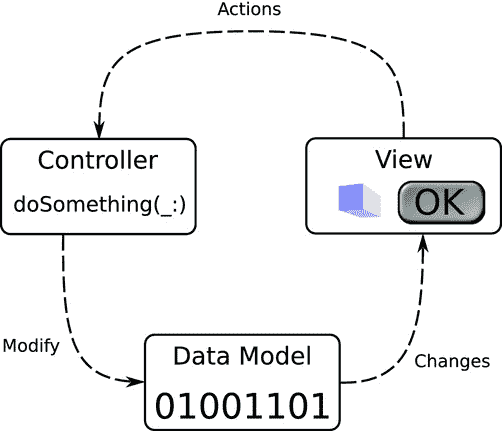

图 8-1。简单的 MVC 通信

在这种安排下，数据模型负责通知所有观察者变更。视图对象负责观察并显示这些变更，并向控制器对象发送操作。控制器对象执行操作，通常会对数据模型进行更改，然后整个循环重新开始。

与直觉相反，这种简化的安排只发生在相当复杂的应用中。大多数情况下，数据模型并未设置为发布通知，视图对象也不会直接观察变更。相反，控制器对象介入并承担起在数据模型更改时通知视图对象的责任，如图 8-2 所示。

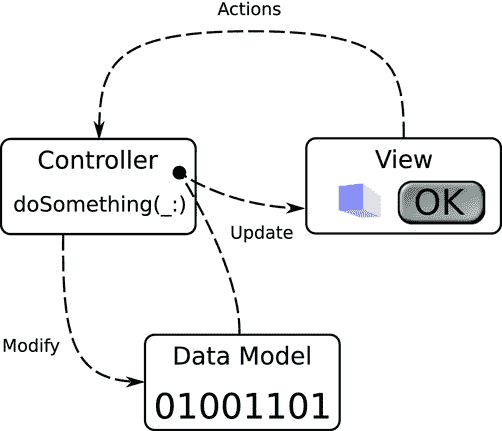

图 8-2。典型的 MVC 通信

现在你已经了解了 MVC 设计模式的基础知识，让我们再来开发一个 iOS 应用。我希望你关注对象的角色、它们的设计以及随着应用演进它们如何变化，而不是专注于某一特定的 iOS 技术（如运动事件或摄像头）。

### 颜色模型

你将开发一个名为 `ColorModel` 的新应用。这是一个允许你使用色相-饱和度-亮度（HSB）颜色模型选择颜色的应用。其初始设计很简单，如图 8-3 所示。界面由三个滑块组成，分别对应 HSB 的三个值，以及一个显示所选颜色的视图。

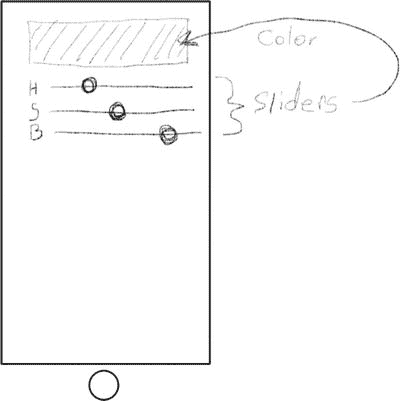

图 8-3。`ColorModel` 的初始设计


**注** 颜色模型或色彩空间是可见颜色的数学表示。有几种常见的模型适用于不同的应用场景。计算机显示器和电视使用红绿蓝（RGB）模型，艺术家喜欢使用色相-饱和度-亮度（HSB）模型，而打印机则使用青-品红-黄-黑（CMYK）模型。参见 `http://en.wikipedia.org/wiki/Color_model`。

首先启动 Xcode。按照以下步骤创建并配置一个新项目：

1.  使用“单视图应用程序”模板。
2.  将项目命名为 `ColorModel`。
3.  将语言设置为 Swift。
4.  将设备设置为 iPhone。
5.  创建项目。
6.  在 `ColorModel` 目标的“通用”选项卡中，取消勾选“横屏左”和“横屏右”方向，仅勾选“竖屏”方向。

### 创建你的数据模型

几乎所有应用程序的第一步（设计之后）就是开发你的数据模型。本应用中的数据模型非常简单：它只是一个包含色相、饱和度和亮度值的单一对象。它还将这些值转换为一个适用于显示和其他用途的颜色对象。首先，在你的项目中添加一个新的 Swift 源文件。从文件模板库中抓取一个 Swift 文件，并将其拖入项目的 `ColorModel` 组中。将新文件命名为 `Color`。用以下代码替换文件中的内容：

```
import UIKit

class Color {

var hue: Float = 0.0
    var saturation: Float = 0.0
    var brightness: Float = 0.0

var color: UIColor {
        return UIColor(hue: CGFloat(hue/360),
                saturation: CGFloat(saturation/100),
                brightness: CGFloat(brightness/100),
                     alpha: 1.0)
    }

}
```

现在你有了一个数据模型类。它的前三个属性是浮点值，分别对应颜色的色相、饱和度和亮度。色相以度为单位，范围在 0° 到 360° 之间。另外两个属性以百分比表示，范围在 0% 到 100% 之间。

最后一个属性是一个计算属性——这意味着它的值是通过计算得出的，而非存储的。它返回一个 `UIColor` 对象，该对象代表与当前 `hue`（色相）/`saturation`（饱和度）/`brightness`（亮度）三元组相同的颜色。

从色相-饱和度-亮度值到 `UIColor` 对象（顺便提一下，它使用红绿蓝模型）的转换，由 `UIColor` 类体贴地提供。我很庆幸。不同颜色模型之间转换有相应的公式，但涉及的数学计算比我想要解释的要多得多。

**注** 也可以将 `color` 属性设置为可写入；你只需要添加代码来更新 `hue`、`saturation` 和 `brightness` 的值以保持匹配。数据模型应该保持一致；如果 `color` 属性始终代表当前 `hue`、`saturation` 和 `brightness` 属性的颜色，那么更改 `color` 也应该更改 `hue`、`saturation` 和 `brightness`，使它们仍然保持一致。

然而，`UIColor` 用于表示色相、饱和度和亮度的值与你为数据模型选择的值（好吧，是我选择的）不同。在你的数据模型中，色相是介于 0.0 到 360.0 之间的 `Float` 值。`UIColor` 期望的是一个介于 0.0 到 1.0 之间的 `CGFloat` 值。同样，`UIColor` 的饱和度和亮度值也介于 0 到 1 之间。要在你的模型和 `UIColor` 使用的模型之间进行转换，你必须通过将值除以其范围来缩放，并从 `Float` 转换为 `CGFloat`。这就是数据模型对应用程序其余部分进行封装（隐藏）的细节。

数据模型完成后，是时候转向视图对象了。

### 创建视图对象

选择你的 `Main.storyboard` 界面构建器文件。在对象库中，找到纯视图对象并拖一个到你的界面中。调整其大小和位置，使其占据显示屏的顶部，如图 8-4 所示。这将是用户所选颜色显示的视图。

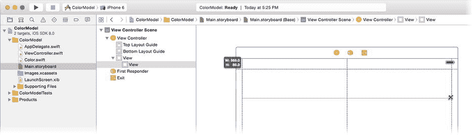

图 8-4. 添加一个简单的视图对象

选择新的视图对象，并点击“约束”控件。添加上边距（标准）、左边距（20）和右边距（20）约束，如图 8-5 所示。同时添加一个高度约束为 80 像素。

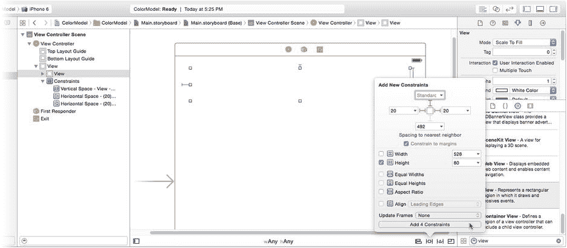

图 8-5. 设置视图对象约束

在库中找到标签对象，并拖一个到你的界面中。将其放置在视图对象左下角的正下方。将其标题设置为 `H`。在库中找到滑块对象，并拖一个到你的界面中，将其放置在颜色视图正下方、刚添加的标签右侧，如图 8-6 所示。

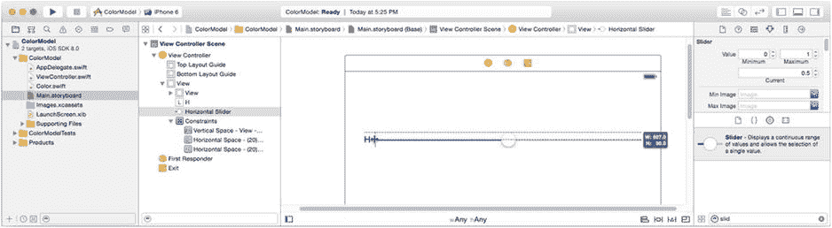

图 8-6. 添加第一个标签和滑块

对齐标签和滑块，使其垂直居中。调整滑块大小，使其从标签的右边缘延伸到视图的右边缘。

你还需要两对标签/滑块，所以让我们快速复制刚刚创建的那一对。同时选中标签和滑块视图（按住 Shift 键或拖出一个同时选中两者的选择矩形）。现在按下 Option 键。在按住 Option 键的同时，点击并向下拖动这对控件。Option 键会将拖拽操作变为复制操作。将这一对控件放在前一对的正下方，如图 8-7 所示，然后释放鼠标。

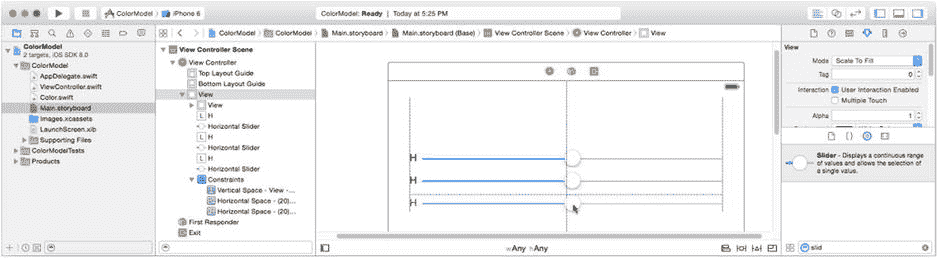

图 8-7. 复制标签和滑块

再次重复复制操作，直到你拥有三个标签和三个滑块控件。按住 Control 键/右键点击顶部的滑块，向下拖动到中间的滑块，释放，然后从约束菜单中选择“等宽”。重复此操作，拖动到底部滑块，如图 8-8 所示。这添加了约束以保持三个滑块控件宽度相同。

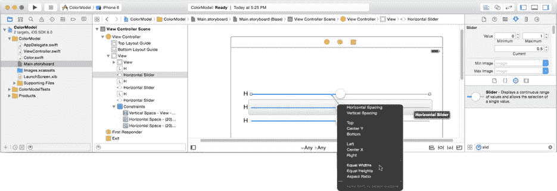

图 8-8. 约束滑块宽度

将第二个和第三个标签的标题分别重命名为 `S` 和 `B`。现在你拥有了所需的所有视图对象。通过从“解决自动布局问题”控件中选择“在视图控制器中添加缺少的约束”来完善约束。

在你的数据模型中，色相值的范围是 0° 到 360°，饱和度和亮度的范围是 0% 到 100%。更改三个滑块的值范围以匹配。选择顶部（色相）滑块，并使用属性检查器将其“最大值”从 1 更改为 360，如图 8-9 所示。将另外两个滑块的最大值更改为 100。

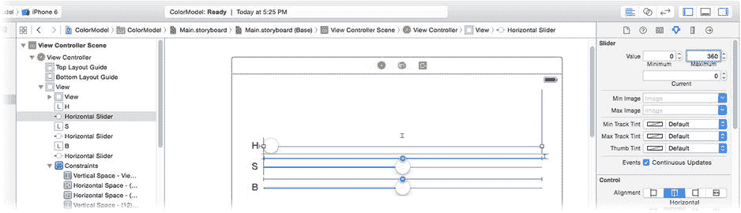

图 8-9. 设置滑块控件的值范围

### 编写你的控制器

Xcode 项目模板已经为你提供了一个控制器类；你只需要填充它即可。选择你的 `ViewController.swift` 接口文件。你的控制器将需要引用你的数据模型对象，以及用于连接界面的 Outlet 和 Action。首先，向你的 `ViewController` 类添加属性。

```
var colorModel = Color()
@IBOutlet var colorView: UIView!
```

第一个属性是你的控制器与数据模型的连接。第二个属性是一个 Outlet，你将把它连接到你的颜色视图。这将允许你的控制器更新视图中显示的颜色。

最后，你的控制器将需要三个 Action，每个滑块控件对应一个，它们将调整数据模型中的一个值。仍在你的 `ViewController.swift` 文件中，添加以下三个函数：


```swift
@IBAction func changeHue(sender: AnyObject!) {
    if let slider = sender as? UISlider {
        colorModel.hue = slider.value
        colorView.backgroundColor = colorModel.color
    }
}

@IBAction func changeSaturation(sender: AnyObject!) {
    if let slider = sender as? UISlider {
        colorModel.saturation = slider.value
        colorView.backgroundColor = colorModel.color
    }
}

@IBAction func changeBrightness(sender: AnyObject!) {
    if let slider = sender as? UISlider {
        colorModel.brightness = slider.value
        colorView.backgroundColor = colorModel.color
    }
}
```

每当滑块控件发生变化时，每个动作消息都会从其中一个滑块接收。每个方法只是用滑块的新值修改数据模型中对应的值，然后更新颜色视图以反映数据模型中的新颜色。在这一实现中，每当数据模型发生变化时，控制器负责更新视图（参见图 8-2）。

### 连接界面

最后一步是将控制器的 outlet 和 action 连接到视图对象。再次选择 `Main.storyboard` 界面构建器文件。选择视图控制器对象，使用连接检查器将控制器的 `colorView` outlet 连接到 `UIView` 对象，如图 8-10 所示。

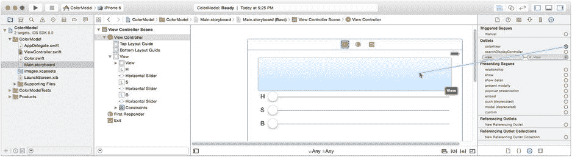

图 8-10. 连接 `colorView` outlet

现在将三个滑块的 action 连接到控制器的 `changeHue(_:)`、`changeSaturation(_:)` 和 `changeBrightness(_:)` 函数。选择顶部滑块，使用连接检查器将 `Value Changed` 事件连接到控制器的 `changedHue:` action。重复此操作，将中间滑块连接到 `changeSaturation:` action，底部滑块连接到 `changeBrightness:` action，如图 8-11 所示。

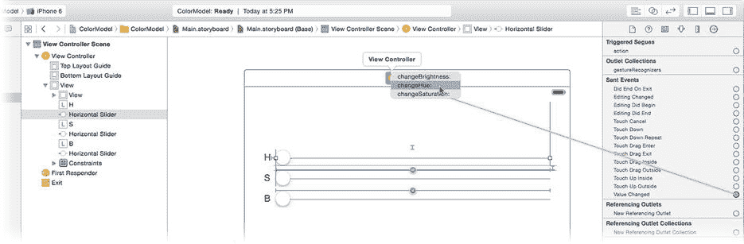

图 8-11. 连接滑块动作

**提示** 你也可以通过按住 Control 键或右键单击滑块并拖动到控制器来建立这些连接。这是因为 `Value Changed` 事件是连接动作时控制对象的默认事件。

还有一个最后的美观细节需要处理。数据模型中的 `hue`、`saturation` 和 `brightness` 值都初始化为 0.0（黑色）。颜色视图中的默认颜色不是黑色，而滑块的初始位置都是 0.5。为了让视图对象从一开始就与数据模型保持一致，选择滑块并使用属性检查器将 Current 属性设置为 0.0。选择颜色视图对象，将其背景属性设置为 Black Color，如图 8-12 所示。

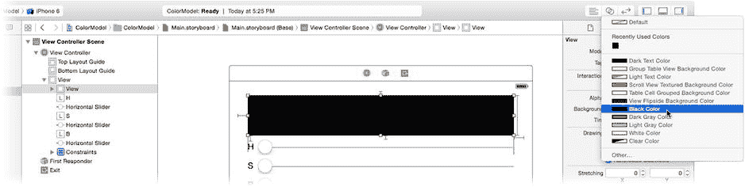

图 8-12. 完成后的 `ColorModel` 界面

在 iPhone 模拟器中运行你的应用。应用显示为黑色，三个滑块都设为最小值。改变滑块的值，探索色调、饱和度和亮度的不同组合，如图 8-13 右侧所示。

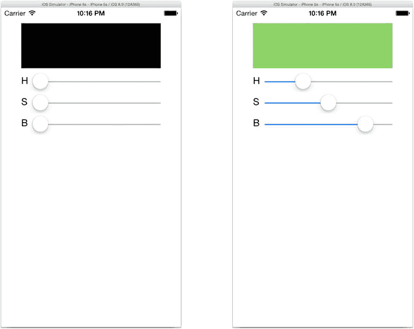

图 8-13. 第一个 `ColorModel` 应用

### 拥有多个视图

MVC 设计模式将数据模型与视图对象分离的一个原因是为了避免两者之间的一对一关系。通过 MVC，你可以在数据模型和视图对象之间创建一对多甚至多对多的关系。通过创建更多以不同方式显示相同数据模型的视图对象来利用这一点。（你可以在 `Learn iOS Development Projects`  `Ch 8`  `ColorModel-2`  `ColorModel` 文件夹中找到该版本的项目。）

首先选择你的 `Main.storyboard` 界面构建器文件。使用右侧调整大小手柄，使三个滑块的宽度显著缩短。你需要临时腾出空间，以便在它们右侧添加新的视图对象，如图 8-14 所示。

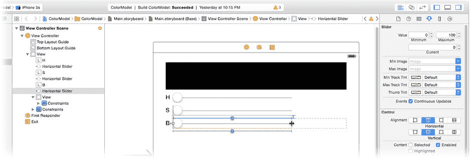

图 8-14. 为新的视图对象腾出空间

在库中找到标签对象，添加三个新标签，每个滑块右侧，并与颜色视图的右边缘对齐，如图 8-15 所示。

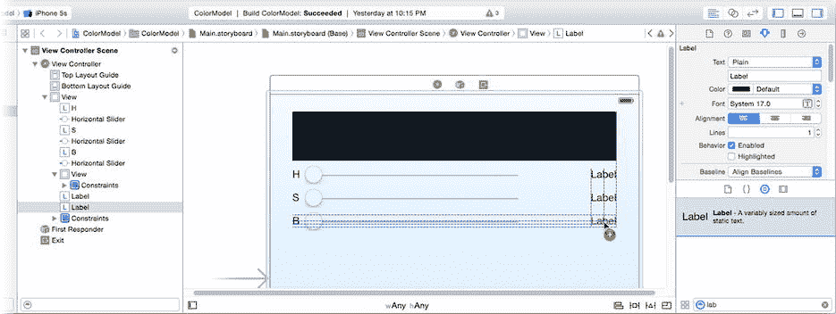

图 8-15. 添加 HSB 数值标签

每个标签将显示一个属性的文本值。通过属性检查器或双击标签对象来编辑三个标签的文本属性。将顶部标签改为 360°（按 Shift+Option+8 输入度数符号），其余两个改为 100%，如图 8-16 所示。

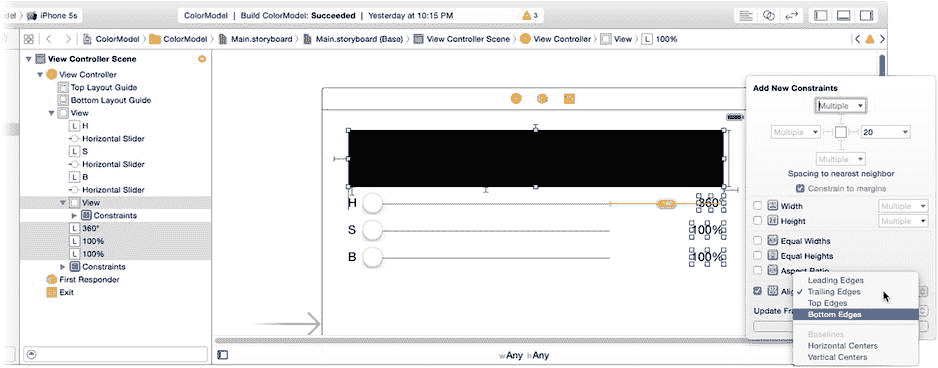

图 8-16. 为标签添加右对齐约束

现在创建一些约束来使标签右对齐。选择所有三个新标签及其上方的视图对象。点击 pin 约束控件并添加一个右边缘对齐约束，同样如图 8-16 所示。这将添加三个新约束，使标签的右边缘与颜色视图的右边缘水平对齐。

为了垂直定位标签，选择“H”标签和“360”标签，点击 pin 约束控件并添加一个顶部边缘对齐约束。对“S”和“100%”对以及“B”和“100%”对重复此操作。现在右侧的三个标签将与左侧标签的垂直位置匹配。你也可以将它们居中于滑块，或添加与左侧标签相同的垂直间距约束。有无数种约束组合可以创建相同的布局。选择对你有意义的那一种。

选择顶部滑块。选择 Xcode 创建的右边缘约束，位于滑块右侧，如图 8-17 所示。使用属性检查器将其值设置为 -60。这将修改约束，使得顶部滑块的右边缘现在从颜色视图的右边缘向内缩进 60 像素，为刚刚添加的标签留出空间。

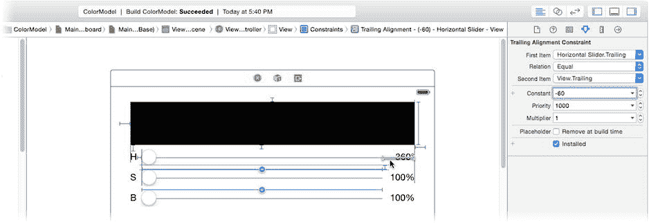

图 8-17. 调整滑块约束

**注意** 你是否注意到，通过为第二和第三个滑块添加等宽约束（而不是简单地为三个滑块设置相同的右边缘约束），你为自己减少了工作量？通过使滑块的宽度相互依赖，你只需修改一个滑块的宽度，其他滑块就会自动对齐。

你将需要 outlet 来使用这三个标签，因此将它们添加到你的 `ViewController.swift` 文件中：

```swift
@IBOutlet var hueLabel: UILabel!
@IBOutlet var saturationLabel: UILabel!
@IBOutlet var brightnessLabel: UILabel!
```


在 Interface Builder 中连接这三个插座。切换回 `Main.storyboard` 文件，选择视图控制器，然后使用连接检查器将这些插座连接到它们各自的 `UILabel` 对象。

切换回 `ViewController.swift` 文件，并通过添加以下加粗代码来修改这三个操作，使每个操作也更新其各自的标签视图：

```
@IBAction func changeHue(sender: AnyObject!) {
    if let slider = sender as? UISlider {
        colorModel.hue = slider.value
        colorView.backgroundColor = colorModel.color
        hueLabel.text = NSString(format: "%.0f°", colorModel.hue)
    }
}

@IBAction func changeSaturation(sender: AnyObject!) {
    if let slider = sender as? UISlider {
        colorModel.saturation = slider.value
        colorView.backgroundColor = colorModel.color
        saturationLabel.text = NSString(format: "%.0f%%", 
                                                colorModel.saturation)
    }
}

@IBAction func changeBrightness(sender: AnyObject!) {
    if let slider = sender as? UISlider {
        colorModel.brightness = slider.value
        colorView.backgroundColor = colorModel.color
        brightnessLabel.text = NSString(format: "%.0f%%", 
                                                colorModel.brightness)
    }
}
```

这三个新语句更改了标签字段中的文本，以显示每个属性的文本值。格式说明符 `%.0f` 将数据模型的浮点值四舍五入到最接近的整数。字面翻译过来，意思是“格式化（`%`）浮点值（`f`），使其小数点右侧有零（`.0`）位数字”。

**注意**：转义序列 `%%` 表示一个单独的 `%` 字符。格式字符串说明符以 `%` 开头（例如 `%u` 或 `%02x`）。要在格式字符串中包含一个单独的百分号字符，请使用 `%%`。

现在再次运行你的应用。这次，当你调整任何一个滑块的值时，颜色和文本形式的 HSB 值都会同时更新，如图 8-18 所示。

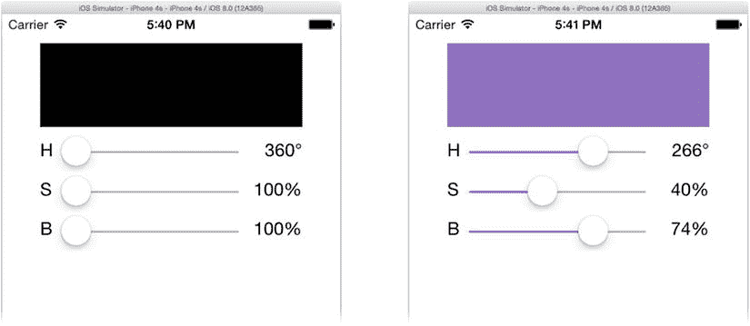

图 8-18. 带有 HSB 值的 ColorModel

MVC 设计模式的优势之一是数据模型对象不与它们的视图对象耦合。如果你想在第二个视图中显示相同的数据模型信息，或者想以三种不同的方式显示相同的信息，只需添加适当的视图对象即可。数据模型从不改变。让我们添加另一种显示颜色的方式，看看这将如何影响你的设计。

#### 整合更新

现在，你的数据模型以不同的形式出现在四个不同的视图中。但为什么要止步于此呢？在 `Main.storyboard` 文件中（你现在正在 `ColorModel-3` 文件夹中的项目上工作），再添加两个标签。将其中一个的文本设置为 `#000000`，另一个设置为 `Web:`。按图 8-19 所示放置它们。从“解决自动布局问题”控件中选择“在视图控制器中添加缺少的约束”。

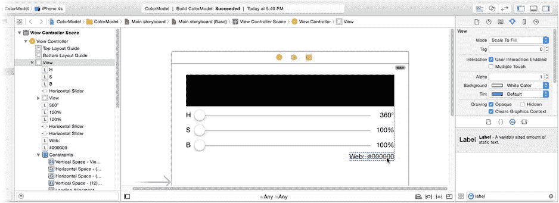

图 8-19. 添加 web 安全颜色视图

你将使用这个标签来显示所选的“web”颜色。这是所选颜色的 RGB 值，作为一个 HTML 短颜色常量。你应该能够闭着眼睛完成接下来的两个步骤。将以下插座属性添加到 `ViewController.swift`：

```
@IBOutlet var webLabel: UILabel!
```

切换回 `Main.storyboard` 并将 `webLabel` 插座连接到 `#000000` 标签对象，如图 8-20 所示。

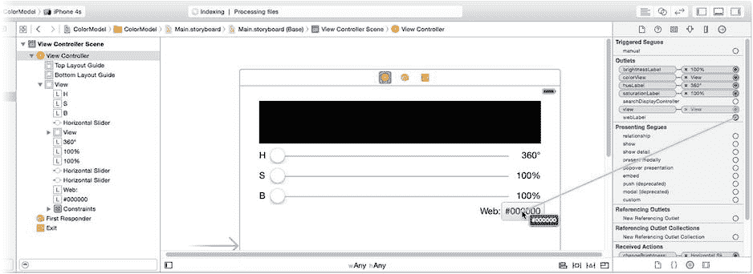

图 8-20. 连接 webLabel 插座

现在返回 `ViewController.swift` 文件并考虑需要更改什么。以下是将 `webLabel` 视图设置为显示颜色十六进制值的代码：

```
var red: CGFloat = 0.0
var green: CGFloat = 0.0
var blue: CGFloat = 0.0
var alpha: CGFloat = 0.0
color.getRed(&red, green: &green, blue: &blue, alpha: &alpha)
webLabel.text = NSString(format: "#%02X%02X%02X", 
                        CInt(red*255),CInt(green*255),CInt(blue*255))
```

这段代码从 `UIColor` 对象中提取单独的红色、绿色和蓝色值。然后使用这些值（范围在 0.0 到 1.0 之间）创建一个由六个十六进制数字组成的字符串，每种颜色两个数字，范围在 00 到 ff 之间，向下取整到最接近的整数。

虽然代码不多，但需要重复三次，因为每个操作方法（`changeHue(_:)`、`changeSaturation(_:)`、`changeBrightness(_:)`）都必须更新新的 web 值视图。

有一条古老的编程格言说：

*如果你在重复自己，那就重构。*

这意味着如果你发现自己一次又一次地编写相同的代码，很可能是一个重新组织和整合代码的好时机。这是一个不言自明的道理：你写的代码越多，引入错误的机会就越大。软件工程师的一个共同目标是尽量减少他们编写的代码量——不仅仅是因为他们懒惰（至少，我们很多人都是），而是因为它能产生更简洁的解决方案。

将对各种视图对象的更新整合到一个名为 `updateColor()` 的函数中。将三个操作方法中更新颜色视图的代码替换为对这个新函数的调用（修改后的代码以粗体显示）。

```
@IBAction func changeHue(sender: AnyObject!) {
    if let slider = sender as? UISlider {
        colorModel.hue = slider.value
        updateColor()
    }
}

@IBAction func changeSaturation(sender: AnyObject!) {
    if let slider = sender as? UISlider {
        colorModel.saturation = slider.value
        updateColor()
    }
}

@IBAction func changeBrightness(sender: AnyObject!) {
    if let slider = sender as? UISlider {
        colorModel.brightness = slider.value
        updateColor()
    }
}
```

最后，编写 `updateColor()` 函数。

```
func updateColor() {
    let color = colorModel.color
    colorView.backgroundColor = color
    hueLabel.text = "\(Int(colorModel.hue))°"
    saturationLabel.text = "\(Int(colorModel.saturation))%"
    brightnessLabel.text = "\(Int(colorModel.brightness))%"
    var red: CGFloat = 0.0
    var green: CGFloat = 0.0
    var blue: CGFloat = 0.0
    var alpha: CGFloat = 0.0
    color.getRed(&red, green: &green, blue: &blue, alpha: &alpha)
    webLabel.text = NSString(format: "#%02X%02X%02X",
                        CInt(red*255),CInt(green*255),CInt(blue*255))
}
```

第一行更新颜色视图对象的背景颜色，这项任务之前在每个操作中都有重复。接下来的三个语句更新三个 HSB 标签视图，剩余的代码计算十六进制 RGB 值并更新 `webLabel`。

再次运行你的应用，如图 8-21 所示。对数据模型的每次更改都会更新五个不同的视图对象，并且你的控制器代码可以说比以前更简单、更易于维护。你可以轻松添加更新数据模型的新操作；你所需要做的就是在返回前调用 `updateColor()`。类似地，可以添加新的视图对象，你只需要添加一个插座并修改 `updateColor()`。

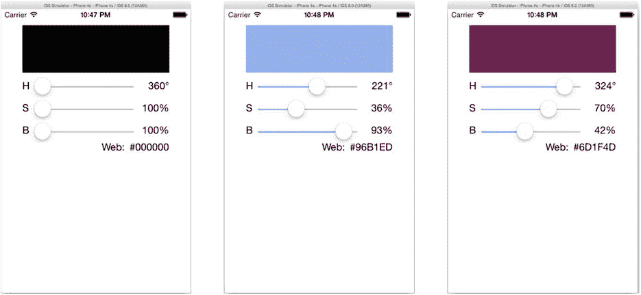

图 8-21. 带有 web 值的 ColorModel

#### 复杂视图对象

到目前为止，你在 ColorModel 中使用的视图对象显示的是相对简单的（`String` 或 `UIColor`）值。有时视图对象显示的数据类型要复杂得多。复杂的视图对象维护对数据模型的引用并不罕见。这使它们能够直接访问它们所需的所有信息。


