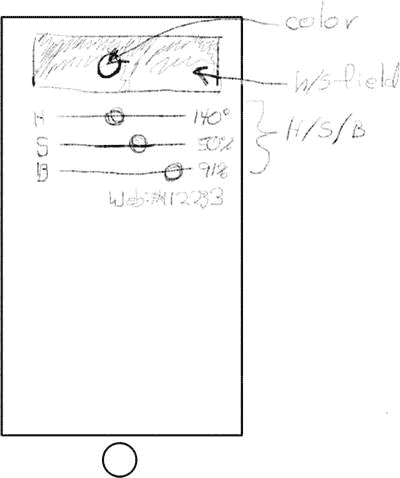
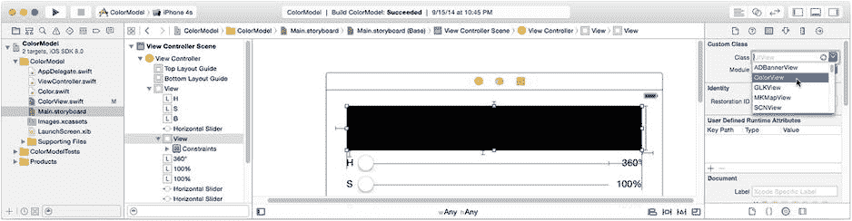
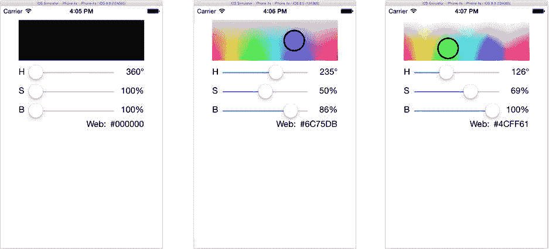

# 为了让 `ColorModel` 更有趣一些，你将用一个能显示色相/饱和度色彩图的自定义视图对象替换简单的 `UIView` 对象，此外，这个自定义视图还能标示出色相、饱和度和亮度滑块所选的具体颜色。修改你的设计后，新应用的外观应如图 图 8-22 所示。



图 8-22. 更新后的 `ColorModel` 设计

### 用 `ColorView` 替换 `UIView`

你的新设计将用自定义的 `ColorView` 对象替换当前设计中的 `UIView` 对象。首先，向项目中添加一个新的 Swift 类。从文件模板库中拖入一个新的 Swift 文件，并将其命名为 `ColorView`。（或者，你也可以从 `Learn iOS Development Projects`  `Ch 8`  `ColorModel-4`  `ColorModel` 文件夹中直接拖入已经完成的 `ColorView.swift` 文件。）

如果你是从头开始创建，请在新文件中定义该类的基本框架，以便 Interface Builder 知道它的存在。

```swift
import UIKit

class ColorView : UIView {
}
```

将界面中的普通视图从 `UIImage` 对象升级为新的 `ColorView` 对象。在 `Main.storyboard` 中，选中 `UIImage` 视图对象。使用标识检查器将该对象的类从 `UIView` 更改为 `ColorView`，如 图 8-23 所示。



图 8-23. 将 `UIView` 更改为 `ColorView`

在你的 `ViewController.swift` 文件中，找到引用此对象的 `colorView` 属性。将 `colorView` 属性的类型从 `UIView` 更改为 `ColorView`（修改后的代码以粗体显示）。现在，你的控制器连接到了一个 `ColorView` 对象。

```swift
@IBOutlet var colorView: ColorView!
```

### 将视图连接到数据模型

你漂亮的新 `ColorView` 对象将与其数据模型（`Color` 对象）直接相连。在 `ColorView.swift` 文件中添加该属性。

```swift
var colorModel: Color?
```

**注意** `colorModel` 属性不是 Interface Builder 的出口（`IBOutlet`），因为你将通过编程方式而非在 Interface Builder 中设置此属性。这并不是说它不能作为出口；只是对于这个项目来说没有必要。

### 绘制 `ColorView`

仍然在 `ColorView.swift` 文件中，你将添加一个 `drawRect(_:)` 函数，用于在当前亮度级别绘制一个二维的色相/饱和度色彩图。在色彩图中代表当前色相/饱和度的位置，视图会绘制一个以该颜色填充的圆圈。

这段代码量不小，而且不是本章的重点，因此我将略过细节。你需要添加到 `ColorView.swift` 中的 `drawRect(_:)` 函数的代码见代码清单 8-1。如果你是在阅读本章的同时编写此应用，我为你鼓掌。如果不是，并且你之前没有导入完整的 `ColorView.swift` 文件，那么至少为了省去大量打字工作，请从 `Learn iOS Development Projects`  `Ch 8`  `ColorModel-4`  `ColorModel` 文件夹中的 `ColorView.swift` 文件里复制 `drawRect(_:)` 函数的代码。

***代码清单 8-1***. `ColorView.swift` 中的 `drawRect(_:)` 函数

```swift
override func drawRect(rect: CGRect) {
    if let color = colorModel {
        let bounds = self.bounds
        if hsImage != nil && ( brightness != color.brightness || 
                               bounds.size != hsImage!.size ) {
            hsImage = nil
        }

        if hsImage == nil {
            brightness = color.brightness
            UIGraphicsBeginImageContextWithOptions(bounds.size, true, 1.0)
            let imageContext = UIGraphicsGetCurrentContext()
            for y in 0..<Int(bounds.height) {
                for x in 0..<Int(bounds.width) {
                    let uiColor = UIColor(hue: CGFloat(x)/bounds.width,
                                   saturation: CGFloat(y)/bounds.height,
                                   brightness: CGFloat(brightness/100.0),
                                        alpha: 1.0)
                    uiColor.set()
                    CGContextFillRect(imageContext, CGRect(x: x, y: y, width: 1, height: 1))
                }
            }
            hsImage = UIGraphicsGetImageFromCurrentImageContext()
            UIGraphicsEndImageContext()
        }

        hsImage!.drawInRect(bounds)

        let circleRect = CGRect(x: bounds.maxX*CGFloat(color.hue/360)-radius/2,
                                y: bounds.maxY*CGFloat(color.saturation/100)-radius/2,
                            width: radius,
                           height: radius)
        let circle = UIBezierPath(ovalInRect: circleRect)
        color.color.setFill()
        circle.fill()
        circle.lineWidth = 3.0
        UIColor.blackColor().setStroke()
        circle.stroke()
    }
}
```

简而言之，`ColorView` 会在当前亮度级别绘制一个二维的色相/饱和度组合图。（当 iOS 设备推出 3D 显示屏时，你可以修改此代码来绘制 3D 图像！）

（本章的）重点是 `ColorValue` 直接引用了 `Color` 数据模型对象，因此你的控制器不再需要显式地使用新颜色值来更新它。控制器需要做的只是告诉 `ColorView` 对象何时需要重绘；`ColorView` 将直接使用数据模型来获取绘制自身所需的任何信息。

为了实现这一点，你的控制器需要在创建数据模型和视图对象时建立这个连接。在你的 `ViewController.swift` 文件中，找到 `viewDidLoad()` 函数，并添加这一行粗体代码：

```swift
override func viewDidLoad() {
    super.viewDidLoad()
    colorView.colorModel = colorModel
}
```

当视图对象被创建时（当 Interface Builder 文件加载时），控制器会创建数据模型对象并将其连接到 `colorView` 对象。

现在，将你之前用来设置绘制颜色（通过 `colorView` 的 `backgroundColor` 属性）的代码替换为仅告知 `colorView` 对象需要重绘自身的代码，如下面粗体所示。

```swift
func updateColor() {
    colorView.setNeedsDisplay()
    let color = colorModel.color
    ...
```

运行你的新应用并尝试一下。这会是一个更加有趣的界面，如图 图 8-24 所示。



图 8-24. 使用 `ColorView` 的 `ColorModel`

这个版本的应用代表了 MVC 模式更高级的用法。现在，你不再是将简单的值“喂”给视图对象，而是有一个能够理解你的数据模型并直接获取所需值的视图对象。但是，控制器仍然必须在更改数据模型时记得刷新所有视图。让我们换一种方式，让数据模型在发生变化时通知控制器。

### 成为一个敏锐的观察者


