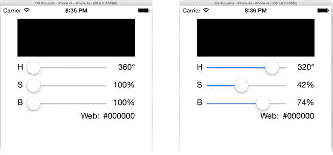
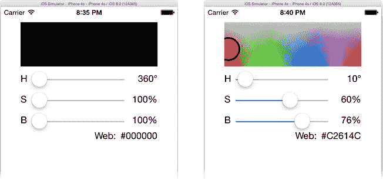
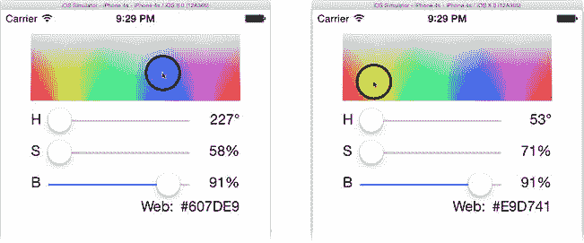

# 回顾"MVC 通信"章节

在之前的"MVC 通信"章节中，我描述了一个简单的架构：数据模型向视图对象发送通知（参见图 8-1），告知它们何时需要更新显示。你在`MyStuff`应用中已经实现了这一点——在`MyWhatsit`类中添加了`postDidChangeNotification()`方法。该方法会通知所有感兴趣的监听者：数据模型中的某个条目发生了变化。你的表视图控制器则监听这些通知，并在必要时重新绘制表格。

使用`NSNotificationCenter`将数据模型的变化通知给视图——这是 MVC 通信的*绝佳*范例。请将它纳入你的"iOS 解决方案锦囊"中。此处不再赘述这一方案，而是向你展示一种更精妙的数据模型变更观察方法。

### 键值观察

我曾说过，设计模式在 iOS 中根深蒂固。现在你将见证究竟有多深。MVC 通信部分地基于观察者模式。*观察者模式*是一种设计模式：当一个对象（主体）中发生某种事件时，另一个对象（观察者）会收到消息。在 MVC 中，数据模型（主体）在每次发生变更时通知视图或控制器对象（观察者）。这样一来，控制器无需在修改数据模型时还要记得更新视图对象（即调用`updateColor()`）。现在，控制器——或任何其他对象——可以随意更改数据模型；任何变更都会向观察者发送通知。

在`MyStuff`中，你通过`NSNotification`对象实现了这一功能。而在`ColorModel`中，你将使用一种名为*键值观察*（KVO）的 Cocoa Touch 魔法。KVO 是一种在对象属性被赋值时自动通知观察者的技术。没错，你只需要设置属性值，任何观察该属性的对象就会自动收到通知。

### 观察键值变化

在 Swift 对象中观察属性变化需要三个步骤：

1.  确保你的属性是可观察的。
2.  成为该属性（由*键*标识）的观察者。
3.  实现`observeValueForKeyPath(_:, ofObject:, change:, context:)`函数。

第一步是让`Color`类符合 KVO 的要求。（你可以在`Learn iOS Development Projects` → `Ch 8` → `ColorModel-5` → `ColorModel`文件夹中找到完成的项目。）切换到`Color.swift`文件，对类进行如下修改（新代码加粗显示）：

```swift
class Color: NSObject {
    dynamic var hue: Float = 0.0
    dynamic var saturation: Float = 0.0
    dynamic var brightness: Float = 0.0
```

如果你想知道为何需要做这些修改，请参阅边栏"Swift 与 KVO"。

### Swift 与 KVO

键值观察依赖于动态派发方法。通俗地说，当你调用对象的实例方法时，CPU 要么直接跳转到对应代码（*静态调用*），要么由调用者查询对象并询问应运行代码的地址（*动态派发*）。后者更为灵活，因为对象可以在方法被调用时动态改变执行的代码。在 Swift 的前身 Objective-C 中，所有方法和属性都是动态派发的。

动态派发方法的缺点是性能问题。每次调用方法或访问属性时，都需要询问"方法 X 应执行哪段代码？"并得到回答，这需要时间。Swift 在可能的情况下倾向于使用静态派发，这也是它通常比 Objective-C 更快的原因。问题在于，像 KVO 这样依赖动态派发的技术，无法与静态调用的函数兼容。

但这并不意味着 Swift 无法使用动态派发方法。实际上，Swift 一直在使用它们。Swift 也能与任何使用动态派发方法的 Objective-C 对象兼容。要在 Swift 对象中使用 KVO，你只需让 Swift 在你感兴趣的属性和方法上启用动态派发。

第一步是让你的类继承自`NSObject`。`NSObject`是所有 Objective-C 类的基类（Swift 没有公共基类）。通过将对象设为`NSObject`的子类，你实际上将其转变为 Objective-C 类，而非纯 Swift 类。这对你应用的其余部分几乎无影响；如前所述，Swift 使用 Objective-C 对象就像使用原生 Swift 对象一样轻松。事实上，它甚至不会给你的对象带来太多改变。但一个重要副作用是：它继承了`NSObject`中定义的所有标准 KVO 方法。

第二步是告诉 Swift 在你想要观察的属性上专门使用动态派发。这通过`dynamic`关键字实现。在`var`或`func`前加上`dynamic`，即告诉 Swift 你希望该属性或函数始终使用动态派发。在底层，动态属性会创建两个隐藏函数（均为动态派发）：一个用于获取值的*getter*函数，和一个用于修改值的*setter*函数。KVO 正是通过拦截这个 setter 函数来施展其魔法。

老实说，我不知道 KVO 在 Swift 中的未来会如何。截至本书撰写时，Swift 仍处于 1.0 版本，且仍在持续开发中。Swift 官方文档对 KVO 的描述仅为"待定"。你仍然可以通过利用 Swift 对 Objective-C 的支持（后者原生支持 KVO 及类似技术）在 Swift 项目中使用 KVO。但我无法预测 KVO 与原生 Swift 类的命运。Swift 追求高效与特性的力量之间存在着天然博弈。我衷心希望苹果能找到在 Swift 中高效支持 KVO 的方法——祈祷吧。

第二步相当简单。在你的`ViewController.swift`文件中，找到`viewDidLoad()`函数，修改以下代码，将新代码加粗显示：

```swift
super.viewDidLoad()
colorModel.addObserver(self, forKeyPath: "hue",         options: .allZeros, context: nil)
colorModel.addObserver(self, forKeyPath: "saturation",  options: .allZeros, context: nil)
colorModel.addObserver(self, forKeyPath: "brightness",  options: .allZeros, context: nil)
colorModel.addObserver(self, forKeyPath: "color",       options: .allZeros, context: nil)
colorView.colorModel = colorModel
```

每一条语句都将你的`ViewController`对象（`self`）注册为接收对象（`colorModel`）某个属性（键路径）的观察者。

此后，每当`colorModel`中被观察的属性发生变化，你的控制器就会收到`observeValueForKeyPath(_:, ofObject:, change:, context:)`调用。第一个参数标识了`ofObject`参数上发生变化的属性。利用这些参数判断变化内容并采取相应操作。

你的新`observeValueForKeyPath(_:, ofObject:, change:, context:)`函数将取代旧的`updateColor()`函数，因为它们功能相同。将`updateColor()`替换为代码清单 8-2 中的代码。加粗部分表示新增内容。

**代码清单 8-2**. `observeValueForKeyPath(_:, ofObject:, change:, context:)`


```swift
override func observeValueForKeyPath(keyPath: String!, ofObject object: AnyObject!, 
                 change: [NSObject : AnyObject]!, context: UnsafeMutablePointer<Void>) {
    switch keyPath {
        case "hue":
            hueLabel.text = "\(Int(colorModel.hue))°"
        case "saturation":
            saturationLabel.text = "\(Int(colorModel.saturation))%"
        case "brightness":
            brightnessLabel.text = "\(Int(colorModel.brightness))%"
        case "color":
            colorView.setNeedsDisplay()
            var red: CGFloat = 0, green: CGFloat = 0, blue: CGFloat = 0, alpha: CGFloat = 0
            colorModel.color.getRed(&red, green: &green, blue: &blue, alpha: &alpha)
            webLabel.text = NSString(format: "#%02X%02X%02X",
                                            CInt(red*255),CInt(green*255),CInt(blue*255))
        default:
            break
    }
}
```

这段代码很直观。它检查 `keyPath` 参数是否与您预期会更改的属性名称之一匹配。每个 `case` 都会更新受该属性变化影响的视图对象。

现在您可以移除所有对 `updateColor()` 的引用。您的 `changeHue(_:)` 函数将如下所示：

```swift
@IBAction func changeHue(sender: AnyObject!) {
    if let slider = sender as? UISlider {
        colorModel.hue = slider.value
    }
}
```

任何修改数据模型属性的方法都不再需要手动更新视图，因为每当属性发生变化时，数据模型对象会自动通知您的控制器。运行您的应用来试试，如图 图 8-25 所示。



图 8-25. 有缺陷的 KVO

部分功能可以工作，但显然有些地方不对劲。让我们思考一下这个问题。

### 创建 KVO 依赖关系

您的控制器正在接收 `hue`、`saturation` 和 `brightness` 属性的变化通知，因为三个标签对象得到了更新。然而，`colorView` 和 `webLabel` 对象从未变化。您的控制器没有收到 `color` 属性的变化通知。

这是因为没有任何东西会改变 `color` 属性。（它甚至不允许被改变，因为它是一个不可变属性。）问题在于 `color` 是一个合成属性值：您编写的代码基于 `hue`、`saturation` 和 `brightness` 的值生成 `color` 值。Swift 和 iOS 并不知道这一点。它们只知道没有人设置过 `color` 属性（`colorModel.color = newColor`），因此它永远不会发送任何通知。

有两种直接的方法可以解决这个问题。第一种是在控制器中添加代码，使其在收到其他三个属性（`hue`、`saturation` 或 `brightness`）中任何一个发生变化的通知时，更新与 `color` 相关的视图。这是一个完全可接受的解决方案，但还有另一种选择。

您可以让 KVO 系统了解某个属性（*派生键*）受到其他属性（其*依赖键*）变化的影响。打开您的 `Color.swift` 文件并添加这个特殊的类函数：

```swift
class func keyPathsForValuesAffectingColor() -> NSSet {
    return NSSet(array: ["hue", "saturation", "brightness"])
}
```

现在重新运行您的应用，看看这一个函数带来的差异（见图 图 8-26）。



图 8-26. 正常工作下的 KVO 更新

那么，这是怎么回事？特殊的类函数 `keyPathsForValuesAffectingColor()`² 告诉 KVO 系统，有三个属性（键路径）会影响 `color` 属性的值：`hue`、`saturation` 和 `brightness`。现在，每当 KVO 机制检测到前三个属性中的任何一个发生变化时，它就知道 `color` 也发生了变化，并会为 `"color"` 键路径发送第二个通知。


**提示** KVO 非常灵活，有多种描述依赖键的方式。你还可以编写代码精确决定何时发送何种属性变更通知，以及这些通知应包含哪些信息。如需更深入的说明，请查阅 Xcode 文档与 API 参考中的*键值观察编程指南*。

我相信你会觉得这很酷，但你可能也认为这并不比你在上一节中编写的 `updateColor()` 函数省力多少。你说的没错，确实如此。但这也因为你所有的数据模型变更都来自同一个源头（滑块控件），并且修改数据模型的地方相对较少。然而，一旦情况发生变化，这就完全是另一回事了。

### 多向量数据模型变更

随着应用逐渐成熟，它很可能会变得更加复杂，数据模型的变更也可能发生在更多地方。KVO 的精妙之处在于，变更通知与变更本身发生在同一位置——即数据模型中。

当只有三个滑块操作能改变颜色时，调用 `changeColor()` 是可行的。但如果你新增了第四个也能改变颜色的控件视图对象呢——或者五个、九个呢？

举个例子。你应用中的滑块固然不错，但它们实在是太……二十世纪了。我们生活在触控界面的时代。直接触摸色相/饱和度图表，指向你想要的颜色，难道不是更棒吗？让我们来实现它。

### 处理触摸事件

你应该已经知道如何实现这一点——除非你跳过了第 4 章。如果是这样，请回去现在阅读。为你的自定义 `ColorView` 类添加触摸事件处理方法。这些方法将利用颜色图表内的坐标来选择新的 `hue`（色相）和 `saturation`（饱和度）。既然你知道该怎么做，那就先在 `ColorView.swift` 中添加三个触摸事件处理方法吧。（你可以在 `Learn iOS Development Projects`  `Ch 8`  `ColorModel-6`  `ColorModel` 文件夹中找到完成的项目。）

```
override func touchesBegan(touches: NSSet, withEvent event: UIEvent) {
    changeColorTo(touch: touches.anyObject() as? UITouch)
}

override func touchesMoved(touches: NSSet, withEvent event: UIEvent) {
    changeColorTo(touch: touches.anyObject() as? UITouch)
}

override func touchesEnded(touches: NSSet, withEvent event: UIEvent) {
    changeColorTo(touch: touches.anyObject() as? UITouch)
}
```

这三个处理器会捕获所有触摸开始、移动和结束事件；提取出单个触摸对象，并将其传递给 `changeColorTo(touch:)` 函数。

**注意**  请记住，默认情况下，视图对象的 `multipleTouchEnabled` 属性为 `false`，这意味着即使你的用户用多根手指触摸视图，其触摸事件处理方法在 `touches` 参数中也只会接收到一个触摸对象。

显然，核心操作都在 `changeColorTo(touch:)` 函数中。将这两个函数添加到你的类中：

```
func changeColorTo(# touch: UITouch? ) {
    if let contact = touch {
        changeColorTo(point: contact.locationInView(self))
    }
}

func changeColorTo(# point: CGPoint ) {
    if let color = colorModel {
        let bounds = self.bounds
        if bounds.contains(point) {
            color.hue = Float((point.x-bounds.minX)/bounds.width*360)
            color.saturation = Float((point.y-bounds.minY)/bounds.height*100)
        }
    }
}
```

`changeColorTo(touch:)` 函数只是简单地检查是否存在可用的 `UITouch` 对象。如果存在，它会提取触摸在颜色视图坐标系中的位置，并将其传递给 `changeColorTo(point:)`。

`changeColorTo(point:)` 函数执行实际工作。它将本地坐标转换为视图中该位置的色相和饱和度，并使用这些值更新数据模型。

请注意，它只需完成这些工作。它并没有向控制器发送动作消息。它本来可以这样做——那也是一种完全合理的实现。但由于你使用了 KVO，所以无需如此。任何对象都可以直接修改数据模型，所有观察者都会收到必要的通知。

试试看。运行你的应用。将亮度滑块从 0% 移开，然后用你的手指（或鼠标）在颜色图表内拖动。当你拖动手指时，色相和饱和度会随之改变，如图 8-27 所示。



图 8-27. 将 ColorView 转变为控件

### 绑定滑块

唯一不正常的是，当你触摸颜色视图时，色相和饱和度滑块不会移动。这是因为它们仍然仅作为输入。到目前为止，改变色相和饱和度的唯一方式是移动滑块。现在有了修改这些属性的其他途径，你也需要保持滑块与数据模型的同步。

你需要与三个滑块建立连接，因此请将其添加到你的 `ViewController.swift` 文件中：

```
@IBOutlet var hueSlider: UISlider!
@IBOutlet var saturationSlider: UISlider!
@IBOutlet var brightnessSlider: UISlider!
```

切换到 `Main.storyboard` Interface Builder 文件，将这些来自视图控制器对象的新输出口连接到三个 `UISlider` 控件。

在 `ViewController.swift` 中找到 `observeValueForKeyPath(_:,ofObject:,change:,context:)` 函数，并插入以下三行粗体代码：

```
switch keyPath {
    case "hue":
        hueLabel.text = "\(Int(colorModel.hue))°"
        hueSlider.value = colorModel.hue;
    case "saturation":
        saturationLabel.text = "\(Int(colorModel.saturation))%"
        saturationSlider.value = colorModel.saturation
    case "brightness":
        brightnessLabel.text = "\(Int(colorModel.brightness))%"
        brightnessSlider.value = colorModel.brightness
```

现在，当色相值改变时，即使更改源自色相滑块本身，色相滑块也会随之更新。

**警告**  移动滑块不会导致无休止的消息循环：滑块向控制器发送动作，控制器修改数据模型，数据模型更新滑块，滑块再向控制器发送动作，如此循环。这是因为滑块控件仅在用户拖动它们时发送动作消息，而在其值被程序化设置时不会发送。然而，并非所有视图都如此智能，因此有可能创建无尽的 MVC 消息循环。解决方法是仅在值实际发生变化时发送动作或通知。

现在，只要数据模型发生变化，颜色视图和滑块都会更新，并且颜色视图可以直接修改数据模型。软件工程师会说，这些视图*绑定*到了数据模型的属性上。*绑定*是数据模型和视图之间直接的双向链接。

### 最终润色

你现在还可以轻松修复应用中的一个恼人错误。应用启动时，色相、饱和度和亮度的显示值（360°、100% 和 100%）是错误的。数据模型中的值是 0°、0% 和 0%。切换到 `ViewController.swift`，在 `viewDidLoad()` 末尾添加以下代码：

```
colorModel.hue = 60
colorModel.saturation = 50
colorModel.brightness = 100
```

由于这段代码在你控制器开始观察数据模型变更之后执行，因此这些语句不仅会将你的数据模型初始化为一种非黑色的颜色，还会更新所有相关的视图以匹配该颜色。试试看吧！

在 `Learn iOS Development Projects`  `Ch 8`  `ColorModel (Icons)` 文件夹中还有一些图标资源。像之前做项目一样，将它们添加到 `Images.xcassets` 项的 `AppIcon` 组中。


