# 第 9 章 甜美音乐

从 iPod 音乐库中选择和播放音乐是为你的应用增添乐趣的好方法。你也可以为操作和游戏添加自己的音乐和音频效果。这两者都相对容易实现，我将直接介绍它们。但不要就此停止阅读本章。iOS 应用中的声音存在于一个更大的世界中，包括竞争的音频源、现实世界事件以及不断变化的硬件配置。在这个要求苛刻、有时甚至复杂的环境中让音频良好运行，这才是对你 iOS 开发技能的真实考验。本章涵盖以下内容：

*   从 iPod 音乐库中选择曲目
*   在 iPod 音乐库中播放音乐
*   获取曲目的详细信息（标题、艺术家、专辑、封面）
*   播放声音文件
*   配置应用中音频的行为
*   将音乐与其他声音混合
*   响应中断
*   响应硬件变化

在此过程中，你将学到一些节省时间的 Xcode 技巧，无需出口连接即可管理视图对象，并掌握一些高级约束技能。你准备好制造一些噪音了吗？

**注意** – 你即将创建的应用将在模拟器中运行，但模拟器的 iPod 库中没有音乐。如果你想选择歌曲并播放音乐，需要一台已配置的 iOS 设备。

### 制作你自己的 iPod

iOS 应用中预录音频的两个最常见来源是音频资源文件和用户 iPod 库中的音频文件。本章开发的应用将同时播放这两种音频！这是一个配音应用，让你可以播放 iPod 音乐库中的曲目，然后即兴添加自己的打击乐器声音。所以，如果你曾觉得德利布的《花之二重唱》（拉克美，第一幕）配上铃鼓会更好听，这就是你等待已久的应用。

#### 设计

你的应用设计是一个简单的单屏幕应用，我将其命名为`DrumDub`。底部是用于选择音乐库曲目以及暂停和恢复播放的控件。顶部是正在播放曲目的信息。中间是添加打击乐声音的按钮，如图 9-1 所示。

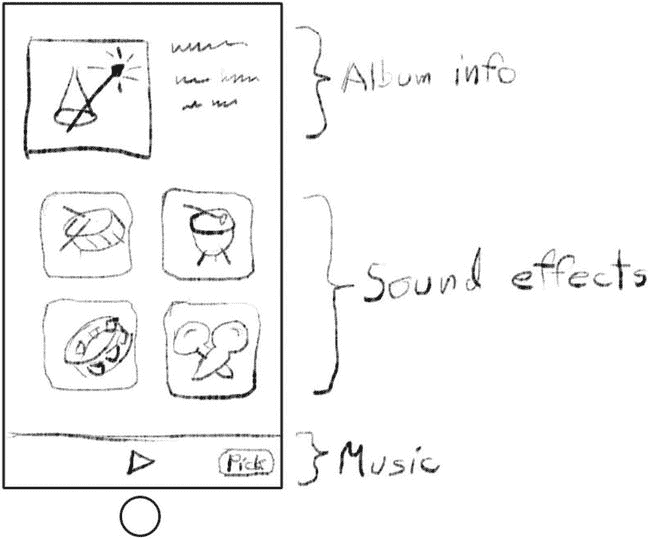

**图 9-1** – DrumDub 草图

你将首先构建 iPod 音乐播放功能。之后添加专辑封面，最后混入打击乐声音。像往常一样，从创建一个新的 Xcode 项目开始。

1.  使用“Single View Application”模板。
2.  将项目命名为`DrumDub`。
3.  将语言设置为`Swift`。
4.  将设备设置为`Universal`。
5.  保存项目。
6.  在项目支持的界面方向中，找到 iPhone/iPod 部分，关闭横屏左右方向，仅保留竖屏启用。（iPad 版本可以在任何方向运行。）

#### 添加音乐选择器

第一步是创建界面，让用户可以从其 iPod 音乐库中选择一首或多首歌曲。在第 7 章（你使用了照片库选择器）之后，你应该不会惊讶于 iOS 提供了一个现成的音乐选择器界面。你只需配置它并将其呈现给用户即可。

当用户点击界面中的“Song”按钮时，你将呈现音乐选择器界面。为此你需要一个操作方法。首先将以下存根函数添加到你的`ViewController.swift`文件中：

```
@IBAction func selectTrack(sender: AnyObject!) {
}
```

切换到`Main.storyboard`的 Interface Builder 文件。在对象库中找到`Toolbar`对象。将一个工具栏拖入你的界面，将其定位在视图底部。工具栏已包含一个栏按钮项。选择它并将其标题属性更改为“Song”。将其发送操作（Control+右击拖动）连接到视图控制器的`selectTrack:`操作，如图 9-2 所示。

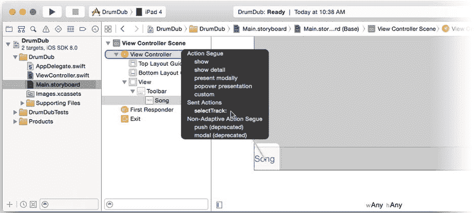


### 排版后的文本


图 9-2. 连接“歌曲”操作

切换回 `ViewController.swift` 文件，完成你的 `selectTrack(_:)` 函数（新代码以粗体显示）。

```swift
@IBAction func selectTrack(sender: AnyObject!) {
    let picker = MPMediaPickerController(mediaTypes: .AnyAudio)
    picker.delegate = self
    picker.allowsPickingMultipleItems = false
    picker.prompt = "选择一首歌"
    presentViewController(picker, animated: true, completion: nil)
}
```

这段代码创建了一个新的 `MPMediaPickerController` 对象，允许用户选择任意音频类型。媒体选择器相当灵活，可以配置为展示设备上的各种音频和/或视频内容。音频内容的类别如下：

*   音乐（`MPMediaType.Music`）
*   播客（`MPMusicType.Podcast`）
*   有声书（`MPMediaType.AudioBook`）
*   iTunes U（`MPMediaType.AudioITunesU`）

通过组合这些二进制值，你可以将媒体选择器配置为展示所需的任意类别组合。常量 `MPMediaType.AnyAudio` 包含所有类别，允许用户从其资料库中选择任意音频项目。类似的标志集可用于选择视频内容。

**提示** 某些参数，例如 `MPMediaPickerController(mediaTypes:)` 中的 `mediaTypes` 参数，并不是作为单个整数值来解析，而是作为位或标志的集合来解析。每个 `MPMediaType` 常量的原始值都是 2 的幂次——即整数中的单个比特位。你可以通过逻辑“或”运算将它们组合成一个任意组合，例如 `(.Music | .AudioBook)`。如此得到的值会展示所有音乐曲目和有声书，但不会让用户选择播客或 iTunes U 内容。便捷的 `.AnyAudio` 常量实际上就是将所有可能的音频标志进行“或”运算后的结果。

然后，你将 `ViewController` 对象设置为选择器的委托。为此，视图控制器需要遵循 `MPMediaPickerControllerDelegate` 协议。现在就将该协议添加到类声明中（新代码以粗体显示）。

```swift
class ViewController: UIViewController, MPMediaPickerControllerDelegate {
```

接下来，禁用了允许一次选择多个曲目的选项。用户将一次只能选择一首歌曲。同时设置一个提示或标题，以便用户知道你在要求他们做什么。

最后，呈现该控制器，让它接管界面并选择歌曲。这些代码足以让其运行起来，所以尝试一下吧。将项目的运行方案设置为你的 iOS 设备并点击“运行”按钮，如图 9-3 左侧所示。工具栏出现后，你可以点击“歌曲”按钮调出音乐选择器，浏览音频资料库并选择一首歌曲，如图 9-3 右侧所示。如果你在模拟器中运行该应用，选择器可以工作，但里面没有任何可供选择的内容（如图 9-3 中间所示）。

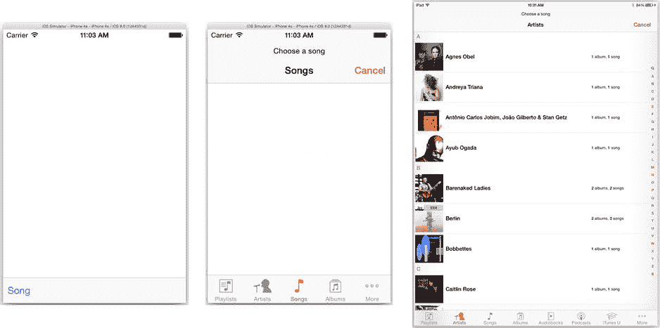

图 9-3. 测试音频选择器

#### 查询 iPod 音乐资料库

你不必非得使用媒体选择器来从用户的 iPod 资料库中选择项目，这只是最便捷的方法。

你完全可以创建自己的界面，或者根本不需要界面。iPod 框架提供的类允许你的应用像查询数据库一样探索和搜索用户的媒体收藏。（仔细想想，它确实就是一个数据库，所以这种描述是字面意义上的准确。）

实现方式是创建一个查询对象，定义你要搜索的内容。这可以简单到“所有 R&B 歌曲”，也可以更细致，比如“所有时长超过 2 分钟、属于‘舞曲’风格、BPM 标签在 110 到 120 之间的曲目”。查询结果是一个与描述匹配的媒体项目列表，你可以用任何喜欢的方式呈现（*咳*——表格——*咳*）。

你可以在 Xcode 的“文档和 API 参考”中找到的 *iPod Library Access Programming Guide* 中了解更多。阅读其中的“以编程方式获取媒体项目”部分即可入门。

#### 使用音乐播放器

接下来会发生什么？嗯，接下来什么都不会发生。当用户选择一首曲目或点击“取消”按钮时，会调用以下某个委托函数：

```swift
mediaPicker(_:,didPickMediaItems:)
mediaPickerDidCancel(_:)
```

之所以什么都没发生，是因为你尚未编写这两个函数中的任何一个。首先编写 `mediaPicker(_:,didPickMediaItems:)`。该方法会检索用户选择的音频曲目，并使用 `MPMusicPlayerController` 对象开始播放。

将第一个委托方法添加到你的 `ViewController` 类中。

```swift
func mediaPicker(mediaPicker: MPMediaPickerController!, 
            didPickMediaItems mediaItemCollection: MPMediaItemCollection!) {
    if let songChoices = mediaItemCollection {
        if songChoices.count != 0 {
            musicPlayer.setQueueWithItemCollection(songChoices)
            musicPlayer.play()
        }
    }
    dismissViewControllerAnimated(true, completion: nil)
}
```

`mediaItemCollection` 参数包含用户选择的曲目、书籍或视频列表。请记住，选择器可用于一次选择多个项目。由于你将 `allowsPickingMultipleItems` 属性设置为 `false`，因此你的选择器将始终只返回单个项目。

我们再次确认至少选择了一首曲目（只是为了确保），然后使用该集合设置音乐播放器的播放队列。*播放队列* 是一个待播放的曲目列表，其工作原理与播放列表完全相同。在这里，它是一个仅包含一首曲目的播放列表。下一行语句开始播放音乐。就这么简单。

**注意** 虽然音乐播放器的播放队列的工作原理与播放列表相同，但它并不是 iPod 播放列表。它不会作为播放列表出现在 iPod 界面中，iOS 也不会为你保存它。如果你希望在应用中实现此功能，可以自行完成。使用你在第 5 章中学到的知识，将媒体收藏中的项目以表格形式呈现，允许用户根据自己的喜好重新排序、删除或添加新项目（再次使用媒体选择器）。然后用更新后的收藏再次调用音乐播放器的 `setQueueWithItemCollection(_:)` 函数。

那么，这段代码的问题是什么？问题在于还没有 `musicPlayer` 属性！为 `musicPlayer` 编写一个只读的计算属性，该属性惰性创建对象。

```swift
var musicPlayer: MPMusicPlayerController {
   if musicPlayer_Lazy == nil {
      musicPlayer_Lazy = MPMusicPlayerController()
      musicPlayer_Lazy!.shuffleMode = .Off
      musicPlayer_Lazy!.repeatMode = .None
      }
   return musicPlayer_Lazy!
}
private var musicPlayer_Lazy: MPMusicPlayerController?
```

**注意** 这段代码遵循了两个常用的设计模式：单例模式和惰性初始化。代码实现了一个计算属性 `musicPlayer`；任何请求该属性的代码（`myController.musicPlayer`）都会调用这段代码。代码会检查是否已经创建了一个存储在 `musicPlayer_Lazy` 中的 `MPMusicPlayerController` 对象。如果没有，就创建一个并配置它，然后将其保存在 `musicPlayer_Lazy` 实例变量中。这种情况只会发生一次。所有后续对 `musicPlayer` 的请求都会看到 `musicPlayer_Lazy` 变量已经设置好，并立即返回该（唯一）对象。


当您构建一个应用音乐播放器（请参阅“应用与 iPod 音乐播放器”边栏）时，该播放器会继承 iPod 当前的播放设置，例如随机播放和重复模式。您不希望这些设置生效，因此需要将它们关闭。

#### 应用与 iPod 音乐播放器

您的应用可以访问两个不同的音乐播放器对象。*应用音乐播放器*属于您的应用。它的当前播放列表和设置仅存在于您的应用中，并且当应用停止时，它也会停止播放。

您也可以使用 `MPMusicPlayerController.systemMusicPlayer()` 请求*系统音乐播放器*对象。系统音乐播放器对象是设备中 iPod 播放器的直接连接。它反映了 iPod 应用中当前音乐播放的状态。您所做的任何更改（例如暂停播放或更改随机播放模式）都会改变 iPod 应用的状态。即使您的应用停止，音乐播放仍会继续。

只有一个特殊情况。系统音乐播放器对象不会报告通过家庭共享等方式流式传输的媒体信息。但除此之外，系统音乐播放器对象是内置 iPod 应用的一个透明扩展，允许您的应用参与并整合到用户当前的音乐活动中。

一次只能有一个音乐播放器处于播放状态。如果您的应用启动了一个应用音乐播放器，它会接管音乐播放服务，导致内置 iPod 播放器停止。同样，如果您的应用音乐播放器正在播放，而用户启动了系统播放器，您的音乐播放器也会停止。

现在添加一个委托函数来处理用户拒绝选择曲目的情况。

```
func mediaPickerDidCancel(mediaPicker: MPMediaPickerController!) {
    dismissViewControllerAnimated(true, completion: nil)
}
```

您的基本播放代码现已完成。运行您的应用，选择一首曲目，然后欣赏音乐。

`MPMusicPlayerController` 对象是自包含的。它会为您处理所有标准的 iPod 行为。例如，如果被闹钟或来电中断，它会自动淡出；或者当用户拔下耳机时停止播放。我将在本章后面详细讨论这些事件。

这并不是说您不能影响音乐播放器。事实上，您对它有相当大的控制权。您可以启动和停止播放器、调节音量、在播放列表中向前或向后跳转、设置随机播放和重复模式、更改播放速率等等。播放器还会告诉您很多关于它正在做什么和播放什么的信息。利用这些属性和方法，您可以创建自己的功能完整的音乐播放器。

对于这个应用，您不需要一个功能完整的音乐播放器。但至少知道正在播放什么并能够暂停它会很不错。准备接下来添加这些功能。

#### 添加播放控制

首先添加一些按钮来暂停和播放当前歌曲。这些按钮需要动作，因此将这两个方法添加到您的 `ViewController.swift` 文件中：

```
@IBAction func play(sender: AnyObject!) {
    musicPlayer.play()
}

@IBAction func pause(sender: AnyObject!) {
    musicPlayer.pause()
}
```

您还需要更新播放和暂停按钮的状态，因此添加一些连接来实现这一点。

```
@IBOutlet var playButton: UIBarButtonItem!
@IBOutlet var pauseButton: UIBarButtonItem!
```

切换到您的 `Main.storyboard` 文件，并按顺序将以下对象添加到工具栏中，插入到歌曲按钮的左侧，如图 9-4 所示：

1. 一个灵活间隔栏按钮项
2. 一个栏按钮项，将其样式更改为 Plain，标识符更改为 Play，并取消选中 Enabled
3. 一个栏按钮项，将其样式更改为 Plain，标识符更改为 Pause，并取消选中 Enabled
4. 一个灵活间隔栏按钮项

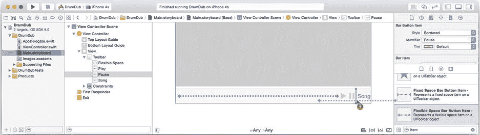

图 9-4. 向工具栏添加控件

最后，设置所有连接。按住 Control 键并右键单击播放按钮，将其动作连接到 `play:` 动作（在`视图控制器`中），并将暂停按钮连接到 `pause:` 动作。选择`视图控制器`对象，使用连接检查器将 `playButton` 输出口连接到播放按钮，并将 `pauseButton` 输出口连接到暂停按钮。

创建并连接好界面对象后，考虑一下这些按钮应该如何工作。您希望实现以下功能：

- 当音乐播放器未播放时，播放按钮处于激活（可点击）状态
- 播放按钮的动作启动音乐播放
- 当音乐播放器正在播放时，暂停按钮处于激活状态
- 暂停按钮的动作暂停音乐播放器

按钮的动作将启动和停止音乐播放器。每当播放器开始或停止播放时，您需要更新按钮的启用状态。第一部分您已经在 `play(_:)` 和 `pause(_:)` 函数中完成了。第二部分是在适当的时间更新按钮状态（启用或禁用它们），为此您需要从音乐播放器获取一些信息。

#### 接收音乐播放器通知

音乐播放器在后台线程中运行。通常，它会播放播放列表中的曲目，直到曲目播放完并停止。它也可能响应外部事件而暂停：用户按下耳机线上的暂停按钮，或从扩展坞中拔下 iPod。您认为您的应用将如何得知这些事件？

如果您说“通过委托函数或通知”，请给自己热烈的掌声！阅读 `MPMusicPlayerController` 类的文档，您会发现音乐播放器会在重要变化发生时*选择性地*发送通知，这些变化恰好包括它开始或停止播放时。要接收这些事件的通知，您需要注册您的控制器对象来接收它们。正如您在第 5 章中回忆的那样，要接收通知，您必须执行以下操作：

1. 创建一个通知函数。
2. 向通知中心注册，成为该通知的观察者。

首先将以下通知函数添加到您的 `ViewController.swift` 实现中：

```
func playbackStateDidChange(notification: NSNotification) {
    let playing = ( musicPlayer.playbackState == .Playing )
    playButton!.enabled = !playing
    pauseButton!.enabled = playing
}
```

您的通知处理程序检查音乐播放器的当前 `playbackState`。播放器的播放状态可能是：已停止、正在播放、已暂停、已中断、正在快进或正在快退。在此实现中，可能的状态只有正在播放、已停止、已中断和已暂停。

如果播放器正在播放，则暂停按钮启用，播放按钮禁用。如果未播放，则情况相反。这样，每当播放器未播放时，播放按钮作为选项呈现，当播放时则呈现暂停按钮。

在采取另外两个步骤之前，您的控制器不会收到这些通知。首先，您必须注册以接收这些通知。在 `musicPlayer` 的 getter 代码块中，在创建并配置播放器对象后立即添加以下代码（新代码以粗体显示）：

```
musicPlayer_Lazy = MPMusicPlayerController()
musicPlayer_Lazy!.shuffleMode = .Off
musicPlayer_Lazy!.repeatMode = .None
let center = NSNotificationCenter.defaultCenter()
center.addObserver( self,
          selector: "playbackStateDidChange:",
              name: MPMusicPlayerControllerPlaybackStateDidChangeNotification,
            object: musicPlayer_Lazy)
```

第二步是启用音乐播放器的通知。`MPMusicPlayerController` 默认情况下不发送这些通知。您必须显式地请求它发送。在上一个代码之后，立即添加一行代码。

```
musicPlayer_Lazy!.beginGeneratingPlaybackNotifications()
```


您的播放控制现已完成。运行您的应用并验证它们是否正常工作，如图 9-5 所示。


图 9-5. 功能正常的播放控制按钮

两个按钮初始时均为不可用状态。当您选择一首曲目播放时，暂停按钮会变为可用（如图 9-5 中间所示）。如果您暂停歌曲或让其播放完毕，播放按钮会变为可用（如图 9-5 右侧所示）。

MVC 在行动

您——再一次——见证了模型-视图-控制器设计模式的实际运作。在此场景中，您的音乐播放器（尽管它被称为“音乐控制器”）就是您的数据模型。它包含了音乐播放的状态。每当该状态发生变化，您的控制器就会收到通知并更新相关的视图——在本例中，即播放和暂停按钮。

当您启动或停止播放器时，您并未编写任何代码来更新播放或暂停按钮。这些请求只是被发送给了音乐播放器。如果其中某个请求导致了状态变化，音乐播放器会发布相应的通知，受影响的视图便会得到更新。

虽然功能完备，但您的应用缺少某种*难以言表*的韵味。哦，我们在自欺欺人吗？这个界面简直无趣透顶！让我们给它稍微美化一下。

#### 添加媒体元数据

音乐播放器对象中一个丰富多彩的方面是其 `nowPlayingItem` 属性。此属性返回一个包含正在播放歌曲元数据的对象。该对象的工作方式类似于字典，揭示了当前歌曲各种有趣的细节信息。这包括其标题、艺术家、音轨编号、音乐流派、任何专辑封面等等信息。

**注意** *元数据* 是“关于数据的数据”。一个文件，比如文档，包含数据。该文件的名称、创建时间等等，就是它的元数据——它是描述文件中数据的数据。存储在歌曲文件中的波形是数据。歌曲的名称、艺术家及其流派都属于元数据。

对于您的应用，您将添加一个图像视图来显示专辑封面，以及文本字段来显示歌曲标题、所属专辑和艺术家。首先从向 `Main.storyboard` 添加新的界面对象开始。

#### 创建元数据视图

您将要向界面中添加一个图像视图和几个标签视图。图像视图将显示歌曲的专辑封面，而标签视图将显示当前播放的歌曲、艺术家和专辑（参见图 9-1）。但这并非一成不变的布局。适合 iPhone 的图像和标签视图放在 iPad 上会显得奇怪而小气。而在 iPad 上看起来不错的布局在 iPhone 上又会显得奇怪。那么，您该怎么办呢？

答案在于自适应约束，这是 iOS 8 中的新特性。正如您从第 2 章中所记，视图控制器与一个尺寸等级相关联。*尺寸等级*是对界面可用空间的一种宽泛指示。只有两个尺寸等级：常规（界面有充足空间展开）和紧凑（界面需要紧凑排列）。它们并非实际设备尺寸的指示——尽管如果您的应用需要，也能获取这些信息。其目的是为了方便创建可在各种设备尺寸和方向上工作的替代布局，而无需纠缠于具体细节。

您的界面有两个尺寸等级，一个用于水平方向，一个用于垂直方向。例如，如果您竖屏使用 iPhone 5，您视图的尺寸等级将是 紧凑/常规。这意味着水平尺寸等级是紧凑，垂直尺寸等级是常规。

您即将创建的约束集是本书中最复杂的。但您也会看到，只需稍加规划，无需编写任何代码，就能创建出能够智能适应不同设备和方向的复杂布局约束集，这并不困难。

#### 添加图像视图

选择 `Main.storyboard` 文件。使用对象库，找到 `Image View` 对象并向界面中添加一个。将其（大致）定位在视图的左上角，如图 9-6 所示。

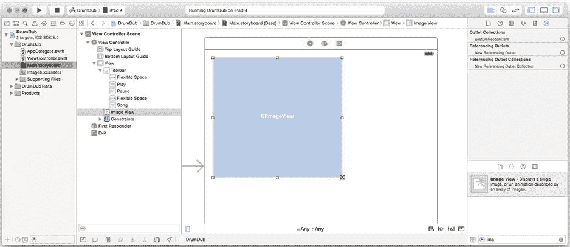

图 9-6. 添加专辑视图

图像视图的大小和位置将由它的约束决定。关于约束只有一条规则：您必须添加足够的约束，以便 iOS 能够明确地确定视图的位置（水平和垂直方向）及其大小（高度和宽度）。并且您不能添加相互冲突的约束。好吧，其实是两条规则。

为特定布局或设备尺寸提出约束相当容易。有趣的是设计一套约束，使您的界面在所有设备和所有支持的方向上都能良好布局。对于 DrumDub，您只需要两种布局：

* 对于 iPhone/iPod：
  * 封面图较小，位于左上角。
  * 歌曲信息标签填充其右侧空间。
* 对于 iPad：
  * 封面图视图较大。
  * 封面图图像和歌曲信息标签分割屏幕，图像位于中心偏左，标签位于右侧。

这需要两组约束，一组用于紧凑/常规（iPhone）界面，另一组用于常规/常规（iPad）界面。此外，还有一些约束是两种界面共用的。所有需要的约束如表 9-1 所示。

表 9-1. 封面图图像视图约束集

| 任意/任意 | 紧凑/任意 | 常规/任意 |
| --- | --- | --- |
| 图像顶边紧贴在顶部布局指南下方 | 左边缘紧贴父视图左边缘 | 右边缘紧贴父视图水平中心 |
|  | 尺寸为 160x160 | 尺寸为 300x300 |

您在 Interface Builder 中添加的约束形成一个层次结构。您添加到 任意/任意 类别的约束将始终应用于您的界面。您添加到 紧凑/任意 类别的约束将仅在您的界面处于紧凑/常规或紧凑/紧凑环境时应用。同样地，您添加到 常规/任意 类别的约束将仅在您的界面处于常规/常规环境时应用。您还可以非常具体地添加仅在界面为紧凑/常规或紧凑/紧凑时才生效的约束。让我们开始吧。

#### 添加通用约束

您需要一个约束——顶边位置——在所有情况下都适用。仍在 `Main.storyboard` 文件中，确保 Interface Builder 画布底部的尺寸等级类别设置为 `wAny/hAny`（任意宽度，任意高度）。选择 `UIImageView` 对象，然后点击“固定约束”控件，如图 9-7 所示。选择顶部约束并将其值设置为“使用标准值”。添加该约束。

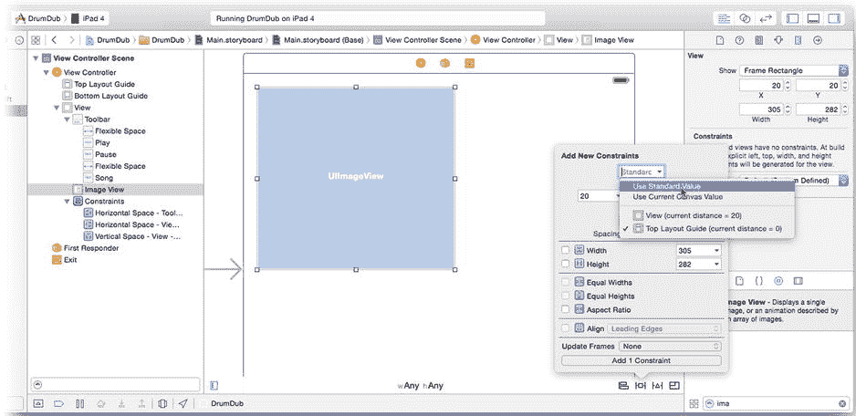

图 9-7. 为所有尺寸等级设置顶部约束

#### 添加紧凑/任意约束

下一步是添加仅当水平尺寸为紧凑时应用的约束。点击画布底部的尺寸等级控件并拖动，直到矩阵显示“紧凑宽度 | 任意高度”，如图 9-8 左侧所示。请注意，视图控制器画布会变得稍微窄一些，暗示着一个更紧凑的设备。

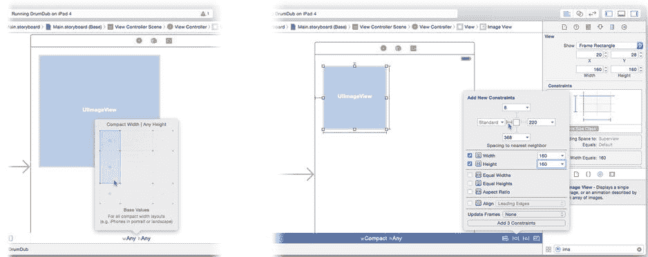


图 9-8. 添加紧促/任意约束

你现在添加的任何约束将只在界面水平尺寸类别为紧凑型时生效。选择图像视图对象，点击固定约束控件，添加一个设置为**使用标准值**的前缘约束，并添加高度和宽度约束均设置为 160 像素，如图 9-8 右侧所示。

当水平尺寸类别为紧凑型时（任意方向的 iPhone 或 iPod），图像视图将位于左上角，宽高均为 160 像素。现在我们继续学习 iPad 布局。

#### 添加规则/任意约束

重复你为 iPhone 界面执行的步骤。将尺寸类别控件更改为`wRegular/hAny`，如图 9-9 左侧所示。选择图像视图，点击固定约束控件，添加高度和宽度约束均设置为 300 像素（如图 9-9 中间所示）。点击对齐约束控件，添加一个值为 150 的容器水平居中约束（如图 9-9 右侧所示）。

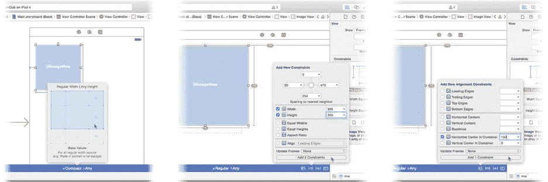

图 9-9. 添加规则/任意约束

当水平尺寸类别为规则型时（iPad），图像视图将位于中心偏左，尺寸为 300 x 300 像素。如果容器水平居中约束的值为 0，视图中心将位于父视图中心。添加半个宽度的偏移量，则会将视图的右边缘定位到父视图的中心。完成所有可能尺寸类别的图像视图约束后，将注意力转向标签视图。

#### 添加歌曲标签

你将添加三个标签。你希望这些标签与专辑封面视图对齐，并填充界面的右侧区域，适用于所有尺寸和方向。

在添加标签对象之前，先切换回`wAny/hAny`尺寸类别，如图 9-10 左侧所示。拖入一个标签对象，使其与图像视图的顶部边缘对齐，并拉伸它以填充右侧空间，如图 9-10 右侧所示。将其字体大小设置为 System 14.0。

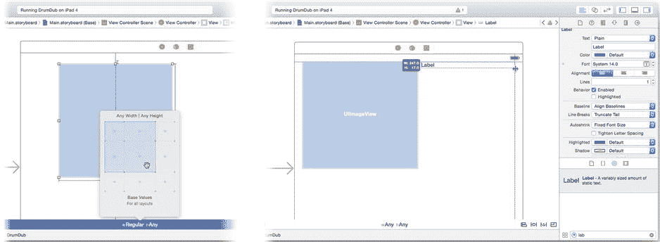

图 9-10. 添加第一个歌曲标签对象

**警告** 在向界面添加新对象之前，请确保尺寸类别设置为`wAny/hAny`，否则你只会将这些视图添加到该尺寸类别的布局中。Interface Builder 允许你添加仅出现在特定尺寸类别中的对象，但这并非你想要的。

复制两个第一个标签——按住 Option 键并拖动副本到新位置——这样你就有三个标签了，如图 9-11 左侧所示。选择顶部标签和图像视图，点击对齐约束控件，添加一个顶部边缘约束，如图 9-11 右侧所示。这将垂直定位标签视图，使其顶部边缘与图像视图的顶部边缘对齐。

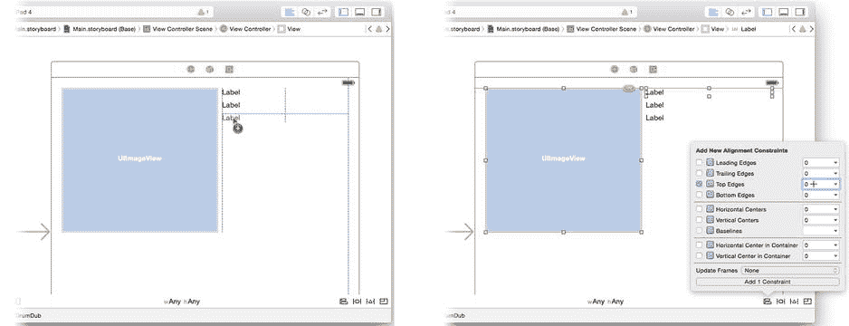

图 9-11. 复制标签并顶部对齐

选中所有三个标签。点击固定约束控件，为所有三个标签对象添加前缘、后缘和高度约束，如图 9-12 左侧所示。注意按钮提示你将添加九个约束——三个标签对象各三个约束。

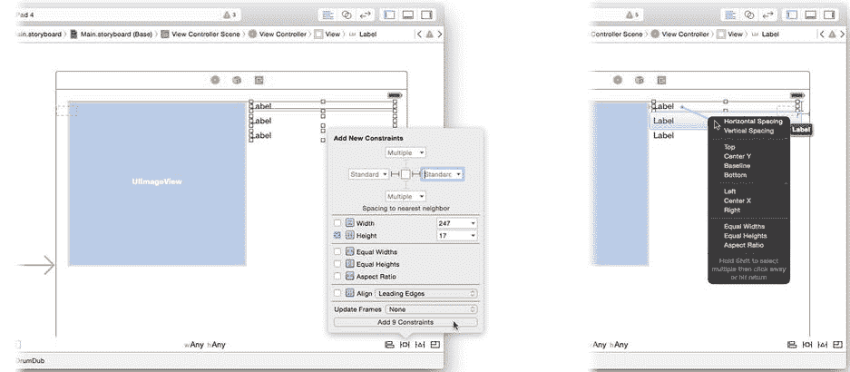

图 9-12. 设置标签约束

现在添加顶部标签与接下来两个标签之间的垂直间距约束。你可以像之前一样使用约束控件来操作，但这里提供另一种方法。如果你想在两个特定视图之间建立约束，按住 Control 键并单击一个视图（顶部标签），然后将其拖拽到另一个视图（中间标签）上，如图 9-12 右侧所示。松开鼠标按钮时，会弹出一个菜单。选择你想要建立的约束。在本例中，选择**垂直间距**。重复操作，在第二个和第三个标签之间创建另一个垂直间距约束。

**提示** Control+拖拽添加约束的方法快速且精确，但无法同时修改约束的值。如果事后需要更改其值，请选择该约束并使用属性检查器编辑其值。

你的约束现在已完成。你为标签对象添加的约束适用于所有尺寸类别。美妙之处在于这些约束是相对于图像视图位置的，而图像视图的位置会改变，因为它在紧凑型和规则宽度设备上拥有不同的约束集。

#### 预览你的布局

有时很难预测约束将如何影响你的布局，而不同尺寸类别中条件约束的影响可能会让你头晕目眩。幸运的是，Xcode 可以帮忙。

切换到辅助编辑器。右侧面板应显示`ViewController.swift`文件。在右侧编辑面板的顶部，从导航菜单中选择**预览**，如图 9-13 顶部所示。右侧面板现在将显示由 Interface Builder 解释的布局在特定设备上应如何显示。

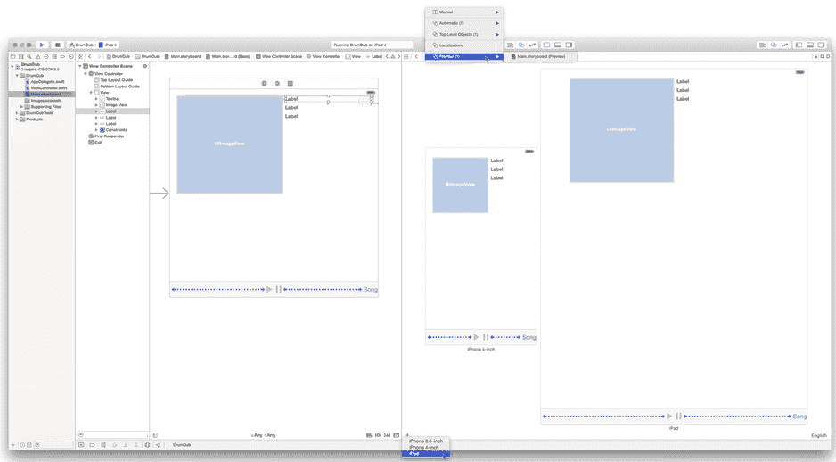

图 9-13. 预览不同设备的布局

**注意** 这些是实时预览。如果你的布局看起来不如预期，请继续在左侧面板中编辑你的视图和约束，其效果将立即在右侧显示。

点击面板左下角的+按钮，向预览中添加新设备。在图 9-13 中，我同时在 4 英寸 iPhone 和 iPad 上预览此布局。你可以旋转预览以检查横屏方向，甚至可以同时添加竖屏和横屏预览——前提是你有一个足够大的显示器。点击一个预览并按 Delete 键将其移除。

#### 完成专辑界面

作为最后润色，选择三个标签视图并使用属性检查器将其字体颜色更改为白色。选择根视图对象并将其背景颜色更改为黑色。

在辅助编辑器中，使用导航条切换回**自动**视图。`ViewController.swift`将重新出现在右侧面板中。添加这四个输出口：

```
@IBOutlet var albumView: UIImageView!
@IBOutlet var songLabel: UILabel!
@IBOutlet var albumLabel: UILabel!
@IBOutlet var artistLabel: UILabel!
```

现在将它们连接到图像和标签视图，如图 9-14 所示。

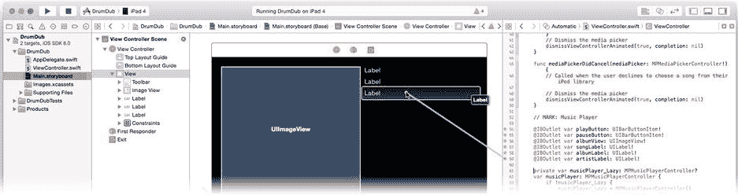

图 9-14. 连接专辑视图

你在这个部分完成了很多出色的工作。你创建了一个使用自适应约束自动调整自身以适应不同设备尺寸和方向的布局。切换回标准编辑器（视图  标准编辑器  显示标准编辑器）并选择`ViewController.swift`文件。是时候编写代码来更新这些新的界面对象了。

##### 观察正在播放的项目


音乐播放器对象还会在正在播放的项目发生变化时发送通知。这种情况发生在新歌曲开始播放或当前歌曲播放完毕时。该通知与你控制器当前正在观察的通知不同，因此你需要创建另一个通知处理函数并注册以观察它。

在`playbackStateDidChange(_:)`函数附近，添加你的新通知处理函数。

```swift
func playingItemDidChange(notification: NSNotification) {
    let nowPlaying = musicPlayer.nowPlayingItem

    var albumImage: UIImage!
    if let artwork = nowPlaying?.valueForProperty(MPMediaItemPropertyArtwork) 
                                                     as? MPMediaItemArtwork {
        albumImage = artwork.imageWithSize(albumView.bounds.size)
    }
    if albumImage == nil {
        albumImage = UIImage(named: "noartwork")
    }
    albumView.image = albumImage

    songLabel.text = 
          nowPlaying?.valueForProperty(MPMediaItemPropertyTitle) as? NSString
    albumLabel.text = 
          nowPlaying?.valueForProperty(MPMediaItemPropertyAlbumTitle) as? NSString
    artistLabel.text = 
          nowPlaying?.valueForProperty(MPMediaItemPropertyArtist) as? NSString
}
```

该方法获取`nowPlayingItem`属性对象。与拥有固定属性（如典型对象）不同，`MPMediaItem`对象包含可变数量的属性值，你需要通过键来请求它们。键是一个固定值（通常是字符串），用于标识你感兴趣的值。

你首先请求的是`MPMediaItemPropertyArtwork`值。该值将是一个`MPMediaItemArtwork`对象，它封装了歌曲的专辑封面。然后，你请求一个针对图像视图尺寸优化过的`UIImage`对象。

**提示**：`MPMediaItemArtwork`对象可能会存储多个不同尺寸和分辨率的项目封面版本。在请求封面的`UIImage`时，请指定一个尽可能接近你计划显示图像尺寸的大小，以便媒体项目对象能够返回该尺寸下最优的图像。

关于媒体元数据，需要牢记的一点是：没有任何保证。iPod 库中的任何歌曲可能包含标题、艺术家和封面值，也可能不包含其中任何值；或者，它可能包含标题和艺术家但没有封面，也可能有封面但没有标题。总之，要为你请求的某些信息不可用的情况做好准备。

在本应用中，你需要测试`MPMediaItemArtwork`是否拒绝返回可显示的图像（`albumImage == nil`）。在这种情况下，用名为“`noartwork`”的资源图像替换该图像。

为了使那段代码生效，你需要将`noartwork.png`和`noartwork@2x.png`文件添加到项目中。在导航器中选择`Images.xcassets`项目。找到`Learn iOS Development Projects`  `Ch 9`  `DrumDub (Resources)`文件夹，将`noartwork.png`和`noartwork@2x.png`文件拖入资源目录中。

最后三条语句重复此过程，获取项目的标题、专辑标题和艺术家名称。在这段代码中，你无需担心缺失值。如果某个项目没有专辑名称（在请求`MPMediaItemPropertyAlbumTitle`时），媒体项目将返回空。恰好将`UILabel`的`text`属性设置为空可以清空视图——这正是没有专辑名称时你想达到的效果。

最后一步是观察项目已更改通知。找到`musicPlayer`属性获取器代码。找到观察播放状态变化的代码，并插入这条新语句：

```swift
center.addObserver( self,
          selector: "playingItemDidChange:",
              name: MPMusicPlayerControllerNowPlayingItemDidChangeNotification,
            object: musicPlayer_Lazy)
```

现在，每当新歌曲开始播放时，你的控制器都会收到“正在播放项目已更改”通知，并向用户显示该信息。试试看吧。


运行你的应用，选择一首歌曲并开始播放。歌曲信息和专辑封面将会显示，如图 9-15 所示。如果让歌曲播放至结束，这些信息会再次消失。

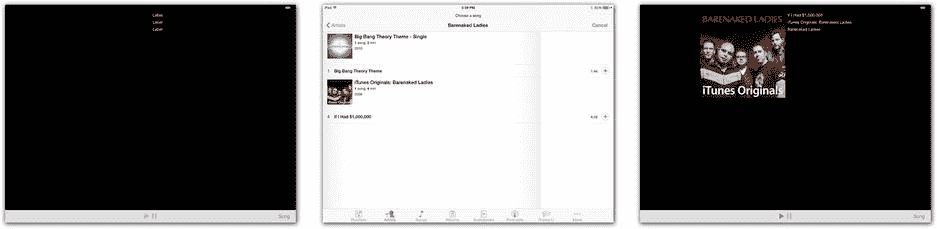

图 9-15. 专辑封面与歌曲元数据

对于这个界面，我唯一不喜欢的是应用启动时，专辑封面视图和三个标签视图会显示占位信息。通过在`Main.storyboard`文件中清除这三个标签对象的`text`属性，并将图像视图的初始图像设置为`noartwork.png`，可以修复这个问题。

##### 制造一点声响

到目前为止，你基本上已经创建了一个（精简版的）iPod 应用。这已经是项令人印象深刻的成就了，但这并非为应用添加声音的唯一方式。你可能希望为操作添加音效，或者播放已打包在应用内的音乐文件。也许你想通过网络数据源播放实时音频流。这些操作都很容易实现，甚至比从 iPod 库中播放歌曲还要简单——而后者本身已经相当简单了。

我会先处理这个简单的部分。要播放并控制应用能够访问的几乎任何类型的音频数据，请遵循以下步骤：

1.  创建一个`AVAudioPlayer`对象。
2.  使用音频数据源（通常是一个指向资源文件的`URL`）初始化该播放器。
3.  调用其`play()`函数。

就像`MPMusicPlayerController`一样，`AVAudioPlayer`对象会处理所有细节，包括在播放完成时通知你的委托。

因此，你可能会认为只需十几行代码和几个按钮就能完成这个应用，但你想错了。

##### 身处更广阔的世界

在这个应用中播放音频的复杂之处并不在于播放声音的代码。复杂性源于 iOS 设备的本质及其所处的环境。

以 iPhone 为例：它是一部电话和可视电话，音频用于指示来电并播放来电者的音频流；它是一个音乐播放器，即使在使用其他应用时，也能播放你最爱的音乐或有声书，或收听网络电台；它是一个闹钟，定时器可以在白天或夜晚的任何时间提醒你做事；它是一个游戏机，游戏中充满了声音、音效和环境音乐；它是一个寻呼机，消息、通知和提醒可能因无数原因随时出现，打断你的工作（或娱乐）；它还是一个视频播放器、电视机、答录机、GPS 导航仪、电影编辑器、录音机和数字助理。

所有这些音频源共享*一个*音频输出接口。为了有效地做到这一点——为用户创造愉悦的体验——所有这些相互竞争的音频源必须相互协作。当有电话呼入时，游戏声音和音乐播放必须停止。如果用户需要听到提醒或录制的消息，背景音乐需要暂时降低音量¹。iOS 将这些情况称为*中断*。

更复杂的是，iOS 设备有多种不同的声音输出方式。考虑内置扬声器、耳机插孔、无线蓝牙设备、AirPlay 和底座连接器；iOS 将这些称为*音频路由*。音频可以被导向其中任何一个，并且可以随时切换到另一个（称为*路由变更*）。音频播放必须意识到这一点，并且你的应用可能需要对这些变化做出响应。例如，Apple 建议拔出耳机应导致音乐播放暂停，但游戏音效应继续播放。

此外，还有一个更复杂的因素：大多数 iOS 设备都有铃声/静音开关。旨在作为提醒、闹钟、装饰或音效的音频，只有在铃声开关处于正常位置时才应播放。而更刻意的音频，如电影和有声读物，即使静音开关已启用，也应正常播放。

综合来看，你的应用需要完成以下任务：


