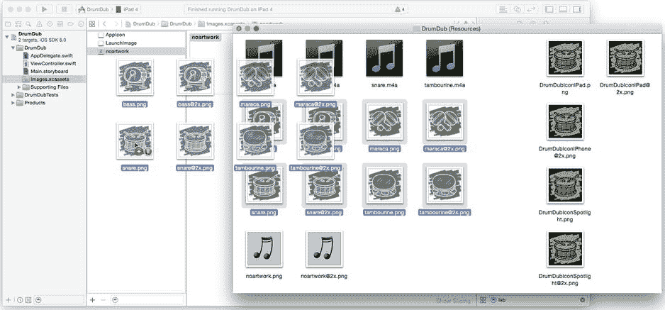
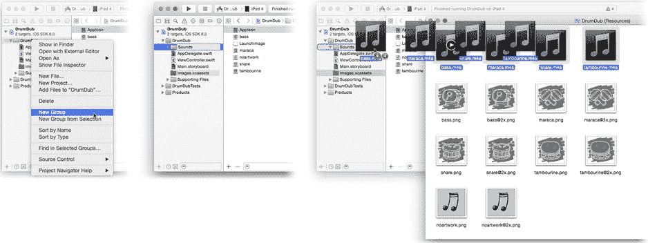
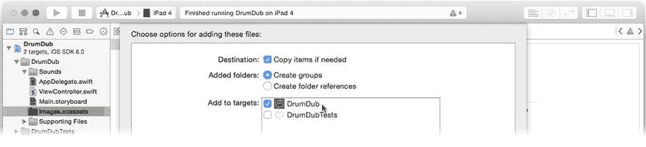
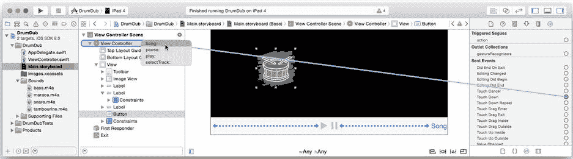
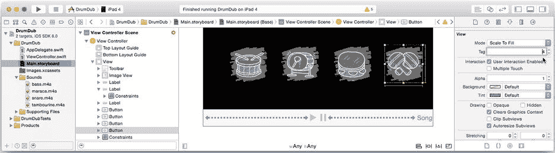
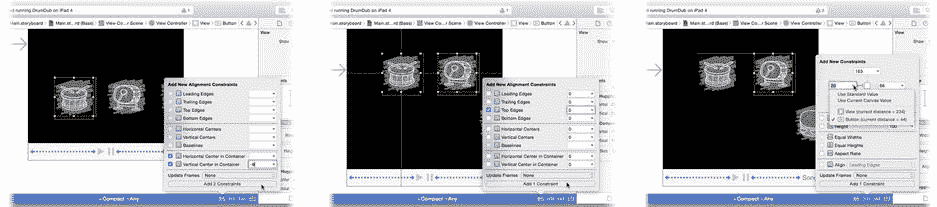
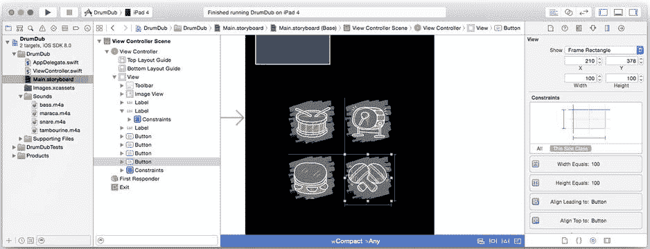
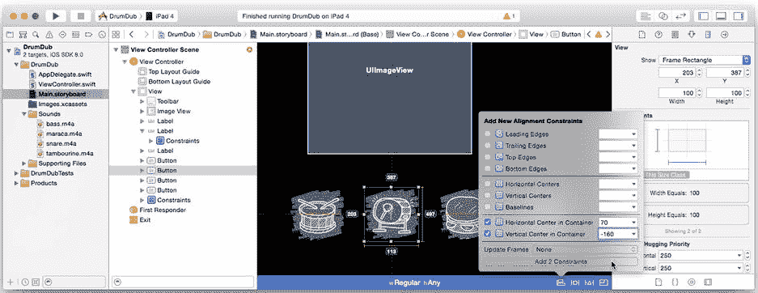
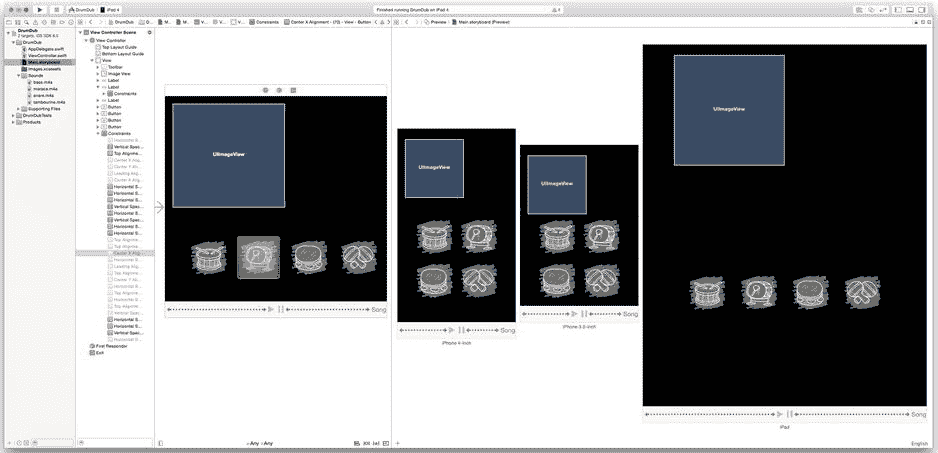
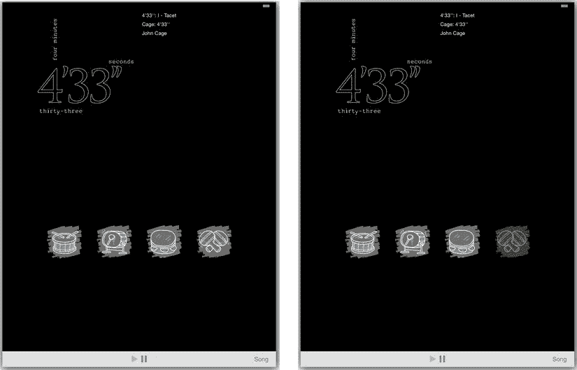

# 排版后的内容

- 确定应用中每个音频来源的意图和用途
- 声明此用途，以便 iOS 调整其行为以适应你的音频
- 监控中断和音频路线变化，并采取相应措施

好消息是，并非你编写的每个支持音频的应用都必须完成所有这些操作。事实上，如果*只*使用 iPod 音乐播放器或*只*使用 `AVAudioPlayer` 对象播放附带音效，你可能根本无需做任何事。这两个类都会“自动做出正确行为”。

然而，对于像 DrumDub 这样的应用，它希望在混入额外音效的同时管理自己的音乐播放，那么所有这些步骤都需要执行。因此，在开始为应用添加音效之前，先打好基础。

### 配置你的音频会话

你通过音频会话向 iOS 传达你的意图——描述你的应用将播放何种声音，以及这些声音将如何影响其他音频源。每个 iOS 应用都会获得一个泛型音频会话，该会话预配置了一套基本行为。这就是为什么如果你仅通过音乐播放器控制器播放音乐，你无需做任何特殊处理；默认的音频会话就完全够用。

DrumDub 需要同时播放和混音音频。这并不常见，因此它需要重新配置其音频会话。仅播放音频的应用通常可以一次性配置其音频会话，之后便不再改动。

**注意** 录制音频，或录制并播放音频的应用更为复杂。在录制、播放和处理之间切换时，它们必须反复重新配置其音频会话。

在你的 `AppDelegate.swift` 文件中，你可以找到应用委托对象的代码。应用委托中的函数之一是 `application(_:,didFinishLaunchingWithOptions:)` 函数。顾名思义，它在应用加载并初始化完成、即将开始运行后立即被调用。这是放置那些只需运行一次，且在一切其他代码启动之前运行的代码的最佳位置。将以下代码（加粗部分）添加到该函数的开头：

```
func application(application: UIApplication!, didFinishLaunchingWithOptions
                                       launchOptions: NSDictionary!) -> Bool {
    let audioSession =  AVAudioSession.sharedInstance()
    audioSession.setCategory( AVAudioSessionCategoryPlayback,
                 withOptions: .MixWithOthers,
                       error: nil)
    return true
}
```

一个音频会话包含一个类别和一组选项。共有七种不同的类别可供选择，如表 9-2 所列。

表 9-2. 音频会话类别

| 会话类别 | 应用描述 |
| --- | --- |
| `AVAudioSessionCategoryAmbient` | 播放背景音频或非关键音效。没有这些音效应用也能正常运行。应用音频与同时播放的其他音频（如你的 iPod）混合。响铃/静音开关会静音应用的音频。 |
| `AVAudioSessionCategorySoloAmbient` | 播放不与其他音频混合的非关键音频；当应用播放音频时，其他音频源将被静音。响铃/静音开关会静音应用的音频。这是默认类别。 |
| `AVAudioSessionCategoryPlayback` | 播放音乐或其他关键声音。换句话说，音频是应用的主要目的，没有音频应用就无法工作。响铃/静音开关不会静音其音频。 |
| `AVAudioSessionCategoryRecord` | 录制音频。 |
| `AVAudioSessionCategoryPlayAndRecord` | 播放并录制音频。 |
| `AVAudioSessionCategoryAudioProcessing` | 执行音频处理（使用硬件音频编解码器），同时既不播放也不录制。 |
| `AVAudioSessionCategoryMultiRoute` | 需要同时将音频输出到多个路线。幻灯片应用可能通过底座连接器播放音乐，同时通过耳机发送音频提示。 |

默认类别是 `AVAudioSessionCategorySoloAmbient`。对于 DrumDub，你确定音频是其*存在的理由*，因此你调用 `setCategory(_:,withOptions:,error:)` 函数将其类别更改为 `AVAudioSessionCategoryPlayback`。现在，你的应用音频将不会被响铃/静音开关静音。

你还可以通过一些特定于类别的选项来微调该类别。此播放类别的唯一选项是 `AVAudioSessionCategoryOptionMixWithOthers`。如果设置此选项，则允许通过你的 `AVAudioPlayer` 对象播放的音频与同时播放的其他音频“混合”。这正是你希望 DrumDub 实现的效果。没有此选项，播放声音会停止歌曲的播放。

你刚刚添加的代码被标记为错误。这是因为所有这些符号都在 `AVFoundation` 框架中定义，因此你需要导入这些定义才能使用它们。在 `AppDelegate.swift` 中所有其他 `import` 语句之前添加此语句：

```
import AVFoundation
```

看，这并不太难。事实上，解释说明远比代码要多。在你的音频会话正确配置后，你现在可以将音效添加到音乐中了。

### 播放音频文件

你终于触及应用设计的核心：播放声音。你将拥有四个按钮，每个按钮播放不同的声音。要实现这一点，你需要以下内容：

- 四个按钮对象
- 四张图片
- 四个 `AVAudioPlayer` 对象
- 四个采样声音文件
- 一个用于播放声音的操作函数

一旦添加了资源并定义了操作函数，构建界面会更容易，所以从这里开始。找到你的 `Learn iOS Development Projects`  `Ch 9`  `DrumDub (Resources)` 文件夹，并定位此表中的 12 个文件：

| 声音采样 | 按钮图片 | Retina 显示屏图片 |
| --- | --- | --- |
| `snare.m4v` | `snare.png` | `snare@2x.png` |
| `bass.m4v` | `bass.png` | `bass@2x.png` |
| `tambourine.m4v` | `tambourine.png` | `tambourine@2x.png` |
| `maraca.m4v` | `maraca.png` | `maraca@2x.png` |

首先添加按钮图片文件。选择 `Images.xcassets` 资源目录项。在其中，你会看到之前添加的 `noartwork` 资源。将八个乐器图片文件（小军鼓、贝斯、铃鼓和沙锤各两个）拖入资源目录的组列表中，如图 9-16 所示。



图 9-16. 添加图片资源

趁现在，选择资源目录的 `AppIcon` 组，并将应用图标图片文件拖入其中，就像你在之前的项目中做的那样。

四个声音文件（`bass.m4a`、`maraca.m4a`、`snare.m4a` 和 `tambourine.m4a`）也将成为资源文件，但它们并非由资源目录管理的那种资源。你可以直接将任何类型的文件添加到项目中，并将该文件作为资源包含在应用的 bundle 中。

为了整洁起见，首先为这些资源文件创建一个新组。在导航器中 Control+单击/右键单击 DrumDub 组（不是项目），然后选择“新建组”命令，如图 9-17 左侧所示。



图 9-17. 添加非图片资源

将该组命名为 Sounds，如图 9-17 中间所示。在 Finder 中找到四个声音采样文件，并将它们拖入该组，如图 9-17 右侧所示。如果你拖放失误，将项目添加到了 DrumDub 组中，请在导航器中选中它们，然后拖入 Sounds 组。你可以随时按自己的意愿重新组织项目。


将项目文件拖入导航器后，Xcode 会显示一些选项，用于决定这些项目如何添加到你的项目中，如图 9-18 所示。请确保勾选了 `Copy items into destination group’s folder (if needed)` 选项。此选项会将新项目复制到你的应用项目文件夹中。第二个选项（`Create groups for any added folders`）仅在添加包含资源文件的文件夹时适用。



图 9-18. 添加项目文件选项

**警告**  如果你未能勾选 `Copy items into destination group’s folder (if needed)` 选项，Xcode 只会添加一个指向原始项目的*引用*，而原始项目仍位于你的项目文件夹之外。这在正常情况下可以工作，但一旦你重命名了某个原始文件、移动了项目或将项目复制到另一个系统，项目就会突然无法构建。为了避免这种麻烦，请将所有项目资源保留在你的项目文件夹内。

最后，请确保 `DrumDub` 目标已被勾选，如图 9-14 所示。此选项会使这些项目成为 `DrumDub` 应用目标的*成员*，这意味着它们将作为资源文件包含在你最终的应用中。（如果你忘记勾选，之后可以通过文件检查器更改任何项目的目标成员身份。）点击“完成”，Xcode 会将声音样本文件复制到你的项目文件夹中，添加到项目导航器中，并将它们纳入 `DrumDub` 应用目标。这些文件现在就可以在你的应用中使用了。

### 创建 `AVAudioPlayer` 对象

你将使用 `AVAudioPlayer` 对象来播放声音样本文件。你需要四个这样的对象。与其创建四个 `AVAudioPlayer` 变量并编写四个播放动作，不如创建一个数组来存放所有对象，以及一个函数来播放其中任何一个。先从 `AVAudioPlayer` 对象开始。在 `ViewController.swift` 文件中添加以下语句：

```
let soundNames = ["snare", "bass", "tambourine", "maraca"]
var players = [AVAudioPlayer]()
```

第一行声明了一个包含声音资源文件名称的字符串常量数组。`players` 变量是一个 `AVAudioPlayer` 对象的数组，初始化为空数组。语法看起来有点奇怪，但它只是在创建一个新对象。这个新对象是一个包含 `AVAudioPlayer` 对象的数组（`[AVAudioPlayer]`），通过默认的对象初始化器（`()`）创建。

这些编译器错误看起来很眼熟吧？就像你为 `AppDelelgate` 类所做的那样，在 `ViewController.swift` 文件的开头添加这个 `import` 语句：

```
import AVFoundation
```

函数 `createAudioPlayers()` 和 `destroyAudioPlayers()` 将一次性创建和销毁所有四个音频播放器对象。现在将它们添加进去。

```
func createAudioPlayers() {
    destroyAudioPlayers()
    for soundName in soundNames {
        if let soundURL = NSBundle.mainBundle().URLForResource(soundName, 
                                                     withExtension: "m4a") {
            let player = AVAudioPlayer(contentsOfURL: soundURL, error: nil)
            player.prepareToPlay()
            players.append(player)
        }
    }
}

func destroyAudioPlayers() {
    players = []
}
```

`createAudioPlayers()` 遍历声音名称常量数组（`soundNames`），并使用它来创建一个指向你之前添加的 `m4a` 声音资源文件的 URL。这个 URL 用于创建和初始化一个新的 `AVAudioPlayer` 对象，该对象将播放那个声音文件。

然后应用了一些优化。对每个声音播放器调用了 `prepareToPlay()` 函数。这会预先准备播放器对象，使其能够立即播放声音。最后，将新的播放器对象追加到 `players` 数组中。当循环结束时，你将拥有一个 `AVAudioPlayer` 对象的数组，每个对象都配置好播放 `soundNames` 数组中对应的声音文件。

**注意**  通常，播放器对象会进行惰性准备，即等到你要求它们播放时，才实际读取声音样本数据文件、分配缓冲区、配置硬件编解码器等。所有这些都需要时间。当用户点击声音按钮时，他们不想等待声音播放；他们希望立即播放。`prepareToPlay()` 函数消除了这种初始延迟。

`destroyAudioPlayers()` 函数不言自明，你现在还不需要它。它将在后续“登场”。

接下来是用于播放这些声音的按钮以及实现该功能的动作函数。首先添加一个 `bang(_:)` 动作的桩代码。

```
@IBAction func bang(sender: AnyObject!) {
}
```

现在你可以设计界面了。

### 添加声音按钮

返回你的 `Main.storyboard` 界面构建器文件。拖入一个新的 `UIButton` 对象。选中它并执行以下操作：

1.  使用属性检查器
    1.  将其类型属性设置为 `Custom`
    2.  清除其标题文本属性（删除 *Button*）
    3.  将其图像属性设置为 `snare`
    4.  向下滚动到其标签属性，将其从 `0` 改为 `1`
2.  选中按钮，使用 Pin 约束控件添加一个高度约束和一个宽度约束，两者都设置为 100 像素。
3.  使用连接检查器将其 `Touch Down` 事件连接到 `View Controller` 对象的新的 `bang:` 动作（见图 9-19）。



图 9-19. 创建第一个 bang 按钮

这个按钮的配置有几个值得注意的方面。首先，你连接的是 `Touch Down` 事件，而不是更常见的 `Touch Up Inside` 事件。这是因为你希望在用户*触摸*按钮的*瞬间*调用 `bang(_:)` 动作函数。通常，按钮要等到用户触摸并松开，且手指仍停留在按钮内时，才会发送其动作消息——因此得名 `Touch Up Inside`。

其次，你没有为这个按钮创建插座变量。你将通过其 `tag` 属性来识别和访问该对象。所有 `UIView` 对象都有一个整数 `tag` 属性。它仅仅用于你在识别视图时的需求；iOS 不会将其用于其他任何用途。你将使用 `tag` 来确定播放哪个声音，并随后在界面中获取 `UIButton` 对象。

将新按钮复制三次，总共创建四个按钮。你可以通过使用剪贴板，或者按住 Option 键并拖出按钮的新副本来完成此操作。

所有按钮都具有相同的类型、图像、标签、约束和动作连接。使用属性检查器更改三个副本按钮的图像和标签属性，参照下表：

| 图像 | 标签 |
| --- | --- |
| `bass` | 2 |
| `tambourine` | 3 |
| `maraca` | 4 |

你的界面现在应该看起来像图 9-20 那样。



图 9-20. 配置好的声音按钮

现在你需要添加约束来将按钮定位在界面中。在紧凑型设备（如 iPhone）上，这些按钮太宽了，无法放在同一行。另一方面，你也不希望它们在大型 iPad 上挤成一团。如果布局能自适应不同的设备和屏幕方向就好了……

当然，我在开玩笑。你将使用之前处理专辑封面和歌曲标签时相同的技术。这次，你将创建一套完全不同的约束，从根本上改变按钮在不同设备上的布局方式。让我们开始吧。

#### 紧凑型界面的按钮布局


您已经在 `wAny/hAny` 尺寸类别中为全部四个按钮添加了高度和宽度约束。因此，按钮在所有布局中都将为 100x100 像素。现在只需添加约束来定位它们。切换到 `wCompact/hAny` 尺寸类别并添加这些约束：

1.  选择标签为 1（军鼓）的按钮。
2.  添加值为 `60` 的“容器中水平居中”约束。
3.  添加值为 `-8` 的“容器中垂直居中”约束（如图 9-21 左图所示）。



图 9-21. Compact/Any 尺寸类别的按钮约束

这些约束足以将第一个按钮定位在界面中心点的稍左侧并略偏下方。这将作为您的“锚点”按钮。其余所有约束都将相对于该按钮设置。

2.  将标签为 2（低音鼓）的按钮拖到第一个按钮的右侧。
3.  选中这两个按钮（或按住 Control 键在它们之间拖拽），添加一个值为 `0` 的“顶部对齐”约束（图 9-21 中间）。
4.  选中右侧按钮，添加一个值为 `20` 的“前导间距”约束，如图 9-21 右侧所示。确保该前导间距是相对于另一个按钮而非容器视图。

您已将第二个按钮定位在第一个按钮右侧 20 像素处，并保持垂直位置相同。继续添加约束以定位剩余两个按钮：

5.  将第三个按钮拖到第一个按钮下方。
6.  选中第一个和第三个按钮，添加一个值为 `0` 的“前导对齐”约束。
7.  在第一个和第三个按钮之间添加一个值为 `20` 的“垂直间距”约束。
8.  将最后一个按钮拖入以填满正方形布局。
9.  与第三个按钮添加一个值为 `0` 的“顶部”（或“底部”，任选）对齐约束。
10. 与第二个按钮添加一个值为 `0` 的“尾部”（或“前导”，任选）对齐约束。

**提示**：无法选中按钮？当 Interface Builder 画布大小改变时，视图对象可能会“掉出”边缘，使其不可见或无法选中。不必担心。场景的所有对象都列在左侧。在视图层次结构中双击缺失的按钮对象；这将在画布中将其选中（即使您看不见它）。使用箭头键移动视图（按住 Shift 键可加速移动），或使用大小检查器更改其原点，使其在画布中重新可见。

最后这两个约束将最后一个按钮相对于第二个按钮（水平方向）和第三个按钮（垂直方向）进行定位，从而完成网格布局。完成的布局如图 9-22 所示。



图 9-22. 完成后的紧凑型按钮布局

#### 常规界面的按钮布局

现在对常规宽度环境重复上述步骤。对于 iPad，按钮不需要紧凑地组合在一起。让我们创建一组不同的约束，让它们之间留些空间。

切换到 `wRegular/hAny` 尺寸类别。您刚才添加的所有约束都会消失。这次从标签为 2（低音鼓）的按钮开始。它将是此布局的“锚点”。

1.  选择第二个按钮（低音鼓）。
2.  添加值为 `70` 的“容器中水平居中”约束。
3.  添加值为 `-160` 的“容器中垂直居中”约束（见图 9-23）。



图 9-23. Regular/Any 尺寸类别的按钮约束

与之前一样，您已将此按钮定位在显示区域相对中心的左侧和下方。这次间距稍微宽松一些，因为显示区域更大。

2.  将其他按钮拖拽成一条粗略的直线。
3.  选中所有按钮，添加一个值为 `0` 的“顶部对齐”约束。

这会指示 iOS 将其他三个按钮定位在与第二个按钮相同（垂直）的位置。剩下的工作就是为其余三个按钮分配水平位置。

4.  在第一个和第二个按钮之间添加一个值为 `40` 的“水平间距”约束。
5.  在第二个和第三个按钮之间执行相同操作。
6.  重复步骤，在第三个和最后一个按钮之间添加水平间距约束。

使用助理编辑器和预览检查您的工作，如图 9-24 所示。如果一切正确，您将看到适用于 4 英寸 iPhone、3.5 英寸 iPhone 和 iPad 的令人满意的按钮布局。



图 9-24. 在多台设备上预览按钮布局

您的应用程序可以在截然不同的界面设计之间无缝切换，这仅通过提供替代约束集即可实现。这一切都很有教育意义，但我相信您非常想继续让那些声音按钮工作起来。

### 制造噪音

返回到常规编辑器和 `ViewController.swift` 文件。完成您的 `bang(_:)` 函数（新代码以粗体显示）。

```
@IBAction func bang(sender: AnyObject!) {
    if let button = sender as? UIButton {
        let index = button.tag-1
        if index >= 0 && index < players.count {
            let player = players[index]
            player.pause()
            player.currentTime = 0.0
            player.play()
        }
    }
}
```

所有四个按钮发送相同的操作。您使用其 `tag` 属性来确定哪个按钮发送了消息。您的四个按钮的 `tag` 值介于 1 到 4 之间，您将其用作索引（0 到 3）来获取该按钮的 `AVAudioPlayer` 对象。

一旦有了按钮的 `AVAudioPlayer`，首先调用其 `pause()` 函数。如果声音正在播放，这将暂停播放；否则不执行任何操作。

然后将 `currentTime` 属性设置为 `0`。此属性是播放器的逻辑“播放头”，指示播放器当前正在播放或即将开始播放的位置（以秒为单位）。将其设置为 `0` 会“回绕”声音，以便从头开始播放。

最后，`play()` 函数启动声音播放。`play()` 函数是异步的；它启动一个后台任务来播放和管理声音，然后立即返回。

在声音能够播放之前，还有两个细节需要处理。

### 激活音频会话

虽然不是严格必需，但 `AVAudioSession` 类的文档建议您的应用程序在启动时以及音频会话被中断时激活它。您将借此机会同时准备音频播放器对象。您将在 `activateAudioSession()` 函数中完成此操作，稍后您将添加该函数。在视图首次加载时调用它一次。找到 `viewDidLoad()` 函数并添加该调用（新行以粗体显示）。

```
override func viewDidLoad() {
    super.viewDidLoad()
    activateAudioSession()
}
```

现在编写 `activateAudioSession()` 函数。

```
func activateAudioSession() {
    let active = AVAudioSession.sharedInstance().setActive(true, error: nil)
    if active {
        if players.count == 0 {
            createAudioPlayers()
        }
    } else {
        destroyAudioPlayers()
    }
    for i in 0..<soundNames.count {
        if let button = view.viewWithTag(i+1) as? UIButton {
            button.enabled = active
        }
    }
}
```


第一行获取你应用的音频会话对象（与你之前在`application(_:, didFinishLaunchingWithOptions:)`中配置的是同一个对象）。你调用它的`setActive(_:, error:)`函数来激活或重新激活音频会话。

`setActive(_:, error:)`函数在当前音频会话已激活时返回`true`。少数情况下会失败（返回`false`），你的应用应妥善处理这种情况。

在这个应用中，你检查会话是否已激活，然后调用`createAudioPlayers()`来准备`AVAudioPlayer`对象进行播放。如果会话无法激活（这意味着你的应用无法使用任何音频），那么你将销毁之前创建的所有`AVAudioPlayer`对象，并禁用界面中所有音效按钮。

由于你没有连接到这些按钮的插座，你将通过它们的`tag`来获取它们。`viewWithTag(_:)`函数会搜索视图对象的层次结构，并返回第一个与该标签匹配的子视图。你的“猛敲”按钮是唯一具有标签值 1、2、3 和 4 的视图。该循环获取每个按钮视图并启用或禁用它。

**提示** 标签是一种管理一组视图对象的便捷方式，无需为每个视图创建插座。

你应用的功能部分现已完成。所谓功能，是指你可以运行应用、播放音乐，并用低劣的打击乐器噪音打扰房间里的其他人，如图 9-25 所示。



图 9-25. 可运行的 DrumDub 应用

中断与绕行

在“更广阔的世界”一节中，我描述了那些使你的应用对音频的使用复杂化的多种事件和情况。大多数人讨厌被打断或被迫绕行，我怀疑应用开发者也不例外。但优雅地处理这些事件是精心打造的 iOS 应用的标志。首先介绍的是中断。

处理中断

当另一个应用或服务需要激活其音频会话时，就会发生*中断*。最常见的中断源是来电和提醒（由闹钟、信息、通知和提醒事项触发）。

处理中断的大部分工作已经为你完成。当你的应用的音频会话被中断时，iOS 会淡出你的音频并停用你的会话。然后，接管会话接管并开始播放用户的铃声或提醒音。你的应用、音频和音乐播放器代理随后会收到“开始中断”消息。

你的应用应做任何适当的事情来响应中断。通常，这不需要做太多。你可能会更新界面以指示你不再播放音乐。大多数情况下，你的应用只需记下它正在做什么，以便在中断结束时能够恢复。

中断可能很短，例如闹钟的几秒钟。或者它们可能非常（非常）长，例如一小时或更久，如果你接听了爱唠叨的梅阿姨的来电。不要对中断将持续多长时间做任何假设；只需等待 iOS 在中断结束时通知你的应用。

当中断结束时，你的应用将收到“结束中断”消息。这是工作开始的地方。首先，你的应用应显式地重新激活其音频会话。这不是一个严格的要求，但建议这样做。它让你的应用有机会捕获（非常罕见的）音频会话无法重新激活的情况。

然后，你需要恢复播放、重新加载音频对象、更新界面，或你的应用需要做的任何其他事情，以便它再次运行，就像中断发生前一样。在 DrumDub 中，需要做的工作出奇地少，因为默认的音乐和音频播放器行为正是你想要的。尽管如此，仍有一些基本的中断处理你需要添加。

添加你的中断处理程序

可以通过多种方式接收中断通知。你的应用只需观察那些它需要且方便的通知；无需观察所有通知。开始和结束中断消息被发送给以下对象：

*   音频会话中断通知（`AVAudioSessionInterruptionNotification`）的任何观察者
*   所有音频播放器代理（`AVAudioPlayerDelegate`）
*   音乐播放器状态变更通知（`MPMusicPlayerControllerPlaybackStateDidChangeNotification`）的任何观察者

决定你希望你的应用如何响应中断，然后实现方便你做到这一点的处理程序。当有东西中断 DrumDub 时，你希望执行以下操作：

*   暂停音乐播放
*   停止任何正在播放的打击乐器声音（这样它不会在中断结束时恢复）

当中断结束时，你希望 DrumDub 执行以下操作：

*   重新激活音频会话并检查问题
*   恢复音乐播放

暂停和恢复音乐播放器无需代码。`MPMusicPlayerController`类会自动响应中断来执行此操作。你甚至不需要添加任何代码来更新界面。当音乐播放器被中断时，其`playbackState`变为`MPMusicPlaybackStateInterrupted`，并且你的控制器会收到`playbackStateDidChangeNotification(_:)`调用，从而更新你的播放和暂停按钮。当中断结束时，音乐播放器恢复播放并发送另一个状态变更通知。

因此，DrumDub 唯一非标准的行为是在中断到来时静音任何正在播放的打击乐器声音。这是为了防止中断结束时声音片段的“尾部”再次开始播放（这是默认行为）。开始编写你的`audioInterruption(_:)`函数并在其第一个`case`中处理该情况。

```
func audioInterruption(notification: NSNotification) {
    if let typeValue = 
       notification.userInfo?[AVAudioSessionInterruptionTypeKey] as? NSNumber {
        if let type = AVAudioSessionInterruptionType.fromRaw( 
                                                typeValue.unsignedLongValue) {
            switch type {
                case .Began:
                    for player in players {
                        player.pause()
                    }
```

列表上的最后一个任务是在中断结束时重新激活音频会话。你已经在`activateAudioSession()`中编写了执行此操作的代码；你只需调用它即可。在第二个`case`中执行此操作。

```
                case .Ended:
                    activateAudioSession()
            }
        }
    }
}
```

要获取这些通知，请在`viewDidLoad()`函数中将你的视图控制器添加为观察者（新代码以粗体显示）。

```
override func viewDidLoad() {
    super.viewDidLoad()
    activateAudioSession()
    let center = NSNotificationCenter.defaultCenter()
    center.addObserver( self,
              selector: "audioInterruption:",
                  name: AVAudioSessionInterruptionNotification,
                object: nil)
```

处理完棘手的中断问题后，接下来处理绕行（线路变更）。

处理音频线路变更

音频线路是数据到达听众耳膜的路径。你的 iPhone 可能已与汽车扬声器配对。当你下车时，你的 iPhone 会切换到内置扬声器。当你插入耳机时，它会停止通过扬声器播放，并开始通过耳机播放。这些事件中的每一个都是音频线路变更。


处理音频线路变更的方式与处理中断完全相同：决定您的应用在每种情况下应执行的操作，然后编写处理器来观察这些事件并实施您的策略。在 DrumDub 中，您希望实现 Apple 推荐的默认行为：当用户拔掉耳机或断开与外部扬声器的连接时，停止音乐播放。如果这些是游戏中的音效或类似内容，那么让它们继续播放是合适的。但 DrumDub 的音乐会在耳机拔掉时停止播放，因此乐器声音也应当停止。

音频线路通知由 `AVAudioSession` 对象发布，您需要做的只是观察它们。首先，请求您的 `ViewController` 对象接收音频线路变更通知。在 `viewDidLoad()` 函数的末尾，添加以下代码：

```
center.addObserver( self,
          selector: "audioRouteChange:",
              name: AVAudioSessionRouteChangeNotification,
            object: nil)
```

现在，添加您的线路变更处理函数。

```
func audioRouteChange(notification: NSNotification) {
    if let reasonValue = 
       notification.userInfo?[AVAudioSessionRouteChangeReasonKey] as? NSNumber {
        if reasonValue.unsignedLongValue == 
           AVAudioSessionRouteChangeReason.OldDeviceUnavailable.toRaw() {
            for player in players {
                player.pause()
            }
        }
    }
}
```

该函数首先检查音频线路变更的原因。它从通知的 `userInfo` 字典中获取此信息。如果与 `AVAudioSessionRouteChangeReasonKey` 关联的值是 `AVAudioSessionRouteChangeReasonOldDeviceUnavailable`，则表示之前激活的音频线路已不可用。这发生在耳机被拔掉、设备从基座连接器移除、无线扬声器系统断开连接等情况。如果是这种情况，它会停止所有四个音频播放器的播放。

至此，这个应用就完成了！请继续运行它，确保一切正常。您需要测试中断和音频线路变更的逻辑，可以执行以下操作：

*  设置闹钟来中断播放
* 用另一部手机呼叫您的 iPhone
* 插拔耳机

在执行这些操作时，在您的 `audioInterruption(_:)` 和 `audioRouteChange(_:)` 函数中设置断点，以验证它们是否被调用。在尽可能多的场景下测试您的应用，是应用开发中的一个重要部分。

### 其他音频主题

本章甚至还未涉及音频录制或信号处理的主题。要开始学习这些以及类似的主题，请从《多媒体编程指南》开始。它提供了在 iOS 中播放、录制和处理音频与视频的概览和路线图。

如果您需要执行高级或底层音频任务（例如分析或编码音频），请参考《Core Audio 概述》。所有这些文档都可以在 Xcode 的“文档与 API 参考”中找到。

还有另一个值得关注的内容：如果您需要在视图中呈现音频或视频，希望您的应用在后台播放音乐（即当您的应用未运行时），或需要处理远程事件，请查看 `AVPlayer` 和 `AVPlayerLayer` 类。前者是一个近乎通用的音视频媒体播放器，类似于 `MPMusicPlayerController` 和 `AVAudioPlayer`。它稍微复杂一些，但功能也更强大。它可以与 `AVPlayerLayer` 对象结合使用，在视图中呈现视觉内容（电影），因此您可以创建自己的 YouTube 风格视频播放器。

