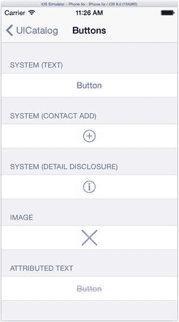
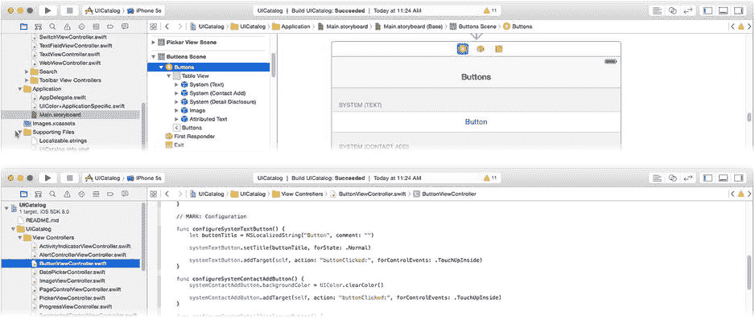
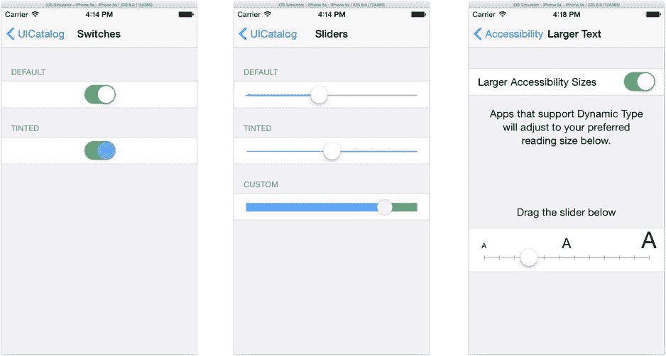

# 第 10 章

## 有视图了吗？

现在，您在向设计中添加视图对象、排列它们、将其连接到插座变量和动作以及自定义它们方面已经有了丰富的经验。您已经使用按钮、标签、图像视图、一些文本字段以及零星的工具栏创建了 iOS 应用。虽然您可能还没有渴望其他类型的视图对象，但还有更多可用的。Cocoa Touch 框架提供了各种开关、切换、滑块、专用按钮、选择器、指示器、小配件和装置，您可以使用它们来构建应用。如果这还不够，许多这类对象还可以通过您尚未探索的方式进行自定义。在本章中，您将了解以下内容：

* 下载示例项目
* 按钮视图
* 开关、滑块和步进器
* 指示器
* 标签、文本字段和文本视图
* 选择器
* 分组表格视图
* 滚动视图
* 搜索控件
* 提醒和操作列表

任何花时间搭建过乐高人仔、立体拼装模型或实验飞机的人都会知道一件事：您对可能性的想象能力直接取决于您对自己所拥有的零件有多少了解。为此，我邀请您参加一次 iOS 视图对象的导览之旅。

### 通过示例学习

软件开发很像烹饪。阅读食谱、讨论过程并享受成果是一回事，实际操作又是另一回事。学习烹饪的最佳方法之一是观察懂行的人操作并模仿他们。

Apple 提供了许多示例项目——完全编写好、可以随时运行的应用——它们展示了 iOS 中各种技术的用法。您只需要下载一个，构建它，运行它，然后从中挖掘所有秘密。这些示例项目是开始使用或至少理解如何使用 iOS 中众多框架和功能的绝佳方式。

Apple 不仅免费提供这些示例项目，而且让下载它们变得异常简单。只需点击一下按钮，Xcode 就会搜索、下载并打开示例代码项目。从 Xcode 的文档窗口开始（帮助  文档与 API 参考），如图 10-1 所示。


. 搜索示例代码

搜索 UICatalog 项目，如图 10-1 所示。点击它，项目的文档页面就会出现。靠近顶部有一个“打开项目”（Open Project）链接。点击它。Xcode 会下载项目的归档文件，解压后，在新的工作区窗口中打开该项目，如图 10-2 所示。是不是很简单？

. UICatalog 项目

**注意** 示例项目不是 Xcode 安装包的一部分，需要联网才能下载。

你会发现，许多类的文档都包含指向示例项目的链接，这让你可以轻松下载展示这些类如何实际运行的代码。

**提示** 尽管苹果所谓的“围墙花园”将大多数 iOS 应用项目限制在开发者社区内（毕竟，你必须是开发者才能在 iOS 设备上构建和运行应用），但这并未阻止开源社区的发展。许多开源 iOS 项目可供开发者（像你这样的）以及那些“越狱”了自己设备的勇敢人士使用。在互联网上快速搜索一下，就能找到开源应用、框架和代码库，你可以在自己的项目中使用它们。

UICatalog 项目特别之处在于：它是一个展示了 iOS 所提供的每一个主要视图对象的应用。因此，它不仅是 iOS 提供的各种视图对象的便捷可视化参考，你还能确切地看到这些对象是如何在应用中创建和使用的。

在模拟器（或者如果你愿意，也可以在你自己的设备上）中运行 UICatalog 应用，如图 10-3 所示。在撰写本文时，UICatalog 包含两个项目：一个用 Objective-C 编写的应用，和一个完全相同的用 Swift 编写的应用。当你下载它们时，Xcode 会同时打开这两个项目。运行哪一个都无关紧要。为了探索代码，你会对 Swift 版本感兴趣，所以请关闭 Objective-C 项目。

. UICatalog 应用

这个列表包含了一组核心的独立 `UIKit` 视图类，按字母顺序排列，后面是专门的搜索和工具栏类。让我们从每个人都喜欢的控件开始：按钮。

## 按钮

按钮是一个简单的视图对象；它就像一个物理按钮。`UIButton` 类负责绘制按钮，并观察触控事件以确定用户如何与之交互。它把用户的操作转化为动作事件，例如“用户在按钮内部触摸”、“用户将手指移出按钮”、“用户将手指移回按钮内部”以及“用户仍在按钮内部时松开了手指”。它基本上就做这些事情。

我知道你在想什么。好吧，也许我不知道。但我希望你正在想：“但按钮做的远不止这些！它向另一个对象发送动作消息，它记住自己的状态，它可以被禁用，它还可以附加手势识别器。这太多了！”

确实很多，但 `UIButton` 类本身并不做这些事情。`UIButton` 处于一个类链的末端，每一个类都负责一组紧密相关的行为。软件工程师会说，每个类都扮演着一个*角色*。`UIButton` 对象的角色就是表现得像一个按钮。它的超类负责处理所有其他的事情。为了让你更清楚地了解实际情况，我认为是时候解剖一个 `UIButton` 了。这不仅有助于你理解 `UIButton` 是如何构建的，还能让你了解所有控件视图是如何构造的。

**注意** 在编写本书的过程中，没有 `UIButton` 对象受到伤害。

## 响应者与视图类

`UIButton` 是 `UIControl` 的子类，而 `UIControl` 又是 `UIView` 的子类，`UIView` 则是 `UIResponder` 的子类，如图 10-4 所示。每个类都添加了一层功能，这些功能组合在一起构成了一个按钮。

. 按钮的解剖结构

`UIResponder` 类定义了对象所有与事件相关的函数，最显著的是处理触控事件的方法。你已经在第 4 章中全面学习了 `UIResponder`，并且创建了一个自定义的 `UIView` 对象，覆盖了自定义的触控事件处理方法，因此这里不再重复。

`UIButton` 继承的下一层是 `UIView`。`UIView` 是一个庞大而复杂的类。它有数十个属性和超过 100 个方法。它之所以如此庞大，是因为它负责 iOS 世界中每个可见对象在屏幕上显示的方方面面。它处理视图的几何形状、坐标系、变换（如旋转、缩放和倾斜）、动画、屏幕尺寸变化时视图的重新定位，以及命中测试。它还负责绘制自身、绘制子视图、决定何时需要重绘这些视图，等等。你将在第 11 章中与 `UIView` 深入打交道。

`UIView` 一个看似无关的属性是它的 `gestureRecognizers` 属性。`UIView` 类本身不直接处理手势识别器的任何事情。但是 `UIView` 定义了显示器的可见区域，任何可见区域都可以附加手势识别器，因此该属性存在于 `UIView` 中。

**手势识别器如何获取事件**

手势识别器由 `UIWindow` 对象在触控事件传递过程中馈送事件。在第 4 章中，我解释说命中测试用于确定将接收触控事件的视图。这个描述有些过于简化了整个过程。

从 iOS 3.2 开始，`UIWindow` 首先查看初始（命中测试）视图，看它是否附加了任何手势识别器对象。如果有，则触控事件首先发送给这些手势识别器对象，而不是直接传递给视图对象。如果手势识别器不感兴趣，那么事件最终会到达视图对象。

如果需要，有多种方法可以改变这种行为，但这有点复杂。有关所有细节，请阅读 *Event Handling Guide for iOS* 中的“手势识别器”一章，该章节可以在 Xcode 的“文档与 API 参考”窗口中找到。

因此，关于按钮的视觉方面的一切都在 `UIView` 类中定义。现在继续下一层，`UIControl` 类。

## 控件类

`UIControl` 是一个抽象类，它定义了所有控件对象所共有的属性。这包括按钮、滑块、开关、步进器等。一个控件对象执行以下操作：

*   向目标对象发送动作消息
*   可以启用或禁用
*   可以被选中
*   可以高亮
*   确定内容如何对齐

上表的第一项是最重要的。`UIControl` 类定义了将动作消息传递给接收者（通常是控制器对象）的机制。每个 `UIControl` 对象都维护着一个事件表格，其中包含触发动作的事件、将接收该动作的对象以及它将发送的动作消息。当你正在编辑一个 Interface Builder 文件，并将一个事件连接到另一个对象中的某个动作方法时，你就是在向该对象的事件调度表中添加一个条目。

**注意** 还记得第 4 章吗？一个事件可以关联到一个发送给第一响应者的动作。你可以通过指定要发送的消息，并将 `nil` 作为该消息的目标对象来实现这一点。


`enabled`、`selected`和`highlighted`是控件外观和行为的一般性指标。`UIControl`的子类会具体决定这些属性代表什么含义（如果有的话）。

`enabled`属性最为一致。一个控件对象在启用时会与用户交互，在禁用时会忽略触摸事件（`control.enabled = false`）。大多数控件类通过使图像变暗或变灰来表明它们已禁用，以此向用户显示该控件是无效的。

`highlighted`属性用于指示用户当前正在触摸该控件。许多控件在被触摸时会“亮起”，此属性即反映了这一状态。

`selected`属性用于可以打开或关闭的控件，例如`UISwitch`类。像按钮这样不支持此状态的控件会忽略此属性。

`UIControl`类还通过`contentVerticalAlignment`和`contentHorizontalAlignment`属性引入了对齐（垂直和水平）的概念。大多数控件对象都有某种标题或图像，并使用这些属性来在视图中定位它们。

## 按钮类型

现在你已经接触到`UIButton`类。正是这个类实现了控件+视图+响应器对象的按钮特定行为。`UIButton`类提供了一些预定义的按钮外观，以及大量的自定义选项，使其几乎可以呈现出你想要的任何样子。

按钮最重要的属性是其类型。按钮可以是以下类型之一：

*   系统
*   自定义
*   详细信息展开
*   “信息”按钮（浅色或深色）
*   “添加联系人”按钮

除了详细信息展开和自定义类型外，所有这些按钮样式都在`UICatalog`应用中展示出来了，如图 Figure 10-5 所示。需要记住的重要事情是，按钮的类型是在创建时确定的。与所有其他属性不同，之后无法更改。信息按钮终生都是信息按钮。



Figure 10-5. 按钮

系统按钮是 iOS 的主力。它是 iOS 界面中使用的标准默认按钮样式。用于调整按钮外观的主要属性如下：

*   色调颜色
*   标题文本（纯文本或富文本）及颜色
*   前景图像
*   背景图像或颜色

`tintColor`属性设置按钮的高亮和强调颜色。标准颜色是蓝色。

按钮的标题可以是一个简单的字符串值（你在之前项目中用到的），也可以是富文本字符串。*富文本字符串*是包含文本属性（字体、大小、斜体、粗体、下标偏移等）的字符串。创建富文本字符串有点复杂，但它允许你使用系统所能支持的任何字体和样式来创建按钮。我在第 20 章中描述了富文本字符串。

你也可以通过设置按钮的`image`属性，使用图像而不是文本作为按钮的标签。类似地，背景可以设置为图像或纯色。你也可以以任意组合的方式混用它们：文本标题放在图像背景上，图像放在纯色背景上，图像无背景（通过将背景颜色设置为`UIColor`的`clearColor`对象），等等。

用于按钮背景的图像可以利用一个有趣的功能，该功能允许图形独立于其边缘来调整中心部分的大小。`capInsets`属性定义了图像边缘的边距，当图像被拉伸以适合按钮大小时，这些边距不会被缩放。此属性让你可以设计一个单一的图形图像，该图像可以填充任意大小的按钮，而不会扭曲其边缘。

另一个极端是自定义类型。这是一块空白画布，iOS 不会为按钮的外观或行为添加任何内容。你仍然可以使用标题和图像属性，但大多数标准按钮行为（例如高亮）都需要你自己来实现。

详细信息展开类型是右指向箭头按钮，通常只出现在表格视图的单元格中。添加联系人按钮显示一个加号（`+`）符号，而两个信息按钮则显示一个表示有更多信息可用的本地化符号。这四种类型有预定义的外观和大小，你几乎无法对它们进行任何自定义。

**注意** 有一种圆角矩形按钮类型已经过时，应忽略。如果你使用此类型，你的 iOS 8 按钮会表现得像系统类型一样。

## 控件状态

当创建和配置按钮的标题、图像、背景图像和背景颜色时，你必须考虑按钮（控件）可能处于的各种状态。`UIControl`的`enabled`、`highlighted`和`selected`属性共同为该控件形成一个单一的`state`值（`UIControlState`）。状态始终是以下之一：正常、高亮、禁用或选中。

当按钮正常显示时，其状态为`.Normal`。当用户触摸它时，其状态变为`.Highlighted`。当它被禁用时，其状态变为`.Disabled`。

当你设置按钮的标题、图像、背景或颜色时，你是为特定状态设置的。这允许你设置一个按钮图像用于按钮启用时，以及备用图像用于它被禁用、高亮或选中时。你可以在设置这些属性的函数中看到这一点：

```
setTitle(_:,forState:)
setTitleColor(_:,forState:)
setAttributedTitle(_:,forState:)
setImage(_:,forState:)
setBackgroundImage(_:,forState:)
```

你不必为每个状态都设置值。至少要为正常（`.Normal`）状态设置值。如果你只设置了这些，该值将用于所有其他状态。如果你随后希望它为其他状态之一设置不同的标题、图像、背景或颜色，也请进行设置。

还有许多其他更微妙的属性用于微调按钮的外观和感觉。例如，你可以控制标题文本投射的阴影，或者更改标题、图像和背景图像的位置（内边距）。请阅读`UIButton`的文档以了解所有可用的属性。

## 按钮代码

你现在已经了解了足够的按钮属性，可以看看`UICatalog`中的按钮构建代码了。到目前为止，你一直使用 Interface Builder 创建按钮对象，这没问题——这样做并没有错。但是你也可以以编程方式创建任何 iOS 对象，就像你处理数组和图像等其他对象那样。你也可以采用混合方法，让 Interface Builder 创建对象，同时你在代码中对其进行自定义或调整。

`UICatalog`应用采用了最后一种方法。大多数对象是在故事板中创建，然后在代码中进行微调。该项目组织得非常细致，以帮助你找到它们。应用中的每个示例，例如 Buttons，都有一个故事板场景（Buttons Scene）和一个名称相似的视图控制器（`ButtonsViewController`），如图 Figure 10-6 所示。



Figure 10-6. UICatalog 项目的组织

点击`ButtonsViewController.swift`文件，找到`configureImageButton()`函数。它应该看起来像以下代码：


```swift
func configureImageButton() {
    imageButton.setTitle("", forState: .Normal)
    imageButton.tintColor = UIColor.applicationPurpleColor()
    let imageButtonNormalImage = UIImage(named: "x_icon")
    imageButton.setImage(imageButtonNormalImage, forState: .Normal)
    imageButton.accessibilityLabel = NSLocalizedString("X Button", comment: "")
    imageButton.addTarget(self, action: "buttonClicked:", forControlEvents: .TouchUpInside)
}
```

在故事板中创建了一个基本按钮对象，并将其连接到 `imageButton` 输出口。随后，`configureImageButton()` 函数对该按钮进行了定制：清除其标题、为所有状态分配图片、为视障用户添加说明文本，并将按钮的动作连接到 `buttonClicked(_:)` 函数。

如果你想尝试不同的按钮属性以查看其外观效果，可以修改这段代码并重新运行 App。**UICatalog 应用就是你的 UI 游乐场**。

## 开关与滑块

接下来要介绍的是开关和滑块，两者都是输入控件。与按钮不同，开关和滑块会保留一个值。开关本身如图所示（见图 10-7 左侧部分）。它提供一个滑动按钮，可以通过点击或手指滑动来切换开/关值。在 iOS 中随处可见这类控件，如图 10-7 右侧所示。



图 10-7。开关、滑块和设置应用

`UISwitch` 对象有一个布尔值属性，恰如其分地命名为 `on`。获取该属性可以知道开关处于哪个位置，而设置该属性则可以改变它。你可以通过调用 `setOn(_:,animated:)` 函数并将 `animated` 参数设为 `true`，来请求 `UISwitch` 在程序化改变其值时播放一点动画效果。

许多属性可让你自定义开关的外观。

*   `tintColor`、`onTintColor` 和 `thumbTintColor`：前两个分别设置开关关闭和开启时使用的颜色。`thumbTintColor` 使开关的“拇指”（你拖动的圆形部分）呈现与 `tintColor` 不同的颜色。
*   `onImage` 和 `offImage`：通常情况下，开关会在拇指旁边显示（本地化的）“开”或“关”文本标题。你可以用自己选择的图片替换它们。不过存在重要的尺寸限制，请务必阅读相关文档。

与大多数带有值的控件一样，开关会在用户改变其值时发送一个“值变更”事件（`UIControlEvents.ValueChanged`）。将该事件连接到你的控制器，即可在开关被切换时收到动作消息。

滑块，如图 10-7 中间所示，是另一种输入控件，允许用户通过将滑块拖动到预定范围内的某个位置来选择值。开关的值是布尔型，而滑块的 `value` 属性则是一个浮点数，代表一个连续的数值范围。

滑块的 `value` 属性受限于 `minimumValue` 和 `maximumValue` 属性设定的范围，这两个属性的默认值分别为 `0.0` 和 `1.0`。除非你修改它们，否则 `value` 将是介于 `0.0` 和 `1.0`（含）之间的一个分数值。

关键的视觉定制属性如下：

*   `minimumTrackTintColor`、`maximumTrackTintColor` 和 `thumbTintColor`：这三个属性用于更改轨道（拇指左侧和右侧的部分）以及拇指本身的颜色。参见 UICatalog（图 10-7）中着色的滑块示例及实现代码。
*   `minimumValueImage`、`maximumValueImage`、`thumbImage`（按 `state` 区分）：类似于滑块，你可以更改用于绘制滑块轨道和拇指本身的图片。拇指图片的工作方式类似于 `UIButton` 的图片，你可以为不同的状态（正常、高亮、禁用）提供不同的图片。


