# 滑块

滑块在用户拖动时会发送单个“值已更改”事件，除非您将 `continuous` 属性设置为 `true`。如果设置为 `continuous`，则当用户拖动滑块时，该控件会连续触发一系列“值已更改”消息。在第 8 章的 ColorModel 应用中使用了此设置，以便在拖动滑块时颜色变化能够“实时”发生。

## 页面控件

页面控件（`UIPageControl`）对象，如图 10-8 底部所示，可以被视为一种离散的滑块控件。顾名思义，它用于指示用户在一个小数量（最多 20 个）的页面或项目中的位置。Apple 的天气应用使用它来指示用户当前正在查看的位置，如图 10-8 右侧所示。

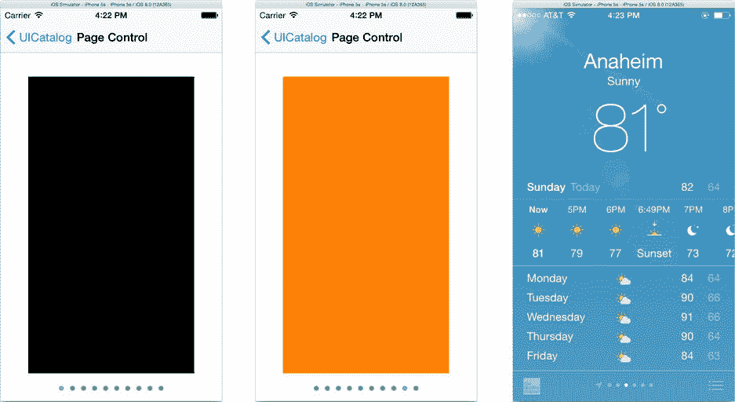

图 10-8. 页面控件与天气应用

`UIPageControl` 的整型属性 `currentPage` 是其值，而 `numberOfPages` 属性决定了前者值的范围以及显示的点数。其外观可以通过以下属性稍作修改：

*   `pageIndicatorTintColor`：设置页面指示器的颜色。
*   `hidesForSinglePage`：如果设置为 `true`，且只有一页时（`numberOfPages<=1`），该控件将不绘制任何内容。

点击当前页面右侧或左侧的页面控件对象，会相应地递减或递增 `currentPage` 属性（向前或向后翻一页），并发送一个“值已更改”事件。

## 步进器

步进器（`UIStepper`）拥有 `UIButton` 的外观和 `UIPageControl` 的核心，如图 10-9 所示。它并排显示两个按钮。当您的用户需要逐“步”增加或减少“某物”（“某物”由您定义；步进器本身不显示值）时，可以使用步进器。

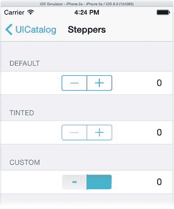

图 10-9. 步进器

和滑块一样，步进器的 `minimumValue` 和 `maximumValue` 属性为其 `value` 属性设置了取值范围。`stepValue` 属性决定了“一步”的含义。例如，表 10-1 展示了一个具有 11 个可能值（介于 `1.0` 和 `6.0` 之间）的步进器的属性设置。

表 10-1. 具有 11 个可能值（含 1.0 至 6.0）的步进器的属性值

| 属性 | 值 |
| --- | --- |
| `minimumValue` | 1.0 |
| `maximumValue` | 6.0 |
| `stepValue` | 0.5 |

步进器的视觉效果可以通过使用递增、递减和背景图像来自定义，设置方式与按钮相同。它还有一个类似 `UIButton` 的 `tintColor` 属性。

每次用户点击递增或递减按钮时，步进器都会发送一个“值已更改”动作。有三个属性可以改变此行为。

*   `continuous`：`continuous` 属性的工作方式与滑块中的相同。
*   `autorepeat`：将 `autorepeat` 设置为 `true` 允许用户通过按住其中一个按钮来连续更改值（一次一步）。
*   `wraps`：此属性允许值在范围内“循环”。使用表 10-1 中的示例，当值已经是 `6.0` 时点击 `+` 会将值改回 `1.0`。当 `wraps` 为 `true` 时，即使值位于范围的起始或结束位置，按钮也不会被禁用。

## 分段控件

与步进器密切相关的是 `UISegmentedControl` 类。分段控件显示多个分段。每个分段作为代表一个选项的按钮，如图 10-10 所示。当您希望用户在少量互斥选项中进行选择时，可以使用分段控件。

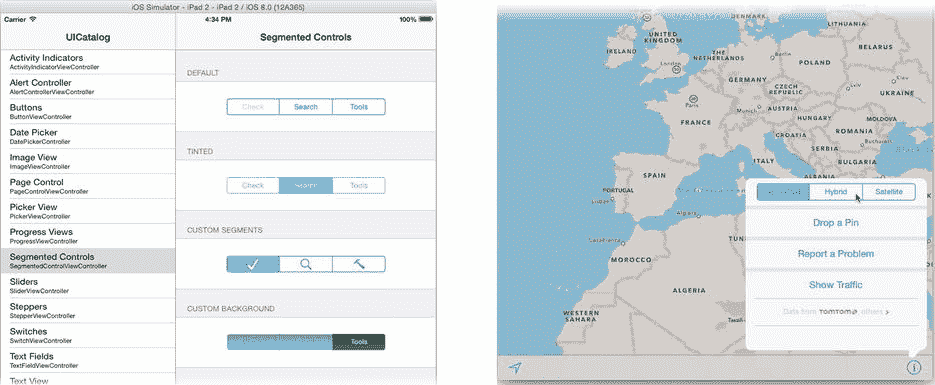

图 10-10. 分段控件

要使用分段控件，首先通过设置 `numberOfSegments` 属性来指定分段的数量。然后，您可以使用以下函数之一将每个分段的标签设置为字符串标题或图像：

```
setTitle(_:,forSegmentAtIndex:)
setImage(_:,forSegmentAtIndex:)
```

或者，您可以选择一次插入（或移除）一个分段。使用这些函数，您可以选择让视图动画化此更改，通过滑动并调整其他分段的大小来腾出空间。

```
insertSegmentWithTitle(_:,atIndex:,animated:)
insertSegmentWithImage(_:,atIndex:,animated:)
```

当用户更改分段控件时，它会发送一个“值已更改”事件（`UIControlEvents.ValueChanged`）。其 `selectedSegmentIndex` 属性告诉您哪个分段被选中，或者可以用来更改选中状态。特殊值 `UISegmentedControlNoSegment` 表示没有选中任何分段。

通常，分段中的按钮是“粘性的”——它们保持高亮以指示选中的分段。如果您将 `momentary` 属性设置为 `true`，按钮不会保持按下状态，并且当用户松开手指时，`selectedSegmentIndex` 会恢复为 `UISegmentedControlNoSegment`。

## 进度指示器

iOS 提供了两种进度指示器：`UIActivityIndicatorView` 和 `UIProgressView`，它们用于在耗时操作期间向用户提供反馈，或显示相对数量（例如已使用的存储量），如图 10-11 所示。使用这些指示器让您的用户知道您的应用正在努力工作；他们应该保持冷静，坐在座位上，并系好安全带。

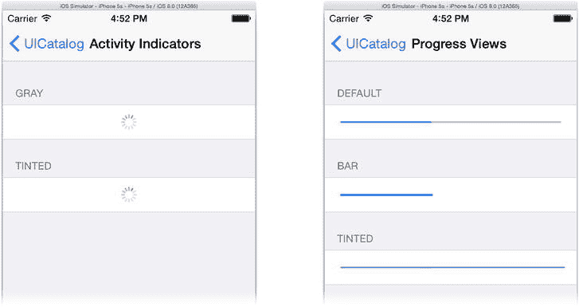

图 10-11. 活动指示器和进度指示器

`UIActivityIndicatorView` 通常被称为*旋转轮*或*齿轮*。当空间有限或活动持续时间不确定时使用它。有三种旋转轮样式（`UIActivityIndicatorViewStyle`）可供选择：小灰色（`.Gray`）、小白色（`.White`）和大白色（`.WhiteLarge`）。

使用旋转轮很简单。调用 `startAnimating()` 开始旋转，调用 `stopAnimating()` 停止旋转。其 `hidesWhenStopped` 和 `color` 属性不言自明。

第二种指示器是进度条（`UIProgressView`），如图 10-11 右侧所示。它呈现一个进度指示器，任何曾耗费生命中的日子等待计算机完成某些任务的人都会对此感到熟悉。该视图有两种外观（`UIProgressViewStyle`）。

*   `.Default`：常规样式的进度条
*   `.Bar`：专为在工具栏中使用而设计的样式

您通过定期将其 `progress` 属性设置为 `0.0`（空）到 `1.0`（满）之间的值来控制该视图。设置 `progress` 属性会使指示器跳转到该位置。通过调用 `setProgress(_:,animated:)`，您可以让指示器平滑地动画过渡到新设置，这对于大范围变化来说不那么突兀。

使用 `trackImage` 或 `trackTintColor` 属性来自定义视图中未完成部分的外观，并使用 `progressImage` 和 `progressTintColor` 属性来调整已完成部分。如果您想尝试不同的颜色，可以在 UICatalog 项目的 `configureTintedProgressView()` 函数中设置色调颜色。

### 文本视图

iOS 中有三种文本视图：标签、文本字段和文本视图。*标签*是最简单的。它用于在界面中放置单个文本字符串，通常位于另一个字段或视图旁边以解释其用途，这也是其名称的由来。*文本字段*是一个通用输入字段，为单行文本提供全功能编辑。*文本视图*可以显示和编辑多行文本。让我们从最简单的开始。

### 标签


你在 iOS 中随处可见标签（参见本书中的几乎任何插图），并且在你的项目中也多次使用过它们。无论出于何种目的，只要你想显示一些文本，就可以使用`UILabel`对象。通过在 Interface Builder 中设置其文本然后不再理会它们，从而将标签对象用作标签——无需建立连接。如果你将标签连接到插口（outlet），你的控制器就可以更新文本，正如你在 ColorModel 应用中所做的那样。

标签有许多属性，允许你改变文本字符串的显示方式，如表 10-2 所列。

表 10-2. 标签显示属性

| 属性 | 描述 |
| --- | --- |
| `numberOfLines` | 标签将显示的最大行数，通常为`1`。将其设置为`0`以根据需要显示尽可能多的行。 |
| `font` | 文本的字体（字型、大小和样式）。 |
| `textColor` | 用于绘制文本的颜色。 |
| `textAlignment` | 对齐方式之一：左对齐、居中、右对齐、两端对齐或自然对齐。自然对齐采用字体的原生对齐方式。 |
| `attributedText` | 绘制属性字符串，而非简单的`text`属性。使用此属性可以显示混合了不同字体、大小、样式和颜色的文本。字符串中的文本属性会覆盖其他文本样式属性（`font`、`textColor`、`shadowOffset`等）。 |
| `lineBreakMode` | 确定如何使过长的字符串适应视图的可用空间。 |
| `adjustsFontSizeToFitWidth` | 缩短字符串的替代方法；它使文本变小，以便整个字符串能够适应。 |
| `adjustLetterSpacingToFitWidth` | 使字符串适应给定空间的第三种选项。 |

如果你打算显示可变数量的文本，请注意控制当字符串太大而无法适应视图时会发生什么的属性。首先是`numberOfLines`和`lineBreakMode`属性。换行模式（`NSLineBreakMode`）控制字符串如何跨多行断开。对于多行标签（`numberOfLines != 1`），可以选择在最近字符处（`.ByCharWrapping`）或最近单词处（`.ByWordWrapping`）断开文本。

对于单行标签（`numberOfLines == 1`），无法适应视图的文本会被毫不客气地截断（`.ByClipping`），或者字符串开头（`.ByTruncatingHead`）、中间（`.ByTruncatingMiddle`）或结尾（`.ByTruncatingTail`）的一部分被省略号（`...`）替换。

**注意** 如果标签的宽度不是由约束固定的，更改其文本会改变其固有大小。自动布局逻辑随后会尝试调整标签视图的大小。如果你让标签自行调整大小以适合其文本，那么`lineBreakMode`和相关属性将不起作用。

让文本适应的另一种方法是设置`adjustsFontSizeToFitWidth`或`adjustLetterSpacingToFitWidth`属性为`true`。这些选项会导致单词间距或字体大小（你也可以同时设置两者）被减小，以试图使字符串适应可用空间。单词间距永远不会减小到零，其大小也永远不会缩小到低于`minimumScaleFactor`属性。如果文本仍然无法适应，则会应用`lineBreakMode`。

**警告** 不要为多行（`numberOfLines != 1`）标签或结合多行换行模式（字符或单词换行）设置`adjustsFontSizeToFitWidth`或`adjustsLetterSpacingToFitWidth`。这样做是编程错误，视图的行为将不可预测。

### 文本字段

当你希望用户输入或编辑一行文本时，请使用文本字段（`UITextField`）。Shorty 应用曾使用文本字段从用户那里获取 URL。

UICatalog 应用演示了五种不同的文本字段，如图 10-12 所示。与编辑几乎任何文本的复杂性相一致，在视图的外观和行为方面，你拥有广泛的选择。

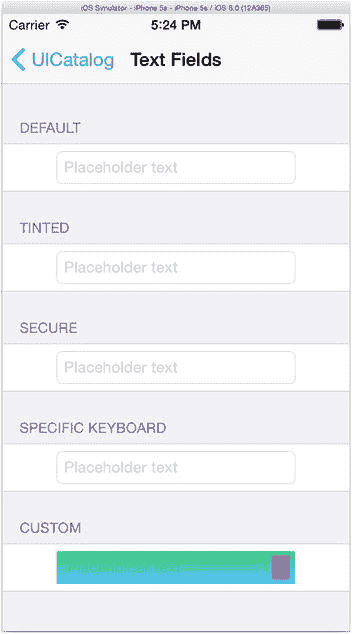

图 10-12. 文本字段

让我们从字段的外观开始。有四种样式（`UITextBorderStyle`）可供选择，由`borderStyle`属性控制。

*   `.RoundedRect`：在字段周围绘制一个简单的圆角矩形
*   `.Line`：在字段周围绘制一个细灰色矩形
*   `.Bezel`：用凿形边框包围字段，营造出字段内嵌的错觉
*   `.None`：不绘制边框

UICatalog 应用仅演示了圆角矩形和无样式，但另外两种并不难想象。通过将`background`属性设置为你自己的`UIImage`，可以提供更加醒目的外观。`background`属性会覆盖`borderStyle`属性。换句话说，你不能为凿形边框提供背景图像；如果你想要那种外观，你的图像需要包含凿形边框。

`placeholder`属性会在字段为空时显示一个字符串（浅灰色）（参见图 10-12）。使用此属性来提示用户（例如“在此处输入您的姓名”）或可能显示一个默认值。如果你希望在用户开始输入之前自动清除字段中的文本，请将`clearsOnBeginEditing`设置为`true`。

字段中文本的字型、大小、样式和颜色可以通过设置`font`和`textColor`属性或使用属性文本字符串来控制。后者要复杂得多，但也相应地更加灵活。

你还可以在三个不同的位置插入附属视图。使用这些视图来添加额外的控件或指示器，例如弹出字段选项集的按钮或进度指示器。附属视图属性如下：

*   `leftView`和`leftViewMode`
*   `rightView`和`rightViewMode`
*   `inputAccessoryView`

左视图和右视图可以是任何适合文本字段内部的`UIView`对象。UICatalog 应用通过在自定义文本字段的`rightView`中放置一个紫色`UIButton`（参见图 10-12）并在`leftView`中插入一个小（不可见）`UIView`来演示这一点；后者仅用于在左侧创建一些内边距。左右视图的外观由其伴随的`rightViewMode`和`leftViewMode`属性控制。每个属性可以设置为从不显示视图、始终显示视图、仅在编辑时显示视图或仅在非编辑时显示视图。

输入附属视图不会附加到文本字段上。相反，它会附加到用户开始编辑时出现的虚拟键盘的顶部。你可以使用输入附属视图为用户键盘添加特殊控件、预设、选项等。

文本字段会发送各种事件。最有用的是“编辑结束并退出”事件（`.EditingDidEndOnExit`），当用户停止编辑字段时发送；以及“值已更改”事件（`.ValueChanged`），每当字段中的文本被修改时发送。你在 MyStuff 应用中为这两个事件都连接了操作。要接收更多与编辑相关的消息并施加一些编辑控制，可以为文本字段创建委托对象（`UITextFieldDelegate`）。委托在编辑开始和结束时接收消息，并且还可以控制是否允许开始编辑、是否允许结束编辑或是否允许进行特定更改。

### 文本编辑行为


影响文本字段编辑方式的属性多得令人眼花缭乱。如果你查阅 `UITextField` 的文档，是找不到这些属性的。因为它们定义在 `UITextInput` 和 `UITextInputTraits` 协议中，而 `UITextField` 和 `UITextView` 都遵循了这些协议。属性和选项的数量几乎让人应接不暇，因此我将重点内容列在了表格 10-3 中。

表格 10-3. 重要的文本编辑属性

| 属性 | 描述 |
| --- | --- |
| `autocapitalizationType` | 控制自动大写模式：关闭，或对句子、单词、字符进行大写。 |
| `autocorrectionType` | 打开或关闭自动更正。 |
| `spellCheckingType` | 打开或关闭拼写检查、建议和字典查找。 |
| `keyboardType` | 选择要使用的虚拟键盘（普通、URL、纯数字、电话拨号、电子邮件地址、Twitter 等）。 |
| `returnKeyType` | 如果键盘有“执行”键，此属性决定其标签如何显示：前往、Google、加入、下一步、路线、搜索、发送、Yahoo!、完成或紧急呼叫。 |
| `secureEntry` | 用户在输入时隐藏字符，以防止旁观者看到内容。请为敏感信息（如密码）设置此选项。 |

### 文本视图

文本视图（`UITextView`）对象是标签和文本字段的综合体，如图 10-13 所示。`UITextView` 并非两者的子类，但它本质上继承了它们的功能，并增加了一些自身特有的特性。文本视图是否可编辑由其 `editable` 属性控制。

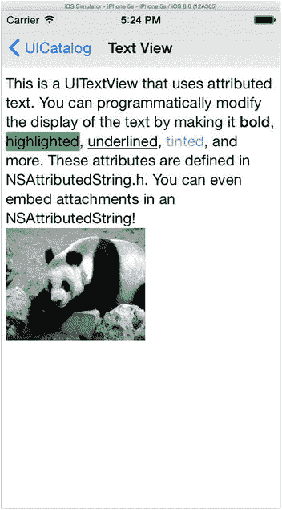

图 10-13. 一个文本视图

当 `editable` 设置为 `false` 时，文本视图的行为很像一个多行标签。它可以显示多种字体、大小和样式的多行文本，并控制换行。此外，它还增加了一些额外功能：滚动、选择和数据检测器。

与标签不同，如果文本在视图的垂直空间内显示不下，用户可以在视图中滚动文本以查看其余部分。你在 Surrealist 应用中就使用过此功能。

用户可以在文本视图中选择文本（通过触摸并长按文本），除非 `selectable` 属性设置为 `false`。选中的文本可以复制到剪贴板，或用于在字典中查找单词。此外，你还可以启用数据检测器。*数据检测器*是一种技术，能够识别特定文本的用途（例如电话号码或某人的电子邮件地址）。然后用户可以轻点该文本以执行有用的操作（拨打电话、撰写新邮件等）。

当 `editable` 属性设置为 `true` 时，文本视图就变成了一个（微型）文字处理器。用户可以随心所欲地输入、选择、剪切、复制和粘贴。所有在“文本字段”部分描述的编辑功能和选项都适用于文本视图。唯一缺少的大概就是边框了；文本视图不会绘制边框。

文本视图还能够编辑带样式（属性化）的文本，但你需要提供额外的用户界面元素，让用户能够选择字体、字号、样式、颜色等。文本视图会处理将这些样式应用于用户输入内容的机制，但你的控制器需要告诉文本视图这些样式是什么。

在以下情况下使用文本视图，而不是标签或文本字段：

*   用户需要编辑多行文本。
*   文本内容超过视图的显示范围，并且你希望它可以滚动。
*   你希望用户能够选择、复制文本或查找定义。
*   你希望使用数据检测器。

## 搜索栏

还有一些特殊的文本字段。`UISearchBar` 视图提供了一个专门用于执行搜索的文本字段。UICatalog 应用清晰地演示了将搜索栏嵌入设计中的常见方式。我在此总结一下你的选项。

你可以单独使用 `UISearchBar`，将其放置在任意视图中。第一个示例演示了标准搜索栏的外观和感受（参见图 10-14 中间的图片）。基本的搜索栏包含一个内嵌的文本字段，预先填充了一个搜索图标（以便用户知道它的用途）和一个取消按钮。

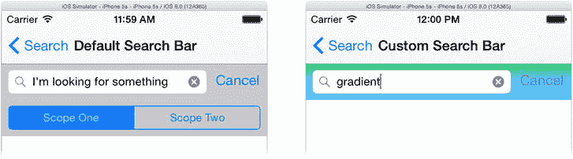

图 10-14. 独立的搜索栏视图

你可以选择在搜索字段下方显示一个分段控件，允许用户从一组选项中进行选择。通过将 `showScopeBar` 属性设置为 `true`，然后在 `scopeButtonTitles` 属性中设置两个或更多按钮标题，即可启用此功能。

第二个演示，如图 10-14 右侧所示，展示了一些通过自定义背景、不同的搜索栏样式（`UIBarStyle`）、彩色按钮等方式改变搜索栏外观的方法。

接下来的三个演示展示了如何将搜索栏集成到导航栏或表视图中。iOS 8 添加了几种新的方式，可以将搜索栏无缝集成到这些其他元素中。

首先，按需显示搜索栏。在这种技术中，搜索栏保持隐藏状态（如图 10-15 左上角所示），直到用户轻点搜索图标。然后搜索栏会覆盖在导航栏之上，替换掉导航栏，直到被关闭（参见图 10-15 左下角的图片）。其优点是，在用户需要之前，搜索功能不会占用任何明显的屏幕空间。缺点是，一旦召唤出来，它就会遮挡住导航栏，直到被关闭。

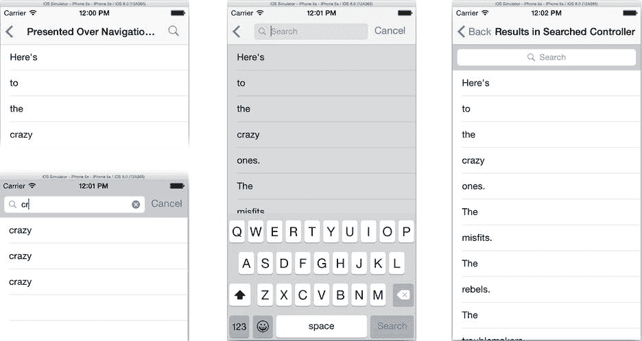

图 10-15. 导航栏和表视图中的搜索栏

第二种技术是将搜索栏直接嵌入导航栏中，使其始终可见，如图 10-15 中间所示。搜索栏清晰可见并立即可用，但会永久取代导航栏的标题。

最后一个示例演示了如何将搜索栏嵌入到表视图中，而不是导航栏中，如图 10-15 右侧所示。使用此方法可以在不干扰导航栏的情况下，或者在没有导航栏时，提供一个持久的搜索栏。

与 `UIPickerView` 类似，`UISearchBar` 不是 `UIControl` 的子类，因此不会发送动作消息。你应该创建一个 `UISearchBarDelegate` 对象来接收用户的输入及相关事件。

## 选择器

*选择器* 是一种用户界面，允许用户从一组有限的选项中做出选择。你在 MyStuff 应用中使用图片选择器从照片库中选择图片，在 DrumDub 应用中使用媒体选择器从 iTunes 库中选择歌曲。这些都是占用整个用户体验的大型界面。

iOS 还提供了几个较小的选择器视图对象。有专门用于选择日期和时间的 `UIDatePicker`，以及可用于其他所有用途的可定制 `UIPickerView`。两者都提供一个包含多个垂直“滚轮”的视图，用户可通过旋转滚轮来选择所需的值或项目，如图 10-16 所示。

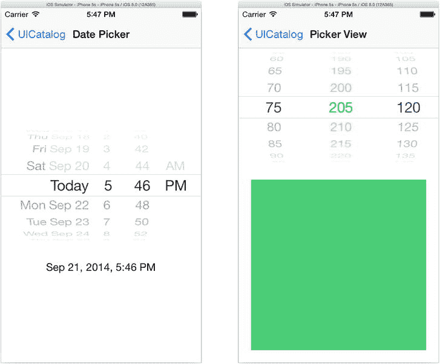

图 10-16. 选择器视图

### 日期选择器


请使用日期选择器让用户选择日期、时间或时长。日期选择器有四种不同的界面，由其`datePickerMode`属性控制。该属性可设置为表 10-4 中列出的四个值之一。

表 10-4. 日期选择器模式 (`UIDatePickerMode`)

| 模式 | 描述 |
| --- | --- |
| `.Time` | 选择一天中的时间。 |
| `.Date` | 选择一个日历日期。 |
| `.DateAndTime` | 选择日期和时间。 |
| `.CountDownTimer` | 选择时长（小时和分钟）。 |

选择器的`date`属性会报告用户选中的值。设置它会改变视图中的日期/时间。如果希望设置`date`并使“滚轮”旋转到新位置，请调用`setDate(_:, animated:)`。使用纯日期界面时，`date`属性的时间部分为`0:00`。类似地，使用纯时间或时长界面时，`date`属性的日历日期部分无意义。

如果希望限制用户可选择的值的范围，请设置`minimumDate`和/或`maximumDate`属性。例如，要强制用户选择未来的某一天，请将`minimumDate`设置为明天。

还可以通过`minuteInterval`属性来降低时间选择的粒度。当设置为`1`时，用户可以以一分钟为增量选择任意时间或时长（2:30、2:31、2:32，依此类推）。将`minuteInterval`设置为`5`会将用户的选择范围缩小为五分钟间隔（2:30、2:35、2:40、2:45，依此类推）。

**注意** `minuteInterval`的值必须能被 60 整除，且不能超过 30。

如果你计划使用日期选择器，并且界面在时间流逝时仍保持选择器可见，Apple 建议实时更新选择器。例如，如果你的界面使用了时长选择器和一个开始按钮，按下开始按钮可能会触发应用中的某个计时器开始倒计时。在此期间，你的应用应定期更新选择器，使其随着时间倒计到零而缓慢（每分钟一次）变化。

通用选择器

如果你不需要选择日期或时间呢？如果你需要选择冰淇淋口味、汽车型号或死对头呢？`UIPicker`对象是通用的选择器视图。它的外观和功能与日期选择器非常相似，只不过你可以自定义滚轮以及每个滚轮的内容（如图 10-16 右侧所示）。UICatalog 中的这个自定义选择器允许用户通过在每个滚轮上为红、绿、蓝颜色分量选择一个值来“拨入”一种颜色。

`UIPicker`使用的委托和数据源机制与表视图惊人地相似（第 5 章）。`UIPicker`需要一个委托对象（`UIPickerDelegate`）和一个数据源对象（`UIPickerDataSource`）。选择器的数据源确定滚轮（称为*组件*）的数量以及每个滚轮上选项（称为*行*）的数量。委托对象为每个选项提供标签。至少，你必须实现以下`UIPickerDataSource`函数：

```
numberOfComponentsInPickerView(_:) -> Int
pickerView(_:, numberOfRowsInComponent:) -> Int
```

并且必须实现*一个*以下`UIPickerDelegate`函数：

```
pickerView(_:, titleForRow:, forComponent:) -> String
pickerView(_:, attributedTitleForRow:, forComponent:) -> NSAttributedString
pickerView(_:, viewForRow:, forComponent:, reusingView:) -> UIView
```

**提示** 大多数情况下，单个对象既是选择器的委托又是数据源，此时两个协议之间的功能划分无关紧要。

第一个数据源函数告诉你的选择器它有多少个滚轮。然后，第二个函数为每个滚轮调用一次；它返回该滚轮中的行数。

最后（与表视图数据源非常相似），一个委托函数返回每个滚轮中每行的标签。根据你想要每行内容的复杂程度，你有三种实现函数的选择。

*   实现`pickerView(_:, titleForRow:, forComponent:)`来显示纯文本标签。你的函数为每一行返回一个简单的字符串值。这是最常见的做法。
*   实现`pickerView(_:, attributedTitleForRow:, forComponent:)`来显示包含特殊字体或样式的标签。你的函数为每一行返回一个属性字符串，允许每行混合使用字体、大小和样式。这是 UICatalog 中使用的技术。它巧妙地创建了一个属性字符串，其文本颜色与该行颜色分量的强度相匹配。
*   实现`pickerView(_:, viewForRow:, forComponent:, reusingView:)`来在行中显示任何你想要的视图。你的函数返回一个`UIView`对象，然后用它来绘制该行。

最后一个函数最类似于表视图使用单元格对象的方式。对于选择器，你可以为每一行提供不同的`UIView`对象，或者反复重用单个`UIView`对象。没有像表视图中那样的行单元缓存。相反，上次返回的`UIView`会在下次调用`pickerView(_:, viewForRow:, forComponent:, reusingView:)`时传递给委托。如果你重用单个`UIView`对象，请修改该视图并再次返回它。如果不是（或者`view`参数为`nil`），则返回一个新的视图对象。

如果你想控制每个滚轮的宽度或滚轮中每行的高度，请分别实现可选的`pickerView(_:, widthForComponent:)`或`pickerView(_:, rowHeightForComponent:)`函数。

`UIPickerView`对象不是控件对象；它们不是`UIControl`的子类，也不发送动作消息。相反，当用户更改某个滚轮时，选择器的委托会收到一个`pickerView(_:, didSelectRow:, inComponent:)`函数调用。

图像视图

您已经使用过足够的图像视图来了解它们的基本用法。不过，我还是想提几个属性。第一个是`contentMode`。此属性控制图像（其大小可能与视图不同）的排列方式。选项列于表 10-5 中。

表 10-5. 视图内容模式

| 模式 (`UIViewContentMode`) | 描述 |
| --- | --- |
| `.ScaleToFill` | 拉伸或挤压图像以精确填充视图。如果视图的宽高比与图像不同，可能会扭曲图像。 |
| `.ScaleAspectFit` | 缩放图像，不扭曲，使其刚好适配视图内部。视图的某些部分可能不包含任何图像（类似于信箱模式）。 |
| `.ScaleAspectFill` | 缩放图像，不扭曲，使其完全填充视图。图像的部分内容可能会被裁剪。 |
| `.Center` | 居中显示图像，不缩放。 |
| `.Top`、`.Bottom`、`.Left` 或 `.Right` | 图像某一边缘的中点与视图的对应边缘对齐。图像不缩放。在其他三个方向上，图像可能未填满视图或被裁剪。 |
| `.TopLeft`、`.TopRight`、`.BottomLeft` 或 `.BottomRight` | 图像的一个角与视图的同一个角对齐。图像不缩放。图像可能未填满整个视图，如果溢出则会被裁剪。 |

**注意** `contentMode`属性实际上定义在`UIView`类中，但它与`UIImageView`尤其相关。


`UIImageView` 还有一个奇特的功能：它可以快速显示一系列图像（如同翻页书或极短的电影），也可以慢速显示（如同幻灯片），如图 10-17 所示。将你想要显示的图像放入一个数组，并用该数组设置 `animationImages` 属性。设置 `animationDuration` 以及可选的 `animationRepeatCount`，可以控制每帧的速度以及整个序列播放的次数。（将 `animationRepeatCount` 设置为 `0` 可无限循环播放。）

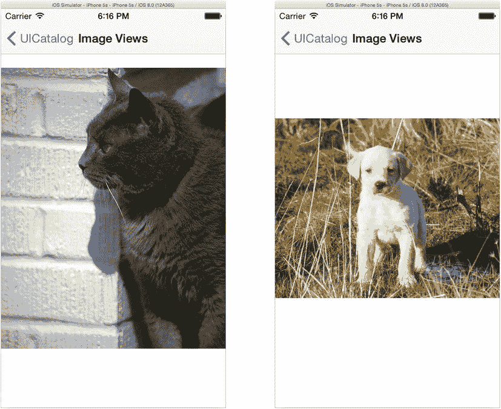

图 10-17。图像视图幻灯片

设置完成后，调用视图的 `startAnimation()` 函数即可开始播放，调用 `stopAnimation()` 即可停止播放。演示此功能的代码位于 `ImageViewController.swift` 文件的 `configureImageView()` 函数中。

## 分组表格

第 5 章 提到过你可以创建分组表格视图，就像设置应用中使用的那种。不过，我当时并没有实际演示如何操作。你已经掌握了所有基础知识，但如果你想找一个具体示例，不妨直接查看 UICatalog 项目。许多示例视图（活动指示器、按钮、文本字段和分段控件）都呈现在分组表格视图中。每个分组都是一个独立的示例。

UICatalog 中的 `Main.storyboard` 文件使用了我在第 5 章 中提到的静态表格单元格方法。如果你查看文本字段场景的表格视图，如图 10-18 所示，你会发现所有单元格及其分组都是直接在 Interface Builder 中设计好的。

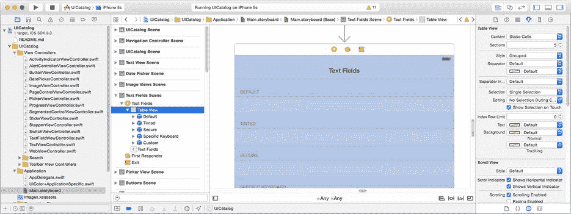

图 10-18。带分组的静态设计表格

也可以通过编程方式构建分组表格。你的表格委托只需提供分组信息，就像提供行数和单元格一样。以下是需要编写的委托函数：

```
numberOfSectionsInTableView(_:) -> Int
tableView(_:,titleForHeaderInSection:) -> String
tableView(_:,numberOfRowsInSection:) -> Int
```

## 你永远看不到的视图

以上涵盖了 iOS 中大部分重要的视图对象。我将在第 12 章 中稍微讨论一下工具栏，并在第 11 章 中详细讨论 `UIView`。但我还想提一个特殊的视图——它被广泛使用，但你却永远看不到它。

它就是 `UIScrollView` 类。滚动视图为你的界面添加了滚动功能。你永远看不到滚动视图本身；你看到的是它的效果。滚动视图的工作原理是在较小的视图中呈现一个较大的视图。其效果就像拥有一个通往较大视图的窗口。当你在窗口内拖拽时，你实际上是在“滑动”背后的视图，以便看到它的不同部分，如图 10-19 所示。

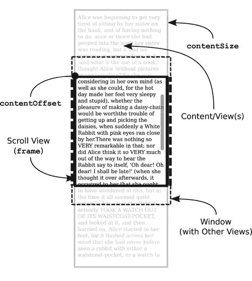

图 10-19。滚动视图的概念性布局

最容易理解的方式是将滚动视图视为二合一的视图。对于大多数视图对象来说，其内容的大小（称为*边界*）与其在界面中占据的大小（称为*框架*）是相同的。因此，一个 30x100 像素的视图（比如按钮）将在界面中占据一个 30x100 像素的区域。

滚动视图打破了这种关系。滚动视图有一个特殊的 `contentSize` 属性，它与它的框架大小是分离的。它的框架变成了出现在你界面中的“窗口”。`contentSize` 定义了视图的逻辑大小，只有一部分通过窗口可见。

`contentOffset` 属性决定了具体哪一部分可见。该属性是内容区域中出现在框架左上角的点——即用户可见的部分。`contentOffset` 初始值为 `0,0`。这将内容的左上角置于框架的左上角。随着 `contentOffset` 向下移动，内容看起来向上滚动，始终保持 `contentOffset` 点位于框架的左上角。

表格视图、网页视图和文本视图都提供了滚动功能，并且都是 `UIScrollView` 的子类。你可以自己创建 `UIScrollView` 的子类来定制支持滚动的自定义视图，或者直接使用 `UIScrollView` 对象，只需用你喜欢的任何子视图填充其内容视图即可。你甚至可以在一个滚动视图内部放置另一个滚动视图；这听起来很奇怪，但《iOS 滚动视图编程指南》中有关于如何实现这一点的说明。

学习滚动视图的一个绝佳起点是 PhotoScroller 示例项目。（截至撰写本文时，该项目仍使用 Objective-C 语言。）在 Xcode 的文档和 API 参考中搜索 PhotoScroller 示例代码项目，然后点击“打开项目”按钮。PhotoScroller 项目定义了一个 `UIScrollView` 的子类，用于显示、平移和缩放图像。该项目演示了滚动视图三大主要功能中的两个。

-   在较小的视图中滚动较大的内容视图
-   捏合和缩放内容视图
-   按“页”滚动

第一个是其基本功能。滚动视图最常用于此功能，包括表格视图、网页视图和文本视图。要以这种方式使用滚动视图，你无需创建子类或使用委托。只需用你想要显示的视图填充并调整其内容视图的大小，滚动视图就会让用户拖拽它。

滚动视图的第二个功能是对其内容视图进行捏合和缩放，因此它不仅能够滚动，还能放大和缩小内容，如图 10-20 所示。此功能需要使用滚动视图委托（`UIScrollViewDelegate`）对象。在 PhotoScroll 项目中，自定义的 `ImageScrollView` 是 `UIScrollView` 的子类，同时也是其自身的委托——这种设置虽然有点不寻常，但完全合理。`UIScrollView` 会处理触摸事件，并为你处理大部分的平移和缩放细节。

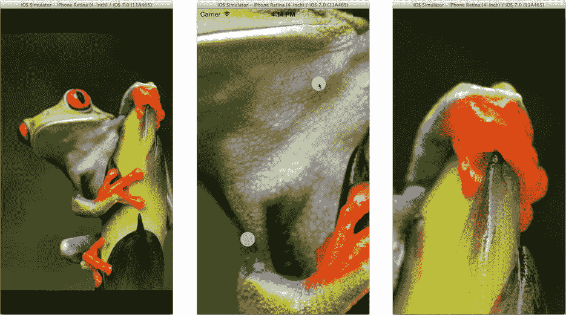

图 10-20。PhotoScroller 应用

你也可以通过编程方式滚动视图，只需将其 `contentOffset` 属性设置为你想要的内容视图中的任意点即可。如果你希望视图以动画方式移动到新位置，可以调用 `setContentOffset(_:,animate:)` 函数。

### 滚动视图与键盘

滚动视图可以包含文本字段——通常是通过将文本字段放在表格视图中间接实现，而你现在知道表格视图就是滚动视图。当键盘出现时，它可能会遮挡住用户想要编辑的文本字段。解决方案是让滚动视图向上滚动，使文本字段位于键盘上方可见。

为此，你的控制器需要监听键盘通知（例如 `UIKeyboardDidShowNotification`）。这些通知包含虚拟键盘在屏幕上的坐标。你利用这些信息来判断键盘是否遮挡了你的文本字段。如果是，则使用滚动视图的 `setContentOffset(_:,animate:)` 函数，使文本字段滚动到虚拟键盘上方的位置。

其具体机制在《iOS 文本、网页和编辑编程指南》中有描述，你可以在 Xcode 的文档中找到。请查找“管理键盘”章节中标题贴切的“移动位于键盘下方的内容”。


