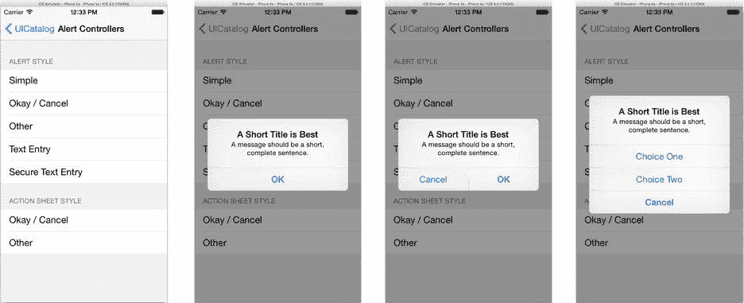
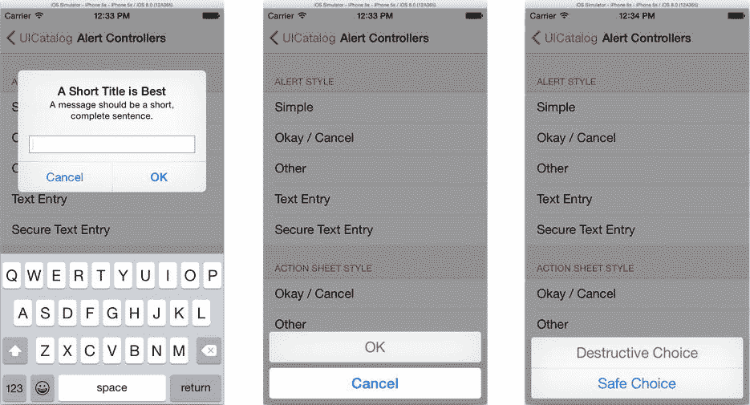

# 警告控制器（Alert Controllers）

警告控制器是`UICatalog`项目中的一个异类。它们出现在这里有点突兀，因为它们不是视图对象，而是视图控制器。接下来有一章关于视图控制器的精彩内容（第 12 章），所以我真的应该把警告控制器推迟到那时再讲。

但是，我不会这么做。原因是警告控制器——虽然它们是视图控制器——但非常特殊，你通常不会像使用其他视图控制器那样使用、呈现或适配它们。所以，趁你还在运行`UICatalog`项目，让我们现在就探索如何使用它。

警告控制器会挂起当前界面并呈现一个选择（通常是一个或两个按钮），用户必须点击该选择才能继续。你可以在图 10-21 和图 10-22 中看到示例。用户的选择会执行一个你提供的代码块，然后控制器被关闭。就这么简单。



图 10-21. 警告示例



图 10-22. 警告与操作表示例

`UIAlertController` 是 iOS 8 中的新类，它取代了现已弃用的 `UIAlertView` 和 `UIActionSheet` 类。这个新类极大地简化和统一了警报和操作表的呈现方式。

**注意**：你可能会遇到各种已弃用的类、属性或方法。API 会随着时间的推移而演变。当更好、更现代的功能被引入时，它们通常会取代旧的类和函数。这些旧的接口可能会被**弃用**，这意味着苹果现在不鼓励在新的开发中使用它们，并且苹果可能有一天会完全删除它们——届时你仍在使用它们的任何应用都将停止运行，或者至少无法编译。Swift 语言是随 iOS 8 一起引入的，没有针对已弃用函数的 Swift API。换句话说，你不能编写使用 iOS 7 或更早版本的过时类或方法的 Swift 代码。因此，在 iOS 历史的一个短暂时期内，Swift 程序员不必担心弃用功能，因为在 iOS 9 发布之前，这些不存在。

使用警告控制器很容易，你在本书中已经做过几次了。步骤如下：

1.  创建一个`UIAlertController`对象，选择一种首选样式，并可选择性地为其分配标题和消息。
2.  创建一个或多个`UIAlertAction`对象，并将它们添加到控制器中。
3.  可选地，设置控制器的任何特殊属性或添加文本字段。
4.  呈现控制器。

首选样式（`UIAlertControllerStyle`）决定了你希望警报如何呈现。你的选择是`.Alert`或`.ActionSheet`。这是一种“首选”样式，因为正如你将在第 12 章中看到的，演示控制器可能会决定以不同的方式呈现它——不过我先不深入了。

`.Alert`样式（在紧凑型设备上）显示为一个浮动窗口，如图 10-21 和图 10-22 左侧所示。`.ActionSheet`样式显示为一组位于界面底部的独立按钮，如图 10-22 中间和右侧所示。

*   当你需要引起用户注意（“发生了严重错误！”）、需要确认才能继续（“你确定要删除所有图片吗？”）或需要收集信息（“密码是什么？”）时，请使用警报。
*   当提供一系列可能操作的选择时（“跟随欧比旺”或“加入黑暗面”），请使用操作表。

`title`和`message`可以是任何你想要的内容，并且可以省略其中一个，但它们应该简短扼要。消息只在警报中呈现，操作表会忽略它。

**提示**：作为一条规则，尽量避免使用警报和操作表。不需要它们的界面几乎总是比需要的更容易使用。它们在紧急情况下非常有用，但过度使用像警报这样的模态界面是用户界面设计不佳的标志。

一旦决定了它的呈现方式，你需要添加一些操作。一个`UIAlertAction`对象代表界面中的一个选项。每个操作对象定义了将要出现的按钮文本、选择的类型，以及用户点击该按钮时要执行的代码块。你在第 7 章的`MyStuff`应用中做到了这一点，所以让我们再看一下那段代码。

```swift
let alert = UIAlertController(title: nil,
                               message: nil,
                        preferredStyle: .ActionSheet)
alert.addAction(UIAlertAction(title: "Take a Picture",
                               style: .Default,
                             handler: { (_) in
                                 self.presentImagePicker(.Camera)
                                 }))
alert.addAction(UIAlertAction(title: "Choose a Photo",
                               style: .Default,
                             handler: { (_) in
                                 self.presentImagePicker(.PhotoLibrary)
                                 }))
alert.addAction(UIAlertAction(title: "Cancel",
                               style: .Cancel,
                             handler: nil))
presentViewController(alert, animated: true, completion: nil)
```


这段代码严格遵循了公式。它创建了一个 `UIAlertController` 对象。操作表没有标题，因为选项的含义不言自明。它创建了三个操作按钮：拍照、选取照片和取消。然后，它呈现了视图控制器。

每个操作都有一种样式。你的选择有 `.Default`、`.Destructive` 和 `.Cancel`。默认样式呈现一个普通按钮。“破坏性”样式呈现一个醒目的红色按钮，仅应用于会产生负面后果的选项。“取消”样式则比较特殊，应分配给那个什么都不做的唯一操作（如果有的话）。取消操作可以包含一个处理程序块，但如果无需执行任何操作，则不必提供。在某些情况下（同样，你将在第 12 章中了解到），警告框或操作可能会以不同的形式呈现。例如，它可能在 iPad 或类似设备上的弹出窗口中呈现。在这种情况下，取消按钮可能会被省略，因为在弹出窗口外部点击就隐含着取消操作。

最后，在呈现警告控制器之前，你还可以对其设置一些特殊选项。最值得注意的是，警告框也可以呈现一个或多个文本输入字段，如图 10-22 左侧所示。你通过调用 `addTextFieldWithConfigurationHandler(_:)` 函数来添加这些字段。警告控制器会负责创建并插入文本字段，然后你的配置处理程序块将有权限根据应用的需求进行任何额外的调整。在 `AlertControllerViewController.swift` 文件中找到 `showSecureTextEntryAlert(_:)` 函数。你会看到以下代码：

```
let alertController = UIAlertController(title: title,
                                      message: message,
                               preferredStyle: .Alert)
alertController.addTextFieldWithConfigurationHandler { textField in
    textField.secureTextEntry = true
    }
```

创建警告控制器后，它请求添加一个文本字段。字段添加后，配置处理程序块将其 `secureTextEntry` 属性设置为 `true`，使其适用于密码或其他敏感文本。

