# 为我画一幅画

你已经到达了掌握 iOS 开发的一个关键点。在向应用添加现有视图对象方面，你已积累了相当丰富的经验。你让它们显示你的数据，将它们连接到你的自定义控制器逻辑，并自定义了它们的外观和感觉。但你仍然局限于苹果为你编写的视图类。没有什么可以替代创建你自己的视图对象——一个能够绘制出别人未曾想象过的东西的对象。

好吧，这话不完全正确。你确实创建过自定义视图对象，但在这两种情况下，我都忽略了它们是如何工作的。相反，只附带了一条小注释：“请忽略幕后的视图；一切将在第 11 章中解释。”欢迎来到第 11 章！在本章中，你将（更多地）了解以下内容：

*   创建视图子类
*   视图几何学
*   视图的绘制方式与时机
*   Core Graphics
*   Bézier 路径
*   动画
*   手势识别器
*   离屏绘制

本章会有点技术性，但我认为你已经准备好了。

### 创建自定义视图类

你可以通过继承 `UIView` 或 `UIControl` 来创建自定义视图，具体取决于你的意图是创建一个显示对象，还是创建一个类似于控件（例如一种新型开关）的东西。在本章中，你只会继承 `UIView`。

**警告** 不要为了“摆弄” `UIButton` 或 `UISwitch` 等具体视图类的功能而去继承它们。这将是灾难的根源。它们的内部工作机制并未公开，并且经常随 iOS 版本更新而改变，这意味着你的类可能在不久的将来就无法正常工作。设计用于被继承的视图类，如 `UIControl`，都有清晰的文档说明，通常在其文档中有一个名为“Subclassing Notes”的章节。

要创建你自己的视图类，你需要理解三点。

*   视图坐标系
*   用户界面更新事件
*   如何在 Core Graphics 上下文中进行绘制

让我们从字面上理解——从顶部开始。

#### 视图坐标

设备的屏幕、窗口和视图都有一个图形*坐标系*。坐标系确定了你在设备上看到的一切物体（屏幕、窗口、视图、图像和形状）的位置和大小。每个视图对象都有自己的坐标系。坐标系的远点位于其左上角，坐标为 (0,0)，如图 11-1 所示。

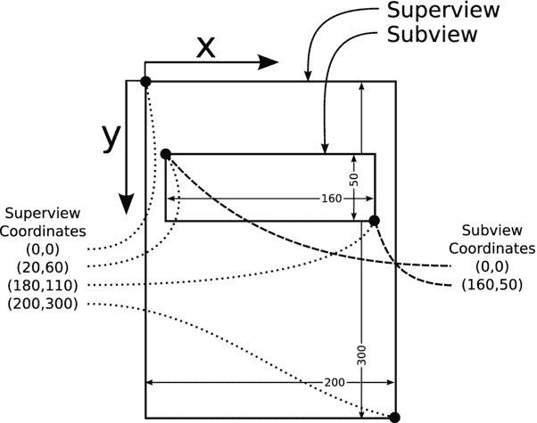

图 11-1. 图形坐标系

X 坐标向右增加，Y 坐标向下增加。Y 轴与你上学时学到的（或者闲暇时阅读几何书了解的）笛卡尔坐标系是上下颠倒的。对于计算机程序来说，这种排列更方便；大多数内容从左上角“流动”，因此从左上角进行计算通常比从左下角计算更简单。

**注意** 如果你做过任何 OS X 编程，你会注意到 iOS 和 OS X 的视图对象有很多相似之处。然而，从 OS X 的角度来看，iOS 没有翻转坐标——它们始终是翻转的。

在 iOS 中，有四种用于描述坐标、位置、大小和区域的关键类型，全部在表 11-1 中进行了描述。

表 11-1. 坐标值类型

| 类型 | 描述 |
| --- | --- |
| `CGFloat` | 基本的标量值。`CGFloat` 是一种浮点类型，用于表示单个坐标或距离。 |
| `CGPoint` | 一对 `CGFloat` 值，用于指定坐标系中的一个点 (`x`,`y`)。 |
| `CGSize` | 一对 `CGFloat` 值，用于描述某物的尺寸 (`width`,`height`)。 |
| `CGRect` | 一个点 (`CGPoint`) 和一个尺寸 (`CGSize`) 的组合，共同描述一个矩形区域。 |

#### 框架与边界

视图对象有两个矩形 (`CGRect`) 属性：`bounds` 和 `frame`。`bounds` 属性描述了对象的坐标系。该视图的所有图形内容（包括任何子视图）都使用此坐标系。真正重要的是要理解，视图内容的所有绘制都是由该视图自身执行的，并且是使用该视图的坐标系来完成的——这通常被称为其*局部坐标*。


#### 移动视图

在视图中移动视图（在其父视图内）不会改变视图的坐标系。该视图对象内的所有图形元素相对于其原点（左上角）保持位置不变。在图 11-1 中，子视图尺寸为宽 160 点、高 50 点。因此，其`bounds`矩形为`((0,0),(160,50))`；原点坐标(x,y)为`(0,0)`，尺寸(宽度,高度)为`(160,50)`。当子视图进行绘制时，它会在该矩形范围内进行。

`frame`属性以父视图的坐标系来描述视图。换句话说，`frame`表示子视图在另一个视图中的位置——通常称为*父视图坐标*。在图 11-1 中，子视图的原点为`(20,60)`。视图尺寸为`(160,50)`，因此其`frame`为`((20,60),(160,50))`。如果视图向下移动 10 点，其`frame`将变为`((20,70),(160,50))`。视图绘制的一切内容都会向下移动 10 点，但这不会改变视图的`bounds`或视图内部绘制内容的相对坐标。

`bounds`与`frame`的尺寸是关联的。改变`frame`的尺寸会改变其`bounds`的尺寸，反之亦然。若图 11-1 中子视图的`frame`变窄 60 点，其`frame`将变为`((20,60),(100,50))`。这一变化会使其`bounds`变为`((0,0),(100,50))`。同样地，若`bounds`从`((0,0),(160,50))`改为`((0,0),(100,40))`，则`frame`会自动变为`((20,60),(100,40))`。

**注意**  “`frame`的尺寸始终等于`bounds`的尺寸”这一规则存在少数例外。你已见过一个例外：滚动视图。滚动视图内容（`bounds`）的尺寸由其`contentSize`属性控制，该属性独立于其帧尺寸（即屏幕显示部分）。其他例外发生在应用变换时，我将在后文讨论。

`UIView`还提供了一个合成的`center`属性。该属性返回视图`frame`矩形的中心点。从技术上讲，`center`始终等于`(frame.midX, frame.midY)`。若改变`center`属性，视图的`frame`将被移动，使其居中于该点。`center`属性便于在不调整尺寸的情况下移动和居中子视图。你将在本章后续内容中使用此功能。

#### 坐标系转换

你可能需要一段时间——我当年也花了很久——才能掌握不同坐标系的区别，并学会何时使用`bounds`、何时使用`frame`，以及如何在两者之间转换。以下是几条快速记忆的规则：

*   `bounds`是视图的*内部坐标*：即视图内部所有内容的坐标。
*   `frame`是视图的*外部坐标*：即该视图在其父视图中的位置。

如需进行坐标系转换，有以下多种函数可用。最常用的四个是表 11-2 列出的`UIView`函数。举例来说，假设你已知图 11-1 中子视图右下角在其本地坐标系中的坐标为`(160,50)`。若想获取同一点在父视图坐标系中的坐标，可调用函数`superview.convertPoint(CGPoint(160,50), fromView: subview)`。该语句将返回点`(180,110)`，即同一坐标点在父视图坐标系中的表示。

表 11-2 `UIView`中的坐标转换函数

| `UIView`函数 | 描述 |
| --- | --- |
| `convertPoint(_:, toView:)` | 将视图本地坐标系中的点转换为另一视图本地坐标系中的同一点 |
| `convertPoint(_:, fromView:)` | 将另一视图坐标系中的点转换为此视图的本地坐标系 |
| `convertRect(_:, toView:)` | 将视图本地坐标系中的矩形转换为另一视图本地坐标系中的同一矩形 |
| `convertRect(_:, fromView:)` | 将另一视图坐标系中的矩形转换为此视图的本地坐标系 |

此外，所有传递坐标的事件相关类都会以特定视图的坐标系报告坐标。例如，`UITouch`类没有`location`属性，而是提供了`locationInView(_:)`函数，用于将触摸点转换为当前操作视图的本地坐标。

#### 视图的绘制时机

在第 4 章中，你了解到 iOS 应用是事件驱动的程序。用户界面的刷新（即程序员所说的屏幕绘制）同样由事件循环触发。当视图需要绘制内容时，它并不会立即绘制，而是先记录下待绘制的内容，然后请求绘制事件消息。当应用的事件循环决定更新显示时，它会向所有需要重绘的视图发送用户界面更新消息。因此，视图的绘制生命周期遵循以下模式：

1.  更改待绘制的数据。
2.  调用视图对象的`setNeedsDisplay()`函数。这会将视图标记为需要重绘。
3.  当事件循环准备更新显示时，iOS 会调用视图的`drawRect(_:)`函数。

你通常无需调用其他视图的`setNeedsDisplay()`函数。大多数视图在自身发生变化（需重新绘制时）会自动发送该消息。例如，当你设置`UILabel`对象的`text`属性时，标签对象会调用自己的`setNeedsDisplay()`以使新标签显示出来。同理，当视图发生需要重绘自身的变更（如被添加到新的父视图）时，该视图会自动获得`setNeedsDisplay()`调用。

但这并不意味着视图的每次变化都会触发`drawRect(_:)`调用。当视图绘制自身时，生成的图像会被 iOS 保存或*缓存*——就像拍了一张快照。不影响该图像的变更（例如仅移动视图在屏幕上的位置，而不改变其尺寸）不会导致额外的`drawRect(_:)`调用；iOS 只需重复使用已有的视图快照即可。

**注意**  传递给`drawRect(rect:)`函数的`rect`参数是视图中需要重绘的部分。大多数情况下，它等同于`bounds`，这意味着你需要重绘全部内容。在极少数情况下，它可能是更小的区域。大多数`drawRect(rect:)`函数对此并不特别关注，而是直接绘制整个视图。绘制超出需求的范围不会产生问题；但绘制不足则会造成显示缺失。如果你的绘制代码非常复杂且耗时，可以尝试仅更新`rect`参数指定区域以节省时间。

现在你已经了解了视图绘制自身的时机和原因，接下来只需了解绘制方法。

#### 绘制视图

当视图对象收到`drawRect(_:)`调用时，它必须进行自我绘制。简单来说，iOS 会准备一块“画布”，由你的视图对象进行“绘画”。最终生成的杰作将被 iOS 用于在屏幕上呈现该视图——直到需要再次重绘为止。


你的“画布”是一个 `Core Graphics` 上下文，也称为你的*当前上下文*或简称*上下文*。它本身不是一个对象，而是一个在你的对象的 `drawRect(_:)` 函数被调用前预先准备好的绘图环境。当你的 `drawRect(_:)` 函数执行时，你的代码可以使用任何 Core Graphics 绘图例程来“绘制”到这个准备好的上下文中。该上下文在你的 `drawRect(_:)` 函数返回之前一直有效，之后便会消失。

**警告** 你的视图的 Core Graphics 上下文仅在 iOS 调用你的 `drawRect(_:)` 函数时才存在。因此，你永远不应调用视图的 `drawRect(_:)` 函数，也绝不要在 `drawRect(_:)` 函数之外使用任何 Core Graphics 绘图函数。（“离屏”绘图是个例外，我将在本章末尾介绍）。

对于大多数面向对象的绘图函数，当前上下文是隐含的。也就是说，你调用一个绘制函数（`myShape.fill()`），该函数就会在当前上下文中绘制。如果你使用任何 C 语言的绘图函数，则需要获取当前上下文的引用，并将其作为调用的第一个参数传入，如下所示：

```
let currentContext = UIGraphicsGetCurrentContext()
CGContextSetAlpha(currentContext, 0.5)
```

绘图的许多细节是由当前上下文的状态隐含决定的。上下文*状态*包括在该上下文中绘图时将要使用的所有设置和属性。这包括填充形状的颜色、线条颜色、线条宽度、混合模式、裁剪区域等等。

你无需为每个操作（比如绘制一条线）都指定所有这些变量，而是先为每个属性设置好状态。假设你想绘制一个形状（`myShape`），用红色填充，并用黑色绘制其轮廓。

```
redColor.setFill()
blackColor.setStroke()
myShape.fill()
myShape.stroke()
```

`setFill()` 和 `setStroke()` 函数设置了上下文中当前的填充和描边颜色。`fill()` 函数使用上下文的当前填充颜色，而 `stroke()` 使用当前的描边颜色。这种安排使得使用相同或相似的参数高效绘制多个形状或效果成为可能。

现在唯一剩下的问题是你有什么工具可以用来绘图。你的基本绘图工具如下：

- 简单的填充和描边
- 贝塞尔路径（填充和描边）
- 图像

听起来好像不多，但综合来看，它们具有非凡的灵活性。让我们从最简单的开始：填充函数。

### 填充和描边函数

Core Graphics 框架包含少量用于用颜色填充上下文区域的函数。两个主要的函数是 `CGContextFillRect` 和 `CGContextFillEllipseInRect`。前者用当前的填充颜色填充一个矩形。后者填充一个恰好内切于给定矩形的椭圆（如果矩形是正方形，则为一个圆）。

`CGContextFillRect` 经常用于在绘制视图细节之前填充整个视图的背景。`drawRect(_:)` 函数以类似这样的方式开头并不少见：

```
override func drawRect(rect: CGRect) {
    let context = UIGraphicsGetCurrentContext()
    backgroundColor.set()
    CGContextFillRect(context,rect)
```

这段代码首先获取当前上下文（调用 `CGContextFillRect` 时需要用到它）。然后获取该视图的背景颜色（`backgroundColor`），并将该颜色设为当前填充颜色。接着用该颜色填充视图需要绘制的部分（`rect`）。之后绘制的所有内容都将覆盖在用 `backgroundColor` 绘制的背景之上。

**提示** 在 Core Graphics 上下文中绘图，很像在真实的画布上绘画。每当你绘制一些东西时，你都是在之前绘制的内容之上进行覆盖。所以，就像绘画一样，你通常从用一种中性颜色覆盖整个表面开始——艺术家称之为*底色*。然后你在其上用不同的颜色和形状进行绘制，直到绘制完所有内容。

函数 `CGContextStrokeRect` 和 `CGContextStrokeEllipseInRect` 执行类似的功能，但它们不是填充矩形或椭圆内部，而是使用当前的线条颜色、线条宽度和线条连接样式，在矩形或椭圆的轮廓上绘制一条线。*描边*是用来描述绘制线条行为的术语。

### 贝塞尔路径

你会注意到，几乎没有任何 Core Graphics 函数是用来绘制真正简单的东西，比如直线。又或者，绘制 iOS 中随处可见的圆角矩形、三角形或任何其他形状呢？iOS 的设计者们没有为你提供无数个用于绘制每种形状的函数，而是为你提供了一个近乎神奇的工具，它能让你绘制所有这些甚至更多形状：贝塞尔路径。

贝塞尔路径以法国工程师皮埃尔·贝塞尔的名字命名，可以表示任何直线或曲线的组合，如图 11-2 所示。它既可以简单如一个正方形，也可以复杂如加拿大的海岸线。一个贝塞尔路径可以是封闭的（圆、三角形、饼图），也可以是开放的（一条线、一条弧线、字母 *W*）。

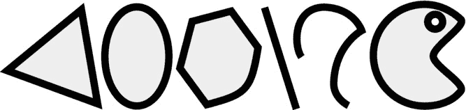

图 11-2。贝塞尔路径

你通过首先创建一个 `UIBezierPath` 对象来定义一个贝塞尔路径。然后通过添加直线和曲线线段来构建路径。构建完成后，你可以使用该路径对象通过绘制其内部（填充）、绘制其轮廓（描边）或同时进行两者来在上下文中绘图。你可以根据需要随意重用同一个路径。

**提示** 对于常见的形状，例如正方形、矩形、圆形、椭圆、圆角矩形和弧线，`UIBezierPath` 类提供了便捷的初始化方法，可以用一条语句创建一个具有该形状的贝塞尔路径。

为了向你展示创建路径是多么容易，你将编写一个在视图中绘制贝塞尔路径的应用。但在那之前，让我们简要谈谈视图内容的最后一个主要来源。

### 图像

图像就是图片，不需要过多解释。从第 2 章开始，你一直在使用图像（`UIImage`）对象。到目前为止，你将它们分配给 `UIImageView` 对象（和其他控件），由它们为你绘制图像。但 `UIImage` 对象也很容易绘制到你自己的视图上下文中。两个最常用的 `UIImage` 绘图函数是 `drawAtPoint(_:)` 和 `drawInRect(_:)`。第一个函数以原始大小将图像绘制到你的上下文中，其原点（左上角）位于给定的坐标。第二个函数将图像绘制到给定的矩形中，并根据需要缩放和拉伸图像。

当我说一个图像被“绘制”到你的上下文时，我实际上是在说它被复制了。图像是一个二维像素数组，而你的上下文画布也是一个二维像素数组。因此，实际上，“绘制”一幅图片不过是用图像中的像素覆盖视图像素的一部分。例外情况是具有透明像素的图像，或者你使用了非典型的混合模式，这两者我稍后会讲到。

本章稍后，我将通过重新审视你已经编写过的一个应用，详细解释如何在你的自定义视图中创建、转换和绘制图像。但在那之前，让我们先绘制一些贝塞尔路径。

## 形状优美的应用


您将创建一个应用，使用贝塞尔路径在自定义视图中绘制简单形状。通过几次迭代，您将扩展该应用以包含移动和调整大小手势，并学习变换和动画，同时掌握大量`UIView`和贝塞尔路径的精髓。应用设计非常简单，如图 11-3 所示。

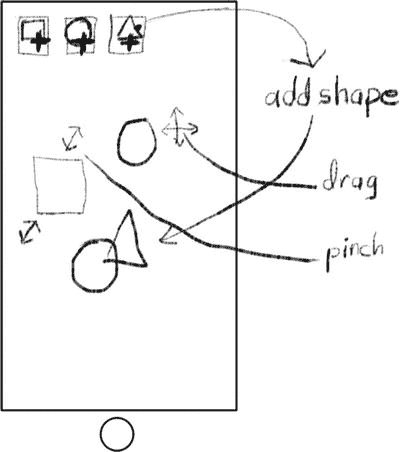

图 11-3. Shapely 应用设计

应用将有一排用于创建新形状的按钮。形状出现在中间区域，可以移动、调整大小和重新排序。首先创建一个新项目。在 Xcode 中，执行以下操作：

1.  基于单视图应用模板创建一个新项目。
2.  将项目命名为 `Shapely`。
3.  将语言设置为 `Swift`。
4.  将设备设置为 `Universal`。

接下来要创建自定义视图类。您已经多次执行此操作了。在项目导航器中选择 `Shapely` 组，选择新建文件（从文件菜单或按住 Control 键并右键单击该组），然后执行以下操作：

1.  从 iOS 组中选择 Swift 类模板。
2.  将文件命名为 `ShapeView`。
3.  将其添加到项目中。

### 以编程方式创建视图

在本应用中，您将以编程方式创建视图对象，而不是使用 Interface Builder。实际上，几乎所有内容都将以编程方式创建。到本章结束时，您应该能熟练掌握了。

创建任何对象时，都必须对其进行初始化。这通过使用类的*初始化函数*之一来完成。某些类（如 `NSURL`）提供了多种初始化方法，以便您以不同方式创建它们：`NSURL(string:)`、`NSURL(scheme:, host:, path:)`、`NSURL(string:, relativeToURL:)`、`NSURL(fileURLWithPath:)` 等等。其中一些初始化方法被称为*便捷初始化方法*，原因显而易见，它们使对象创建更加方便。

`UIView` 类有一个所谓的*指定初始化方法*。此初始化方法（`UIView(frame:)`）是您在构造 `UIView` 的子类时必须使用的。您的子类可以自由定义自己的初始化方法，但它必须调用指定初始化方法（通过 `super.init(frame:)`），以便正确设置 `UIView` 超类。

**注意**  `UIView` 类实际上有两个指定初始化方法。另一个用于创建在 Interface Builder 文件中定义的对象，这将在第 15 章中介绍。您在此处使用的指定初始化方法适用于以编程方式创建的 `UIView` 对象。

您将定义一个初始化方法来创建新的 `ShapeView` 对象，该对象将绘制特定的形状（正方形、圆形等）。对象的 frame 将设置为一个预定义的占位 frame，稍后您会重新定位它。因此，您需要一个自定义初始化函数，告诉新对象它将绘制哪种形状。您的视图将以特定颜色绘制其形状，因此您还需要一个用于存储其颜色的属性。首先编辑 `ShapeView.swift` 文件。将其修改为如下所示：

```
import UIKit

enum ShapeSelector: Int {
    case Square = 1
    case Rectangle
    case Circle
    case Oval
    case Triangle
    case Star
}

class ShapeView: UIView {
}
```

`enum` 语句创建了一个枚举，用于确定视图将绘制的形状。*枚举*是分配给名称的常量值序列。您列出名称，编译器会为每个名称分配一个值。在本例中，您指定该枚举与 `Int` 类型兼容，因此所有分配的值都将具有对应的整数——稍后您需要用到这一点。通常您不关心值是如何分配的，但对于本应用，您希望它们从 1 开始（`Square`=`1`，`Rectangle`=`2`，`Circle`=`3`，依此类推）。

下一句是重头戏；它声明了一个新类（`ShapeView`），该类是 `UIView` 的子类。您所有的工作都将在此进行。

首先添加一些属性（新代码以粗体显示）：

```
class ShapeView: UIView {
    let initialSize = CGSize(width: 100.0, height: 100.0)
    let alternateHeight: CGFloat = 100.0/2
    let strokeWidth = CGFloat(8.0)

let shape: ShapeSelector
    var color: UIColor = UIColor.whiteColor()
```

以 `let` 开头的属性是常量。它们是不可变的值，永远不会改变。您定义了视图初始尺寸的常量（`initialSize`、`alternateHeight`）、用于绘制形状的线条宽度（`strokeWidth`）以及要绘制的形状（`shape`）。`color` 是一个变量属性，用于存储绘制形状所用的 `UIColor`。这允许您稍后更改形状的颜色。默认颜色为白色。

现在您已拥有了编写初始化函数所需的所有部分。

### 初始化您的对象

每个类至少有一个初始化函数，通常有多个。添加一个自定义初始化方法，用于为给定的 `ShapeSelector` 构造一个新的 `ShapeView` 对象。

```
init(shape: ShapeSelector) {
    self.shape = shape
    var frame = CGRect(origin: CGPointZero, size: initialSize)
    if shape == .Rectangle || shape == .Oval {
        frame.size.height = alternateHeight
    }
    super.init(frame: frame)
    opaque = false
    backgroundColor = nil
    clearsContextBeforeDrawing = true
}
```

每当您通过 `ShapeSelector` 创建新的 `ShapeView` 对象时（例如 `ShapeView(.Circle)`），都会调用此初始化函数。第一条语句将 `shape` 属性设置为调用者选择的值。

现在，您可能会说：“等一下，先生。`shape` 属性是不可变的（`let`）值，不能被赋值！”嗯，您说得基本正确。`shape` 属性确实是不可变的，但仅在对象*创建之后*。在调用对象的初始化方法期间，有一个短暂的机会窗口可以设置不可变属性，使您能够为对象的整个生命周期确定它们的值。

接下来的四行代码为视图构造了一个初始 frame。其原点为 (0.0,0.0)，宽高为 100.0 x 100.0 点，除非是矩形或椭圆，在这种情况下其高度将为一半。

然后，通过调用 `super.init(frame: frame)` 将占位 frame 传递给超类的指定初始化方法。超类完成对象的构造过程。当它返回时，对象已完全初始化，您可以开始使用它了。

实际上，您甚至可以在初始化函数返回之前就开始使用它。接下来的三行代码更改了对象的默认属性（刚刚由 `super.init(frame:)` 设置好的属性值）。最重要的是重置 `opaque` 属性。如果您的视图对象具有透明区域，则必须声明您的视图不透明。`background` 属性被设置为 `nil`，因为此视图不用颜色填充其背景。我稍后会解释 `clearsContextBeforeDrawing` 属性。

**注意**  如果您的视图的任何部分保持透明或半透明，您*必须*将视图的 `opaque` 属性设置为 `false`，否则它可能无法正确显示在屏幕上。

奇怪的是，编译器现在提示您的类未实现所有必需的函数。事实证明，关于哪些初始化方法您可以、不可以以及必须实现，有很多规则（在第 20 章中解释）。此处我不深入细节，但由于您定义了一个自定义初始化方法，现在还必须定义一个必需的初始化方法。

```
required init(coder decoder: NSCoder!) {
    shape = .Square
    super.init(coder: decoder)
}
```


每当你的对象从文档或 Interface Builder 文件中构建时，就会调用这个初始化器。具体如何发生，在第 15 章和第 19 章中有说明。现在，只需放入这段代码，编译器就不会再报错了。

### `drawRect(_:)` 函数

我认为是时候编写你的`drawRect(_:)`函数了。这是任何自定义视图类的核心。请将这个函数添加到你的`ShapeView.swift`文件中：

```
override func drawRect(rect: CGRect) {
    color.setStroke()
    path.stroke()
}
```

哇！就这些？是的，你的类只需要这些代码就能绘制其形状。它从`path`属性获取贝塞尔路径对象，该路径定义了视图将要绘制的形状轮廓。然后设置要绘制的颜色，`stroke()`函数会绘制出形状的轮廓。线条的绘制方式（宽度、连接点形状等）的细节，都是`path`对象的属性。

你还会注意到，你不需要先填充上下文（正如我在“填充与描边”一节中解释的那样）。这是因为你设置了视图的`clearsContextBeforeDrawing`属性。将其设为`true`，iOS 会在调用你的`drawRect(_:)`函数之前，用（黑色的）透明像素预填充你的上下文。对于需要以透明“画布”开始的视图（就像这个视图一样），何不让 iOS 为你完成这项工作？如果你的视图总是用图像或颜色填充其上下文，请将`clearsContextBeforeDrawing`设为`false`；保持`true`只会无意义地填充上下文两次，从而拖慢你的应用并浪费 CPU 资源。

### 创建贝塞尔路径

显然，繁重的工作在于创建贝塞尔路径对象。现在就来完成它。将这个计算属性添加到你的类中：

```
var path: UIBezierPath {
    var rect = bounds
    rect.inset(dx: strokeWidth/2.0, dy: strokeWidth/2.0)
    var shapePath: UIBezierPath!
    switch shape {
        case .Square, .Rectangle:
            shapePath = UIBezierPath(rect: rect)
        default:
            // TODO: Add cases for remaining shapes
            shapePath = UIBezierPath()
    }
    shapePath.lineWidth = strokeWidth
    shapePath.lineJoinStyle = kCGLineJoinRound
    return shapePath
}
```

这段代码声明了一个名为`path`的只读变量，它为对象赋予了一个`UIBezierPath`属性。`path`是一个计算属性。*计算属性*不像`shape`和`color`属性那样存储值。相反，当你请求`path`属性值时，会执行这段代码块。代码会构造一个新的`UIBezierPath`对象，描述该视图绘制的形状（正方形、矩形、圆形等），并精确适配其当前大小（`bounds`）。

**注意**：`path`属性只提供了获取值的代码，因此你不能设置`path`属性。虽然这使得该属性不可变（无法设置），但它仍然是一个`var`（变量）而非`let`（常量），因为其返回的值在对象的生命周期内可能会改变。

前两行代码创建了一个`CGRect`变量，描述了形状的外部尺寸。它比`bounds`小`strokeWidth/2.0`像素的原因，在“避免像素恐惧症：坐标与像素”侧边栏中有说明。

### 避免像素恐惧症：点与像素

Core Graphics 中的所有坐标都是数学空间中的点；它们不针对单个像素。这是一个需要理解的重要概念。将坐标视为显示或图像像素之间无限细的线。这有三个影响。

*   点或坐标*不是*像素。
*   绘制发生在线上以及线内部，而不是像素上或像素内部。
*   一个点可能不代表一个像素。

当你填充一个形状时，你填充的是定义该形状的无限细线内部的像素。在下图中，一个矩形`((2,1),(5,2))`被填充为深色。低分辨率显示器在坐标空间中每个点对应一个物理像素，如左图所示。右侧是“视网膜”显示屏，每个坐标空间对应四个物理像素。

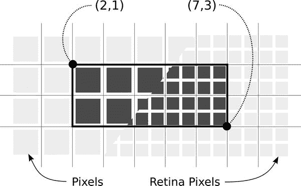

矩形定义了一个数学上精确的区域，落在该区域内的像素会被填充颜色。这种精确性避免了一种常见的程序员疾病——*像素恐惧症*：即不清楚特定绘制操作究竟会影响哪些像素的焦虑，这种问题在许多其他图形库中很常见。

这种数学上的精确性可能会带来意想不到的副作用。一种常见的伪像出现在绘制奇数宽度的线时——“奇数”意味着“不能被 2 整除”。线条的描边是居中在数学线条或曲线上的。在下图中，在两个坐标之间绘制了一条水平线段，描边宽度为`1.0`。下图中上面的线在低分辨率显示器上无法绘制成实线，因为描边只覆盖了线条两侧各一半的像素。Core Graphics 使用抗锯齿技术绘制部分像素，这意味着这些像素的颜色会使用描边颜色值的一半进行调整。在 2.0 视网膜显示屏上，这种情况不会发生，因为每个像素相当于半个坐标值。

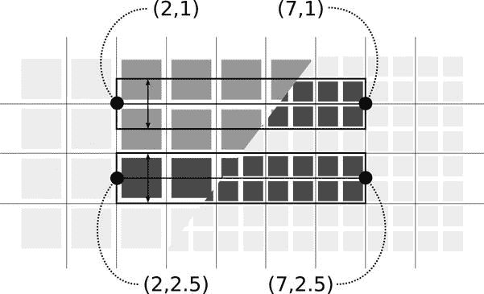

下图中下面的线通过将线条居中在两个坐标之间，避免了“半像素”问题。现在宽度为`1.0`的线条恰好填满了坐标边界之间的空间，整齐地覆盖了像素，对用户来说呈现为一条干净、实心的线。

如果像素完美对齐对你的应用至关重要，你可能需要查阅`UIView`或其 trait 集合的`contentScaleFactor`属性。它会揭示两个整坐标值之间的物理屏幕像素数量。在撰写本文时，它可能取三个值之一：低分辨率显示器为`1.0`，Retina 显示屏为`2.0`，Retina HD 显示屏为`3.0`。

下一段代码声明了一个`UIBezierPath`变量，然后根据`shape`常量进行 switch 来构建所需的形状。目前，`case`语句仅处理正方形和矩形形状的路径，如图 11-4 所示。稍后你将补充其他情况。

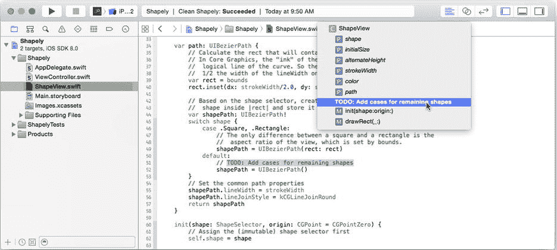

图 11-4. 未完成的`path`函数

**提示**：如果你以`//`开头的注释以`MARK:`、`TODO:`或`FIXME:`开头，该注释会自动显示在编辑区域顶部的文件导航菜单中，如图 11-4 所示。这是一个非常方便的方式，可以记下你稍后需要处理的事情，因为它会醒目地显示在你的文件导航菜单中，直到你删除它。

眼尖的读者会注意到，创建正方形形状和矩形形状的代码是相同的。这是因为这些形状之间的区别在于视图的宽高比，而这一点在对象创建时的`init(shape:)`中就已确定。如果你回头查看`init(shape:)`，会看到这段代码：

```
if shape == .Rectangle || shape == .Oval {
    frame.size.height = alternateHeight
}
```

当视图的 frame 被初始化时，如果形状是矩形或椭圆形，其高度会被设为一半。所有其他形状的视图在创建时都以正方形 frame 开始。

最后，形状的线宽被设置为`strokeWidth`，连接点样式被设置为`kCGLineJoinRound`。最后一个属性决定了连接点（一条线段结束、下一条线段开始的位置）的绘制方式。将其设置为`kCGLineJoinRound`会绘制带有圆角的形状。

### 测试正方形


这段代码足以绘制一个正方形视图，接下来将其连接到某个对象上进行测试。`Shapely` 应用在用户点击按钮时会创建新形状，因此先定义一个按钮来进行测试。按钮需要使用自定义图像，所以首先将这些图像资源添加到项目中。在导航器中选择 `Images.xcassets` 资源目录项。找到 `Learn iOS Development Projects`  `Ch 11`  `Shapely (Resources)` 文件夹，然后将全部 12 个图像文件（`addcircle.png`、`addcircle@2x.png`、`addoval.png`、`addoval@2x.png`、`addrect.png`、`addrect@2x.png`、`addsquare.png`、`addsquare@2x.png`、`addstar.png`、`addstar@2x.png`、`addtriangle.png` 和 `addtriangle@2x.png`）拖入资源目录中，如图 11-5 所示。`Shapely (Icons)` 文件夹中还有一些应用图标，你也可以随意将它们放入 `AppIcon` 组中。

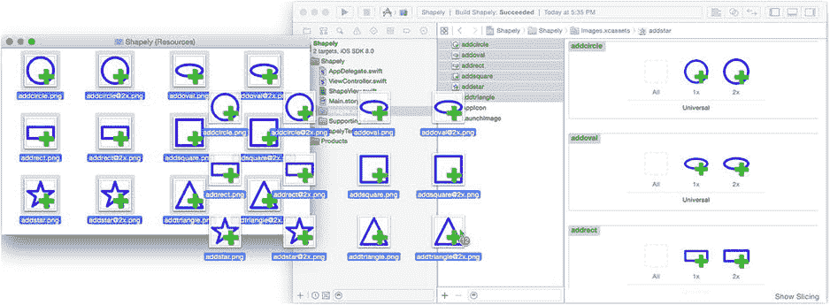

图 11-5。添加按钮图像资源

选择 `Main.storyboard` 文件。打开对象库（View  Utilities  Show Object Library），将一个按钮拖到界面的左上角，如图 11-6 所示。

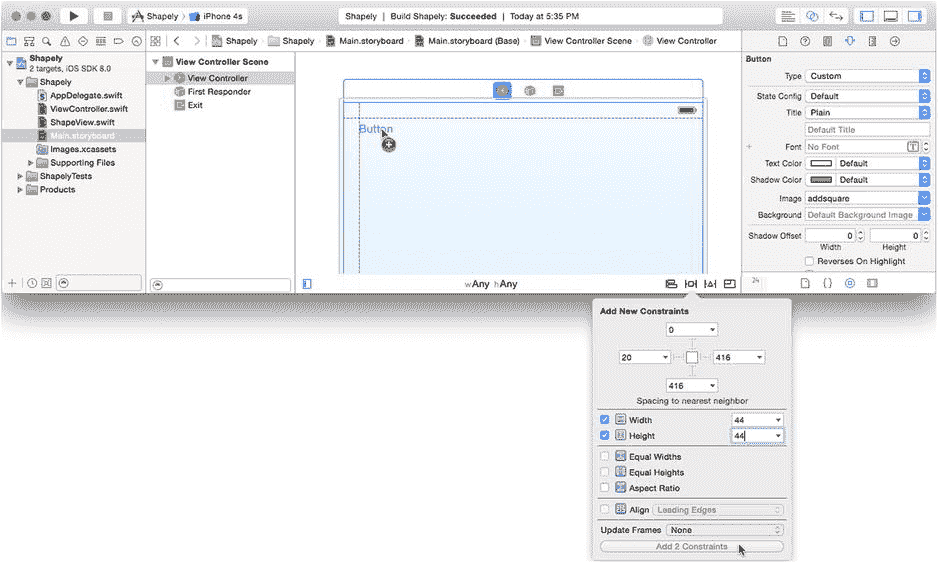

图 11-6。添加第一个按钮

选择该按钮并点击“固定属性”控件。将高度和宽度固定为 `44` 点，同样如图 11-6 所示。选择“在视图控制器中添加缺失的约束”命令，可以通过固定约束控件旁边的布局问题控件或 `Editor` 菜单来执行。

切换到属性检查器，选择根视图对象，并将其背景属性更改为 `Black Color`。再次选择新按钮并进行以下更改：

1.  将其类型更改为 `Custom`。
2.  擦除其标题（将 `Button` 替换为空）。
3.  将其图像更改为 `addsquare.png`。

现在，你要将按钮的操作连接到一个新的 Swift 函数，并且将使用一个非常巧妙的 Interface Builder 技巧来完成。首先切换到助理编辑器（View  Assistant Editor  Show Assistant Editor）。视图控制器的源代码（`ViewController.swift`）将显示在右侧窗格中。如果没有显示，请从右侧编辑器窗格正上方的导航栏中选择 `ViewController.swift` 文件。在 `ViewController.swift` 文件（右侧编辑窗格）中，添加一个新的操作。

```
@IBAction func addShape(sender: AnyObject!) {
    if let button = sender as? UIButton {
        let shapeView = ShapeView(shape: .Square)
        view.addSubview(shapeView)

        var shapeFrame = shapeView.frame
        let safeRect = CGRectInset(view.bounds, shapeFrame.width, 
                                                shapeFrame.height)
        var randomCenter = safeRect.origin
        randomCenter.x += CGFloat(arc4random_uniform(UInt32(safeRect.width)))
        randomCenter.y += CGFloat(arc4random_uniform(UInt32(safeRect.height)))
        shapeView.center = randomCenter
    }
}
```

简而言之，前两行代码创建了一个用于绘制正方形的 `ShapeView` 对象。然后将这个新的视图对象添加到根 `view` 中，这样它就会出现在你的界面中。如果只做这些，一个白色正方形将会绘制在显示器的左上角。其余代码只是选择一个随机位置并将新视图移动到该位置。`safeRect` 根据新视图的高度和宽度进行了内缩，因此在 `safeRect` 内随机选择的位置可以确保新视图安全地处于视图边界内。

在本书中，到目前为止，你一直在使用 Interface Builder 创建和添加视图对象。这段代码演示了如何通过编程方式来实现。任何你使用 Interface Builder 添加到视图的内容都可以通过编程方式创建和添加，并且你可以在代码中创建一些在 Interface Builder 中无法创建的内容。

**注意**  `addSubview(_:)` 函数将一个视图添加到另一个视图中。被添加的视图会成为另一个视图（即其父视图）的子视图。子视图将出现在其框架坐标处，位于父视图的本地坐标系中。一个视图一次只能添加到一个父视图上；一个视图不能同时出现在两个父视图中。要移除一个视图，请调用该视图的 `removeFromSuperview()` 函数。

现在来看 Interface Builder 的技巧。请注意，在你的 `addShape(_:)` 函数旁边的边距中出现了一个小的连接插座。它的作用与连接检查器中的连接器完全相同。通过将 `addShape(_:)` 函数旁边的连接插座拖到新按钮上，将按钮连接到操作，如图 11-7 所示。

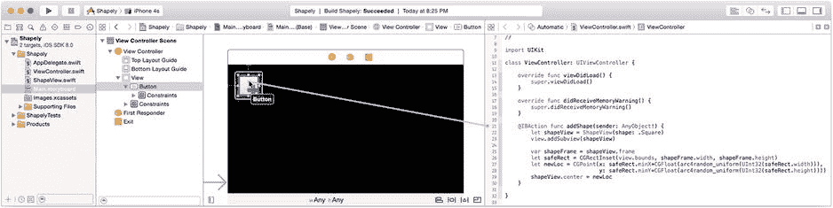

图 11-7。连接第一个按钮

助理编辑器允许你在视图控制器中为属性和操作编写 Swift 代码，然后将它们直接连接到界面中的视图对象，而无需切换文件或窗口。这大大节省了时间。

启动 iPad 模拟器并运行你的应用，如图 11-8 所示。点击按钮几次以创建一些形状视图对象，如图 11-8 右侧所示。

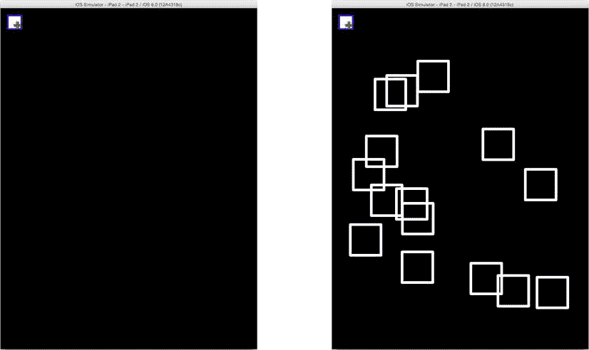

图 11-8。正在工作的正方形形状视图

到目前为止，你已经设计了一个自定义的 `UIView` 对象，它使用贝塞尔路径绘制形状。你已经创建了一个操作，用于通过编程方式创建新的视图对象并将其添加到视图中。这是一个很好的开始，但你仍然希望绘制不同颜色、不同形状，因此要扩展应用来实现这一点。

### 更多形状，更多颜色

回到 Xcode，停止应用并再次切换到 `Main.storyboard` 文件。你的应用将绘制六种形状，因此再创建五个按钮。我是通过按住 Option 键并拖出第一个 `UIButton` 对象的副本来实现的，如图 11-9 所示。或者，你也可以复制并粘贴第一个按钮。如果你有受虐倾向，也可以从库中拖入新的按钮对象，并逐个修改它们以匹配第一个按钮。我把这些决定留给你自己。

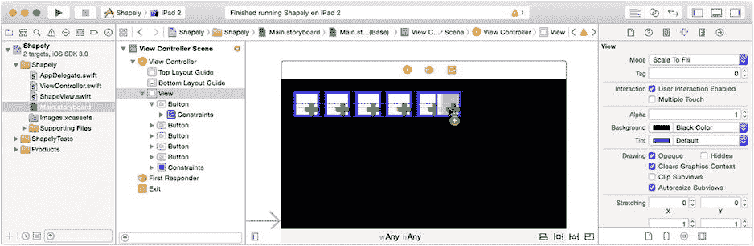

图 11-9。复制第一个按钮

就像在 DrumDub 中一样，你将使用按钮的 `tag` 属性来标识它将创建的形状。由于你复制了第一个按钮，所有按钮都连接到 `ViewController` 中的同一个 `addShape(_:)` 函数。（如果没有连接，现在请连接它们。）从左到右，使用属性检查器根据表 11-3 设置按钮的 `tag` 和 `image` 属性。

表 11-3。新形状按钮属性

| 标签 | 图片 |
| --- | --- |
| 1 | `addsquare.png` |
| 2 | `addrect.png` |
| 3 | `addcircle.png` |
| 4 | `addoval.png` |
| 5 | `addtriangle.png` |
| 6 | `addstar.png` |

你会注意到，这些标签值巧妙地与你之前在 `ShapeView.swift` 中定义的 `enum` 常量相匹配。你需要修改 `ViewController.swift` 中 `addShape(_:)` 的第一行代码，使用按钮的 `tag` 值来代替 `.Square` 常量，这样每个按钮就会创建不同的形状。


当然，`ShapeView`中的`path`属性目前仍然只知道如何为正方形和矩形创建形状；你很快就会纠正这一点。但在离开`ViewConroller.swift`之前，修改你的`addShape(_:)`函数，使其根据标签（tag）选择新的形状，并为其赋予随机颜色——只是为了让它更美观。找到你的`addShape(_:)`函数并进行以下更改（以粗体显示）：

```swift
let colors = [ UIColor.redColor(), UIColor.greenColor(),
               UIColor.blueColor(), UIColor.yellowColor(),
               UIColor.purpleColor(), UIColor.orangeColor(),
               UIColor.grayColor(), UIColor.whiteColor() ]

@IBAction func addShape(sender: AnyObject!) {
    if let button = sender as? UIButton {
        if let shapeSelector = ShapeSelector(rawValue: button.tag) {
            let shapeView = ShapeView(shape: shapeSelector)
            shapeView.color = 
                        colors[Int(arc4random_uniform(UInt32(colors.count)))]
            view.addSubview(shapeView)
            ...
        }
```

修改后的函数获取按钮的`tag`，并使用枚举器内置的`fromRaw()`函数将整数转换为`ShapeSelector`值，然后将其传递给`ShapeView`的初始化器。现在，形状将由点击的按钮决定。然后选择一个随机颜色并分配给新形状。

**注意**：枚举器的`init(rawValue:)`初始化器返回一个可选值。换句话说，如果没有与给定整数值对应的枚举值，它将根本不返回任何值。因此，如果`tag`值无效（例如 0 或 42），`if`语句将失败，且不会执行任何代码。关于可选值的说明，请参阅第 20 章。

要绘制这些形状，你的`ShapeView`对象仍需进行一些工作。切换到`ShapeView.swift`文件，找到`path`属性的 getter 函数，并使用列表 11-1 中以粗体显示的代码完成它。哦，你还可以从未完成的版本中移除`default:`分支；因为`switch`语句现在涵盖了所有可能的情况，你不再需要它了。

***列表 11-1***. 完成的路径属性 Getter 函数

```swift
var path: UIBezierPath {
    var rect = bounds
    rect.inset(dx: strokeWidth/2.0, dy: strokeWidth/2.0)

var shapePath: UIBezierPath!
    switch shape {
        case .Square, .Rectangle:
            shapePath = UIBezierPath(rect: rect)
        case .Circle, .Oval:
            shapePath = UIBezierPath(ovalInRect: rect)
        case .Triangle:
            shapePath = UIBezierPath()
            shapePath.moveToPoint(CGPoint(x: rect.midX, y: rect.minY))
            shapePath.addLineToPoint(CGPoint(x: rect.maxX, y: rect.maxY))
            shapePath.addLineToPoint(CGPoint(x: rect.minX, y: rect.maxY))
            shapePath.closePath()
        case .Star:
            shapePath = UIBezierPath()
            let armRotation = CGFloat(M_PI)*2.0/5.0
            var angle = armRotation
            let distance = rect.width*0.38
            var point = CGPoint(x: rect.midX, y: rect.minY)
            shapePath.moveToPoint(point)
            for _ in 0..<5 {
                point.x += CGFloat(cos(Double(angle)))*distance
                point.y += CGFloat(sin(Double(angle)))*distance
                shapePath.addLineToPoint(point)
                angle -= armRotation
                point.x += CGFloat(cos(Double(angle)))*distance
                point.y += CGFloat(sin(Double(angle)))*distance
                shapePath.addLineToPoint(point)
                angle += armRotation*2
            }
            shapePath.closePath()
    }
    shapePath.lineWidth = strokeWidth
    shapePath.lineJoinStyle = kCGLineJoinRound
    return shapePath
}
```

`.Circle`和`.Oval`情况使用了另一个`UIBezierPath`便捷初始化器来创建一个完整的路径对象，该对象描绘了一个完全适合给定矩形内部的椭圆。

`.Triangle`情况是事情变得有趣的地方。它展示了如何创建一个贝塞尔路径，一次一个线段。你通过调用`moveToPoint(_:)`来开始一个贝塞尔路径，以建立形状中的第一个点。之后，通过进行一系列`addLineToPoint(_:)`调用来添加线段。每个调用为形状添加一条边，就像玩“连线游戏”一样。最后一条边是使用`closePath()`函数创建的，该函数做两件事：它将最后一个点连接到第一个点，并使其成为一个闭合路径——一个描述实心形状的路径。

**注意**：此应用仅使用直线创建贝塞尔路径，但你也可以混合调用`addArcWithCenter(_:,radius:,startAngle:,endAngle:,clockwise:)`、`addCurveToPoint(_:,controlPoint1:,controlPoint2:)`和`addQuadCurveToPoint(_:,controlPoint:)`，以任意组合方式为路径添加曲线段。

`.Star`创建了一个更复杂的形状。如果你对细节感到好奇，请阅读完成的 Shapely 项目代码中的注释，你可以在`Learn iOS Development Projects` → `Ch 11` → `Shapely`文件夹中找到。简而言之，该代码创建了一条从视图顶部中心（星形的顶端）开始的路径，添加一条向下倾斜到星形内部点的线条，然后再添加一条（水平的）线条向外回到星形的右侧点。然后它旋转 72°，并重复这些步骤四次，以创建一个五角星。

**提示**：三角函数计算以弧度为单位。如果你的三角技能有些生疏，角度以弧度表示时，是常数π的分数，π等于 180°。iOS 数学库包含π（`M_PI`或 180°）、π/2（`M_PI_2`或 90°）和π/4（`M_PI_4`或 45°）的常量，以及其他常用常量（*e*、2 的平方根等）。

再次运行你的应用（参见图 11-10），然后制作一堆形状吧！

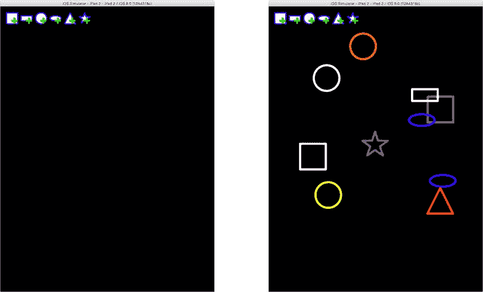

图 11-10. 多彩形状

**变换**

接下来应用功能列表中的内容是拖拽和调整形状大小。为了实现这一点，你将重新审视手势识别器并学习一些全新的东西。让我们从手势识别器开始。

与视图对象类似，你可以以编程方式创建、配置和连接手势识别器。iOS 提供的具体手势识别器类（轻点、捏合、旋转、轻扫、平移和长按）拥有识别这些常见手势所需的所有逻辑。你所要做的就是创建一个，进行一些简单的配置，然后将它们连接起来。

回到`ViewController.swift`中的`addShape(_:)`函数。在函数末尾，添加以下代码：

```swift
let pan = UIPanGestureRecognizer(target: self, action: "moveShape:")
pan.maximumNumberOfTouches = 1
shapeView.addGestureRecognizer(pan)
```

前两个语句创建了一个新的平移（拖拽）手势识别器对象。该识别器将向其动作消息（`"moveShape:"`）发送到你的`ViewController`对象（`self`）。`maximumNumberOfTouches`属性被设置为`1`。这将配置该对象仅识别单指拖拽手势；它会忽略任何两指或三指的拖拽。最后，将识别器对象附加到刚刚创建的形状视图上。

**注意**：这段代码等价于进入 Interface Builder 文件，将一个`Pan Gesture Recognizer`拖拽到`ShapeView`对象中，选中它，将其`Maximum Touches`更改为`1`，然后将识别器连接到控制器的`moveShape(_:)`动作。当我说“等价”时，我的意思是“完全相同”。

现在你所需要的只是一个`moveShape(_:)`函数。在你的`ViewController`类中，现在添加它。


```swift
func moveShape(gesture: UIPanGestureRecognizer) {
    if let shapeView = gesture.view as? ShapeView {
        let dragDelta = gesture.translationInView(shapeView.superview)
        switch gesture.state {
            case .Began, .Changed:
                shapeView.transform = 
                    CGAffineTransformMakeTranslation(dragDelta.x, dragDelta.y)
            case .Ended:
                shapeView.transform = CGAffineTransformIdentity
                shapeView.frame = 
                    CGRectOffset(shapeView.frame, dragDelta.x, dragDelta.y)
            default:
                shapeView.transform = CGAffineTransformIdentity
        }
    }
}
```

`Gesture`（手势）识别器会分析并吸收发送给视图对象的底层触摸事件，并将其转化为高级的手势事件。与许多高级事件类似，它们拥有一个*阶段*。连续手势（如拖拽）的阶段会按可预测的顺序推进：*可能*、*开始*、*改变*，最后是*结束*或*取消*。

你的 `moveShape(_:)` 函数首先获取触发手势动作的视图；这将是用户触摸的视图，也是你将要移动的视图。然后它获取一些关于用户拖拽距离以及手势状态的信息。只要手势处于“开始”或“改变”状态，就意味着用户触摸了视图并在屏幕上拖拽手指。当用户松开手指时，状态会变为“结束”。在极少数情况下，它可能会变为“取消”或“失败”，此时你会忽略该手势。

当用户拖拽手指时，你希望按屏幕上相同的距离调整形状视图的原点，这会让用户产生一种实际上是在屏幕上拖拽视图的错觉。（希望你不会认为你真的可以通过触摸来移动 iPhone 屏幕里的东西。）实现这一点要用到 `UIView` 类一个卓越的特性：`transform` 属性。

**注** 注意，你无需在 `moveShape(_:)` 函数开头添加 `@IBAction` 关键字。这是因为你通过*编程方式*将其连接到了手势识别器。只有当你想让动作显示在 Interface Builder 中并通过它进行连接时，才需要 `@IBAction` 关键字。

### 应用平移变换

iOS 以多种不同方式使用仿射变换。*仿射变换*是一个 3x3 的矩阵，用于描述坐标系的变换。通俗地说，它是一组（看似）神奇的数值数组，能够描述各种复杂的坐标转换。它可以移动、调整大小、倾斜、翻转和旋转任意点集。既然几乎所有东西（视图对象、图像和贝塞尔路径）都是“点集”，那么仿射变换就可以用来移动、翻转、缩放、缩小和旋转这些对象。更神奇的是，单个仿射变换可以在一次操作中完成所有这些转换。

**仿射变换**

iOS 提供了用于创建和组合三种常见变换的函数：平移（位移）、缩放和旋转。这些在下图中有所展示。灰色形状代表原始形状，深色图形代表其变换后的形状：

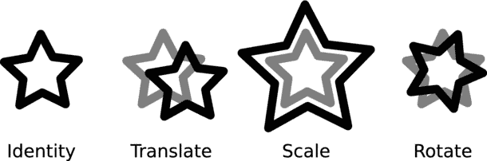

你可以使用函数 `CGAffineTransformMakeTranslation`、`CGAffineTransformMakeScale` 或 `CGAffineTransformMakeRotation` 来创建基本变换。如果你是个数学高手，也可以使用 `CGAffineTransformMake` 创建任意变换。

特殊的单位变换（`CGAffineTransformIdentity`）不进行任何平移。这是 `transform` 属性的默认值，也是当你不想进行任何变换时使用的常量。

变换可以组合。其效果如下图所示：

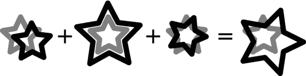

要组合变换，请使用函数 `CGAffineTransformTranslate`、`CGAffineTransformScale`、`CGAffineTransformRotate` 和 `CGAffineTransformConcat`。这些函数接收一个变换（可能已经是其他变换的组合结果），应用一个额外的变换，并返回组合后的变换。然后，你可以使用这个组合变换值，一次操作完成所有单独的变换。

`moveShape(_:)` 中针对“开始”和“改变”状态的手势分支，会获取用户拖拽手指的距离，并用其创建一个平移变换。请快速念三遍“平移变换”（translate transform）。`transform` 属性被设置为这个值，这样就完成了。但确切来说，这个神奇属性到底做了什么？

当你设置一个视图的 `transform` 属性时，该视图在其父视图中所占用的所有坐标，在显示到屏幕之前都会被转换。视图的内容和位置（其 frame）并没有改变。改变的是视图图像在父视图中的显示位置。我喜欢将 `UIView` 的 `transform` 想象为一个“投射”视图的透镜，使其显示在其他地方或以不同方式显示。如果你应用一个平移变换（正如你刚才在 `moveShape(_:)` 中所做的那样），那么视图将会显示在一组不同的坐标上。

**警告** 如果你将 `transform` 属性设置为除单位变换之外的任何值，`frame` 属性的值将变得无意义。并非完全无意义，但对于大多数实际用途来说是不可用的。请记住这一点：当你将 `transform` 设置为除单位变换之外的任何值后，不要再使用 `frame`。

如果你将 `transform` 属性重置为单位变换（`CGAffineTransformIdentity`），视图将重新出现在其原始位置。程序员称 `transform` 属性为*非破坏性变换*，因为设置它不会改变对象的任何其他属性。将其重置，一切都会恢复到原来的样子。在 `default:` 分支中，情况正是如此。`default:` 分支通过将 `transform` 属性重置为单位变换来处理“取消”和“失败”状态。

手势的“结束”分支是真正执行工作的部分。首先，视图的 `transform` 属性被重置为单位变换。然后，基于用户拖拽视图的总距离，更新视图的 `frame` 原点。更新后的 `frame` 会将视图对象永久重定位到其新位置。

**注** 在使用 `frame` 属性更改其位置*之前*，视图的 `transform` 属性会被重置为单位变换。

运行你的项目并尝试一下。我没有提供示意图，因为（正如我的出版商向我解释的那样）书中的插图是不会移动的。创建几个形状并拖动它们。这非常有趣。玩够了之后，准备好在其中添加缩放和捏合功能吧。

不过在此之前，让我分享一些关于仿射变换的知识点。变换可以在多种地方使用，而不仅仅是扭曲视图的 frame。它们可以用于在你绘制视图时变换当前上下文的坐标系。本质上，这种用法是将一个变换应用于视图的边界，从而改变你在视图中绘制内容的效果，而不是平移视图的最终结果。例如，你可能有一个复杂的绘图，希望它在视图中上下移动，或者可能想将其上下颠倒地绘制。与其重新计算所有想要绘制的坐标，不如使用 `CGContextTranslateCTM`、`CGContextRotateCTM` 或 `CGContextScaleCM` 函数来平移、旋转或缩放所有绘制操作。你将在第 16 章中使用这些函数。

**提示** 你也可以通过更改 `bounds` 属性的 `origin` 来平移视图的绘图坐标。


