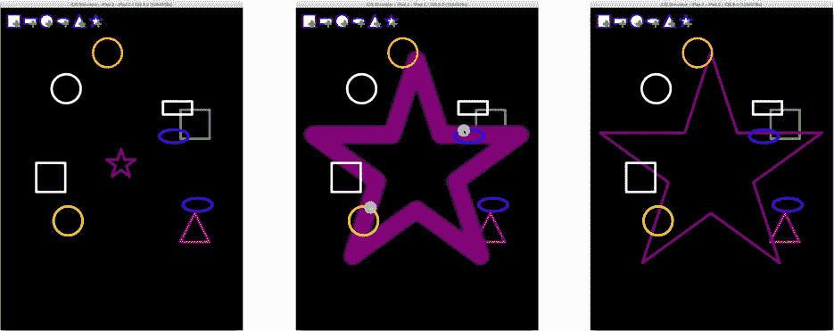
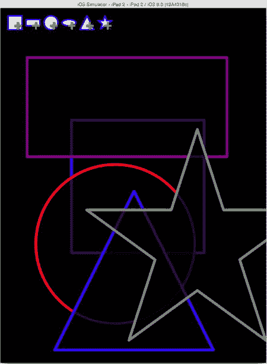
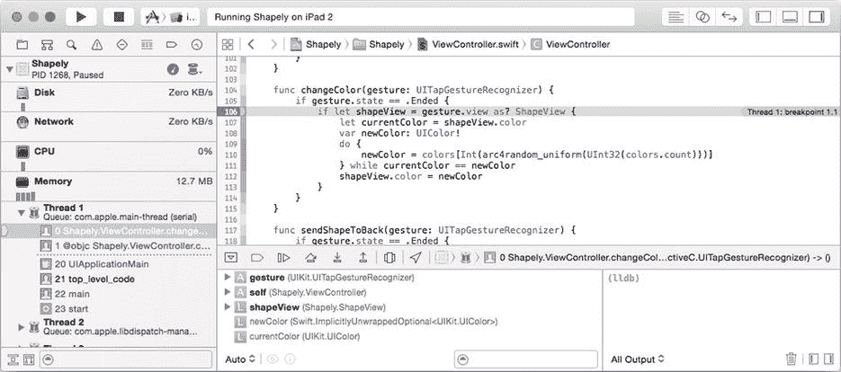
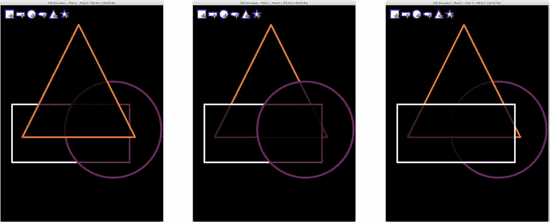

# 变换与动效

变换同样可以用于修改贝塞尔路径中的点。只需创建所需的变换，然后调用路径的 `applyTransform(_:)` 函数即可，路径中的所有点都将通过该变换被修改。这是一种*破坏性*的转换：路径中原有的点将会丢失。

### 应用缩放变换

如果说一个手势识别器很有意思，那么两个就能开派对了。现在，我们将添加一个捏合/缩放手势，用于调整形状视图的大小。和之前一样，首先在 `addShape(_:)` 函数的末尾（位于 `ViewController.swift` 中）创建并附加第二个手势识别器对象。

```
let pinch = UIPinchGestureRecognizer(target: self, action: "resizeShape:")
shapeView.addGestureRecognizer(pinch)
```

捏合手势识别器对象无需任何配置，因为捏合/缩放始终是双指手势。

现在添加以下 `resizeShape(_:)` 函数：

```
func resizeShape(gesture: UIPinchGestureRecognizer) {
    if let shapeView = gesture.view as? ShapeView {
        let pinchScale = gesture.scale
        switch gesture.state {
            case .Began, .Changed:
                shapeView.transform = 
                    CGAffineTransformMakeScale(pinchScale, pinchScale)
            case .Ended:
                shapeView.transform = CGAffineTransformIdentity
                var frame = shapeView.frame
                let xDelta = frame.width*pinchScale-frame.width
                let yDelta = frame.height*pinchScale-frame.height
                frame.size.width += xDelta
                frame.size.height += yDelta
                frame.origin.x -= xDelta/2
                frame.origin.y -= yDelta/2
                shapeView.frame = frame
                shapeView.setNeedsDisplay()
            default:
                shapeView.transform = CGAffineTransformIdentity
        }
    }
}
```

此函数的模式与 `moveShape(_:)` 相同。唯一显著的区别在于调整视图最终尺寸和位置的代码，这比拖拽函数需要更多的数学运算。

运行项目并测试。创建形状，然后用双指调整其大小，如图 11-11 所示。



图 11-11. 使用变换调整大小

**提示：** 如果你在使用模拟器，请按住 Option 键来模拟双指捏合手势。你首先需要将形状定位在视图中央，因为模拟器中的第二根“手指”会以屏幕中心点为对称轴镜像，你需要让两根“手指”都位于视图内，才能被识别为捏合手势。

你会注意到，当大幅缩小形状时，其图像会出现“锯齿”：这是由于放大较小图像而产生的走样伪影。这是因为在捏合手势过程中，你并没有真正调整视图的大小，而只是对原始视图的图像应用了变换。贝塞尔路径是与分辨率无关的，在任何尺寸下都能平滑绘制。但变换只能基于视图当前图像的像素进行操作。在捏合手势结束时，形状视图的大小会被调整并重绘。这会以新的尺寸创建新的贝塞尔路径，一切又恢复平滑，如图 11-11 右侧所示。

你的应用现在看起来相当生动，但我认为还可以再增添一点活力。加上一些动效怎么样？

### 动效：不仅仅是漫画的专属

动效已成为现代应用中不可或缺且备受期待的功能。没有动效，即使应用实现了所有预期功能，看起来也会显得枯燥乏味。幸运的是，iOS 的设计者深知这一点，并为此付出了巨大努力，让你能够轻松地为应用添加动效。主要有（广义上的）四种方式为应用增添动态效果。

*   内置功能
*   自行实现 (DIY)
*   核心动画 (Core Animation)
*   OpenGL、Sprite Kit、Scene Kit 和 Metal

“内置功能”包括 iOS API 中那些会自动为你添加动效的地方。从视图控制器到表格视图，无数函数都包含一个布尔类型的 `animated` 参数。如果你想让你视图控制器滑动呈现、页面向上翻卷、工具栏按钮平滑调整大小、表格视图行灵动地跳到新位置、或者进度指示器平稳过渡到新值，你只需为 `animated` 参数传入 `true`，iOS 类就会完成所有工作。因此，请留意那些 `animated` 参数并善加利用。

**提示：** 某些视图属性有两个设置方法：一个从不带动画，另一个可以带动画。例如，`UIProgressView` 类有一个可设置的 `progress` 属性（从不带动画）和一个 `setProgress(_:,animated:)` 函数（可选带动画）。如果你正在设置一个视觉属性，请查阅文档，看是否有带动画的替代方法。

在自行实现 (DIY) 动画方案中，你的代码会逐帧进行更改，以实现界面的动效。这通常包含以下步骤：

1.  创建一个每秒触发 30 次的定时器。
2.  定时器触发时，更新某个视图的位置/外观/大小/内容。
3.  标记该视图需要重绘。
4.  重复步骤 2 和 3，直到动画结束。

讽刺的是，DIY 方法正是业余开发者最常滥用的方式。它在少数情况下可能“还行”，但大多数时候，它会遭遇许多无法避免的性能缺陷。最大的问题是时机把握。要平衡动画的速度使其看起来流畅，但又不会因运行过快而浪费 CPU 资源、消耗电池寿命、拖慢应用乃至整个 iOS 系统，这非常困难。

### 使用核心动画

聪明的 iOS 开发者——既然你在读这本书，说的就是你——会使用核心动画 (Core Animation)。核心动画已经为你解决了一切棘手的性能、负载均衡、后台线程以及效率问题。你只需告诉它你想要动效的对象，然后让它施展魔法即可。

动态内容绘制在*图层* (`CALayer`) 对象中。图层对象就像 `UIView` 一样；它是一个可以使用 Core Graphics 绘制的画布。绘制完成后，就可以使用 Core Animation 对该图层进行动效处理。简而言之，你告诉 Core Animation 你希望图层如何变化（移动、缩小、旋转、卷曲、翻转等）、持续多长时间以及变化速度。然后你就可以完全不管，让 Core Animation 去完成所有工作。Core Animation 甚至不会打扰你应用的事件循环；它会在后台安静地工作，根据可用的 CPU 资源平衡动画工作，因此不会干扰应用需要执行的任何其他任务。这确实是一个非凡的系统。

请记住，Core Animation 并不会改变图层对象的内容。它只是临时对图层的副本进行动效，当动效结束后，这个副本就会消失。我喜欢把 Core Animation 看作是“实时”变换；它临时投射出一个扭曲的、动态版本的图层，但永远不会改变图层本身。

哦，我刚才是不是说“图层对象就像 `UIView`？”我应该说，“图层对象，*就像 `UIView` 中的那个*”，因为 `UIView` 本身就是基于 Core Animation 图层的。当你在 `drawRect(_:)` 中绘制视图时，你实际上是在一个 `CALayer` 对象中绘图。如果你需要直接操作图层对象，可以通过 `layer` 属性获取 `UIView` 的图层对象。关键点在于：*所有* `UIView` 对象都可以使用 Core Animation 进行动效处理。这下你可算掌握了精髓！

### 为 Shapely 添加动效


要让 Core Animation 为你工作，有三种途径。我已经介绍了第一种：所有那些“内置的” `animated:` 参数都基于 Core Animation——这并不奇怪。第二种传统的 Core Animation 技术是创建一个动画（`CAAnimation`）对象。一个动画对象控制一个动画序列。它决定动画何时开始、何时停止、动画的速度（称为*动画曲线*）、动画执行什么动作、是否重复、重复次数等等。`CAAnimation` 有一些子类，可以对视图的特定属性进行动画处理，或者对转场效果（视图对象的添加、删除或交换）进行动画处理。甚至还有一个动画类（`CAAnimationGroup`）可以同步多个动画对象。

说实话，创建 `CAAnimation` 对象并不容易。因为它可能非常复杂，所以有大量简便的构造方法和函数试图让它尽可能无痛——但这仍然是一项艰巨的任务。你必须定义被动画属性在开始和结束时的值。你必须定义时间和动画曲线；然后你必须启动动画并在适当的时间更改实际的属性值。请记住，动画不会改变原始视图，所以如果你想让一个视图从左向右滑动，你必须创建一个从左侧开始、在右侧结束的动画，然后必须将原始视图的位置设置为右侧，否则动画结束时视图会重新出现在左侧。这很繁琐。

幸运的是，iOS 的“神灵”感受到了你的痛苦，并创建了一种非常简单的方法来创建基础动画，称为**基于块的动画函数**。这些 `UIView` 函数允许你编写几行代码，告诉 Core Animation 你希望如何更改视图的属性。然后，Core Animation 会负责创建、配置和启动 `CAAnimation` 对象。它甚至还会更新你视图的属性，所以当动画结束时，你的属性会处于动画的结束值——这正是你想要的。

那么，这些基于块的动画函数使用起来有多简单呢？你来评判一下。在 `ViewController.swift` 中找到你的 `addShape(_:)` 函数。找到随机定位新视图的代码，并将其编辑成如下所示（用粗体代码替换语句 `shapeView.center = randomCenter`）：

```
var shapeFrame = shapeView.frame
let safeRect = CGRectInset(view.bounds, shapeFrame.width, shapeFrame.height)
var randomCenter = safeRect.origin
randomCenter.x += CGFloat(arc4random_uniform(UInt32(safeRect.width)))
randomCenter.y += CGFloat(arc4random_uniform(UInt32(safeRect.height)))
shapeView.center = button.center
shapeView.transform = CGAffineTransformMakeScale(0.4, 0.4)
UIView.animateWithDuration(0.5) {
    shapeView.center = randomCenter
    shapeView.transform = CGAffineTransformIdentity
}
```

新代码首先将新视图的中心设置成用户点击的按钮的中心，本质上就是将新视图定位到按钮的正上方。应用了一个变换，将形状的大小缩小到其原始大小的 40%（大约与按钮大小相同）。如果在这个阶段停下来，你的形状视图会正好出现在你点击的按钮之上，将其覆盖。

最后一条语句是神奇之处。它启动了一个持续半秒（`0.5`）的动画。闭包表达式描述了你想要动画化的内容，而所谓“描述”，我的意思是你只需编写代码来设置你想要动画化的属性。就这么简单。`UIView` 会自动对以下七个属性中的任何一个进行动画处理：

*   `frame`
*   `bounds`
*   `center`
*   `transform`
*   `alpha`
*   `backgroundColor`
*   `contentStretch`

如果你想让一个视图移动或改变大小，就对它的 `center` 或 `frame` 进行动画处理。想让视图淡出？将它的 `alpha` 属性从 `1.0` 动画化到 `0.0`。想让视图平滑地向右旋转？将它的 `transform` 从恒等变换动画化到一个旋转变换。你可以做上述任何一项，甚至同时做多项（同时改变 `alpha` 和 `center`）。就是这么简单。

`animateWithDuration()` 函数有许多变体，可以提供不同的效果，甚至提供更多的控制。使用这些函数，你可以轻松完成以下所有操作：

*   延迟动画的开始
*   在两个视图之间进行转场动画
*   指定自定义动画选项，例如：
    *   从当前动画值开始此动画（中断另一个动画）
    *   选择不同的动画曲线（缓入、缓出等）
    *   选择转场样式（翻转、翻页、交叉溶解等）
    *   在动画期间重绘视图的内容
    *   反转动画
*   提供动画完成时执行的代码，其中可以包含启动另一个动画的代码，从而轻松创建动画序列

请参阅 `UIView` 文档中的“使用块对象进行视图动画处理”部分，以获取完整的函数列表。

再次运行你的应用并创建一些形状。很酷吧？（再次说明，没有图）。每当你点击“添加形状”按钮时，新的形状会从你的手指下方飞出进入你的视图，就像某个疯狂的街机游戏。如果你动作快，可以同时让好几个形状动起来。而这只需要五行代码。

如果你想对除了这七个属性之外的其他内容进行动画处理，或者创建循环运行的动画、沿弧线移动的动画或反向运行的动画，该怎么办？为此，你需要深入研究 Core Animation 并创建自己的动画对象。你可以在 Xcode 的“文档和 API 参考”中找到的 *Core Animation 编程指南* 中了解相关信息。

### OpenGL、Sprite Kit、Scene Kit 和 Metal

哎呀，我差点忘了那些其他的动画技术。现代计算机系统，即使是像 iPod 这样微小的系统，实际上也是合二为一的双计算机系统：一个中央处理器（CPU）负责计算机的常规工作，以及一个图形处理器（GPU）负责将位图数据放到屏幕上。每个处理器都有自己的一套处理单元和内存。两者之间没有太多重叠，除了一些允许数据和指令交换的通道。虽然 CPU 在处理许多任务时速度很快，但它不太适合绘制和动画化图形所需的大规模并行计算。而这正是 GPU 真正擅长的领域。GPU 拥有数十个，有时甚至数百个小型、简单但速度极快的处理单元。我喜欢将 GPU 视为“我的像素小兵大军”。

在过去二十年中，计算机图形学和动画的大多数进步都是通过将越来越多的数据和计算从 CPU 转移到 GPU 来实现的。这需要大量的协调工作。你不是在 CPU 中保留一个包含绘制该视图所有数据和逻辑的对象（如 `UIView`），而是创建了一种混合解决方案：CPU 准备绘制视图所需的数据并将其交给 GPU。GPU 可以在收到指令后渲染该视图。CPU 仅持有图像信息的引用（通常称为*纹理*），而实际的图像数据驻留在 GPU 中。

一种更高级的解决方案是编写称为*着色器*的小型程序，这些程序在 GPU 中执行你的代码。这与用 Swift 编程的体验截然不同，但优势巨大。生成和绘制图形及场景所需的所有逻辑（数据和计算机代码）现在完全位于 GPU 中。CPU 只是在导演这出戏，告诉 GPU 它需要绘制什么以及何时绘制。


其效果可能令人叹为观止。如果你曾运行过 3D 飞行模拟器、射击游戏或冒险游戏，你看到的就是在利用 GPU 强大性能的代码。

iOS 上可用的各种动画技术，可以通过你（程序员）与 GPU 实际操作细节的隔离程度来大致区分。一端是你已经用过的 Core Animation。从你的角度来看，一切都是在 CPU 中发生的。没有提及纹理缓冲区、着色器或管道调度。Core Animation 为你完成了这些工作。虽然无知可能是福，但如果你愿意踏入 GPU 的世界，也会有很多可能性。以下是你的选择。

### Sprite Kit

Sprite Kit 出现在 iOS 7 中，因此它对 iOS 来说相对较新。Sprite Kit 的视图类基于 `SKNode` 而不是 `UIView`，但许多属性和关系对你来说会很熟悉。你会发现关于 `UIView` 的很多知识在 `SKNode` 中同样适用。（例如，`SKNode` 也是 `UIResponder` 的子类，因此事件处理程序的工作方式相同。）

Sprite Kit 和 `UIView` 都旨在绘制和动画化 2D 图形。然而，Sprite Kit 是专门为*持续*动画和交互而设计的。Core Animation 通常最适合简短、简单的序列。Sprite Kit 旨在让图像始终保持运动状态，这就是为什么它成为 2D 游戏的绝佳选择。你将在第 14 章中创建一个 Sprite Kit 游戏。

Sprite Kit 还拥有一个强大的物理模拟引擎。你可以为 Sprite Kit 节点编程设置形状、质量、速度和碰撞规则，然后让 Sprite Kit 自动动画化它们的行为。

**注意** Cocoa Touch 也有一个名为 View Dynamics 的物理模拟引擎，你可以与 `UIView` 对象一起使用。我将在第 16 章中向你展示如何操作。

### Scene Kit

Scene Kit 是 iOS 8 的新特性，尽管它在 OS X 上已经存在了一段时间。与 Sprite Kit 类似，它专为高速渲染和动画而设计。最大的区别在于 Scene Kit 主要专注于 3D 建模和动画。

Scene Kit 是 Apple 对 OpenGL 的替代方案。它基于相同的底层技术设计，但与 Sprite Kit 一样，它使用 Cocoa Touch 程序员熟悉且方便的对象、结构、数据、概念和编程语言。Scene Kit 和 Metal 超出了本书的范围，但 Apple 有出色的教程和指南供你入门。

### Metal

iOS 8 中的新成员是 Metal。而且，就像它的名字一样，Metal 让你可以直接访问 GPU 的全部能力。使用 Metal，可以创建性能甚至超过 Scene Kit 和 OpenGL 的 2D 和 3D 动画。当然，它在技术上也非常复杂。

Metal 也可以用于非图形计算。GPU 单元每秒可以执行的浮点运算次数（称为 FLOP）是惊人的。有很多应用程序可以利用这一点。通过并行运行数百个小计算（这正是 GPU 的设计目的），密码学、场计算和线性数学问题可以大大加速。Metal 提供了一个用于运行和管理这些计算的 API。

### OpenGL

OpenGL 是 Open Graphics Library（开放图形库）的缩写。它是一个用于 2D 和 3D 动画的跨语言、跨平台 API，是所有 GPU 控制库的鼻祖。在 Sprite Kit、Scene Kit 和 Metal 出现之前，OpenGL 是在 iOS 中充分发挥 GPU 能力的唯一途径。iOS 中包含的 OpenGL 版本是 OpenGL for Embedded Systems（OpenGL ES）。它是 OpenGL 的精简版本，适合在小型计算机系统（如 iOS 设备）上运行。

OpenGL 的优势在于它是一个行业标准。有很多 OpenGL 知识和代码可以在 iOS 上运行。这让你可以访问庞大的源代码和解决方案库。而且你在 iOS 上进行的 OpenGL 工作也可以移植到其他平台。

缺点是 OpenGL 是另一个世界。OpenGL 视图是使用一种称为 OpenGL 着色语言（GLSL）的特殊类 C 计算机语言编程的。要使用它，你需要编写*顶点*和*片段*着色器程序。¹ 这完全不像 Swift。即使在 CPU 端，OpenGL 编程通常也是用 C++ 编写的，而不是 Swift，甚至不是 Objective-C。虽然一些 C API 可以从 Swift 调用，但我对完全用 Swift 编写 OpenGL 应用程序持保留态度。

尽管我试图引导你远离 OpenGL，但我必须承认它是一项强大的技术，并且在 iOS 中运行良好——一旦你克服了学习曲线和语言障碍。可以从 Xcode 的“文档与 API 参考”中的 *OpenGL ES Programming Guide for iOS* 开始。但请注意，在理解该文档的大部分内容之前，你需要学习大量 OpenGL 基础知识。

## 事物的顺序

当 Shapely 项目仍在打开时，我希望你稍微操作一下视图对象的顺序。子视图有一个特定的顺序，称为它们的 *Z 轴顺序*。它决定了重叠视图的绘制方式。这并不复杂。后面的视图先绘制，后续的视图绘制在其上方（如果它们重叠）。如果重叠的视图是不透明的，它会遮挡其后面的任何视图。如果其部分区域是透明的，则后面的视图会通过这些“孔”露出来。

这比解释更容易看到，所以给 Shapely 再添加两个手势识别器。再次回到 `ViewController.swift` 中的 `addShape(_:)` 动作函数。在附加了另外两个手势识别器的代码之后，立即插入以下内容：

```
let dblTap = UITapGestureRecognizer(target: self, action: "changeColor:")
dblTap.numberOfTapsRequired = 2
shapeView.addGestureRecognizer(dblTap)

let trplTap = UITapGestureRecognizer(target: self, action: "sendShapeToBack:")
trplTap.numberOfTapsRequired = 3
shapeView.addGestureRecognizer(trplTap)
```

这段代码添加了双击和三击手势识别器，它们分别调用 `changeColor(_:)` 和 `sendShapeToBack(_:)`。现在添加这两个新函数：

```
func changeColor(gesture: UITapGestureRecognizer) {
    if gesture.state == .Ended {
        if let shapeView = gesture.view as? ShapeView {
            let currentColor = shapeView.color
            var newColor: UIColor!
            do {
                newColor = 
                    colors[Int(arc4random_uniform(UInt32(colors.count)))]
            } while currentColor == newColor
            shapeView.color = newColor
        }
    }
}

func sendShapeToBack(gesture: UITapGestureRecognizer) {
    if gesture.state == .Ended {
        view.sendSubviewToBack(gesture.view)
    }
}
```

`changeColor(_:)` 函数主要用于娱乐。它确定形状的颜色，并为其随机选择一种新颜色。

`sendShapeToBack(_:)` 函数演示了视图如何重叠。当你向视图添加子视图时（使用 `UIView` 的 `addSubview(_:)` 函数），新视图会位于顶部。但这不是你唯一的选择。如果视图顺序很重要，有许多函数可以将子视图插入到特定索引处，或者立即位于另一个（已知）视图的下方或上方。你还可以使用 `bringSubviewToFront(_:)` 和 `sendSubviewToBack(_:)` 调整现有视图的顺序，你将在这使用它们。你的三击手势会将该子视图“推”到后面，位于所有其他形状之后。

为了使这种效果更明显，对 `ShapeView.swift` 中的 `drawRect(_:)` 函数进行一个小修改，添加粗体部分的代码：

```
override func drawRect(rect: CGRect) {
    let shapePath = path
    UIColor.blackColor().colorWithAlphaComponent(0.4).setFill()
    shapePath.fill()
    color.setStroke()
    shapePath.stroke()
}
```


新代码会以 40% 不透明度（60% 透明度）的黑色填充形状。这样你的形状就会有一个“烟熏”的中间部分，使绘制在它后面的任何形状变暗。这样一来，观察形状如何重叠就变得容易了。

运行你的应用，创建几个形状，调整它们的大小，然后移动它们使其重叠，如图 11-12 所示。



图 11-12。使用半透明填充的重叠形状

你最后添加的形状位于最先添加的形状“之上”。现在尝试双击一个形状来改变其颜色。我等着。

我还在等。

出问题了吗？双击似乎无法改变形状的颜色？可能有两个原因：`changeColor(_:)` 函数没有被调用。通过在 Xcode 中设置断点来测试。在 `changeColor(_:)` 函数第一行代码旁边的边距处单击一次。再次双击形状。Xcode 会在 `changeColor(_:)` 函数处停止你的应用，如图 11-13 所示，所以问题不在这里。删除或禁用该断点，然后点击“继续”按钮（在调试控制栏中）以恢复应用执行。



图 11-13。判断 `changeColor(_:)` 是否被调用

另一个可能的问题是颜色确实改变了，但并未显示出来。你可以通过调整形状大小来测试这一点。如果你双击一个形状然后调整其大小，你会看到颜色发生了变化。好吧，原来是后者。花点时间来修复这个问题。

问题在于 `ShapeView` 对象不知道每当其 `color` 属性发生变化时，它应该重新绘制自身。你可以在 `changeColor(_:)` 中添加一条 `shapeView.setNeedsDisplay()` 语句，但这有点取巧。我坚信视图对象在影响其外观的任何属性发生改变时，应该自行触发重绘。这样，客户端代码就无需担心是否需要调用 `setNeedsDisplay()`；视图会自动处理。

返回到 `ShapeView.swift` 并编辑 color 属性，使其看起来如下所示（新代码以粗体显示）：

```
var color: UIColor = UIColor.whiteColor() {
    didSet {
        setNeedsDisplay()
    }
}
```

你为 color 属性添加了一个*属性观察器*。每当有人设置了对象的 `color` 属性时，`didSet` 中的代码都会被执行。新代码调用 `setNeedsDisplay()` 来指示该视图需要被重绘，因为我们假设其颜色已经改变。

运行应用并再次尝试双击。好多了！

最后，你来到了演示中重新排列视图的部分。重叠一些视图，然后三次点击其中一个位于顶部的视图。当视图被移到背面时，你看到区别了吗？

你说什么？当你三次点击它时，颜色改变了？

哦，天哪，这些手势识别器难道没有一个能正常工作吗？好吧，实际上它们能工作，但你创建了一个不可能的情况。你给同一个视图附加了双击和三次点击手势识别器。问题在于两者之间没有协调。实际情况是，当你第二次点击时，双击识别器就会触发，而三次点击识别器还没来得及看到第三次点击。

有多种方法可以修复这个 bug，但最常见的识别器冲突可以通过一行代码来解决。返回到 `ViewController.swift` 文件，找到 `addShape(_:)` 函数，并定位到添加双击和三次点击识别器的代码。紧接着添加这一行：

```
dblTap.requireGestureRecognizerToFail(trplTap)
```

这条消息在两个识别器之间创建了一个依赖关系。现在，只有当三次点击识别器失败时，双击识别器才会触发。当你点击两次时，三次点击识别器会失败（它看到了两次点击，但从未得到第三次）。这为双击识别器触发创造了所有必要条件。然而，如果你三次点击，三次点击识别器会成功，从而阻止双击识别器触发。很简单。

现在最后一次运行你的应用。调整大小并重叠一些形状。三次点击一个顶部的形状将其移到背面，然后惊叹于结果，如图 11-14 所示。



图 11-14。正常运行的 Shapely 应用

**注意** 命中测试对视图的透明部分一无所知。因此，即使你可以在某个覆盖在上的视图中间或边缘附近看到另一个视图的一部分，你也无法与其交互，因为触摸事件会传递到顶部的视图。通过覆盖视图的 `hitTest(_:,withEvent:)` 和 `pointInside(_:,withEvent:)` 函数可以改变这一点，但这超出了我想演示的工作量。（提示：使用 `UIBezierPath` 的命中测试函数来判断一个点是位于视图形状的内部还是外部）。

到现在为止，你应该对视图对象如何、何时以及为何被绘制有了扎实的理解。你了解了上下文、贝塞尔路径、坐标系、颜色、一点透明度、2D 变换，甚至如何创建简单动画。内容真不少。

你还没有深入探索的一个方面是图像。让我们回到过去，来学习一下。

## 绘制图像

正如你所见，绘制视图的内容相当直接。你在 `drawRect(_:)` 调用周期内将视图内容绘制到其上下文中。除了填充矩形和绘制路径，你还可以将图像（`UIImage`）对象绘制到上下文中。你在第 8 章 的 `ColorView` 类中已经这么做过：

```
hsImage.drawInRect(bounds)
```

当你将图像绘制到上下文中时，它的像素会被复制到上下文缓冲区中。你还可以对图像进行拉伸、变换和混合像素等有趣的操作，具体取决于绘制模式和上下文的状态。

但反过来也是可行的：捕获上下文中的像素并将其转换为 `UIImage` 对象。这被称为*离屏绘制*，因为你在一个并非最终要显示在屏幕上的 Core Graphics 上下文中进行绘制。

你在第 8 章中也进行过离屏绘制——我只是粗略地讲了一下细节。现在让我们更仔细地看看那段代码。

```
if !hsImage {
    brightness = colorModel!.brightness
    UIGraphicsBeginImageContextWithOptions(bounds.size, true, 1.0)
    let imageContext = UIGraphicsGetCurrentContext()
    for y in 0..<Int(bounds.height) {
        for x in 0..<Int(bounds.width) {
            let color = UIColor(hue: CGFloat(x)/bounds.width,
                         saturation: CGFloat(y)/bounds.height,
                         brightness: brightness/100.0,
                              alpha: 1.0)
            color.set()
            CGContextFillRect(imageContext, CGRect(x: x, y: y,
                                                  width: 1, height: 1))
        }
    }
    hsImage = UIGraphicsGetImageFromCurrentImageContext()
    UIGraphicsEndImageContext()
}
```

离屏绘制始于调用 `UIGraphicsBeginImageContext()` 或 `UIGraphicsBeginImageContextWithOptions()`。两者都会用你指定的大小初始化一个新的 Core Graphics 上下文。后一个函数提供了额外的选项来控制上下文的透明度和缩放比例。


一旦创建，你就可以执行 Core Graphics 绘图，就像在`drawRect(_:)`函数中做的那样。实际上，如果你想调用你的`drawRect(_:)`函数，并让它绘制到你的临时上下文中，那也是可以的。我将在第 13 章中展示一个这样的例子。（这是唯一一个例外情况，即永远不要自行调用`drawRect(_:)`函数。）

一旦你的上下文绘制完成，你需要对完成的图像进行“快照”，并使用恰当命名的`UIGraphicsGetImageFromCurrentImageContext()`函数将其保存在一个新的`UIImage`对象中。返回的`UIImage`可以保存在属性中、转换为文件、复制到剪贴板、保存到相机胶卷、绘制到另一个上下文中，或者进行任何其他你想要的操作。

**注意**：`UIGraphicsGetImageFromCurrentImageContext()`仅适用于由`UIGraphicsBeginImageContext()`创建的上下文。它不能用于正常的“屏幕”上下文。

当你全部完成后，别忘了调用`UIGraphicsEndImageContext()`。这将销毁离屏上下文并释放其资源。

## 高级图形

哦，还有更多内容。在你被这些图形话题搞得头昏脑胀之前，让我简要提一下其他几个可能有用的技术。

### 文本

你也可以直接将文本绘制到你的自定义视图中。基本技术如下：

1.  创建一个`UIFont`对象，用于描述文本的字体、样式和大小。
2.  设置绘制颜色。
3.  调用任意`String`对象的`drawAtPoint(_:...)`或`drawInRect(_:...)`函数。

你还可以使用各种`sizeWithFont(_:...)`函数来获取字符串绘制时的大小（以便计算出它需要占据多少空间）。

你会在第 4 章编写的 Touchy 应用以及稍后第 12 章的 Wonderland 应用中找到相关示例。`drawAtPoint(_:...)`和`drawInRect(_:...)`函数只是底层文本绘制函数的封装，这些底层函数在*Quartz 2D 编程指南*的“文本”章节中有描述。如果你需要对文本进行非常精确的控制，请阅读*Core Text 编程指南*。

### 阴影、渐变色和图案

你已经学会了绘制实心形状和实线。Core Graphics 的功能远不止于此。它可以使用平铺图案和渐变色进行绘制，并且可以自动在你绘制的形状后面绘制“阴影”。

你可以通过创建各种图案、渐变色和阴影对象，然后像设置颜色一样在当前上下文中设置它们来实现这一点。你可以在*Quartz 2D 编程指南*中找到大量的示例和样例代码。

### 混合模式

你的上下文以及许多绘图函数的另一个属性是混合模式。混合模式决定了当前绘制内容的像素如何影响上下文中已存在的像素。通常，混合模式是`kCGBlendModeNormal`。此模式会绘制不透明像素，忽略透明像素，并混合部分透明像素的颜色。

还有二十多种其他的混合模式。你可以执行“乘法”和“加法”、仅覆盖现有图像的不透明部分、仅绘制到现有图像的透明部分、使用“硬”或“柔”光绘制、仅影响亮度或饱和度——列表还在继续。你可以使用`CGContextSetBlendMode()`函数设置当前的混合模式。一些绘图函数接受一个混合模式参数。

可用的混合模式在*Quartz 2D 编程指南*的两个地方都有文档说明并附有示例。关于绘图操作（形状和填充），请参考“路径”章节中的“设置混合模式”部分。关于图像混合的示例，请查阅“位图图像和图像蒙版”章节中的“将混合模式与图像结合使用”部分。

### 上下文栈

所有这些设置可能会让你觉得处理上下文变得困难。假设你需要绘制一个复杂的形状，带有渐变色、投影、旋转以及特殊的混合模式。在配置好所有这些属性并绘制好形状之后，你现在只想绘制一条简单的线。哎呀！你现在是否必须重置所有这些设置（投影、变换、混合模式等）？

别慌——这是常见情况，而且有一种简单的机制可以处理它。在你进行一系列更改之前，调用`CGContextSaveGState(_:)`函数来保存当前上下文几乎所有的状态。它会对你当前上下文的设置进行快照，并将其推入一个栈中。然后你可以更改任何需要的绘图属性（裁剪区域、线宽、描边颜色等），并绘制任何你想要的内容。

当你完成后，调用`CGContextRestoreGState(_:)`，所有上下文的设置将立即恢复到你调用`CGContextSaveGState(_:)`时的状态。你可以根据需要深度嵌套这些调用：保存、更改、绘制、保存、更改、绘制、恢复、绘制、恢复、绘制。在复杂的绘图函数中，以调用`CGContextRestoreGState(_:)`开始并不罕见，这样函数后面的部分可以获得一个未经修改的上下文。

