# 仙境应用导航

图 12-1 展示了仙境应用的设计。主屏幕——称为*初始视图控制器*——将是一个包含三个标签页的标签视图。第一个标签页包含一个内容视图，显示书名和一个信息按钮（以模态方式呈现）关于作者的一些详细信息。

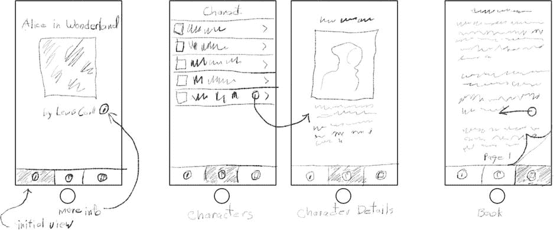

图 12-1. 仙境应用设计

中间的标签页以表格视图列出书中的角色。点击一行会跳转到一个包含更多信息的详情视图。此界面由一个导航控制器控制，因此导航栏提供了一种返回列表的方式。

这本书出现在最后一个标签页中，这是一个页面视图控制器，用户可以在其中滑动和点击来浏览文本。

## 创建仙境应用

启动 Xcode 并创建一个新项目。（我敢肯定你预料到了这一步。）这次，基于标签页应用模板创建项目，如图 12-2 所示。将应用命名为`Wonderland`，将语言设置为`Swift`，并使其为通用应用。

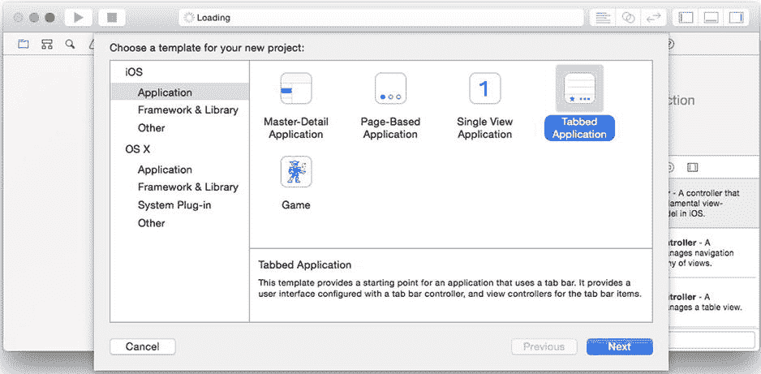

图 12-2. 仙境应用的项目模板

你的应用呈现的初始视图控制器将是一个标签栏控制器；标签页应用模板创建的项目，其初始视图控制器就是一个标签栏控制器。通过巧妙选择标签页应用模板，你的第一步已经完成。你已经创建了一个`UITabBarController`对象，并将其安装为应用的初始视图控制器。

**提示** *初始视图控制器*是应用启动时呈现的视图控制器。你可以在应用委托对象的启动代码中通过编程方式创建它，也可以让 iOS 为你呈现它。要实现后者，你需要将其`Is Initial View Controller`属性设置为`true`。你可以在 Interface Builder 中通过使用属性检查器勾选“Is Initial View Controller”选项，或者拖动初始视图控制器箭头（如图 12-3 中标签栏控制器对象左侧所示）并将其附加到你选择的视图控制器上来设置此属性。

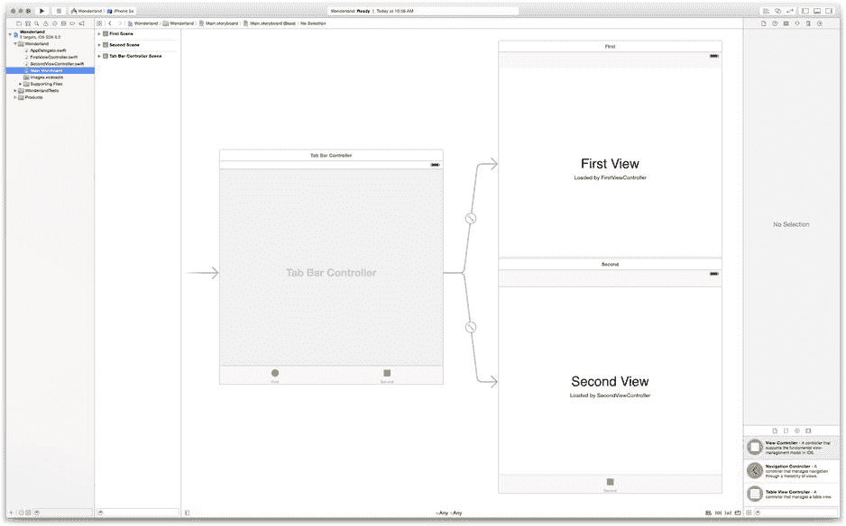

图 12-3. 初始标签栏配置

请记住，标签栏控制器是一个容器视图控制器。它本身不显示太多内容。选择`Main.storyboard` Interface Builder 文件，如图 12-3 所示。标签视图控制器中间的大片空白区域将由其他视图控制器的内容填充。该故事板显示你的标签栏控制器预配置了两个内容视图控制器：`FirstViewController`和`SecondViewController`。

要使用标签栏，你必须为每个标签页提供一对对象：一个要显示的视图控制器和一个标签栏项目（`UITabBarItem`），用于配置屏幕底部该标签页的按钮。每个标签栏项目定义了一个标题和一个图标。图标看起来像是资源文件，所以我们就从这里开始。


**注意** 容器视图控制器可以显示界面元素（例如标签栏），这些元素不属于所呈现视图控制器的内容，或者位于其内容之外。视图控制器根视图对象内部的所有内容被称为其*内容*。外部的一切则被称为*外观*。

## 添加仙境（Wonderland）的资源

我要让你稍微走点捷径，一次性添加这个项目的所有资源。这将为你（和我）省去在本章中为每个你要开发的界面重复这些步骤的麻烦。现在就全部添加进来；我会在你需要时逐一解释。

在之前的项目中，我让你将单个资源文件添加到项目导航器中的主顶层组（文件夹图标）或 `Images.xcasset` 资源目录中。本项目中有足够多的资源文件，因此我将让你创建子组，以免它们变得难以管理。有三种方法可以在项目中组织源文件。

*   创建一个子组，然后在该组中创建或添加新文件
*   导入源文件的文件夹，并让 Xcode 为每个文件夹创建组
*   等到导航器中有太多文件杂乱无章时，再决定去组织它们

要使用第一种或第三种方法，请使用文件  新建组命令（也可以通过按住 Control 键单击或在项目导航器中右键单击来使用）创建一个新的子组。命名新组，然后导入资源文件、创建新的源文件，或者将现有文件拖入其中。开发者通常按文件类型（所有数据文件放在一个组中，类源文件放在另一个组中）或按功能单元（一个表格的所有源文件和资源文件放在一个组中）来组织他们的组。这属于风格和个人偏好问题。

**提示** 如果你决定使用第三种方法（这也是我个人最喜欢的），请使用文件  从所选内容新建组命令。选择要组织到一个组中的文件，然后选择从所选内容新建组。它会创建一个新的子组，并将所有选中的项目一步移动到该组中。

当你一次性导入大量资源文件时，第二种方法非常方便。找到 `Learn iOS Development Projects`  `Ch 12`  `Wonderland (Resources)` 文件夹。这些资源文件已被组织到子文件夹中：`Data Resources`、`Character Images`、`Info Images` 和 `Tab Images`。你无需将单个文件拖入项目导航器，而是将文件夹拖入你的项目，一次性导入所有资源文件。从 `Data Resources` 文件夹中的数据（非图像）文件开始。将该文件夹拖放至 Wonderland 组中，如图 12-4 所示。

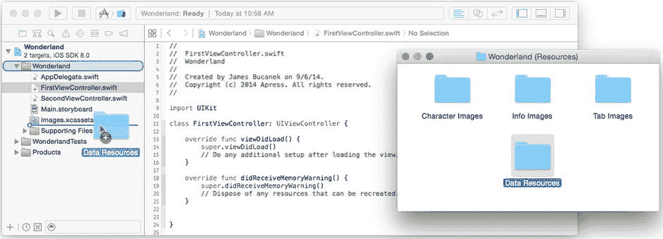

图 12-4. 添加一个资源文件文件夹

当导入对话框出现时，确保选中了“创建组”选项，如图 12-5 左侧所示。这会将每个文件夹中的资源文件转换成一个组，如图 12-5 右侧所示。

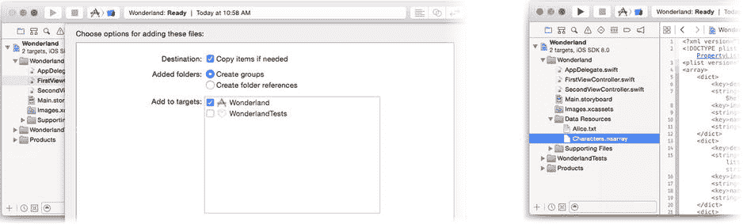

图 12-5. 为新的资源文件夹复制并创建组

要对你的图像执行类似操作，请选择 `Images.xcassets` 资源目录项，然后将所有三个图像文件夹（`Character Images`、`Info Images` 和 `Tab Images`）拖入目录的组列中，如图 12-5 左侧所示。这将自动创建三个图像组，如图 12-6 右侧所示。

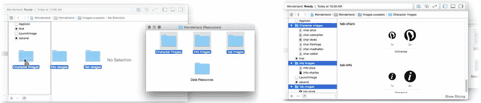

图 12-6. 导入图像文件组

为整洁起见，让我们丢弃一些不需要的残余文件。在资源目录中选择 `first` 和 `second` 图像集。按住 Command 键的同时按下 Delete 键（或选择编辑  删除）以从项目中移除这些项目。

**注意** 你还会在 `Wonderland (Icons)` 文件夹中找到一些应用图标。如果你愿意，可以将它们拖放到 `AppIcon` 图像集中。

### 配置标签栏项目

现在你已经拥有了所有资源，接下来为第一个标签配置标签栏。标签栏中的每个标签按钮通过与其视图控制器关联的 `UITabBarItem` 对象进行配置。当视图控制器被添加到标签栏控制器时，Interface Builder 会自动在定义该视图控制器的场景中创建此对象。选择 `Main.storyboard` 文件。找到并展开第一个视图控制器组，如图 12-7 左侧所示。选择标签栏项目对象，使用属性检查器将其标题更改为 Welcome，并将其图像设置为 `tab-info`，如图 12-7 右侧所示。当你更改栏项目的名称时，场景的名称将变为 Welcome Scene。

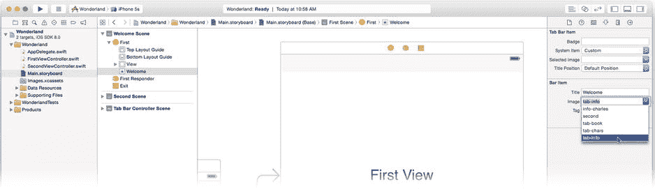

图 12-7. 配置第一个标签栏项目

**注意** 标签栏按钮的图像并非“原样”显示。你提供的图像像模板一样使用，从图像的不透明像素中创建一个轮廓。因此，不要费心用漂亮的颜色设计你的标签栏按钮图像；只有透明度才重要。

对于添加到标签栏的每个内容视图，你都将重复这些步骤。现在继续处理第一个标签的内容。

### 第一个内容视图控制器

第一个标签展示了一个基于 `UIViewController` 的简单内容视图控制器。Xcode 模板已经创建了一个自定义视图控制器（`FirstViewController`），并将其作为第一个标签的内容附加。这几乎正是你想要的，所以将其清空并打造为你自己的样式。

选择 `Main.storyboard` 文件。双击画布中的第一个视图控制器（右上方）使其成为焦点。视图中已经包含一些标签和文本视图对象。选中它们并将其删除。

使用对象库，添加两个标签和一个图像视图对象。使用属性和尺寸检查器，按如下方式设置它们的属性：

1.  第一个标签
    1.  文本：Alice’s Adventures in Wonderland
    2.  字体：System 16.0
2.  第二个标签
    1.  文本：by Lewis Carroll
    2.  字体：System 13.0
3.  图像视图
    1.  图像：`info-alice.png`
    2.  模式：Aspect Fit

**提示** 更改对象的文本、字体或图像后，如果其内容不再完全适合其尺寸，请选中它并使用编辑器  按内容调整大小命令。它将调整对象的大小，使其与包含的图像或文本大小完全一致，这也被称为其*固有尺寸*。

排列这些视图，使其看起来像图 12-8 中的样子。

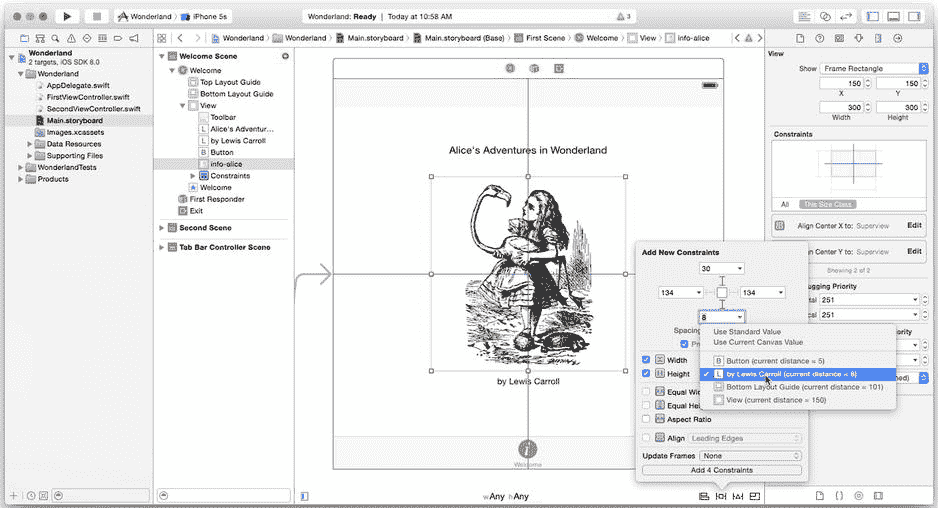

图 12-8. 创建第一个视图控制器界面

接下来添加约束。选中所有三个视图对象，并使用对齐约束控件添加水平居中约束。然后仅选中图像视图并将其垂直居中。保持图像视图处于选中状态，使用固定约束控件添加上方（30 像素）和下方（8 像素）的垂直间距约束，并将高度和宽度都固定为 300 像素，如图 12-8 所示。你的第一个标签视图的布局就完成了。（嗯，差不多完成了。在本章稍后，你将返回并添加一个按钮）。


好的，作为高级文档工程师和翻译员，我将严格遵循您给出的注意事项和示例，将以下英文文本翻译成中文。


选择一个模拟器并运行你的应用。你的第一个视图控制器会出现在标签视图控制器中（如图 12-9 左侧所示）。你可以通过屏幕底部的按钮在两个视图控制器之间切换，如图 12-9 右侧所示。

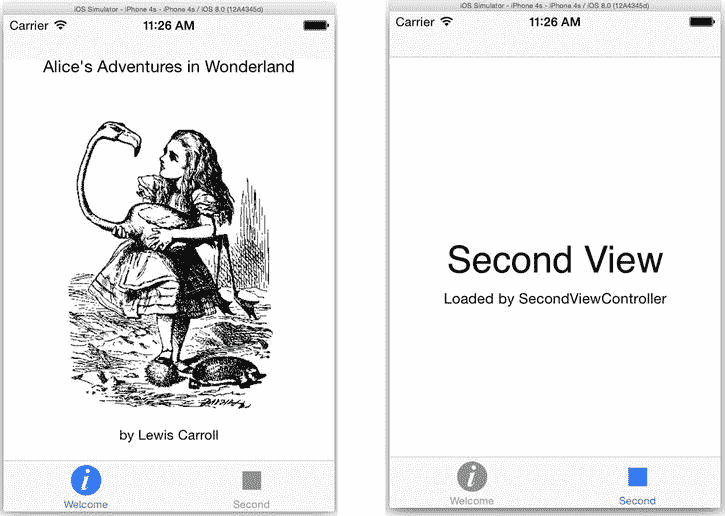

图 12-9。标签视图控制器中的两个视图控制器

回顾一下，你已经设计了一个内容视图控制器（你的欢迎屏幕），并将其添加到了一个容器视图控制器（标签视图）中。现在，大胆地在一个容器视图控制器中添加另一个容器视图控制器吧。

### 创建可导航的表格视图

你的 Wonderland 应用的第二个标签页会在一个表格视图中展示角色列表。点击某一行会导航到一个显示角色详细信息的屏幕。这听起来熟悉吗？确实应该如此。你在第 5 章中已经构建过这个应用。好吧，你需要再次构建它。但这一次，重点将放在导航上。

从第 5 章你已经知道你将需要以下内容：

*   一个导航视图控制器
*   `UITableViewController` 的一个自定义子类（用于表格视图）
*   一个数据模型
*   一个表格视图委托对象
*   一个数据源对象
*   一个表格视图单元格对象
*   `UIViewController` 的一个自定义子类（用于详情视图）
*   用于显示详情视图的视图对象

从导航视图控制器开始。导航视图控制器是一个容器视图控制器。它最初显示的视图是它的*根视图控制器*。这个视图是它的基础，是所有导航的起点和最终返回点。为了让 Wonderland 应用的第二个标签页呈现一个可导航的表格视图，你需要将一个导航控制器安装为标签栏中的第二个视图控制器，然后将一个表格视图控制器安装为该导航控制器的根视图控制器。这比听起来要简单。

首先，清理一些空间。选择 `Main.storyboard` 文件。第二个标签页中已经有一个 `SecondViewController`。你不需要它。在 Interface Builder 画布中选择第二个视图控制器的场景并将其删除。然后选择 `SecondViewController.swift` 文件并将其删除。

从对象库中拖入一个导航控制器，并将其放置在第一个视图控制器的下方，如图 12-10 所示。一个新的导航控制器会预装一个表格视图控制器，这正是你所需要的。（看，我告诉过你这个不会太难。）你还需要一个详情视图，所以在表格视图旁边再拖入一个视图控制器对象，同样如图 12-10 所示。

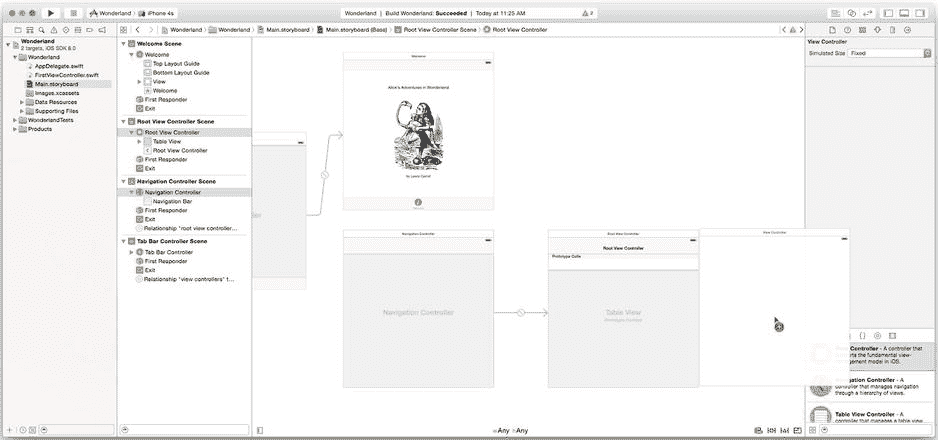

图 12-10。添加导航控制器、表格视图控制器和视图控制器

要将导航控制器添加到标签栏，请按住 Control 键并单击（或右键单击）标签栏控制器，然后拖拽到导航控制器上，如图 12-11 所示。当弹出菜单出现时，找到“关系转场”类别并选择 `view controllers`。这个特殊的连接将视图控制器添加到容器视图控制器所管理的控制器集合中。标签视图中会出现第二个标签页，并且一个配套的标签栏项目对象会被添加到导航控制器的场景中。

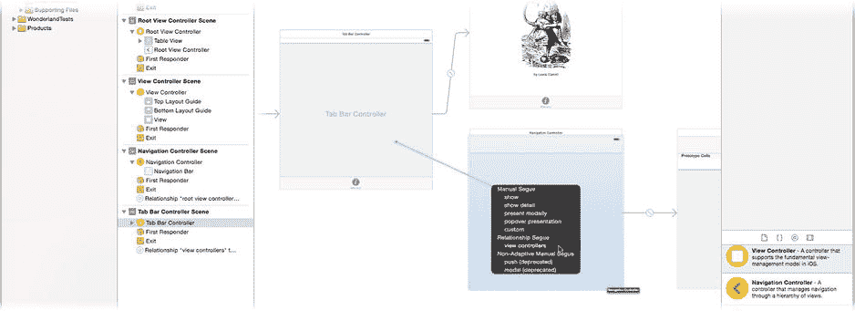

图 12-11。将导航控制器设置为第二个标签页

展开大纲中的“导航控制器场景”组，并选择标签栏项目。使用属性检查器将标题设置为 `Characters`，图片设置为 `tab-chars`。

现在，你已经向你的标签栏（容器）视图控制器添加了一个可导航的视图控制器。它是第二个标签页。它有一个标题和图标。点击它将在导航（容器）视图控制器内呈现表格（内容）视图控制器。听起来很复杂，但故事板使组织关系变得易于理解。

### 为表格视图注入数据

你现在就可以运行你的应用，点击“角色”标签页，然后惊叹于你表格视图的空旷。从第 5 章可知，没有数据源和一些数据，你的表格视图就没有任何内容可显示。现在让我们来解决这个问题。

你将需要一个 `UITableViewController` 的自定义子类，所以创建一个。你也知道你将需要一个 `UIViewController` 的自定义子类用于你的详情视图。既然开始了，你不妨也把它创建好。添加（或拖入）一个新的 Swift 文件。将其命名为 `CharacterTableViewController` 并进行编辑，使其看起来像这样：

```
import UIKit

class CharacterTableViewController: UITableViewController {
}
```

类似地，添加（或拖入）一个新的 Swift 文件，将其命名为 `CharacterDetailViewController`，并进行编辑，使其看起来像这样：

```
import UIKit

class CharacterDetailViewController: UIViewController {
    @IBOutlet var nameLabel: UILabel!
    @IBOutlet var imageView: UIImageView!
    @IBOutlet var descriptionView: UITextView!
}
```

回顾一下让表格视图工作你需要做的事情列表，现在你已经有了一个导航控制器以及表格和视图控制器的自定义子类。但是界面中的对象还不是你的自定义子类。选择 `Main.storyboard` 文件，选择表格视图控制器，并使用标识检查器将其类更改为 `CharacterTableViewController`。对详情视图控制器执行相同操作，将其类设置为 `CharacterDetailViewController`。

### 创建详情视图

既然你已经在角色详情视图控制器中，那就继续创建它的界面吧。使用对象库，向角色详情视图控制器添加一个标签、一个图像视图和一个文本视图。将标签视图放置在顶部，图像放在中间，文本视图放在其下方，大致如图 12-12 所示的排列。你现在还不需要添加任何约束。

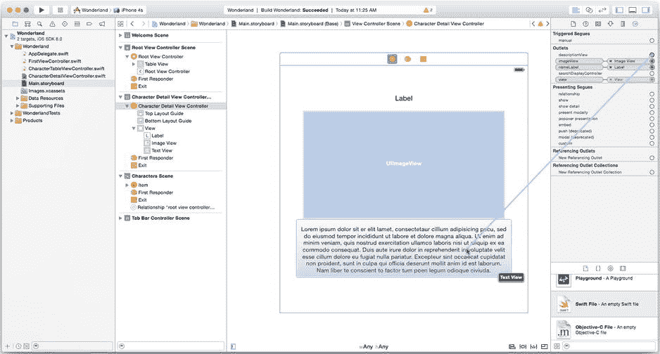

图 12-12。初始角色详情布局

选择视图控制器对象并切换到“输出口检查器”。将 `nameLabel`、`imageView` 和 `descriptionView` 输出口连接到界面中各自的对象，也如图 12-12 所示。

### 添加数据模型

还剩下什么？你仍然需要创建一个数据模型，并为表格视图提供一个数据源和表格视图单元格对象。从数据模型开始。

我有个惊喜给你。我已经为你创建了一个数据模型。我是不是很 nice？角色详情信息存储在一个对象数组中。数组的每个元素包含一个字典。每个字典都包含角色名称、其图像的文件名以及一个简短描述。所有这些信息都存储在你本章前面添加的资源文件之一的 `Characters.nsarray` 文件中。

**注意**  `Characters.nsarray` 文件是一个序列化的属性列表 XML 文件。如果你想查看它，可以在 Xcode 或几乎任何纯文本编辑器中打开它。我通过编写一个 OS X 命令行程序创建了这个文件，该程序创建所有字典，将它们组装成一个数组，然后将该数组写入（序列化）到一个文件中。执行此操作的项目位于 `Learn iOS Development Projects`  `Ch 12`  `CharacterMaker` 文件夹中。属性列表和序列化将在第 18 章中解释。


### 排版后的内容

将数据模型添加到表视图控制器，为此创建一个用于保存数组的属性。将以下属性添加到`CharacterTableViewController.swift`文件中：

```
var tableData: [[String: String]] {
    if tableData_Lazy == nil {
        if let url = NSBundle.mainBundle().URLForResource( "Characters", 
                                                    withExtension: "nsarray") {
            tableData_Lazy = NSArray(contentsOfURL: url) as? [[String: String]]
        }
        assert(tableData_Lazy != nil, "Characters.nsarray did not load")
    }
    return tableData_Lazy!
}
private var tableData_Lazy: [[String: String]]?
```

你在第 9 章中已经见过这种用法。这里声明了一个名为`tableData`的只读属性，它返回一个字典数组，每个字典将字符串键映射到字符串值（`[[String: String]]`）。该数组在首次被请求时从`Character.nsarray`文件中惰性读取，并存储在私有属性`tableData_Lazy`中以供后续使用。

**使用断言**

请注意在`tableData`属性获取器中使用`assert(_:,_:)`语句。断言语句有两个参数：一个布尔条件和一个字符串描述。它们在开发过程中用于表达你做出的任何强假设。第一个参数表达了程序中你始终假设为真的内容，而消息则描述了如果假设不成立可能出错的地方。在大多数应用程序中，有很多地方你对值或关系做出了假设。你可能假设大小始终非零，日期总是在未来，或者插座（outlet）始终已设置。

在这个例子中，`tableData`应始终返回一个值。这假设`Characters.nsarray`文件是你的应用的永久资源，并且始终可以加载。这确实不应该成为问题。编写代码来考虑`Characters.nsarray`文件不存在或无法加载的可能性是没有意义的。但如果假设不成立，并且`tableData`返回`nil`，你的应用将陷入困境。`assert(_:,_:)`函数会捕获这种情况，终止你的应用，并将消息（“Characters.nsarray did not load”）发送到你的 Xcode 调试控制台。这有助于你在开发过程中发现这类错误；也许你忘记将`Characters.nsarray`资源文件包含在应用的目标中，或者不小心重命名了该文件。

当然，你可以省略断言语句，让`tableData`返回`nil`，但程序中其他部分的某些随机代码会尝试使用该`nil`值并导致应用崩溃。然后，你将花费五分钟时间试图找出是什么导致了内存段错误。使用断言语句，你可以立即发现问题并确切知道哪里出错，从而缩短调试工作。

断言函数在生产代码中不会执行。它们仅在为调试构建应用时测试其条件。当你为分发编译应用时，所有断言语句都会关闭，就好像它们不存在一样。

字典的键需要定义为常量。在`class CharactersTableViewController`声明之前，添加以下三个全局常量：

```
let nameKey = "name"
let imageKey = "image"
let descriptionKey = "description"
```

在类定义之外声明它们使它们成为全局属性，易于从其他类访问（`CharacterDetailViewController`也将需要它们）。现在，你有了数据模型！

### 实现数据源

现在，你需要通过数据源对象将这些信息提供给表视图。仍在`CharacterTableViewController.swift`文件中，添加一个`tableView(_:,numberOfRowsInSection:)`函数。

```
override func tableView(tableView: UITableView, 
                        numberOfRowsInSection section: Int) -> Int {
    return tableData.count
}
```

此函数为表视图提供列表中的行数，即数组中的对象数量。

**注意** 你可能已经注意到你尚未将表视图的`delegate`或`dataSource`插座连接到你的表视图控制器。这是因为你的控制器是`UITableViewController`的子类，而该类专为管理表视图而设计。如果你自己*不*连接`delegate`或`dataSource`插座，控制器会自动将自身设置为表的委托和数据源。这难道不方便吗？

### 定义表视图单元格对象

这个难题的最后一部分是为每一行提供一个表视图单元格对象——表视图的橡皮图章。在`tableView(_:,numberOfRowsInSection:)`函数之后立即添加`tableView(_:,cellForRowAtIndexPath:)`函数：

```
override func tableView(tableView: UITableView, 
              cellForRowAtIndexPath indexPath: NSIndexPath) -> UITableViewCell {
    let cellID = "Cell"
    let cell = tableView.dequeueReusableCellWithIdentifier( cellID, 
                                     forIndexPath: indexPath) as UITableViewCell
    let characterInfo = tableData[indexPath.row]
    cell.textLabel?.text = characterInfo[nameKey]
    return cell
}
```

这段代码应该看起来很熟悉——除非你跳过了第 5 章。单元格的外观由故事板中的单元格原型定义，你仍需要定义该原型。切换到`Main.storyboard`文件并找到表视图控制器。

在表视图顶部，你会看到一个标记为“原型单元格”的区域，如图 12-13 所示。选择第一个空白单元格，并使用属性检查器将其样式更改为基本，将其标识符设置为`Cell`，并将其附件更改为显示指示器（请参见图 12-13）。

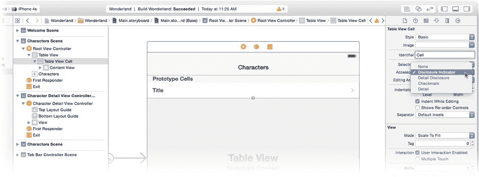

图 12-13 定义表单元格

现在，当你的`tableView(_:,cellForRowAtIndexPath:)`函数请求`Cell`表单元格对象时，它已经在那里。你的代码只需配置单元格的文本即可。

你的表视图现在有了数据。在模拟器中运行应用，点击第二个标签，这次你的表格将显示数据模型中的名称，如图 12-14 所示。

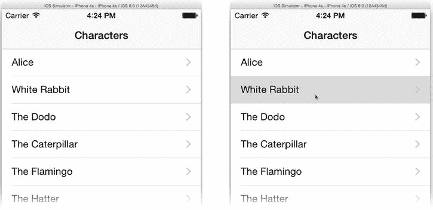

图 12-14 工作中的表视图

### 推入详情视图控制器

然而，点击表格中的一行并不会产生太多效果（如图 12-14 右侧所示）。这是因为你尚未定义呈现详情视图的操作。

你将添加一个从表单元格视图到详情视图的转场。按住 Control 键并单击或右键单击原型单元格对象，然后拖拽到角色详情视图控制器（也显示在图 12-15 中）。释放鼠标时，从“选择转场”组中选择“显示”选项。这将配置所有使用此单元格对象的行，将角色详情视图控制器“推入”导航控制器的堆栈中，并将其作为活动视图控制器呈现。

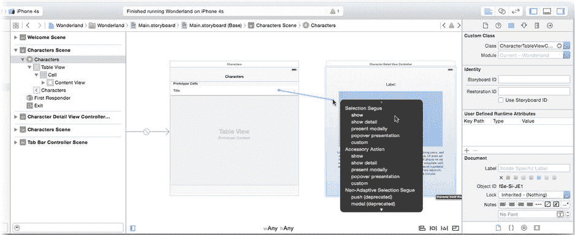

图 12-15 将转场连接到表单元格视图

正如你在第 5 章中所做的那样，你需要一些代码来根据用户点击的行准备详情视图。为此，你需要知道转场何时被触发。选择新创建的转场，并使用属性检查器将其标识符更改为`detail`，如图 12-16 所示。

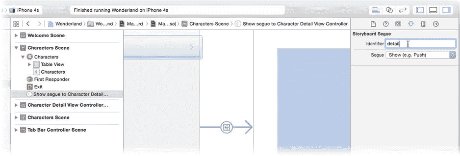

图 12-16 分配转场标识符


  
返回`CharacterTableViewController.swift`文件并添加以下函数：  

```  
override func prepareForSegue(segue: UIStoryboardSegue, sender: AnyObject!) {  
    if segue.identifier == "detail" {  
        let detailsController = segue.destinationViewController   
                                         as CharacterDetailViewController  
        if let selectedPath = tableView?.indexPathForSelectedRow() {  
            detailsController.characterInfo = tableData[selectedPath.row]  
        }  
    }  
}  
```  

当此视图控制器中触发`segue`时，会调用此函数。`segue`对象包含所涉及视图控制器（包括来源和目标）的相关信息。利用它来获取故事板刚刚创建并加载的详情视图控制器对象。然后使用`tableView`对象获取当前选中行的行号（即用户正在点击的行），并据此从数据模型中获取角色详细信息，然后配置新的视图控制器（通过设置`characterInfo`属性）。  

还有一些未完成的工作。详情视图控制器还没有`characterInfo`属性！切换到`CharacterDetailViewController.swift`文件并添加以下代码：  

```  
var characterInfo = [String: String]()  

override func viewWillAppear(animated: Bool) {  
    super.viewWillAppear(animated)  
    nameLabel?.text = characterInfo[nameKey]  
    imageView?.image = UIImage(named: characterInfo[imageKey]!)  
    descriptionView?.text = characterInfo[descriptionKey]  
}  
```  

现在，你的详情视图控制器拥有了`characterInfo`属性。当视图控制器即将显示在屏幕上时，此代码将使用`characterInfo`中的详细信息填充视图对象。在模拟器中运行应用进行尝试，如图 12-17 所示。  

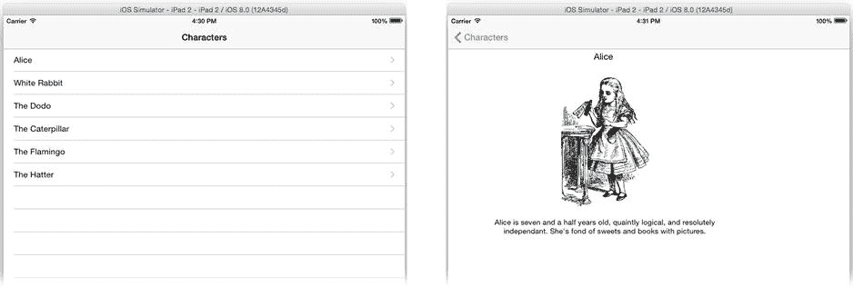  

图 12-17 可工作的角色表格  

虽然信息已经显示，但你会发现详情视图控制器中的视图排列不够美观，也没有调整自身大小。如果在 iPhone 上运行，情况会更糟。别担心，你将在本章后面的“适应变化”部分解决这个问题。  

你的应用现在已经完成了三分之二。在本节中，你创建了一个表格视图和一个详情视图，它们嵌套在导航视图控制器中，而导航视图控制器又嵌套在标签视图控制器中。  

到现在为止，你应该对内容视图控制器和容器视图控制器、连接它们以及创建`segue`来定义应用导航已经相当熟悉了。本章的最后部分将展示如何使用页面视图控制器。  

**创建页面视图控制器**  

你现在已经到达了 Wonderland 应用的第三个也是最后一个标签页。该标签页将逐页显示书籍文本。这个标签页使用页面视图控制器（`UIPageViewController`）对象。它是一个容器视图控制器，管理着一个（可能非常庞大的）内容视图控制器集合。每个“页面”由一个或两个内容视图控制器组成。页面视图控制器提供了手势识别器来执行和动画化页面之间的导航。  

将页面视图控制器添加到设计中很简单。但要让它工作则是另一回事。页面视图控制器通常代码量很大，这个应用也不例外。更刺激的是，你必须先完成大部分代码，页面视图才能有任何效果。所以，做好准备，这将是一段漫长的旅程。  

你需要创建一些新类，现在就全部创建它们。使用“新建文件”命令（或拖入 Swift 文件模板对象）在你的项目 Wonderland 分组中创建新的 Swift 文件。每创建一个新文件，就编写一个骨架类定义。这会让 Xcode 知道你将要编写哪些类、它们的父类是什么以及一些关键输出口。这样你就可以在编写大部分代码之前设计好界面。  

首先创建一个`BookViewController.swift`文件。这个类将是你自定义的页面视图控制器。  

```  
import UIKit  

class BookViewController: UIPageViewController {  
}  
```  

创建一个`BookDataSource.swift`文件。这将成为你的页面视图控制器的数据源对象。  

```  
import UIKit  

class BookDataSource: NSObject, UIPageViewControllerDataSource {  
}  
```  

向你的项目添加一个`OnePageViewController.swift`文件。这将是书籍每一页的视图控制器，并且它需要一些指向其视图的输出口。  

```  
import UIKit  

class OnePageViewController: UIViewController {  
    @IBOutlet var textView: OnePageView!  
    @IBOutlet var pageLabel: UILabel!  
}  
```  

最后，添加一个`OnePageView.swift`文件。这是一个自定义的`UIView`类，用于绘制一页的文本。这个类代码很短，你可以现在就把它全部写完。  

```  
import UIKit  

class OnePageView: UIView {  
    var text: NSString = "" { didSet { setNeedsDisplay() } }  
    var fontAttrs: [String: AnyObject]! = nil  

    override func drawRect(rect: CGRect) {  
        super.drawRect(rect)  
        text.drawInRect(bounds, withAttributes: fontAttrs)  
    }  
}  
```  

你应该能够理解这段代码，毕竟你已经阅读了第 11 章。当需要绘制自身时，`OnePageView`对象会用背景色填充其视图（`super.drawRect(rect)`为你完成了这项工作），然后使用其`fontAttrs`属性中存储的属性来绘制`text`。  

我略过了你需要的最后一个类的代码。它相当长，而且不是本章的重点。找到你下载的源代码。在`Learn iOS Development Projects`  `Ch 12`  `Wonderland`文件夹中，找到`Paginator.swift`文件并将其拖入项目的 Wonderland 分组——记得在导入时选中“复制”选项。  

`Paginator`对象概念上很简单。它有三个可设置的属性：整本书的文本（作为一个字符串）、一种字体和一个视图大小。该对象将文本分割成页面，每个页面都能恰好用该字体填充给定的视图大小。如果你对细节感兴趣，请阅读代码中的注释。  

**注意** 这远非实现分页器最复杂的方式，但对于这个应用来说已经足够了。  

现在，你已经准备好添加视图控制器并设计界面了。  

**添加页面视图控制器**  

并不全是代码。使用 Interface Builder 来创建两个视图控制器。选择`Main.storyboard`文件。从对象库中拖出一个新的页面视图控制器并添加到你的设计中。同时添加一个新的视图控制器对象，如图 12-18 所示。将它们排列在其他场景下方。  

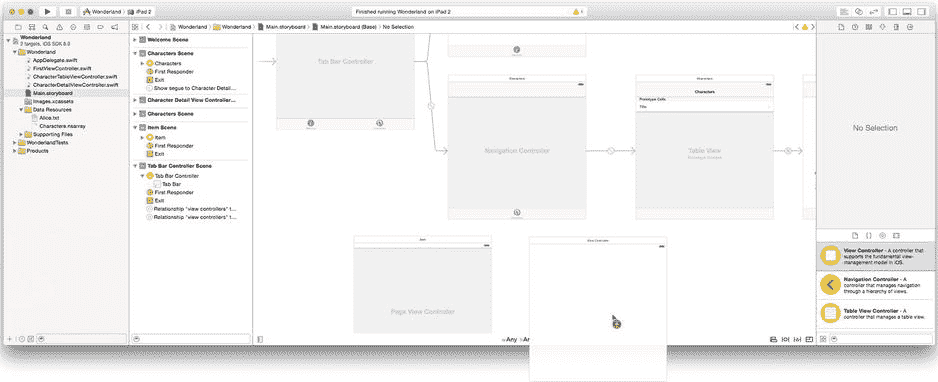  

图 12-18 添加页面视图控制器和单页视图控制器  

通过 Control 拖动或右键拖动从标签栏控制器到新的页面视图控制器，将页面视图控制器添加到标签栏，如图 12-19 所示，就像之前为导航视图控制器所做的那样。选择“视图控制器”关系。  

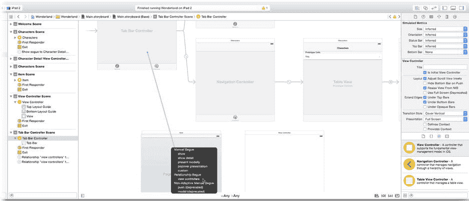  

图 12-19 将页面视图控制器添加到标签栏  


与其他标签页的操作类似，在页面视图控制器的场景中选中标签栏项。使用属性检查器将其标题设置为 `Book`，标签图标设置为 `tab-book`。

现在配置页面视图控制器本身。选中页面视图控制器对象，使用标识检查器将其类更改为 `BookViewController`。切换到属性检查器，并仔细检查以下属性是否已设置：

* Navigation: Horizontal
* Transition Style: Page Curl
* Spine Location: Min

这些设置定义了一个“书本式”界面，用户可以在其中水平翻动一系列视图控制器，每页显示一个。（如果将 Spine Location 设置为 Mid，则每页会显示两个视图控制器。）控制器之间的转场效果模拟了纸张翻页的动画。

## 设计原型页面

现在，请移步至刚刚添加的纯视图控制器。使用标识检查器将其类更改为 `OnePageViewController`。同时将其 Storyboard ID 更改为 `OnePage`。这最后一步非常重要。此控制器将不会在 Interface Builder 中连线；您将以编程方式创建它的实例。为此，您需要一种引用它的方式，就需要使用它的 Storyboard ID 来完成。

完成上述准备工作后，开始为单页视图控制器创建界面。从对象库中，按如下方式添加三个视图对象：

1. 标签
    1. 字体：System 15.0
    2. 文本：Alice’s Adventures in Wonderland
    3. 位置：顶部居中
2. 标签
    1. 字体：System 11.0
    2. 位置：底部居中
3. 视图
    1. 在两个标签之间居中，以填充可用空间。
    2. 使用标识检查器将其类更改为 `OnePageView`。
4. 约束
    1. 选中两个标签对象，并添加水平居中约束。
    2. 选中顶部标签，并添加一个相对于顶部布局指南的垂直约束（标准距离）。
    3. 选中底部标签，并添加一个相对于底部布局指南的垂直约束（标准距离）。
    4. 选中图片视图，并添加顶部、前导、尾部、底部约束，均设为 20 像素，如图 12-20 所示。

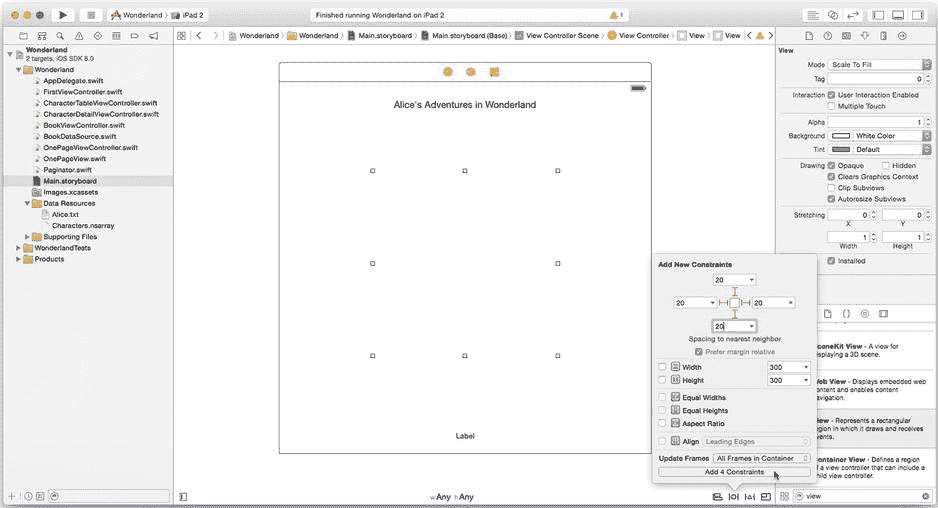

图 12-20. 单页视图控制器布局

选中单页视图控制器对象，并使用连接检查器将其两个输出口分别连接到 `OnePageView` 对象和底部的标签（该标签将显示页码），如图 12-21 所示。

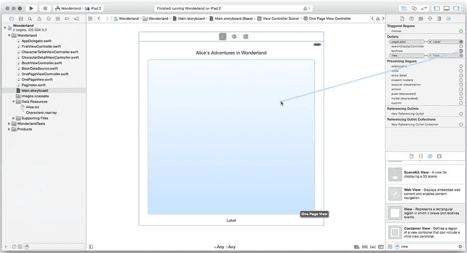

图 12-21. 连接页面视图对象

## 编写单页视图控制器代码

您现在已经完成了在 Interface Builder 中几乎所有能做的操作。是时候卷起袖子开始编码了。这次，从设计的“尾部”开始，逐步回溯到页面视图控制器，并沿途填充细节。链条中的最后一个对象是 `OnePageView`，这是一个显示页面文本的自定义视图。您已经编写了它，而且相当简单。（如果已经忘了，可以悄悄回到“创建页面视图控制器”一节复习一下。）

接下来继续处理视图控制器。您已经定义了类，添加了两个输出口（`textView` 和 `pageLabel`），并将这些输出口连接到它们的视图对象。现在添加几个属性和一个 `loadPageContent()` 函数。

```
var pageNumber = 1
var paginator: Paginator? = nil

func loadPageContent() {
    if let tv = textView {
        if let pager = paginator {
            pager.viewSize = tv.bounds.size
            if !pager.pageAvailable(pageNumber) {
                pageNumber = pager.lastKnownPage
            }
            tv.fontAttrs = pager.fontAttrs
            tv.text = pager.textForPage(pageNumber)
        }
    }
    pageLabel?.text = "Page \(pageNumber)"
}
```

`pageNumber` 决定了此视图控制器显示的书籍页码。它将在控制器创建时由数据源设置。`paginator` 属性将此视图控制器与书籍内容连接起来。`loadPageContent()` 函数首先用文本视图的实际尺寸配置 `paginator`，然后只需向分页器请求当前页的文本和绘制时应使用的字体属性，并将这些值传递给负责实际绘制的 `textView`（`OnePageView`）对象。`OnePageViewController` 实际上只是其 `OnePageView` 和 `Paginator` 之间的“粘合剂”。

最后，将 `pageLabel` 视图设置为显示书籍的页码。

那么，`loadPageContent()` 何时被调用？在大多数情况下，这种首次视图设置代码会从 `viewDidLoad()` 函数中调用。但 `loadPageContent()` 需要在文本视图大小发生变化时被调用，而这可能随时发生，最典型的是当用户改变显示方向时。通过重写 `viewDidLayoutSubviews()` 函数并在控制器视图布局调整时调用 `loadPageContent()` 来解决这个问题。

```
override func viewDidLayoutSubviews() {
    super.viewDidLayoutSubviews()
    loadPageContent()
}
```

我将在本章后面讨论 `viewDidLayoutSubviews()` 和其他适配函数。

## 编写页面视图数据源

您终于触及了页面视图控制器的核心：页面视图数据源。页面视图控制器数据源必须遵循 `UIPageViewControllerDataSource` 协议，并实现以下两个必需的函数：

```
pageViewController(_:,viewControllerBeforeViewController:) -> UIViewController
pageViewController(_:,viewControllerAfterViewController:) -> UIViewController
```

页面视图从一个初始视图控制器开始显示。当用户向左或向右“翻页”时，页面视图控制器会根据翻页方向向数据源对象发送其中一条消息。数据源以当前视图控制器为参考，检索或创建用于显示下一页（或上一页）的视图控制器。如果没有页面，则返回 `nil`。

您的数据源必须实现这些方法。它还需要一个属性，用于引用所有单个视图控制器共用的那个分页器对象，以及一个用于创建任意页面视图控制器的函数。因此，您的 `BookDataSource.swift` 文件开头应如下所示：

```
let paginator = Paginator(font: UIFont(name: "Times New Roman", size: 18.0))

func load(# page: Int, pageViewController: UIPageViewController) 
                                                   -> OnePageViewController? {
    if page < 1 || !paginator.pageAvailable(page) {
        return nil;
    }
    let controller = pageViewController.storyboard?.instantiateViewController 
    WithIdentifier("OnePage") as OnePageViewController
    controller.paginator = paginator
    controller.pageNumber = page
    return controller
}
```

`paginator` 属性用一个 `Paginator` 对象进行初始化，该对象将使用 18 磅的 Times New Roman 字体来显示文本。

所有工作都在 `load(page:,pageViewController:)` 函数中完成。调用此函数并传入页码，它会返回一个用于显示该页面的视图控制器。如果请求的页面不存在，则返回 `nil`。它要求故事板对象（通过页面视图控制器获取）创建场景中包含的、标识符为 `OnePage` 的控制器和视图。这样做是因为在页面视图中，导航不是通过转场（segue）或动作（action）来完成的。数据源负责在收到请求时创建它们。


**注** 请记住，之前你在故事板中将视图控制器场景的标识符设置为`OnePage`，这正是原因所在。如果你需要通过编程方式从故事板场景加载视图控制器及其视图对象，`instantiateViewControllerWithIdentifier(_:)` 函数就是你的不二之选。

一旦获取了新的单页视图控制器对象，它就会将该控制器连接到分页器并设置其应显示的页码。

剩下的工作就是实现两个必需的数据源协议方法。这些方法也要写在你的`BookDataSource`类中。

```
func pageViewController(bookViewController: UIPageViewController, 
         viewControllerAfterViewController viewController: UIViewController) 
                                                  -> UIViewController? {
    if let pageController = viewController as? OnePageViewController {
        let pageAfter = pageController.pageNumber + 1
        return load(page: pageAfter, pageViewController: bookViewController)
    }
    return nil
}

func pageViewController(bookViewController: UIPageViewController, 
         viewControllerBeforeViewController viewController: UIViewController) 
                                                   -> UIViewController? {
    if let pageController = viewController as? OnePageViewController {
        let pageBefore = pageController.pageNumber - 1
        return load(page: pageBefore, pageViewController: bookViewController)
    }
    return nil
}
```

由于每个单页视图控制器都存储了其显示的页码，这两个函数只需请求当前页的下一页或上一页即可。

## 初始化页面视图控制器

你的图书实现已接近完成。剩下的唯一任务是在页面视图控制器创建时，对其进行一些初始设置并初始化数据模型。切换到`BookViewController.swift`文件。首先创建一个属性来存储数据源对象。

```
let bookSource = BookDataSource()
```

**注** 为什么需要创建`bookSource`实例变量？这涉及到自动引用计数（ARC）内存管理系统的一个特性。有关解释，请阅读已完成项目中的注释以及第 20 章。

现在编写`viewDidLoad()`函数，以便在页面视图控制器创建时对其进行初始化。

```
override func viewDidLoad() {
    super.viewDidLoad()
    if let textURL = NSBundle.mainBundle().URLForResource( "Alice",
                                                withExtension: "txt") {
        bookSource.paginator.bookText = NSString(contentsOfURL: textURL,
                                 encoding: NSUTF8StringEncoding, error: nil)
    }
```

这段代码首先读取存储在`Alice.txt`文件中的图书文本。这是你刚开始时添加的资源文件之一。该文件是一个 UTF-8 编码的文本文件，每行由单个回车符（`U+000d`）分隔。这种格式正是分页器所期望的。整个文本被读入一个字符串中并存储在分页器中，分页器将利用它来为每一页分配文本。

```
dataSource = bookSource
```

下一条语句将`bookSource`对象设置为页面视图控制器的数据源。

```
    let firstPage = bookSource.load(page: 1, pageViewController: self)!
    setViewControllers( [firstPage],
             direction: .Forward,
              animated: false,
            completion: nil)
}
```

最后这条语句可能是最重要的。它通过显式创建第 1 页的控制器，来生成页面视图控制器将呈现的初始视图控制器。必须在页面视图控制器出现之前通过编程方式完成此操作。

**注意** 页面视图控制器的初始视图控制器是一个数组。数组中的视图控制器数量必须与页面视图控制器一次呈现的视图控制器数量完全一致。如果你将页面视图控制器的书脊位置配置为`.Mid`，则必须提供两个初始视图控制器：一个用于左侧页面，另一个用于右侧页面。

代码量很大，但你已经完成了！运行你的应用并测试第三个标签页，如图 12-22 所示。

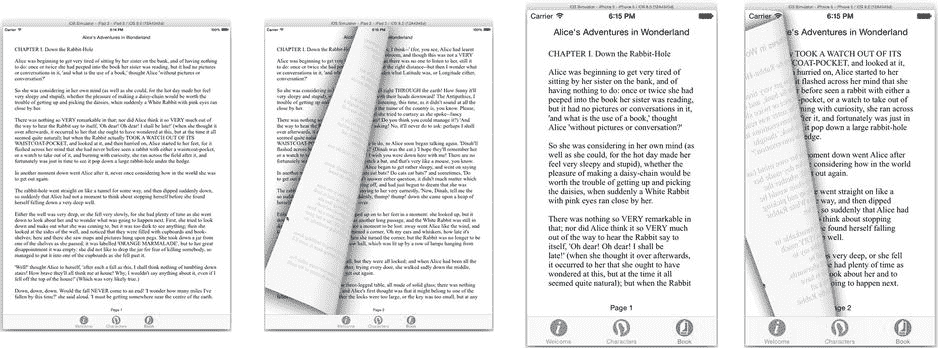

图 12-22. 正常工作的页面视图界面

恭喜你，你已经创建了一个非常复杂的应用。在此过程中，故事板为你提供了帮助，它让你能够在单个文件中映射并定义应用的大部分导航逻辑。但你还学会了如何在需要时以编程方式加载故事板场景。

我鼓励你花点时间回顾一下故事板文件中的场景以及你为支持这些场景而创建的类。一旦你确信自己理解了视图控制器的组织方式、它们如何协同工作以及你所创建的各个类的作用，那么你就可以认为自己是一名一流的 iOS 导航工程师了。

现在，是时候掌握另外两项必不可少的导航技能了：呈现视图控制器和适配视图控制器。

## 呈现视图控制器

*呈现*一个视图控制器，会让该视图控制器的内容变得可见，并允许用户与之交互。从第 2 章开始你就一直在做这件事。通常情况下，你的视图控制器是*隐式*呈现的。例如你的初始视图控制器，以及容器视图控制器中的视图控制器，就像你在本章中创建的许多视图控制器那样。你并没有编写任何代码来呈现标签视图中的三个视图控制器；你只是将它们添加到标签视图控制器中，然后让它来呈现它们。

你使用`presentViewController(_:,animated:,completion:)`函数*显式*呈现一个视图控制器。这几乎总是一种*模态*呈现。也就是说，被呈现的视图控制器会占据整个显示区域（或覆盖现有界面），并接管用户交互，直到它被关闭。此时，它会消失，之前的视图控制器会再次变得可见并处于活动状态。

从第 3 章开始，你就一直在显式呈现模态视图控制器。你呈现过警告框、媒体选择器、照片库选择器以及相机界面。你以全屏和弹出窗口的形式呈现过视图控制器。你编写过代码来收集被呈现控制器的结果，并在它们完成时将其关闭。

所以，你可能想知道关于呈现视图控制器还有什么需要了解的。实际上还有很多。在本节中，你将了解呈现视图控制器时涉及的不同对象、可用的不同呈现样式、默认的呈现行为、视图控制器转场，以及如何覆盖和自定义呈现。让我们从介绍参与者开始。

### 呈现控制器

当呈现一个视图控制器时，有几个关键对象，如图 12-23 所示。

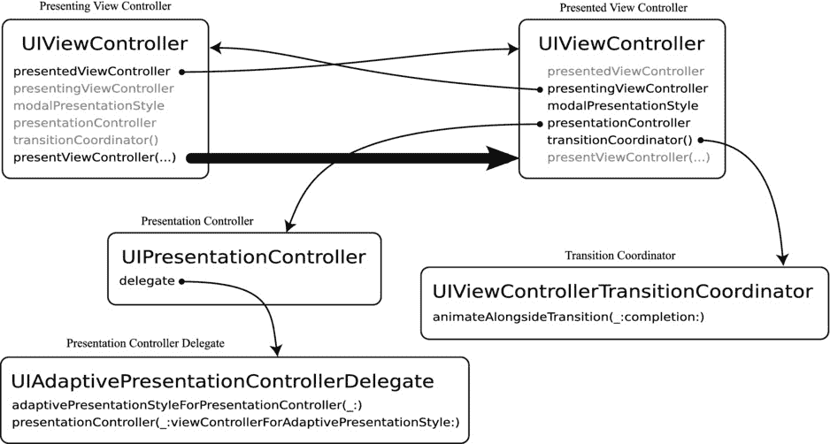

图 12-23. 视图控制器呈现对象

*呈现*视图控制器是（当前活动的）想要呈现新视图控制器的视图控制器。*被呈现*的视图控制器是即将被呈现的新视图控制器。当一个呈现视图控制器想要呈现另一个视图控制器时，它会调用`presentViewController(_:,animated:,completion:)`。


*呈现控制器*（presentation controller）是管理呈现过程的对象。它与视图控制器同时创建，并一直存在直到视图控制器被解除。呈现控制器（`UIPresentationController`）决定新的视图控制器在屏幕上的显示方式。它可能会用新的视图控制器替换整个屏幕，也可能将其放入弹出窗口。这是视图控制器偏好的呈现样式（其`modelPresentationStyle`）、呈现控制器认为适合的样式以及呈现控制器委托希望使用的样式三者共同作用的结果。在这个决策链中有多个环节可以影响视图控制器的呈现方式，你将在接下来的几节中逐一探索。

另一个值得关注的对象是*转场协调器*（transition coordinator，即`UIViewControllerTransitionCoordinator`）。该对象负责视图控制器之间的转场以及其内容的尺寸调整。当你点击按钮，新的视图控制器从底部滑出时，正是转场协调器在指挥这段动画。而当你旋转设备时，转场协调器则协调布局的平滑变形。转场协调器在转场开始时自动创建，并在转场结束后消失。本章后续部分将介绍如何使用转场协调器。

为了体验视图控制器的呈现机制，让我们为你的 Wonderland 应用用户添加一个简单的按钮，用于模态呈现一个自定义视图控制器。随后，你可以探索影响其呈现方式的不同方法。

### 模态呈现视图控制器

回到 `Main.storyboard` 文件，在 Welcome 视图中，将按钮拖放到“by Lewis Carroll”文字的右侧。将按钮类型设为 Info Dark，删除其标题，并添加一个左侧水平约束，如图 12-24 所示。同时选中该按钮和标签，添加一个垂直居中对齐约束。

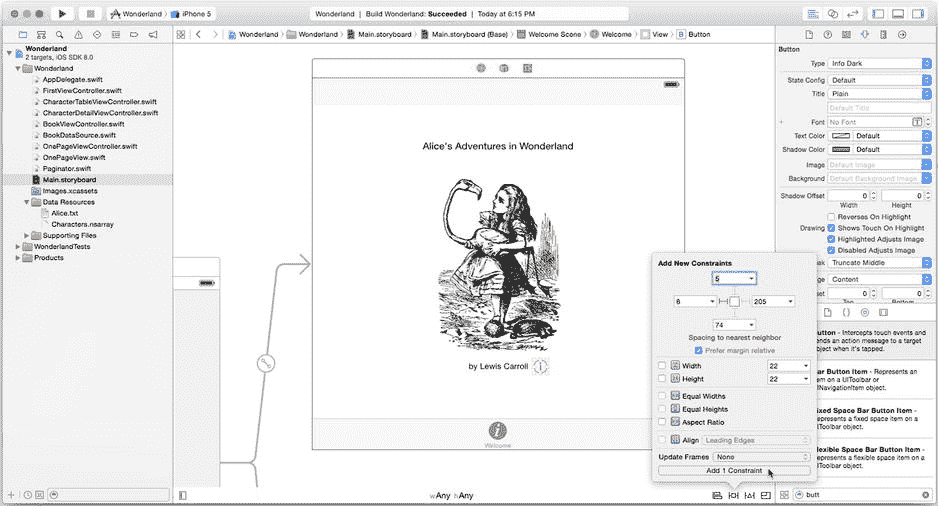

图 12-24. 添加作者信息按钮

现在，向你的故事板中添加一个新的视图控制器。将其拖放到画布上，紧挨着 Welcome 场景。选中该新视图控制器对象，切换到尺寸检查器，将其模拟尺寸（Simulated Size）改为自由形式（Freeform）。设置其宽度为 250，高度为 340（参见图 12-25）。

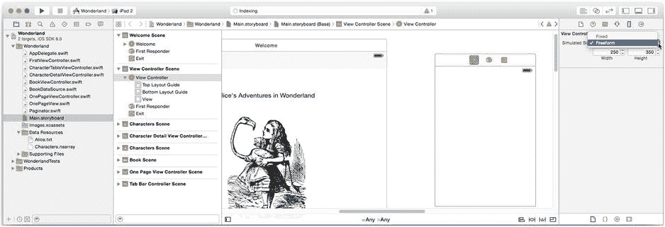

图 12-25. 创建自由形式的视图控制器

请注意，该属性名为“模拟尺寸”。Interface Builder 实际上并不知道你的视图控制器在呈现时会多大，但它允许你使用非典型尺寸进行设计。

现在，你需要让视图控制器呈现这个尺寸。切换到属性检查器，找到内容尺寸（Content Size）属性，勾选“使用首选显式尺寸”（Use Preferred Explicit Size）属性，并将宽度设置为 250，高度设置为 340。这将设置视图控制器的 `preferredContentSize` 属性。当视图控制器以可变尺寸方式呈现时（例如在弹出窗口中，而非始终占据全屏），该属性即为其期望的尺寸。呈现控制器会尽量满足这个要求，但并非强制。

向新的视图控制器中添加一个图像视图和一个标签对象，步骤如下：

1.  图像视图
    1.  将图像（Image）设置为 `info-charles`。
    2.  将模式（Mode）设置为 Aspect Fit。
    3.  添加一个到顶部布局指南的垂直约束（20 像素）。
    4.  添加一个水平居中于父视图的约束。
    5.  固定高度为 244 像素，宽度为 164 像素。
2.  标签视图
    1.  将文本（Text）设置为“Lewis Carroll”、“a.k.a. Charles Lutwidge Dodgson”和“27 January 1832 – 14 January 1898”，共三行。（按住 Option 键并按下 Return 键可在文本中创建换行。）
    2.  将字体（Font）设置为 System 12.0。
    3.  将对齐方式（Alignment）设置为居中。
    4.  将行数（Lines）设置为 3。
    5.  添加上（8）、前导（0）和尾部（0）约束。

完成后的布局应如图 12-26 所示。

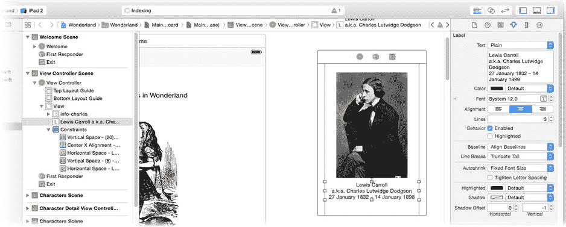

图 12-26. 完成后的作者信息布局

如果你希望模态且全屏呈现此视图控制器，可以执行以下操作：

1.  为你的 `FirstViewController` 添加一个操作（例如 `@IBAction func showInfo(_: AnyObject!)`）。
2.  将按钮连接到新操作。
3.  为新的视图控制器分配一个故事板 ID。
4.  在你的 `showInfo(_:)` 函数中，实例化新的视图控制器（使用其故事板 ID）。
5.  将视图控制器的 `modalPresentationStyle` 设置为 `.FullScreen`，`modalTransitionStyle` 设置为 `.Default`。
6.  配置呈现控制器（如适用）。
7.  调用 `presentViewController(_:,animated:,completion:)`。
8.  创建一个新的 `UIViewController` 自定义子类（例如 `AuthorInfoViewController`）。
9.  添加一个 `@IBAction func done(_: AnyObject!)` 操作。
10. 向根视图添加一个点击手势识别器或一个“完成”按钮，并将其连接到 `done(_:)` 函数。
11. `done(_:)` 函数将获取呈现视图控制器并解除自身。

当你点击信息按钮时，屏幕将被新的视图控制器替换。点击“完成”按钮或根视图即可解除它。

这些步骤你早已熟悉；在之前的项目中你曾多次逐一执行过。因此，与其重复劳动，不如从捷径开始，然后以此为基础探索一些变体。

### 模态呈现样式

首先，从按钮到新视图控制器添加一个 segue。按住 Control 键或右键点击信息按钮，然后拖拽到新的视图控制器，如图 12-27 所示。

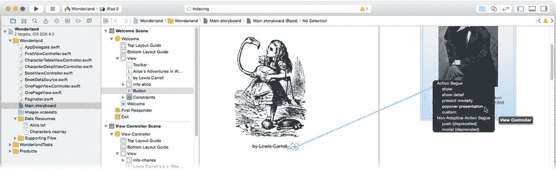

图 12-27. 连接模态呈现 segue

如果你选择“Present Modally”选项，那么你几乎完全执行了步骤 1 到 7。这里的核心是 `modalPresentationStyle` 属性（步骤 6）。当视图控制器的呈现样式设置为 `.FullScreen` 时，它请求占据整个屏幕，呈现控制器通常会尊重这一请求。

但你还有其他选择吗？如下所示，有几种选择：

*   `FullScreen`
*   `OverFullScreen`
*   `CurrentContext`
*   `OverCurrentContext`
*   `Popover`
*   `PageSheet`
*   `FormSheet`
*   `Custom`

`.OverFullScreen` 变体以全屏方式呈现视图控制器（尺寸与 `.FullScreen` 完全相同），但不会移除呈现视图控制器。这一细微差别使得新视图控制器可以拥有半透明或模糊的背景，从而让呈现视图控制器的内容透出。这是一种很好的效果，给人一种临时覆盖的感觉，而非完全替换现有视图。示例请参见第 17 章中的练习。


