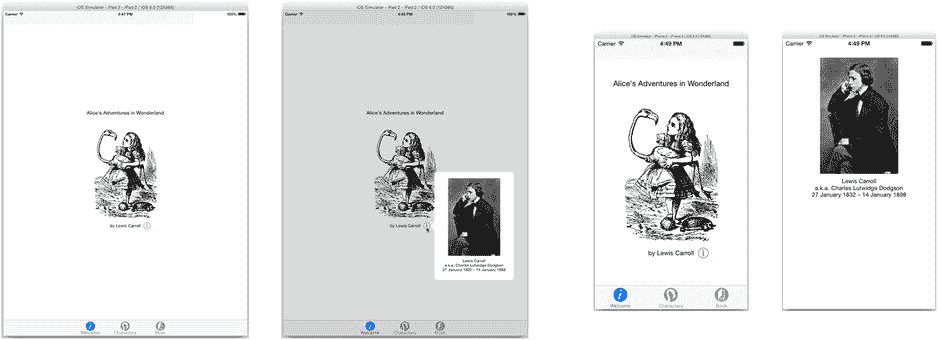
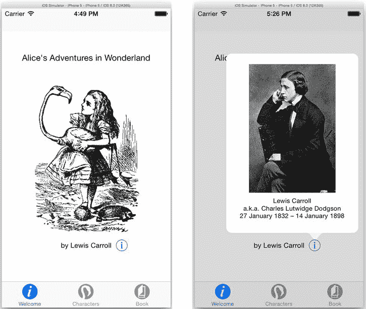

# 当前上下文版本

两个当前上下文版本（`.CurrentContext`和`.OverCurrentContext`）将呈现的视图控制器放置为覆盖或替换容器视图控制器（最显著的是`split view controller`）内的呈现视图控制器。换句话说，它替换或覆盖了另一个视图控制器内部的某个视图控制器，而不是占据整个界面。

弹出框、页面表单和表单表单是专为 iPad 设计的展示模式。（直到 iOS 8，它们*仅*在 iPad 上可用。）呈现的视图控制器以浮动表单（或“气泡”）形式出现在呈现视图控制器的顶部。现有的视图控制器不会消失，但通常会变为禁用并变暗。

我相信你的鼠标按钮手指已经因为决定选择哪个选项而感到疲劳了。继续选择弹出框展示转场选项（参见图 12-27）。¹在视图呈现之前，此转场会将呈现的视图控制器的`modalPresentationStyle`设置为`.Popover`。选择一个 iPad 模拟器（或设备）并运行你的应用。点击信息按钮以呈现新的视图控制器，如图 12-28 的左侧所示。



图 12-28。iPad 和 iPhone 上的弹出框展示样式

嘿，看起来很不错！现在切换到 iPhone（或类似的紧凑型设备）并再次运行你的应用。点击信息按钮。这次你会得到一个全屏视图控制器，如图 12-28 的右侧所示。

虽然看起来不算太糟，但这不是一个好的界面。首先，你从未实现步骤 8 到 11，所以用户无法关闭此视图。哎呀。

你可以实现步骤 8 到 11。这是一个完全有效的解决方案，并且在许多情况下完全合适。相反，让我们更仔细地看看为什么你得到的是全屏视图控制器而不是弹出框，以及你可能对此采取什么措施。

### 制定展示建议

那么，为什么你的视图控制器在 iPhone 上以`.FullScreen`模式出现？`modalPresentationStyle`属性是视图控制器希望如何呈现的建议，而不是要求。当视图控制器被呈现时，展示控制器会考虑界面的大小、当前的特征集合以及其他信息，并决定呈现视图控制器的最佳方式。这可能符合也可能不符合视图控制器的请求。

通常，展示控制器会以请求的任何样式呈现视图控制器，*除了*在水平紧凑型设备上。当屏幕较小时，展示控制器会将弹出框、表单表单和页面表单的请求转换为`.FullScreen`样式，基于这样的（合理）假设：在这种小设备上没有足够的空间来容纳这些界面样式。

猜猜看？展示控制器有一个`delegate`属性（参见图 12-23）。展示控制器的委托会被询问使用哪种展示样式，你可以影响那个决定。现在让我们来做这件事。

首先，回到故事板，选择信息按钮的转场，并为其分配一个标识符`info`。你需要这个来将一些代码注入到展示过程中。现在转到`FirstViewController.swift`文件并添加以下函数：

```
override func prepareForSegue(segue: UIStoryboardSegue, sender: AnyObject!) {
    if segue.identifier == "info" {
        let presented = segue.destinationViewController as UIViewController
        let presentationController = presented.presentationController
        presentationController?.delegate = self
    } else {
        super.prepareForSegue(segue, sender: sender)
    }
}
```

这个函数在转场即将呈现新的视图控制器之前被调用。它首先获取将被呈现的视图控制器，并获取其展示控制器。然后你将此对象设置为展示控制器的委托。

为了使这工作，这个视图控制器必须采用`UIAdaptivePresentationControllerDelegate`协议，所以现在添加它（新代码以粗体显示）。

```
class FirstViewController: UIViewController,
                           UIAdaptivePresentationControllerDelegate {
```

现在添加这个自适应展示控制器委托函数：

```
func adaptivePresentationStyleForPresentationController( 
        controller: UIPresentationController) -> UIModalPresentationStyle {
    return .None
}
```

现在选择一个 iPhone 模拟器（或任何其他紧凑型设备）并再次运行你的应用。点击信息按钮，你会得到一个弹出框，如图 12-29 右侧所示。



图 12-29。在 iPhone 上强制弹出框展示

那么，刚才发生了什么？在水平紧凑型设备上，展示控制器会向其委托对象询问如何将界面适配到较小的设备。如果委托返回`.None`，意味着“不要适配界面。完全按照请求的方式呈現它。”而展示控制器正是这样做的，将新的视图控制器放在弹出框中——这种界面在 iPhone 上并不常见。

这个特定的界面足够小，即使在最小的移动设备上也能在弹出框中正常工作。但如果不能呢？是的，你仍然可以回去实现步骤 8 到 11，但展示控制器委托还有一个妙招。

### 在展示期间适配视图控制器

除了获取委托关于在紧凑环境中呈现视图控制器的最佳方式的意见外，展示控制器还允许委托在呈现之前适配界面。我将在接下来的部分中更多地讨论适配，但现在只需知道“适配”界面意味着调整它使其适应新的环境。

返回`FirstViewController.swift`文件并调整委托函数，使其如下所示（修改后的代码以粗体显示）：

```
func adaptivePresentationStyleForPresentationController(
           controller: UIPresentationController) -> UIModalPresentationStyle {
    return .FullScreen
}
```

现在你的委托与展示控制器一致：当在水平紧凑型设备上呈现时，所有视图控制器（对于此委托）都将以全屏方式呈现。这使你回到了之前遇到的困境——没有任何东西可以让用户关闭此视图。别担心，还有一个委托方法可以解决这个问题。

在视图控制器被呈现之前，展示控制器会调用`presentController(_:,viewControllerForAdaptivePresentationStyle:)`委托函数。在你的类中添加一个。

```
func presentationController(controller: UIPresentationController, 
                 viewControllerForAdaptivePresentationStyle style: 
                   UIModalPresentationStyle) -> UIViewController? {
    let presentedVC = controller.presentedViewController
    let replacementController 
                 = UINavigationController(rootViewController: presentedVC)
    let navigationItem = presentedVC.navigationItem
    let doneButton = UIBarButtonItem(barButtonSystemItem: .Done,
                                                  target: self,
                                                  action: "dismissInfo:")
    navigationItem.rightBarButtonItem = doneButton
    navigationItem.title = "Author"
    return replacementController
}
```


