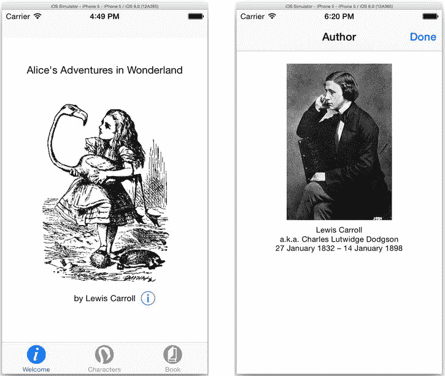
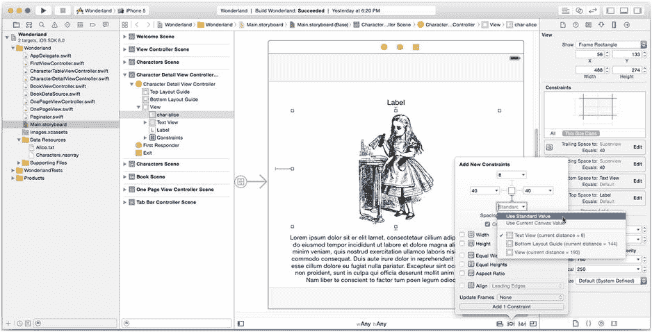
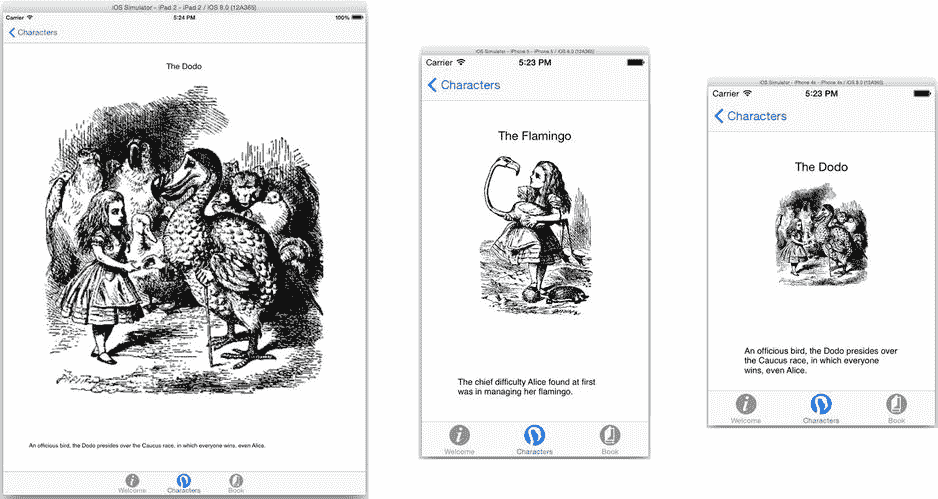
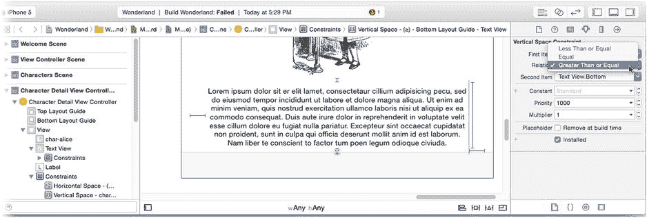
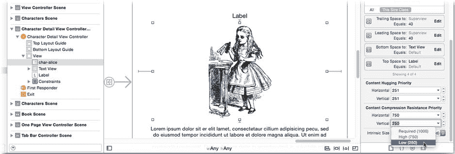
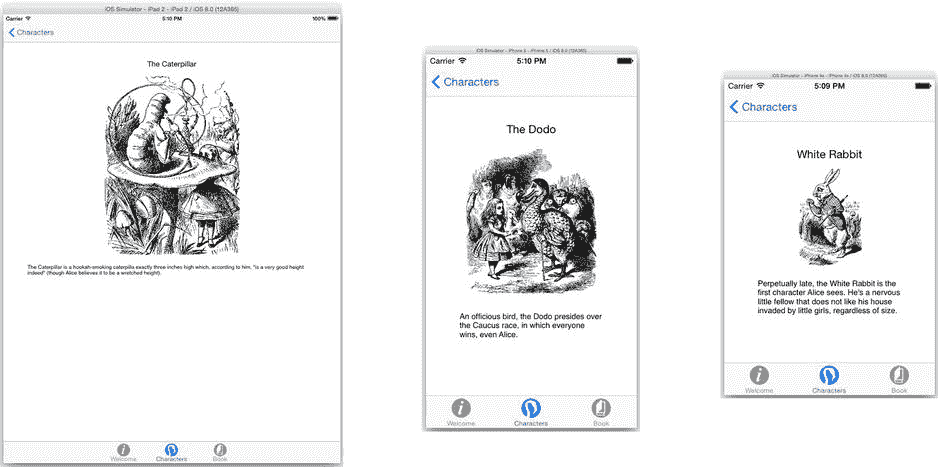
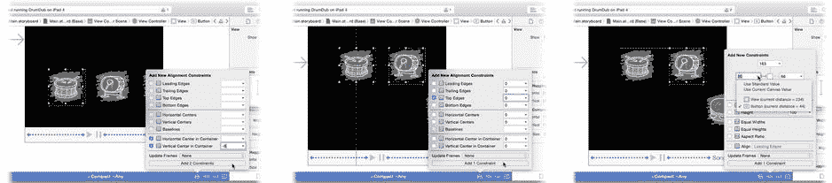
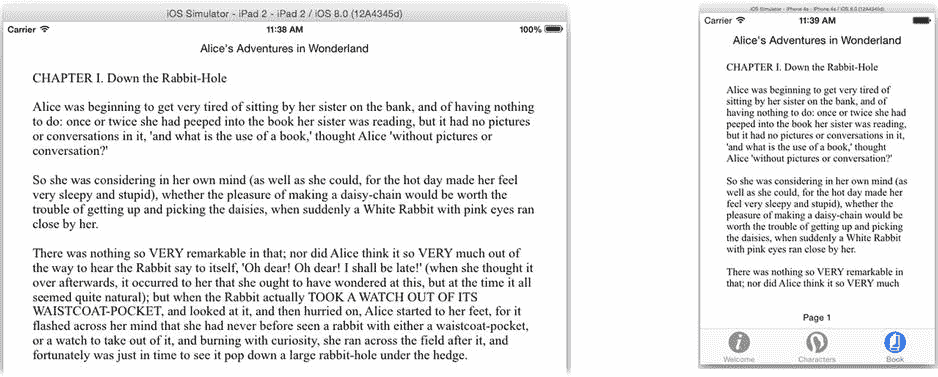

# 排版后的内容

在此函数中，你可以获取用于呈现的视图控制器并进行修改（适配），使其能够以全屏方式呈现——或者按照`style`参数所指定的方式呈现。这可能涉及添加一个“完成”按钮，或者添加一个轻触手势识别器以及一个显示“轻触以关闭”的标签。完全由你决定。只需在此处进行修改，然后返回修改后的视图控制器即可。

不过，你的函数更进一步，它用一个完全不同的视图控制器替换了原来的！实际上，它会创建一个导航视图控制器，并将要呈现的视图控制器设为其根视图。接着，它会配置导航栏，使其包含一个“完成”按钮，该按钮会调用`dismissInfo(_:)`函数来关闭视图控制器。这样，无需修改原始视图控制器，就能巧妙地通过标准且可识别的界面来提供关闭视图的方法。

哦，我想你会需要那个`dismissInfo(_:)`函数。

```
@IBAction func dismissInfo(sender: AnyObject) {
    dismissViewControllerAnimated(true, completion: nil)
}
```

在继续运行 iPhone 模拟器时，再次运行你的应用，如图 12-30 所示。



图 12-30。适配后的全屏视图控制器呈现

从技术上讲，这就是适配，也是本章的最后一节。但在进入这个主题之前（请原谅这个双关语），让我们总结一下关于呈现控制器你已经学到的内容，并讨论使用它们的其他原因。

-   想要呈现另一个视图控制器的视图控制器被称为*呈现方*视图控制器。
-   被呈现的视图控制器被称为*被呈现方*视图控制器。
-   *呈现控制器*管理视图控制器的呈现、适配和关闭。
-   视图控制器具有首选呈现样式、过渡样式和尺寸。
-   呈现控制器在呈现视图控制器时会考虑这些属性，但可能会否决它们。
-   呈现控制器的委托在水平紧凑环境中可能否决其样式决定，并且可以更改或替换被呈现的视图控制器。

## 弹出呈现控制器

除非你打算修改或自定义视图控制器的呈现方式，否则通常无需处理呈现控制器。但有一个显著的例外：弹出呈现控制器。

根据`modalPresentationStyle`的值，为你的视图控制器创建的呈现控制器可能是`UIPresentationController`的子类，并具有附加功能。具体来说，如果你的视图控制器的`modalPresentationStyle`是`.Popover`，其`presentationController`属性将返回一个`UIPopoverPresentationController`对象。该类具有仅适用于弹出呈现的附加函数和属性——其中一些你*必须*进行设置，否则呈现将会失败。

在之前的项目中你已经遇到过这种情况，让我们重温一下。当你在弹出窗口中呈现一个视图控制器时，你必须设置其*源*。这是一个对象或矩形，用于确定弹出窗口在屏幕上的锚定位置。在 MyStuff 项目中，你曾这样做过几次，详见第 9 章。以下是那段代码：

```
if let popover = alert.popoverPresentationController {
    popover.sourceView = imageView
    popover.sourceRect = imageView.bounds
    popover.permittedArrowDirections = ( .Up | .Down )
}
```

`UIViewController` 的便捷属性`popoverPresentationController`是获取弹出控制器的最佳方式。当且仅当`presentationController`是一个弹出控制器并被便捷地向下转型为`UIPopoverPresentationController`时，该属性才会存在；否则返回`nil`。请注意，这与`presentationController`返回的是同一个对象，只是进行了向下转型。

至少，你必须设置弹出控制器的`sourceView`和`sourceRect`，或者设置`barButtonItem`。如果像之前那样使用 segue，segue 会自动为你完成此操作。你还可以选择自定义允许的箭头方向、箭头的颜色（以匹配弹出视图的背景颜色）以及其他功能。

现在你已经知道如何使用呈现控制器，让我们回到适配这个话题。

## 适配视图控制器内容

最后一项要掌握的视图控制器核心技能是，如何将视图的内容适配到不同的显示环境。*适配*视图控制器包括修改其视图对象和布局，以便为特定设备、屏幕尺寸、方向或分辨率呈现令人愉悦的用户界面。你在本书中已经多次遇到这个问题，但现在该深入细节了。

**iOS 8 之前的适配**

适配并非 iOS 的新概念，但 iOS 8 引入了一种截然不同的理念和一套工具来帮助你。过去，适配是通过一种较为临时的方式处理的。有一些属性告诉你应用运行在哪种设备大类上（iPhone 或 iPad），一些属性和事件告诉你设备处于何种方向（竖屏、横屏左、横屏右、倒置），还有一些属性告诉你屏幕尺寸等等。

你的故事板文件也是分开的，一个故事板文件用于 iPhone 及类似设备（`Main_iPhone.storyboard`），另一个故事板文件用于 iPad 及类似设备（`Main_iPad.storyboard`）。想添加一个按钮？你必须在第一个故事板中添加按钮，将其连接到输出口，连接其动作，并创建其约束。然后你必须在第二个故事板文件中重复所有这些操作。你的代码中也充斥着诸如 `if deviceIdiom == .iPhone {` *为 iPhone 执行此操作* `} else {` *为 iPad 执行该操作* `}` 这样的语句。随着具有新屏幕尺寸和新分辨率的新型设备不断涌现，管理应用界面变得难以为继。iOS 8 改变了这一切。

iOS 8 将界面环境抽象为一组通用特性，并提供了一套一致的方法来调整你的内容。不再有单独的函数用于调整视图控制器大小和处理设备旋转。现在，所有视图控制器尺寸的变化都以相同方式处理。大致上，有四种不同的视图适配方式，从通用到具体：

-   巧妙设计
-   特性
-   尺寸
-   布局事件

让我们逐一探讨，看看如何在适配界面时使用它们以及为何要使用它们。

### 比普通方案更聪明

我将“巧妙设计”列为适配视图的一种技巧。如果你足够有创意，通常可以将界面设计得无需适配。它会自动调整以适应可用的显示区域，无论其为何种情况。我将这些视为“自适应”界面，这也是我始终优先尝试的技巧。回到你的 Wonderland 应用的 `Main.storyboard` 文件，让我们尝试适配角色详情场景。添加以下约束：


### 1. 标签
- 顶部边缘到顶部布局参考线（40 像素）
- 在容器中水平居中

### 2. 图像视图
- 顶部边缘到标签（8 像素）
- 底部边缘到文本视图（标准间距）
- 前导和尾随边缘到父视图（各 40 像素）

### 3. 文本视图
- 固定高度为 128 像素
- 前导和尾随边缘到父视图（各 30 像素）
- 底部边缘到底部布局参考线（标准间距），如图 图 12-31 所示



图 12-31. 角色详情视图的初始约束

如果你研究这些约束，或者直接在模拟器中运行它们，你会发现它们虽然能工作，但效果并不理想（参见 图 12-32）。



图 12-32. 测试角色详情约束

布局中的约束定义了一种代数方程。自动布局逻辑首先找到方程中的所有常量（例如父视图的大小、文本视图的固定高度、以及“此标签的顶部边缘必须恰好位于顶部布局参考线下方 40 像素处”这类约束）。然后，它识别出可变属性（如图像视图的高度、文本视图的顶部边缘位置等）。接着，它通过提供满足所有常量的变量值来“求解”方程。虽然你的角色详情视图中的布局确实“求解”了方程，但视觉效果并不理想。

到目前为止，在这本书中，你只创建了简单、固定、不变的约束。大多数情况下，这些就足够了，但有时你需要更灵活的方法，而自动布局系统既有能力也愿意提供支持。以下是一些可供你使用的额外工具：

- 约束可以表达不等式。
- 约束可以设置优先级。
- 视图内容是可压缩的。
- 视图内容会“拥抱”其边距。

首先，约束不一定非得表达明确的规则。你可以创建一个约束，例如“此视图的高度必须为 80 像素*或以上*”，或者“此按钮的左边缘必须*超过*该标签右边缘 6 像素”。你要做的第一个修改是改变文本视图底部边缘的约束。选中该文本视图，这将显示其附带的约束。选择底部的那个小约束（位于文本视图与底部布局参考线之间），如 图 12-33 所示。在属性检查器中，将 Relation（关系）属性从 Equal（等于）更改为 Greater Than or Equal（大于或等于）。



图 12-33. 创建约束不等式

现在，自动布局逻辑有了一个新的变量可以调整。文本视图的底部边缘不再被要求恰好位于底部布局参考线之上 8 像素处。布局引擎现在可以移动它，只要它 *至少* 位于底部布局参考线之上 8 像素即可。

#### 设置约束优先级

约束也有优先级。默认情况下，新约束的优先级是 `UILayoutPriorityRequired`。此值为 1000，是最高优先级。这意味着该约束是必需的，必须被满足。但你可以创建具有较低优先级的约束。如果这样做，布局逻辑将为了满足高优先级约束而“牺牲”低优先级约束。iOS 还定义了两个其他方便的优先级：`UILayoutPriorityDefaultHigh` (750) 和 `UILayoutPriorityDefaultLow` (250)，分别用于重要但非必需的约束，以及最好能有但不重要的约束。你可以分配从 1 到 1000 的任何优先级——只需避免 50，因为该值已被保留作他用。

#### 固有尺寸

自动布局逻辑还会考虑视图的*固有尺寸*。带有内容（标签、文本视图、图像视图、按钮等）的视图对象都具有一个*固有尺寸*。这是视图为了精确显示其内容所需的大小。对于图像视图，它是其图像的大小。对于标签，它是其文本绘制后的大小。如果你没有添加规定视图高度或宽度的约束，自动布局将参考其固有尺寸，并以此为起点。

**注意**：如果你创建了一个自定义的 `UIView` 子类，并希望自动布局考虑其固有尺寸，则必须重写 `intrinsicContentSize() -> CGSize` 函数并提供该值。

如果视图的固有尺寸不能满足其他约束，自动布局将覆盖其固有尺寸以解决布局问题。当它这样做时，自动布局会遇到另外两组优先级：*抗压缩性* 和 *抗拉伸性*。当布局试图使视图变小时，视图会“抵抗”压缩；而当布局试图使其变大时，视图的内容会“拥抱”其边距——换句话说，它会“抵抗”扩展。

这些优先级是视图的属性。在角色详情视图中选择图像视图，并使用尺寸检查器将其垂直抗压缩性更改为 250（`UILayoutPriorityDefaultLow`），如 图 12-34 所示。



图 12-34. 更改图像视图的抗压缩性

**注意**：抗压缩性和抗拉伸性各有两种优先级，分别针对垂直方向和水平方向，总共四种优先级。默认情况下，`UIButton` 视图具有较低的水平抗拉伸性，因为按钮不介意被加宽。但它具有较高的垂直抗拉伸性，因为它强烈抵抗被加高。

再次运行应用程序，如 图 12-35 所示，并将结果与 图 12-32 进行对比。由于降低了垂直抗压缩性，布局更倾向于减小图像视图的尺寸，以满足所有布局约束。同时，由于底部约束是可变的，文本视图可以自由上移，与图像视图相接。



图 12-35. 使用修改后的约束和抗压缩性进行布局

分配给抗压缩性和抗拉伸性的优先级与用于排列约束的优先级相同。例如，如果一个宽度约束比视图的固有宽度更窄，那么其水平抗压缩性的优先级将与约束的优先级进行比较，以确定哪个宽度占优。

**提示**：将抗压缩性和抗拉伸性优先级设置为 1000（`UILayoutPriorityRequired`）等同于将视图固定为其固有尺寸。

现在你已经对约束、不等式约束、固有尺寸和优先级如何协同工作有了一些了解，你可以开始设计能够流畅适应各种环境的复杂布局方案了。

但如果自动布局仍然不能满足你的需求，你还有很多其他选择。接下来可以使用的工具是自适应约束。它们依赖于特征（Traits），因此我们接下来讨论特征。

### 使用特征集合

*特征（Trait）* 是界面的一个通用方面。它是宽敞还是紧凑？是高分辨率还是低分辨率？每个设备、窗口和视图控制器都有一组这样的特征，称为其*特征集合（Trait Collection）*，你可以通过检查它来对你的界面应该呈现的样子做出宏观决策。你的视图控制器的当前特征集合可以通过其 `traitCollection` 属性获取。表 12-2 列出了特征集合的属性。

表 12-2. 特征集合中的特征


| 特征 | 可选值 |
| --- | --- |
| 水平尺寸类别 | Regular 或 Compact |
| 垂直尺寸类别 | Regular 或 Compact |
| 界面类型 | iPad 或 iPhone |
| 显示比例 | 1.0、2.0 或 3.0 |

最有用的两个特征是水平尺寸类别与垂直尺寸类别。*尺寸类别*表示界面在该方向上的“宽敞”程度。iPad 在横屏和竖屏两种方向下，两个维度均为 Regular 尺寸类别。这是因为 iPad 的显示屏较大，通常无需对界面做出大幅调整即可适配。相比之下，iPhone 在竖屏时水平方向为 Compact，垂直方向为 Regular；而在横屏时，两个方向均为 Compact。

那么，为什么 iPhone 在横屏时没有 Regular 水平尺寸类别呢？尺寸类别更多关乎预期和可用性，而非物理显示尺寸。正如本章前面所学，展示控制器会根据设备的水平尺寸类别来决定以弹出框还是全屏形式展示视图控制器。将水平尺寸类别保持为 Compact，意味着你的照片选择器不会突然在 iPhone 上以弹出框形式出现。同时，这也意味着分屏视图控制器将保持折叠状态。你可以将尺寸类别理解为“预期”类别。

如前所述，展示控制器会利用尺寸类别来决定使用何种展示样式。但尺寸类别的应用远不止于此，Interface Builder 便是其中之一。

### 添加自适应约束（及对象）

你可以在 Interface Builder 中定义仅在特定尺寸类别组合下才会出现在界面中的约束（及视图对象）。在前面的章节中，你已经多次执行过此操作，后续还会用到。这里让我们回顾其中一个例子。

在第 9 章中，你为 DrumDub 项目中的“bang”按钮创建了多组对齐约束，如图 12-36 所示。



图 12-36 为 `wCompact`/`hAny` 尺寸类别添加约束

由于你已详细经历过这一过程，此处不再赘述。但有两个要点需要强调。

首先，注意不要创建冲突的约束。如果你为 `wCompact`/`hAny` 集合添加了一个宽度约束，又为 `wCompact`/`hCompact` 集合中的同一视图添加了不同的宽度约束，那么当视图在横屏 iPhone 5 上展示时，就会产生一对冲突的约束。约束并不会覆盖其他集合中的类似约束，视图中的约束是所有与当前环境匹配的集合的并集。

**注意** 一组冲突或不完整的约束会导致视图布局失败。视图可能被移出屏幕、尺寸归零或根本无法定位，结果通常是视图对象混乱堆叠。

另一个特性是能够设计仅在某些特征环境中出现的视图对象。与约束类似，当尺寸类别选择器设为 `wRegular`/`hRegular` 时添加到设计中的对象，将仅在该视图的尺寸类别为 `wRegular`/`hRegular` 时出现。

虽然这是一个便捷功能，但存在几点注意事项。为 `wRegular`/`hAny` 集合添加一个按钮，并为 `wCompact`/`hAny` 集合添加另一个不同的按钮，会创建两个按钮对象。这两个按钮对象在视图控制器的生命周期内始终存在。当显示器在水平 Compact 环境中出现时，第二个按钮会自动添加到视图中，而第一个按钮则会被移除。

由于它们是两个不同的对象，*你不能将它们连接到同一个插座*。如果你需要为按钮设置一个插座，请创建两个插座并合成一个属性，返回当前实际安装的那个按钮，代码如下所示：

```
@IBOutlet var button_Regular: UIButton!
@IBOutlet var button_Compact: UIButton!
var button: UIButton {
    if  button_Regular.superview != nil {
        return button_Regular
    }
    return button_Compact
}
```

自适应约束和对象最出色的特性或许是它们由系统自动管理。当设备从 Regular 环境变为 Compact 环境时，相应的约束会自动添加或移除。若要通过代码自行实现，则需要重写相应的函数。掌握这一方法同样重要，现在我们就来了解它。

### 以编程方式自适应视图

你也可以通过编程方式让视图响应多种环境变化。大致上，有以下三种策略，按粒度递增排列：

*   特征变化
*   尺寸变化
*   布局变化

当你需要调整视图属性或进行无法用约束表示的其他布局更改时，就需要考虑编程自适应。Interface Builder 中的自适应约束固然强大，但你只能添加或移除约束和对象。Interface Builder 无法让你定义自适应属性或操作。例如，你无法让一个图像视图在水平 Regular 环境中左对齐显示图像，而在 Compact 环境中居中显示。要实现这种效果，你需要编写少量代码。

#### 在特征变化时自适应

你的书籍文本在 Compact 设备（如 iPhone）上使用较小的字体时效果更好。修改 `BookViewController.swift` 中的代码，根据设备的水平尺寸类别调整字体大小。

第一步是创建自适应视图的代码。将以下函数添加到 `BookViewController` 类中：

```
func adaptViewsToTraitCollection(traits: UITraitCollection) {
    let compactWidth = ( traitCollection.horizontalSizeClass == .Compact )
    var fontSize: CGFloat = 18.0
    if compactWidth {
        fontSize = 14.0
    }
    let paginator = bookSource.paginator
    let currentFont = paginator.font
    if currentFont.pointSize != fontSize {
        paginator.font = currentFont.fontWithSize(fontSize)
    }
}
```

该函数检查特征集合的水平尺寸类别。如果是水平 Compact，则将分页器使用的字体大小改为 14.0 点；否则改为 18.0 点。

当视图控制器的特征发生变化时，iOS 会调用控制器的 `willTransitionToTraitCollection(_:,withTransitionCoordinator:)` 函数。用以下代码重写该函数：

```
override func willTransitionToTraitCollection(newCollection:UITraitCollection,
 withTransitionCoordinator coordinator:UIViewControllerTransitionCoordinator) {
    super.willTransitionToTraitCollection(newCollection, 
                                        withTransitionCoordinator: coordinator)
    adaptViewsToTraitCollection(newCollection)
}
```

这是用于在特征环境变化时自适应界面的重写函数。这段代码所做的只是调用你的 `adaptViewToTraitCollection()` 函数来调整界面。

**注意** `adaptViewToTraitCollection()` 函数仅在视图控制器的特征发生变化时被调用。例如，旋转 iPad 不会触发该函数，因为 iPad 在竖屏和横屏方向下均为 `wRegular`/`hRegular`。

该函数在视图首次显示时也不会被调用。为了让视图适应其初始环境，你需要在视图首次加载时调用一次自适应函数。仍在 `BookViewController` 类中，添加一个 `viewWillAppear(_:)` 函数。

```
override func viewWillAppear(animated: Bool) {
    super.viewWillAppear(animated)
    adaptViewsToTraitCollection(traitCollection)
}
```


当视图即将出现时，代码会获取其当前的 trait collection 并使用它来适配视图。在 iPad 和 iPhone 模拟器中分别运行应用并对比结果，如图 12-37 所示。



图 12-37。自适应字体大小

### 尺寸变化时的适配

如果你需要更精细地适配界面，下一个粒度层级是尺寸变化。当你的视图控制器尺寸发生变化时，iOS 会调用其 `viewWillTransitionToSize(_:withTransitionCoordinator:)` 函数。只要设备旋转（从竖屏调整为横屏），就会触发该函数。其他情况下也可能发生，例如，当 iPhone 屏幕顶部的通话中状态横幅消失时，你的视图控制器会被微妙地调整尺寸。

**注意**  `willTransitionToTraitCollection(...)` 和 `willTransitionToSize(...)` 函数由 `UIContentContainer` 协议定义。视图控制器和呈现控制器都遵循此协议。你可以在任一对象上拦截这些事件，但由于通常继承的是 `UIViewController` 而非 `UIPresentationController`，因此通常会在视图控制器中重写它们。

当需要进行更精确的布局以及与横竖屏状态相关的布局变更时，重写该函数即可。

### 布局发生时的适配

最精细粒度的适配发生在布局层面。视图控制器有两个函数：

```
viewWillLayoutSubviews()
viewDidLayoutSubviews()
```

第一个在视图布局前调用，第二个在布局后调用。呈现控制器有一套功能类似的函数，但名称略有不同：

```
containerViewWillLayoutSubviews()
containerViewDidLayoutSubviews()
```

当你需要根据布局的任何变化来适配设计时，可以重写这些函数。

**警告**  will/did 布局子视图函数可能会被多次调用，因此要谨慎处理其中的代码。例如，假设你有一个显示倒计时的标签，且每秒更新一次。设置标签文本会改变其固有尺寸，从而触发布局，这会导致每秒都调用 `viewWillLayoutSubviews()` 和 `viewDidLayoutSubviews()`。你还必须注意不要在 `viewDidLayoutSubviews()` 中做出任何可能触发新布局的更改。

### 动画化布局变化

适配视图的最后一步是执行实际的布局变更，即重新定位和调整界面中视图的尺寸。如果你使用的是约束或自适应约束，这会自动发生（这是热爱约束的又一个理由）。屏幕旋转时，你的视图将优雅地调整尺寸以适应新布局。

但如果你是通过编程方式适配视图呢？有些变化无需动画化。例如，为书籍的字体大小变化添加动画是不切实际的。因此，你刚才为此编写的代码没有问题。

另一方面，如果你通过编程方式定位视图（未使用约束），则需要在视图尺寸变化时重新定位它们，并且希望它们能与其余变化同步动画。为此，请利用图 12-23 中我至今未提及的对象：过渡协调器。

过渡协调器是另一种辅助对象，仅在过渡期间使用。它是一个临时对象，在视图控制器首次呈现或过渡到新的 trait collection 或尺寸之前创建。过渡完成后，该对象即消失。

过渡协调器有一个极其有用的函数：`animateAlongsideTransition(_:,completion:)`。在你的 `willTransitionToTraitCollection(...)` 或 `willTransitionToSize(...)` 函数中调用此函数，并提供两个代码块。第一个代码块包含对视图进行可动画化更改的代码。阅读第 11 章后，你会更清楚这一点。简而言之，如果你在此代码块中更改了视图的任何可动画化属性——尤其是其大小或位置——这一更改将平滑地以动画呈现。

你将在第 16 章中执行此操作，届时你将创建一个通过编程方式定位、且不使用任何约束的"拨盘"视图。当界面调整大小时，你需要负责重新定位它们。

哦，我等不及了！让我们跳到第 16 章，提前看看那段代码（有趣的部分已用**粗体**标出）：

```
override func viewWillTransitionToSize(size: CGSize, 
 withTransitionCoordinator coordinator: UIViewControllerTransitionCoordinator!) {
    super.viewWillTransitionToSize(size, 
         withTransitionCoordinator: coordinator)
    animator?.removeAllBehaviors()
    coordinator.animateAlongsideTransition( {
            (context) in self.positionDialViews()
        },
        completion: {
            (context) in self.attachDialBehaviors()
        })
}
```

每当视图控制器调整大小时，此函数会将"拨盘"视图重新定位到新位置。该部分由巧妙命名的 `positionDialViews()` 函数处理。激动人心的是，此函数是在传递给 `animateAlongsideTransition(_:,completion:)` 函数的代码块内被调用的。这样做时，过渡协调器会确保你的视图动画变化与其余视图变化完美同步。

你不必非这样做不可。你也可以选择**不**为你的变化添加动画——那就逊色了。你还可以自由设置自己的动画，使其接近甚至在过渡动画之后运行；过渡协调器也能帮你实现。但大多数时候，你希望界面能无缝变形到新布局，而 `animateAlongsideTransition(_:,completion:)` 让这变得简单。

## 视图控制器高级主题

本章已经长得离谱了，所以如果你读到了这里，理应得到某种奖励。不过，在我放你走之前，让我再提几个高级主题，以便你有所了解。

### 自定义呈现和转场

你可以对视图控制器的呈现和转场进行*远*超本章所述的自定义。想让呈现的视图控制器从一团烟雾中出现吗？或者，在关闭它时，希望它像一张废纸一样皱成一团？通过提供你自己的呈现控制器和/或过渡协调器对象，你可以实现这些以及任何你能想到的效果。

细节很多，但基本技术是将视图控制器的 `modalPresentationStyle` 设置为 `.Custom`。执行此操作后，iOS 期望你的视图控制器在其 `transitioningDelegate` 属性中提供一个委托对象。该对象必须遵循 `UIViewControllerTransitioningDelegate` 协议，其方法可以提供你自己的 `UIPresentationController` 自定义子类以及其他动画和过渡对象，以负责呈现、过渡和关闭你的视图控制器。

有关所有细节，请参阅 Xcode 文档和 API 参考窗口中的《视图控制器编程指南》。我还强烈建议下载演示这些技术的示例项目。

### 外观代理

你已经看到如何在 `viewWillAppear()` 和 `viewWillTransitionToTraitCollection(...)` 等函数中编写代码，以编程方式调整视图的内容。你针对那些无法在 Interface Builder 中设置的属性执行此操作。


