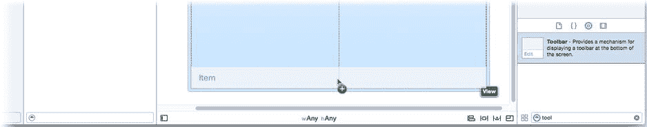
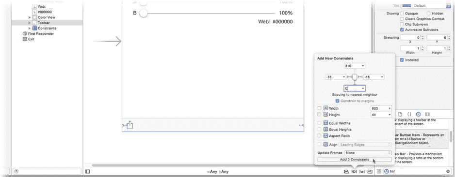
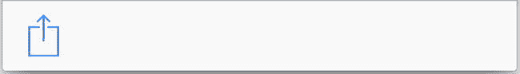
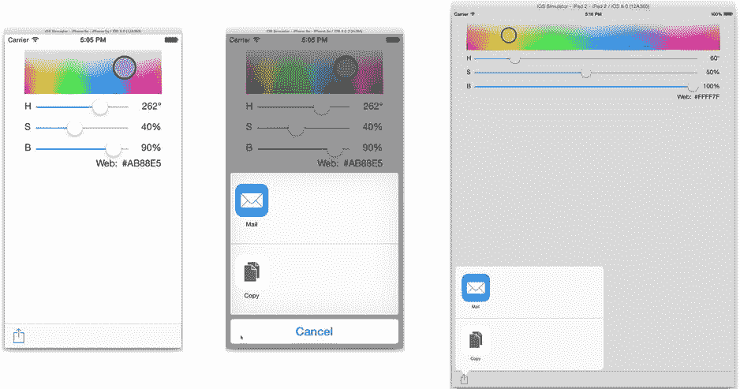
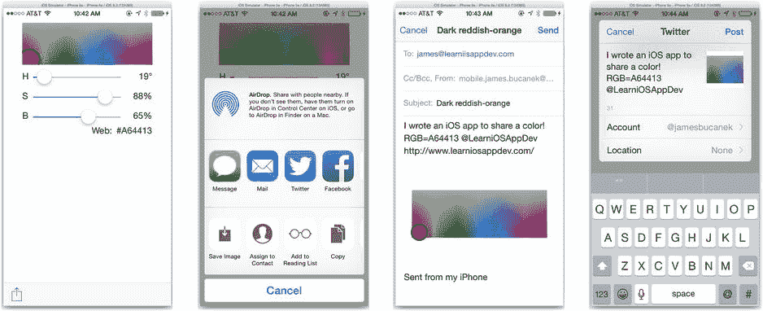
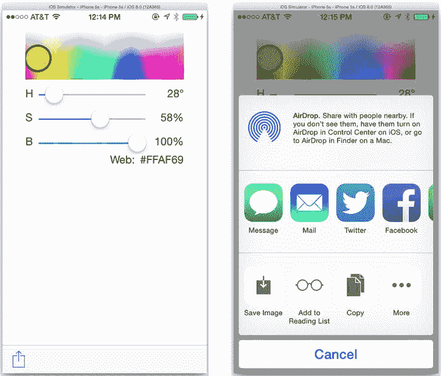
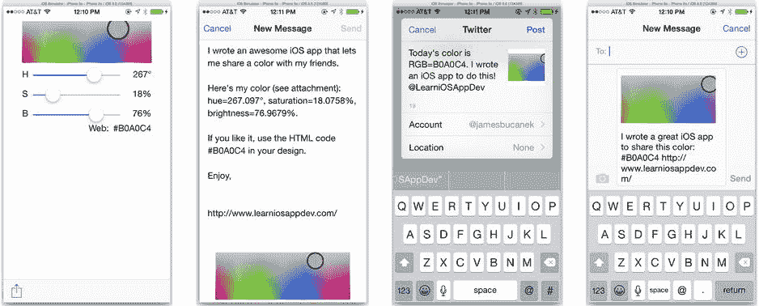

# 第 13 章 共享即关爱

社交网络近年来蓬勃发展，移动应用在这场革命中扮演了重要角色。就在几年前，为应用添加社交网络功能还相当困难。如今，iOS 的新增功能使其变得如此简单——考虑到你对视图控制器的了解——这个过程可以准确地描述为“微不足道”。在这相当简短的一章中，你将学习如何做到以下几点：

*   通过 Facebook、Twitter、新浪微博、腾讯微博、Flickr、Vimeo、电子邮件、短信等方式分享内容
*   为不同的服务自定义内容

选择修改哪个应用可能是本章中最难的决定。你认识的人是否想了解第 2 章中超现实主义者的趣闻？当然，你想分享来自第 3 章的缩短 URL。你的朋友是否想知道你在第 4 章中的魔法八球预测结果？你在第 7 章中拍摄了酷炫物品的照片；如果有人想看它们怎么办？为所有这些应用添加分享功能都很容易。最后，我选择扩展第 8 章中的 `ColorModel` 应用。你花了大量时间和精力挑选出完美的颜色，我相信你的朋友会感谢你与他们分享。

## 为我的（社交）世界增添色彩

从第 8 章的最终版 `ColorModel` 应用开始。你可以在 `Learn iOS Development Projects` 文件夹下的路径 `Ch 6` → `ColorModel-6` → `ColorModel` 中找到该项目。你将添加一个按钮，与全世界分享所选的颜色。iOS 为此目的提供了一个标准的“活动”按钮项，所以直接使用它。在 `Main.storyboard` 界面文件中，向视图控制器界面的底部添加一个工具栏，如图 13-1 所示。



图 13-1. 添加工具栏和工具栏按钮项

选择新工具栏，并点击约束固定控制，如图 13-2 所示。添加左、右和底部约束，接受默认值。这将使工具栏保持在布局的底部。工具栏具有永不改变的内在高度，因此你无需固定其高度。



图 13-2. 添加工具栏约束

工具栏自带一个预装的栏按钮项。选择该栏按钮项，并将其标识符属性更改为“Action”。现在它将如下所示：



切换到助手编辑器视图（`View` → `Assistant Editor` → `Show Assistant Editor`）。确保 `ViewController.swift` 文件出现在右侧窗格中。添加以下操作存根：

```
@IBAction func share(sender: AnyObject!) {
}
```

通过将操作的连接拖到按钮上，将操作函数连接到活动按钮。我不会为此提供图示，因为如果你到现在还不知道那是什么样子，显然你跳过了前面的大部分章节。

## 有东西可分享

首先分享颜色的红-绿-蓝代码。当前，颜色的 HTML 值由 `observeValueForKeyPath(_:,ofObject:,change:,context:)` 函数（`ViewController.swift`）生成。你现在有了第二个方法（`share(_:)`）也需要进行此转换；考虑重新组织代码，使此转换更易于访问。将当前颜色转换为其等效的 HTML 值感觉属于数据模型的范畴，因此将此计算属性添加到 `Color.swift` 中：

```
var rgbCode: String {
    var red: CGFloat = 0, green: CGFloat = 0, blue: CGFloat = 0, alpha: CGFloat = 0
    color.getRed(&red, green: &green, blue: &blue, alpha: &alpha)
    return NSString(format: "%02X%02X%02X", CInt(red*255), CInt(green*255), CInt(blue*255))
}
```

现在你的数据模型对象将返回颜色的 HTML 代码，请替换 `ViewController.swift` 中的代码以使用新属性。编辑 `observeValueForKeyPath(_:,ofObject:,change:,context:)` 的结尾，使其如下所示（替换代码以粗体显示）：

```
case "color":
    colorView.setNeedsDisplay()
    webLabel.text = "#\(colorModel.rgbCode)"
```


**注意** 虽然我已经提过一次，但仍有必要重申。如果你在重复编写同一段代码（在多处编写相同的代码），请停下来思考如何整合这些逻辑。

### 呈现活动视图控制器

仍在 `ViewController.swift` 文件中，完成新操作方法的编写。

```
@IBAction func share(sender: AnyObject!) {
    let shareMessage = "我编写了一个 iOS 应用来分享颜色！RGB=#\(colorModel.rgbCode)"
    let itemsToShare = [shareMessage]
    let activityViewController = UIActivityViewController(activityItems: itemsToShare,
                                                  applicationActivities: nil)
    if let popover = activityViewController.popoverPresentationController {
        popover.barButtonItem = sender as UIBarButtonItem
    }
    presentViewController(activityViewController, animated: true, completion: nil)
}
```

该方法首先收集要分享的项目。这些项目可以是消息（字符串）、图像、视频、文档、URL 等。基本上，你可以包含任何有分享意义的消息、链接、媒体对象或附件。然后将它们收集到一个数组中。

接下来的部分同样简单明了。创建一个 `UIActivityViewController`，并用想要分享的项目进行初始化。然后以模态方式呈现该视图控制器。（中间的那段代码用于处理 iPad 等设备上的弹出窗口情况；如果你读过第 12 章，应该对此非常了解）。

就是这样！运行项目并点击分享按钮，如图 Figure 13-3 所示。



图 13-3. 分享一条字符串消息

点击分享按钮会显示一个选择器，让用户决定如何分享这条消息。虽然你的目标是为应用添加分享功能，但 `UIActivityViewController` 背后的设计理念是让用户对你传入的数据项执行各种操作，所有这些操作都在应用外部进行。这包括将消息复制到剪贴板等操作，因此它被命名为 `UIActivityViewController` 而不是 `UIPokeMyFriendsViewController`。

点击邮件会撰写一封包含文本的新邮件。每个活动都有其自己的界面和选项。有些活动（例如复制到剪贴板）根本没有用户界面；它们只是完成任务然后关闭控制器。

**注意** 这是模态控制器自行关闭的少数情况之一。`UIActivityViewController` 不使用委托来报告其执行的操作，你也不需要在其完成后负责关闭它。实际上，要了解它是否执行了某个活动，唯一的方法是在呈现它之前为其 `completionWithItemsHandler` 属性分配一个代码块。该代码块接收四个参数：一个描述所选活动的 `activityType` 字符串（例如 `UIActivityTypePostToFacebook`），一个表示是否成功的布尔值 `completed` 参数（成功时为 `true`），一个最终分享的数据项数组，以及一个描述失败原因的 `NSError` 对象。

可选的活动将是可用活动、已授权或配置的服务以及所分享项目类型的交集。在图 13-3 中，可选项非常有限。这是因为该应用是在模拟器上运行的，模拟器上没有配置 Twitter 或 Facebook 等服务，而你分享的只是简单的字符串。我认为你可以做得更好。

### 分享越多，收获越多

我承认，分享一个十六进制颜色代码可能不会在 Facebook 上为你赢得很多“赞”。事实上，这相当无趣。当你分享一种颜色时，你真正想分享的是*颜色本身*。你可以通过为活动视图控制器准备尽可能多的内容来改善用户体验。不仅包含纯文本消息，还包括图像、视频、URL 等。越多越好。

遗憾的是，你无法附加 `ColorView` 显示的图像。你花费了大量精力创建了一个漂亮的色相/饱和度图表，并突出显示了所选颜色。但是所有 `drawRect(_:)` 代码都绘制在 Core Graphics 上下文中；它不是你可以传递给 `UIActivityViewController` 的 `UIImage` 对象。

或者，你能做到吗？

如果你还记得第 11 章中的“绘制图像”部分，可以通过先创建一个离屏图形上下文，在其中绘制，然后将结果保存为图像对象来创建 `UIImage` 对象。这就能将你的绘制结果变成一个可分享的 `UIImage` 对象！那么，你还在等什么呢？

### 重构 `drawRect(_:)`

将注意力转向 `ColorView.swift` 文件。你现在需要的是一种方法，它能在图形上下文中执行绘制色相/饱和度图像的工作，并与 `drawRect(_:)` 函数分开。我们将其命名为 `drawColorChoice(bounds:)`。这个新函数将执行当前 `drawRect(_:)` 中相同的绘制工作。你的 `drawRect(_:)` 函数现在除了调用 `drawColorChoice(bounds:)` 来绘制自身之外，几乎不做其他事情，如下所示：

```
override func drawRect(rect: CGRect) {
    drawColorChoice(bounds: bounds)
}
```

`drawRect(_:)` 中的大部分代码（仅做少量修改）已移至 `drawColorChoice(bounds:)` 函数中。你可以从 `Learn iOS Development Projects`  `Ch 13`  `ColorModel-2`  `ColorModel` 文件夹中复制此代码，以及其配套函数 `hsImage(size:,brightness:)`。

你刚才所做的可能看起来有点傻，甚至是在浪费时间。毕竟，你只是用另一个做同样事情的函数替换了一个函数，然后调用它来做之前完全一样的事情。但这两个函数之间有一个关键且具有战略意义的区别。`drawRect(_:)` 在其当前边界内绘制自身。而 `drawColorChoice(bounds:)` 则在指定的矩形内绘制色相/饱和度场。这使得可以用不同大小在不同上下文中绘制图像。

**提示** 这种软件变更称为重构。*代码重构* 是在不改变代码功能的前提下重组代码的艺术（参见 `http://refactoring.com/`）。进行重构是为了更好地组织类、简化接口、降低复杂度，或者如本例所示，整合和复用代码。关键在于，`drawRect(_:)` 函数的行为与变更前仍然相同。但你的代码现在组织得更加灵活且易于复用。

你完成了所有这些工作，以便可以添加一个将色相/饱和度图形作为 `UIImage` 对象返回的新函数。现在添加该函数。

```
func colorChoiceImage(# size: CGSize) -> UIImage {
    UIGraphicsBeginImageContext(size)
    let context = UIGraphicsGetCurrentContext()
    var bounds = CGRect(origin: CGPointZero, size: size)

    UIColor.clearColor().set()
    CGContextFillRect(context, bounds)

    bounds.inset(dx: radius, dy: radius)
    drawColorChoice(bounds: bounds)

    let image = UIGraphicsGetImageFromCurrentImageContext()
    UIGraphicsEndImageContext()
    return image
}
```


如果你已经读完了第 11 章，理解这段代码应该毫无问题。代码首先创建一个离屏图形上下文，用透明像素填充它，调用 `drawColorChoice(bounds:)` 绘制色相/饱和度图表和颜色选择（稍微内嵌一点，这样“放大镜”就不会被裁剪），然后将绘制完成的图形转换为 `UIImage` 对象。简单得很。

## 提供更多可分享的项目

现在，如果你想获取 `ColorView` 对象在屏幕上绘制的内容作为图像对象，只需调用它的 `colorChoiceImage(size:)` 函数。在 `share(_:)` 函数中使用它。选择 `ViewController.swift` 文件，将前两个语句替换为以下代码（粗体部分为更改内容）：

```
@IBAction func share(sender: AnyObject!) {
    let shareMessage = "I wrote an iOS app to share a color! 
RGB=#\(colorModel.rgbCode) @LearniOSAppDev"
    let shareImage = colorView.colorChoiceImage(size: CGSize(width: 380, height: 160))
    let shareURL = NSURL(string: "http://www.learniosappdev.com/")!
    let itemsToShare = [shareMessage,shareImage,shareURL]
    let activityViewController = UIActivityViewController(activityItems: itemsToShare,
                                                  applicationActivities: nil)
    ...
```

再次运行应用。这次，你将三个项目（一个字符串、一个图像和一个 URL）传递给 `UIActivityViewController`。留意界面是如何变化的，如图 13-4 所示。



图 13-4。带有更多可分享项目的活动

每个活动都会响应不同类型的数据。现在你包含了一个图像对象，像“存储图像”和“指定给联系人”这样的活动就会出现。每个活动还可以自由地根据你提供的数据类型，自行决定做什么最合理。邮件活动会将图像和文档附加到消息中，Facebook 会将图像上传到用户的相册，而 Twitter 可能会将图片上传到图片分享服务，然后在推文中包含该图片的链接。这一切都是完全自动的。

**提示**：如果你好奇哪些活动适用于哪些类型的数据，请参考 `UIActivity` 类的文档。其“常量”部分列出了所有内置活动以及每个活动所响应的对象类别。

## 排除活动

iOS 的内置活动很智能，但它们并非先知；它们不知道你的数据意图是什么。活动能知道自己能否对特定类型的数据进行处理，但不知道是否应该处理。如果作为开发者的你认为某些活动不适合你的特定数据组合，你可以显式地排除它们。

你已经决定，打印颜色示例或将其指定给联系人毫无意义。（你假设用户没有小红帽、红花侠、青蜂侠或其他色彩鲜明角色的联系人。）回到 `ViewController.swift` 中的 `share(_:)` 函数。在创建 `activityViewController` 的语句之后，立即添加以下语句。你可以在 `Learn iOS Development Projects``Ch 13``ColorModel-3``ColorModel` 文件夹中找到这个完成的项目。

```
activityViewController.excludedActivityTypes = 
                        [UIActivityTypeAssignToContact,UIActivityTypePrint]
```

设置此属性会从选项中排除列出的内置活动。再次运行应用。这次，排除的活动……嗯，被排除了（参见图 13-5）。将其与图 13-4 进行比较。



图 13-5。排除了一些活动后的情况

## 最低共同标准之诅咒

活动视图控制器是 iOS 的一个极好特性，而且随着时间的推移，它变得更好。唯一能说的负面评价就是它太好用了。它最大的问题在于，没有明显的方法来根据用户想要对数据做什么来自定义数据项。

举例说明：在我为本章开发应用时，我最初在 `Color` 类中添加了一个简单的 `rgbCode` 属性，它返回颜色的 HTML 代码（`#f16c14`）。问题出在 Twitter 上。在 Twitter 上，所谓的主题标签以井号（#）开头，用于标识推文中的关键词。我的颜色（`#f16c14`）会被解释为 `f16c14` 标签，而这个标签短期内不会成为热门话题。为了避免这种情况，我重写了该属性，使其只返回 RGB 值的十六进制部分，并故意在传递给 `UIActivityViewController` 的消息中去掉了 # 号。这样，如果用户决定分享到 Twitter，它就不会发出一条令人困惑的推文。

**注意**：新浪微博也使用主题标签，但标签由井号包围（`#标签#`）。因此，`#f16c14` 在微博上不会是一个主题标签。

但这只是冰山一角。邮件和 Facebook 的消息长度可以比 Twitter 长得多。为什么你的短信或 Facebook 帖子要限制在 140 个字符呢？

## 提供特定于活动的数据

iOS 的工程师并没有忽视这个问题。有几种方法可以根据用户选择的活动类型来自定义内容。iOS 提供的两条途径如下：

*   `UIActivityItemSource`
*   `UIActivityItemProvider`

第一种是一个协议，由你的类采纳。任何符合 `UIActivityItemSource` 协议的对象都可以在要分享的数据项数组中传递。然后，`UIActivityViewController` 会调用这两个（必需的）函数：

```
activityViewController(_:,itemForActivityType:) -> AnyObject?
activityViewControllerPlaceholderItem(_:) -> AnyObject
```

第一个方法负责将你对象的内容转换为你想要分享或操作的实际数据。这个信息的重要之处在于，它在 `itemForActivityType` 参数中包含了用户选择的活动。使用这个参数可以根据用户对数据的操作来改变你的内容。

对于 `ColorModel`，你将把 `ViewController` 对象转变为一个分享消息代理对象。选择你的 `ViewController.swift` 文件。在你的 `ViewController` 类中采纳 `UIActivityItemSource` 协议（粗体部分为更改内容）。

```
class ViewController: UIViewController, UIActivityItemSource {
```

**提示**：如果你有更复杂的转换，或者需要多种转换，我建议创建新的类（可能是 `UIActivityItemProvider` 的子类），专门用来执行转换。这样可以根据需要轻松开发出任意多种不同的转换方式。

现在添加 `UIActivityItemSource` 两个必需函数中的第一个。

```
func activityViewController(activityViewController: UIActivityViewController, 
                  itemForActivityType activityType: String) -> AnyObject? {
    var message: String?
    switch activityType {
        case UIActivityTypePostToTwitter, UIActivityTypePostToWeibo:
            message = "Today's color is RGB=\(colorModel.rgbCode). 
I wrote an iOS app to do this! @LearniOSAppDev"
        case UIActivityTypeMail:
            message = "Hello,\n\nI wrote an awesome iOS app that lets me share a color 
with my friends.\n\nHere's my color (see attachment): hue=\(colorModel.hue)°, 
saturation=\(colorModel.saturation)%, brightness=\(colorModel.brightness)%.\n\n
If you like it, use the HTML code #\(colorModel.rgbCode) in your design.\n\nEnjoy,\n\n"
        default:
            message = "I wrote a great iOS app to share this color: #\(colorModel.rgbCode)"
    }
    return message
}
```


此函数负责将您的对象转换为活动视图控制器将要分享或使用的实际数据对象。在此应用中，您的控制器将提供要发布的消息（`String` 对象）。

您的方法会检查 `activityType` 参数，并将其与已知的活动类型进行比较。（如果您提供了自定义活动，该值将是您为该活动指定的名称。）对于 Twitter 和微博，它会准备一条简短的公告，避免无意中创建任何话题标签，并包含一个 Twitter 风格的提及。如果用户选择发送电子邮件，您则准备一条相当长的消息，不包含提及。对于 Facebook、短信以及任何其他活动，您会创建一条中等长度的消息。

找到 `share(_:)` 函数并修改其开头，使其看起来像这样（移除 `shareMessage` 并修改**粗体**中的代码）：

```
@IBAction func share(sender: AnyObject!) {
    let shareImage = colorView.colorChoiceImage(size: CGSize(width: 380, height: 160))
    let shareURL = NSURL(string: "http://www.learniosappdev.com/")!
    let itemsToShare = [self,shareImage,shareURL]
```

现在，您不再准备消息，而是传递您的 `ViewController` 对象，并承诺提供消息。一旦用户决定了他们想要做什么（邮件、推文、短信等），您的视图控制器将收到一个 `activityViewController(_:,itemForActivityType:)` 调用，并生成数据。

## 承诺与兑现

您可能已经注意到了这里的“先有鸡还是先有蛋”问题。可用哪些活动取决于您传递给活动视图控制器的数据种类。但是，使用 `UIActivityItemSource`，数据直到用户选择活动时才会生成。那么，如果活动视图控制器还不知道您的方法计划生成什么类型的数据，它又如何知道提供哪些活动呢？

答案在于第二个必需的 `UIActivityItemSource` 函数，您现在需要添加它。

```
func activityViewControllerPlaceholderItem(activityViewController: 
                                           UIActivityViewController) -> AnyObject {
    return "My color message goes here."
}
```

此方法返回一个占位对象。虽然它可以是您计划分享的实际数据，但并非必须如此。它唯一的要求是，其类必须与 `activityViewController(_:,itemForActivityType:)` 将来返回的对象的类相同。由于您的 `activityViewController(_:,itemForActivityType:)` 返回一个字符串，此函数只需返回任何字符串对象即可。

**注意** `activityViewController(_:,itemForActivityType:)` 返回的对象应与最终数据对象“功能等效”，即使它不是相同的数据。例如，如果您提供一个 `NSURL` 对象，那么占位 URL 的方案（`http:`、`mailto:`、`file:`、`sms:` 等）应该相同。

再次运行应用并尝试不同的活动，如图 13-6 所示。



## 大数据

提供活动数据的另一种方法是创建 `UIActivityItemProvider` 的自定义子类。此类已经遵循了 `UIActivityItemSource` 协议，会在后台生成您的应用的数据对象。当活动视图控制器想要获取您应用的数据时，它会设置您提供者对象的 `activityType` 属性，然后请求其 `item` 属性。您的子类必须重写 `item` 属性以提供所需的数据，并根据需要引用 `activityType`。

`UIActivityItemProvider` 适用于创建耗时的大数据量或复杂数据，例如视频或 PDF 文档。它会在一个辅助执行线程（而不是您应用的主线程，本书中所有代码迄今为止都在主线程上执行）上获取 `item()` 函数调用。这允许您的提供者对象在后台工作准备数据，同时您的应用继续运行。这也需要理解多任务处理和线程安全操作。

简而言之，如果您需要分享的数据不是特别庞大、复杂或耗时构建，或者您对多任务处理还不熟悉，请坚持采用 `UIActivityItemSource`。

## 发明您自己的活动

您可以在活动控制器中出现的项目里发明并添加您自己的活动。您有两种选择。要创建一个特定于您的应用（并且仅出现在您的应用中）的活动，请创建 `UIActivity` 的具体子类。当您准备好呈现活动控制器时，请在 `applicationActivities:` 参数中传递您的活动对象（如果您创建了多个，则传递多个对象）。您的自定义活动将与其他活动一起显示。

iOS 8 中令人兴奋的新增功能是能够设计在其他应用中出现的活动。您在您的应用中设计活动。任何安装了您应用的用户都可以在呈现 `UIActivityViewController` 的所有应用中使用您的自定义活动。换句话说，您可以将分享本身也分享出去。您可以通过创建一个框架来实现这一点，您将在第 21 章中创建一个新的活动框架。

## 与特定服务分享

我想通过一些关于 iOS 中其他分享服务以及如何使用它们的说明来结束这个话题。

`UIActivityViewController` 类相对较新，并且在很大程度上取代了几个较旧的 API。如果您在 iOS 文档中搜索用于发送电子邮件、短信或推文的类，很可能会找到 `MFMailComposeViewController`、`MFMessageComposeViewController` 和 `TWTweetComposeViewController`。这些视图控制器中的每一个都提供了一个界面，分别允许用户撰写和发送电子邮件、短文本消息或推文。后两者与 `UIActivityViewController` 或 `SLComposeViewController`（我稍后将解释）相比，没有提供任何显著优势，并且不建议在新应用中使用它们，尽管它们尚未被弃用且仍得到完全支持。

`MFMailComposeViewController` 相比 `UIActivityViewController` 仍然有一两手绝活。它最大的本领是能够创建 HTML 格式的邮件消息，和/或通过填写收件人、抄送和密送字段来预填写消息地址。这使得您可以创建预先编写好地址、格式丰富的电子邮件，其中包含嵌入式 CSS 样式、动画、链接和其他 HTML 功能。

如果您想为用户提供一个界面来发布到特定的社交服务（而不是让他们选择），请使用 `SLComposeViewController` 类。您可以使用 `composeViewControllerForServiceType(_:)` 函数为特定服务（Twitter、Facebook 或新浪微博）创建一个 `SLComposeViewController` 对象。然后，像使用 `UIActivityViewController` 一样，使用您要分享的数据配置该视图控制器，并将其呈现给用户。用户编辑他们的消息，然后发送出去。

## 其他社交网络交互

在 ColorModel 中，我们仅探讨了社交网络的分享方面。如果您希望应用从用户的社交网络获取信息，那完全是另一回事。其他类型的交互，例如获取用户 Facebook 好友的联系信息，则由 `SLRequest` 类处理。


`SLRequest` 的运作方式与 `NSURLRequest` 类似。你在第 3 章中使用 `NSURLRequest` 对象向 X.co 网址缩短服务发送请求。要使用社交网络系统，你可以用几乎相同的方式准备一个 `SLRequest` 对象，提供服务 URL、方法（POST 或 GET）以及任何必需的参数。你发送请求，并提供一个用于处理响应的代码块。

`SLRequest` 与 `NSURLRequest` 最大的区别在于 `account` 属性。该属性存储一个 `ACAccount` 对象，用于描述用户在特定社交网络服务上的账户。这个属性使得 `SLRequest` 能够处理将请求发送到服务器所需的所有身份验证和加密工作。如果你曾经编写过 OAuth 处理代码，你会感激 `SLRequest` 为你省去了多少工作量。

因此，要使用其他社交网络功能，你必须准备以下内容：

* 服务类型
* 服务 URL
* 请求方法（POST、GET、DELETE）
* 请求参数字典
* 用户的 `ACAccount` 对象

服务类型可以是 `SLServiceTypeFacebook`、`SLServiceTypeSinaWeibo`、`SLServiceTencentWeibo` 或 `SLServiceTypeTwitter` 之一。URL、方法和参数字典取决于你发出的具体请求类型。有关详细信息，请查阅特定服务的开发者文档。一些入门阅读资料列在表 13-1 中。

表 13-1。社交服务开发者文档

| 社交服务 | URL |
| --- | --- |
| Facebook | `https://developers.facebook.com/docs/` |
| 新浪微博 | `http://open.weibo.com/wiki/` |
| 腾讯微博 | `http://dev.t.qq.com/` |
| Twitter | `https://dev.twitter.com/docs` |

最后，你需要用户的 `ACAccount` 对象。账户和登录信息由 iOS 为你的应用维护，因此你的应用只需请求即可。用户是否想授权你的应用使用其账户，或是否需要登录，这一切都由系统为你处理。

以下是获取账户对象的基本步骤：

1. 创建一个 `ACAccountStore` 对象实例。
2. 调用账户存储的 `accountTypeWithAccountTypeIdentifier(_:)` 函数，为你感兴趣的服务获取一个 `ACAccountType` 对象。`ACAccountType` 对象是你访问用户在特定服务上账户的关键。
3. 最后，调用账户存储的 `requestAccessToAccountsWithType(_:)` 函数。如果成功（且获得允许），你的应用将收到一个包含该用户 `ACAccount` 对象的数组。

像 Facebook 这样的服务只允许 iOS 用户同时登录一个账户。另一方面，Twitter 则允许用户同时连接多个账户。你的应用需要决定是使用所有账户对象、选定账户，还是仅使用一个。一旦你有了一个 `ACAccount` 对象，就用它来设置 `SLRequest` 的 `account` 属性，然后你就可以开始社交互动了！

