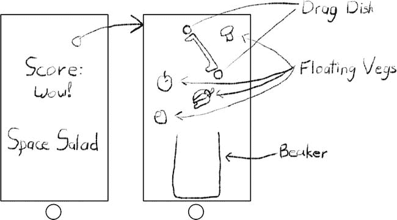
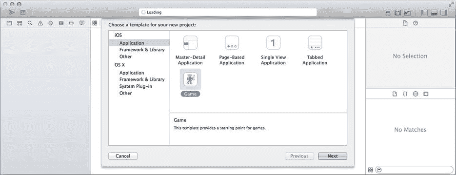
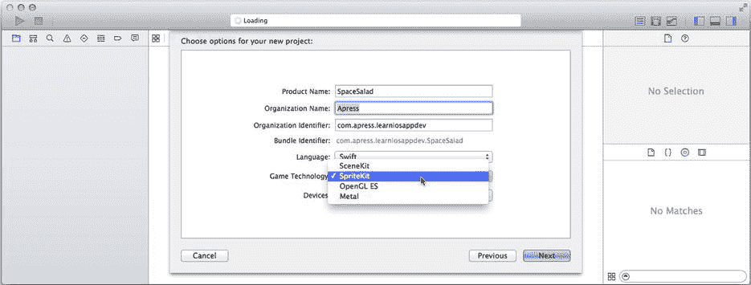
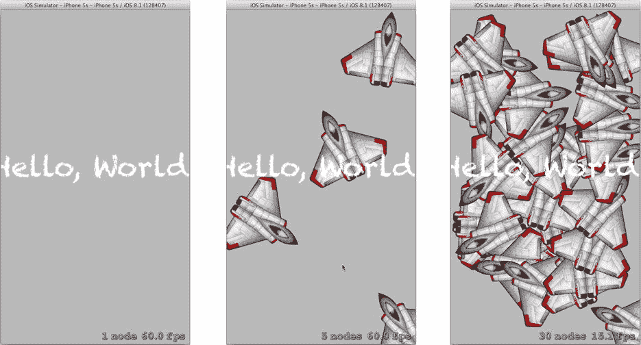

# 总结

你已学会如何为应用再添加一项精巧功能，让用户能够与世界各地的朋友和家人联系并分享内容——而且只需少量代码即可实现。你学会了如何针对特定服务定制内容，或者排除某些服务。如果你想对自己的应用提供哪些服务有更多控制权，你学会了如何使用 `SLComposeViewController` 创建特定的分享界面，以及如何使用 `SLRequest` 类，该类为无限社交网络集成提供了通道。

在学习过程中，你还获得了一些在屏幕外图形上下文中绘图和重构代码的实践经验。事实上，到目前为止你一直非常努力。为什么不休息一下，玩个有趣的游戏呢？你还没有游戏？那么，请阅读下一章，创建你自己的游戏吧！

## 第 14 章：游戏开始！

游戏可是件大事。我不好意思承认自己花了多少小时在捕捉敌方的太阳或躲避僵尸上，但可以这么说，iOS 游戏既能引人入胜，又容易上瘾。虽然本书并非关于游戏开发——市面上已有一些很棒的游戏开发书籍——但我想让你略微体验一下在 iOS 中如何创建游戏。在本章中，你将学到以下内容：

* 如何创建基于 SpriteKit 的简单 iOS 游戏
* 如何设计 SpriteKit 场景
* 如何进行场景切换
* 如何向场景中添加图像和文本内容
* 如何编写响应函数以提供用户交互
* 如何定义节点的物理行为
* 如何使用附件创建节点之间的物理关系
* 如何确定节点何时碰撞并触发相应操作
* 如何为节点附加动作

这个游戏的设计很简单。你是国际空间站（ISS）上的一名乘员，收到了一份难得的款待：新鲜的*蔬菜！自然而然，你想做一份沙拉。但你手头只有实验室设备——一个烧杯和一个培养皿——而且还有微重力这个烦人的问题。结果，你得到了一大堆沙拉配料在舱内飘浮。你的任务就是使用培养皿将这些配料赶进烧杯里，大致就像图 14-1 所示的界面。

图 14-1。SpaceSalad 设计

要创建 SpaceSalad，你将使用 SpriteKit。SpriteKit 是 iOS 五大关键动画技术之一，如第 11 章所述。让我们开始吧。

### SpaceSalad

首先，创建一个新的 iOS 应用。这次，选择游戏应用模板，如图 14-2 所示。

图 14-2。选择游戏 iOS 应用模板

在下一个窗口中，填写应用名称（SpaceSalad），输入你的组织标识符，并选择 Swift 语言。此模板还有一个游戏技术的额外选项。选择 SpriteKit，如图 14-3 所示。游戏模板实际上是四个模板合而为一。根据你的游戏技术选择，你将获得一个截然不同的应用起点。

图 14-3。创建基于 SpriteKit 的游戏应用

点击创建按钮，选择一个位置保存你的新项目。该应用模板创建了一个功能完整的“游戏”，你现在就可以运行它，如图 14-4 所示。来吧，我等着。

图 14-4。运行 SpriteKit 模板应用

模板创建的应用显示了一些文本——传统的“Hello, World”消息。如果你点击屏幕，会出现一个旋转的宇宙飞船，如图 14-4 中间所示。随着你继续点击，会出现越来越多的宇宙飞船，所有飞船同时旋转。要理解这为何如此酷炫，你需要了解一些 SpriteKit 的知识，以及它与你迄今为止使用的 `UIView` 及类似类有何不同。

### SpriteKit 简要介绍

如我在第 11 章中所解释的，SpriteKit 是为连续 2D 动画而设计的。它通过让图形处理单元（GPU）完成大部分工作来实现这一点。运行你的应用的代码——在中央处理单元（CPU）中——几乎不执行维持动画所需的实时计算。它更像一个导演。它布置场景，放置演员，然后喊一声“Action！”随后 SpriteKit 接手一切。

