# SpriteKit 入门

## 概述

`SpriteKit` 的设计目标是让那些一直使用 `UIView`、`UIViewController`、`UIResponder` 等类进行编程的 iOS 开发者感到舒适和熟悉。与此同时，两者之间也存在许多重要差异，其中许多差异是由于 CPU 和 GPU 的分离以及其他性能考虑所必需的。这使得使用 `SpriteKit` 成为一种“异世界”般的体验，充满了可识别的概念和对象，但也充斥着难以解释的遗漏和令人费解的限制。

## 熟悉的部分

与视图对象相比，以下是您会发现熟悉的内容：

- `SpriteKit` 的*节点*类似于视图对象。每个节点代表界面中的某个内容。
- 节点具有位置和框架。
- 每个节点定义了一个局部坐标系。
- 一个节点可以添加到另一个节点，成为其子节点。
- 节点可以缩放和旋转。
- 节点自然可以被动画化。
- 节点是 `UIResponder` 的子类，可以处理所有标准触摸事件。

如果您将*视图*一词替换为*节点*，您将立即理解这些概念及其关系。类似地，`SpriteKit` 的场景和视图控制器扮演着相似的角色并执行相似的任务。

## 不熟悉的部分

`SpriteKit` 节点与视图对象之间的主要区别如下：

- 您的代码不会绘制节点的内容。
- 节点坐标系的原点位于其左下角，而非左上角。
- 节点可以有一个物理体，描述其行为以及与其他节点的交互方式。
- 节点具有字符串标识符，而非数字标签。
- 节点出现在 `SpriteKit` *场景*中。
- 场景在专门的 Interface Builder 场景编辑器中设计。
- `SpriteKit` 场景一次一个地呈现在 `SpriteKit` 视图中。`SpriteKit` 视图是 `UIView` 的子类，可以出现在任何 `UIView` 可以出现的位置。
- `SpriteKit` 中没有自动布局、约束或适配。

第一个区别是最大的。节点完全由图形处理单元绘制（在 GPU 术语中称为*渲染*）。要做到这一点，绘制节点所需的所有信息首先被传输到 GPU。因此，节点上没有 `drawRect(_:)` 函数，您不能使用任何核心图形绘制函数来直接绘制节点。相反，`SKNode` 的专门子类在场景中渲染图像（`SKSpriteNode`）、文本（`SKLabelNode`）或几何形状（`SKShapeNode`）。

> **注意**：有两个例外情况。首先，您可以始终使用核心图形绘制到离屏上下文，将其捕获为图像，然后将该图像提供给 `SKSpriteNode`。其次，可以编写在 GPU 中运行的您自己的动态渲染代码。但是，正如我在第 11 章中解释的那样，那是另一个世界，远远超出了本书的范围。

坐标系也与 `UIView` 对象使用的坐标系垂直翻转。坐标系的原点位于节点的左下角，`y` 坐标向上增加。

第二个主要区别在于节点如何被动画化。在 UIKit 中，您通过告诉 iOS *要*动画化什么来动画化节点。您告诉它将视图从此位置滑动到彼位置，更改其缩放比例，并在一段时间内淡入。在 `SpriteKit` 中，您通过告诉 iOS *为什么*动画化来动画化节点。您为节点赋予形状、分配质量、定义作用于其上的力，并告诉 `SpriteKit` 节点与哪些其他节点碰撞。然后 `SpriteKit` 接管并根据您的描述持续动画化节点。

最后，`SpriteKit` 场景（`SKScene`）扮演着与视图控制器非常相似的角色，但它不是一个视图控制器。`SpriteKit` 视图（`SKView`，一个 `UIView` 子类）是 `SpriteKit` 场景的宿主。`SKView` 一次呈现一个 `SKScene`。它可以将其替换为一个新场景，并伴有动画过渡——很像一个视图控制器呈现另一个视图控制器。但是宿主 `SKView` 及其拥有的视图控制器永远不会改变。

> **注意**：在本章中，*场景*指的是 `SpriteKit` 场景，而不是故事板场景。

现在您已经了解了基本概念，让我们从简单的开始。首先创建一个使用单个节点显示单个图像的 `SpriteKit` 场景。这听起来并不难。

### 创建场景

游戏模板创建了用于托管 `SpriteKit` 视图的典型布局。初始视图控制器（Game View Controller）包含一个根视图对象，其类已在故事板中更改为 `SKView`，如图 14-5 所示。视图控制器除了充当 `SKView` 的宿主之外，所做的非常少。

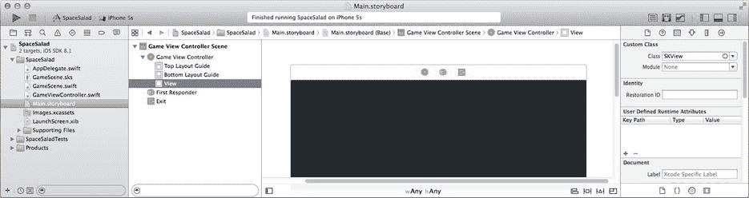

**图 14-5.** 托管 SpriteKit 视图的视图控制器

与视图控制器和故事板不同，`SpriteKit` 场景不会自动加载其场景文件。可以这么说，为了启动游戏，视图控制器会加载视图的初始场景。让我们看看那段代码。

找到`GameViewController.swift`文件并定位`viewDidLoad()`函数。现在，那里的代码看起来像下面这样：

```
override func viewDidLoad() {
    super.viewDidLoad()
    if let scene = GameScene.unarchiveFromFile("GameScene") as? GameScene {
        let skView = self.view as SKView
        skView.showsFPS = true
        skView.showsNodeCount = true
        skView.ignoresSiblingOrder = true
        scene.scaleMode = .AspectFill
        skView.presentScene(scene)
    }
}
```

这段代码调用了`unarchiveFromFile(_:)`函数，从`GameScene.sks`文件加载`GameScene`对象。`.sks`文件是一个 `SpriteKit` 场景文件。然后它设置了场景的一些属性并将其呈现在 `SpriteKit` 视图中。

#### 解档 SpriteKit 场景

`unarchiveFromFile(_:)`函数不是 iOS 函数。它实际上是包含在游戏应用模板中的一小段粘合代码。它被定义为 `SKNode` 的一个扩展。（扩展可以向现有类添加额外的方法，这在第 20 章中会解释。）您可以在`GameViewController.swift`文件中找到它，它看起来像这样：

```
extension SKNode {
    class func unarchiveFromFile(file : NSString) -> SKNode? {
        if let path = NSBundle.mainBundle().pathForResource(file, ofType: "sks") {
            var sceneData = NSData(contentsOfFile: path,
options: .DataReadingMappedIfSafe,
error: nil)!
            var archiver = NSKeyedUnarchiver(forReadingWithData: sceneData)

archiver.setClass( self.classForKeyedUnarchiver(),
forClassName: "SKScene")
            let scene = archiver.decodeObjectForKey(NSKeyedArchiveRootObjectKey)
as SKNode
            archiver.finishDecoding()
            return scene
        } else {
            return nil
        }
    }
}
```

一个`.sks`文件是一个 `SpriteKit` 对象的归档。您将在第 19 章中学习对象是如何归档的。现在，只需知道归档包含重建一组对象所需的所有数据，从而恢复它们的属性值和连接。


Interface Builder 内置了 SpriteKit 场景编辑器，可让您创建并配置场景和节点对象。这些对象会被归档并写入一个 `.sks` 文件，成为您应用的资源之一。要加载该场景，您只需解档该文件即可。但与 storyboard 不同的是，您无法在场景编辑器中更改对象的类。根对象始终是一个标准的 `SKScene` 对象。这正是 `unarchiveFromFile(_:)` 函数施展小把戏的地方。

在解档过程中，每个对象的类都会从文件中读取，并用于构造该对象。但您并不希望顶层的 `SKScene` 对象只是一个乏味的旧 `SKScene` 对象。您希望它是您自定义的 `SKScene` 子类（本例中为 `GameScene`），并包含您所有的属性和游戏逻辑。因此，`unarchiveFromFile(_:)` 函数会获取调用此函数的节点的类（`GameScene`），并将其传递给 `setClass(_:,forClassName:)` 函数。此函数告诉解档器，使用另一个类的实例来替换某个类的所有实例。

现在，当 `.sks` 文件被解档，且解档器遇到一个 `SKScene` 对象时，它会转而构造一个 `GameScene` 对象。当文件加载完成后，它会返回您自定义的 `GameScene` 对象，并使用文件中的 `SKNode` 对象进行预填充。

那么，让我们看看这个神奇的 `GameScene.sks` 文件中到底有什么。在导航器中选中该文件并查看。您应该会看到类似 图 14-6 所示的内容。

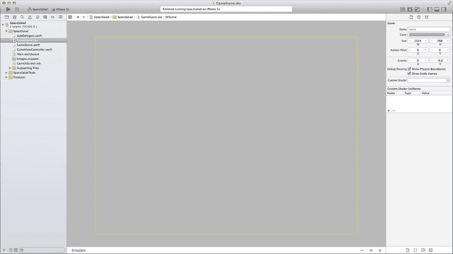

图 14-6. 模板 `GameScene.sks` 文件

`GameScene.sks` 文件中什么都没有。这简直毫无趣味——甚至有点奇怪，因为模板代码费尽心思去读取它。那么文字和飞船又是从哪来的呢？来看看 `GameScene.swift` 文件。

```
override func didMoveToView(view: SKView) {
    let myLabel = SKLabelNode(fontNamed:"Chalkduster")
    myLabel.text = "Hello, World!";
    myLabel.fontSize = 65;
    myLabel.position = CGPoint(x: CGRectGetMidX(self.frame),
                               y: CGRectGetMidY(self.frame));
    self.addChild(myLabel)
}
```

当一个 `SKScene` 被呈现在 `SKView` 中时，它会收到一个 `didMoveToView(_:)` 调用。在模板提供的 `didMoveToView(_:)` 函数中，它通过编程方式创建了一个标签节点并将其插入到场景中。谜团解开了。“Hello, World!” 消息是在场景呈现时创建的。

**注：** SpriteKit 场景编辑器是 Xcode 6 中的新功能。在早期版本的 iOS 中，所有 SpriteKit 内容都必须通过编程方式创建。

既然您在这里，那就顺便看看飞船是从哪来的。每次触摸场景时，都会收到 `touchesBegan(_:,withEvent:)` 函数。请记住 `SKScene` 和 `SKNode` 都是 `UIResponder` 的子类——与您在第 4 章中学到的是同一个 `UIResponder`。

现在您已经大致浏览过了，请删除 `didMoveToView(_:)` 和 `touchesBegan(_:,withEvent:)` 函数的模板代码。稍后您会编写自己的代码，但暂时还不需要它们。

### 添加精灵

您希望从向场景中添加单个节点开始。您可以像在模板代码中看到的那样，通过代码来实现，但您来这里是为了使用 SpriteKit 场景编辑器。

您的内容将使用一些图像资源，所以请稍作停顿，现在就把您需要的所有图像资源添加进来。找到 `Learn iOS Development Projects`  `Ch 14`  `SpaceSalad (Resources)` 文件夹，并将所有图像文件拖入 `Images.xcassets` 文件中，如图 14-7 所示。

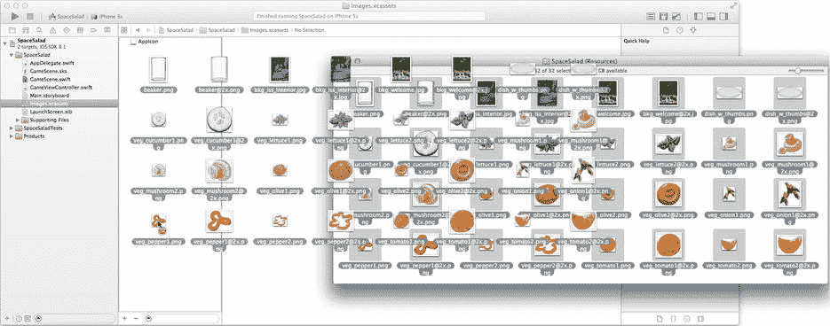

图 14-7. 导入图像资源

现在选择 `GameScene.sks` 文件。默认场景是横向的，所以首先将其切换为纵向。选择根 `SKScene` 对象——当前场景中唯一的对象。使用节点检查器将其宽度和高度从 1024 x 768 更改为 768 x 1024。趁您在这里，将两个重力值都设置为 0。毕竟，这个场景是设定在太空中的。

在库中找到 Color Sprite 对象，如图 14-8 所示。将一个新建的精灵节点拖放到场景中。

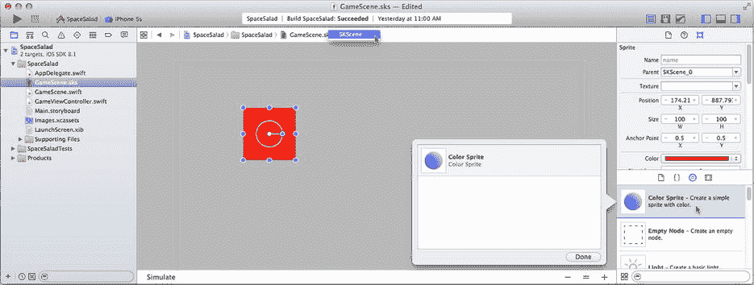

图 14-8. 添加第一个节点

**提示：** 场景编辑器没有大纲视图。要选择一个节点，请单击其在画布中的视觉表示，或使用场景编辑器导航条中的弹出菜单，如图 14-8 所示。

精灵节点（`SKSpriteNode`）是一个通用节点，用于显示和动画化任何图像或几何形状。您会经常用到它。

将新节点的 Name 属性设置为 `background`，并将其 Texture 设置为 `bkg_iss_interior.jpg`，如图 14-9 所示。精灵将自动调整大小以匹配图像资源。将其 Anchor Point 属性设置为 `(0,0)`，然后将其 Position 属性设置为 `(0,0)`。背景节点现在将填满整个场景。

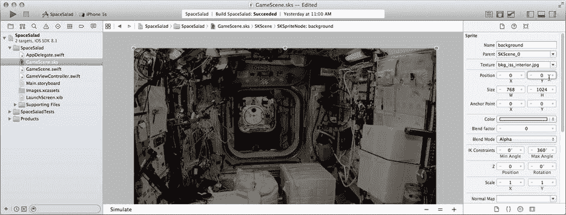

图 14-9. 配置背景节点

精灵节点有一个 `anchorPoint` 属性，用于确定精灵 `position` 属性锚定在图像或形状中的哪个点。它表示为高度和宽度的小数。默认为 `(0.5,0.5)`，意味着精灵的 `position` 将对应于其图像的中心。通过将其设置为 `(0,0)`，精灵的 `position` 将位于其左下角。现在，当您将背景节点的 `position` 设置为 `(0,0)` 时，它将该节点的左下角放置在场景的原点。

继续运行它。图 14-10 显示了在 iPad 和 iPhone 上运行的应用。它并没有做什么能勉强称得上令人兴奋的事情，但您应该感到兴奋；您已经成功创建了一个包含工作节点的 SpriteKit 场景。

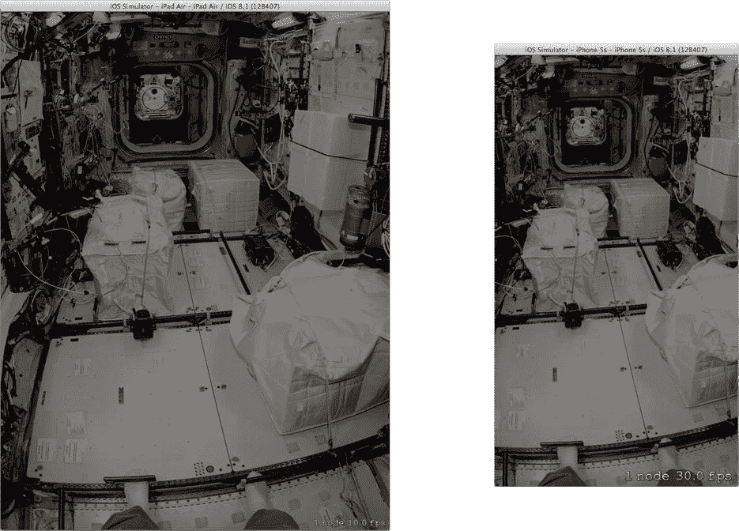

图 14-10. 背景节点在运行中

### 调整场景大小

一个节点很好，但您需要更多的节点才能完成。停止应用，切换回 `GameScene.sks` 文件，并拖入另一个颜色精灵节点。将其拖到场景左下角附近，如图 14-11 所示。将其名称设置为 `veg`，Texture 设置为 `veg_cucumber1.png`。现在您有两个节点了。

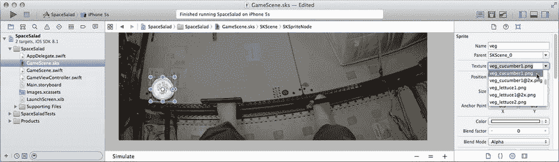

图 14-11. 添加第一个蔬菜节点

再次运行应用。这与您预期的差不多。它仍然不令人兴奋，但您已经掌握了向场景添加精灵节点的方法。您注意到的一件事是，在 iPhone 上运行时，黄瓜几乎要超出边缘，如图 14-12 右侧所示。

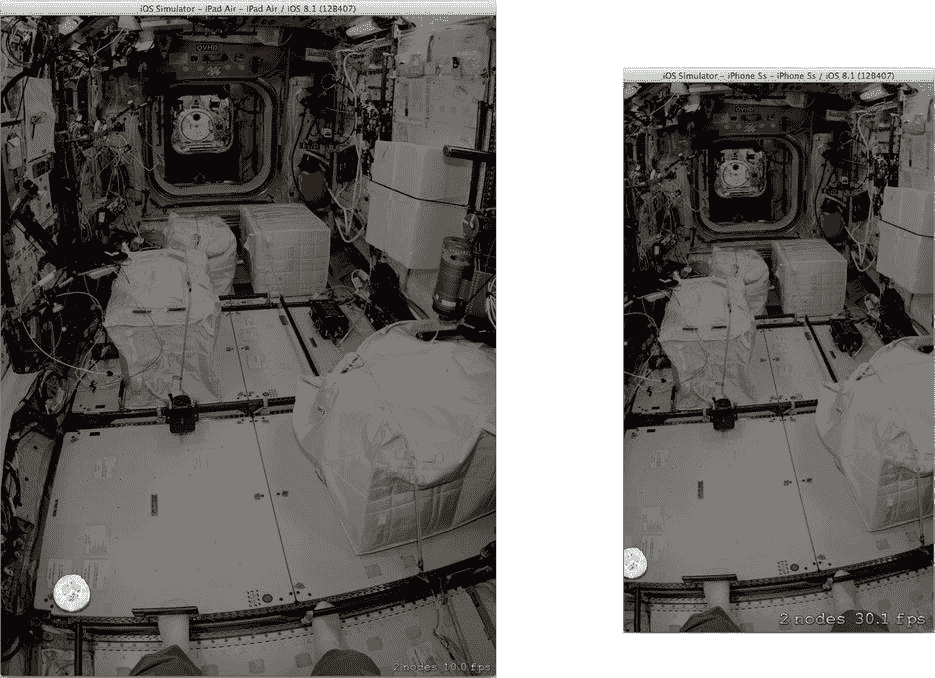

图 14-12. 未经适配的运行

正如我之前提到的，SpriteKit 没有适配的概念。事实上，场景甚至不会自动调整大小以适合 SpriteKit 视图。如果您需要它适合视图，或使其布局适应不同的大小和方向，您将需要撸起袖子自己动手。

对于这个应用，您希望自动调整场景大小以适合其宿主视图。这其实很容易。选择 `GameScene.swift` 文件并编写一个新的 `didMoveToView(_:)` 函数，如下所示：

```
override func didMoveToView(view: SKView) {
    size = view.frame.size
}
```


你只需要做到这些。当场景呈现在宿主`SKView`中时，SpriteKit 会调用场景的 `didMoveToView(_:)` 函数。代码简单地调整场景尺寸，使其与宿主视图大小一致。

遗憾的是，这并不能实现太多功能。你看，这里也没有自动布局或约束或任何类似的东西。新代码调整了场景大小，但并未改变场景中任何节点的大小或位置。要做到这一点，你还需要添加一些代码。

我将为你提供一个非常简单——有人可能会说很初级——的解决方案来重新定位节点。要么找到 `Learn iOS Development Projects`  `Ch 14`  `SpaceSalad` 文件夹，将 `ResizableScene.swift` 文件拖入你的项目导航器，要么创建一个新的 `ResizableScene.swift` 文件，并编写以下代码：

```swift
import SpriteKit

class ResizableScene: SKScene {
    let backgroundNodeName = "background"
    override func didChangeSize(oldSize: CGSize) {
        let newSize = size
        if newSize != oldSize {
            if let background = childNodeWithName(backgroundNodeName) as? SKSpriteNode {
                background.position = CGPointZero
                background.size = newSize
            }
            let transform = CGAffineTransformMakeScale(newSize.width/oldSize.width,
                                                       newSize.height/oldSize.height)
            enumerateChildNodesWithName("*") { (node,stop) in
                node.position = CGPointApplyAffineTransform(node.position, transform)
            }
        }
    }
}
```

`ResizableScene` 类重写了 `didChangeSize(_:)` 函数。每当你的场景调整大小时，这个函数就会被调用，就像当你的场景在 `didMoveToView(_:)` 中更新其 `size` 属性时那样。代码会查找名为 `background` 的节点。如果找到，就将其大小设置为与场景大小匹配。

然后，它会按比例将所有节点的位置从旧尺寸转换到新尺寸。所以，如果一个节点之前位于三分之一高度和一半宽度的位置，那么在调整大小后，它将处于相同的相对位置。请注意，节点的大小没有改变，只是重新定位了。

要让这个类为你工作，请修改你的 `GameScene` 类，使其成为 `ResizableScene` 的子类，如下所示（修改的代码用粗体表示）：

```swift
class GameScene: ResizableScene {
```

再次运行应用，如图 Figure 14-13 所示。将这些结果与图 Figure 14-12 中的结果进行对比。

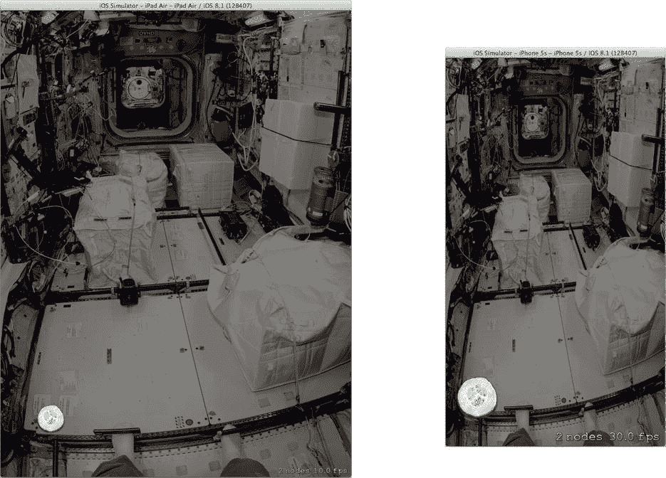

图 14-13. 自适应场景

在我们适配界面的同时，也来看看精灵的大小。那个黄瓜在 图 14-13 右侧的 iPhone 界面中看起来非常大。对于 `GameScene`，请适配你的精灵的大小以及它们的位置。

回到 `GameScene.swift` 文件。找到 `didMoveToView(_:)` 函数。在设置场景大小的语句（间接调用了 `didChangeSize(_:)` 函数）之后，添加以下代码：

```swift
let backgroundNode = childNodeWithName(backgroundNodeName) as? SKSpriteNode
let scale = CGFloat( view.traitCollection.horizontalSizeClass == .Compact ? 0.5 : 1.0 )
enumerateChildNodesWithName("*") { (node,stop) in
    if node !== backgroundNode {
        node.xScale = scale
        node.yScale = scale
    }
}
```

现在，在水平紧凑型设备（如 iPhone）上，除背景外所有对象的大小都将减半。调整大小和适配的工作就到此为止。

### 让我们动起来

你已经创建了一个 SpriteKit 场景，添加了精灵节点，并将它们适配到各种显示尺寸。但你的场景仍然没有任何动作。节点只是呆在那里。那么，程序员需要做什么才能让这里有点动静呢？

在引言中，我提到过你不要告诉 SpriteKit 节点*要*做什么动画；你要告诉它们*为什么*要动画。你可以通过赋予节点物理属性（如几何形状、质量、阻力等）来实现这一点。这被称为*物理体*，由 `SKPhysicsBody` 类定义。

共有三种类型的物理体。

*   *动态体积*描述了一个具有体积和质量的形状，可以通过力和碰撞来驱动其动画。用它来描述会移动并与环境交互的对象。壁球就是一个动态体积。
*   *静态体积*描述了一个与动态体积交互但自身从不移动，也不受力和碰撞影响的实体形状。壁球场的墙壁就是一个静态体积。
*   *边缘*是一个不可移动的边界。它的行为类似于静态体积，但不包围形状。描述地面的线就是一个边缘。

黄瓜片看起来非常像一个动态体积。它有一个形状和质量，可以移动，也可以碰撞到其他物体。选中 `GameScene.sks` 文件。选择黄瓜节点。在节点检查器中，找到“物理定义”部分，如图 Figure 14-14 所示。

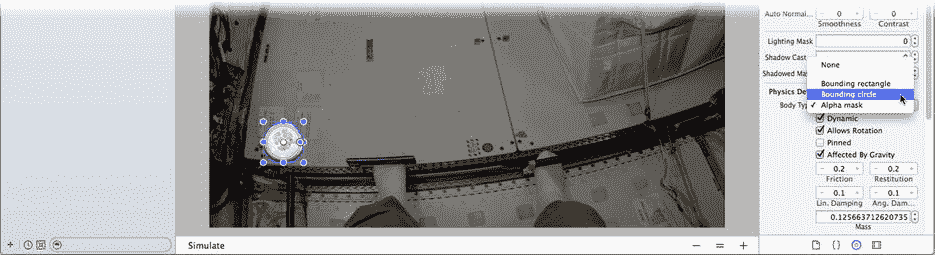

图 14-14. 为节点添加物理体

将物理体属性设置为“边界圆”。这将创建一个形状为圆形的物理体。（物理体的形状将显示在场景编辑器中。）确保“动态”和“允许旋转”选项已选中。

将线性阻尼属性更改为 `0.01`，恢复系数更改为 `0.1`。线性阻尼（`linearDamping`）类似于空气或水的阻力，会温和地减缓节点的运动。恢复系数（`restitution`）决定了节点在撞击表面或其他节点时损失多少能量。

运行你的应用。这次，再次什么都没发生。你的节点有了物理属性，但没有力作用于它。（记住你之前关闭了重力。）如果你想让你的黄瓜片移动，你需要给它一个推动力。

找到 `GameScene.swift` 中的 `didMoveToView(_:)` 函数。这应该不难，因为它是唯一的函数。在函数末尾，添加以下代码：

```swift
enumerateChildNodesWithName("veg") { (node,stop) in
    func randomForce( # min: CGFloat, # max: CGFloat ) -> CGFloat {
        return CGFloat(arc4random()) * (max-min) / CGFloat(UInt32.max) + min
    }
    if let body = node.physicsBody {
        body.applyForce(CGVector(dx: randomForce(min: -50.0, max: 50.0),
                                 dy: randomForce(min: -40.0, max: 40.0)))
        body.applyAngularImpulse(randomForce(min: -0.01, max: 0.01))
    }
}
view.ignoresSiblingOrder = true
```

然后，代码给节点一个轻轻的“踢力”。它在一个随机方向上施加一个变量力。接着，通过施加一小部分旋转力，加入了一点“旋转”。

**注意** 将 `ignoresSiblingOrder` 设置为 `true` 是针对精灵绘制的一种优化。当为 `false` 时，它会强制执行严格的父子渲染顺序。这对于复合节点（包含其他节点的节点）正确渲染有时很重要。你的应用不需要这个，将其设置为 `true` 可以让 SpriteKit 更高效地渲染场景。

现在运行应用，看看会发生什么。嗯，看啊！你的黄瓜刚刚飘向了太空——字面意义上的。它直接向右飘出了屏幕，消失了！所以，你知道物理体在工作，施加力使节点移动了。现在你需要防止它跑掉，否则你永远也吃不上饭了。

### 设置边界


你需要的是一个某种类型的屏障或墙壁，这样你的黄瓜就不会跑掉。这听起来很像一个边缘物理体。选择`GameScene.swift`文件。就在你刚刚添加到`didMoveToView(_:)`函数中的`enumerateChildNodesWithName(...)`调用之前，添加以下代码：

```
if let background = backgroundNode {
    let body = SKPhysicsBody(edgeLoopFromRect: background.frame)
    physicsBody = body
}
```

这段代码获取了背景节点，即填充场景背景的那个节点。它使用该节点的框架来创建一个边缘循环。一个*边缘循环*是一个遵循路径（这里是一个矩形）的边缘物理体。换句话说，它创建了四个不可移动的墙壁。然后将这些墙壁添加到场景中。

再次运行你的应用程序。现在黄瓜会从边缘弹回并停留在场景中。这就是物理体和碰撞的作用。

但一根黄瓜做不成沙拉。选择`GameScene.sks`文件。选择黄瓜节点。按住`Option`键，将节点的一个副本拖入场景。重复此操作 10 次以上，直到你总共有 12 个节点，如图 14-15 所示。

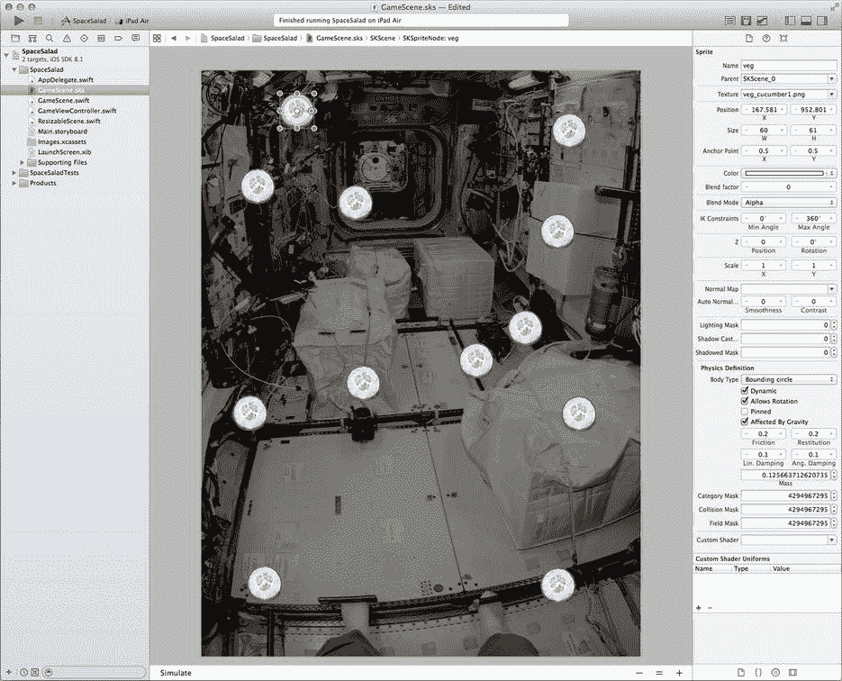

图 14-15. 复制黄瓜节点

选择每个节点，将其`Texture`属性设置为一个`veg_*.png`图像文件，这样每个节点都使用不同的纹理图像。不要选择任何`@2x`图像；这些是用于 Retina 显示屏的高分辨率资源。

再次运行你的应用程序，它们都会开始四处飘动，相互碰撞并撞击墙壁，如图 14-16 所示。你会注意到它们由于阻力、反冲和回弹而逐渐减速。这就是 SpriteKit 的真正力量。只需少量属性，你就可以描述一个栩栩如生的对象世界。

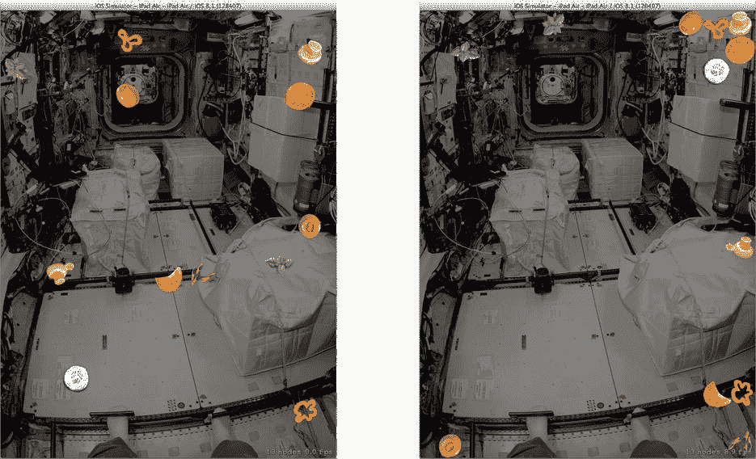

图 14-16. 许多浮动精灵

### 枚举子节点

`enumerateChildNodesWithName(_:,usingBlock:)`函数在处理充满节点的场景时非常有用。该函数搜索与名称匹配的节点，并将每个节点传递给一个代码块，该代码块可以对节点执行某些操作。

节点不需要有唯一的名称。在 SpaceSalad 中，所有蔬菜节点都有相同的名称（`veg`）。语句`enumerateChildNodesWithName("veg") { ... }`只处理蔬菜节点，而忽略其他节点。

但是名称参数实际上是一个搜索模式。在你的`didChangeSize(_:)`函数中，你使用了一条`enumerateChildNodesWithName("*")`语句来处理场景中的所有节点。而这只是冰山一角。你可以使用通配模式来选择要处理的节点，例如`"*_car"`（匹配`red_car`和`blue_car`）、`"tire[1234]"`（匹配`tire1`但不匹配`tire5`）以及`"pace_car/headlight"`（匹配包含在`pace_car`节点中的`headlight`节点）。

搜索模式可以相当复杂。你可以在*SpriteKit 编程指南*中找到完整的描述。找到“构建你的场景”章节中的“搜索节点树”部分。

### 添加障碍物

应用程序开始看起来生动起来。回到设计上，目标是将单个沙拉配料收集到一个烧杯中。烧杯将是一个静态体积。换句话说，它有一个体积并与其他精灵交互，但它永远不会移动。这意味着玩家无法打翻烧杯。也许你可以把它留到高级关卡中。

烧杯将和其他节点一样，是一个精灵。将一个新的彩色精灵拖入你的`GameScene.sks`文件中。将其`Name`属性设置为`beaker`，将其`Texture`属性设置为`beaker.png`，如图 14-17 所示。将其`Anchor Point`属性更改为`(0.5,0)`，然后将其位置设置为`(384,0)`，同样如图 14-17 所示。


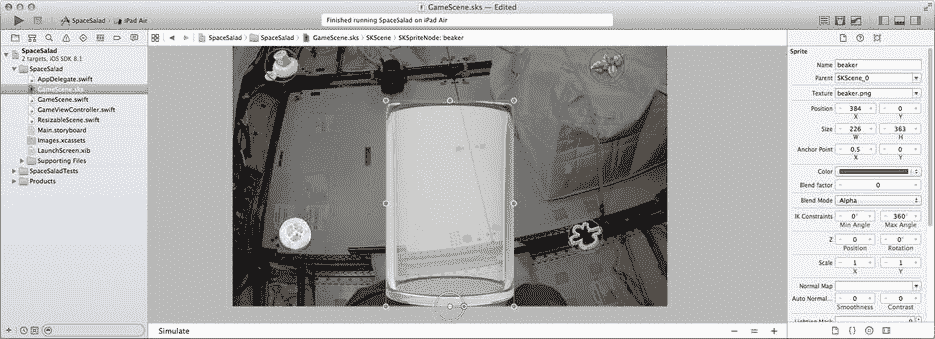

图 14-17. 添加烧杯节点

**注意**：如果现在有蔬菜节点与烧杯节点相交，请移动它们使其不再相交。你不希望以两个物体相互穿透这种不可能的条件来启动物理模拟。

烧杯节点的位置位于其底部中心，并且该位置被设置为场景的底部中心。由于`ResizableScene`类会按比例移动节点的位置，因此烧杯将始终位于场景的底部中心。

与其使用场景编辑器定义一个简单的物理体，不如以编程方式创建一个更复杂的形状。在`GameScene.swift`文件中，将以下代码添加到`didMoveToView(_:)`函数中，紧靠在推动蔬菜的代码之前：

```
if let beaker = childNodeWithName("beaker") as? SKSpriteNode {
    if beaker.physicsBody == nil {
        let bounds = BoundsOfSprite(beaker)
        let side = CGFloat(8.0)
        let base = CGFloat(6.0)
        let beakerEdgePath = CGPathCreateMutable()
        CGPathMoveToPoint(beakerEdgePath, nil, bounds.minX, bounds.minY)
        CGPathAddLineToPoint(beakerEdgePath, nil, bounds.minX, bounds.maxY)
        CGPathAddLineToPoint(beakerEdgePath, nil, bounds.minX+side, bounds.maxY)
        CGPathAddLineToPoint(beakerEdgePath, nil, bounds.minX+side, bounds.minY+base)
        CGPathAddLineToPoint(beakerEdgePath, nil, bounds.maxX-side, bounds.minY+base)
        CGPathAddLineToPoint(beakerEdgePath, nil, bounds.maxX-side, bounds.maxY)
        CGPathAddLineToPoint(beakerEdgePath, nil, bounds.maxX, bounds.maxY)
        CGPathAddLineToPoint(beakerEdgePath, nil, bounds.maxX, bounds.minY)
        let body = SKPhysicsBody(edgeLoopFromPath: beakerEdgePath)
        beaker.physicsBody = body
    }
}
```

看起来代码很多，但它实际做的事情非常简单。代码获取烧杯节点，确定其边界（在其本地坐标系中的框架），然后创建一个大致近似于烧杯侧边和底部的路径，如图图 14-18 所示。该路径随后成为一组描述物理体的墙壁。

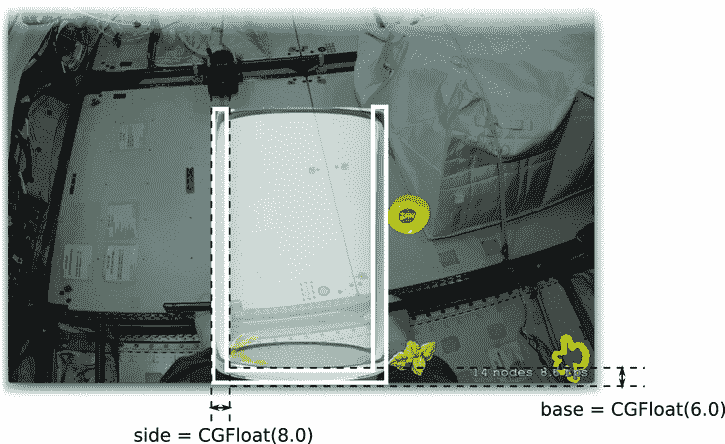

图 14-18. 烧杯的物理体形状

物理体的形状可以相当复杂。SpriteKit 为你提供了基本形状（圆形、矩形、多边形等）。你也可以基于精灵的图像来定义其形状，利用图形中的透明部分来确定精灵的轮廓。并且，正如你刚刚所见，你可以创建任意复杂的路径来描述其形状和体积。

**提示**：为了获得最佳性能，请使用尽可能简单的体形状，圆形恰好就是这种形状。使用复杂的轮廓或形状的图像会显著增加 SpriteKit 为确定是否发生碰撞而必须执行的计算量。这反过来会显著降低动画性能，并限制你可以同时动画化的精灵数量。

这段代码使用了一个工具函数来获取精灵在其本地坐标系中的框架。将该函数添加到`GameScene`类的上方（或下方），如下所示。你稍后会重用它。

```
func BoundsOfSprite( sprite: SKSpriteNode ) -> CGRect {
    var bounds = sprite.frame
    let anchor = sprite.anchorPoint
    bounds.origin.x = 0.0 - bounds.width*anchor.x
    bounds.origin.y = 0.0 - bounds.height*anchor.y
    return bounds
}
```

现在当你运行应用时，蔬菜会相互弹开，也会在墙壁和烧杯侧壁上弹开，如图图 14-19 所示。如果幸运的话，你甚至可能让一些蔬菜弹进烧杯里。

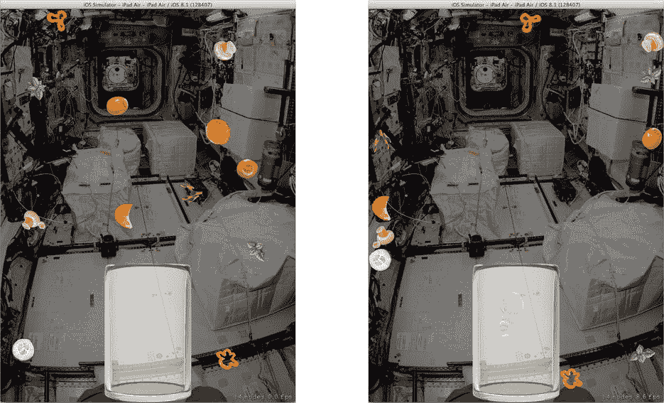

图 14-19. 蔬菜与烧杯互动

但这并非运气游戏。这是一个技巧游戏，现在是时候添加培养皿了，这样你的用户就可以推动蔬菜了。这将需要与玩家进行一些交互。

### 与玩家交互

玩家与单个精灵互动：培养皿。所以很明显，你需要先向场景中添加一个培养皿。选择`GameScene.sks`文件，拖入一个新的彩色精灵。

和你的烧杯一样，你的培养皿也需要一个非典型的形状。在`GameScene.swift`文件中，靠近创建烧杯物理体的代码处，添加以下代码。这需要输入不少内容，所以你可能想从`Learn iOS Development Projects` `` `Ch 14` `` `SpaceSalad`文件夹中的已完成项目中复制粘贴。

```
if let dish = childNodeWithName("dish") as? SKSpriteNode {
    let scale = dish.xScale
    dish.xScale = 1.0
    dish.yScale = 1.0
    let bounds = BoundsOfSprite(dish)
    let minX = bounds.minX
    let maxX = bounds.maxX
    let midY = bounds.midY
    let minY = bounds.minY
    let width = bounds.width
    let bottomThickness = CGFloat(10.0)
    let curveInterpolationPoints = 4
    let dishEdgePath = CGPathCreateMutable()
    CGPathMoveToPoint(dishEdgePath, nil, minX, minY)
    for p in 0...curveInterpolationPoints {
        let x = minX+CGFloat(p)*width/CGFloat(curveInterpolationPoints)
        let relX = x/(width/2)
        let y = (midY-minY-bottomThickness)*(relX*relX)+minY+bottomThickness
        CGPathAddLineToPoint(dishEdgePath, nil, x, y)
    }
    CGPathAddLineToPoint(dishEdgePath, nil, maxX, minY)
    CGPathCloseSubpath(dishEdgePath)
    let body = SKPhysicsBody(polygonFromPath: dishEdgePath)
    body.usesPreciseCollisionDetection = true
    dish.physicsBody = body

dish.xScale = scale
    dish.yScale = scale
}
```

就像烧杯一样，这段代码获取培养皿节点的边界，并使用它来创建一条路径。该路径是一个不规则的多边形，一侧是方形，另一侧大致是凹形。你可以仔细阅读代码并尝试想象它所创造的形状。我也可以提供一张插图。或者，你可以让 SpriteKit 为你展示它。

SpriteKit 包含许多调试功能。从一开始你就在使用其中两个。在`GameViewController.swift`文件中，`viewDidLoad()`函数加载初始场景对象并呈现它。在此之前，它设置了两个属性，如下所示：

```
skView.showsFPS = true
skView.showsNodeCount = true
```

这会导致场景对象显示正在渲染的节点数量以及场景的渲染速率。参见图 14-16 的示例。还有其他的调试辅助工具，其中之一会绘制一条与场景中物理体相对应的线。当我启用诸如此类的功能时，我喜欢基于一个符号常量来配置它们。当我完成这些辅助工具的使用后，我可以轻松地再次关闭它们。本着这种精神，在`GameViewController`类定义之外添加以下常量：

```
let debugAids = true
```

现在返回设置调试辅助工具的代码，并按如下方式修改（修改的代码以粗体显示）：

```
skView.showsFPS = debugAids
skView.showsNodeCount = debugAids
skView.showsPhysics = debugAids
```

再次运行应用。这次，SpriteKit 将绘制场景中所有物理体的轮廓，如图图 14-20 所示。（为了在印刷品中更清晰地显示轮廓，图 14-20 的背景已被淡化。）

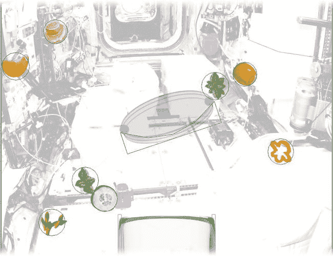

图 14-20. 物理体轮廓

### 响应触摸


`SKNode`是`UIResponder`的子类。因此，`SKNode`可以通过编写触摸事件处理程序来参与触摸事件，就像你在第 4 章中所做的那样。与`UIView`一样，`SKNode`的`userInteractionEnabled`属性通常设置为`false`。因此，默认情况下，没有精灵会接收触摸事件，所有触摸事件都会落到`SKScene`对象上。对于这个应用来说，这非常完美。

你的场景对象将解释触摸事件，并以此来移动培养皿。这之所以在场景对象中完成，是因为你会对培养皿外部的触摸做出响应。如果由培养皿对象来响应触摸，它会错过这些事件。

以下是培养皿节点交互的工作方式：

-   培养皿有两个拖拽点，分别位于节点的两端中心位置。
-   当用户用两根手指触摸界面，并且这些触摸点足够接近拖拽点的位置时，用户开始拖动培养皿。
-   触摸位置通过距离最近原则匹配到培养皿的拖拽点。也就是说，最靠近培养皿右端的触摸点用于拖动培养皿的右端。
-   培养皿被间接拖动。用户的触摸点用于定位两个锚点。这些锚点通过连接物与培养皿的拖拽点相连。

顾名思义，连接物描述了两个节点之间，或一个节点与一个固定位置（称为**锚点**）之间的物理关系。连接物可以是刚性的，你会得到一个“拖杆”或“摆锤”的效果。

连接物也可以是柔性的，其作用类似于弹簧。在这个应用中，柔性连接物与锚点一起使用。这就像你将弹簧的一端固定在一个位置，另一端连接到培养皿上。然后物理引擎接管，移动培养皿以跟随“弹簧”施加的力。

实现所有这些功能的代码在代码清单 14-1 中。为了节省大量打字时间，请从已完成的`Learn iOS Development Projects` → `Ch 14` → `SpaceSalad`文件夹中的项目复制这些函数。

***代码清单 14-1*** 培养皿拖拽逻辑

```
let dragProximityMinimum = CGFloat(60.0)

var dragNode: SKSpriteNode?
var leftDrag: SKNode?
var leftJoint: SKPhysicsJointSpring?
var rightDrag: SKNode?
var rightJoint: SKPhysicsJointSpring?

func dragPoints(dish: SKSpriteNode) -> (leftPoint: CGPoint, rightPoint: CGPoint) {
    let dishSize = dish.size
    let width = dishSize.width/dish.xScale
    let rightThumbPoint = dish.convertPoint(CGPoint(x: -width/2, y: 0.0), toNode: self)
    let leftThumbPoint = dish.convertPoint(CGPoint(x: width/2, y: 0.0), toNode: self)
    return (leftThumbPoint,rightThumbPoint)
}

func attachDragNodes(dish: SKSpriteNode) {
    let thumbs = dragPoints(dish)
    func newDragNode( position: CGPoint ) -> SKNode {
        var newNode: SKNode = ( debugAids ? SKSpriteNode(color: UIColor.redColor(),
                                                   size: CGSize(width: 8, height: 8))
            : SKNode() )
        newNode.position = position
        let body = SKPhysicsBody(circleOfRadius: 4.0)
        body.dynamic = false
        newNode.physicsBody = body
        addChild(newNode)
        return newNode
    }
    leftDrag = newDragNode(thumbs.leftPoint)
    rightDrag = newDragNode(thumbs.rightPoint)

leftJoint = SKPhysicsJointSpring.jointWithBodyA( dish.physicsBody,
        bodyB: leftDrag!.physicsBody,
        anchorA: thumbs.leftPoint,
        anchorB: thumbs.leftPoint)
    leftJoint!.damping = 4.0
    leftJoint!.frequency = 20.0
    physicsWorld.addJoint(leftJoint!)
    rightJoint = SKPhysicsJointSpring.jointWithBodyA( dish.physicsBody,
        bodyB: rightDrag!.physicsBody,
        anchorA: thumbs.rightPoint,
        anchorB: thumbs.rightPoint)
    rightJoint!.damping = 3.0
    rightJoint!.frequency = 20.0
    physicsWorld.addJoint(rightJoint!)
}

func moveDragNodes(# touchPoints: [CGPoint], dish: SKSpriteNode) {
    assert(touchPoints.count==2,"Expected exactly 2 touch points")
    var leftLoc = touchPoints[0]
    var rightLoc = touchPoints[1]
    let thumbs = dragPoints(dish)
    if hypot(leftLoc.x-thumbs.leftPoint.x,leftLoc.y-thumbs.leftPoint.y)
           + hypot(rightLoc.x-thumbs.rightPoint.x,rightLoc.y-thumbs.rightPoint.y) >
        hypot(rightLoc.x-thumbs.leftPoint.x,rightLoc.y-thumbs.leftPoint.y)
           + hypot(leftLoc.x-thumbs.rightPoint.x,rightLoc.y-thumbs.rightPoint.y) {
            let swapLoc = rightLoc
            rightLoc = leftLoc
            leftLoc = swapLoc
    }
    leftDrag!.position = leftLoc
    rightDrag!.position = rightLoc
}

func releaseDragNodes() {
    if let dish = dragNode {
        physicsWorld.removeJoint(rightJoint!)
        physicsWorld.removeJoint(leftJoint!)
        leftDrag!.removeFromParent()
        rightDrag!.removeFromParent()
        rightJoint = nil
        leftJoint = nil
        rightDrag = nil
        leftDrag = nil
        dragNode = nil
    }
}
```

简而言之，`attachDragNodes(_:)`函数创建连接物对象并将其连接到培养皿节点的两端。`moveDragNodes(touchPoints:,dish:)`函数将连接物的锚点端移动到新位置。这会在培养皿和触摸位置之间产生张力，导致培养皿朝它们移动并位于它们之间。`releaseDragNodes()`函数删除连接物，使培养皿再次自由浮动。

要驱动此过程响应触摸事件，请添加代码清单 14-2 中的触摸事件处理程序函数。如果你已经读过第 4 章，这些应该是不言自明的。`touchesBegan(...)`处理程序会检查用户是否用两根手指触摸界面，并且这两个触摸点是否都在培养皿节点拇指位置的合理距离内。如果所有这些都满足，它会调用`attachDragNodes(_:)`开始拖拽。

***代码清单 14-2*** 触摸事件处理程序

```
func points(# touches: NSSet, inNode node: SKNode) -> [CGPoint] {
    return (touches.allObjects as [UITouch]).map() {
        (touch) in touch.locationInNode(node)
        }
}

override func touchesBegan(touches: NSSet, withEvent event: UIEvent) {
    if touches.count == 2 /*&& !gameOver*/ {
        if dragNode == nil {
            dragNode = childNodeWithName("dish") as? SKSpriteNode
            if let dish = dragNode {
                let hitRect = dish.frame.rectByInsetting(dx: -dragProximityMinimum,
                                                         dy: -dragProximityMinimum)
                for point in points(touches: touches, inNode: self) {
                    if !hitRect.contains(point) {
                        dragNode = nil;
                        return
                    }
                }
                attachDragNodes(dish)
                moveDragNodes(touchPoints: points(touches: touches, inNode: self),
                                     dish: dish)
            }
        }
    }
}

override func touchesMoved(touches: NSSet, withEvent event: UIEvent) {
    if touches.count == 2 {
        if let dish = dragNode {
            moveDragNodes(touchPoints: points(touches: touches, inNode: self), dish: dish)
        }
    }
}

override func touchesEnded(touches: NSSet, withEvent event: UIEvent) {
    releaseDragNodes()
}

override func touchesCancelled(touches: NSSet!, withEvent event: UIEvent!) {
    touchesEnded(touches, withEvent: event)
}
```

`touchesMoved(...)`处理程序仅使用最新的触摸位置更新锚点。最后，`touchesEnded(...)`处理程序释放培养皿。`points(touches:,inNode:)`函数是一个实用程序，它被反复用于从一组触摸对象中提取触摸位置，并返回它们在给定节点本地坐标中的位置数组。


来看看你为那些代码编写的内容效果如何。运行你的应用。在培养皿上用手指触摸两个拇指点。抓住它后，将其拖拽以把蔬菜赶进烧杯，如图 14-21 所示。

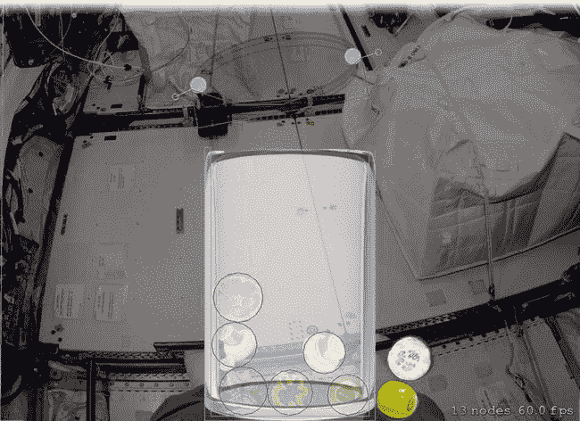

图 14-21. 培养皿节点交互

这并不像看起来那么容易，对吧？同时请注意，你添加的代码提供了它自己的调试辅助工具。当`debugAids`为`true`时，创建附着节点的代码会生成可见节点（`SKSpriteNode`），而不是不可见节点（`SKNode`）。这让你在调试时能看到附着节点的位置。

你可能没有立刻注意到，培养皿绘制在了蔬菜节点的上方。或者可能没有。又或者烧杯绘制在某些蔬菜的下方但其他蔬菜的上方。问题在于你尚未建立节点的垂直顺序。接下来我们着手解决这个问题。

### 平面上的精灵

与`UIView`类似，`SKNode`具有 Z 轴顺序。`UIView`按照它们在`subviews`数组中出现的顺序绘制。而`SKNode`则有一个`zPosition`属性。`zPosition`值越大，节点离用户越近。离用户更近的节点绘制在更远节点的上方。SpriteKit 中的 Z 轴顺序与你将节点添加到场景的顺序完全无关，并且可以随时更改。

如果两个节点具有相同的`zPosition`值，SpriteKit 不保证哪个节点会绘制在另一个之上。这有时可能很危险。例如，你的背景节点与场景中所有其他节点具有相同的`zPosition`。在某个时候，SpriteKit 可能会决定将背景绘制在蔬菜之上，使你的沙拉消失！你肯定不希望发生这种情况。

对于 SpaceSalad，你希望背景是场景中最远的精灵。然后你希望培养皿绘制在背景之上，但在蔬菜之下。你希望蔬菜绘制在培养皿之上，但在烧杯之下。

**提示** 作为规则，重叠的精灵应该具有不同的`zPosition`值。不重叠（或不应重叠）的精灵，比如你的蔬菜，可以共享相同的`zPosition`值。

通过为精灵分配`zPosition`值，将它们组织到不同的平面中。首先，将以下枚举添加到`GameScene.swift`文件中，放在类定义之外，如下所示：

```
enum GamePlane: CGFloat {
    case Background = 0
    case Clock
    case Dish
    case Vegetable
    case Beaker
    case Score
}
```

当你稍后通过代码配置一些节点时，这将非常有用。现在，将其作为指南来更改场景文件中节点的`zPosition`属性。

选择`GameScene.sks`文件。同时选中所有蔬菜精灵（按住 Command 键以扩展选择范围），并将它们的 Z Position 改为 3，如图 14-22 所示。选择培养皿节点并将其 Z Position 设为 2。选择烧杯并将其 Z Position 设为 4。背景的 Z Position 已经为 0。

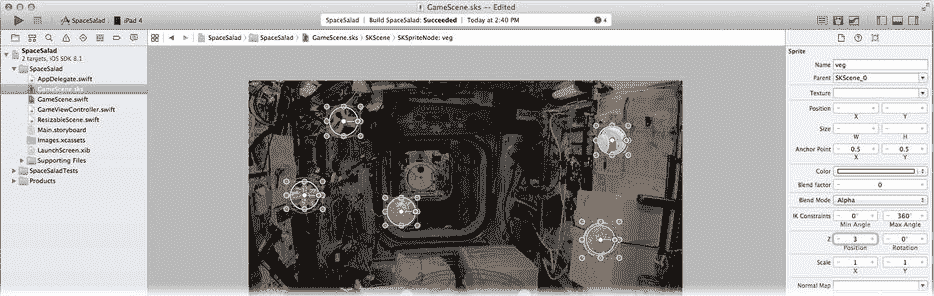

图 14-22. 设置节点的 Z 轴顺序

现在，你的蔬菜将始终位于烧杯之后、背景之前。

### 发生碰撞的节点

一旦你为蔬菜、烧杯、培养皿和边界创建了物理体，它们就开始互相碰撞。这在 SpriteKit 中称为*碰撞*。似乎所有具有物理体的物体都会与任何其他具有物理体的物体碰撞，但事实并非如此。

你对哪些节点可以与其他节点碰撞拥有很大的控制权。碰撞由物理体的两个属性决定：类别掩码（`categoryBitMask`）和碰撞掩码（`collisionBitMask`）。

每个属性都是一个具有 32 个单比特标志的整数值。你可以通过定义最多 32 个不同的类别来使用它们，并为每个类别分配一个唯一的比特位。在 SpaceSalad 中，你需要四个类别。选择`GameScene.swift`文件，并在类定义之外添加此`enum`，如下所示：

```
enum CollisionCategory: UInt32 {
    case Dish =           0b00000001
    case Floaters =       0b00000010
    case Beaker =         0b00000100
    case EverythingElse = 0b00001000
}
```

然后，你将每个节点分配到一个或多个类别（尽管一个节点通常只分配到一个类别）。接着，你将其`collisionBitMask`属性设置为它将与之碰撞的所有类别。实际上，你定义了一个可能的碰撞矩阵，从而可以定义一个节点只与某些节点和表面碰撞，而不与其他碰撞。例如，你的游戏可能有一个力场节点。机器人节点和飞行器节点会与力场碰撞，但能量冲击节点则会直接穿过它。

你可以通过代码或在 SpriteKit 场景编辑器中设置节点的碰撞类别。例如，你可以选择所有蔬菜节点，并在属性检查器中找到 Physics Definitions 部分。由于蔬菜的物理体是在场景编辑器中定义的，请将其 Category Mask 设置为`2`（`0b00000010`）。

或者，你也可以通过代码进行分配。在`GameScene.swift`文件中，找到`didMoveToView(_:)`函数。在创建背景物理体的代码块中，添加以下语句：

```
body.categoryBitMask = CollisionCategory.EverythingElse.rawValue
```

在创建烧杯物理体（使用`CollisionCategory.Beaker`值）和培养皿（使用`CollisionCategory.Dish`）的代码中添加类似的语句。如果你不想在场景编辑器中设置所有蔬菜节点的类别值，请在微调蔬菜节点的代码块中添加以下语句：

```
body.categoryBitMask = CollisionCategory.Floaters.rawValue
```

对于 SpaceSalad，类别目前还不太重要。到目前为止，你仅使用类别来确定碰撞。默认情况下，`collisionBitMask`属性的值为`0xffffffff`，这意味着每个物理体都会与任何类别的其他物理体碰撞，这也是你的节点从一开始就在弹来弹去的原因。

但碰撞类别也用于接触处理。既然你已经为节点分配了碰撞类别，就让这些类别发挥作用吧。

### 接触！

当两个物理体接触时，我们称它们处于*接触*状态。最令人感兴趣的接触是与碰撞相关的那些。当两个物体碰撞时，你的游戏通常需要执行某些操作。砖块会爆炸，导弹会爆炸，或者番茄会爆炸。也许也会发生非爆炸性的事件。关键是，你的应用需要知道这些情况何时发生。

这也非常简单。要处理接触事件，你必须执行以下操作：

1.  创建一个接触委托对象。
2.  将其设置为物理模拟引擎的委托。
3.  定义一个`didBeginContact(_:)`或`didEndContact(_:)`委托函数，或同时定义两者。
4.  在物理体中设置`contactsTestBitMap`，包含会导致接触事件的类别。

首先，将你的`GameScene`对象转变为接触委托，在`GameScene.swift`的类中添加此协议，如下所示：

```
class GameScene: ResizableScene, SKPhysicsContactDelegate {
```

然后，你需要让你的对象成为物理模拟器的委托。在你的`didMoveToView(_:)`函数中，添加以下语句：

```
physicsWorld.contactDelegate = self
```

现在，向你的`GameScene`类添加一个`didBeginContact(_:)`委托函数，如下所示：

```
func didBeginContact(contact: SKPhysicsContact!) {
}
```


