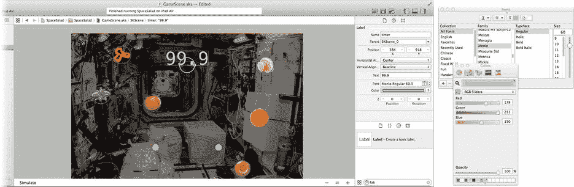

# 格式文本

然而，你仍然不会收到任何 `didBeginContact(_:)` 调用。接触处理仅发生在已将其 `contactsTestBitMap` 属性设置为位掩码的物理体上，该位掩码填充了你希望处理接触的物体类别。

对于 SpaceSalad 来说，这将很简单。游戏的目标是将蔬菜推入烧杯，然后将盘子放在上面，防止它们再次浮出。因此，当实验室盘子碰到烧杯并且所有蔬菜都在烧杯内时，游戏将结束。

为盘子节点设置接触测试类别。请在 `didMoveToView(_:)` 函数中执行此操作。找到创建盘子节点物理体的代码块，并添加以下语句：

```
body.contactTestBitMask = CollisionCategory.Beaker.rawValue
```

现在，每当盘子被拖下并触碰烧杯时，你的 `didBeginContact(_:)` 函数将被调用。接触对象（`SKPhysicsContact`）将包含对两个相接触物体的引用、接触发生的坐标，以及关于碰撞力和方向的一些信息。

SpaceSalad 对这些信息不感兴趣。它只想知道游戏是否结束。问题是，你的游戏到目前为止游戏逻辑少得可怜；既没有计时器也没有分数。既然其他部分都已就位，我认为是时候把这个应用变成一个真正的游戏了。

## 将 SpaceSalad 游戏化

让我们开始让你的游戏更像一个游戏。让游戏变得刺激的因素之一是设定时间限制并显示一个大型倒计时器。我告诉你，这真的会让我的心跳加速。既然有时间限制，就意味着游戏必须在某个时刻结束。这也意味着它必须在某个时刻开始。添加一些逻辑来启动和停止游戏，并管理一个计时器。

回到 `GameScene.swift`，将以下代码添加到你的类中：

```
let gameDuration = 100.0
var timeRemaining = 0.0
var gameOver = false

func startGame() {
    gameOver = false
    timeRemaining = gameDuration
}

func endGame(score: Int) {
    gameOver = true
    releaseDragNodes()
}
```

现在你的游戏有了时间限制，以及开始和停止游戏的函数。

**提示：** 在较大的项目中，你应该使用模型-视图-控制器设计模式来隔离游戏逻辑和游戏状态。`GameScene` 是你的视图对象。这个游戏逻辑应该放在一个单独的游戏控制器类（`GameController`）中，或者隔离在 `GameScene` 的一个扩展中。一个更复杂的游戏可能还需要一个单独的游戏状态对象，即你的数据模型，特别是当你需要保存和恢复游戏时。

游戏何时开始？它在 `GameScene` 被呈现时开始。在 `didMoveToView(_:)` 函数的末尾，添加以下语句：

```
startGame()
```

游戏何时结束？当所有沙拉配料都在烧杯内，或者时间用完时结束。而当游戏结束时，你需要计算分数。将所有逻辑封装到一个 `score()` 函数中，将以下代码添加到类中：

```
func score() -> (score: Int, won: Bool) {
    var capturedCount = 0
    var missing = false
    let beakerFrame = childNodeWithName("beaker")!.frame
    enumerateChildNodesWithName("veg") { (node, stop) in
        if beakerFrame.contains(node.position) {
            ++capturedCount
        } else {
            missing = true
        }
    }
    return (capturedCount*(Int(timeRemaining)+60), !missing)
}
```

此函数计算游戏分数，并判断玩家是否获胜（成功将所有蔬菜放入烧杯）。它的工作原理是获取烧杯节点的框架，然后定位场景中每个蔬菜节点的位置。每个被捕获的蔬菜都会计入获胜分数。任何在烧杯框架外的蔬菜都会将 `missing` 标志设为 `true`，表明游戏尚未结束。分数根据捕获的蔬菜数量和剩余时间计算；你捕获所有蔬菜的速度越快，分数就越高。

这个函数提供了判断游戏是否完成所需的一切信息。你现在可以（终于！）编写上一节中的接触处理器了。用以下代码充实你的接触处理器：

```
func didBeginContact(contact: SKPhysicsContact!) {
    let outcome = score()
    if outcome.won {
        endGame(outcome.score)
    }
}
```

这几乎平淡无奇。每次盘子碰到烧杯时，这段代码都会快速检查所有蔬菜是否都在烧杯内以及最终得分。如果游戏获胜，它会用计算出的分数结束游戏。

哦，还有一个细节需要处理。回到 `touchesBegan(_:,withEvent:)` 函数，修改第一个 `if` 语句，使其如下所示：

```
if touches.count == 2 && !gameOver {
```

这一简单的修改防止了玩家在游戏结束后还能抓住盘子继续玩。

你的游戏现在可以运行了，但你看不到任何工作成果。我是说字面意义上的。没有任何东西显示游戏已经开始或结束，或者分数是多少。如果你想看到你的新代码运行效果，可以在诸如 `didBeginContact(_:)` 和 `endGame(_:)` 等关键函数中设置一些断点。Xcode 会向你展示正在发生的事情，但你需要让玩家也能看到。

## 行动中的动作

我之前提到过给你的游戏添加一个计时器。我们现在就来做这件事。这将相当显眼地显示游戏正在运行以及何时结束。选择 `GameScene.sks` 文件。这次，拖入一个标签节点，如图 14-23 所示。



图 14-23. 添加一个标签节点

选择新的标签节点并设置其属性如下：

- 名称：`timer`
- 位置：`(384,918)`
- 文本：`99.9`
- 字体：`Menlo Regular 60.0`
- 颜色：芹菜绿（红色=178，绿色=251，蓝色=150）
- Z 位置：`1` (`GamePlane.Clock`)

标签节点（`SKLabelNode`）显示一些文本，就像精灵节点显示图像或颜色一样。与 `UILabel` 对象类似，你可以通过更新其 `text` 属性来更改其显示内容。对于 SpaceSalad，你希望每十分之一秒用剩余时间更新一次标签。

如果你是用 `UILabel` 来实现这一点，你可能会安排一个 `NSTimer` 对象每秒触发十次，并让你的定时器函数更新标签视图。但在 SpriteKit 中，事情不是这么做的。

在 SpriteKit 中，你通过动作来动画化节点。动作是一种附加到节点上的效果或过程。每次 SpriteKit 渲染完整个场景——称为一个*帧*，就像电影中的一帧——它就会执行任何待处理的动作。

这样做的原因是，SpriteKit 的大部分操作都是在后台线程或多个线程上完成的。动作、碰撞处理器等很少在主线程上执行。为了与场景中正在发生的事情平滑集成，你只需创建一个描述你希望节点做什么的动作，节点会在下一次机会时执行它。

**警告：** 务必不要尝试在你的动作中使用任何非线程安全的类。特别地，不要让动作对任何 `UIView` 或 `UIViewController` 对象进行更改。请记住，许多 `UIView` 的更改必须发生在主线程上。


